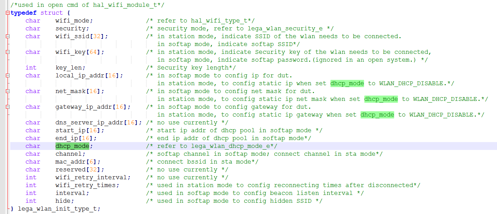

ASR5502X 系列开发常见问题
========================

前言
----

**关于本文档**

本文档旨在介绍 ASR5502X 系列芯片在开发中可能碰到的问题以及对这些问题的逐一解答。

**读者对象**

本文档主要适用于以下工程师：

-  单板硬件开发工程师
-  软件工程师
-  技术支持工程师

**产品型号**

本文档适用于所有 ASR IoT Wi-Fi芯片（5502X 系列）。

**版权公告**

版权归 © 2023 翱捷科技股份有限公司所有。保留一切权利。未经翱捷科技股份有限公司的书面许可，不得以任何形式或手段复制、传播、转录、存储或翻译本文档的部分或所有内容。

**商标声明**

ASR、翱捷和其他翱捷商标均为翱捷科技股份有限公司的商标。

本文档提及的其他所有商标名称、商标和注册商标均属其各自所有人的财产，特此声明。

**免责声明**

翱捷科技股份有限公司对本文档内容不做任何形式的保证，并会对本文档内容或本文中介绍的产品进行不定期更新。

本文档仅作为使用指导，本文的所有内容不构成任何形式的担保。本文档中的信息如有变更，恕不另行通知。

本文档不负任何责任，包括使用本文档中的信息所产生的侵犯任何专有权行为的责任。

**防静电警告**

静电放电（ESD）可能会损坏本产品。使用本产品进行操作时，须小心进行静电防护，避免静电损坏产品。

**翱捷科技股份有限公司**

地址：上海市浦东新区科苑路 399 号张江创新园 10 号楼 9 楼 邮编：201203

官网： http://www.asrmicro.com/

**文档修订历史**

+----------+------------+-----------------------------------------------------------------------------------------------+
| **日期** | **版本号** | **发布说明**                                                                                  |
+==========+============+===============================================================================================+
| 2019.10  | V1.0.0     | 首次发布。                                                                                    |
+----------+------------+-----------------------------------------------------------------------------------------------+
| 2020.09  | V1.1.0     | 删除2.3节，2.4节和2.6节。 新增\ `3.4 <#_lega_wlan_set_mac_address显示正确,_但是获取>`__\ 节。 |
+----------+------------+-----------------------------------------------------------------------------------------------+
| 2023.11  | V1.2.0     | 删除5505S相关内容。                                                                           |
+----------+------------+-----------------------------------------------------------------------------------------------+

1. 开发环境
-----------

1.1 SDK 支持哪些嵌入式系统？
~~~~~~~~~~~~~~~~~~~~~~~~~~~

支持 FreeRTOS。

1.2 开发支持哪些集成开发环境？
~~~~~~~~~~~~~~~~~~~~~~~~~~~~~~

支持 FreeRTOS 版本 SDK：支持在 Linux 和 Windows 环境下开发，用 Docker 工具开发编译。

1.3 交叉工具链用哪版？
~~~~~~~~~~~~~~~~~~~~~~

使用 GCC 编译器，交叉工具链使用 gcc-arm-none-eabi-5_4-2016q3-20160926-win32，ASR 基于此工具链深度定制 SDK。

1.4 如何下载镜像到开发板？
~~~~~~~~~~~~~~~~~~~~~~~~~~

-  研发开发时：使用 DOGO 工具，请参见文档\ *《ASR IoT芯片_DOGO烧录调试工具》*\ 。
-  工厂生产时：使用 MP_Pro 工具，请参见文档\ *《ASR IoT芯片_MP_Pro量产烧录工具使用说明》*\ 。

MP_Pro 和 DOGO 的区别在于，MP 支持一拖多同时烧录且单次烧录时间短，而 DOGO 工具仅支持单个芯片烧录，此外 DOGO 工具还支持一些调试功能。

1.5 是否可更改固件的烧录口？
~~~~~~~~~~~~~~~~~~~~~~~~~~~~

不可以，只能是 uart1。

1.6 软件有哪些调试手段？
~~~~~~~~~~~~~~~~~~~~~~~~

1. 依靠 UART 打印，加 log，加断言等。
2. 连接 J-LINK 调试。
3. 使用 ASR 提供的内嵌 coredump 功能，可借助工具抓取芯片及内存信息，详见\ *《ASR IoT芯片DOGO烧录调试工具》*\ 。
4. 使用 OS 自带的一些调试手段。

2. 平台
-------

2.1 5502X 内存、flash 等资源大小如何？
~~~~~~~~~~~~~~~~~~~~~~~~~~~~~~~~~~~~

内置 256 KB RAM，内置 2 MB Flash。

2.2 系统预留给用户使用的 RAM 有多少字节？
~~~~~~~~~~~~~~~~~~~~~~~~~~~~~~~~~~~~~~~

RAM 总大小 256 KB，Free RAM 的大小即为用户可使用的 RAM 大小，其值与系统及集成的功能相关。

-  目前 release SDK 的大致情况：

   FreeRTOS：除 freertos/lwip/asr wifi 协议栈后，用户可用约 130 KB

-  实际情况用户可以根据系统提供 API 或串口命令来获取其值：

   FreeRTOS：

   (1) 命令：vtasklist

   (2) 接口：MPU_xPortGetFreeHeapSize();

2.3 系统的 log 输出口是哪个？
~~~~~~~~~~~~~~~~~~~~~~~~~~~

系统 log 输出包括几个部分的 log，bootload/image/ate 通常情况下默认都是 uart1，但都可以通过软件来修改。

.. attention::
    bootload/ate 由 ASR 提供，用户不可修改。

3. Wi-Fi
--------

3.1 调用 wifi open 接口开启 STA 模式，连接不上路由器？
~~~~~~~~~~~~~~~~~~~~~~~~~~~~~~~~~~~~~~~~~~~~~~~~~~

在\ **FreeRTOS**\ 系统下，需要设置 DHCP，lega_wlan_init_type_t.dhcp_mode：

SDK 连接路由器支持动态获取IP地址以及静态配置IP地址，连接配置的参数也不一样，具体如下：

(1) 动态获取 IP 地址，参数 lega_wlan_init_type_t.dhcp_mode 必须要配置成 WLAN_DHCP\_ CLIENT

(2) 静态配置 IP 地址，参数 lega_wlan_init_type_t.dhcp_mode 必须要配置成 WLAN_DHCP\_ DISABLE，并且传入需要配置的静态 IP/NET MASK/GW/DNS 地址

所以没有配置 lega_wlan_init_type_t.dhcp_mode 且没有传入 IP/NET MASK/GW/DNS 地址是无法连接路由器的。

|image1|

3.2 低功耗有哪几种，其值多少？
~~~~~~~~~~~~~~~~~~~~~~~~~~~~~~

请参见文档\ *《ASR5502X系列_功耗管理模块指导书》*\ 。

3.3 RF 性能指标多少?
~~~~~~~~~~~~~~~~~~~

TX 及 RX 性能指标请参见\ *ASR550X Datasheet*\ 。

3.4 lega_wlan_set_mac_address 显示正确, 但是获取地址没变，是什么原因？
~~~~~~~~~~~~~~~~~~~~~~~~~~~~~~~~~~~~~~~~~~~~~~~~~~~~~~~~~~~~~~~~~~~~~

这种情况是由于 mac 地址在 efuse 中已存在，get 接口只会从 efuse 区域中获取。请检查 efuse 中是否已存在 mac 地址。

3.5 支持的格式有哪几种？
~~~~~~~~~~~~~~~~~~~~~~~~

支持11 b/g/n，单天线。

3.6 传输的最大速率多少，以及最大吞吐量？
~~~~~~~~~~~~~~~~~~~~~~~~~~~~~~~~~~~~~~~~

理论最大传输速率 72.2 Mbps @ 20 MHz，TCP 吞吐量 2 Mbps（bit per second）左右。

3.7 支持的模式有哪些？
~~~~~~~~~~~~~~~~~~~~~~

支持 Station、softAP、Sniffer 三种模式。

3.8 TCP/UDP 单包的最大数据长度是多少？
~~~~~~~~~~~~~~~~~~~~~~~~~~~~~~~~~~~~~

TCP 1460 字节，UDP 1472 字节。

3.9 SoftAP 支持最多几个 STA 设备同时连接？
~~~~~~~~~~~~~~~~~~~~~~~~~~~~~~~~~~~~~~~

默认最多支持 4 个设备同时连接，可通过软件配置。

A. 附录 - 相关资料
------------------

本文档中提到的参考信息总结如下：

1. 研发开发时使用 DOGO 工具，请参见文档\ *《ASR IoT芯片_DOGO烧录调试工具》*\ 。

   使用 ASR 提供的内嵌 coredump 功能，可借助工具抓取芯片及内存信息，详见\ *《ASR IoT芯片_DOGO烧录调试工具》*\ 。

2. 工厂生产时使用 MP_Pro 工具，请参见文档\ *《ASR IoT芯片_MP_Pro量产烧录工具使用说明》*\ 。

3. 请参见文档\ *《ASR5502X系列_功耗管理模块指导书》*\ 。

4. TX 及 RX 性能指标请参见\ *ASR550X Datasheet*\ 。

