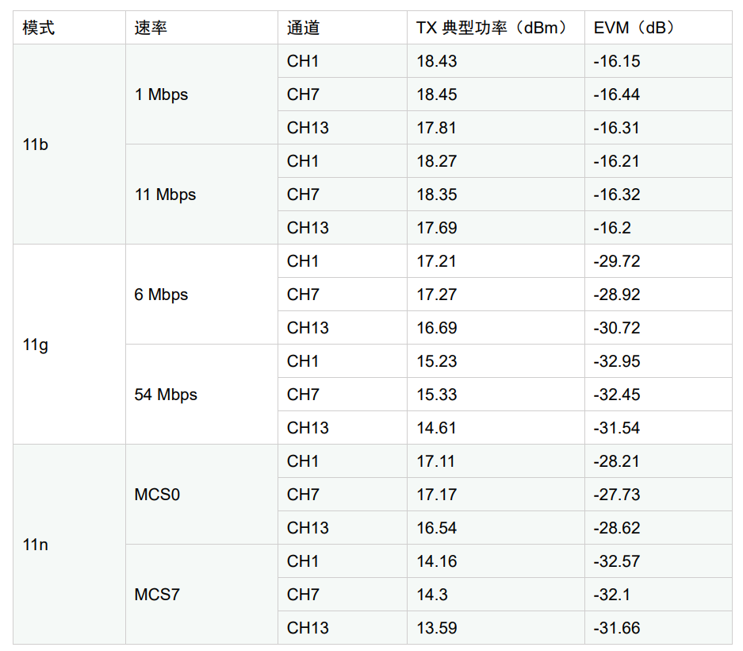
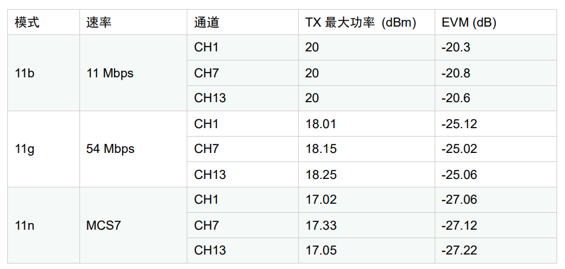
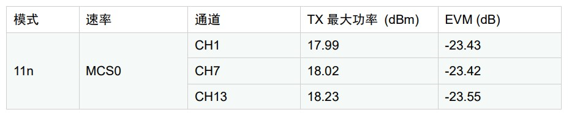
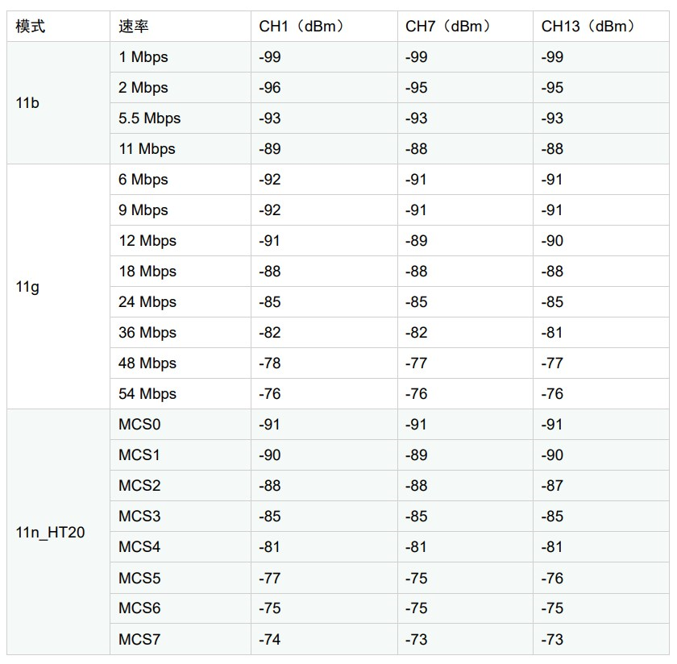
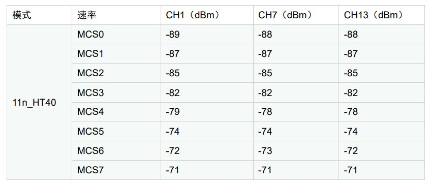

ASR5502X Wi-Fi 射频性能报告
========================

前言
----

**关于本文档**

本文档旨在提供 ASR IoT Wi-Fi 芯片 ASR5502X 的 Wi-Fi 射频性能测试报告。

**产品型号**

本文档适用于ASR IoT Wi-Fi 芯片 ASR5502X。

**版权公告**

版权归 © 2023 翱捷科技股份有限公司所有。保留一切权利。未经翱捷科技股份有限公司的书面许可，不得以任何形式或手段复制、传播、转录、存储或翻译本文档的部分或所有内容。

**商标声明**

ASR、翱捷和其他翱捷商标均为翱捷科技股份有限公司的商标。

本文档提及的其他所有商标名称、商标和注册商标均属其各自所有人的财产，特此声明。

**免责声明**

翱捷科技股份有限公司对本文档内容不做任何形式的保证，并会对本文档内容或本文中介绍的产品进行不定期更新。

本文档仅作为使用指导，本文的所有内容不构成任何形式的担保。本文档中的信息如有变更，恕不另行通知。

本文档不负任何责任，包括使用本文档中的信息所产生的侵犯任何专有权行为的责任。

**翱捷科技股份有限公司**

地址：上海市浦东新区科苑路399号张江创新园10号楼9楼 邮编：201203

官网： http://www.asrmicro.com/

**文档修订历史**

======= ====== ========
日期    版本号 发布说明
======= ====== ========
2023.04 V1.0.0 首次发布
======= ====== ========

1. Wi-Fi TX 典型功率测试
---------------------

采用ASR5502X_SDCARD测试，通过板上SMA连接器和测试仪器互联，测试时进行线损补偿。

.. raw:: html

   

|image1|

.. raw:: html

   

2. Wi-Fi TX 最大功率测试
----------------

采用 ASR5502X_SDCARD 测试，通过板上 SMA 连接器和测试仪器互联，测试时进行线损补偿。

.. raw:: html

   

|image2|

.. raw:: html

   

.. raw:: html

   

|image3|

.. raw:: html

   

2. Wi-Fi RX 灵敏度测试
----------------

采用ASR5502X_SDCARD测试，通过板上SMA连接器和测试仪器互联，测试时进行线损补偿。

.. raw:: html

   

|image4|

.. raw:: html

   

.. raw:: html

   

|image5|

.. raw:: html

   

