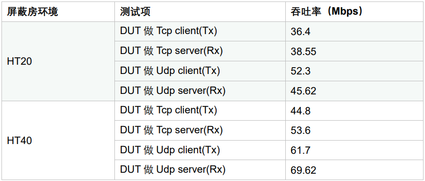

ASR5505S 吞吐率测试报告
=======================

前言
----

**关于本文档**

本文档旨在提供 Wi-Fi 芯片 ASR5505S（48 pin）的吞吐率测试报告。

**产品型号**

与本文档相对应的产品型号如下：

============ ============ ======== =================
**产品型号** **协议**     **接口** **封装**
============ ============ ======== =================
ASR5505S     802.11 b/g/n SDIO 2.0 QFN 48，6mm × 6mm
============ ============ ======== =================

**版权公告**

版权归 © 2023 翱捷科技股份有限公司所有。保留一切权利。未经翱捷科技股份有限公司的书面许可，不得以任何形式或手段复制、传播、转录、存储或翻译本文档的部分或所有内容。

**商标声明**

ASR、翱捷和其他翱捷商标均为翱捷科技股份有限公司的商标。

本文档提及的其他所有商标名称、商标和注册商标均属其各自所有人的财产，特此声明。

**免责声明**

翱捷科技股份有限公司对本文档内容不做任何形式的保证，并会对本文档内容或本文中介绍的产品进行不定期更新。

本文档仅作为使用指导，本文的所有内容不构成任何形式的担保。本文档中的信息如有变更，恕不另行通知。

本文档不负任何责任，包括使用本文档中的信息所产生的侵犯任何专有权行为的责任。

**翱捷科技股份有限公司**

地址：上海市浦东新区科苑路399号张江创新园10号楼9楼 邮编：201203

官网： http://www.asrmicro.com/

**文档修订历史**

======= ====== ==========
日期    版本号 发布说明
======= ====== ==========
2023.02 V1.0.0 首次发布。
======= ====== ==========

1. SDIO 模式吞吐率测试
----------------------

1.1 吞吐率测试环境
~~~~~~~~~~~~~~~~~~

（1） 测试全程在屏蔽房中进行；

（2） 测试环境搭建如下图，PC 与（ASR550X+1826）开发板进行吞吐率测试。

.. raw:: html

   

|image1|

.. raw:: html

   

1.2 软件环境
~~~~~~~~~~~~

PC 操作系统版本为 Windows 7，iperf 版本为 2.0.5。

1826 开发板的系统版本为 openwrt-BB，iperf 版本为 2.0.5。

ASR5505S Wi-Fi firmware 跑在 SRAM。

1.3 测试数据（一分钟吞吐率测试）
~~~~~~~~~~~~~~~~~~~~~~~~~~~~~~~~

.. raw:: html

   

|image2|

.. raw:: html

   

.. |image1| image:: ../../img/5505S_吞吐率测试报告/图1-1.png
