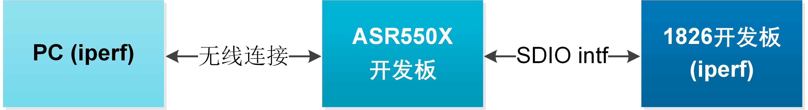
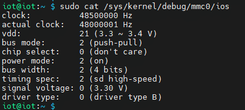
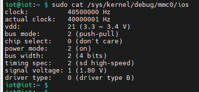
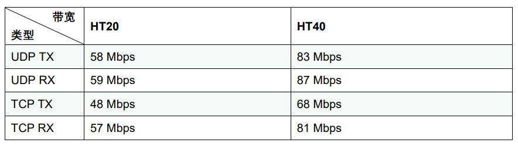
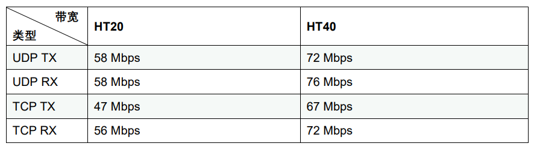

ASR5505S吞吐率测试报告
======================

前言
----

**关于本文档**

本文档旨在提供Wi-Fi芯片ASR5505S的吞吐率测试报告。

**读者对象**

本文档主要适用于以下工程师：

-  单板硬件开发工程师

-  软件工程师

-  技术支持工程师

**产品型号**

与本文档相对应的产品型号如下：

======== ============ ======== =================
产品型号 协议         接口     封装
======== ============ ======== =================
ASR5505S 802.11 b/g/n SDIO 2.0 QFN 48，6mm × 6mm
======== ============ ======== =================

**版权公告**

版权归 © 2023 翱捷科技股份有限公司所有。保留一切权利。未经翱捷科技股份有限公司的书面许可，不得以任何形式或手段复制、传播、转录、存储或翻译本文档的部分或所有内容。

**商标声明**

ASR、翱捷和其他翱捷商标均为翱捷科技股份有限公司的商标。

本文档提及的其他所有商标名称、商标和注册商标均属其各自所有人的财产，特此声明。

**免责声明**

翱捷科技股份有限公司对本文档内容不做任何形式的保证，并会对本文档内容或本文中介绍的产品进行不定期更新。

本文档仅作为使用指导，本文的所有内容不构成任何形式的担保。本文档中的信息如有变更，恕不另行通知。

本文档不负任何责任，包括使用本文档中的信息所产生的侵犯任何专有权行为的责任。

**翱捷科技股份有限公司**

地址：上海市浦东新区科苑路399号张江创新园10号楼9楼 邮编：201203

官网： http://www.asrmicro.com/

**文档修订历史**

======= ====== ==========
日期    版本号 发布说明
======= ====== ==========
2023.11 V1.0.0 首次发布。
======= ====== ==========

1. 测试说明
-----------

1.1 测试方法和注意事项
~~~~~~~~~~~~~~~~~~~~~~

**测试方法**

(1) 辅助路由器拆开外壳，将两个 2.4G 天线口通过射频线连接至衰减器，在衰减器另一端拧上棒状天线，详见测试拓扑图

(2) 辅助路由器放置在屏蔽箱内，设置成 11b/g/n mode，OPEN 加密，信道 11，带宽 20/40 MHz，并通过网线连接上辅助 Windows PC

(3) ASR5505S 开发板通过 SD 转 TF 转接卡连接在树莓派TF卡槽上，一起放置在屏蔽箱内；树莓派通过有线网口接入公司网络，以便通过 SSH 远程连接操作树莓派

(4) 在树莓派上启动 wpa_supplicant，使开发板进入 STA mode，并连接上辅助路由器，获得 IP 地址

(5) 在树莓派和 Windows PC 上分别运行 iperf3 的 client 和 server，开始测试吞吐率

**注意事项**

-  在测试开始前，适当调整衰减器的衰减值，使待测开发板的 RSSI 在- 30 dBm 左右。

-  在测试时，保持屏蔽箱关紧状态。

1.2 测试设备
~~~~~~~~~~~~

======== ======================================= ========
**序号** **测试设备**                            **数量**
======== ======================================= ========
1        屏蔽箱（型号：HBTE-SB-MNNF-6-70-60511） 1
2        树莓派（Raspberry Pi 4B）               1
3        Windows PC（Windows 10）                1
4        辅助路由器（华硕RT-AX82U）              1
5        KT3.0-90/1S-2S可调衰减器                1
6        ASR5505S开发板                          1
======== ======================================= ========

1.3 测试环境
~~~~~~~~~~~~

测试是在屏蔽箱中进行的，树莓派和待测开发板，辅助路由器和衰减器放置在屏蔽箱内；Windows PC放置在屏蔽箱外即可。

.. raw:: html

   

|image1|

.. raw:: html

   

1.4 SDIO工作电压和时钟频率设置
~~~~~~~~~~~~~~~~~~~~~~~~~~~~~~

ASR5505S 开发板是 SDIO 接口的。吞吐率数据分别在 SDIO 3.3V clock=48 MHz 和 1.8V clock=40 MHz 工况下测试，得出这两种工况下的测试数据。

SDIO 的工作电压和时钟频率由树莓派的 kernel image 和 dtb 文件决定，如上两种工况的树莓派系统文件由 ASR 开发人员提供。

测试时需要注意的是，ASR5505S 开发板的跳冒电压要与树莓派的设置相同，树莓派配置在 3.3 V 时，开发板就切到 3.3 V；树莓派配置在 1.8 V 时，开发板就切到 1.8 V。

在树莓派上可以使用 sudo cat /sys/kernel/debug/mmc0/ios 命令查看 SDIO 信息，关注参数“actual clock”和“signal voltage”。

.. raw:: html

   

|image2|

.. raw:: html

   

.. raw:: html

   

|image3|

.. raw:: html

   

1.5 iperf3 打流测试命令
~~~~~~~~~~~~~~~~~~~~~~

使用 iperf3 测试吞吐率数据：

“192.168.50.181” 是辅助路由器给 Windows PC 分配的 IP 地址，

”192.168.50.16” 是树莓派通过 ASR5505S 开发板获得的 IP 地址，

如下 iperf3 测试命令，第一条在树莓派上运行，第二条在 Windows PC 上运行。

**UDP TX:**

iperf3 -c 192.168.50.181 -i 1 -t 60 -b 120M -u -p 5555

iperf3 -s -i 1 -p 5555

**UDP RX:**

iperf3 -s -i 1 -p 6666

iperf3 -c 192.168.50.16 -i 1 -t 60 -b 120M -u -p 6666 -l 1460

**TCP TX:**

iperf3 -c 192.168.50.181 -i 1 -t 60 -p 7777

iperf3 -s -i 1 -p 7777

**TCP RX:**

iperf3 -s -i 1 -p 8888

iperf3 -c 192.168.50.16 -i 1 -t 60 -p 8888

2. 测试数据
-----------

**吞吐率数据（3.3 V，48 MHz）**

.. raw:: html

   

|image4|

.. raw:: html

   

**吞吐率数据（1.8 V，40 MHz）**

.. raw:: html

   

|image5|

.. raw:: html

   

