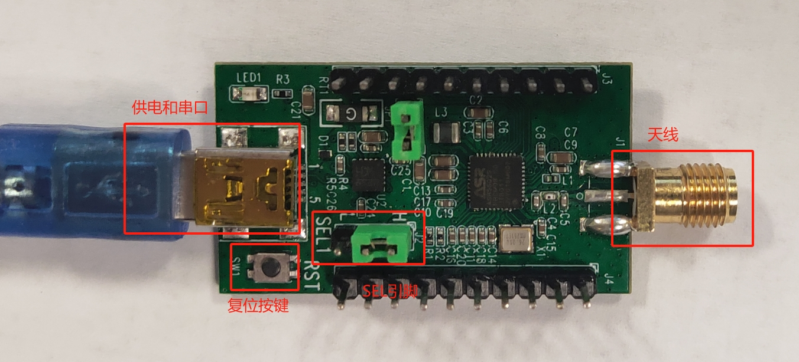
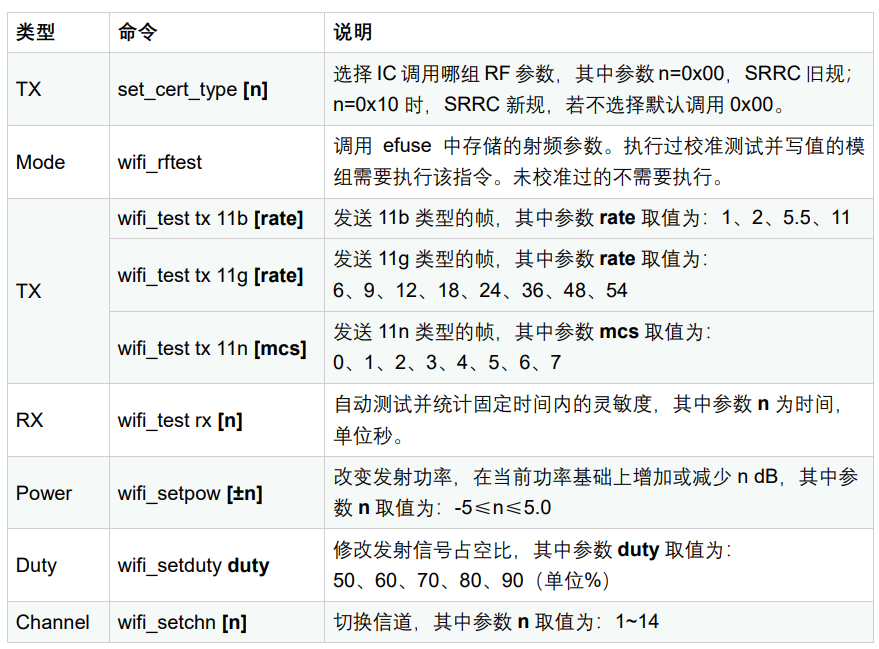
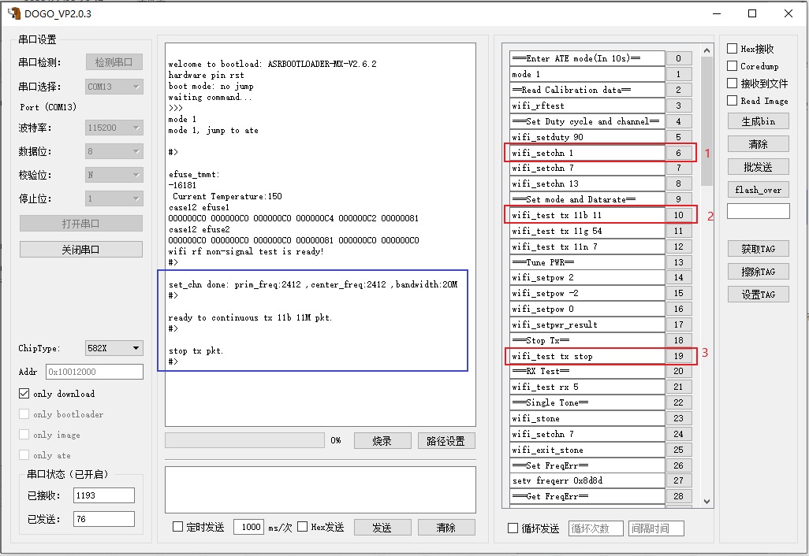
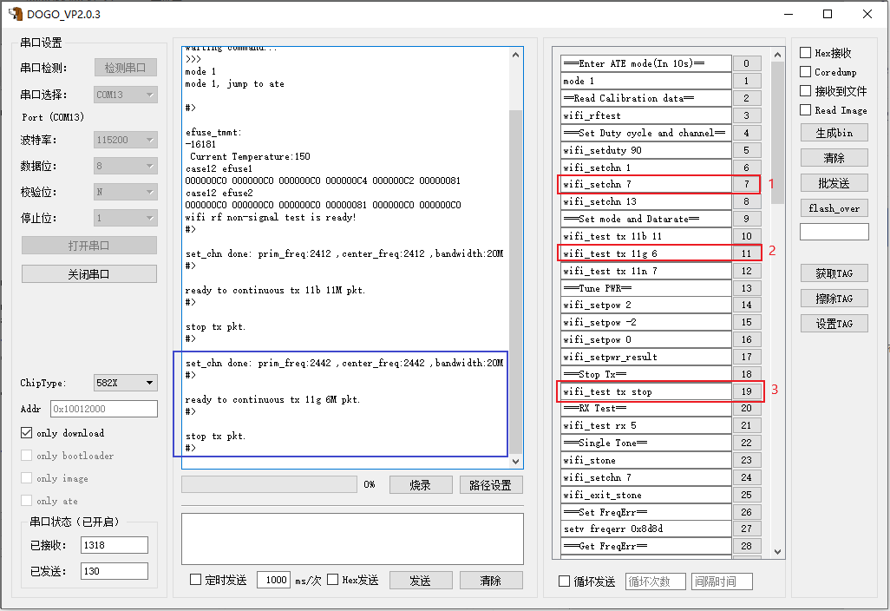
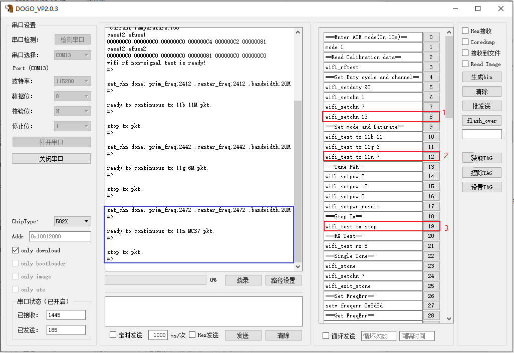
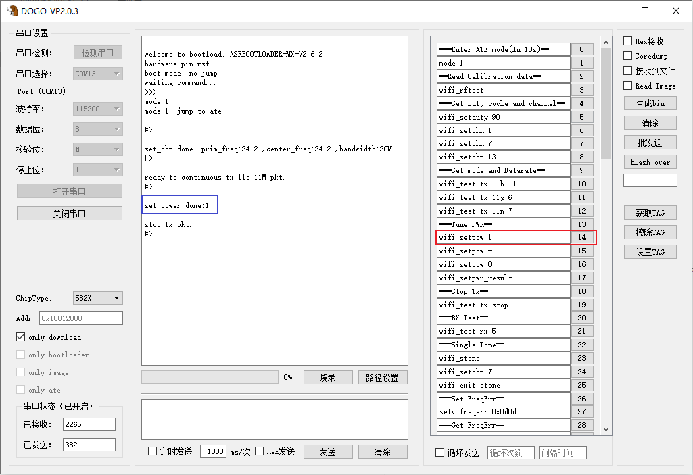
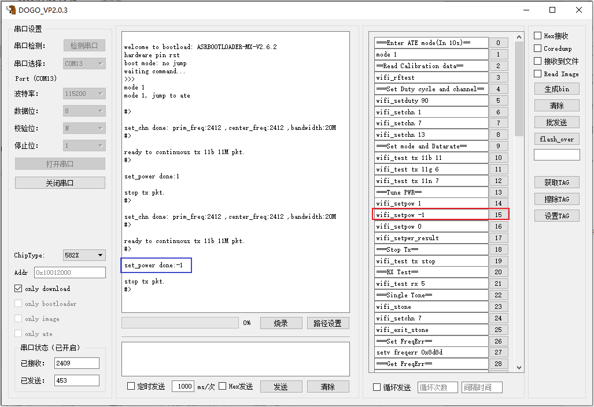
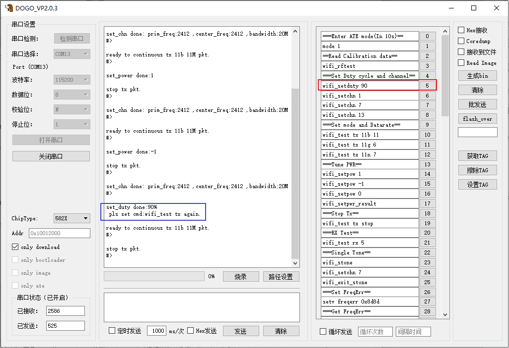
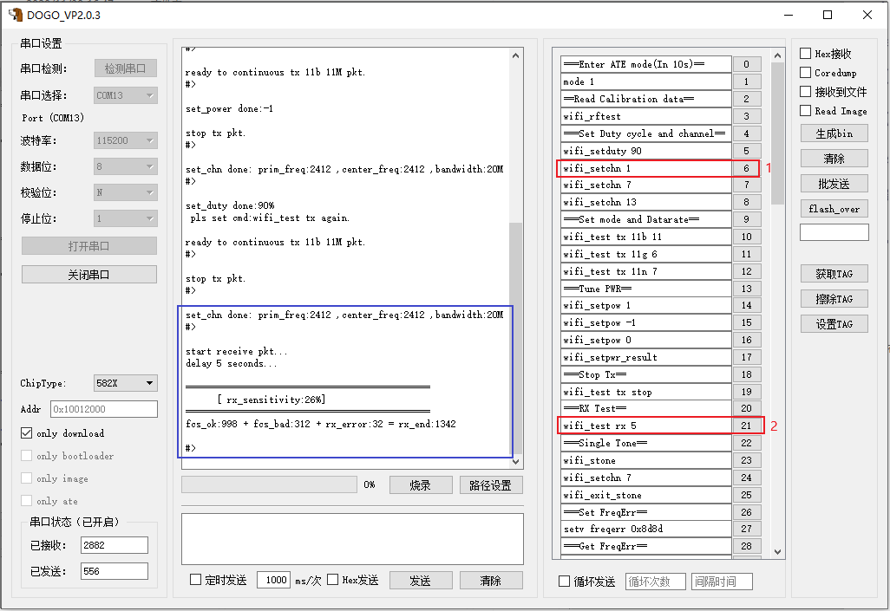

ASR550X 系列射频测试指南
=========================

前言
----

**关于本文档**

本文档旨在介绍 ASR5502X 系列 Wi-Fi 芯片射频测试的相关内容，包括环境搭建，TX/RX 测试的命令格式和测试流程等。

**产品型号**

本文档适用于 ASR IoT 5502X 系列 Wi-Fi 芯片。

**版权公告**

版权归 © 2023 翱捷科技股份有限公司所有。保留一切权利。未经翱捷科技股份有限公司的书面许可，不得以任何形式或手段复制、传播、转录、存储或翻译本文档的部分或所有内容。

**商标声明**

ASR、翱捷和其他翱捷商标均为翱捷科技股份有限公司的商标。

本文档提及的其他所有商标名称、商标和注册商标均属其各自所有人的财产，特此声明。

**免责声明**

翱捷科技股份有限公司对本文档内容不做任何形式的保证，并会对本文档内容或本文中介绍的产品进行不定期更新。

本文档仅作为使用指导，本文的所有内容不构成任何形式的担保。本文档中的信息如有变更，恕不另行通知。

本文档不负任何责任，包括使用本文档中的信息所产生的侵犯任何专有权行为的责任。

**文档修订历史**

======= ====== =========================
日期    版本号 发布说明
======= ====== =========================
2020.09 V1.8.0 更新 TX/RX 命令的相关描述。
======= ====== =========================

1. 概述
-------

为了让用户快速地了解 Wi-Fi 芯片 ASR5502X 的 RF 性能，本文基于 ASR 提供的 ATE 测试 image（ate.bin）来介绍对 RF TX/RX 性能的测试方法。用于检验芯片焊接到 PCB 上后的射频性能。

测试所用的工具，可使用推荐的RF测试工具 DOGO，也可以使用通用串口工具，如 sscom。

在进行测试前，用户需要对 Wi-Fi 通信协议 802.11 有基本的了解。可参考Wi-Fi协议介绍：*《802.11-2012》*。

一定要在屏蔽房内测试 RX 性能，并保证空间没有 2.4G 信号频段干扰。

2. 测试内容
-----------

=================== ==================================================
**RF** **测试类别** **描述**
=================== ==================================================
TX                  可配置并发送不同速率（b/g/n) 下，不同模式的帧
RX                  可统计固定时间内接收到的帧数量，并计算出接收灵敏度
=================== ==================================================

3. 环境搭建
-----------

以 ASR5502X EVB 为例，其主要接口如图所示，天线端接无线测试仪，串口和电源端接 USB type-B，开关以图为例，向左为开，向右为关。

.. raw:: html

   

|image1|

.. raw:: html

   

3.1 RF测试硬件搭建
~~~~~~~~~~~~~~~~~~

ASR5502X EVB 与 PC 端和测试仪连接的方式如图所示：

.. raw:: html

   

|image2|

.. raw:: html

   

(1) ASR5502X 通过串口和 PC 连接，用户通过 PC 的测试工具（DOGO 或 sscom 等）向 ASR5502X 发送命令。

(2) ASR5502X 通过射频同轴线缆连接到无线测试仪器。

(3) 测试发射性能时，用户通过 PC 的测试工具向 ASR5502X 发送命令，ASR5502X 支持发射不同信道、速率的信号，通过测试仪器检测发送出的信号性能。测试接收性能时，测试仪器发射不同速率、功率的信号，ASR5502X 接收到信号，并将接收的所有帧进行统计并分析，将 RX 灵敏度和帧统计信息通过 PC 端的工具（DOGO 或 sscom 等）反馈出来。

3.2 RF 测试软件搭建
~~~~~~~~~~~~~~~~~~

烧录 bootloader.bin 及 ate.bin，具体烧录方法请参考文档 `ASR IoT 芯片 DOGO 烧录调试工具 <https://pan.baidu.com/s/1HLy_Hg2e2e1fufuiS_Xgag?pwd=gup3>`_。

调试板上电后按 复位键 进入 bootloader 模式，串口输出 ”waiting command…>>>” 之后，在 10 秒内输入\ ``mode 1`` 命令，程序从 bootloader 跳进 ATE 模式，成功跳入 ATE 模式后，串口会输出 ”#>”，表示可以进行后续的 TX/RX 测试。第\ *4*\ 、\ *5*\ 章对 TX/RX 测试作了详细阐述。

打开无线测试仪，进行相应的配置，并调整仪器状态，然后就可以抓取 ASR5502X 发出的帧或者向 ASR5502X 发送帧了。此步骤需要视具体仪器而定，在此不作赘述。

3.3 常规命令说明
~~~~~~~~~~~~~~~~

.. raw:: html

   

|image3|

.. raw:: html

   

4. TX测试
---------

4.1 11b 测试命令格式
~~~~~~~~~~~~~~~~~~~~

命令格式：\ ``wifi_test tx 11b [rate]``

其中参数 rate 表示速率，取值范围为 1、2、5.5、11,

报文头类型默认为 long preamble，默认长度为 1000 bytes。

以 11b 11M 为例，TX 测试流程如下：

\ ``wifi_setchn 1`` 
设置测试信道 1，数字 1~13 表示对应的信道

\ ``wifi_test tx 11b 11``
设置 11b 11M 速率发射，若测试 1M 速率，则改为1

\ ``wifi_test tx stop`` 
停止调制波发射

.. raw:: html

   

|image4|

.. raw:: html

   

4.2 11g 测试命令格式
~~~~~~~~~~~~~~~~~~~~

命令格式：\ ``wifi_test tx 11g [rate]``

其中参数 rate 表示速率，取值为 6、9、12、18、24、36、48、54。

报文头类型默认为 long preamble，默认长度为 1024 bytes。

以 11g 6M 为例，TX 测试流程如下：

\ ``wifi_setchn 7``
设置测试信道 7，数字 1~13 表示对应的信道

\ ``wifi_test tx 11g 6`` 
测试 11g 6M 速率发射，若测试 54M 速率，则改为54

\ ``wifi_test tx stop``  
停止调制波发射

.. raw:: html

   

|image5|

.. raw:: html

   

4.3 11n 测试命令格式
~~~~~~~~~~~~~~~~~~~~

命令格式：\ ``wifi_test tx 11n [mcs]``

其中参数 mcs 表示调制方式，取值范围 0~7。

modulation format 默认为 mf（mix field）。

报文头类型默认为 long preamble，默认长度为 4096 bytes。

以 11n mcs7 为例，TX 测试流程如下：

\ ``wifi_setchn 13``
设置测试信道 13，数字 1~13 表示对应的信道

\ ``wifi_test tx 11n 7`` 
测试 11n mcs7 速率发射，若测试 mcs 0 速率，则改为 0

\ ``wifi_test tx stop`` 
停止调制波发射

.. raw:: html

   

|image6|

.. raw:: html

   

4.4 改变发射功率
~~~~~~~~~~~~~~~~

如果需要改变默认发射功率，可用命令：\ ``wifi_setpow ±n``。需注意以下两点：

1. **命令调用顺序**

可执行完下述的前两条 TX 测试命令后，再执行\ ``wifi_setpow ±n`` 命令，例如：

\ ``wifi_setchn 1``

\ ``wifi_test tx 11b 11``

\ ``wifi_setpow ±n``

2. **命令格式**

当输入 +n 时，“+” 可以省略；当输入 -n 时，“-” 不能省略。

n 可取整数或小数，0 表示默认功率。

例如，若要增加 1 dB 功率，则输入命令\ ``wifi_setpow 1``，如图；

.. raw:: html

   

|image7|

.. raw:: html

   

若要减小 1 dB 功率，则输入命令\ ``wifi_setpow -1``，如图。

.. raw:: html

   

|image8|

.. raw:: html

   

.. attention::
    输入一次命令对所有模式下的所有信道皆生效。多次执行不会累加，掉电失效。
    若当前功率为 16 db，如需要增加 2 dB，可使用\ ``wifi_setpow 2``，而不是执行两次\ ``wifi_setpow 1``。

4.5 改变发射占空比
~~~~~~~~~~~~~~~~~~

命令\ ``wifi_setduty`` 的后缀参数用来修改发射信号占空比，其中参数取值为： 50、60、70、80、90，单位为%。例如：

\ ``wifi_setduty 50`` 表示设置 50% 占空比

\ ``wifi_setduty 90`` 表示设置 90% 占空比

当执行完\ ``wifi_setduty`` 命令之后，需要重新发送执行速率的命令才能生效，例如：

\ ``wifi_setchn 1``

\ ``wifi_setduty 90``

\ ``wifi_test tx 11b 11``

.. raw:: html

   

|image9|

.. raw:: html

   

5. RX测试
---------

RX 状态兼容 b/g/n 模式，只需要设置接收信道，无需设置模式。

5.1 测试命令格式
~~~~~~~~~~~~~~~~

命令\ ``wifi_test rx n``：

其中参数 n 为时间，单位为秒，用以统计固定时间内收到的帧数量，可通过适当修改 n 的值，以适用不同的速率。

以无线测试仪在 channel 6 上发送帧为例，RX 测试流程如下：

\ ``wifi_rftest`` 如果前面有执行过此指令，此处可省略

\ ``wifi_setchn 6`` 设置信道 6，可设置从 1~13 信道

\ ``wifi_test rx 5`` 等待 5 秒，等待 VSG 端发送数据包

**示例：**\ 将综测仪作为信号发生器（VSG），在 channel 1 发送 11b，速率为 11M，包长为 1000 的帧，其操作步骤如下：

Step1：wifi_setchn 1；

Step2：wifi_test rx 5；

Step3：VSG 端执行发包操作；

Step4：等待 Step2 的时间执行完后将统计的结果打印出来。

.. raw:: html

   

|image10|

.. raw:: html

   

.. raw:: html

   

============== =================== =================
**名称**       **描述**            **备注**
============== =================== =================
rx_sensitivity 实际丢包率          11b≤8%，11g/n≤10%
rx_end         所有检测到帧的总数  
Fcs_ok         fcs 检验正确的帧个数 
Fcs_bad        fcs 检验错误的帧个数 
rx_error       无法解调的帧个数    
============== =================== =================

RX返回值意义说明

.. raw:: html

   

从图中“rx_sensitivity:26%”可以看出，其丢包率为 26%，大于标准的 8%，不符合要求。

5.2 寻找最小灵敏度的测试步骤
~~~~~~~~~~~~~~~~~~~~~~

确保测试所在环境没有 2.4G 附近信号频段干扰后，按如下步骤进行测试。

(1) 先将无线测试仪配置成高功率，再执行以下两条命令：

  \ ``wifi_setchn 1``

  \ ``wifi_test rx 5``

(2) 查看串口返回的 log 信息（对照表5-1）。

(3) 然后将无线测试仪配置成稍低功率，再执行以下两条命令：

  \ ``wifi_setchn 1``

  \ ``wifi_test rx 5``

(4) 逐渐降低无线测试仪的发射功率，重复以上两条命令，以趋进极限灵敏度值，并记录满足要求的灵敏度值。

6. 模式切换注意事项
-------------------

1. 系统上电自动进入 bootloader 模式后，在进行 RF 测试前，需要在上电 \ *10 秒内* 输入 **mode 1** 以进入 ATE 模式，否则系统会自动从 bootloader 模式跳入 APP 程序。

2. 如果要重新开始 RF 测试，需要重新上电并按步骤进入 ATE 模式后，再重新进行测试。

A. 附录 - 相关文档
------------------

本文档中提到的参考信息总结如下：

1. Wi-Fi 协议介绍：\ *《802.11-2012 》* 。
2. 烧录 bootloader.bin 及 ate.bin，具体烧录方法请参考文档 `ASR IoT 芯片 DOGO 烧录调试工具 <https://pan.baidu.com/s/1HLy_Hg2e2e1fufuiS_Xgag?pwd=gup3>`_。

