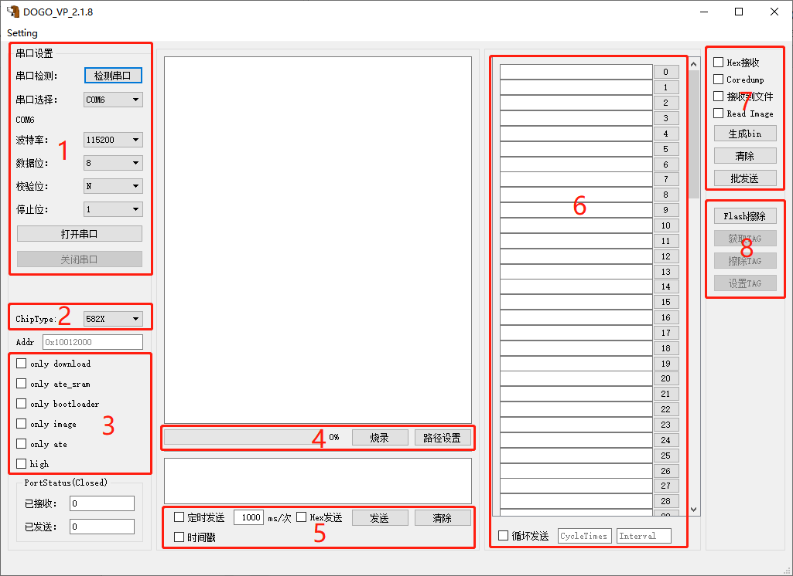
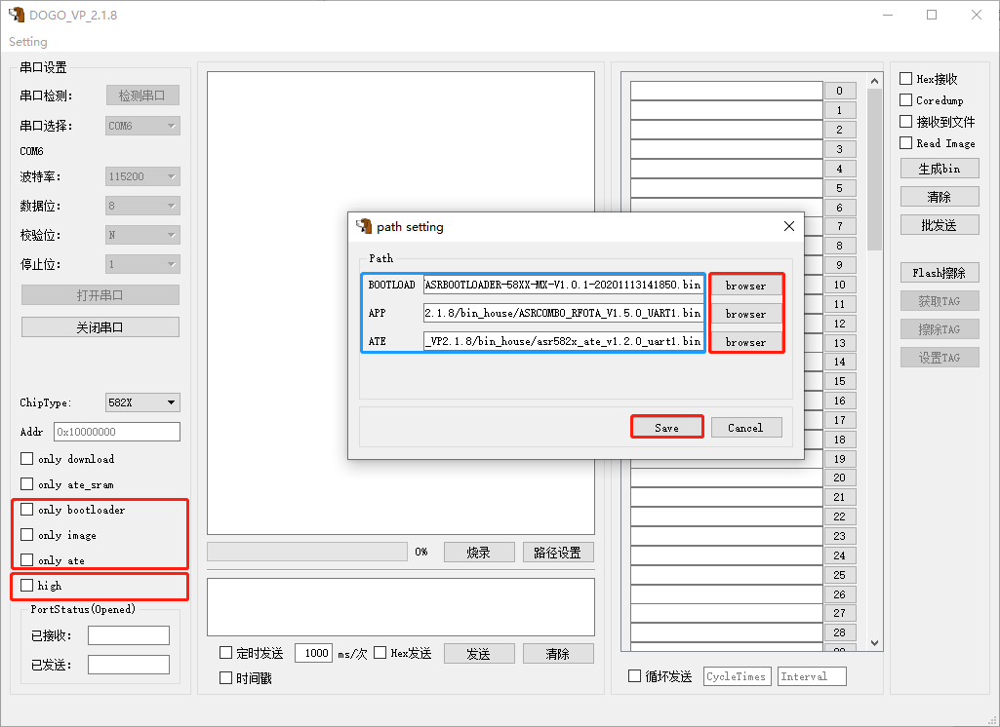
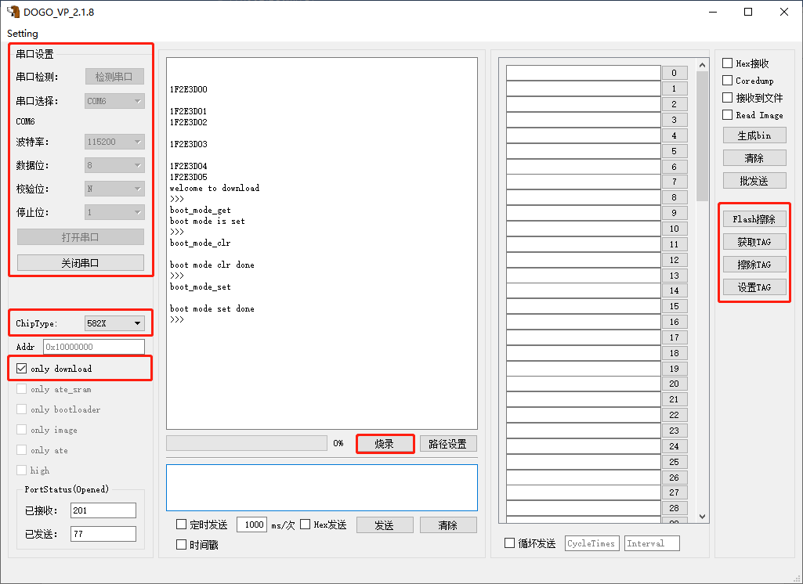
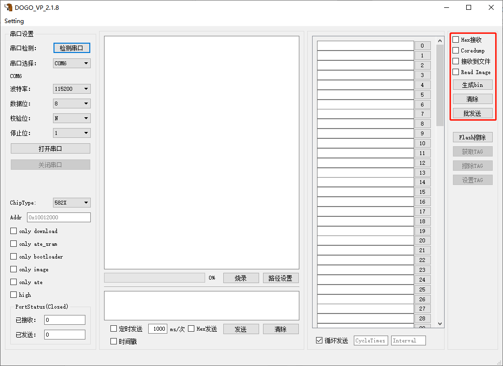

ASR IoT 芯片 DOGO 烧录调试工具
==============================
`English <https://asriot.readthedocs.io/en/latest/ASR550X/Download-Tool/ASR_IoT_DOGO_Tool_User_Guide.html>`_

前言
----

**关于本文档**

本文档旨在介绍 ASR IoT 芯片开发所用的 DOGO 烧录调试工具的配置与操作。

**产品型号**

本文档适用于ASR IoT芯片（Wi-Fi SoC，BLE SoC和Wi-Fi+BLE Combo SoC）。

**版权公告**

版权归 © 2023 翱捷科技股份有限公司所有。保留一切权利。未经翱捷科技股份有限公司的书面许可，不得以任何形式或手段复制、传播、转录、存储或翻译本文档的部分或所有内容。

**商标声明**

ASR、翱捷和其他翱捷商标均为翱捷科技股份有限公司的商标。

本文档提及的其他所有商标名称、商标和注册商标均属其各自所有人的财产，特此声明。

**免责声明**

翱捷科技股份有限公司对本文档内容不做任何形式的保证，并会对本文档内容或本文中介绍的产品进行不定期更新。

本文档仅作为使用指导，本文的所有内容不构成任何形式的担保。本文档中的信息如有变更，恕不另行通知。

本文档不负任何责任，包括使用本文档中的信息所产生的侵犯任何专有权行为的责任。

**翱捷科技股份有限公司**

地址：上海市浦东新区科苑路399号张江创新园10号楼9楼 邮编：201203

官网： http://www.asrmicro.com/

**文档修订历史**

======= ====== ================
日期    版本号 发布说明
======= ====== ================
2023.08 V1.8.0 修改了部分描述。
======= ====== ================

1. 概述
-------

1.1 DOGO 界面示例
~~~~~~~~~~~~~~~~~

图1-1为专用于 ASR IoT 芯片的烧录调试工具 DOGO 的界面示例。

.. raw:: html

   

|image1|

.. raw:: html

   

1. **串口设置区**\ ：选择对应的下载及调试串口号并设置相关参数。

2. **芯片选择区**\ ：选择需要操作的芯片型号。

3. **烧录选项区**\ ：选择烧录操作的具体选项，结合烧录路径区进行操作。

4. **烧录路径区**\ ：选择待烧录的文件路径、启动烧录以及显示烧录进度。

5. **发送操作区**\ ：可选择\ **定时发送**\ 、\ **Hex发送**\  以及\ **清除**\ 发送信息。

6. **批量指令区**\ ：此区域可保存常用操作指令，点击文本框中右侧序号按钮可直接发送前面的指令。也可以勾选\ **循环发送**\ 选项，按照设置的间隔和次数，循环发送该区域的所有命令。点击区域7的\ **批发送**\ 按钮可显示/隐藏此区域。

7. **辅助调试区**\ ：此区域可将接收区域显示的日志保存到文件以及通过相关指令读取Flash中的信息并保存到文件等。

8. **快捷指令区**\ ：支持 Flash 擦除以及 Tag 相关操作。

1.2 DOGO 支持的功能
~~~~~~~~~~~~~~~~~~~

DOGO烧录调试工具支持如下功能：

-  **串口调试功能**\ ：支持串口 AT 命令的交互，支持 Hex 显示和导出 log 到文件。

-  **程序烧录功能**\ ：

   -  **一键烧录固件功能**\ ：该功能用于多个固件连续烧录。选择路径后，点击\ **烧录**\ ，即可完成一键烧录。

   -  **烧录指定固件功能**\ ：仅选择需要烧录的固件的路径或者全部路径选择后在烧录选项区勾选指定固件的选项。

-  **指令批量发送功能**\ ：点击界面上\ **批发送**\ 按钮可显示/隐藏\ **批量指令区**\ 。在文本框中输入指令，点击右侧序号按钮即可发送。

-  **Only Download模式**\ ：该模式下可擦除 Flash 以及获取、设置或擦除 Tag。

2. 使用说明
-----------

.. _dogo-界面示例-1:

2.1 程序烧录功能
~~~~~~~~~~~~~~~~~

以 ASR582X 系列 Demo 板为例，程序烧录的步骤如下：

1. 将 Demo 板设置为下载模式，此模式的设置通过下图中红色矩形框处的跳帽接法来实现。连接好 PC 端串口及电源，打开电源开关，红色指示灯亮。

.. raw:: html

   

|image2|

.. raw:: html

   

2. 在 DOGO 界面中，选择对应的串口号，设置参数并打开串口。

3. \ **ChipType**\ 下拉选项根据实际需求选择对应芯片类型。

.. raw:: html

   

|image3|

.. raw:: html

   

4. 选择烧录文件。点击\ **路径设置**\ ，弹出小窗口后，点击对应的\ **browser**\ 进入目录，选择待烧录的 bin 文件，点击\ **Save**\ 关闭小窗口。

.. attention::
    1. 若三个 bin 文件的路径都被选择，工具默认一键烧录这三个文件，若仅需烧录其中某一文件，可只选择对应的路径。   
    2. 若三个 bin 文件的路径都被选择，但其实只需要烧录其中某一文件，则可在操作区勾选对应的选项框（only …）。

.. raw:: html

   

|image4|

.. raw:: html

   

5. 若勾选\ **High**\ 选项可进入高速烧录模式，要求串口支持1 Mbps 的速率。若不勾选则为普通速率烧录模式。

6. 按下Demo板\ **复位**\ 按钮（图中红色椭圆框），待工具接收窗口显示\ **“1F2E3D00”**\ 后，点击DOGO左下角的\ **烧录**\ 按钮，开始烧录。

7. 待进度条达到100%后，即表示 bin 文件烧录完成，关闭 Demo 板电源。此时将上文图中红色矩形框处的跳冒移至下图位置，进入运行模式。再打开电源开关，红色指示灯亮，系统正常运行时 DOGO 串口接收窗口中可以显示日志信息。

.. raw:: html

   

|image5|

.. raw:: html

   

2.2 TAG设置功能
~~~~~~~~~~~~~~~

Tag 设置的操作步骤如下：

1. Demo 板设置为下载模式，并接通电源。

2. 选择对应串口号、设置参数并打开串口。

3. 选择对应型号芯片，按下 Demo 板上的\ **复位**\ 按钮，窗口显示 \ **“1F2E3D00”**\ 。

4. 勾选\ **only download**\ 选项。点击\ **烧录**\ 按钮。

5. 操作右侧 Tag 选项：\ **获取TAG**\ 、\ **擦除TAG**\ 、\ **设置TAG**\ 。

.. attention::
    在\ **only download**\ 模式下，也可进行 Flash 擦除操作，请谨慎操作，避免误点\ **Flash擦除\ **按钮。

.. raw:: html

   

|image6|

.. raw:: html

   

2.3 串口调试功能
~~~~~~~~~~~~~~~~

串口调试的操作步骤如下：

1. 通过串口连接 PC 和 ASR Demo board，点击\ **检测串口**\ 按钮，在\ **串口选择**\ 这栏中选择对应的端口号。

2. 配置串口参数，配置完成后点击\ **打开串口**\ 按钮。

3. 在右上角的辅助调试区可以点击\ **hex接收**\ 和 \ **接收到文件**\ 按钮用以保存调试日志。

.. attention::
    1. 不使用 Coredump 功能时，不要勾选 Coredump 选项框。
    2. 串口命令发送区默认在发送的ASCII码后追加 “\r\n”，无需手动添加。同时支持定时发送和 hex 发送。

.. raw:: html

   

|image7|

.. raw:: html

   

.. |image2| image:: ../../img/550X_烧录工具/图2-1.png
.. |image3| image:: ../../img/550X_烧录工具/图2-2.png

.. |image5| image:: ../../img/550X_烧录工具/图2-4.png

