ASR5505S 硬件设计指南
=====================

前言
----

**关于本文档**

本文档旨在为用户提供 ASR5505S Wi-Fi SoC 芯片的硬件设计指南，包括进行电路设计和PCB布局时需注意的事项以及对量产测试点的引出建议等。

**产品型号**

与本文档相对应的产品型号如下：

============ ============ ======== =================
**产品型号** **协议**     **接口** **封装**
============ ============ ======== =================
ASR5505S     802.11 b/g/n SDIO 2.0 QFN 48，6mm × 6mm
============ ============ ======== =================

**版权公告**

版权归 © 2023 翱捷科技股份有限公司所有。保留一切权利。未经翱捷科技股份有限公司的书面许可，不得以任何形式或手段复制、传播、转录、存储或翻译本文档的部分或所有内容。

**商标声明**

ASR、翱捷和其他翱捷商标均为翱捷科技股份有限公司的商标。

本文档提及的其他所有商标名称、商标和注册商标均属其各自所有人的财产，特此声明。

**免责声明**

翱捷科技股份有限公司对本文档内容不做任何形式的保证，并会对本文档内容或本文中介绍的产品进行不定期更新。

本文档仅作为使用指导，本文的所有内容不构成任何形式的担保。本文档中的信息如有变更，恕不另行通知。

本文档不负任何责任，包括使用本文档中的信息所产生的侵犯任何专有权行为的责任。

**翱捷科技股份有限公司**

地址：上海市浦东新区科苑路399号张江创新园10号楼9楼 邮编：201203

官网： http://www.asrmicro.com/

**文档修订历史**

======= ====== ==========
日期    版本号 发布说明
======= ====== ==========
2023.12 V1.0.0 首次发布。
======= ====== ==========

1. 原理图设计
-------------

1.1 电源和晶体部分设计
~~~~~~~~~~~~~~~~~~~~~~

ASR5505S 芯片单路电源供电设计，电源输入兼容 5 V 和 3.3 V 设计。

当使用 5 V 供电时，PAD0 ~ PAD3 共 4 个 IO 口电平为 5 V，其他 IO 口电平跟随 DVDD_IO 输入电平。

当使用 3.3 V 供电时，PAD0 ~ PAD15 共 16 个 IO 口电平跟随 DVDD_IO 输入电平。

.. note::
    当使用5 V输入时，建议在5 V电源输入端加上稳压管保护，以防止过压损坏芯片。

1.1.1 外部电源输入为 3.3 V 或 5 V 时
^^^^^^^^^^^^^^^^^^^^^^^^^^^^^^^^^^^^

电源连线如下图，利用芯片内部 3.3 V LDO 输出给芯片内部各模块使用。

各滤波电容就近芯片引脚摆放；L1 是电源滤波电感，请选择工作电流大于 300 mA 的规格。

.. raw:: html

   

|image1|

.. raw:: html

   

**5 V 电源输入下的电源连线图**

.. raw:: html

   

|image2|

.. raw:: html

   

**3.3 V电源输入下的电源连线图**

.. note::
    当模块使用场景只需要3.3V供电而不需要支持宽压时，可以不用内部RVDD33_LDO（PIN21）给其他3.3V引脚供电，直接使用外部3.3V输入给这些引脚（AVDD33_PA，AVDD33_DA，DVDD_IO_1，DVDD_IO_2，VBAT_RTC）供电。

1.1.2 内部 DCDC 电源
^^^^^^^^^^^^^^^^^^^^

ASR5505S 芯片内置双电压 DCDC 芯片，VBUCK18 为内部 DCDC 1.8 V 输出，VBUCK12 为内部 DCDC 1.2 V 输出，L2 为4.7 uH DCDC 电感，电感选型需要选用电源专用电感，持续电流大于 600 mA，DC 电阻小于 200 毫欧，如下图所示。

.. raw:: html

   

|image3|

.. raw:: html

   

1.1.3 内部数字电源外接旁路电容
^^^^^^^^^^^^^^^^^^^^^^^^^^^^^^

PIN34 和 PIN39 为内部数字电源 1.1 V 外部旁路电容接口，只需要接电容即可，如下图所示：

.. raw:: html

   

|image4|

.. raw:: html

   

1.1.4 IO电平
^^^^^^^^^^^^

DVDD_IO 是 IO 电平电压引脚，默认接 RVDD33_LDO 或 3.3 V 电平；

.. raw:: html

   

|image5|

.. raw:: html

   

1.1.5 晶体部分
^^^^^^^^^^^^^^

芯片使用外置 26 MHz 晶体，具体参数要求以及 ASR 验证过的型号请参考下表：

.. raw:: html

   

|image6|

.. raw:: html

   

**晶体主要参数参考**

=============== ===================== ========
**品牌**        **料号**              **封装**
=============== ===================== ========
Hosonic（鸿星） E3FB26E007900E        3225
HARMONY（加高） X3S026000B71HZ        3225
TXC             7V26000044            3225
JWT（晶威特）   CF4026M00075T2868001  3225
雅晶            26.000MHz/7.2Pf/10ppm 3225
=============== ===================== ========

**ASR 验证过的晶体列表**

.. note::
    1. 如果想缩小 PCB 布局空间，可以省去晶体两边的负载电容，芯片内部有一定的调节矩阵可以调整, 但要求晶体的负载在 7-7.7 pF 之间。
    2. 建议客户选用 26 MHz 频率。40 MHz 频率也支持，用 40 MHz 晶体时，PAD13 需要下拉 10K 电阻接地。

1.1.6 部分 IO 上拉设计
^^^^^^^^^^^^^^^^^^^^^^

关于部分 IO 上拉设计，需注意以下两点：

(1) 当使用 UART0 和 UART1 时，建议芯片外部在 RX 和 TX 引脚上各加上 10K 上拉电阻，如果空间不够，建议至少在 RX1 上加上拉电阻。

(2) 当 IO 用作 I2C 功能时，外部需要上拉 4.7K 电阻。

2. 射频前端设计
---------------

ASR5505S 芯片 RF 引脚内部已经做好 50 欧阻抗匹配，无须额外匹配，外部靠芯片侧的一组 π 型预留用于谐波抑制，靠天线侧的一组 π 型预留用于天线匹配。中间预留的 0 欧姆电阻 R1 用于断开前后匹配电路，便于焊接 pig tail 做传导或天线调试，如果用户需要外接 IPEX 类连接器，可以替换掉 R1 位置。

第一级 π 型网络靠芯片放置，如果有屏蔽罩则在屏蔽罩内侧；

第二级 π 型网络靠天线馈点放置，如果有屏蔽罩则在屏蔽罩外侧。

R1 电阻可放置于靠天线匹配网络，附近铜皮阻焊层可以裸露一部分，便于焊 pig tail 做测试。

.. raw:: html

   

|image7|

.. raw:: html

   

.. attention::
    实际模组产品中，R1可替换成IPEX座或者顶针测点，以方便产线测试。

3. LAYOUT版图设计
-----------------

3.1 电源部分
~~~~~~~~~~~~

3.1.1 VBAT_IN（PIN22）
^^^^^^^^^^^^^^^^^^^^^^

芯片电源输入，Peak 400 mA，走线宽度不小于 0.5 mm 直至接近芯片引脚；

如果电源线上有过孔，建议使用两个过孔增加过流能力。

.. raw:: html

   

|image8|

.. raw:: html

   

3.1.2 RVDD33_LDO（PIN 21）
^^^^^^^^^^^^^^^^^^^^^^^^^^

芯片内部 3.3 V LDO 输出，主要输出给芯片 PA/IO/RTC 电源引脚，Peak 300 mA，出线宽度不小于 0.5 mm，到PA 引脚（PIN3/4）分支线宽不小于 0.4 mm，尽量少换层以减小过孔； RTC（PIN41）电流不大，常规线宽 0.15 mm 即可。

.. raw:: html

   

|image9|

.. raw:: html

   

.. note::
    1. VDD12_BUCK电源线宽 0.3 mm；VDD18_BUCK电源线宽 0.2 mm。
    2. RVDD33_LDO，VDD12_BUCK和VDD18_BUCK三组电源线间注意隔离。

3.1.3 AVSS_DCDC（PIN27）
^^^^^^^^^^^^^^^^^^^^^^^^

这个 PIN 脚单独打过孔到第二层接地，不要直接和芯片下方的 GND PAD 相连。

.. raw:: html

   

|image10|

.. raw:: html

   

3.1.4 DCDC电感
^^^^^^^^^^^^^^

DCDC 电感器件下净空，线宽尽量宽些。

.. raw:: html

   

|image11|

.. raw:: html

   

3.2 晶体
~~~~~~~~

晶体 XO 器件下净空，走线尽量保护，晶体两个 NC 焊盘可以单点连线接地。

.. raw:: html

   

|image12|

.. raw:: html

   

3.3 RF走线
~~~~~~~~~~

RF 出线越短越好，要求 PCB 板厂控制 50 欧阻抗，按一般四层板叠层结构，线宽不应低于 0.3 mm（12 mil）。

.. raw:: html

   

|image13|

.. raw:: html

   

.. attention::
    一般模块建议使用4层PCB板设计，第二层有完整的地平面。如果出于成本考量，使用2层PCB板设计，则应该使芯片下方BOT面的地平面区域尽量完整并靠近模块的GND pin脚。

4. IO使用说明
-------------

4.1 RESET引脚
~~~~~~~~~~~~~

PIN32 reset 引脚芯片内部自带上拉，芯片正常上电后内部自动拉高，也可以由外部上位机控制，如果不需要由外部控制，建议设计时保留测点。

Reset 信号引脚外部就近需放置一个滤波电容，防止电源抖动导致异常复位。

.. raw:: html

   

|image14|

.. raw:: html

   

4.2 SDIO接口
~~~~~~~~~~~~

默认使用 PAD4~PAD9 这组 SDIO 接口。

.. raw:: html

   

|image15|

.. raw:: html

   

.. attention::
    1. PAD12 可用做HOST_WAKE_WIFI唤醒引脚，需要外接100K下拉电阻，上升沿唤醒（用作普通IO功能时不需要额外的外部下拉电阻）。
    2. PAD10 可用做HOST_WAKE_WIFI唤醒引脚，需要预留外部100K下拉电阻，以确保芯片上电或重启时刻该引脚电平为低，以免误进入SEL3模式（用作普通IO功能时不需要额外的外部下拉电阻）。
    3. SEL2脚需要外接1K上拉电阻，以确保芯片上电或重启时刻该引脚电平为高，正常进入SDIO模式。

4.3 SEL 引脚模式说明
~~~~~~~~~~~~~~~~~~~~

芯片有一个专用 SEL0 引脚（PIN37 的 PAD_SEL）和 3个 IO 复用引脚（SEL1/2/3），用于在上电时配置一些特殊的启动模式，具体见下表：

+----------------+---------------------+---------------------+---------------------+-------------------+
| Mode Name      | MODE_SEL3 DIG_PAD10 | MODE_SEL2 DIG_PAD15 | MODE_SEL1 DIG_PAD14 | MODE_SEL0 PAD_SEL |
+================+=====================+=====================+=====================+===================+
| Boot with SDIO | 0                   | 1                   | 0                   | 0                 |
+----------------+---------------------+---------------------+---------------------+-------------------+
| Boot with UART | 0                   | 0                   | 1                   | 0                 |
+----------------+---------------------+---------------------+---------------------+-------------------+

对启动模式的详细说明如下：

**Boot with UART**\ ：串口启动模式，用于产测调试；

**Boot with SDIO**\ ：SDIO 启动模式，ASR5505S 正常的应用模式。

.. attention::
    1. 所有IO口内部有下拉电阻配置，如果需要置0只要悬空即可，如果不需要该配置引脚或不用这个IO口功能，也可以悬空。
    2. 芯片上电复位后自动检测这四个引脚上的高低电平状态，从而进入相应的模式并一直保持在该模式下，当外部配置引脚状态发生改变时，必须对芯片重新上电或者外部复位以生效。
    3. 如无特殊需求，只需要预留PAD14（SEL1）测点即可，UART下载方式是最常用的量产烧录模式，PAD_SEL默认内部下拉，悬空即可。
    4. 因PAD10，PAD14和PAD15的特殊性，为了不影响上电后的模式判断，这几个引脚不建议使用，如果确实要使用，则须确保外部不能有长上拉电路。

5. 关于量产测试点的引出建议
---------------------------

1. Reset 信号，可以引出到夹具，用复位按键手动控制；也可以接到外部可编程 IO 资源，由上位机进行控制。

2. UART1 (DIG_PAD2/3) 用于测试固件烧录和 DEBUG LOG 信息输入输出，建议引出至外部串口，转 USB 器件连接到上位机。

3. SEL1 和 SEL2 (PAD14/15) 引脚引出测点，用于产测启动模式切换。

4. SWC 和SWD (PAD0/1) 是调试口，如有需要，建议引出。

5. 其他功能 IO 口，用户可视实际使用情况决定是否需要引出测试。

6. 关于产线软件烧录和常见问题等内容，请参考文档*《ASR550X 系列**_**产线程序烧录和产测软件使用说明》*。

.. attention::
    因为夹具测试时是用探针顶住测点，所以可能出现探针顶到各个测点的时刻会有差异，进而影响芯片上电时对SEL引脚电平高低的判断，比如SEL引脚顶针还没接触到测点，而此时电源和地的测点已经接触上，就会导致芯片上电后判断SEL引脚为悬空拉低，从而没有进入烧录模式。
建议SEL引脚探针设计上可以使用略长于其他探针的型号（比如长1-2 mm），以确保模块上电前SEL引脚测点已经处于确定的高低电平状态。

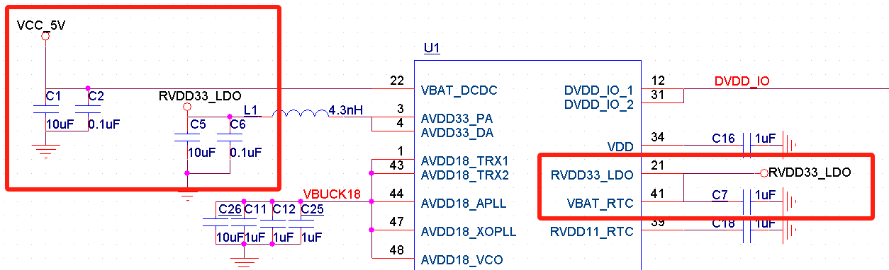
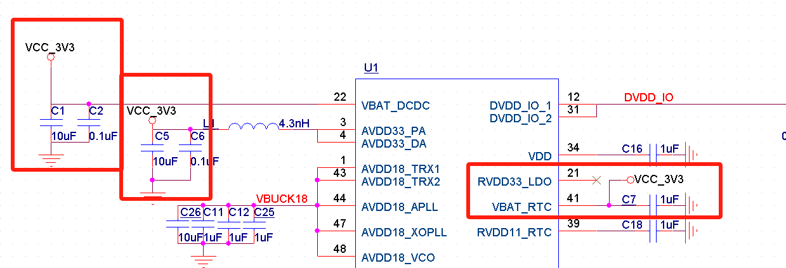
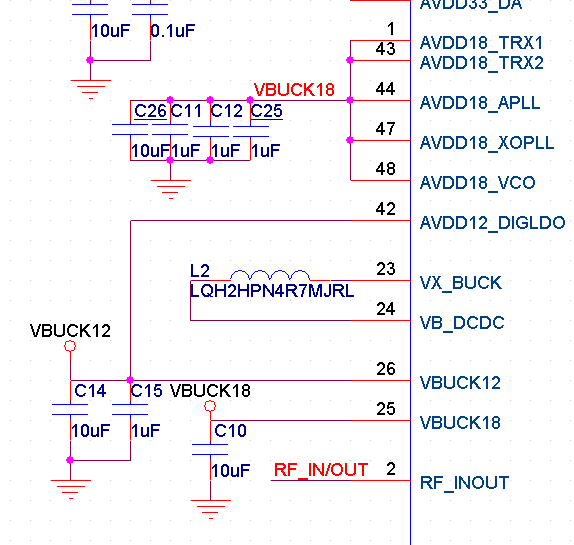
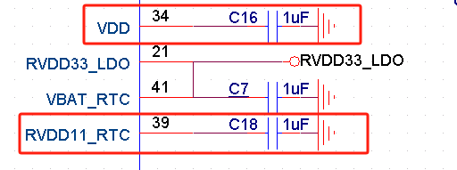
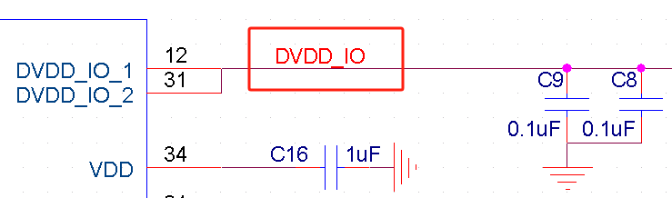
.. |image6| image:: ../../img/5505_硬件设计/表1-1.png
.. |image7| image:: ../../img/5505_硬件设计/图2-1.png
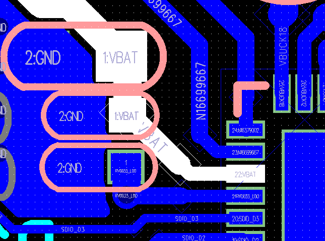
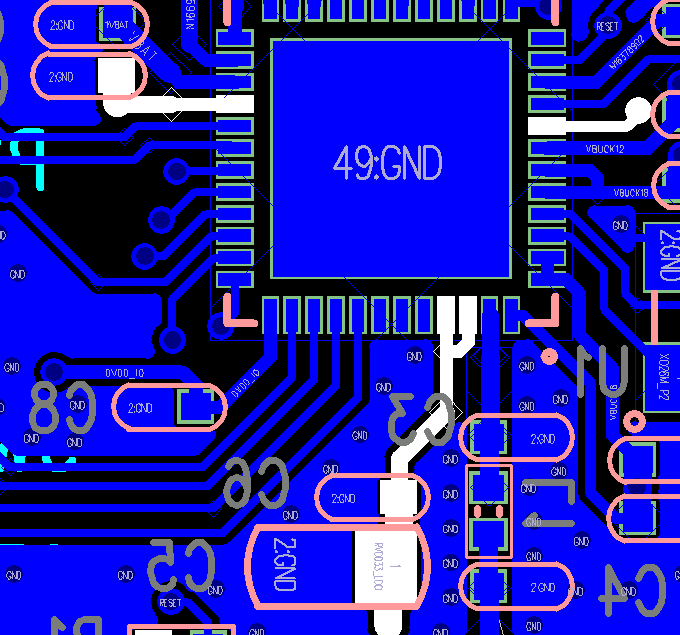
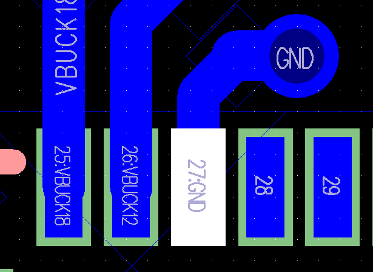
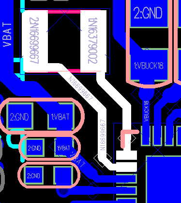
.. |image12| image:: ../../img/5505_硬件设计/图3-5.png
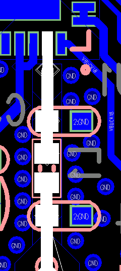
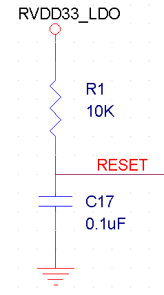
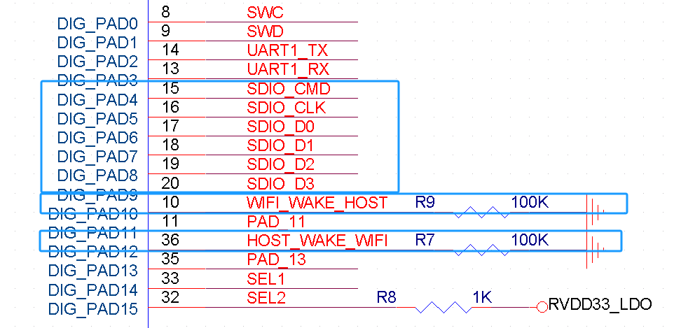