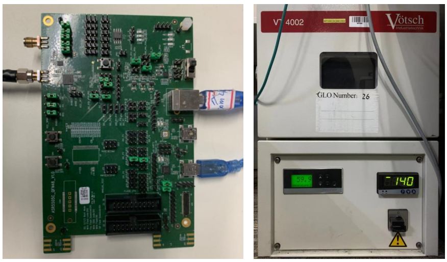

ASR550X 系列高低温射频性能测试报告
==================================

前言
----

**关于本文档**

本文档旨在提供 ASR550X 系列 Wi-Fi SoC 芯片在常温、高温（85℃）和低温（-40℃）下的射频性能测试结果。

**产品型号**

本文档适用于所有 ASR550X 系列 Wi-Fi SoC 芯片。

**版权公告**

版权归 © 2023 翱捷科技股份有限公司所有。保留一切权利。未经翱捷科技股份有限公司的书面许可，不得以任何形式或手段复制、传播、转录、存储或翻译本文档的部分或所有内容。

**商标声明**

ASR、翱捷和其他翱捷商标均为翱捷科技股份有限公司的商标。

本文档提及的其他所有商标名称、商标和注册商标均属其各自所有人的财产，特此声明。

**免责声明**

翱捷科技股份有限公司对本文档内容不做任何形式的保证，并会对本文档内容或本文中介绍的产品进行不定期更新。

本文档仅作为使用指导，本文的所有内容不构成任何形式的担保。本文档中的信息如有变更，恕不另行通知。

本文档不负任何责任，包括使用本文档中的信息所产生的侵犯任何专有权行为的责任。

**翱捷科技股份有限公司**

地址：上海市浦东新区科苑路399号张江创新园10号楼9楼 邮编：201203

官网： http://www.asrmicro.com/

**文档修订历史**

======= ====== ==================
日期    版本号 发布说明
======= ====== ==================
2021.01 V1.1.0 增加频偏测试数据。
======= ====== ==================

1. 测试环境搭建
---------------

将 cable 线接入 ASR550X EVB 的天线头，并接好 USB 供电和串口线，然后将板子放入 VOTSCH VT4002 高低温箱中，如下图所示

.. raw:: html

   

|image1|

.. raw:: html

   

2. 测试数据
-----------

+------+-------+------------------+------------------------+-------------------------+--------------+---------------------+----------------------+-----------------+------------------------+-------------------------+
| 信道 | 速率  | 常温 Power (dBm) | 高温（85℃）Power (dBm) | 低温（-40℃）Power (dBm) | 常温EVM (dB) | 高温（85℃）EVM (dB) | 低温（-40℃）EVM (dB) | 常温频偏（ppm） | 高温（85℃）频偏（ppm） | 低温（-40℃）频偏（ppm） |
+======+=======+==================+========================+=========================+==============+=====================+======================+=================+========================+=========================+
| 1    | 1 M   | 18.14            | 16.71                  | 18.05                   | -16.39       | -16.53              | -16.24               | -0.46           | 7.41                   | -15.21                  |
+------+-------+------------------+------------------------+-------------------------+--------------+---------------------+----------------------+-----------------+------------------------+-------------------------+
| 7    | 1 M   | 18.27            | 17.10                  | 17.49                   | -16.51       | -16.75              | -16.54               | -0.60           | 7.78                   | -14.63                  |
+------+-------+------------------+------------------------+-------------------------+--------------+---------------------+----------------------+-----------------+------------------------+-------------------------+
| 13   | 1 M   | 18.05            | 16.93                  | 17.54                   | -16.46       | -16.72              | -16.49               | -0.55           | 7.94                   | -14.59                  |
+------+-------+------------------+------------------------+-------------------------+--------------+---------------------+----------------------+-----------------+------------------------+-------------------------+
| 1    | 2 M   | 18.07            | 16.67                  | 17.97                   | -16.57       | -16.85              | -16.63               | -0.60           | 7.99                   | -14.50                  |
+------+-------+------------------+------------------------+-------------------------+--------------+---------------------+----------------------+-----------------+------------------------+-------------------------+
| 7    | 2 M   | 18.24            | 17.08                  | 17.46                   | -16.86       | -17.12              | -16.93               | -0.63           | 8.01                   | -14.53                  |
+------+-------+------------------+------------------------+-------------------------+--------------+---------------------+----------------------+-----------------+------------------------+-------------------------+
| 13   | 2 M   | 18.05            | 16.94                  | 17.52                   | -16.79       | -17.04              | -16.84               | -0.63           | 8.10                   | -14.45                  |
+------+-------+------------------+------------------------+-------------------------+--------------+---------------------+----------------------+-----------------+------------------------+-------------------------+
| 1    | 5.5 M | 17.98            | 16.61                  | 17.91                   | -16.50       | -16.55              | -16.31               | -0.44           | 8.17                   | -14.55                  |
+------+-------+------------------+------------------------+-------------------------+--------------+---------------------+----------------------+-----------------+------------------------+-------------------------+
| 7    | 5.5 M | 18.15            | 17.03                  | 17.41                   | -16.21       | -16.21              | -16.47               | -0.59           | 8.27                   | -14.57                  |
+------+-------+------------------+------------------------+-------------------------+--------------+---------------------+----------------------+-----------------+------------------------+-------------------------+
| 13   | 5.5 M | 17.96            | 16.89                  | 17.49                   | -16.36       | -16.30              | -16.40               | -0.65           | 8.27                   | -14.48                  |
+------+-------+------------------+------------------------+-------------------------+--------------+---------------------+----------------------+-----------------+------------------------+-------------------------+
| 1    | 11 M  | 17.97            | 16.60                  | 17.89                   | -16.35       | -16.44              | -16.41               | -0.60           | 8.26                   | -14.38                  |
+------+-------+------------------+------------------------+-------------------------+--------------+---------------------+----------------------+-----------------+------------------------+-------------------------+
| 7    | 11 M  | 18.16            | 17.02                  | 17.40                   | -16.42       | -16.33              | -16.64               | -0.58           | 8.32                   | -14.50                  |
+------+-------+------------------+------------------------+-------------------------+--------------+---------------------+----------------------+-----------------+------------------------+-------------------------+
| 13   | 11 M  | 17.96            | 16.88                  | 17.47                   | -16.45       | -16.38              | -16.57               | -0.67           | 8.35                   | -14.38                  |
+------+-------+------------------+------------------------+-------------------------+--------------+---------------------+----------------------+-----------------+------------------------+-------------------------+
| 1    | 6 M   | 18.30            | 16.90                  | 18.30                   | -25.24       | -26.05              | -26.89               | -0.61           | 8.31                   | -14.38                  |
+------+-------+------------------+------------------------+-------------------------+--------------+---------------------+----------------------+-----------------+------------------------+-------------------------+
| 7    | 6 M   | 17.77            | 16.58                  | 17.16                   | -27.19       | -26.07              | -29.77               | -0.65           | 8.34                   | -14.57                  |
+------+-------+------------------+------------------------+-------------------------+--------------+---------------------+----------------------+-----------------+------------------------+-------------------------+
| 13   | 6 M   | 18.11            | 17.05                  | 17.61                   | -24.26       | -25.94              | -28.25               | -0.64           | 8.35                   | -14.43                  |
+------+-------+------------------+------------------------+-------------------------+--------------+---------------------+----------------------+-----------------+------------------------+-------------------------+
| 1    | 9 M   | 18.30            | 16.92                  | 18.35                   | -25.86       | -26.91              | -27.32               | -0.61           | 8.39                   | -14.51                  |
+------+-------+------------------+------------------------+-------------------------+--------------+---------------------+----------------------+-----------------+------------------------+-------------------------+
| 7    | 9 M   | 17.76            | 16.58                  | 17.16                   | -27.16       | -26.09              | -30.14               | -0.56           | 8.36                   | -14.63                  |
+------+-------+------------------+------------------------+-------------------------+--------------+---------------------+----------------------+-----------------+------------------------+-------------------------+
| 13   | 9 M   | 18.12            | 17.06                  | 17.59                   | -24.38       | -26.64              | -28.75               | -0.62           | 8.30                   | -14.72                  |
+------+-------+------------------+------------------------+-------------------------+--------------+---------------------+----------------------+-----------------+------------------------+-------------------------+
| 1    | 12 M  | 18.32            | 16.90                  | 18.31                   | -25.95       | -26.44              | -27.30               | -0.51           | 8.24                   | -14.73                  |
+------+-------+------------------+------------------------+-------------------------+--------------+---------------------+----------------------+-----------------+------------------------+-------------------------+
| 7    | 12 M  | 17.77            | 16.58                  | 17.16                   | -27.13       | -26.26              | -29.72               | -0.60           | 8.33                   | -14.59                  |
+------+-------+------------------+------------------------+-------------------------+--------------+---------------------+----------------------+-----------------+------------------------+-------------------------+
| 13   | 12 M  | 18.04            | 17.05                  | 17.58                   | -24.34       | -26.27              | -28.82               | -0.74           | 8.22                   | -14.76                  |
+------+-------+------------------+------------------------+-------------------------+--------------+---------------------+----------------------+-----------------+------------------------+-------------------------+
| 1    | 18 M  | 18.28            | 16.85                  | 18.31                   | -25.23       | -25.10              | -27.25               | -0.63           | 8.27                   | -14.70                  |
+------+-------+------------------+------------------------+-------------------------+--------------+---------------------+----------------------+-----------------+------------------------+-------------------------+
| 7    | 18 M  | 17.76            | 16.54                  | 17.16                   | -27.03       | -25.47              | -29.91               | -0.52           | 8.19                   | -14.71                  |
+------+-------+------------------+------------------------+-------------------------+--------------+---------------------+----------------------+-----------------+------------------------+-------------------------+
| 13   | 18 M  | 18.03            | 17.03                  | 17.59                   | -23.80       | -25.72              | -28.54               | -0.63           | 8.29                   | -14.81                  |
+------+-------+------------------+------------------------+-------------------------+--------------+---------------------+----------------------+-----------------+------------------------+-------------------------+
| 1    | 24 M  | 17.36            | 16.00                  | 17.34                   | -28.48       | -28.78              | -29.58               | -0.58           | 8.31                   | -14.71                  |
+------+-------+------------------+------------------------+-------------------------+--------------+---------------------+----------------------+-----------------+------------------------+-------------------------+
| 7    | 24 M  | 16.83            | 15.71                  | 16.16                   | -29.37       | -28.35              | -30.72               | -0.58           | 8.25                   | -14.76                  |
+------+-------+------------------+------------------------+-------------------------+--------------+---------------------+----------------------+-----------------+------------------------+-------------------------+
| 13   | 24 M  | 17.13            | 16.04                  | 16.605                  | -27.92       | -28.275             | -30.125              | -0.55           | 8.35                   | -14.78                  |
+------+-------+------------------+------------------------+-------------------------+--------------+---------------------+----------------------+-----------------+------------------------+-------------------------+

+------+--------+-----------------+------------------------+-------------------------+--------------+---------------------+----------------------+-----------------+------------------------+-------------------------+
| 信道 | 速率   | 常温Power (dBm) | 高温（85℃）Power (dBm) | 低温（-40℃）Power (dBm) | 常温EVM (dB) | 高温（85℃）EVM (dB) | 低温（-40℃）EVM (dB) | 常温频偏（ppm） | 高温（85℃）频偏（ppm） | 低温（-40℃）频偏（ppm） |
+======+========+=================+========================+=========================+==============+=====================+======================+=================+========================+=========================+
| 1    | 36 M   | 17.44           | 16.06                  | 17.35                   | -28.36       | -28.88              | -29.24               | -0.55           | 8.24                   | -14.80                  |
+------+--------+-----------------+------------------------+-------------------------+--------------+---------------------+----------------------+-----------------+------------------------+-------------------------+
| 7    | 36 M   | 16.89           | 15.73                  | 16.18                   | -29.05       | -28.34              | -30.68               | -0.51           | 8.24                   | -14.78                  |
+------+--------+-----------------+------------------------+-------------------------+--------------+---------------------+----------------------+-----------------+------------------------+-------------------------+
| 13   | 36 M   | 17.14           | 16.06                  | 16.63                   | -27.09       | -27.95              | -30.00               | -0.50           | 8.20                   | -14.84                  |
+------+--------+-----------------+------------------------+-------------------------+--------------+---------------------+----------------------+-----------------+------------------------+-------------------------+
| 1    | 48 M   | 16.38           | 14.90                  | 16.33                   | -30.65       | -30.84              | -30.72               | -0.51           | 8.33                   | -14.87                  |
+------+--------+-----------------+------------------------+-------------------------+--------------+---------------------+----------------------+-----------------+------------------------+-------------------------+
| 7    | 48 M   | 15.77           | 14.65                  | 15.22                   | -30.68       | -30.18              | -31.17               | -0.58           | 8.27                   | -14.78                  |
+------+--------+-----------------+------------------------+-------------------------+--------------+---------------------+----------------------+-----------------+------------------------+-------------------------+
| 13   | 48 M   | 16.21           | 15.08                  | 15.63                   | -30.38       | -29.73              | -30.41               | -0.59           | 8.15                   | -14.91                  |
+------+--------+-----------------+------------------------+-------------------------+--------------+---------------------+----------------------+-----------------+------------------------+-------------------------+
| 1    | 54 M   | 16.39           | 14.98                  | 16.39                   | -30.76       | -30.96              | -30.74               | -0.51           | 8.18                   | -14.84                  |
+------+--------+-----------------+------------------------+-------------------------+--------------+---------------------+----------------------+-----------------+------------------------+-------------------------+
| 7    | 54 M   | 15.78           | 14.71                  | 15.13                   | -30.57       | -29.51              | -31.21               | -0.49           | 8.24                   | -14.91                  |
+------+--------+-----------------+------------------------+-------------------------+--------------+---------------------+----------------------+-----------------+------------------------+-------------------------+
| 13   | 54 M   | 16.23           | 15.13                  | 15.62                   | -30.14       | -29.60              | -30.24               | -0.58           | 8.39                   | -14.79                  |
+------+--------+-----------------+------------------------+-------------------------+--------------+---------------------+----------------------+-----------------+------------------------+-------------------------+
| 1    | HT20-0 | 17.55           | 16.19                  | 17.53                   | -24.52       | -24.66              | -25.49               | -0.53           | 8.26                   | -14.88                  |
+------+--------+-----------------+------------------------+-------------------------+--------------+---------------------+----------------------+-----------------+------------------------+-------------------------+
| 7    | HT20-0 | 17.02           | 15.89                  | 16.50                   | -24.96       | -24.39              | -27.42               | -0.54           | 8.39                   | -14.96                  |
+------+--------+-----------------+------------------------+-------------------------+--------------+---------------------+----------------------+-----------------+------------------------+-------------------------+
| 13   | HT20-0 | 17.36           | 16.24                  | 16.95                   | -24.75       | -24.51              | -27.00               | -0.53           | 8.32                   | -14.97                  |
+------+--------+-----------------+------------------------+-------------------------+--------------+---------------------+----------------------+-----------------+------------------------+-------------------------+
| 1    | HT20-1 | 17.61           | 16.24                  | 17.58                   | -24.56       | -24.54              | -25.05               | -0.58           | 8.43                   | -14.79                  |
+------+--------+-----------------+------------------------+-------------------------+--------------+---------------------+----------------------+-----------------+------------------------+-------------------------+
| 7    | HT20-1 | 17.08           | 15.95                  | 16.57                   | -24.96       | -24.34              | -26.77               | -0.48           | 8.28                   | -14.99                  |
+------+--------+-----------------+------------------------+-------------------------+--------------+---------------------+----------------------+-----------------+------------------------+-------------------------+
| 13   | HT20-1 | 17.43           | 16.29                  | 17.01                   | -25.02       | -24.48              | -26.69               | -0.60           | 8.24                   | -14.89                  |
+------+--------+-----------------+------------------------+-------------------------+--------------+---------------------+----------------------+-----------------+------------------------+-------------------------+
| 1    | HT20-2 | 17.61           | 16.24                  | 17.58                   | -24.22       | -24.12              | -24.98               | -0.53           | 8.19                   | -14.97                  |
+------+--------+-----------------+------------------------+-------------------------+--------------+---------------------+----------------------+-----------------+------------------------+-------------------------+
| 7    | HT20-2 | 17.09           | 15.95                  | 16.56                   | -24.77       | -23.91              | -26.98               | -0.53           | 8.27                   | -14.97                  |
+------+--------+-----------------+------------------------+-------------------------+--------------+---------------------+----------------------+-----------------+------------------------+-------------------------+
| 13   | HT20-2 | 17.42           | 16.30                  | 17.00                   | -24.51       | -24.11              | -26.31               | -0.53           | 8.22                   | -14.91                  |
+------+--------+-----------------+------------------------+-------------------------+--------------+---------------------+----------------------+-----------------+------------------------+-------------------------+
| 1    | HT20-3 | 16.41           | 15.00                  | 16.40                   | -29.89       | -30.61              | -30.36               | -0.56           | 8.24                   | -15.00                  |
+------+--------+-----------------+------------------------+-------------------------+--------------+---------------------+----------------------+-----------------+------------------------+-------------------------+
| 7    | HT20-3 | 15.82           | 14.71                  | 15.17                   | -29.94       | -29.54              | -30.31               | -0.50           | 8.26                   | -14.81                  |
+------+--------+-----------------+------------------------+-------------------------+--------------+---------------------+----------------------+-----------------+------------------------+-------------------------+
| 13   | HT20-3 | 16.24           | 15.16                  | 15.67                   | -29.09       | -29.36              | -29.84               | -0.48           | 8.43                   | -15.05                  |
+------+--------+-----------------+------------------------+-------------------------+--------------+---------------------+----------------------+-----------------+------------------------+-------------------------+
| 1    | HT20-4 | 16.38           | 14.95                  | 16.33                   | -30.17       | -30.85              | -30.28               | -0.58           | 8.31                   | -14.88                  |
+------+--------+-----------------+------------------------+-------------------------+--------------+---------------------+----------------------+-----------------+------------------------+-------------------------+
| 7    | HT20-4 | 15.78           | 14.66                  | 15.12                   | -29.82       | -29.79              | -30.35               | -0.57           | 8.19                   | -15.08                  |
+------+--------+-----------------+------------------------+-------------------------+--------------+---------------------+----------------------+-----------------+------------------------+-------------------------+
| 13   | HT20-4 | 16.20           | 15.11                  | 15.61                   | -29.29       | -29.57              | -29.73               | -0.43           | 8.28                   | -14.92                  |
+------+--------+-----------------+------------------------+-------------------------+--------------+---------------------+----------------------+-----------------+------------------------+-------------------------+
| 1    | HT20-5 | 16.39           | 14.97                  | 16.40                   | -29.70       | -30.38              | -30.21               | -0.54           | 8.44                   | -15.04                  |
+------+--------+-----------------+------------------------+-------------------------+--------------+---------------------+----------------------+-----------------+------------------------+-------------------------+
| 7    | HT20-5 | 15.82           | 14.68                  | 15.18                   | -30.02       | -29.58              | -30.41               | -0.63           | 8.28                   | -14.95                  |
+------+--------+-----------------+------------------------+-------------------------+--------------+---------------------+----------------------+-----------------+------------------------+-------------------------+
| 13   | HT20-5 | 16.24           | 15.12                  | 15.63                   | -29.49       | -28.98              | -29.87               | -0.46           | 8.23                   | -15.12                  |
+------+--------+-----------------+------------------------+-------------------------+--------------+---------------------+----------------------+-----------------+------------------------+-------------------------+
| 1    | HT20-6 | 15.91           | 14.55                  | 15.89                   | -31.18       | -31.24              | -30.67               | -0.49           | 8.22                   | -14.97                  |
+------+--------+-----------------+------------------------+-------------------------+--------------+---------------------+----------------------+-----------------+------------------------+-------------------------+
| 7    | HT20-6 | 15.33           | 14.27                  | 14.76                   | -30.68       | -30.42              | -30.71               | -0.61           | 8.20                   | -15.10                  |
+------+--------+-----------------+------------------------+-------------------------+--------------+---------------------+----------------------+-----------------+------------------------+-------------------------+
| 13   | HT20-6 | 15.68           | 14.64                  | 15.18                   | -30.21       | -29.91              | -30.15               | -0.50           | 8.25                   | -14.99                  |
+------+--------+-----------------+------------------------+-------------------------+--------------+---------------------+----------------------+-----------------+------------------------+-------------------------+
| 1    | HT20-7 | 15.89           | 14.54                  | 15.87                   | -30.89       | -31.54              | -30.77               | -0.51           | 8.32                   | -15.10                  |
+------+--------+-----------------+------------------------+-------------------------+--------------+---------------------+----------------------+-----------------+------------------------+-------------------------+
| 7    | HT20-7 | 15.32           | 14.23                  | 14.70                   | -30.25       | -30.00              | -30.75               | -0.53           | 8.18                   | -15.00                  |
+------+--------+-----------------+------------------------+-------------------------+--------------+---------------------+----------------------+-----------------+------------------------+-------------------------+
| 13   | HT20-7 | 15.79           | 14.68                  | 15.20                   | -30.13       | -29.86              | -30.22               | -0.50           | 8.18                   | -15.01                  |
+------+--------+-----------------+------------------------+-------------------------+--------------+---------------------+----------------------+-----------------+------------------------+-------------------------+

