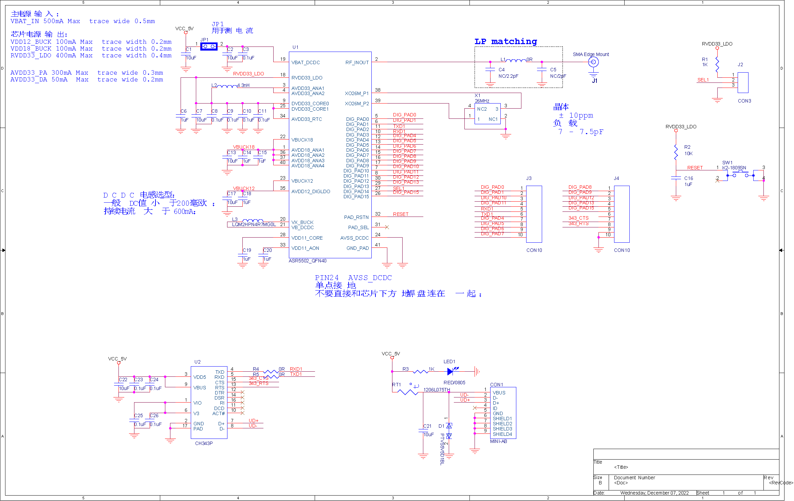
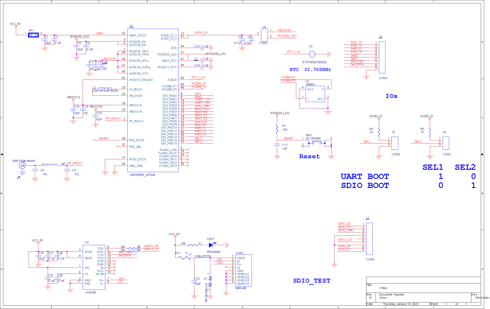

ASR550X 系列 EVB 参考设计 
====================

1. ASR550X EVB 参考设计
--------------------------------------------------------

    ASR5502X QFN40 EVB 参考设计（点击放大）

    ASR5505S QFN48 EVB 参考设计（点击放大）

2. ASR550X EVB 参考 BOM
--------------------------------------------------------

.. raw:: html

   

ASR5502X QFN40 EVB 参考 BOM

.. raw:: html

   

+------+------+----------------------------------+----------------+-----------------------+
| 序号 | 数量 | 料号                             | 器件           | 封装                  |
+======+======+==================================+================+=======================+
| 1    | 1    | CON1                             | MINI-AB        | MINI_USB              |
+------+------+----------------------------------+----------------+-----------------------+
| 2    | 7    | C1,C2,C7,C13,C17,C21,C22         | 10uF           | C0603                 |
+------+------+----------------------------------+----------------+-----------------------+
| 3    | 9    | C3,C8,C9,C10,C11,C23,C24,C25,C26 | 0.1uF          | C0402                 |
+------+------+----------------------------------+----------------+-----------------------+
| 4    | 1    | C4                               | NC/2.2pF       | C0402                 |
+------+------+----------------------------------+----------------+-----------------------+
| 5    | 1    | C5                               | NC/2pF         | C0402                 |
+------+------+----------------------------------+----------------+-----------------------+
| 6    | 7    | C6,C14,C15,C16,C18,C19,C20       | 1uF            | C0402                 |
+------+------+----------------------------------+----------------+-----------------------+
| 7    | 1    | D1                               | PTVS5V5D1BL    | DFN1006-2L            |
+------+------+----------------------------------+----------------+-----------------------+
| 8    | 1    | JP1                              | HEADER_2X1_JP  | TERMINAL_2X1_100MIL   |
+------+------+----------------------------------+----------------+-----------------------+
| 9    | 1    | J1                               | SMA Edge Mount | CON-SMA-EDGE-6R35     |
+------+------+----------------------------------+----------------+-----------------------+
| 10   | 1    | J2                               | CON3           | TERMINAL_3X1_100MIL   |
+------+------+----------------------------------+----------------+-----------------------+
| 11   | 2    | J3,J4                            | CON10          | TERMINAL_10X1_100MIL  |
+------+------+----------------------------------+----------------+-----------------------+
| 12   | 1    | LED1                             | RED/0805       | leds_0805_h0p8        |
+------+------+----------------------------------+----------------+-----------------------+
| 13   | 1    | L1                               | 0R             | L0402                 |
+------+------+----------------------------------+----------------+-----------------------+
| 14   | 1    | L2                               | 4.3nH          | L0402                 |
+------+------+----------------------------------+----------------+-----------------------+
| 15   | 1    | L3                               | LQM2HPN4R7MG0L | L_2520                |
+------+------+----------------------------------+----------------+-----------------------+
| 16   | 1    | RT1                              | 1206L075TH     | R1206                 |
+------+------+----------------------------------+----------------+-----------------------+
| 17   | 2    | R1,R3                            | 1K             | R0402                 |
+------+------+----------------------------------+----------------+-----------------------+
| 18   | 1    | R2                               | 10K            | R0402                 |
+------+------+----------------------------------+----------------+-----------------------+
| 19   | 2    | R4,R5                            | 0R             | R0402                 |
+------+------+----------------------------------+----------------+-----------------------+
| 20   | 1    | SW1                              | K2-1809SN      | SWITCH_K2-1809SN      |
+------+------+----------------------------------+----------------+-----------------------+
| 21   | 1    | U1                               | ASR5502_QFN40  | ASR5502_40PIN_5X5_0D4 |
+------+------+----------------------------------+----------------+-----------------------+
| 22   | 1    | U2                               | CH343P         | QFN50P300X300X75-17N  |
+------+------+----------------------------------+----------------+-----------------------+
| 23   | 1    | X1                               | 26MHz          | DSX321G_3225          |
+------+------+----------------------------------+----------------+-----------------------+

.. raw:: html

   

ASR5505S QFN48 EVB 参考 BOM

.. raw:: html

   

+------+------+--------------------------------+----------------+--------------------------+
| 序号 | 数量 | 料号                           | 器件           | 封装                     |
+======+======+================================+================+==========================+
| 1    | 1    | CON1                           | MINI-AB        | MINI_USB                 |
+------+------+--------------------------------+----------------+--------------------------+
| 2    | 3    | C1,C19,C22                     | 10uF           | C0603                    |
+------+------+--------------------------------+----------------+--------------------------+
| 3    | 8    | C2,C6,C8,C9,C20,C21,C23,C24    | 0.1uF          | C0402                    |
+------+------+--------------------------------+----------------+--------------------------+
| 4    | 2    | C3,C4                          | NC             | C0402                    |
+------+------+--------------------------------+----------------+--------------------------+
| 5    | 3    | C5,C10,C14                     | 10uF           | C0805                    |
+------+------+--------------------------------+----------------+--------------------------+
| 6    | 8    | C7,C11,C12,C15,C16,C17,C18,C25 | 1uF            | C0402                    |
+------+------+--------------------------------+----------------+--------------------------+
| 7    | 1    | D1                             | PTVS5V5D1BL    | DFN1006-2L               |
+------+------+--------------------------------+----------------+--------------------------+
| 8    | 1    | JP1                            | HEADER_2X1_JP  | TERMINAL_2X1_100MIL      |
+------+------+--------------------------------+----------------+--------------------------+
| 9    | 1    | J1                             | SMA Edge Mount | CON-SMA-EDGE-6R35        |
+------+------+--------------------------------+----------------+--------------------------+
| 10   | 2    | J2,J7                          | CON9           | TERMINAL_9X1_100MIL      |
+------+------+--------------------------------+----------------+--------------------------+
| 11   | 3    | J4,J5,J6                       | CON3           | TERMINAL_3X1_100MIL      |
+------+------+--------------------------------+----------------+--------------------------+
| 12   | 1    | LED1                           | RED/0805       | leds_0805_h0p8           |
+------+------+--------------------------------+----------------+--------------------------+
| 13   | 1    | L1                             | 0R             | L0402                    |
+------+------+--------------------------------+----------------+--------------------------+
| 14   | 1    | L2                             | LQH2HPN4R7MJRL | L_2520                   |
+------+------+--------------------------------+----------------+--------------------------+
| 15   | 1    | RT1                            | 1206L075TH     | R1206                    |
+------+------+--------------------------------+----------------+--------------------------+
| 16   | 1    | R1                             | 10K            | R0402                    |
+------+------+--------------------------------+----------------+--------------------------+
| 17   | 3    | R2,R3,R5                       | 1K             | R0402                    |
+------+------+--------------------------------+----------------+--------------------------+
| 18   | 2    | R4,R6                          | 0R             | R0402                    |
+------+------+--------------------------------+----------------+--------------------------+
| 19   | 1    | SW1                            | K2-1809SN      | SWITCH_K2-1809SN         |
+------+------+--------------------------------+----------------+--------------------------+
| 20   | 1    | U1                             | ASR5505S_QFN48 | ASR5501_T2_48PIN_6X6_0D4 |
+------+------+--------------------------------+----------------+--------------------------+
| 21   | 1    | U2                             | CH343P         | QFN50P300X300X75-17N     |
+------+------+--------------------------------+----------------+--------------------------+
| 22   | 1    | X1                             | 26MHz          | DSX321G_3225             |
+------+------+--------------------------------+----------------+--------------------------+
| 23   | 1    | X2                             | ETST00327000KE | ETST00327000KE           |
+------+------+--------------------------------+----------------+--------------------------+

3. ASR550X EVB Layout
--------------------------------------------------------

 - `ASR5502X QFN40 EVB Layout <https://pan.baidu.com/s/1PdZJM5JY_pWn7r7AncpURQ?pwd=1234>`_
 - `ASR5505S QFN48 EVB Layout <https://pan.baidu.com/s/1ERpB8DdZ9pD-mebSz4Vbzg?pwd=1234>`_

