ASR550X 系列硬件设计指南
========================

前言
----

**关于本文档**

本文档旨在为用户提供 ASR550X 系列 Wi-Fi SoC 芯片的硬件设计指南，包括进行电路设计和 PCB 布局时需注意的事项以及对量产测试点的引出建议等。

**产品型号**

本文档适用于 ASR IoT Wi-Fi SoC芯片（550X 系列）。

**版权公告**

版权归 © 2023 翱捷科技股份有限公司所有。保留一切权利。未经翱捷科技股份有限公司的书面许可，不得以任何形式或手段复制、传播、转录、存储或翻译本文档的部分或所有内容。

**商标声明**

ASR、翱捷和其他翱捷商标均为翱捷科技股份有限公司的商标。

本文档提及的其他所有商标名称、商标和注册商标均属其各自所有人的财产，特此声明。

**免责声明**

翱捷科技股份有限公司对本文档内容不做任何形式的保证，并会对本文档内容或本文中介绍的产品进行不定期更新。

本文档仅作为使用指导，本文的所有内容不构成任何形式的担保。本文档中的信息如有变更，恕不另行通知。

本文档不负任何责任，包括使用本文档中的信息所产生的侵犯任何专有权行为的责任。

**翱捷科技股份有限公司**

地址：上海市浦东新区科苑路399号张江创新园10号楼9楼 邮编：201203

官网： http://www.asrmicro.com/

**文档修订历史**

.. list-table::

    *   -   **日期**
        -   **版本号**
        -   **发布说明**  
    *   -   2021.02
        -   V1.2.0
        -   *   在 1.1.1 节中增加了一条说明
            *   更新了 1.1.5 节中的描述
            *   删除 GPIO 烧录的相关内容

1. 原理图设计
-------------

1.1 电源和晶体部分设计
~~~~~~~~~~~~~~~~~~~~~~

ASR550X 芯片单路电源供电设计，电源输入兼容 5 V 和 3.3 V 设计。

当使用 5 V 供电时，PAD0 ~ PAD3 共 4 个 IO 口电平为 5 V，其他 IO 口电平为 3.3 V。

当使用 3.3 V 供电时，PAD0 ~ PAD15 共 16 个 IO 口电平为 3.3 V。

1.1.1 外部电源输入为 3.3 V 或 5 V 时
^^^^^^^^^^^^^^^^^^^^^^^^^^^^^^^^

电源连线如图，利用芯片内部 3.3 V LDO 输出给芯片内部各模块使用。

电容 C5 和 C6 就近 PIN3 和 PIN4 摆放，C7 就近 PIN9 或 PIN25 摆放。

.. raw:: html

   

|image1|

.. raw:: html

   

.. note::
    当模块使用场景只需要 3.3 V 供电而不需要支持宽压时，可以不用内部 RVDD33_LDO（PIN18）给其他 3.3 V 引脚供电，直接使用外部 3.3 V 输入给这些引脚（AVDD33_ANA1，AVDD33_ANA2，DVDD33_CORE0，DVDD33_CORE1，AVDD33_RTC）供电。

1.1.2 内部 DCDC 电源
^^^^^^^^^^^^^^^^^^

ASR550X 芯片内置双电压 DCDC 芯片，VBUCK18 为内部 DCDC 1.8 V 输出，VBUCK12 为内部 DCDC 1.2 V 输出，L1 为 4.7 uH DCDC 电感，电感选型需要选用电源专用电感，持续电流大于 600 mA，DC 电阻小于 200 毫欧，如图所示。

电容 C10 和 C11 就近 PIN36、 PIN37 和 PIN40 摆放，C12 就近 PIN1 摆放。

电容 C13 和 C14 就近 PIN35 摆放。

.. raw:: html

   

|image2|

.. raw:: html

   

1.1.3 内部数字电源外接旁路电容
^^^^^^^^^^^^^^^^^^^^^^^^^^^^^^

PIN28 和 PIN33 为内部数字电源 1.1 V 外部旁路电容接口，只需要接电容即可，如图所示：

.. raw:: html

   

|image3|

.. raw:: html

   

1.1.4 晶体部分
^^^^^^^^^^^^^^

芯片使用外置 26 MHz 晶体，具体参数要求以及 ASR 验证过的型号请参考下表：

.. raw:: html

   

|image14|

晶体主要参数参考

.. raw:: html

   

.. raw:: html

   

=============== ===================== ========
**品牌**        **料号**              **封装**
=============== ===================== ========
Hosonic（鸿星） E3FB26E007900E        3225
HARMONY（加高） X3S026000B71HZ        3225
TXC             7V26000044            3225
JWT（晶威特）   CF4026M00075T2868001  3225
雅晶            26.000MHz/7.2Pf/10ppm 3225
=============== ===================== ========

ASR验证过的晶体列表

.. raw:: html

   

.. note::
    - 如果想缩小 PCB 布局空间，可以省去晶体两边的负载电容，芯片内部有一定的调节矩阵可以调整, 但要求晶体的负载在 7-7.7 Pf 之间。
    - 建议客户选用 26 MHz 频率。40 MHz 频率也支持，用 40 MHz 晶体时，PAD13 需要下拉 10 K 电阻接地。

1.1.5 部分 IO 上拉设计
^^^^^^^^^^^^^^^^^^^^

关于部分 IO 上拉设计，需注意以下两点：

(1) 当使用 UART1 和 UART2 时，建议芯片外部在 RX 和 TX 引脚上各加上 10 K 上拉电阻。

(2) 当 IO 用作 I2C 功能时，外部需要上拉 4.7 K 电阻。

2. 射频前端设计
---------------

ASR550X 芯片 RF 引脚内部已经做好 50 欧阻抗匹配，无须额外匹配，外部靠芯片侧的一组 π 型预留用于谐波抑制，靠天线侧的一组 π 型预留用于天线匹配。中间预留的 0 欧姆电阻 R1 用于断开前后匹配电路，便于焊接 pig tail 做传导或天线调试，如果用户需要外接 IPEX 类连接器，可以替换掉 R1 位置。

第一级 π 型网络靠芯片放置，如果有屏蔽罩则在屏蔽罩内侧；
第二级 π 型网络靠天线馈点放置，如果有屏蔽罩则在屏蔽罩外侧。

R1 电阻可放置于靠天线匹配网络，附近铜皮阻焊层可以裸露一部分，便于焊 pig tail 做测试。

.. raw:: html

   

|image4|

射频前端匹配电路图

.. raw:: html

   

.. attention::
    实际模组产品中，R1 可替换成 IPEX 座或者顶针测点，以方便产线测试。

3. LAYOUT 版图设计
-----------------

3.1 电源部分
~~~~~~~~~~~~

3.1.1 VBAT_IN（PIN 19）
^^^^^^^^^^^^^^^^^^^^^^^

芯片电源输入，Peak 400 mA，走线宽度不小于 0.5 mm 直至接近芯片引脚。

.. raw:: html

   

|image5|

VBAT_IN 电源走线

.. raw:: html

   

3.1.2 RVDD33_LDO（PIN 18）
^^^^^^^^^^^^^^^^^^^^^^^^^^

芯片内部 3.3 V LDO 输出，主要输出给芯片 PA/IO/RTC 电源引脚，Peak 300 mA，出线宽度不小于 0.5 mm，到 PA 引脚（PIN3/4）分支线宽不小于 0.4 mm，尽量少换层以减小过孔，到 DVDD_IO（PIN9/25）和 RTC（PIN34）分支线宽 0.2 mm。

.. raw:: html

   

|image6|

内部 3.3V LDO 电源走线

.. raw:: html

   

.. note::
    - VDD12_BUCK 电源线宽 0.3 mm；VDD18_BUCK 电源线宽 0.2 mm。
    - RVDD33_LDO，VDD12_BUCK 和 VDD18_BUCK 三组电源线间注意隔离。

3.1.3 AVSS_DCDC（PIN24）
^^^^^^^^^^^^^^^^^^^^^^^^

这个 PIN 脚单独打过孔到第二层接地，不要直接和芯片下方的 GND PAD 相连。

.. raw:: html

   

|image7|

AVSS_DCDC（PIN24）单点接地

.. raw:: html

   

3.1.4 DCDC 电感
^^^^^^^^^^^^^^

DCDC 电感器件下净空，线宽尽量宽些。

.. raw:: html

   

|image8|

DCDC 电感表层净空区

.. raw:: html

   

3.2 晶体
~~~~~~~~

晶体 XO 器件下净空，走线尽量保护, 晶体两个 NC 焊盘可以单点连线接地。

.. raw:: html

   

|image9|

晶体表层净空区

.. raw:: html

   

3.3 RF 走线
~~~~~~~~~~

RF 出线越短越好，要求 PCB 板厂控制 50 欧阻抗，按一般四层板叠层结构，线宽不应低于 0.3 mm（12 mil）。

.. raw:: html

   

|image10|

RF 射频走线示意图

.. raw:: html

   

.. attention::
    一般模块建议使用 4 层 PCB 板设计，第二层有完整的地平面。

    如果出于成本考量，使用 2 层 PCB 板设计，则应该使芯片下方 BOT 面的地平面区域尽量完整并靠近模块的 GND pin 脚。

4. IO 使用说明
-------------

芯片 PAD0~PAD15 总共 16 个 GPIO MUX，如表所示：

========= ========== ========= ========== ========= ========= =======
Pin Name  Func.=0    Func.=1   Func.=2    Func.=3   Func.=4   ADC_MUX
========= ========== ========= ========== ========= ========= =======
DIG_PAD0  GPIO0      UART0_TXD SWC        SPI1_CSN  PWM5      
DIG_PAD1  GPIO1      UART0_RXD SWD        SPI1_SCK  PWM7      
DIG_PAD2  GPIO2      UART1_TXD UART1_TXD  SPI1_MISO I2C0_SCL  
DIG_PAD3  GPIO3      UART1_RXD SDIO_INT   SPI1_MOSI I2C0_SDA  
DIG_PAD4  SWC        GPIO4     SDIO_CMD   UART0_TXD PWM0      ADC0
DIG_PAD5  SWD        GPIO5     SDIO_CLK   UART0_RXD PWM2      ADC1
DIG_PAD6  GPIO6      SPI0_CSN  SDIO_DATA0 UART0_CTS PWM4      ADC2
DIG_PAD7  GPIO7      SPI0_SCK  SDIO_DATA1 UART0_RTS PWM6      ADC3
DIG_PAD8  GPIO8      SPI0_MOSI SDIO_DATA2 I2C1_SCL  UART1_TXD ADC4
DIG_PAD9  GPIO9      SPI0_MISO SDIO_DATA3 I2C1_SDA  UART1_RXD ADC5
DIG_PAD10 MODE_SEL3  PWM1      GPIO10     UART2_CTS SPI2_SCK  ADC6
DIG_PAD11 GPIO11     PWM3      SDIO_INT   UART2_RTS SPI2_MOSI ADC7
DIG_PAD12 GPIO12     GPIO12    SPI2_CSN   UART2_TXD GPIO12    
DIG_PAD13 GPIO13     GPIO13    SPI2_MISO  UART2_RXD GPIO13    
DIG_PAD14 STRAP/SEL1 PWM0      SPI2_SCK   UART1_CTS GPIO14    
DIG_PAD15 STRAP/SEL2 PWM2      SPI2_MOSI  UART1_RTS GPIO15    
========= ========== ========= ========== ========= ========= =======

4.1 RESET 引脚
~~~~~~~~~~~~~

PIN32 reset 引脚芯片内部自带上拉，芯片正常上电后内部自动拉高，也可以由外部上位机控制，如果不需要由外部控制，建议设计时保留测点。

4.2 SEL引脚模式说明
~~~~~~~~~~~~~~~~~~~

芯片有一个专用 SEL0 引脚（PIN31 的 PAD_SEL）和 3 个 IO 复用引脚（SEL1/2/3），用于在上电时配置一些特殊的启动模式，具体见下表：

.. raw:: html

   

|image15|

ASR5502X 系列启动模式

.. raw:: html

   

.. raw:: html

   

|image16|

ASR5505S 系列启动模式

.. raw:: html

   

对启动模式的详细说明如下：

**Boot with Flash**\ ：内部 flash 启动模式，这是正常的芯片使用启动模式，上电后芯片会读取内部 flash 内的系统代码并运行。

**Boot with UART**\ ：串口启动模式，上电后芯片从默认串口 1 打印 log，进入串口烧录模式，可以从串口 1 将固件烧录到芯片内部 flash 中，这也是客户的模组产品量产的主要烧录方法。

**Boot with SDIO**\ ：SDIO 启动模式，ASR5505S 正常的应用模式。

.. attention::
    - 所有 IO 口内部有下拉电阻配置，如果需要置 0 只要悬空即可，如果不需要该配置引脚或不用这个 IO 口功能，也可以悬空。
    - 芯片上电复位后自动检测这四个引脚上的高低电平状态，从而进入相应的模式并一直保持在该模式下，当外部配置引脚状态发生改变时，必须对芯片重新上电或者外部复位以生效。
    - 如无特殊需求，只需要预留 PAD14（SEL1）测点即可，UART 下载方式是最常用的量产烧录模式，PAD_SEL 默认内部下拉，悬空即可。
    - 因 PAD10，PAD14 和 PAD15 的特殊性，为了不影响上电后的模式判断，这几个引脚不建议使用，如果确实要使用，则须确保外部不能有长上拉电路。

4.3 DEBUG 串口
~~~~~~~~~~~~~

目前芯片 BootLoader 默认使用 UART1（DIG_PAD2/3）作为 DEBUG log 输入输出和程序下载接口，建议测点引出。

.. attention::
    - UART1_RX 接口如果用户不使用，仅作为程序下载接口时，建议加一个上拉电阻，以防止正常启动时，该引脚悬空，导致 RX 进入异常状态。

4.4 外接 Flash 接口
~~~~~~~~~~~~~~~~~

如果需要外接 flash 用于额外数据存储，建议使用 SPI0 接口（DIG_PAD6/7/8/9）。（因为 ASR5502X 系列不支持外接 flash，所以本节内容对其不适用。）

5. 关于量产测试点的引出建议
---------------------------

1. Reset 信号，可以引出到夹具，用复位按键手动控制；也可以接到外部可编程 IO 资源，由上位机进行控制。
2. UART1（DIG_PAD2/3），用于固件串口烧录和 DEBUG LOG 信息输入输出，建议引出至外部串口，转 USB 器件连接到上位机。
3. 其他功能 IO 口，用户可视实际使用情况决定是否需要引出测试。

关于产线软件烧录和常见问题等内容，请参考文档\ *《ASR550X系列_产线程序烧录和产测软件使用说明》*\ 。

.. attention::
    因为夹具测试时是用探针顶住测点，所以可能出现探针顶到各个测点的时刻会有差异，进而影响芯片上电时对 SEL 引脚电平高低的判断，比如 SEL 引脚顶针还没接触到测点，而此时电源和地的测点已经接触上，就会导致芯片上电后判断 SEL 引脚为悬空拉低，从而没有进入烧录模式。
    
    建议 SEL 引脚探针设计上可以使用略长于其他探针的型号（比如长 1-2 mm），以确保模块上电前 SEL 引脚测点已经处于确定的高低电平状态。

6. ASR5505S SDIO 接口应用
------------------------

ASR5505S 在 ASR5502X 系列的基础上去掉了芯片内部 flash，IO 接口部分有些变化，其他如电源和射频部分一样，可以参考本文档的前述章节。

下面主要介绍 ASR5505S 用于 SDIO 接口应用的设计注意事项。

6.1 IO 接口电压
~~~~~~~~~~~~~~

和其它 ASR550X 系列芯片一样，ASR5505S 的 DIG_PAD0 到 DIG_PAD3 四个 IO 口电压跟随 VBAT_DCDC（PIN22）输入电压，其他 IO 口电压均由 DVDD_IO 决定，可以根据上位机的 SDIO 接口电平选择。

.. raw:: html

   

|image11|

DVDD_IO 接口电压示意图

.. raw:: html

   

6.2 SDIO 接口定义
~~~~~~~~~~~~~~~~

ASR5505S 的标准 SDIO 接口如图所示：

.. raw:: html

   

|image12|

.. raw:: html

   

6.3 模式选择引脚和必要的测试引脚
~~~~~~~~~~~~~~~~~~~~~~~~~~~~~~~~

**SEL1**\  和 \ **SEL2**\  脚用于选择启动模式，必须要引出测点，正常启动是 SDIO 模式，UART 启动模式用于产线 ATE 测试和 debug。SEL2 脚需要上拉，以确保上电后能正常进入 SDIO 模式。

.. raw:: html

   

|image13|

建议引出测点示意图

.. raw:: html

   

关于 ASR5505S 的测点建议，请参考第 5 章的相关内容。

A. 附录-相关资料
----------------

本文档中提到的参考信息总结如下：

1. 关于产线软件烧录和常见问题等内容，请参考文档\ *《ASR550X系列_产线程序烧录和产测软件使用说明》*\。

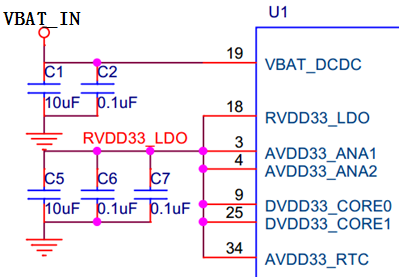
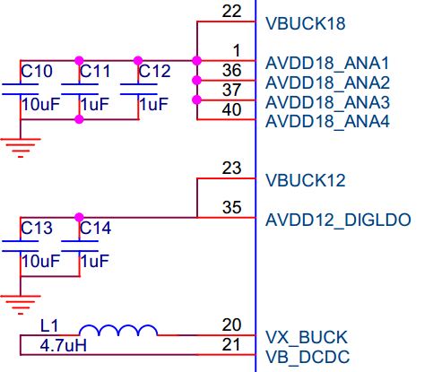
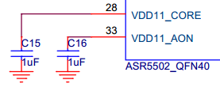
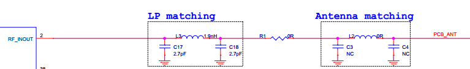
.. |image5| image:: ../../img/550X_硬件设计/图3-1.png
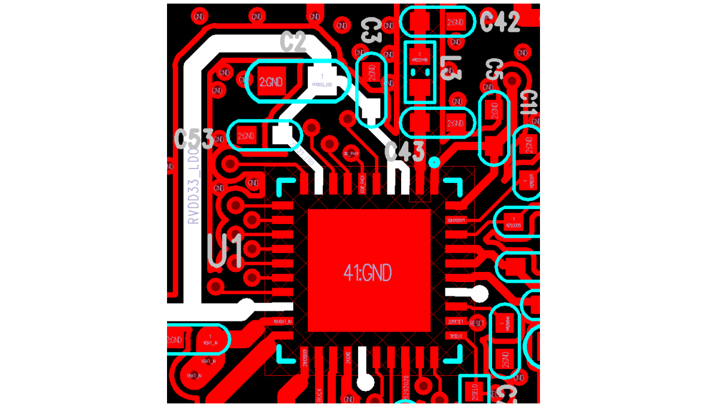
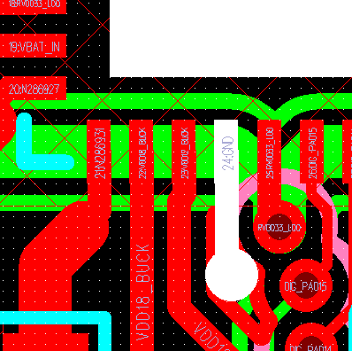
.. |image8| image:: ../../img/550X_硬件设计/图3-4.png
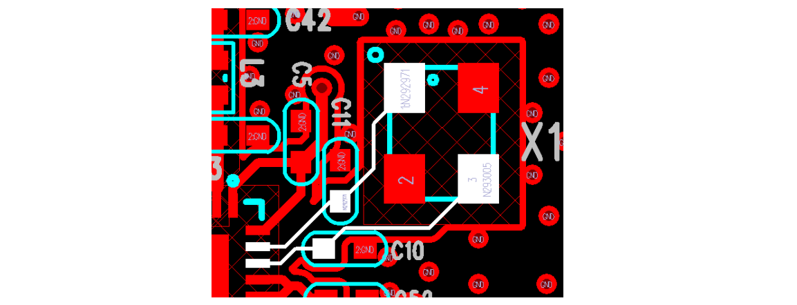
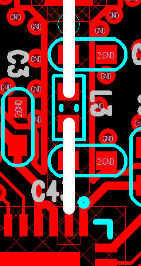
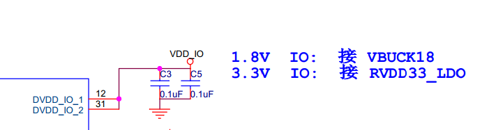
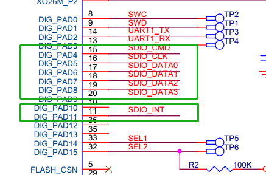
.. |image13| image:: ../../img/550X_硬件设计/图6-3.png
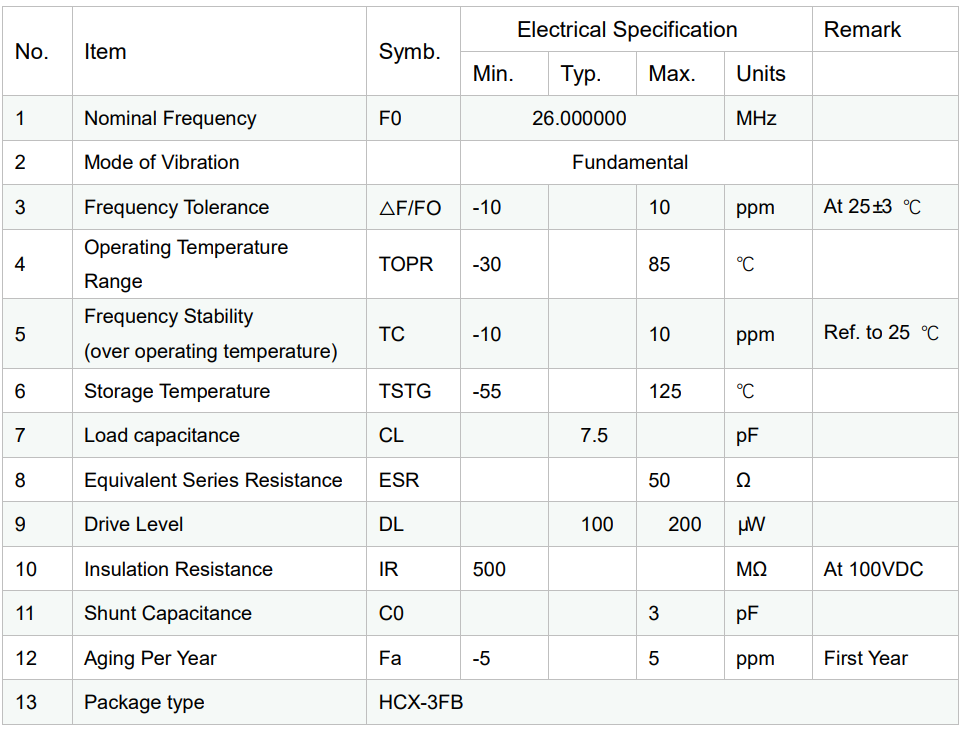
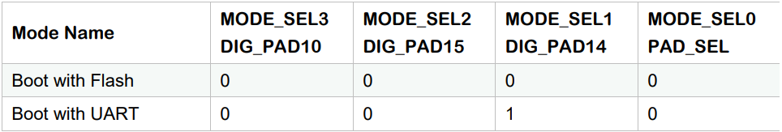
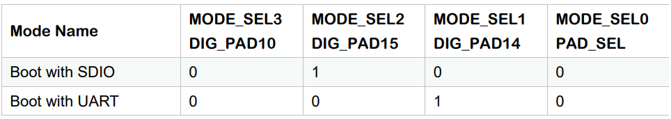