ASR5505S Wi-Fi 低功耗使用指南
============================

前言
----

**关于本文档**

本文档旨在提供 ASR5505S 透传芯片的功耗模式和配置指南。

**读者对象**

本文档主要适用于以下工程师：

-  单板硬件开发工程师
-  软件工程师
-  技术支持工程师

**产品型号**

本文旨在介绍用于 ASR560X 系列 BLE 芯片开发的 DOGO 工具的配置与使用。

============ ============ ======== =================
**产品型号** **协议**     **接口** **封装**
============ ============ ======== =================
ASR5505S     802.11 b/g/n SDIO 2.0 QFN 48, 6mm × 6mm
============ ============ ======== =================

**版权公告**

版权归 © 2024 翱捷科技股份有限公司所有。保留一切权利。未经翱捷科技股份有限公司的书面许可，不得以任何形式或手段复制、传播、转录、存储或翻译本文档的部分或所有内容。

**商标声明**

ASR、翱捷和其他翱捷商标均为翱捷科技股份有限公司的商标。

本文档提及的其他所有商标名称、商标和注册商标均属其各自所有人的财产，特此声明。

**免责声明**

翱捷科技股份有限公司对本文档内容不做任何形式的保证，并会对本文档内容或本文中介绍的产品进行不定期更新。

本文档仅作为使用指导，本文的所有内容不构成任何形式的担保。本文档中的信息如有变更，恕不另行通知。

本文档不负任何责任，包括使用本文档中的信息所产生的侵犯任何专有权行为的责任。

**防静电警告**

静电放电（ESD）可能会损坏本产品。使用本产品进行操作时，须小心进行静电防护，避免静电损坏产品。

**翱捷科技股份有限公司**

地址：上海市浦东新区科苑路399号张江创新园10号楼9楼 邮编：201203

官网： http://www.asrmicro.com/

**文档修订历史**

======= ====== ==========
日期    版本号 发布说明
======= ====== ==========
2024.01 V1.0.0 首次发布。
======= ====== ==========

1. 功耗模式
-----------

本文主要介绍 ASR5505S 支持的功耗模式。以下三种模式功耗依次降低：

1. Active 模式：芯片射频处于正常工作状态。芯片可以接收、发送和监听信号。

2. Modem-sleep 模式：CPU 处于 WFI 状态，Wi-Fi 保持连接状态，任何唤醒事件（MAC、RTC 定时器或外部中断）都会唤醒芯片。

3. Light-sleep 模式：CPU 暂停运行，XTAL 处于下电状态，Host 主控通过 HOST_WAKEUP_WIFI 唤醒芯片（通过控制 GPIO 拉低或者拉高使芯片进入或退出低功耗模式）。

.. note::

    1. Modem-sleep需要处于STA模式，Light-sleep需要在空闲状态时进入，如有需求请和FAE了解。
    2. 固件默认支持的是Modem-sleep模式。

2. 低功耗配置
-------------

2.1 低功耗硬件要求
~~~~~~~~~~~~~~~~~~

2.1.1 Modem-sleep
^^^^^^^^^^^^^^^^^

Modem-sleep 不需要外接引脚唤醒。在 STA 模式下，通过指令的方式进入或者退出该模式。

2.1.2 Light-sleep
^^^^^^^^^^^^^^^^^

Light-sleep 需要硬件支持。在没有进入 STA、SoftAP 模式时，通过 GPIO 控制进入或者退出该模式。硬件设计需要预留 2 个唤醒引脚的通路（PAD10、PAD12），硬件设计要求可以参考《ASR5505S 硬件设计指南》。

2.2 低功耗软件配置
~~~~~~~~~~~~~~~~~~

.. _modem-sleep-1:

2.2.1 Modem-sleep
^^^^^^^^^^^^^^^^^

**1.** **环境说明**

主控端：树莓派（Raspberry Pi 4B Linux）

Wi-Fi 端模式：STA

**2.** **驱动配置**

固件默认支持 Modem-sleep，驱动移植成功后，makefile 或者 menuconfig 直接使能 CONFIG_ASR_PM=y，如图 2-1、图 2-2 所示。

|image1|

|image2|

**3.** **指令调用**

连接到 AP，成功获取到ip后，可以通过如下指令进入或退出低功耗模式：

-  sudo iw dev wlan0 set power_save on

-  sudo iw dev wlan0 set power_save off

|image3|

.. _light-sleep-1:

2.2.2 Light-sleep
^^^^^^^^^^^^^^^^^

asrwifidrv 中自带通过 GPIO 唤醒的 Demo，当前带有的 Light-sleep 唤醒模式有三种，分别为：host_wakeup_wifi、wifi_wakeup_host 和双方向唤醒。以 wifi_wakeup_host 为例：

**1.** **环境说明**

主控端：树莓派（Raspberry Pi 4B Linux）

Wi-Fi 端模式：未开启任何模式

**2.** **驱动配置**

Host 端单方向唤醒 Module，asrwifidrv/makefile 或 menuconfig 直接使能 CONFIG_ASR_PM=y 和 CONFIG_GPIO_WAKEUP_MOD=y，如图 2-4 和 图 2-5 所示：

|image4|

|image5|

**3.** **驱动加载**

挂载驱动的时候，可加入 pm_out_gpio和pm_in_gpio 参数，分别指定 host_wakeup_wifi/wifi_wakeup_host 的 pin 脚。

-  insmod ./asr5505.ko pm_out_gpio=26 //使用树莓派 26 脚作为 Wi-Fi 模组唤醒脚（可自定义）接到 ASR5505S 的 pad12 上

GPIO 也可以在 asr_mod_params 中定义。具体参考 asr_mod_params.c 文件，如图：

|image6|

**4.** **使用说明**

驱动挂载完成之后，通过如下指令控制 GPIO。

-  sudo chmod 777 /sys/module/asr5505/parameters/pm_cmd
-  echo “suspend”> /sys/module/asr5505/parameters/pm_cmd //GPIO26 输出低电平，进入 light-sleep
-  echo “resume”> /sys/module/asr5505/parameters/pm_cmd //GPIO26 输出高电平，退出 light-sleep

resume 唤醒 Wi-Fi 之后，可以进入 SoftAP 或 STA 模式\ **（进入低功耗模式的前提是要保证没有创建连接）。**

若不想通过指令的方式控制 GPIO，也支持调用 API 的形式，可以参考 asr_cmd.c 文件中 pm_cmd_work_func 函数所调用的：asr_pm_suspend & asr_pm_resume。

.. note::

    1. 由于Light-sleep适用场景不统一，所以固件默认不支持Light-sleep，需要向FAE获取不同的唤醒方式的固件。
    2. 如果支持wakeup wifi，则可以通过输入指令获取GPIO电平状态：echo "get_out_level" > /sys/module/asr5505/parameters/pm_cmd
    3. 如果支持wakeup host，则可以通过输入指令获取GPIO电平状态：echo "get_in_level" > /sys/module/asr5505/parameters/pm_cmd

3. 功耗验证测试
---------------

3.1 测试环境
~~~~~~~~~~~~

测试工具：电流仪（KEYSIGHT-N6705C）

主控端：树莓派（Raspberry Pi 4B Linux）

Wi-Fi 端：ASR5505S

3.2 测试步骤
~~~~~~~~~~~~

以 ASR5505S 公版为例，按照下面步骤进行测量：

1. VBUS 连接电流仪供电（3.3 V）；

|image7|

2. GND 与电流仪共地；

3. 需要断开 Tx、Rx，防止串口有电流倒灌影响测试结果，连接如图：

|image8|

4. 电流仪通电，通过 TF 转 SDIO 接入树莓派，正常挂载 ASR5505S 驱动；

5. 进入低功耗状态，打开 Keysight 14585A 软件，测量电流。

3.3 Light-sleep 低功耗测量
~~~~~~~~~~~~~~~~~~~~~~~~~

Light-sleep 因为是通过 GPIO 控制，除上述前 3 个步骤外，还需要额外的接线。

以前面设定的 GPIO26 作为唤醒 Wi-Fi 端为例，树莓派的 pin 脚定义可以通过 pinout 指令查看：

|image9|

需要将树莓派 GPIO26，接到 ASR5505S 的 PAD12。

|image10|

再完成第 4、5 步测试即可。

4. 平均功耗
-----------

3.3 V 供电的情况下，当前三种模式功耗数据如下。

============ ========
**功耗模式** **功耗**
============ ========
Active (STA) 20 mA
Modem-sleep  6 mA
Light-sleep  0.8 mA
============ ========

具体如下图：

.. raw:: html

   

|image11|

树莓派 Active (STA) 功耗

.. raw:: html

   

.. raw:: html

   

|image12|

树莓派 Modem-sleep 功耗

.. raw:: html

   

.. raw:: html

   

|image13|

树莓派 Light-sleep 功耗

.. raw:: html

   

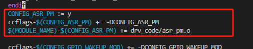
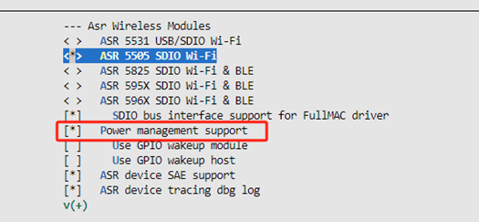
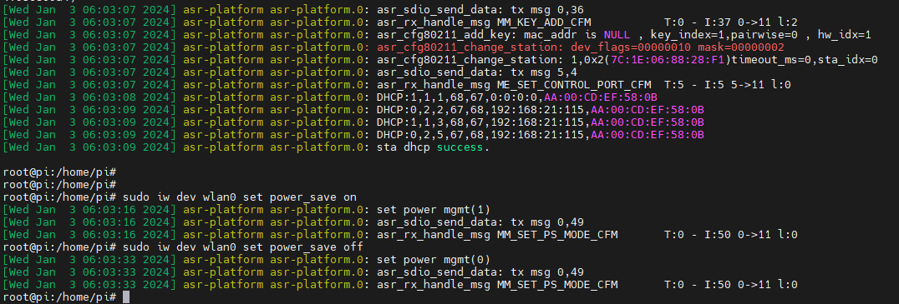
.. |image4| image:: ../../img/5505_低功耗使用指南/图2-4.png
.. |image5| image:: ../../img/5505_低功耗使用指南/图2-5.png
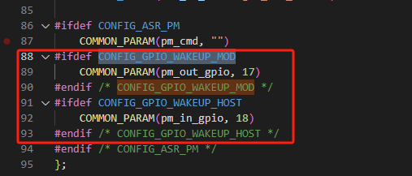
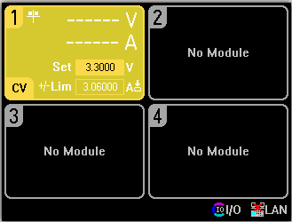
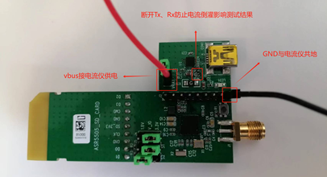
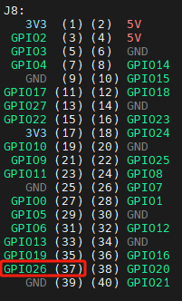
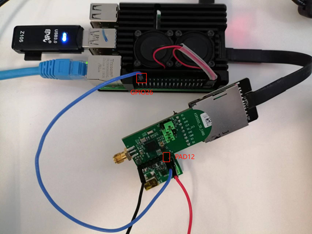
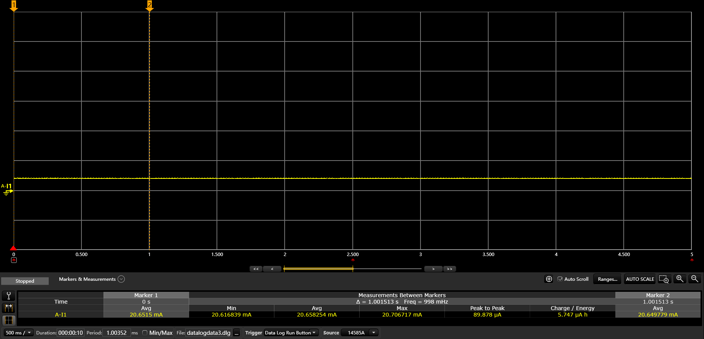
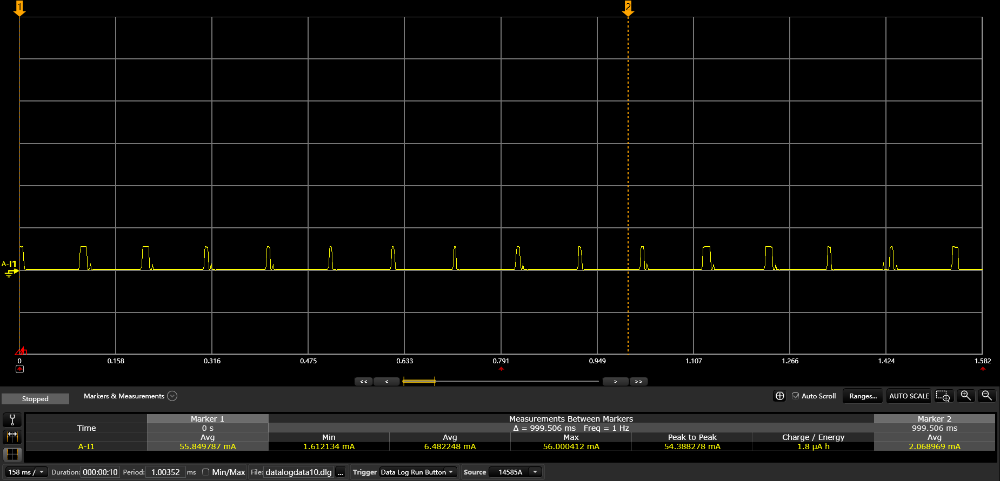
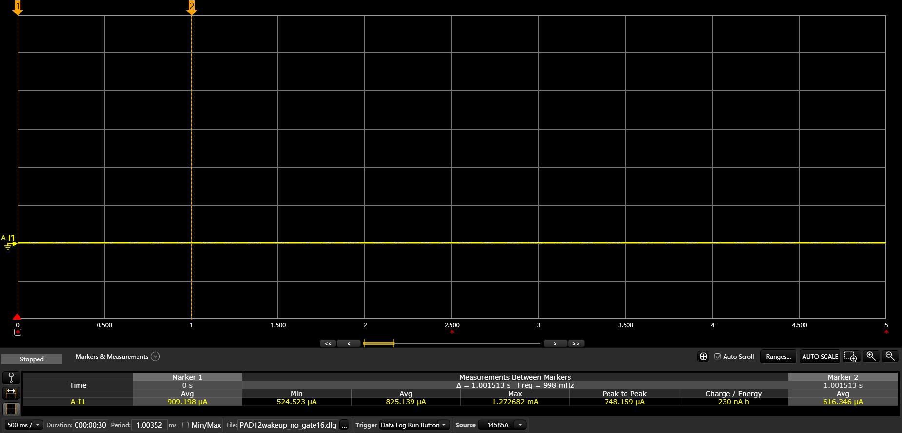
