ASR5505S 开发板使用指南
======================

前言
----

**关于本文档**

本文档旨在介绍 ASR5505S 芯片开发所用的 SDIO CARD 开发板的硬件配置。

**读者对象**

本文档主要适用于以下工程师：

-  单板硬件开发工程师
-  软件工程师
-  技术支持工程师

**产品型号**

本文档对应的产品型号如下：

============ ============ ======== =================
**产品型号** **协议**     **接口** **封装**
============ ============ ======== =================
ASR5505S     802.11 b/g/n SDIO 2.0 QFN 48, 6mm x 6mm
============ ============ ======== =================

**版权公告**

版权归 © 2024 翱捷科技股份有限公司所有。保留一切权利。未经翱捷科技股份有限公司的书面许可，不得以任何形式或手段复制、传播、转录、存储或翻译本文档的部分或所有内容。

**商标声明**

ASR、翱捷和其他翱捷商标均为翱捷科技股份有限公司的商标。

本文档提及的其他所有商标名称、商标和注册商标均属其各自所有人的财产，特此声明。

**免责声明**

翱捷科技股份有限公司对本文档内容不做任何形式的保证，并会对本文档内容或本文中介绍的产品进行不定期更新。

本文档仅作为使用指导，本文的所有内容不构成任何形式的担保。本文档中的信息如有变更，恕不另行通知。

本文档不负任何责任，包括使用本文档中的信息所产生的侵犯任何专有权行为的责任。

**防静电警告**

静电放电（ESD）可能会损坏本产品。使用本产品进行操作时，须小心进行静电防护，避免静电损坏产品。

**翱捷科技股份有限公司**

地址：上海市浦东新区科苑路399号张江创新园10号楼9楼 邮编：201203

官网： http://www.asrmicro.com/

**文档修订历史**

======= ====== ==========
日期    版本号 发布说明
======= ====== ==========
2024.05 V1.0.0 首次发布。
======= ====== ==========

1. 概述
-------

本文旨在介绍 ASR5505S 透传芯片开发板的硬件功能使用说明以及相关测试指令，帮助用户快速了解并使用该开发板配合用户的 HOST 平台进行应用开发以及验证测试。

ASR5505S 开发板搭配了标准 SD 卡接口，可以直接插入带有标准 SD 卡槽的设备，无需进行额外的连线，同时也提供了 SDIO 的对应引脚，多种选择满足不同用户场景。

|image1|

|image2|

2.组件介绍
----------

2.1 硬件介绍
~~~~~~~~~~~~

ASR 提供的开发板如图 2-1 所示：

|image3|

开发板的主要器件从左至右主要模块描述见下表描述：

+-----------------+----------------------------------------------------------------------------------------------+
| **主要组件**    | **功能**                                                                                     |
+=================+==============================================================================================+
| 晶振            | 开发板目前使用 26M 晶振                                                                      |
+-----------------+----------------------------------------------------------------------------------------------+
| ASR5505S        | ASR 提供的 Wi-Fi 透传芯片                                                                    |
+-----------------+----------------------------------------------------------------------------------------------+
| SEL2 引脚选择   | SDIO 模式选择引脚，上电时接 H 端，SEL1 接 L 端进入 SDIO 模式                                 |
+-----------------+----------------------------------------------------------------------------------------------+
| SEL1 引脚选择   | 烧录模式选择引脚，上电时接 H 端，SEL2 接 L 端进入烧录模式                                    |
+-----------------+----------------------------------------------------------------------------------------------+
| IO 电压选择     | 支持 3.3 V和 1.8 V 电压选择。                                                                |
+-----------------+----------------------------------------------------------------------------------------------+
| SDIO 接口       | 排序兼容标准 SD 卡接口，与 HOST 端通信。                                                     |
+-----------------+----------------------------------------------------------------------------------------------+
| USB to UART芯片 | 单芯片 USB 至 UART 转换芯片                                                                  |
+-----------------+----------------------------------------------------------------------------------------------+
| Mini USB 端口   | USB 接口，可用作开发板的供电电源，或连接 PC 和开发板的通信接口                               |
+-----------------+----------------------------------------------------------------------------------------------+
| Power LED       | 电源指示 LED，开发板通电后，绿色灯亮起                                                       |
+-----------------+----------------------------------------------------------------------------------------------+
| I/O 引脚        | I/O 引脚主要提供串口通信引脚、晶振选择引脚以及Deep Sleep唤醒引脚，功能介绍见2.2 引脚功能章节 |
+-----------------+----------------------------------------------------------------------------------------------+
| 复位按键        | 复位按键                                                                                     |
+-----------------+----------------------------------------------------------------------------------------------+
| SMA 天线座      | 注意实际使用 Wi-Fi 功能要带上天线，否则射频功能会出现异常                                    |
+-----------------+----------------------------------------------------------------------------------------------+

2.2 引脚功能
~~~~~~~~~~~~

下面两表列出了开发板 J2 排针的名称和功能，引脚丝印见开发板的背面。

======== ================
**名称** **功能**
======== ================
P13      PAD_13
P12      PAD_12
P11      PAD_11
P10      PAD_10
SWD      SWD
SWC      SWC
CTS      USB转UART芯片CTS
RTS      USB转UART芯片RTS
GND      GND
======== ================

2.3 硬件框图
~~~~~~~~~~~~

|image4|

2.4 硬件设置
~~~~~~~~~~~~

硬件设置主要是通过以下三组跳线帽来选择（下图红框部分），其中包括运行模式设置和 SDIO 的引脚电压选择。

|image5|

-  运行模式选择见 2.5 运行模式章节。
-  SDIO 引脚电压选择包括 3.3 V 和 1.8 V，主要是为了适配不同 HOST 平台的 SD 卡槽的电压模式。

2.5 运行模式
~~~~~~~~~~~~

运行模式主要通过 SEL 引脚选择跳线帽的组合来实现的，目前开发板提供以下几种运行模式：

-  UART 烧录模式：从 UART1 下载 ATE 固件到 SRAM 中。

-  SDIO 模式：上电进入 SDIO 运行模式。

   ============ ================ ================
   运行模式     **SEL2 (PAD15)** **SEL1 (PAD14)**
   ============ ================ ================
   UART烧录模式 L                H
   SDIO模式     H                L
   ============ ================ ================

|image6|

.. attention::
    1. UART 烧录模式是为了用于产线 ATE 测试使用，正常运行时要确保 SEL2 跳线帽接到 H 端，SEL1 跳线帽接到 L 端，使开发板在上电后正确进入 SDIO 模式。
    2. 开发板正常运行时需要注意开发板 HOST 端的上电顺序：
        (a) SEL2 跳线帽接到 H 端，SEL1 跳线帽接到 L 端；
        (b) 将开发板用 USB 供电，HOST 端断电；
        (c) 按下开发板的 reset 按键，使开发板进入 SDIO 模式；
        (d) HOST 端上电；
        (e) 等待 HOST 将固件通过 SDIO 接口下载到芯片 SRAM。

2.6 ATE烧录
~~~~~~~~~~~

2.6.1 DOGO工具烧录
^^^^^^^^^^^^^^^^^^

DOGO 工具支持 UART 烧录和 SDIO 接口烧录，两种接口烧录方式的固件不同（固件命名会区分 uart 和 sdio），但是固件在 DOGO 工具存放位置是相同的。

工具：使用 DOGO_VP2.4.6 及以上版本

======== ==========================================
烧录接口 **ATE固件名称**
======== ==========================================
UART     ASR5505S_sram-ate_v1.9.10_common_uart1.bin
SDIO     ASR5505S_sram-ate_v1.9.10_common_sdio.bin
======== ==========================================

固件存放位置：

将 ATE 固件放置在 DOGO 工具 ate_bin_dir 目录下，如需更名需要保留 ate 字样，如重命名为 ate_sram_v1.3.6.bin 或 sram_ate.bin 等。

|image7|

.. attention::
    ate_bin_dir 文件夹不可重命名。

**UART烧录**

打开工具，按照下列步骤进行：

1. 选择 ChipType 为 550X
2. 勾选 only_ate_sram
3. 打开串口
4. 板子复位（参考表 2-3，进入 UART 烧录模式），出现 1F2E3D00，表示进入烧录模式
5. 点击烧录
6. 出现#>后，表示烧录完成
7. 发送 get_ate_ver，出现“ATE_ASR_VERSION”已处于 ATE 模式，可以继续进行测试

|image8|

**SDIO烧录**

打开工具，按照下列步骤进行：

1. 串口选择“ASR-IoT SDIO Device”
2. 选择 ChipType 为 550X
3. 勾选 only_ate_sram
4. 打开串口
5. 板子复位（参考表 2-3，进入 SDIO 模式），点击烧录
6. 出现“Boot ATE Successfully”后，表示烧录完成
7. 发送 get_ate_ver，出现“ASR_ATE_VERSION_V1.x.x”已处于 ATE 模式，可以继续进行测试

|image9|

.. attention::
    1. 测试过程不要掉电。
    2. SDIO 烧录需要在 Win7 版本的台式机上外接 PCIe 转 SDIO 的转接板，并安装 ASR 提供的驱动，Windows 驱动安装请参考《ASR_SDIO产测Windows驱动安装及自动化产测说明》。

2.6.2 Linux 驱动烧录
^^^^^^^^^^^^^^^^^^^

DOGO 工具烧录 ATE 固件适用于两种场景：一种是单模组的情况，另一种是产品板上引出了测试点可以通过 PC 端进行验证的情况。如果芯片或模组已经焊接到产品板上，在生产过程中不方便使用上位机测试，或者希望通过产品板测试程序来进行测试，那么可以使用加载 Wi-Fi 驱动的方式下载 ATE 固件。在产品板上，可以使用 echo 指令下发射频测试指令进行 ATE 测试。在产品开发阶段，可以先使用 ASR 提供的开发板进行验证。具体操作步骤如下：

1. 移植并编译 Wi-Fi 驱动

   Wi-Fi 驱动移植请参考《ASR 透传系列_Wi-Fi 驱动移植和使用指南》文档。

2. 将 ATE 固件放到 /lib/firmware 目录下

   ATE 固件重命名为 ate_sdio_asr5505.bin，并放置到 /lib/firmware 目录下。

|image10|

3. 加载驱动

使用如下命令加载驱动：

insmod asr5505.ko downloadfw=1 downloadATE=0 driver_mode=1

加载驱动成功后，在 Linux 系统上会出现一个 /sys/module/asr5505/parameters/ate_at_cmd 的节点

|image11|

4. 发送测试指令

使用 echo 指令向 5505的ate_at_cmd 节点发送 ATE 指令，如下例所示：

echo “get_ate_ver” > /sys/module/asr5505/parameters/ate_at_cmd

等待大概 600 ms 左右，使用 cat 指令打印节点信息，就会打印上述指令执行的结果，如下所示：

cat /sys/module/asr5505/parameters/ate_at_cmd

|image12|

射频测试指令请参考《ASR550X 系列_射频测试指南》。

3. 软件资源
-----------

3.1 软件框图
~~~~~~~~~~~~

ASR5505S 透传芯片区别于传统的 IOT 方案，芯片没有内置 Flash，固件运行在芯片的 SRAM 上，当设备上电时，固件通过 SDIO 接口从主机上下载到芯片 SRAM 中。

|image13|

3.2 通信流程
~~~~~~~~~~~~

ASR5505S 对于 Host 端来说是一个 SDIO 接口的卡设备，所以在 Host 上电时需要注册卡设备，通过 SDIO 的 CMD 线进行卡设备扫描、初始化卡设备等流程。

不同的 Host 端系统对于卡识别的方式有区别，需要根据实际的系统来操作。下图是 Linux 系统下对 ASR5505S 初始化的通信流程图；当完成卡注册后，会加载 Wi-Fi 驱动，加载驱动时会将 ASR5505S 的固件通过 SDIO 接口下载到芯片的 SRAM 中，下载成功后即可通过上层应用操作 Wi-Fi 相关功能。

|image14|

3.3 Wi-Fi 驱动移植
~~~~~~~~~~~~~~~~~

Wi-Fi 驱动移植请参考文档：《ASR 透传系列_Wi-Fi 驱动移植和使用指南》。

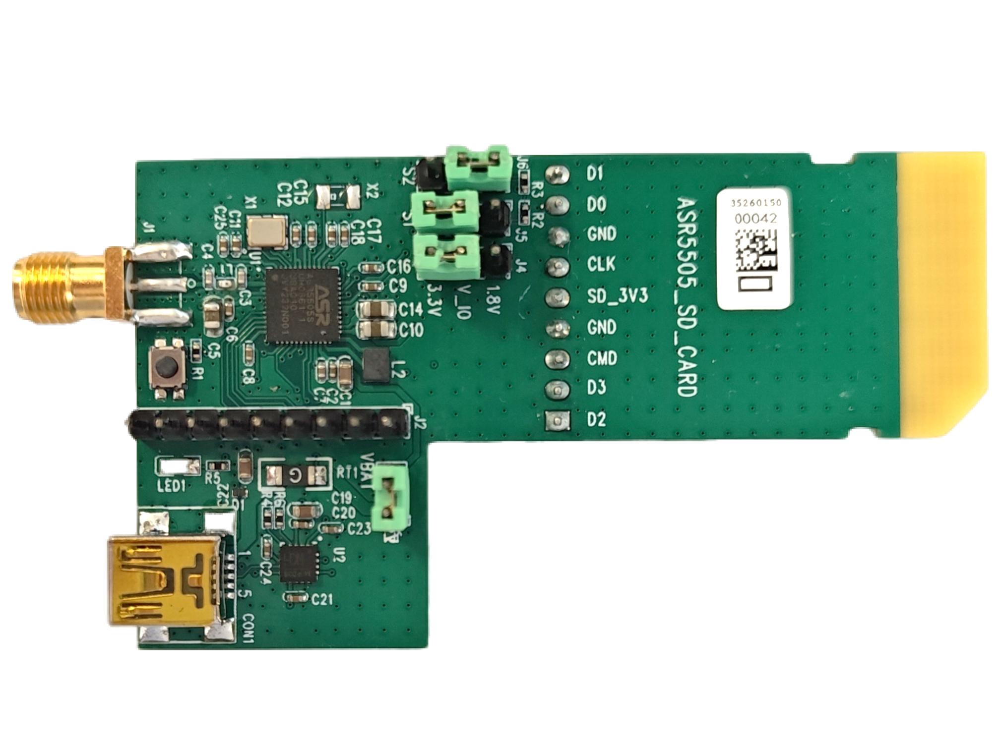
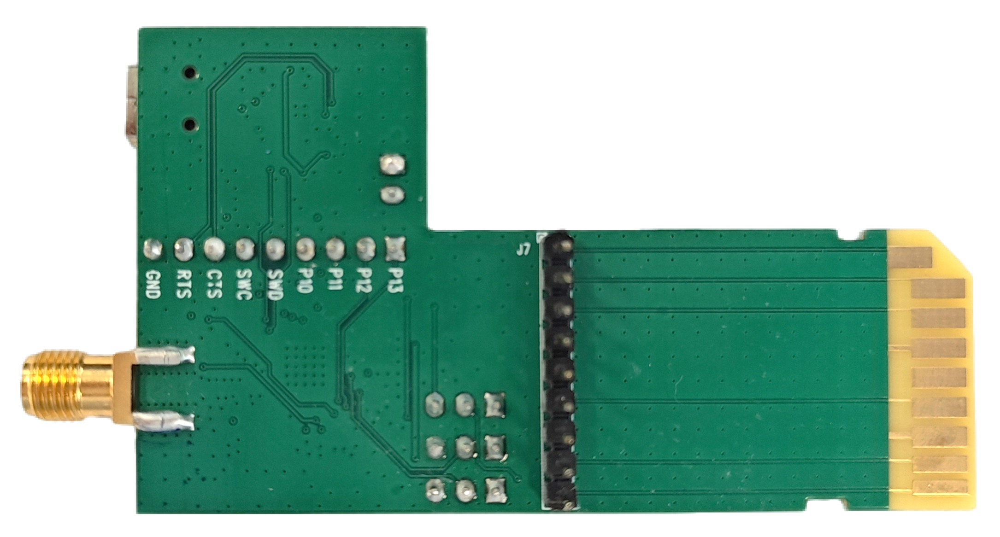
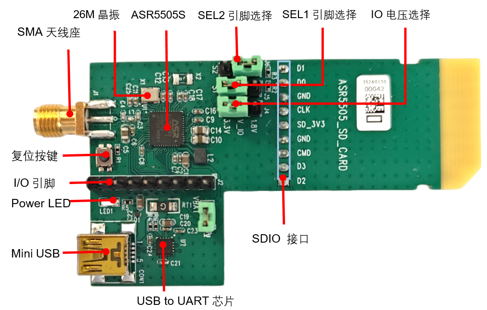
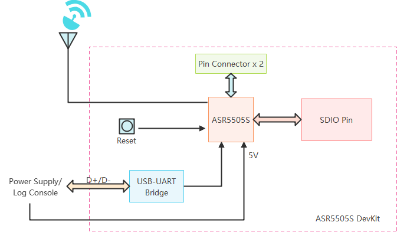
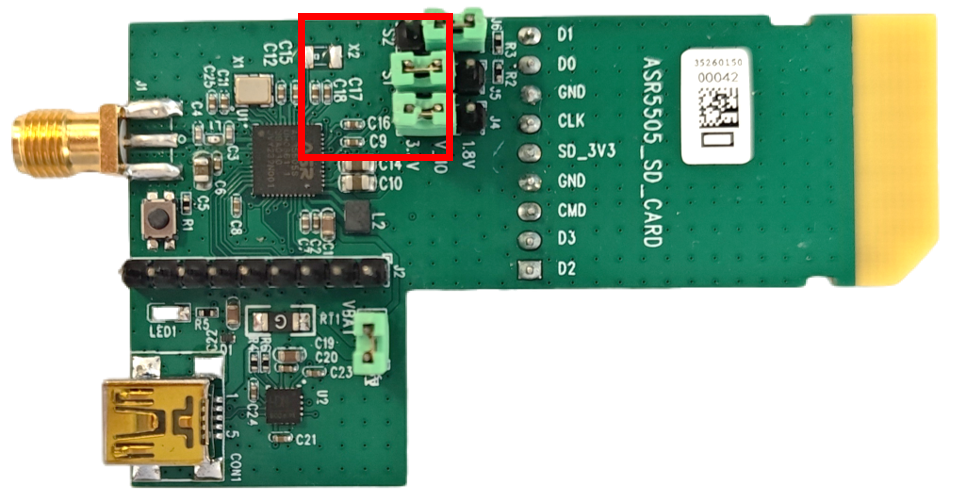
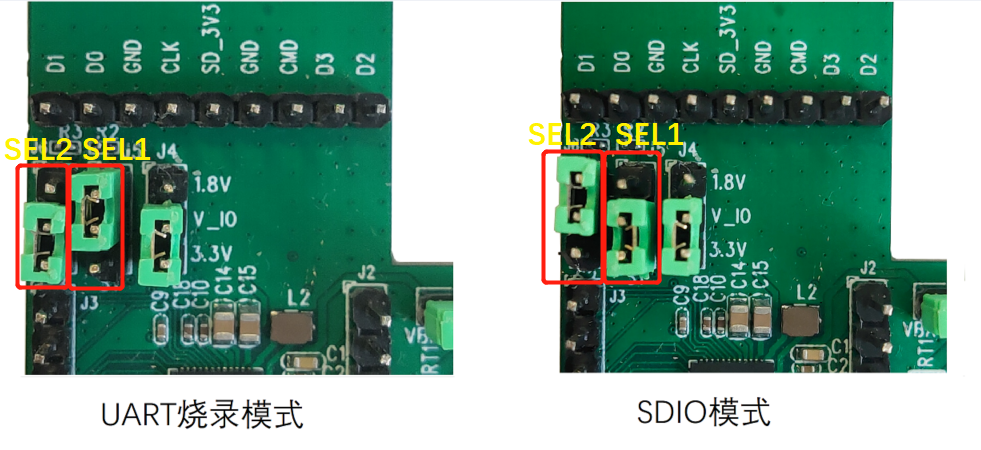
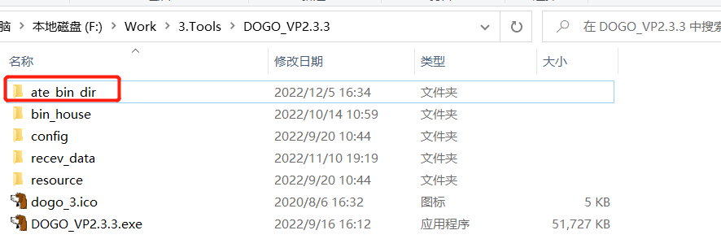
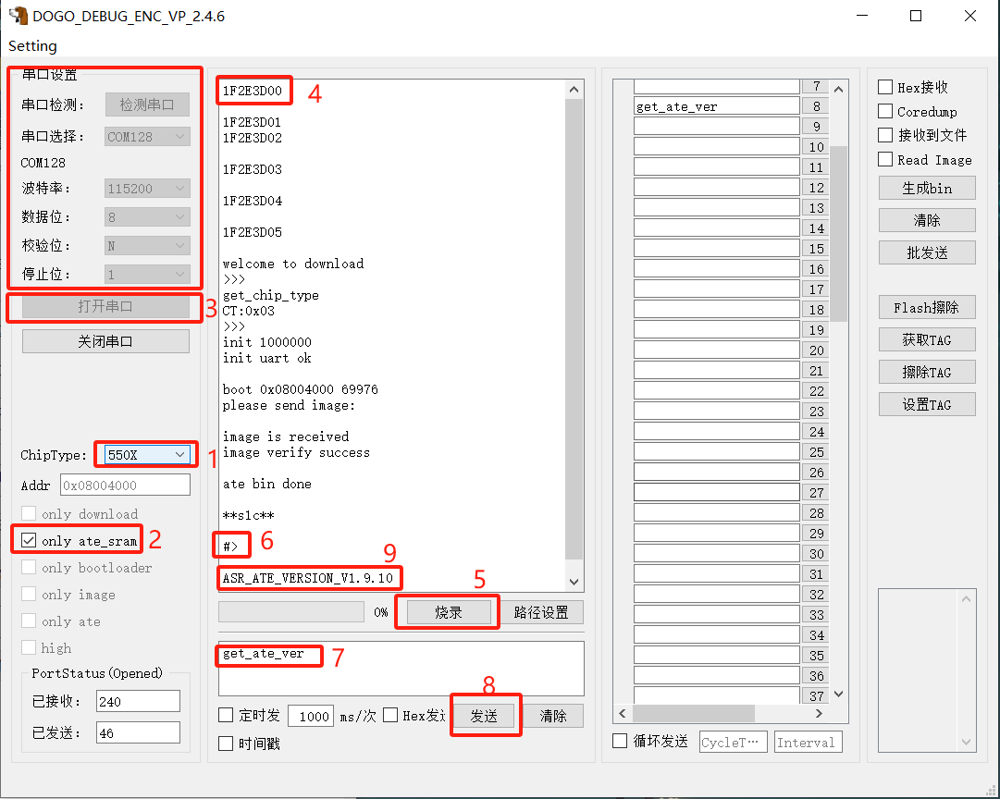
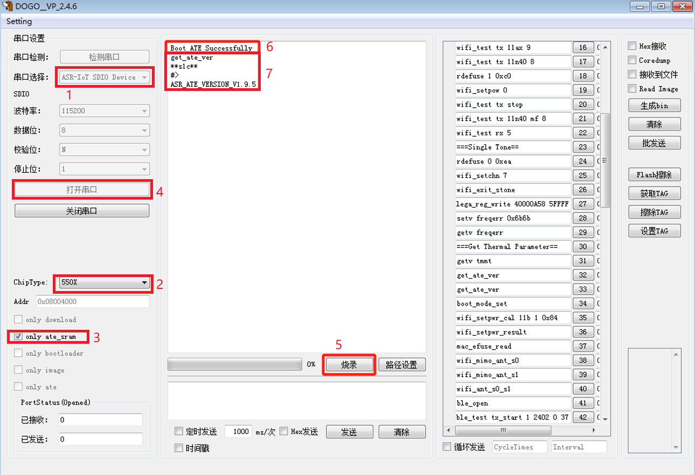
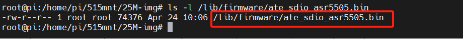
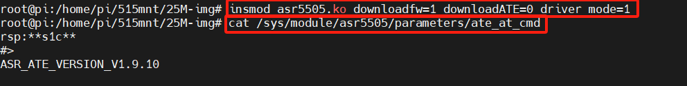
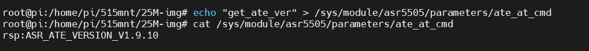
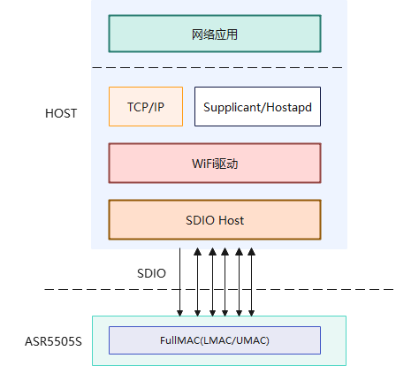
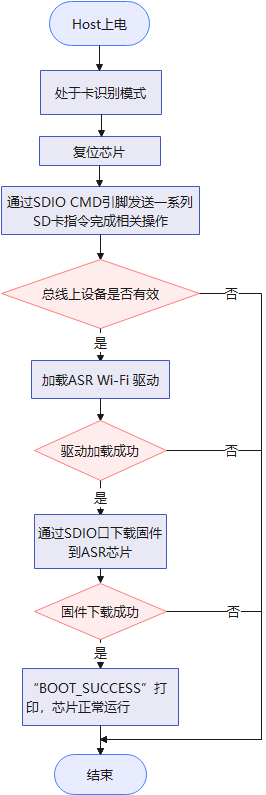