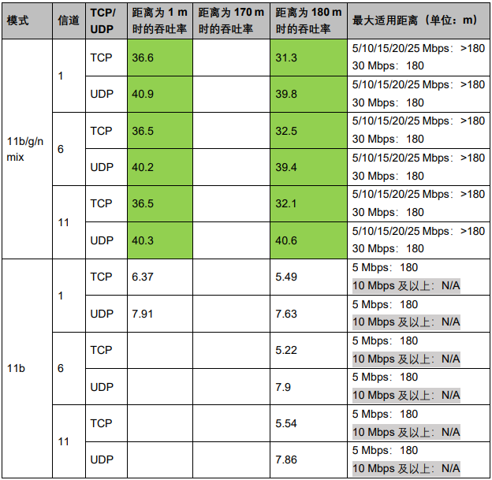
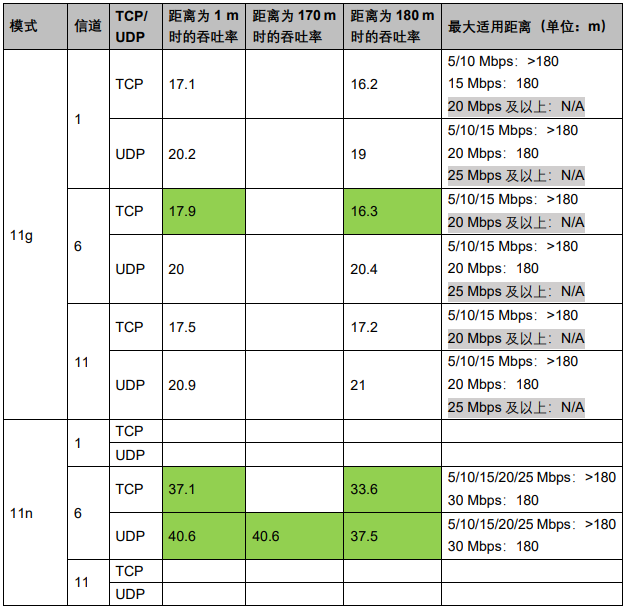
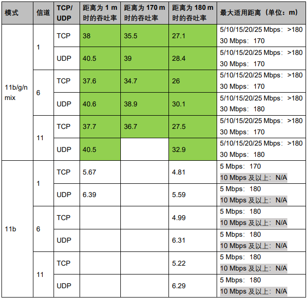
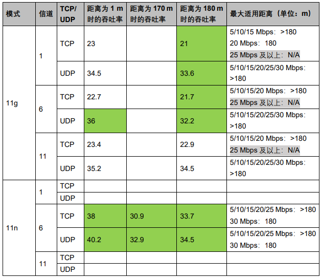

ASR5505S 拉锯吞吐测试报告
=========================

前言
----

**关于本文档**

本文档旨在提供 Wi-Fi 芯片 ASR5505S（48 pin）拉距吞吐的测试报告。

**产品型号**

与本文档相对应的产品型号如下：

============ ============ ======== =================
**产品型号** **协议**     **接口** **封装**
============ ============ ======== =================
ASR5505S     802.11 b/g/n SDIO 2.0 QFN 48，6mm × 6mm
============ ============ ======== =================

**版权公告**

版权归 © 2023 翱捷科技股份有限公司所有。保留一切权利。未经翱捷科技股份有限公司的书面许可，不得以任何形式或手段复制、传播、转录、存储或翻译本文档的部分或所有内容。

**商标声明**

ASR、翱捷和其他翱捷商标均为翱捷科技股份有限公司的商标。

本文档提及的其他所有商标名称、商标和注册商标均属其各自所有人的财产，特此声明。

**免责声明**

翱捷科技股份有限公司对本文档内容不做任何形式的保证，并会对本文档内容或本文中介绍的产品进行不定期更新。

本文档仅作为使用指导，本文的所有内容不构成任何形式的担保。本文档中的信息如有变更，恕不另行通知。

本文档不负任何责任，包括使用本文档中的信息所产生的侵犯任何专有权行为的责任。

**翱捷科技股份有限公司**

地址：上海市浦东新区科苑路399号张江创新园10号楼9楼 邮编：201203

官网： http://www.asrmicro.com/

**文档修订历史**

======= ====== ==========
日期    版本号 发布说明
======= ====== ==========
2023.02 V1.0.0 首次发布。
======= ====== ==========

1. 测试说明
-----------

1.1 测试方法和注意事项
~~~~~~~~~~~~~~~~~~~~~~

STA 模式下测吞吐率的测试方法和注意事项：

(1) 准备一个测试设备并进入 STA 模式。

(2) 设置辅助路由器并设置成对应的 Wi-Fi 协议版本等。

(3) 测试设备 Wi-Fi 连接上路由器，使用辅助 PC 通过网线连上路由器。

(4) 在测试设备和辅助 PC上 分别运行 iperf 的 server 和 client 模式开始测试。

(5) 测试的时候需要记录 iperf 两端的 log。

(6) 测试的时候需要记录测试设备端的 rssi。

1.2 测试环境
~~~~~~~~~~~~

测试是在地下车库中进行的，测试设备与路由器在一条直线上并且中间无遮挡。

2. 测试环境
-----------

2.1 TX吞吐率测试数据
~~~~~~~~~~~~~~~~~~~~

TX 吞吐率数据和据此得出的最大适用距离如下表所示（带宽：HT20，加密：open），表中数据单位为 Mbps。

.. raw:: html

   

|image1|

.. raw:: html

   

.. raw:: html

   

|image2|

.. raw:: html

   

.. attention::
    1. 标灰色表示对应模式下无法达到该速率。
    2. 标绿色表示为使用 PC 端跑 iperf 出来的测试结果。
    3. 部分适用距离为“ >180 米 ”，是因为地下室长度只有 180 米，无法进一步验证降低速率后的最大距离，所以只能给出大致范围。
    4. 空白部分的数据后续补充。
 

2.2 RX吞吐率测试数据
~~~~~~~~~~~~~~~~~~~~

RX 吞吐率数据和据此得出的最大适用距离如下表所示（带宽：HT20，加密：open），表中数据单位为 Mbps。

.. raw:: html

   

|image3|

.. raw:: html

   

.. raw:: html

   

|image4|

.. raw:: html

   

.. attention::
    1. 标灰色表示对应模式下无法达到该速率。
    2. 标绿色表示为使用 PC 端跑 iperf 出来的测试结果。
    3. 部分适用距离为“ >180 米 ”，是因为地下室长度只有 180 米，无法进一步验证降低速率后的最大距离，所以只能给出大致范围。
    4. 空白部分的数据后续补充。

