ASR5502X 系列 FreeRTOS 平台公有云用户手册
=======================================

前言
----

**关于本文档**

本文档旨在提供公有云平台与芯片连接的具体方案，以实现芯片与云端的双向通信。

**读者对象**

本文档主要适用于以下工程师：

-  单板硬件开发工程师
-  软件工程师
-  技术支持工程师

**产品型号**

本文档适用于 ASR IoT 5502X 系列 Wi-Fi 芯片。

**版权公告**

版权归 © 2020 翱捷科技股份有限公司所有。保留一切权利。未经翱捷科技股份有限公司的书面许可，不得以任何形式或手段复制、传播、转录、存储或翻译本文档的部分或所有内容。

**商标声明**

ASR、翱捷和其他翱捷商标均为翱捷科技股份有限公司的商标。

本文档提及的其他所有商标名称、商标和注册商标均属其各自所有人的财产，特此声明。

**免责声明**

翱捷科技股份有限公司对本文档内容不做任何形式的保证，并会对本文档内容或本文中介绍的产品进行不定期更新。

本文档仅作为使用指导，本文的所有内容不构成任何形式的担保。本文档中的信息如有变更，恕不另行通知。

本文档不负任何责任，包括使用本文档中的信息所产生的侵犯任何专有权行为的责任。

**防静电警告**

静电放电（ESD）可能会损坏本产品。使用本产品进行操作时，须小心进行静电防护，避免静电损坏产品。

**翱捷科技股份有限公司**

地址：上海市浦东新区科苑路399号张江创新园10号楼9楼 邮编：201203

官网： http://www.asrmicro.com/

**文档修订历史**

======== ========== ============
**日期** **版本号** **发布说明**
======== ========== ============
2020.05  V1.0.0     首次发布。
======== ========== ============

1. 概述
-------

使用 ASR5502X 系列芯片通过无线 Wi-Fi 方式连接公有云平台，可以实现数据的上报（数据从芯片端到云端）和数据的下发控制（数据从云端到芯片端）。

本文档提供了公有云平台与芯片连接的具体方案，以实现芯片与云端的双向通信。其中包括：百度云、京东云、腾讯云、华为云和AWS云。设备端已经预先移植相关配网方法，用户可以使用命令写入需要配置的共有云的多元组信息，在代码中更新密钥之后可连接配网测试。

方案的设备端使用\ *MQTTS*\ 的方式与云端通信，云端下发控制，芯片端上报状态。

2. 公有云开发、编译及使用步骤
-----------------------------

2.1 注册公有云
~~~~~~~~~~~~~~

根据自身需求在对应网站上进行如下操作：

注册公有云账号→新建产品、设备→获取云端CA证书→获取设备连接信息→获取设备证书和设备私钥（部分公有云平台需要）

2.2 下载证书并移植
~~~~~~~~~~~~~~~~~~

下载公有云对应的 CA 证书已经集成在 SDK 中。

需要设备证书、设备私钥的平台，要求用户在新建产品、设备之后自行下载证书，并将其移植到 SDK 对应代码中，位置为 *./cloud/src/*.c*\ 。

2.3 编译
~~~~~~~~

使用 ASR FreeRTOS SDK 编译的方法参考 SDK 中的编译说明文件。

默认的编译方式没有将公有云代码编译；修改 build/build_rules/project/demo/config.mk 中的 CLOUD_SWITCH 配置为 1（原先为 0，默认不编译），并且将下列被注释掉的部分打开：

\*$(NAME)_FLAGS += -DCLOUD_BAIDU_SUPPORT\*

\*$(NAME)_FLAGS += -DCLOUD_JD_SUPPORT\*

\*$(NAME)_FLAGS += -DCLOUD_TENCENT_SUPPORT\*

\*$(NAME)_FLAGS += -DCLOUD_HAUWEI_SUPPORT\*

\*$(NAME)_FLAGS += -DCLOUD_AWS_SUPPORT\*

修改 config.mk 文件后再重新编译 SDK，此时编译的 bin 文件已经包含公有云 Demo。

2.4 烧录
~~~~~~~~

编译之后会生成 bin 文件，用 DOGO 工具，并按照其使用说明可以将 bin 文件烧入 flash。

2.5 连网
~~~~~~~~

Bin 文件烧录时，重新上电，系统启动之后就可开始联网操作。

运行公有云需要先调用 Wi-Fi 相关命令使芯片连接网络，相关使用方法参考文档\ *《ASR5502X系列_FreeRTOS平台_AT命令使用指南》*\ ，以下是简单的说明：

输入命令：\ *wifi_open sta <SSID> <password>*

命令解释：wifi_open sta 为固定字符串；<SSID>为将要连接的路由器的 SSID；<password>为路由器密码。

2.6 配置连接信息
~~~~~~~~~~~~~~~~

选择对应公有云（百度、腾讯、京东、华为、亚马逊）中的任意一个，以华为云为例，使用华为云命令，向 flash 中写入连接信息：huawei write hostname <hostName>。

每个公有云所需要写入的连接信息不同，可参考第 4~8 章关于各个云的调试说明。

2.7 连接公有云
~~~~~~~~~~~~~~

以华为云为例，在配置写入之后，使用 huawei start 命令开启任务并连接。串口会有连接成功的打印。

2.8 控制下发及状态上报
~~~~~~~~~~~~~~~~~~~~~~

控制的下发根据公有云平台的不同，使用方法会有相应区别，比如：有些公有云在新建产品设备之后，添加对应属性并编辑值就可下发；有的需要自行编辑 JSON 字符串，如腾讯云；而华为云则需要编写 profile 文件。具体请参考第 4~8 章关于各个云的调试说明。

DEMO 给出的示例包含：下发控制后，在 PAYLOAD 中取出对应命令，指示灯会有对应的操作；操作之后会通过信号量发送给当前使用的公有云任务；在任务中上报当前指示灯状态。

下发的内容、上报的内容都会有串口相应提示。

3. 公有云结构及代码目录
-----------------------

3.1 公有云结构
~~~~~~~~~~~~~~

公有云分为百度云、京东云、腾讯云、华为云和亚马逊云。每一个云端的连接、控制都是在一个新的任务下进行，每一个云对应一个 task，任何时刻仅可用命令开启最多一个云任务。

任务中包含：云端连接的初始化模块及状态的上报；云端控制的接收；在云端连接初始化时注册到 tcpip 任务的回调函数中；公有云的任务会阻塞等待信号量，当有开关操作后，任务会接收信号量并上报状态。

公有云的开启、关闭和云连接参数在 AT 命令中实现。

3.2 与云相关的代码目录
~~~~~~~~~~~~~~~~~~~~~~

3.2.1 云调用函数
^^^^^^^^^^^^^^^^

文件 **./at_cmd/atcmd_cloud.c**\ （写入配置，开启任务，结束任务）提供了关于云端（例如 Baidu 云）的命令方法。

+-------------------------------------------+-------------------------------------------------------------------+
| **函数**                                  | **描述**                                                          |
+===========================================+===================================================================+
| at_cloud_baidu()                          | 命令执行函数。                                                    |
+-------------------------------------------+-------------------------------------------------------------------+
| lega_flash_kv_get()                       | 通过key获取flash中存储的value值。                                 |
+-------------------------------------------+-------------------------------------------------------------------+
| lega_rtos_create_thread()                 | 新建一个（例如Baidu云）任务。                                     |
+-------------------------------------------+-------------------------------------------------------------------+
| lega_rtos_set_semaphore(&baidu_Semaphore) | 释放信号量，后续在baidu cloud的任务中获取该信号量之后会结束任务。 |
+-------------------------------------------+-------------------------------------------------------------------+

3.2.2 连云主模块
^^^^^^^^^^^^^^^^

文件 **./cloud/src/cloud.c**\ （任务执行主函数，云初始化，上传状态和下发控制实现主结构）提供了具体云端（例如 Baidu 云）的任务、云端连接初始化、收到云端反馈回调函数的注册等。其中 Baidu 云的部分由宏 *CLOUD_BAIDU_SUPPORT* 控制。

+---------------------------+-----------------------------------------------------------------------------------------------------------------------------------------------------------------------------------------------+
| **函数**                  | **描述**                                                                                                                                                                                      |
+===========================+===============================================================================================================================================================================================+
| baidu_cloud_task()        | 任务函数，包括初始化操作，任务循环，以及任务退出。                                                                                                                                            |
+---------------------------+-----------------------------------------------------------------------------------------------------------------------------------------------------------------------------------------------+
| baidu_get_value()         | 获取在atcmd_cloud.c文件中写入的flash的相关参数，并将参数保存在结构体中，该结构体指针为全局变量 baidu_para。                                                                                   |
+---------------------------+-----------------------------------------------------------------------------------------------------------------------------------------------------------------------------------------------+
| baidu_connection_cb       | mqtt连接的回调函数，demo在该函数内获取连接的状态，如果返回连接成功，则释放 baidu_connect_Semaphore 信号量，用于标注连接成功状态。如果程序获取该信号量超时或连接失败，则会重新发起 mqtt 连接。 |
+---------------------------+-----------------------------------------------------------------------------------------------------------------------------------------------------------------------------------------------+
| mqtt_set_inpub_callback() | 设定来自云端数据的回调函数 *baidu_incoming_data_cb*\ 。                                                                                                                                       |
+---------------------------+-----------------------------------------------------------------------------------------------------------------------------------------------------------------------------------------------+
| baidu_incoming_data_cb()  | 云端有消息来时的回调函数，在该函数内部获取温度的设置信息，并通过 mqtt_publish 将该信息上报到云端。                                                                                            |
+---------------------------+-----------------------------------------------------------------------------------------------------------------------------------------------------------------------------------------------+

3.2.3 连云通用模块
^^^^^^^^^^^^^^^^^^

文件 **./cloud/src/cloud_common.c**\ （云共有模块）提供了各个云的共有功能，主要有： 指示灯的初始化；中断回调函数（用于触碰按键控制灯的开关）；灯开关的具体操作（拉高/拉低引脚电平）。

3.2.4 公有云自有模块
^^^^^^^^^^^^^^^^^^^^

文件 **./cloud/src/*.c**\ ：包含腾讯、华为、京东和亚马逊云自有的函数。

3.3 灯控制模块
~~~~~~~~~~~~~~

为方便使用，公有云提供指示灯控制，用户在连接公有云之后可以通过公有云控制指示灯的开关，在指示灯进行开关动作之后会将状态上报到云端；用户可以通过外接按钮来输入中断控制指示灯的开关。

指示灯的初始化、控制以及中断在 **./cloud/src/cloud_common.c** 中实现。

3.4 设备控制及状态上报
~~~~~~~~~~~~~~~~~~~~~~

3.4.1 云端控制的接收及上报
^^^^^^^^^^^^^^^^^^^^^^^^^^

控制的接收通过 cloud.c 中的\ **huawei_incoming_data_cb()** 函数实现，该函数在连接华为云时注册。

函数处理接收 JSON 字符串，如果 control 下有\ *True*\ 则为控制开，有\ *False*\ 则为控制关；之后修改灯的状态变量 light_flag，并执行小灯控制函数，然后向华为云任务发送信号量。

公有云任务在收到信号之后会上报状态。（如果其他云端也有连接，则会通过信号量方式通知其他共有云任务上报灯状态）

3.4.2 中断的接收及上报
^^^^^^^^^^^^^^^^^^^^^^

在收到外部中断后，中断控制函数修改灯的状态变量 light_flag，并执行小灯控制函数，然后向当前开启的公有云任务发送信号量。公有云的 task 在收到信号量之后会调用 MQTT 的 publish 上报数据。

4. 华为云调试说明
-----------------

4.1 注册华为物联网开发平台
~~~~~~~~~~~~~~~~~~~~~~~~~~

注册地址：https://iot-dev.huaweicloud.com:8843/login?service=https%3A%2F%2Fiot-dev.huaweicloud.com%2F#/developer-overview。

注册之后参考华为 IoT 平台的 *文档说明* 来新建产品和新建设备（注册产品后，需要先配置 profile 文件再新建设备，具体配置 profile 见\ *3.2*\ 节）。

4.2 设备端连接
~~~~~~~~~~~~~~

4.2.1 设备端连接所需信息
^^^^^^^^^^^^^^^^^^^^^^^^

在连接华为云之前注册设备，能够获取设备的连接信息：hostname、deviceID、deviceSecret。

4.2.2 设备端连接命令
^^^^^^^^^^^^^^^^^^^^

通过使用设备端命令可连接华为云，设备端命令及使用说明如下：

======================================== ==========================
**指令**                                 **描述**
======================================== ==========================
huawei write hostName <hostName>         连接的hostname或ip address
huawei write deviceID <deviceID>         连接设备的ID
huawei write deviceSecret <deviceSecret> 连接设备的密钥
huawei show                              显示当前写入flash中的设置
huawei start                             开启任务连接华为云
Huawei stop                              关闭华为云
======================================== ==========================

4.2.3 设备端连接示例
^^^^^^^^^^^^^^^^^^^^

1. 在华为云端新建产品及设备。例如，新建如下信息：

   产品名称：ASR550X

   设备名称：asr550x_test1

   设备 ID：a569940f-2d35-4287-80a8-a112cb165d50

   设备密钥：a70a60311841ed7b1451

   Hostname：49.4.93.24

2. 设备端通过 Wi-Fi 联网。

3. 使用设备端命令连接华为云：

   huawei write hostName 49.4.93.24

   huawei write deviceID a569940f-2d35-4287-80a8-a112cb165d50

   huawei write deviceSecret a70a60311841ed7b1451

   huawei start

4. 串口会打印如下连接信息，有“successfully connected”表明连接成功。

|image1|

5. 完成之后，云端网页会显示设备在线，如下图所示。

|image2|

4.3 设备端控制及状态上报
~~~~~~~~~~~~~~~~~~~~~~~~

1. 配置 profile 文件

   华为云新建产品后需要配置 profile 文件，在 profile 文件中新增如下内容，具体如下图

   *ServiceID\ *\ **：**\ *\ Turn*

​ *属性：switchone*

​ *命令：control*

关于 profile 的作用，可参见华为云官方文档说明。

|image3|

2. 命令下发及状态上传

   在设备列表中点击“调试产品”，可进入如下界面：

|image4|

   其中，可以发送之前设置的命令，并接收上报的信息。如上图，上报的信息能够从应用模拟器的数据接收中看到，下发的信息可以选择服务、命令及具体下发的字符串，然后点击发送按钮。

   命令下发及设备状态上报会打出如下图所示的相应 log。

|image5|

5. 京东云调试说明
-----------------

5.1 注册京东智连云
~~~~~~~~~~~~~~~~~~

注册地址：https://login.jdcloud.com/?returnUrl=https%3A%2F%2Fiot-console.jdcloud.com%2F。

操作指南：https://docs.jdcloud.com/cn/iot-hub/product-overview。

根据京东云的操作指南来注册产品及设备，得到联网信息，例如：

+---------------+-------------------------------------------------------------+
| **参数**      | **示例**                                                    |
+===============+=============================================================+
| productKey    | zWRXxlluOFH                                                 |
+---------------+-------------------------------------------------------------+
| productSecret | tqa1KwqmWFxlOjHR                                            |
+---------------+-------------------------------------------------------------+
| identifer     | FKmgpwrgfNTQ                                                |
+---------------+-------------------------------------------------------------+
| deviceName    | test1                                                       |
+---------------+-------------------------------------------------------------+
| deviceSecret  | xJeoGVfFjDIP3bOJ                                            |
+---------------+-------------------------------------------------------------+
| hostName      | iothub-cn1-778891-master-nlb-FI.jvessel-open-hb.jdcloud.com |
+---------------+-------------------------------------------------------------+

.. _设备端连接-1:

5.2 设备端连接
~~~~~~~~~~~~~~

.. _设备端连接命令-1:

5.2.1 设备端连接命令
^^^^^^^^^^^^^^^^^^^^

设备端连接命令如下：

====================================== =========================
**指令**                               **描述**
====================================== =========================
jd write productKey <productKey>       写入产品key
jd write productSecret <productSecret> 写入产品密钥
jd write identifer <identifer>         写入设备ID identifer
jd write deviceName <deviceName>       写入设备名称
jd write deviceSecret <deviceSecret>   写入设备密钥
jd write hostName <hostName>           写入host name
jd show                                显示当前写入flash中的设置
jd start                               开启任务连接京东云
jd stop                                关闭京东云
====================================== =========================

.. _设备端连接示例-1:

5.2.2 设备端连接示例
^^^^^^^^^^^^^^^^^^^^

1. 连接的的顺序为：先连网（见\ *2.2*\ 节），后写入配置，写入 jd write 命令，再执行 jd start 开启设备。

   例如，\ *5.1*\ 节示例的产品设备信息可以用如下的命令写入并开启任务：

   jd write productKey zWRXxlluOFH

   jd write productSecret tqa1KwqmWFxlOjHR

   jd write identifer FKmgpwrgfNTQ

   jd write deviceName test1

   jd write deviceSecret xJeoGVfFjDIP3bOJ

   jd write hostName iothub-cn1-778891-master-nlb-FI.jvessel-open-hb.jdcloud.com

   jd start

2. 串口会打印如下连接信息，有“successfully connected”表明连接成功：

|image6|

3. 云端会显示设备已经在线，如下图所示：

|image7|

.. _设备端控制及状态上报-1:

5.3 设备端控制及状态上报
~~~~~~~~~~~~~~~~~~~~~~~~

在京东云端控制台界面选择→影子→新期望值→关闭/打开（关闭和打开是需要自己新建的属性）→更新期望值。云端会向设备端发送信息。

|image8|

因为京东云任务在连接之后会订阅相关 topic，控制命令会通过订阅的 topic 下发数据。

下发回调函数为：\ *jd_incoming_data_callback()，*\ 该函数包含如下操作：

(1) 该函数会获取 payload 的 JSON 字符串中的 version 值，JD 平台要求上报的数据的 version 值为当前平台的 version+1。

(2) 之后函数会获取 metadata/state 字段中的 desired 数据中的 switch 的值为字符串 True 还是 False，\ *True*\ 代表开动作，\ *False*\ 代表关动作。

指示灯变化之后，会向京东云任务发送信号，在京东云的任务中上报数据（publish），该过程会有如下图所示的串口打印：

|image9|

云端显示的设备状态也会随之改变，如果没有改变，则可点击下图中的刷新按钮。

|image10|

6.腾讯云调试说明
----------------

1.1 注册腾讯云
--------------

注册地址：https://console.cloud.tencent.com/iothub。

相关说明可参见帮助文档：https://cloud.tencent.com/document/product/634。

新建产品和设备：

======== ==============
**参数** **示例**
======== ==============
产品名称 testproductone
产品ID   9X3HAXY2VC
设备名称 testliu
======== ==============

腾讯云注册之后需要下载 CA 证书、设备证书、设备私钥，需要将SDK中的相关证书替换成自己下载的证书或私钥。其地址为 **./cloud/src/tencent_func.c**\ 。

其中，\ *tencent_ca_crt[]* 存放CA证书；\ *tencent_client_cert[]* 存放设备证书； *tencent_client_private_key[]* 存放设备私钥。

.. _设备端连接-2:

6.2 设备端连接
~~~~~~~~~~~~~~

.. _设备端连接命令-2:

6.2.1 设备端连接命令
^^^^^^^^^^^^^^^^^^^^

设备端连接命令如下：

===================================== =========================
**指令**                              **描述**
===================================== =========================
tencent write productID <productID>   写入产品ID
tencent write deviceName <deviceName> 写入设备名称
tencent write hostName <hostName>     写入host name
tencent show                          显示当前写入flash中的设置
tencent start                         开启任务连接腾讯云
tencent stop                          关闭腾讯云
===================================== =========================

.. _设备端连接示例-2:

6.2.2 设备端连接示例
^^^^^^^^^^^^^^^^^^^^

1. 在设备端串口输入连接命令：

   tencent write productID 9X3HAXY2VC

   tencent write deviceName testliu

   tencent write hostName 9X3HAXY2VC.iotcloud.tencentdevices.com

   tencent start:

2. 串口会打印如下连接信息，有“successfully connected”表明连接成功：

|image11|

3. 连接之后网页端会显示设备在线：

|image12|

.. _设备端控制及状态上报-2:

6.3 设备端控制及状态上报
~~~~~~~~~~~~~~~~~~~~~~~~

设备在线后，点击操作里的管理按钮会进入下图所示的界面：

|image13|

该界面可以选择 topic 和发送命令，其中发送 *{switch:True}* 为开灯操作，\ *{switch:False}* 为关灯操作。下发之后右侧的日志会显示下发的 JSON 字符串及设备上报的字符串。

|image14|

设备端在初始化时已经订阅相关 topic，例如：9X3HAXY2VC/testliu/control。

当收到云端下发的消息时，消息会在回调函数中处理：tencent_incomming_data_cb()，该函数包含如下操作：

(1) 首先回调函数中会将 version 字段与云端同步，上报时会用该 version 字段。

(2) 之后会从 result 中读 switch 的值，如果位 True 则为开灯操作；如果位 False 则为关灯操作。

(3) 开灯操作和关灯操作执行之后，会给腾讯云任务发送信号，在腾讯云任务中处理设备状态的上报（publish）。

设备端串口会打印如下的云端命令接收及设备处理后的状态上报的信息：

|image15|

7. 百度云调试说明
-----------------

7.1 注册百度云
~~~~~~~~~~~~~~

注册地址：https://cloud.baidu.com/product/iot.html。

参考文档：https://cloud.baidu.com/doc/IOT/index.html。

产品和设备新建，在物影子中可进行调试。

.. _设备端连接-3:

7.2 设备端连接
~~~~~~~~~~~~~~

.. _设备端连接命令-3:

7.2.1 设备端连接命令
^^^^^^^^^^^^^^^^^^^^

设备的连接命令如下说明：

=============================== =======================
**指令**                        **描述**
=============================== =======================
baidu write hostName <hostname> 设置连接的url
baidu write userName <username> 设置连接的user name
baidu write userPass <userpass> 设置连接的user password
baidu write clientID <clientid> 设置连接的client id
baidu show                      显示设置的连接信息
baidu start                     开启任务连接Baidu云
baidu stop                      停止任务断开Baidu云
=============================== =======================

.. _设备端连接示例-3:

7.2.2 设备端连接示例
^^^^^^^^^^^^^^^^^^^^

1. 在设备联网之后，可用如下命令连接百度云：

   baidu write userName yebmkj2/mqtt1

   baidu write userPass k5mzpepv7hb1zipx

   baidu write clientID mqtt1

   baidu write hostName yebmkj2.mqtt.iot.gz.baidubce.combaidu

   baidu start

2. 串口会打印如下连接信息，有“successfully connected”表明连接成功：

|image16|

3. 百度云端会有设备在线的显示：

|image17|

.. _设备控制及状态上报-1:

7.3 设备控制及状态上报
~~~~~~~~~~~~~~~~~~~~~~

在百度云进入物影子，点击进入在线的 mqtt1 设备之后，点击编辑，然后将期望值改为“True”后保存。云端会自动下发控制命令。

|image18|

设备端接收到控制数据之后会解析并控制灯的开关，之后向百度云任务发信号量，在百度云任务实现状态的上报（publish），串口打印如下图：

|image19|

同时，云端数据也会自动更新，如下图所示：

|image20|

8.亚马逊云调试说明
------------------

8.1 注册亚马逊国内版
~~~~~~~~~~~~~~~~~~~~

亚马逊云分为国内版和国外版，国内版本需要以公司的名义注册，详情见AWS中国官方声明。本设备连接使用AWS国内版。

国内版注册网址：https://www.amazonaws.cn/。

按照官方说明新建 things 之后，选择已经建立的 thing01 进入，如下图。

|image21|

AWS 国内版注册之后需要下载 CA 证书、设备证书、设备私钥，需要将 SDK 中的相关证书替换成自己下载的证书或私钥。证书存储在 **./cloud/src/aws_func.c** 文件中。

其中，\ *aws_ca_crt[]* 存放 CA 证书；\ *aws_client_cert[]* 存放设备证书；\ *aws_client_private_key[]*\ 存放设备私钥。这个需自行替换之后，重新编译烧录。

.. _设备端连接-4:

8.2 设备端连接
~~~~~~~~~~~~~~

.. _设备端连接所需信息-1:

8.2.1 设备端连接所需信息
^^^^^^^^^^^^^^^^^^^^^^^^

连接 Aws 云需要先知道 hostName、productID、clientID 等。

.. _设备端连接命令-4:

8.2.2 设备端连接命令
^^^^^^^^^^^^^^^^^^^^

aws write命令：将上述 3 个参数写入 flash 中，供 aws 云启动的时候调用。

aws show命令：显示当前的设置。

aws start命令：开启任务，并连接 aws云。

具体如下表所示：

================================ ====================
**指令**                         **描述**
================================ ====================
aws write hostName <hostname>    设置连接的host name
aws write productID < productid> 设置连接的product id
aws write clientID <clientid>    设置连接的client id
aws show                         显示设置的连接信息
aws start                        开启任务连接Aws云
aws stop                         停止任务断开Aws云
================================ ====================

.. _设备端连接示例-4:

8.2.3 设备端连接示例
^^^^^^^^^^^^^^^^^^^^

1. 写入配置，查看并连接 aws 云：

   aws write hostName athd018zuldn6.ats.iot.cn-north-1.amazonaws.com.cn

   aws write productID athd018zuldn6

   aws write clientID thing01

   aws start

2. 串口会打印如下连接信息，有“successfully connected”表明连接成功：

|image22|

.. _设备控制及状态上报-2:

8.3 设备控制及状态上报
~~~~~~~~~~~~~~~~~~~~~~

设备属性中有配置 switch，对应值为\ *True*\ 或\ *False*\ 。

在设备影子中通过“编辑”修改影子文档并保存，AWS 云会自动下发控制。

|image23|

保存之后串口会有对应的打印显示：

|image24|

AWS 云网页端的\ *reported*\ 状态也会随之改变：

|image25|

A.附录 - 相关资料
-----------------

本文档中提到的参考信息总结如下：

运行公有云需要先调用 Wi-Fi 相关命令使芯片连接网络，相关使用方法参考文档\ *《ASR5502X系列_FreeRTOS平台_AT命令使用指南》*\ 。

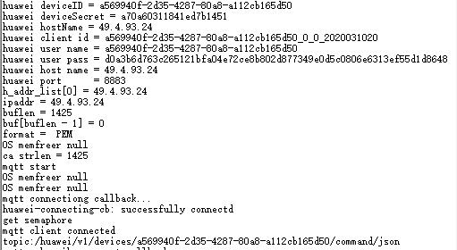
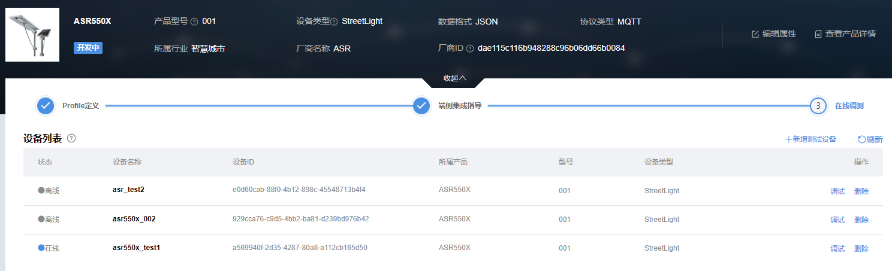
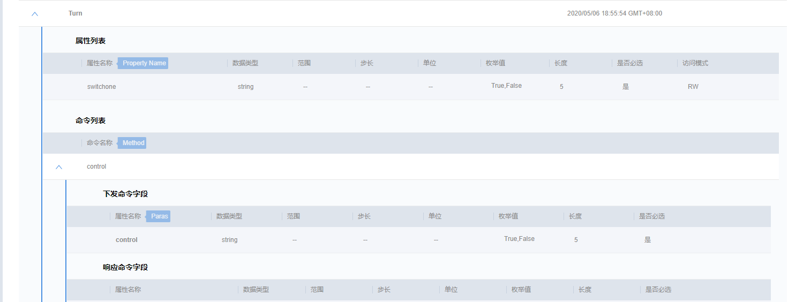
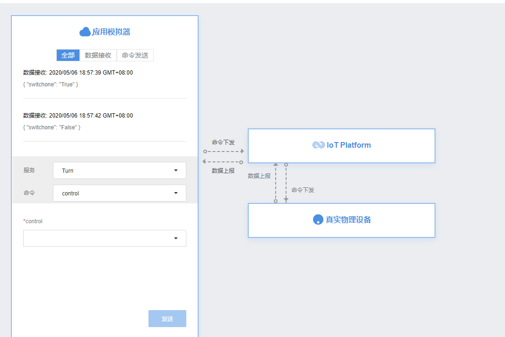
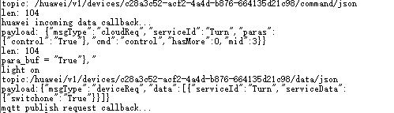
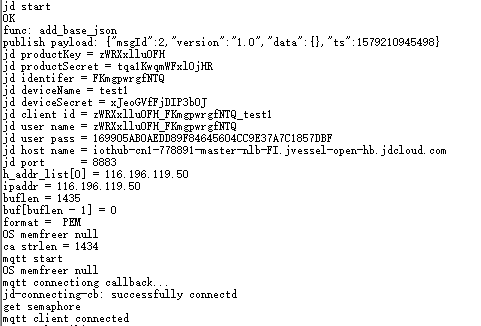
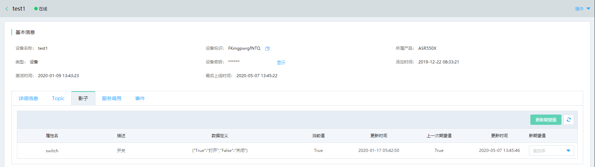
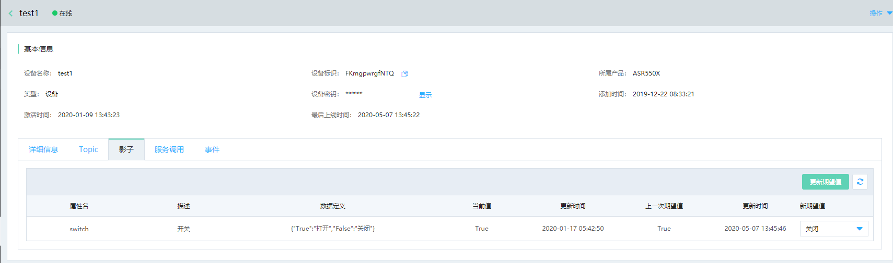
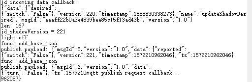
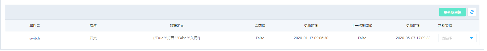
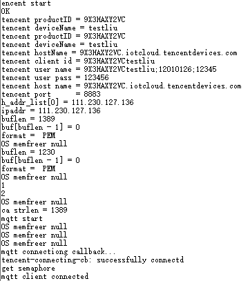
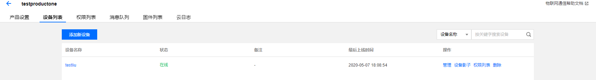
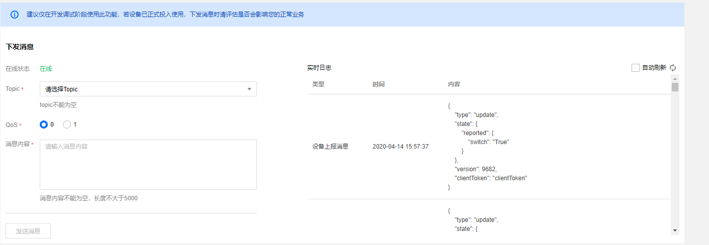
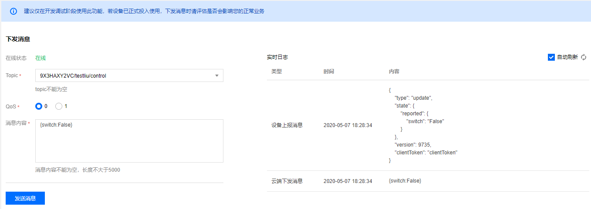
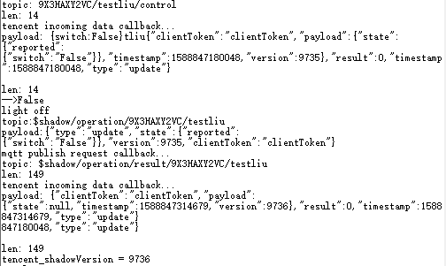
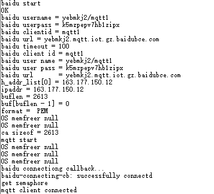
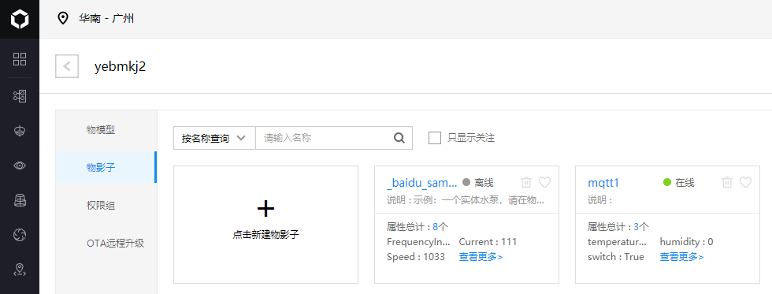
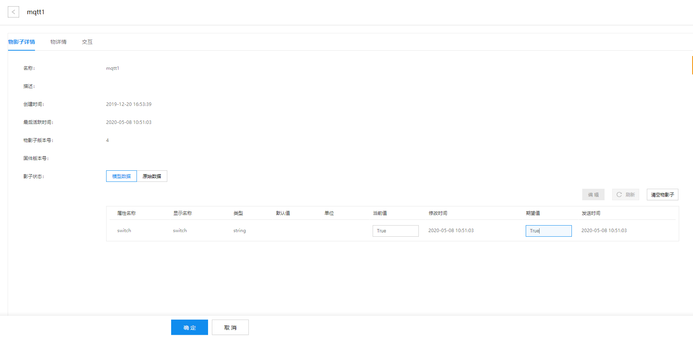
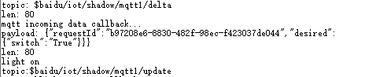
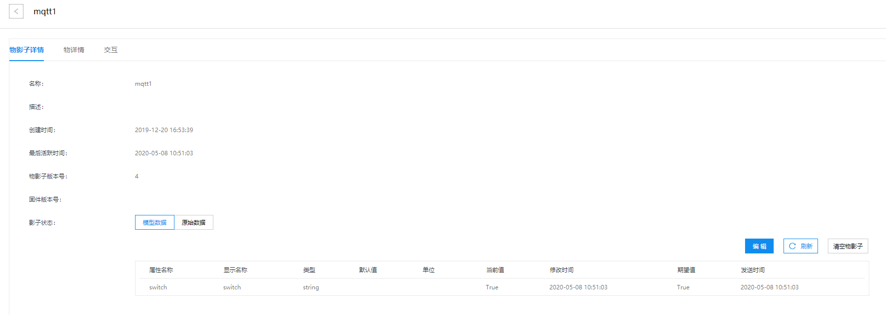
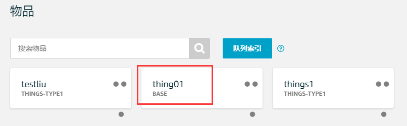
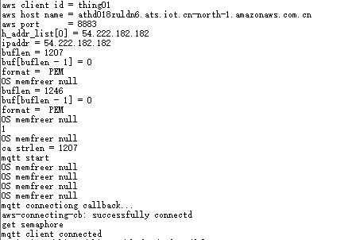
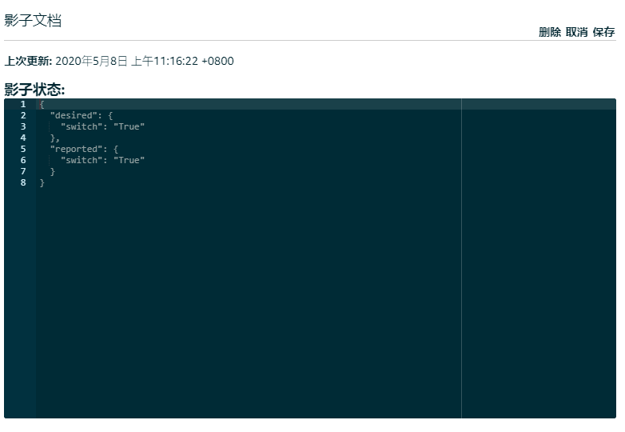
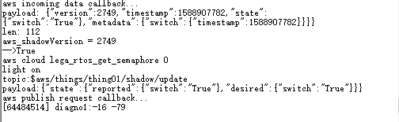
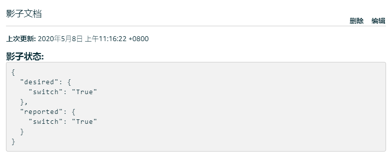