ASR5502X 系列 FreeRTOS 平台 外设 Demo 用户手册
==========================================

前言
----

**关于本文档**

本文档主要介绍 ASR5502X 系列 Wi-Fi 芯片的各个外设接口，包括功能、参数配置、函数说明和应用示例，用户根据此指导文件可快速地搭建基于 FreeRTOS 平台调用相应的外设模块的应用程序。

**读者对象**

本文档主要适用于以下工程师：

-  单板硬件开发工程师
-  软件工程师
-  技术支持工程师

**产品型号**

本文档适用于 ASR IoT 5502X 系列 Wi-Fi 芯片。

**版权公告**

版权归 © 2020 翱捷科技股份有限公司所有。保留一切权利。未经翱捷科技股份有限公司的书面许可，不得以任何形式或手段复制、传播、转录、存储或翻译本文档的部分或所有内容。

**商标声明**

ASR、翱捷和其他翱捷商标均为翱捷科技股份有限公司的商标。

本文档提及的其他所有商标名称、商标和注册商标均属其各自所有人的财产，特此声明。

**免责声明**

翱捷科技股份有限公司对本文档内容不做任何形式的保证，并会对本文档内容或本文中介绍的产品进行不定期更新。

本文档仅作为使用指导，本文的所有内容不构成任何形式的担保。本文档中的信息如有变更，恕不另行通知。

本文档不负任何责任，包括使用本文档中的信息所产生的侵犯任何专有权行为的责任。

**防静电警告**

静电放电（ESD）可能会损坏本产品。使用本产品进行操作时，须小心进行静电防护，避免静电损坏产品。

**翱捷科技股份有限公司**

地址：上海市浦东新区科苑路 399 号张江创新园 10 号楼 9 楼 邮编：201203

官网： http://www.asrmicro.com/

**文档修订历史**

======== ========== ============
**日期** **版本号** **发布说明**
======== ========== ============
2020.11  V1.0.0     首次发布。
======== ========== ============

1. SDK 目录介绍
--------------

SDK 目录结构如下表所示：

|image1|

2. 外设模块使用说明
-------------------

2.1 GPIO 使用说明
~~~~~~~~~~~~~~~~

2.1.1 功能描述
^^^^^^^^^^^^^^

ASR5502X 共有 16 个 GPIO 口，它们分别可配置为不同的输入，输出模式和复用功能，通用 IO 口和各引脚的复用功能，如下表所示：

|image2|

2.1.2 参数配置
^^^^^^^^^^^^^^

GPIO 设备的结构体定义如下所示：

|image3|

结构体成员说明如下：

-  port 为 GPIO 的端口号，uint8_t 类型，实际定义为宏（枚举），例如：

|image4|

-  config，其定义为一个枚举类型，用来配置 IO 的上拉、下拉、中断和输出模式，如下图所示：

|image5|

-  priv 为保留的函数指针，使用 GPIO 功能时，该指针赋值为空。

2.1.3 使用示例
^^^^^^^^^^^^^^

(1) 定义 GPIO0，GPIO1 结构体变量：

|image6|

(2) GPIO0 配置为下降沿中断模式：

|image7|

// GPIO0 中断服务程序：

|image8|

(3) GPIO1 配置为普通推挽输出模式：

|image9|

完整代码请参考\ *SDK\ *\ **：**\ *\ demo/periphare/gpio*\ 文件夹。

2.2 Watchdog 接口使用说明
~~~~~~~~~~~~~~~~~~~~~~~~

.. _功能描述-1:

2.2.1 功能描述
^^^^^^^^^^^^^^

看门狗用来检测和解决由程序引起的故障，比如一个程序正常运行的时间是 50ms，在运行完这个程序之后紧接着进行喂狗，当系统设置独立看门狗的定时溢出时间为 60ms，大于被监控的程序整个运行的时间 50ms，如果超过 60ms 还没有喂狗，则说明被监控的程序出故障了，此时会产生系统复位，让程序重新运行，ASR5502X 芯片支持看门狗功能，并可对看门狗溢出时间进行配置。

.. _参数配置-1:

2.2.2 参数配置
^^^^^^^^^^^^^^

Watchdog 设备的结构体定义如下所示：

|image10|

|image11|

结构体成员说明如下：

-  port：设备号，固定为 0。

-  config：配置看门狗的超时时间，以毫秒为单位计时，如果设置看门狗超时时间为2秒，则计算公式为：wdg.config.timeout=2\ *Timeout_value=2*\ 1000毫秒。

-  priv：未使用，该指针赋值必须为空。

SDK 提供清除看门狗计数器的 API为\ *lega_wdg_reload(&lega_wdg)*\ 。

.. note:: 
    默认在看门狗中断服务函数中有进行清除动作，如果用户需使用看门狗来重启系统，则需把中断服务函数中的喂狗动作去掉，将喂狗动作放到其他主任务中去。

.. _使用示例-1:

2.2.3 使用示例
~~~~~~~~~~~~~~

(1) 看门狗初始化函数如下所示：

|image12|

(2) 主程序调用看门狗初始化及清除看门狗超时计数标志：

|image13|

2.3 Timer 接口使用说明
~~~~~~~~~~~~~~~~~~~~~

.. _功能描述-2:

2.3.1 功能描述
^^^^^^^^^^^^^^

ASR5502X 提供 2 个硬件定时器，每个硬件定时器都具有周期定时和单次定时功能，定时器计数到 0 时，会产生中断信号。如果定时器配置周期定时功能，定时中断信号产生后，会自动加载原始的值和周期性的计数；如果定时器配置为单次触发模式，中断信号产生后，定时器会停止计数，直到重新配置它。

.. _参数配置-2:

2.3.2 参数配置
^^^^^^^^^^^^^^

定时器设备的结构体定义如下所示：

|image14|

结构体成员说明如下：

-  port：指定定时器编号，定时器 1/2 的宏定义如下所示：

|image15|

-  config：定时器配置参数结构体，定义如下：

|image16|

config 中的结构体成员说明如下：

   -  peroid：定时的时间周期，以微秒为单位。

   -  reload_mode：触发模式，如下定义：

|image17|

   -  cb：定时器中断服务函数的回调函数。

   -  \*arg：暂未使用，保持为空。

-  priv：未使用，该指针赋值必须为空。

.. _使用示例-2:

2.3.3 使用示例
^^^^^^^^^^^^^^

定时器 1 定时 1s，自动加载定时初值；定时器 2 定时 20s，只加载一次初值，如下所示：

|image18|

完整代码请参考\ *SDK\ *\ **：**\ *\ demo/periphare/timer*\ 文件夹。

2.4 UART 接口使用说明
~~~~~~~~~~~~~~~~~~~~

.. _功能描述-3:

2.4.1 功能描述
^^^^^^^^^^^^^^

ASR5502X 共有三组独立硬件 UART 接口，默认 UART 的引脚分别是：

-  **UART0**

UART0_TXD—–DIG_PAD0

UART0_RXD—–DIG_PAD1

-  **UART1**

UART1_TXD—–DIG_PAD2

UART1_RXD—–DIG_PAD3

-  **UART2**

引脚需要通过软件重新配置映射

.. note:: 
    1. 在烧录模式下，只能通过 Uart1 来烧录，这个是由芯片决定的，不能更改。
    2. 射频校准、AT 指令、调试 log 都默认使用 UART1, 软件可配置。
    3. UART0 一般用于与外设或 MCU 的通讯。

.. _参数配置-3:

2.4.2 参数配置
^^^^^^^^^^^^^^

UART 设备的结构体定义如下所示：

|image19|

结构体成员说明如下：

-  port：设备的端口号，可配置为 UART0、UART1 和 UART2。

-  config：配置串口参数，例如波特率、位度、奇偶校验位和停止位等，其结构体如下：

|image20|

-  priv：用来定义注册串口接受的回调函数，当串口有数据接收到时，会产生中断，在中断服务函数中会调用此回调函数进行数据处理。

.. _使用示例-3:

2.4.3 使用示例
^^^^^^^^^^^^^^

(1) 定义 UART1 串口设备，初始化接收，发送数据缓冲区：

|image21|

|image22|

//UART1 串口接收中断服务程序：

|image23|

(2) UART1 串口发送数据：

|image24|

(3) UART1 将串口中断服务程序中接收的数据放入接收数组中：

|image25|

|image26|

完整代码请参考\ *SDK\ *\ **：**\ *\ demo/periphare/uart*\ 文件夹。

2.5 PWM 接口使用说明
~~~~~~~~~~~~~~~~~~~

.. _功能描述-4:

2.5.1 功能描述
^^^^^^^^^^^^^^

ASR5502X 系统的 PWM 由 16 位的定时器在软件上实现，可产生 8 路 PWM 信号，其中 4 路可配置为输入捕获功能，PWM 可输出特定的频率和占空比，默认配置 PWM 输出引脚如下：

PWM0—- DIG_PAD14

PWM1—- DIG_PAD10

PWM2—- DIG_PAD15

PWM3—- DIG_PAD11

PWM4—- DIG_PAD6

PWM5—- DIG_PAD0

PWM6—- DIG_PAD7

PWM7—- DIG_PAD1

由于 SDK 默认 DIG_PAD0 和 DIG_PAD1 为 UART0 的 TXD 和 RXD，所以在使用 PWM5 和 PWM7 功能时需要重新配置引脚的映射关系。

.. _参数配置-4:

2.5.2 参数配置
^^^^^^^^^^^^^^

PWM 设备的结构体定义如下所示：

|image27|

结构体成员说明如下：

-  port：PWM 输入的端口，其宏定义如下所示：

|image28|

-  config：PWM 配置参数结构体，包括 PWM 的频率和占空比，如下所示：

|image29|

config中的结构体成员说明如下：

   -  duty_cycle：占空比。
   -  freq：频率。

-  priv：没有使用，固定为空。

.. _使用示例-4:

2.5.3 使用示例
^^^^^^^^^^^^^^

PWM 通道 7 产生 10K 占空比为 50% 的方波信号：

|image30|

完整代码请参考\ *SDK\ *\ **：**\ *\ demo/periphare/pwm*\ 文件夹。

2.6 Flash 接口使用说明
~~~~~~~~~~~~~~~~~~~~~

.. _功能描述-5:

2.6.1 功能描述
^^^^^^^^^^^^^^

ASR5502X 内部集成了一个 2 M 的 NOR flash，Lega SDK 将内置 flash 划分成如下图所示的 bootload、system information、image、OTA 和 User information 这 5 个分区。

|image31|

.. note:: 
    各 SDK 版本对分区略有不同，具体可以查看 lega_board.c 源文件。

SDK 提供了两种访问 Flash 操作的接口：

-  使用逻辑地址和偏移量作为参数对 Flash 进行操作。

   Flash 的 sector 为 4 KB，擦除的最小单位为一个 sector，读写时需 4K 字节对齐，先擦除才能写。

   写/擦除动作需关闭系统中断。

-  通过键值进行 Flash 的读写，用户需要定义存储数据 Flash 区的键值，然后对该键值相应 Flash 区域进行读/写/删数据的操作。用此方式读写 Flash 不用考虑地址对齐和关中断等。

.. _参数配置-5:

2.6.2 参数配置
^^^^^^^^^^^^^^

2.6.2.1 通用 Flash 操作的 API
''''''''''''''''''''''''''

以下是通用 Flash 操作的 API：

(1) 按分区擦除 Flash 中的数据，offset 为分区的偏移：

|image32|

(2) 在对应分区偏移 offset 位置的 Flash 中写数据：

|image33|

(3) 在对应分区偏移 offset 位置的 Flash 中擦除并写数据：

|image34|

(4) 在对应分区偏移 offset 位置的 Flash 中读数据：

|image35|

其中参数 in_partition 为分区名称或者逻辑地址，分区名称用宏定义：

|image36|

通常用户的 flash 操作区域为 PARTITION_PARAMETER_2，同时 SDK 也提供了使用逻辑地址操作 flash 的 API，如下所示：

|image37|

|image38|

使用逻辑地址传递参数时，API 函数会自动判断将数据写到哪个分区中。Flash 操作函数的参数 off_set 为逻辑地址的偏移量，调用 *lega_flash_write()* 和 *lega_flash_write_common()* 函数后，函数逻辑地址的偏移量 off_set 将会被赋值为写入数据后的地址与写入数据之前的地址的偏移量。

API 函数的参数 in_buf 和 out_buf 为数据读写缓冲区指针，参数 in_buf_len 为读写数据的长度。

调用以上 API 之前，需要调用 *int32_t lega_flash_init()* 进行 Flash 操作初始化，且在调用此函数时，需要关闭中断，初始化完成后，再打开中断； 调用 *lega_flash_erase_common()* 和 *lega_flash_write_common()* 时也需要关闭中断，函数调用完成后，再打开中断。

2.6.2.2 KV_flash写操作的API
'''''''''''''''''''''''''''

以下是 KV_flash 写操作的 API：

|image39|

-  参数 key 为存储 Flash 区的键值，写数据将在这个键值命名的区里进行。
-  参数 value 为写入的数据，参数 len 为写入数据的长度。
-  参数 sync 必须设置为 1，用来立刻保存 KV 键值到 flash。

读取对应 KV flash 区的函数如下所示：

|image40|

在使用 KV Flash 读取或者写入之前，需要调用 *int32_t lega_flash_kv_init(void)* 进行 KV Flash 操作的初始化。

.. _使用示例-5:

2.6.3 使用示例
^^^^^^^^^^^^^^

(1) 通用 Flash 分区读写操作如下所示：

|image41|

(2) 通用 Flash 逻辑地址读写操作如下所示：

|image42|

完整代码请参考\ *SDK：见demo/periphare/flash(kv_flash)* 文件夹。

2.7 eFuse接口使用说明
~~~~~~~~~~~~~~~~~~~~~

.. _功能描述-6:

2.7.1 功能描述
^^^^^^^^^^^^^^

ASR5502X 内置4K bits（512 Bytes）的 eFuse 区，逻辑地址如下表所示：

====================== ================ ================
**eFuse Byte Address** **Size (Bytes)** **Contents**
====================== ================ ================
0x000 – 0x0EF          240              **for system**
0x0F0 – 0x1EF          256              **for customer**
0x1F0 – 0x1FF          16               **for system**
\                      total: 512       
====================== ================ ================

用户可使用 0x0F0~0x1EF 地址进行数据的存储，其它区域不能操作，eFuse 区域的值只能写一次，可多次读。

.. _参数配置-6:

2.7.2 参数配置
^^^^^^^^^^^^^^

在 eFuse 进行读写之前，需要调用 *lega_efuse_init(EFUSE_LDO25_OPEN)* 函数将内部 2.5V 的 LDO 打开。操作 eFuse 的 API 如下：

(1) 初始化 eFuse 操作，打开内部 LDO：

|image43|

(2) 写一字节数据到对应的 eFuse 地址：

|image44|

(3) 写一个字数据到对应的 eFuse 地址：

|image45|

(4) 从对应的 eFuse 地址读一字节数据，返回值为读到的 eFuse 空间里的值：

|image46|

(5) 从对应的 eFuse 地址读一个字数据，返回值为读到的 eFuse 空间里的值：

|image47|

(6) 从对应起始的 eFuse 地址读多个字节的数据：

|image48|

.. _使用示例-6:

2.7.3 使用示例
^^^^^^^^^^^^^^

eFuse测试：

|image49|

2.8 I2C接口使用说明
~~~~~~~~~~~~~~~~~~~

.. _功能描述-7:

2.8.1 功能描述
^^^^^^^^^^^^^^

ASR5502X 提供主、从模式的硬件 I2C 接口，支持 7 位和 10 位的地址模式，提供 4 种不同的时钟速率，最低速率 100 Kbps，最高速率 3.4 Mbps。

当 ASR5502X 作为主设备，SDK 分别提供了其读写外部设备和读写外部存储器的 API，用户可根据不同的 I2C 设备，调用相应的 API 函数。

当 ASR5502X 作为从设备，在 I2C 初始化时有设置从设备发送和接收数据的中断回调函数，主设备对 ASR5502X 读写数据时，会进入相应的中断服务程序，然后进行数据的传输。

.. _参数配置-7:

2.8.2 参数配置
^^^^^^^^^^^^^^

I2C 设备的结构体定义如下所示：

|image50|

结构体成员说明如下：

-  port：设置 I2C 设备的端口号，可设置为 I2C_DEVICE0 或 I2C_DEVICE1。
-  config：I2C 设备的配置信息结构体，可设置 I2C 通讯的速度、地址和模式等，如下所示：

|image51|

config 中的结构体成员说明如下：

   -  address_width：设置地址模式，可设置从机 7 位地址或 10 位地址模式。
   -  freq：配置 I2C 的时钟速率。
   -  mode：配置 I2C 为主模式或从模式。
   -  dev_addr：作为 I2C 从模式时，设备的地址。

-  priv：回调函数，作为从设备时，数据发送和接收都会定义回调函数。

.. _使用示例-7:

2.8.3 使用示例
^^^^^^^^^^^^^^

(1) 初始化 I2C0 为主设备，配置 I2C0 设备的时钟和从设备的地址，并初始化发送和接收缓冲区数据：

|image52|

|image53|

(2) I2C0 作为主设备，发送数据到从设备：

|image54|

(3) I2C0 作为主设备，接收从设备发送的数据：

|image55|

(4) I2C0 作为主设备，发送数据到从设备 EEPROM：

|image56|

(5) I2C0 作为主设备，读取从设备 EEPROM 中的数据：

|image57|

完整代码请参考\ *SDK\ *\ **：**\ *\ demo/periphare/i2c_master*\ 文件夹。

2.9 SPI接口使用说明
~~~~~~~~~~~~~~~~~~~

.. _功能描述-8:

2.9.1 功能描述
^^^^^^^^^^^^^^

ASR5502X 提供三个 SPI 的硬件接口控制器，在硬件设计上定义了 SPI0 和 SPI1 作为主设备，SPI2 作为从设备，满足 SPI 数据通讯的标准，有四根信号线，分别是 CLK、CS、MOSI 和 MISO。软件配置不能改变 SPI 的主从模式。

ASR5502X 的 SPI 数据传输有两种方式可以选择，一种是通用模式，另一种是 DMA 模式。通过宏定义 *SPI_USE_DMA_MODE* 来选择数据的传输模式，默认是通用数据传输模式。

.. _参数配置-8:

2.9.2 参数配置
^^^^^^^^^^^^^^

SPI 设备结构体的定义如下所示：

|image58|

结构体成员说明如下：

-  port：设置 SPI 设备的端口号，设备端口号通过宏定义为 SPI0、SPI1 或 SPI2。

-  config：SPI 设备的配置信息，结构体定义如下所示：

|image59|

   config 中的结构体成员说明如下：

   -  Mode：设置 SPI 的时钟相位和极性。
   -  Freq：设置 SPI 的频率。

-  priv：当 SPI 作为主设备时，该函数为空；当 SPI 作为从设备时，赋值为 SPI 数据中断回调函数。

调用 *lega_spi_init(lega_spi_dev_t \*spi)* 函数来初始化 SPI 端口，并注册 SPI 数据发送接收中断服务，当 SPI 数据发送缓冲区为空或者数据接收缓冲区不为空，进入中断服务程序。

关键函数功能说明：

(1) SPI 主设备发送数据：

|image60|

(2) SPI 接收数据：

|image61|

(3) SPI 发送和接收数据，参数 size 为接收和发送数据缓冲区的大小：

|image62|

.. _使用示例-8:

2.9.3 使用示例
^^^^^^^^^^^^^^

以下为 SPI0 作为主设备，以 1 Mbps 的速率，第一个时钟上升沿有效的模式发送 100 个数据到从设备的示例：

|image63|

完整代码请参考\ *SDK\ *\ **：**\ *\ demo/periphare/SPI*\ 文件夹。

2.10 RTC接口使用说明
~~~~~~~~~~~~~~~~~~~~

.. _功能描述-9:

2.10.1 功能描述
^^^^^^^^^^^^^^^

ASR5502X 提供一个硬件 RTC 时钟，当使能 RTC 时钟功能时，即使系统处在 sleep 模式，RTC 功能仍然正常运行，以提供准确的时间。系统提供设置 RTC 当前时间以及获取 RTC 时间的接口，另外在使用 RTC 接口前需要先初始化 RTC 设备。系统提供的 API 如下：

(1) 初始化 RTC 设备：

|image64|

(2) 设置 RTC 时间：

|image65|

(3) 获取 RTC 时间：

|image66|

.. _参数配置-9:

2.10.2 参数配置
^^^^^^^^^^^^^^^

RTC 设备的结构体定义如下所示：

|image67|

结构体成员说明如下：

-  port：描述 RTC 的设备号，使用时固定为 0（系统只有一个 RTC 设备）。
-  config：设置或获取 RTC 时间的格式配置信息，支持 HAL_RTC_FORMAT_DEC。
-  priv：没有使用，固定为空。

.. _使用示例-9:

2.10.3 使用示例
^^^^^^^^^^^^^^^

以下为设置 RTC 时间并实时打印时间的示例：

|image68|

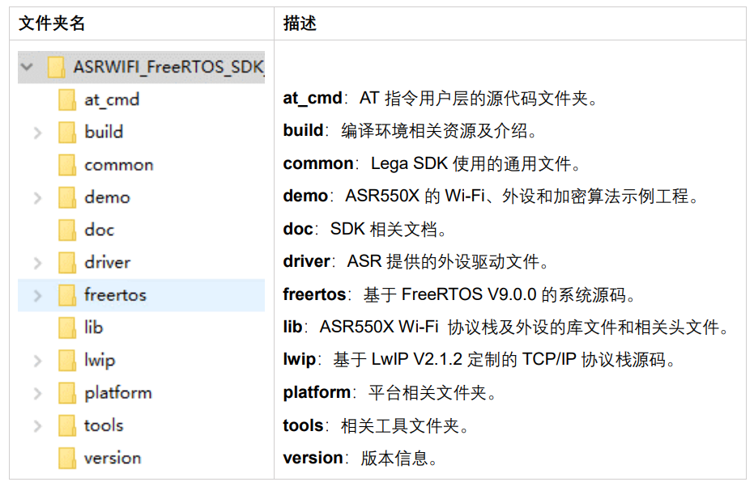
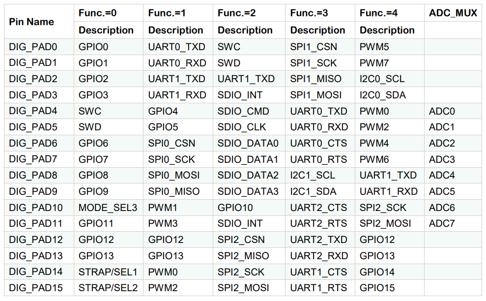
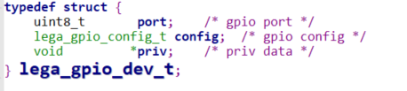
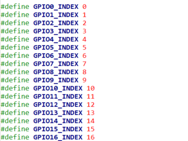
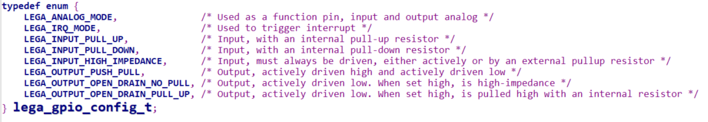

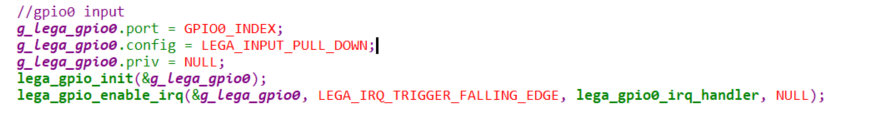

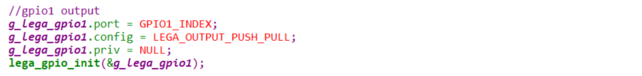
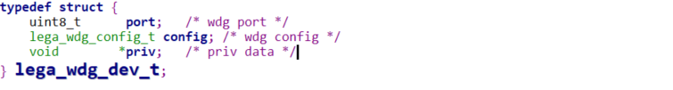
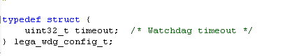
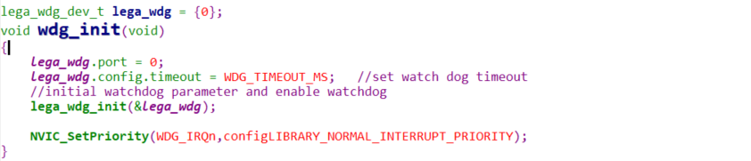
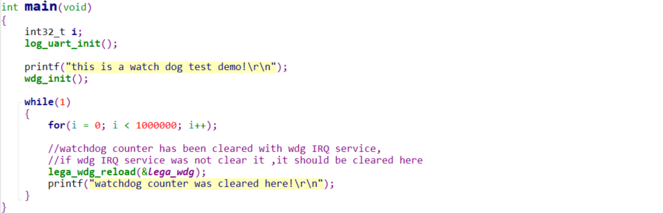
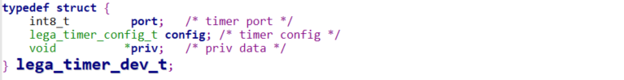
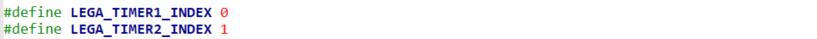
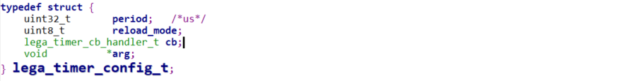
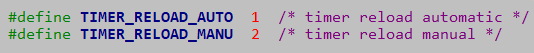
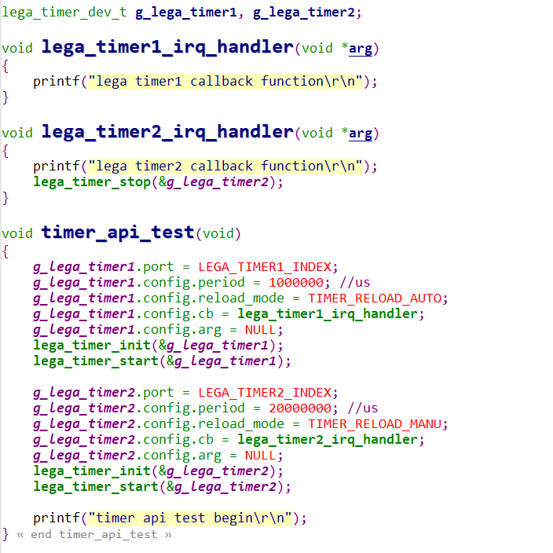
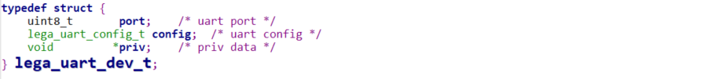
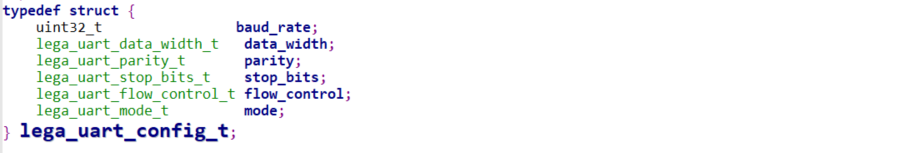
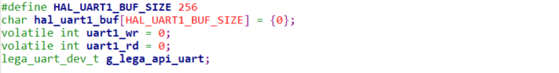
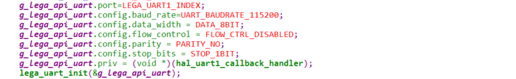
.. |image23| image:: ../../img/550X_外设用户手册/图2-21.png

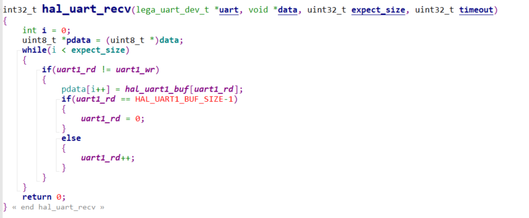
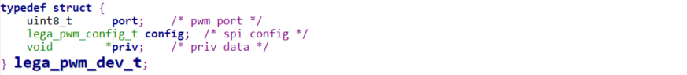
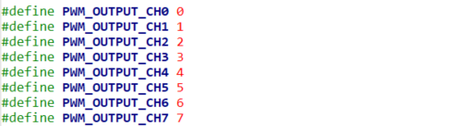
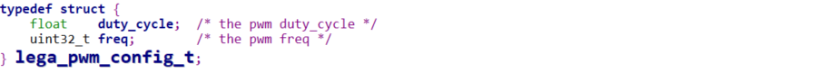
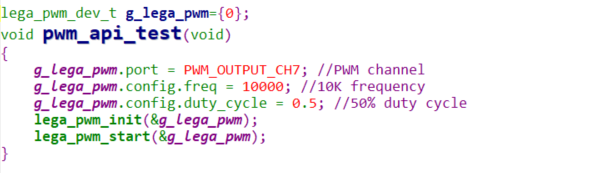
.. |image31| image:: ../../img/550X_外设用户手册/图2-29.png

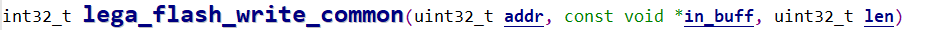
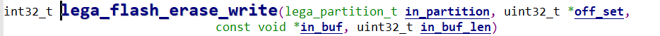
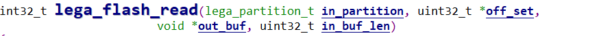
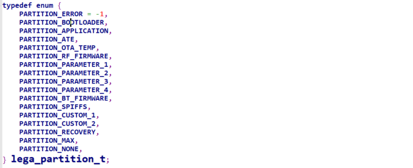

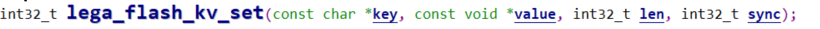

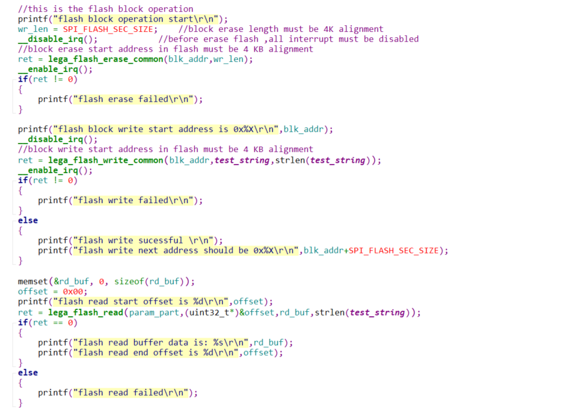
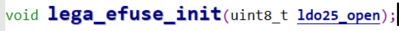
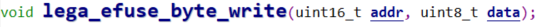
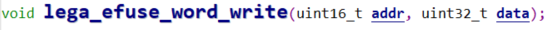

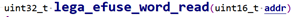
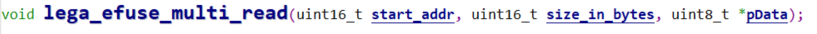
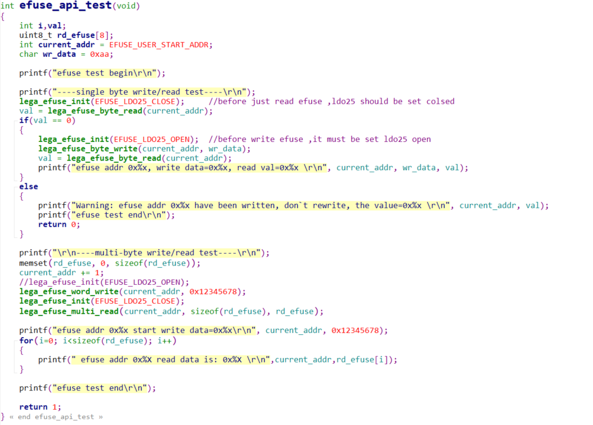
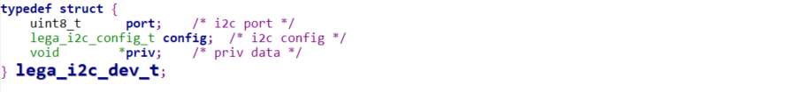
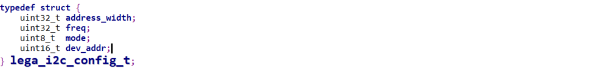
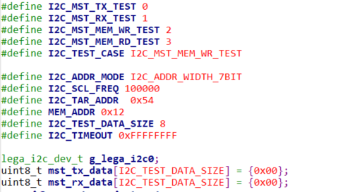
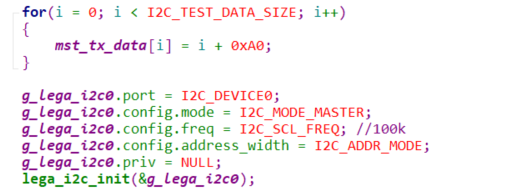

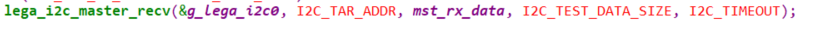
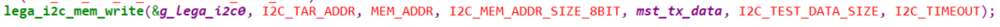
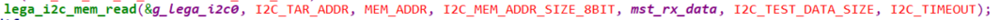
.. |image58| image:: ../../img/550X_外设用户手册/图2-56.png
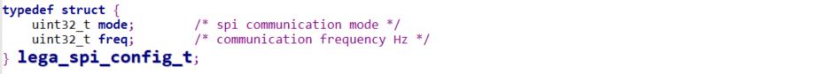
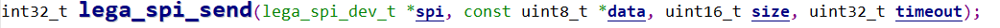
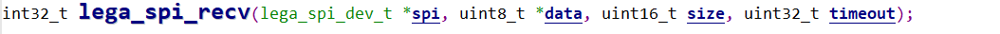
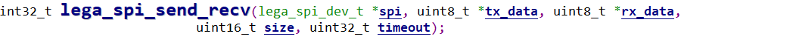
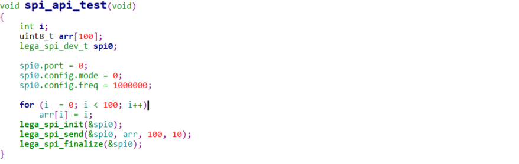
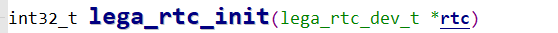

