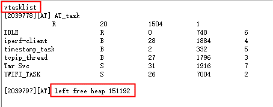
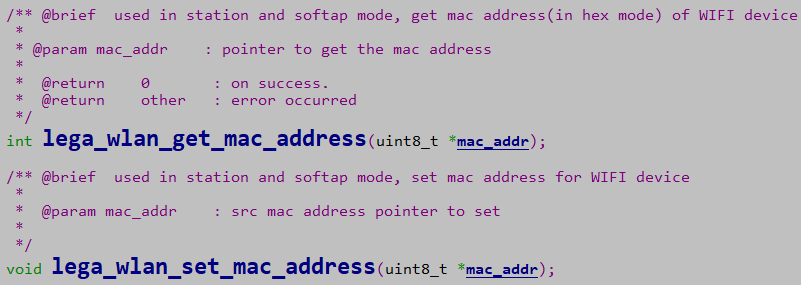
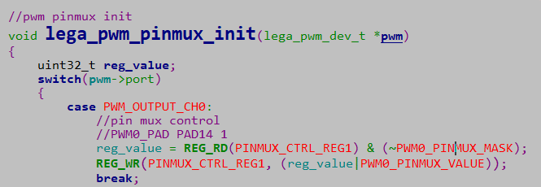
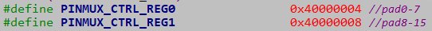
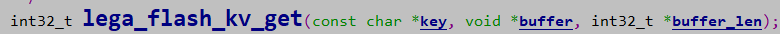

ASR5502X 系列 FreeRTOS 平台开发指南
========================================

前言
----

**关于本文档**

本文档为用户提供 ASR5502X 系列 Wi-Fi 芯片基于 FreeRTOS 平台的开发指南。阅读本文档前，请先阅读芯片的技术规格书 `ASR550X Datasheet <https://asriot-cn.readthedocs.io/zh/latest/ASR550X/%E8%8A%AF%E7%89%87%E8%A7%84%E6%A0%BC/index.html>`_ ，以便对 ASR5502X 系列芯片形成一定的了解。

**产品型号**

本文档适用于 ASR IoT 5502X 系列 Wi-Fi 芯片。

**版权公告**

版权归 © 2023 翱捷科技股份有限公司所有。保留一切权利。未经翱捷科技股份有限公司的书面许可，不得以任何形式或手段复制、传播、转录、存储或翻译本文档的部分或所有内容。

**商标声明**

ASR、翱捷和其他翱捷商标均为翱捷科技股份有限公司的商标。

本文档提及的其他所有商标名称、商标和注册商标均属其各自所有人的财产，特此声明。

**免责声明**

翱捷科技股份有限公司对本文档内容不做任何形式的保证，并会对本文档内容或本文中介绍的产品进行不定期更新。

本文档仅作为使用指导，本文的所有内容不构成任何形式的担保。本文档中的信息如有变更，恕不另行通知。

本文档不负任何责任，包括使用本文档中的信息所产生的侵犯任何专有权行为的责任。

**翱捷科技股份有限公司**

地址：上海市浦东新区科苑路399号张江创新园10号楼9楼 邮编：201203

官网： http://www.asrmicro.com/

**文档修订历史**

.. list-table::

    *   -   **日期**
        -   **版本号**
        -   **发布说明**  
    *   -   2020.11
        -   V1.1.0
        -   *   删除平台相关章节，合并至 `ASR5502X 系列 FreeRTOS 平台快速入门指南 <https://pan.baidu.com/s/1lG2F4iMkCTQ6Hk53NTxfYA?pwd=crg3>`_ 。
            *   删除 OTA 升级章节，合并至 `ASR5502X 系列 OTA 功能开发指导 <https://pan.baidu.com/s/1oYKKF_ccwEKgHdPzehDbWA?pwd=wobe>`_ 。

1. Flash
--------

ASR5502X 内置 2M flash，每个 block 大小为 4 KB。

ASR5502X 的 flash 分区如下图所示（实际分区可能略有差异，具体可查看 lega_board.c 中的分区定义）：

.. raw:: html

   

|image1|

.. raw:: html

   

-  **引导区**

   分区大小 64 KB，开始位置 0x1000 0000，bootload.bin 烧录到此分区。

-  **系统信息区**

   分区大小 192 KB，有一部分暂未使用可预留给用户（用户优先使用用户存储区），具体可咨询 ASR 原厂。

   分区为系统所使用，例如：系统启动引导，RF校准标识。

-  **应用区**

   分区大小 768 KB，开始位置 0x1004 0000，应用程序 image.bin 烧录到此分区。

-  **OTA 区**

   分区大小 768 KB，开始位置 0x1010 0000，OTA 在线升级时保存从云端获取到的 ota 数据。

   OTA 升级的策略有两种，具体可参见 `ASR5502X 系列 OTA 功能开发指导 <https://pan.baidu.com/s/1oYKKF_ccwEKgHdPzehDbWA?pwd=wobe>`_ 。

   生产时需要进行 RF 校准以及保存Mac地址等信息，此功能在设备端有独立的程序 ate.bin, 由于生产时不会用到 OTA 功能，所以 ate.bin 文件会暂时烧录到此区。

.. note::
    第一次 OTA 升级时会将厂测用的 ate.bin 覆盖掉。

-  **用户存储区**

   分区大小 256 KB，开始位置 0x101C 0000。分区可分为 User 和 KV 区，用户可适当调整两个分区大小。

.. attention::
    - 在地址映射 OTA 升级时，image 分区和 OTA 分区是不断交换的，具体可参见 `ASR5502X 系列 OTA 功能开发指导 <https://pan.baidu.com/s/1oYKKF_ccwEKgHdPzehDbWA?pwd=wobe>`_ 。
    - 建议不要轻易更改分区 layout 定义，否则有造成数据丢失的风险，如果开发者需要修改分区表大小或者增加新的分区，则 bootload/SysInfo/Image/ATE 这几个分区的开始位置不能变。

2. RAM
------

ASR5502X 系列产品内置 256 KB RAM。

RAM 划分为：data、bss、heap、stack、sharedMem 几个段，其布局如下图所示（其中 SharedMem 段给Wi-Fi 协议栈使用）：

.. raw:: html

   

|image2|

.. raw:: html

   

用户可用的 RAM 还剩多少，与 FreeRTOS 系统以及支持功能相关，用户可等平台跑起来后通过 AT 指令 vtasklist 查看准确的数据，如下图所示：

.. raw:: html

   

|image3|

.. raw:: html

   

目前 release SDK 的大致情况为：除 Freertos/lwip/asr wifi 协议栈后，大约是 130 KB。

3. Efuse
--------

ASR5502X 系列内置 4K bits 的 efuse 存储。efuse 区域的值只能写一次，可多次读。对 efuse 进行写操作时，必须先打开 LDO。

efuse 的 layout，如下表所示：

====================== ================ ================
**eFuse Byte Address** **Size (Bytes)** **Contents**
====================== ================ ================
0x000 – 0x0EF          240              **for system**
0x0F0 – 0x1EF          256              **for customer**
0x1F0 – 0x1FF          16               **for system**
\                      total: 512       
====================== ================ ================

其中，0x090 ~ 0x0EF 为 RF 校准参数和 mac 地址区域；0x0F0 ~ 0x1EF 为用户使用区域。

其他区域为系统内部使用，用户只能操作用户区域，否则系统会产生未知的异常。

.. attention::
    efuse区域的特点是只能从  **‘0’**\  变成  **‘1’**\ （这也是仅能写一次的原因），系统提供操作 efuse 的最小单位为 byte。如果用户强制重写 efuse 区域，则会得到与预期不一样的值。例如第一次写值 0x15 后, 再次写值 0x43，最终 efuse 中存储的值为 0x57。

4. Lega RTOS
------------

Lega RTOS 有封装主流 RTOS 的系统接口，建议用户应用层开发时也采用 Lega RTOS 提供的系统接口，这样后续能兼容不同 RTOS 平台。接口声明在 <lega_rtos_api.h> 中。

.. note::
    malloc 的内存申请也需要用 lega 提供的 API，如下：

    void *lega_rtos_malloc( uint32_t xWantedSize );

    void  lega_rtos_free( void *pv );

5. MAC 地址
-----------

实际产品中，Mac 地址由模组厂在 RF 产测时，通过测试工具写入到 efuse 存储器中。

通常用户的开发板未进行过 RF 校准，但用户又需要进行基本的功能开发，对此，SDK 提供了相关接口将 mac地址保存到 flash 中。

SDK 提供一组 API 对 mac addr 进行操作，如下图所示：

.. raw:: html

   

|image4|

.. raw:: html

   

上图中，\ ``lega_wlan_get_mac_address`` 的功能为：首先查看 efuse 中是否有保存过 mac 地址，有保存过则返回此 mac 地址；没有保存则再查看 flash 中是否保存过 mac 地址：有保存过则返回此地址，没有保存则系统会产生随机 mac 地址并保存到flash中，再返回此地址。

\ ``lega_wlan_set_mac_address`` 的功能是将 mac addr 保存到 flash 中。

6. PINMUX
---------

ASR5502X 系列有 16 个通用的 GPIO 口，为在有限的资源上丰富外设功能，GPIO 可配置成不同的功能。例如 PAD2/PAD3 可以做 GPIO，也可以配置做 UART1 和 I2C0。

.. raw:: html

   

========= ========== ========= ========== ========= ========= =======
Pin Name  Func.=0    Func.=1   Func.=2    Func.=3   Func.=4   ADC_MUX
========= ========== ========= ========== ========= ========= =======
DIG_PAD0  GPIO0      UART0_TXD SWC        SPI1_CSN  PWM5      
DIG_PAD1  GPIO1      UART0_RXD SWD        SPI1_SCK  PWM7      
DIG_PAD2  GPIO2      UART1_TXD UART1_TXD  SPI1_MISO I2C0_SCL  
DIG_PAD3  GPIO3      UART1_RXD SDIO_INT   SPI1_MOSI I2C0_SDA  
DIG_PAD4  SWC        GPIO4     SDIO_CMD   UART0_TXD PWM0      ADC0
DIG_PAD5  SWD        GPIO5     SDIO_CLK   UART0_RXD PWM2      ADC1
DIG_PAD6  GPIO6      SPI0_CSN  SDIO_DATA0 UART0_CTS PWM4      ADC2
DIG_PAD7  GPIO7      SPI0_SCK  SDIO_DATA1 UART0_RTS PWM6      ADC3
DIG_PAD8  GPIO8      SPI0_MOSI SDIO_DATA2 I2C1_SCL  UART1_TXD ADC4
DIG_PAD9  GPIO9      SPI0_MISO SDIO_DATA3 I2C1_SDA  UART1_RXD ADC5
DIG_PAD10 MODE_SEL3  PWM1      GPIO10     UART2_CTS SPI2_SCK  ADC6
DIG_PAD11 GPIO11     PWM3      SDIO_INT   UART2_RTS SPI2_MOSI ADC7
DIG_PAD12 GPIO12     GPIO12    SPI2_CSN   UART2_TXD GPIO12    
DIG_PAD13 GPIO13     GPIO13    SPI2_MISO  UART2_RXD GPIO13    
DIG_PAD14 STRAP/SEL1 PWM0      SPI2_SCK   UART1_CTS GPIO14    
DIG_PAD15 STRAP/SEL2 PWM2      SPI2_MOSI  UART1_RTS GPIO15    
========= ========== ========= ========== ========= ========= =======

.. raw:: html

   

关于 pinmux 的配置，需要找到对应 pin 的 pinmux 寄存器，然后将寄存器对应 mask 位设置 func 值。如下图，SDK 提供的 PWM driver 中对 PAD14 用做 PWM0 的配置：

.. raw:: html

   

|image5|

.. raw:: html

   

如下图所示，用 2 个配置寄存器可以配置完 16 个 GPIO 的 pinmux（一个 pin 占用 4 bits）：reg0[3:0] 设置 pin0 的 func 值，reg0[7:4] 设置 pin1 的 func 值，以此类推。

.. raw:: html

   

|image6|

.. raw:: html

   

7. 外设
-------

API 接口请参见 `ASR550X Series Peripheral Application Notes <https://pan.baidu.com/s/1cFuZYncZNZKPVpnuRHW_UQ?pwd=lbi9>`_ 。

FreeRTOS 平台下，在工程的 demo 目录中有对应的 Sample code。

Demo 工程的说明，请参见 `ASR5502X 系列 FreeRTOS 平台外设 Demo 用户手册 <https://pan.baidu.com/s/1XH_cVgAl9ATbGI82Oqm6YQ?pwd=jpxr>`_ 。

下面是关于外设资源的补充信息和注意事项。

7.1 GPIO
~~~~~~~~

1. 开机默认驱动模式：

   1. 除 pad5/pad13 上拉输入外，其余都默认下拉输入。
   2. 驱动模式中的上拉/下拉都为芯片内部硬件驱动。

.. note::
    - pad 悬空时上电默认 pad5/pad13 为高电平，其余 pad 为低电平。
    - pad13 有特殊作用，建议不使用，默认悬空处理。

2. 支持的驱动模式

   1. 输入上拉
   2. 输入下拉
   3. 高阻输入
   4. 推挽输出
   5. 中断模式：支持高电平、低电平、上升沿、下降沿四种触发方式

3. GPIO 最大驱动电流：12 mA.

7.2 ADC
~~~~~~~

ASR5502X 系列有 8 个 channel 的 ADC，从 PAD4 到 PAD11 依次为 ADC CH0 ~ CH7。

ADC 检测电压的范围是 0~1.6 V。

.. raw:: html

   

========= ========= ========= ========== ========= ========= =======
Pin Name  Func.=0   Func.=1   Func.=2    Func.=3   Func.=4   ADC_MUX
========= ========= ========= ========== ========= ========= =======
DIG_PAD4  SWC       GPIO4     SDIO_CMD   UART0_TXD PWM0      ADC0
DIG_PAD5  SWD       GPIO5     SDIO_CLK   UART0_RXD PWM2      ADC1
DIG_PAD6  GPIO6     SPI0_CSN  SDIO_DATA0 UART0_CTS PWM4      ADC2
DIG_PAD7  GPIO7     SPI0_SCK  SDIO_DATA1 UART0_RTS PWM6      ADC3
DIG_PAD8  GPIO8     SPI0_MOSI SDIO_DATA2 I2C1_SCL  UART1_TXD ADC4
DIG_PAD9  GPIO9     SPI0_MISO SDIO_DATA3 I2C1_SDA  UART1_RXD ADC5
DIG_PAD10 MODE_SEL3 PWM1      GPIO10     UART2_CTS SPI2_SCK  ADC6
DIG_PAD11 GPIO11    PWM3      SDIO_INT   UART2_RTS SPI2_MOSI ADC7
========= ========= ========= ========== ========= ========= =======

.. raw:: html

   

.. _flash-1:

7.3 Flash
~~~~~~~~~

对 flash 进行 init/erase/write 操作时，需先关闭系统中断。

.. attention::
    对 flash 写数据不宜太过频繁，而且单次写数据量不要过大，因为 Wi-Fi 协议栈接收发送数据需中断，长时间关闭中断会对 Wi-Fi 数据传输产生影响。

Lega SDK 提供的 API，对 read/write 需要注意 uint32*offset 参数，其执行完成后，offset 值会自动更新为加上读写数据的个数后的值。这样是为了方便上层用户进行连续的操作。

KV 实际是对 flash 中的信息用 key-value 来进行管理，方便用户层使用。

对于 lega_flash_kv_get 接口，其 buffer_len 参数需要注意，输入时表示 buffer 的空间大小，输出时表示获取key 数据的大小，如下图。

.. raw:: html

   

|image7|

.. raw:: html

   

.. note::

    这样设计的目的是防止由于 buffer 的空间小于 key 的数据量而导致内存溢出/覆盖。

KV 根据 key 的名称来保存和获取值。例如：

-  保存 user1 的名字：lega_flash_kv_set(“user1”, “ASR”, sizeof(“ASR”), 1);

   ​ char namebuf[32]={0};

   ​ int32_t namelen = sizeof(namebuf);

-  获取 user1 的名字：lega_flash_kv_get(“user1”, namebuf, &namelen);

-  删除 user1 的名字：lega_flash_kv_del(”user1”)

8. 相关资料
-----------

本文档中提到的参考信息总结如下：

1. OTA 升级的相关内容，请参见 `ASR5502X 系列 OTA 功能开发指导 <https://pan.baidu.com/s/1oYKKF_ccwEKgHdPzehDbWA?pwd=wobe>`_ 。
2. API 接口的相关内容，请参见 `ASR550X Series Peripheral Application Notes <https://pan.baidu.com/s/1cFuZYncZNZKPVpnuRHW_UQ?pwd=lbi9>`_ 。
3. Demo 工程的说明，请参见 `ASR5502X 系列 FreeRTOS 平台外设 Demo 用户手册 <https://pan.baidu.com/s/1XH_cVgAl9ATbGI82Oqm6YQ?pwd=jpxr>`_ 。

其他相关资料列举如下：

1. Wi-Fi API 的相关内容，请参见 `ASR550X 系列 FreeRTOS 平台软件（Wi-Fi 部分）使用手册 <https://pan.baidu.com/s/1aKy2SE22qNR22TD336nrKg?pwd=43o0>`_ 。

2. AT 指令集的相关内容，请参见 `ASR5502X 系列 FreeRTOS 平台 AT 命令使用指南 <https://pan.baidu.com/s/1xJkR74oi7SF-24EGV_lZiQ?pwd=k57y>`_ 。

.. |image1| image:: ../../img/550X_FreeRTOS平台_开发指南/图1-1.png

