ASR5502X 系列 FreeRTOS 平台快速入门指南
=======================================

前言
----

**关于本文档**

本文档旨在指导用户快速入门，搭建 IoT ASR5502X 系列 Wi-Fi 芯片在 FreeRTOS 平台下的开发环境。

**产品型号**

本文档适用于 ASR IoT 5502X 系列 Wi-Fi 芯片。

**版权公告**

版权归 © 2023 翱捷科技股份有限公司所有。保留一切权利。未经翱捷科技股份有限公司的书面许可，不得以任何形式或手段复制、传播、转录、存储或翻译本文档的部分或所有内容。

**商标声明**

ASR、翱捷和其他翱捷商标均为翱捷科技股份有限公司的商标。

本文档提及的其他所有商标名称、商标和注册商标均属其各自所有人的财产，特此声明。

**免责声明**

翱捷科技股份有限公司对本文档内容不做任何形式的保证，并会对本文档内容或本文中介绍的产品进行不定期更新。

本文档仅作为使用指导，本文的所有内容不构成任何形式的担保。本文档中的信息如有变更，恕不另行通知。

本文档不负任何责任，包括使用本文档中的信息所产生的侵犯任何专有权行为的责任。

**翱捷科技股份有限公司**

地址：上海市浦东新区科苑路399号张江创新园10号楼9楼 邮编：201203

官网： http://www.asrmicro.com/

**文档修订历史**

======= ====== ==========
日期    版本号 发布说明
======= ====== ==========
2020.09 V1.0.0 首次发布。
======= ====== ==========

1. 概述
-------

本文档旨在指导用户快速入门，搭建 IoT ASR5502X 系列芯片的开发环境。ASR550X Software Development Kit（SDK）是 ASR 为开发者提供的 *Wi-Fi* 物联网平台，平台包括云接入以及 wlan 和外设接口。ASR 提供的外设以及wlan 和系统接口统称为 *lega* 接口，其接口都有 *lega* 关键字做前缀。

1.1 硬件准备工作
~~~~~~~~~~~~~~~~

-  ASR550X_MB_Vx.x 开发板

-  USB 数据线（A 转 B）

-  PC（Windows 或 Linux）

1.2 软件准备工作
~~~~~~~~~~~~~~~~

-  SDK 开发包，GCC 编译器（SDK 开发包中包含)

-  Dogo 调试烧录工具

-  Docker、Cygwin 或 Keil 工具

-  legawifi_buildenv0.1.tar（可选）

2. 开发板简介
-------------

ASR 提供的开发板如下图所示，主要包括 Wi-Fi 模组以及底板（ASR550X_MB_V1.0）。

.. raw:: html

   

|image10|

.. raw:: html

   

1.  Wi-Fi 模组
2.  Uart0 连接跳帽
3.  Uart1 连接跳帽
4.  Uart1 端口
5.  Uart0 端口
6.  模式选择跳帽
7.  reset 按键
8.  JLink 调试口
9.  UartToUSB 转换 IC
10. 电源开关键

.. note::
    -  开发板的固件烧录，硬件上只需一根 USB 线将板子 Uart1 端口与 PC 端 USB 口连接。开发板已有 USB 转换 IC（9）。
    -  模式选择跳帽（6）：上端（高电平）为烧录模式，接下端（低电平）为正常启动模式。

3. SDK 目录介绍
---------------

SDK 目录结构如下表所示：

.. raw:: html

   

|image9|

.. raw:: html

   

4. 开发环境搭建
---------------

4.1 支持的平台和工具
~~~~~~~~~~~~~~~~~~~~

.. raw:: html

   

|image13|

.. raw:: html

   

4.2 Windows 平台
~~~~~~~~~~~~~~~~

4.2.1 Docker 环境
^^^^^^^^^^^^^^^^^

4.2.1.1 安装 Docker
'''''''''''''''''''

由于 Windows 系统的版本不同，需安装不同的 docker 工具。

-  Windows 10 专业版等支持 Hyper-V 功能的版本，需安装 *Docker Deaktop* 工具。 安装方法参考官方文档，链接：https://docs.docker.com/docker-for-windows/install/

-  Windows 7 和 Windows 10 家庭版，需安装 *DockerToolbox* 工具。 安装方法参考官方文档，链接：https://docs.docker.com/toolbox/toolbox_install_windows/

非官方的安装说明以及对应工具下载，请参考下面链接： https://www.runoob.com/docker/windows-docker-install.html

安装完成后，点击桌面上的 *docker* 图标，启动应用。然后在命令提示符窗口输入 *docker –v*\ 的查询命令，如有版本信息返回如下图所示，表示安装成功。

.. raw:: html

   

|image1|

.. raw:: html

   

4.2.1.2 加载镜像（legawifi_buildenv0.1.tar）
''''''''''''''''''''''''''''''''''''''''''''

1. 将命令提示符的工作目录切换到镜像所在目录。

2. 执行加载镜像的命令：\ ``docker load -i legawifi_buildenv0.1.tar`` 。

3. 加载完成后可通过 \ ``docker images`` 命令查看加载镜像的情况，如下图所示：

.. raw:: html

   

|image2|

.. raw:: html

   

4.2.1.3 设置目录的共享权限
''''''''''''''''''''''''''

-  **Docker Deaktop 环境**

   -  方法1：通过 *Docker Desktop* *——settings* *—— Shared Drives* 选择源码所在的磁盘，添加共享权限。

   -  方法2：通过命令的方式，例如：

      ::

         docker run -it -v E:/work/src/ASRWIFI_FreeRTOS_SDK_v3.1.11:/root/src 

         legawifi_buildenv:0.1 /bin/sh

-  **DockerToolbox 环境**

   DockerToolbox 环境中，文件系统中默认只有 /C/Users 目录可以挂载到 container 中，所以建议将 SDK 放置到 **C** 盘使用者的目录下。如 Administrator 可将 SDK（e.g.: ASRWIFI\_ FreeRTOS_SDK_Vx.x.x）放到 C:\Users\Administrator\work 目录下执行如下命令：

   ::

      docker run -it -v /c/Users/Administrator/work/ASRWIFI_FreeRTOS_SDK_v3.1.11:/root/src

      legawifi_buildenv:0.1 /bin/sh

   如果用户需要将 SDK 放置在其他盘，可通过设置 **virtualbox** 虚拟机共享文件夹的方式实现，可参考教程http://www.yglong.com/share-with-host-and-docker.html。

4.2.1.4 编译工程
''''''''''''''''

1. 进入目录：\ ``cd /root/src/build``

2. 编译命令：

    make TARGET=demo              *默认是52M主频*

    make TARGET=demo freq=80 *80M主频*

3. 编译完成后，生成的 demo.bin 文件在 build/out/demo 目录下；

4. 将 *demo.bin* 拷贝到 ASR 烧录工具 DOGO 的 bin_house 目录下，重命名为 *image.bin*\ ，再将其烧录到对应的 ASR 模块中。关于 DOGO 工具的使用说明，请参考 `ASR IoT 芯片 DOGO 烧录调试工具 <https://pan.baidu.com/s/1NAojlvXNHLQd_U9Zh_RKPg?pwd=lw5e>`_。

.. note::
    若客户已有 Keil 开发环境，请加后缀 IDE=keil，会在 ide 目录下生成对应 keil 工程。

    |image11|

4.2.2 Cygwin 环境
^^^^^^^^^^^^^^^^^

1. 安装 Cygwin 工具，官网下载地址如下：

​     64 位系统：https://www.cygwin.com/setup-x86_64.exe

​     32 位系统：https://www.cygwin.com/setup-x86.exe

2. 安装完成后，在桌面上打开 Cygwin64 Terminal 应用。

3. 在 Cygwin64 下输入命令进入工程下的 build 目录，例如下图：

.. raw:: html

   

|image3|

.. raw:: html

   

4. 指定编译工具链：

   (1) 将 tools/toolchain/gcc-arm-none-eabi-xxxx.zip 文件解压出来。

   (2) 修改编译脚本 build/build_rules/toolchain/toolchain_arm-none-eabi.mk, 按照下图来指定编译器的目录：

.. raw:: html

   

|image4|

.. raw:: html

   

5. 清除编译产生的文件：输入命令\ ``make clean``

6. 编译项目：输入命令：

    make TARGET=demo              *默认是52M主频*

    make TARGET=demo freq=80 *80M主频*

​ 编译完成后，生成的 demo.bin 文件在 build/out/demo 目录下：

.. raw:: html

   

|image5|

.. raw:: html

   
 

7. 将 *demo.bin* 拷贝到 ASR 烧录工具 DOGO 的 bin_house 目录下，重命名为 *image.bin*\ ，再将其烧录到对应的 ASR 模块中。关于 DOGO 工具的使用说明，请参考 `ASR IoT 芯片 DOGO 烧录调试工具 <https://pan.baidu.com/s/1NAojlvXNHLQd_U9Zh_RKPg?pwd=lw5e>`_。

.. note::
    若客户已有Keil开发环境，请加后缀IDE=keil，会在ide目录下生成对应keil工程。
    |image12|

4.2.3 Keil 环境
^^^^^^^^^^^^^^^

1. **安装 Keil**\ ：推荐使用 Keil V5.14.0.0。

2. **打开工程**\ ：keil 工程是通过 docker/Cygwin 开发环境生成的，目录在 build/ide/keil 中。

.. note::
    旧版本 SDK 在工程 demo/wifi/ 下有已建立好的 keil 工程，后续版本可能会移除。

3. **指定交叉编译器**\ ：

​     (1) 将 tools/toolchain/gcc-arm-none-eabi-xxxx.zip 文件解压出来；

​     (2) 指定 keil 使用的编译器路径，需要指定到 bin 目录。如下举例说明：

​     *启动 keil 的设置界面：Project->Manage->Componects …，按照下图进行设置。*

.. raw:: html

   

|image6|

.. raw:: html

   

4. **编译结果：**

      编译成功后，在 build/ide/keil/demo/Objects 目录下会产生 *demo.bin*\ ，此为烧录到 flash 中的 *image.bin*\ 。

5. **JLink 调试的设置：**

      请参考文档 *《ASR5502X 系列 Flash 下载用户手册》*\ 。

4.3 Linux平台
~~~~~~~~~~~~~

4.3.1 Docker
^^^^^^^^^^^^

1. **安装 Docker**

​     官方指导文档：https://docs.docker.com/install/

​     非官方指导文档：https://www.runoob.com/docker/ubuntu-docker-install.html

2. **加载镜像（legawifi_buildenv0.1.tar）**

​     在终端中输入命令：\ ``docker load -i legawifi_buildenv0.1.tar``

3. **设置共享目录**

​ 在终端输入下方命令：

::

   sudo docker run -it -v /home/user/work/ASRWIFI_FreeRTOS_SDK_v3.1.11:/root/src 

   legawifi_buildenv:0.1 /bin/sh

4. **编译工程**

​     进入目录：\ ``cd /root/src/build``

​     编译命令：

     make TARGET=demo              *默认是52M主频*

     make TARGET=demo freq=80 *80M主频*

​     编译完成后，生成的 demo.bin 文件在 build/out/demo 目录下；

​     将 *demo.bin* 拷贝到 ASR 烧录工具 DOGO 的 bin_house 目录下，重命名为 *image.bin*\ ，再将其烧录到对应的ASR 模块中。关于 DOGO 工具的使用说明，请参考 `ASR IoT 芯片 DOGO 烧录调试工具 <https://pan.baidu.com/s/1NAojlvXNHLQd_U9Zh_RKPg?pwd=lw5e>`_。

4.3.2 终端环境
^^^^^^^^^^^^^^

1. **指定编译工具链**

   1. 从官网下载交叉编译器（地址如下），推荐下载截图所示的 5.4 版本。

      https://developer.arm.com/tools-and-software/open-source-software/developer-tools/gnu-toolchain/gnu-rm/downloads

      .. raw:: html

         

      |image8|

      .. raw:: html

         

   2. 将工具链解压后存放的目录加上 */bin* ，放到系统的环境变量中。

2. **编译工程**

   进入目录：\ ``cd SDK 目录 /build``

   编译命令：

   make TARGET=demo              *默认是52M主频*

   make TARGET=demo freq=80 *80M主频*

   编译完成后，生成的 demo.bin 文件在 build/out/demo 目录下；

   将 *demo.bin* 拷贝到 ASR 烧录工具 DOGO 的 bin_house 目录下，重命名为 *image.bin*\ ，再将其烧录到对应的 ASR 模块中。关于 DOGO 工具的使用说明，请参考 `ASR IoT 芯片 DOGO 烧录调试工具 <https://pan.baidu.com/s/1NAojlvXNHLQd_U9Zh_RKPg?pwd=lw5e>`_。

5. 固件以及烧录
---------------

5.1 固件
~~~~~~~~

ASR5502X 的固件以及功能如下：

1. **bootload.bin**\ ：引导程序，由 ASR 原厂提供，log 输出口 Uart1。

2. **image.bin**\ ：由开发者在 FreeRTOS SDK 平台上开发产生的应用程序 bin 档，默认 log 输出口 Uart1，软件可配置。

3. **ate.bin**\ ：在做 RF 产测校准时使用，由 ASR 原厂提供，默认 log 输出口 Uart1，软件可配置。

4. **ota.bin**\ ：和 image.bin 一样，由用户开发产生，用于 OTA 升级的 bin 档，一般和 image.bin 放在同一目录。

.. note::
    - bootload/ate 由 ASR 原厂提供，FreeRTOS 平台一般在工程的 tools\factory_bin 目录下有提供。
    - 若在对应目下未找到固件，或需要获取最新固件，均可与代理商或 ASR 原厂联系。

5.2 烧录
~~~~~~~~

关于烧录的注意事项总结如下：

1. ASR5502X 系列芯片通过串口（只能是 Uart1 口）将固件烧录到 flash 中。
2. 系统开始运行后，只需要将 bootload.bin & image.bin 烧录到 flash 中即可。
3. ASR 原厂提供 PC 端 Dogo 工具，用于烧录以及串口调试。关于 Dogo 工具使用，请参见 `ASR IoT 芯片 DOGO 烧录调试工具 <https://pan.baidu.com/s/1NAojlvXNHLQd_U9Zh_RKPg?pwd=lw5e>`_。
4. 一般情况下 Uart1 口也做程序打印 log 的调试口。

6. 启动流程
-----------

.. raw:: html

   

|image7|

.. raw:: html

   

如上图所示，系统上电 /Reset 后首先进入 BootLoad 模式，BootLoad 判定 Tag 标志是否被置起，如果被置起，则会直接跳到 image 模式执行 image 应用；如果 Tag 未被置起，则会等待 Uart1 口的命令输入：等待命令超时（无命令输入默认超时时间为10s）或输入 \ ``mode 0``，会跳到 image 模式；如果输入 \ ``mode 1`` 或 \ ``AsrIot550x``，则会跳转到 ATE 模式进行产测校准的工作。

.. note::
    - tag 标志表示芯片已经进行产测，正常流程为产测时，由产测工具触发，将 tag 标志位置起来。
    - 开发阶段，未进行产测又不想等待 10 s 或每次输入 \ ``mode 0`` 的命令，则可以在等待 Uart1 命令时串口输入 \ ``boot_mode_set`` 命令，这样手动把 tag 置起来，下次启动则直接跳到 image 模式。（由于未进行 RF 校准产测，所以不能拿此模块来做RF性能指标的测量。）

A. 附录-相关资料
----------------

本文档中提到的参考信息总结如下：

1. 关于 DOGO 工具的使用说明，请参考 `ASR IoT 芯片 DOGO 烧录调试工具 <https://pan.baidu.com/s/1NAojlvXNHLQd_U9Zh_RKPg?pwd=lw5e>`_。
2. 关于 JLink 调试的设置，请参考文档\ *《ASR5502X 系列 Flash 下载用户手册》*\ 。

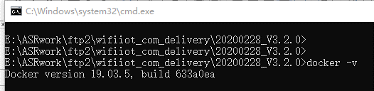
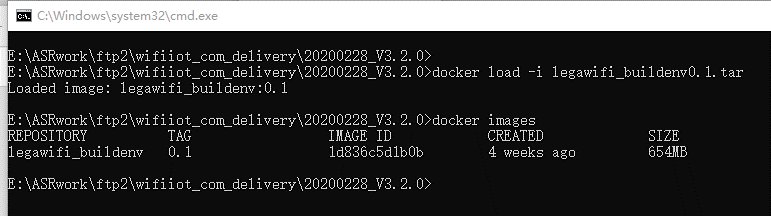
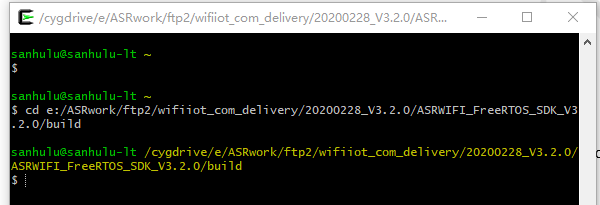
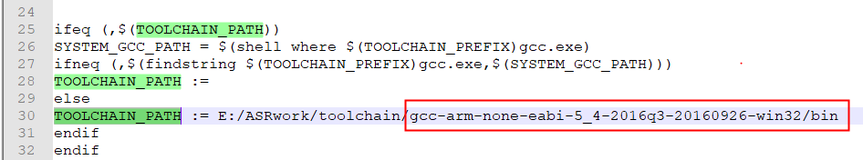
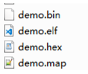
.. |image6| image:: ../../img/550X_FreeRTOS平台_快速入门指南/图4-6.png
.. |image7| image:: ../../img/550X_FreeRTOS平台_快速入门指南/图6-1.png
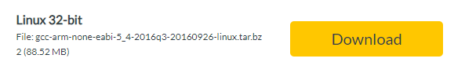
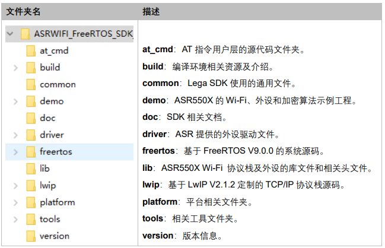
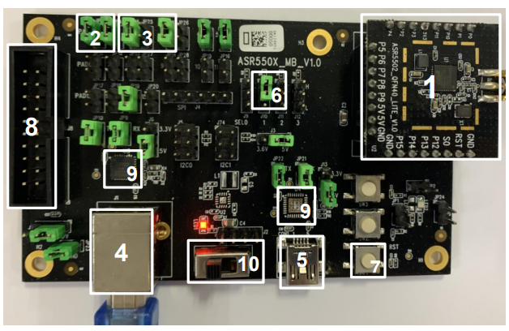
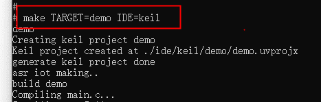
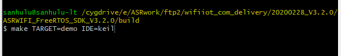
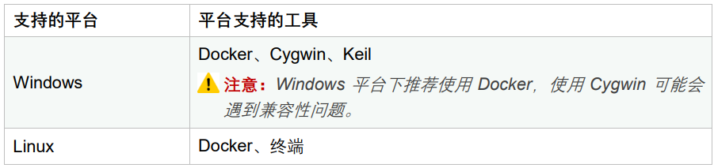