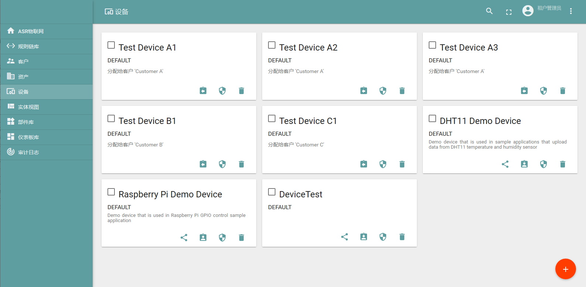
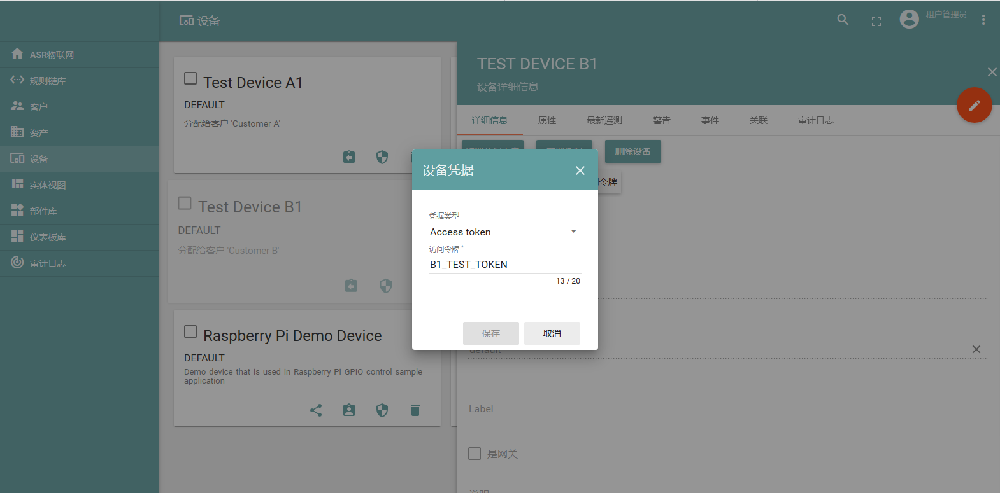
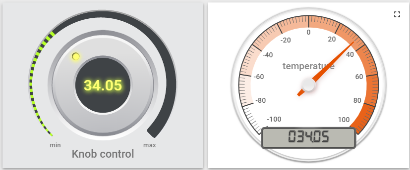
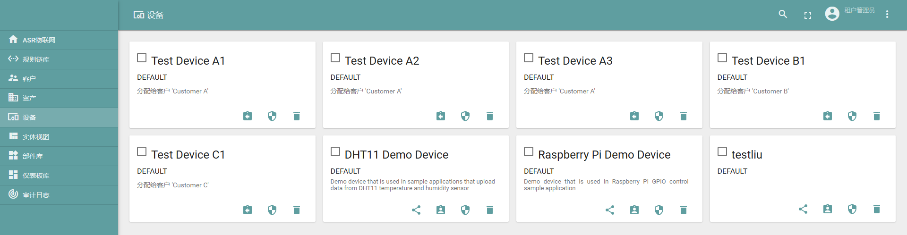
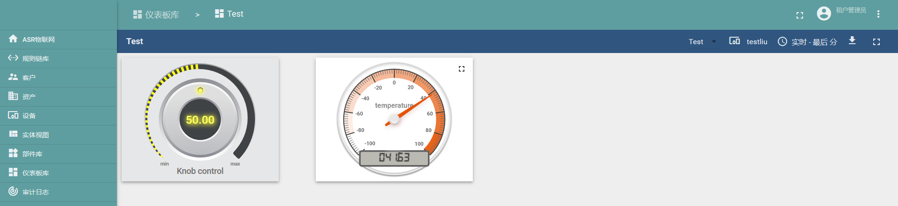
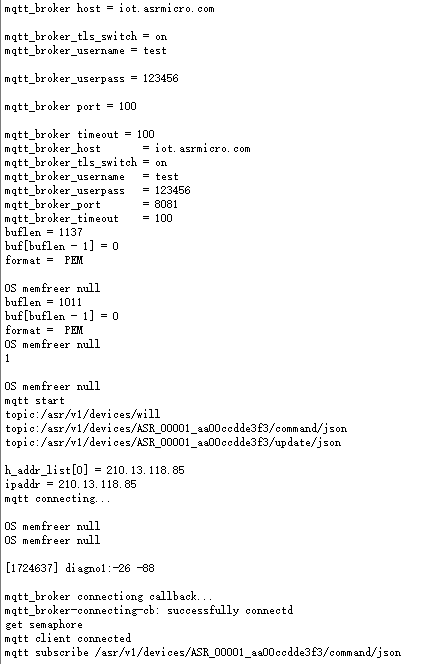
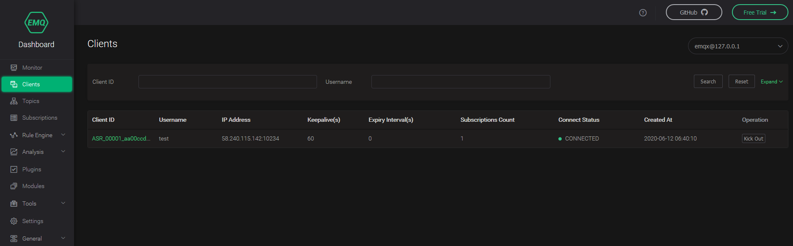
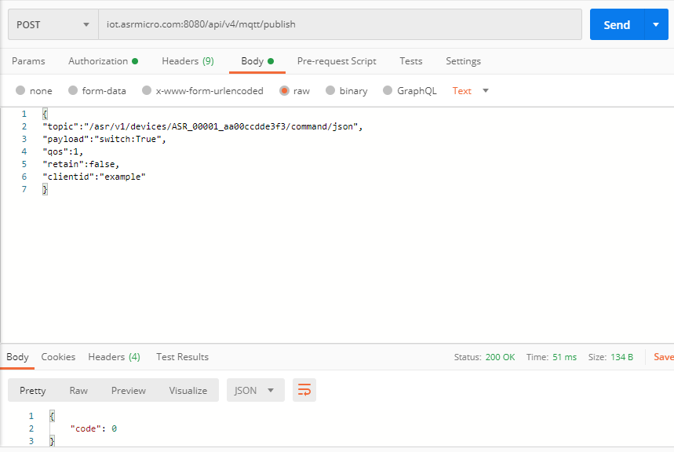
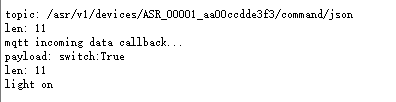

ASR5502X系列 FreeRTOS平台私有云用户手册
=======================================

前言
----

**关于本文档**

本文档旨在提供私有云平台与芯片连接的具体方案，以实现芯片与云端的双向通信。

**读者对象**

本文档主要适用于以下工程师：

-  单板硬件开发工程师
-  软件工程师
-  技术支持工程师

**产品型号**

本文档适用于ASR IoT 5502X 系列 Wi-Fi 芯片。

**版权公告**

版权归 © 2021 翱捷科技股份有限公司所有。保留一切权利。未经翱捷科技股份有限公司的书面许可，不得以任何形式或手段复制、传播、转录、存储或翻译本文档的部分或所有内容。

**商标声明**

ASR、翱捷和其他翱捷商标均为翱捷科技股份有限公司的商标。

本文档提及的其他所有商标名称、商标和注册商标均属其各自所有人的财产，特此声明。

**免责声明**

翱捷科技股份有限公司对本文档内容不做任何形式的保证，并会对本文档内容或本文中介绍的产品进行不定期更新。

本文档仅作为使用指导，本文的所有内容不构成任何形式的担保。本文档中的信息如有变更，恕不另行通知。

本文档不负任何责任，包括使用本文档中的信息所产生的侵犯任何专有权行为的责任。

**防静电警告**

静电放电（ESD）可能会损坏本产品。使用本产品进行操作时，须小心进行静电防护，避免静电损坏产品。

**翱捷科技股份有限公司**

地址：上海市浦东新区科苑路399号张江创新园10号楼9楼 邮编：201203

官网： http://www.asrmicro.com/

**文档修订历史**

======== ========== ============
**日期** **版本号** **发布说明**
======== ========== ============
2021.02  V1.2.0     整合章节。
======== ========== ============

1. 概述
-------

使用 ASR5502X 系列芯片通过无线 Wi-Fi 方式连接私有云平台，可以实现数据的上报（数据从芯片端到云端）和数据的下发（数据从云端到芯片端）控制。

本文档提供了私有云平台与芯片连接的具体方案，以实现芯片与云端的双向通信。

设备端使用 *MQTT(S)* 的方式与云端通信，云端下发控制，芯片端上报状态；也可使用 *HTTP(S)* 的方式，实现数据的上报功能。

本文提供了两种云平台方案：

-  第一种基于 IoT 开源云平台 ThingsBoard，用户可以参考 ThingsBoard 官方说明来搭建平台，并与本方案的设备端进行通信。

-  第二种基于普通 MQTT broker，本文以 EMQ 为例，用户可以参考 EMQ 官方说明来搭建平台，并与本方案的设备端进行通信。

2. ThingsBoard 方案设备端使用方法
--------------------------------

2.1 ThingsBoard 安装使用方法
~~~~~~~~~~~~~~~~~~~~~~~~~~~

目前 Demo 使用开源 ThingsBoard。关于环境的搭建以及私有云的使用和配置，可参考下列相关文档：

ThingsBoard 官网：https://thingsboard.io/。

ThingsBoard 相关文档：https://thingsboard.io/docs/。

ThingsBoard 环境搭建安装、连接模拟设备等操作指导：https://thingsboard.io/docs/guides/。

ThingsBoard 连接 api：https://thingsboard.io/docs/reference/mqtt-api/。

ThingsBoard 配置 MQTTS：https://thingsboard.io/docs/user-guide/mqtt-over-ssl/。

2.2 编译方案
~~~~~~~~~~~~

使用 ASR FreeRTOS SDK 编译的方法，可参考 SDK 中的编译说明文件。

默认的编译方式没有将私有云代码编译，需要开发者手动修改默认配置： 将 *build/build_rules/project/demo/config.mk* 文件中的 CLOUD_SWITCH 配置修改为 1（原先为 0，默认不编译），并且将 *$(NAME)_FLAGS += -DCLOUD_PRIVATE_SUPPORT* 被注释掉的部分打开。

若对应平台使用了 TLS 认证，还需在 */cloud/src/private_cloud_ca.c* 文件中修改对应的 CA 证书、设备证书和设备私钥。

修改 config.mk 文件后再重新编译 SDK，此时编译的 bin 文件中已经包含私有云 Demo。

2.3 运行说明
~~~~~~~~~~~~

1. **芯片连接网络：**

运行私有云需要先调用 Wi-Fi 相关命令使芯片连接路由器，相关使用方法可参考文档\ *《ASR5502X 系列_FreeRTOS 平台_AT 命令使用指南》*\，以下为简单的示例：

输入命令： *wifi_open sta <SSID> <password>*

命令解释：wifi_open sta 为固定字符串；<SSID>为将要连接的路由器的 SSID；<password>为路由器密码。

2. **使用连接命令：**

连接私有云首先需要知道 host、port、protocol、（TLS）的具体信息以及 ThingsBoard 访问令牌和超时时间。

相关指令如下表所示。其中，若对应平台开启了 TLS 认证，\ *username*\ 可填写任意非空值。\ *private write*\ 命令将这些参数写入 flash中，供私有云启动时调用。

=============================== ==============================
**指令**                        **描述**
=============================== ==============================
private write host <hostname>   连接的hostname或ip address
private write port <portname>   连接的端口
private write protocol          选择http还是mqtt连接
private write tls_switch        开启或关闭tls
private write username <token>  ThingsBoard的连接令牌（token）
private write timeout <timeout> 连接超时时间，可设为100
private show                    显示当前写入flash中的设置
private start                   开启任务并连接私有云
=============================== ==============================

2.4 代码解释
~~~~~~~~~~~~

2.4.1 at_cmd/atcmd_user.c文件
^^^^^^^^^^^^^^^^^^^^^^^^^^^^^

提供添加命令的方法，开发者可以在该文件中按照示例添加自己的串口命令。

2.4.2 at_cmd/atcmd_cloud.c文件
^^^^^^^^^^^^^^^^^^^^^^^^^^^^^^

提供了上述关于云端（包含私有云）的命令实现函数。

+---------------------------------------------+---------------------------------------------------------------------+
| **函数**                                    | **描述**                                                            |
+=============================================+=====================================================================+
| at_cloud_private()                          | 命令执行函数。                                                      |
+---------------------------------------------+---------------------------------------------------------------------+
| lega_flash_kv_get()                         | 通过key获取flash中存储的value值。                                   |
+---------------------------------------------+---------------------------------------------------------------------+
| lega_rtos_create_thread()                   | 新建一个（私有云）任务。                                            |
+---------------------------------------------+---------------------------------------------------------------------+
| lega_rtos_set_semaphore(&private_Semaphore) | 释放信号量，后续在private cloud的任务中获取该信号量之后会结束任务。 |
+---------------------------------------------+---------------------------------------------------------------------+

2.4.3 cloud/src/cloud.c文件
^^^^^^^^^^^^^^^^^^^^^^^^^^^

提供了具体云端（包括私有云）的任务、云端连接初始化、收到云端反馈回调函数的注册等。其中私有云的部分由宏 *CLOUD_PRIVATE_SUPPORT* 控制。

通过参数 private_para->private_protocol 选择初始化 mqtt 还是 http。

通过参数 private_para->private_tls_switch 选择是否配置 tls。

http 上报通过 http_post 函数实现，上报之前需要先配置相关参数。

如果采用 https 还需要配置 tls_allocator 指针，默认的证书为 mbedtls_test_cas_pem，可修改为自己生成的证书。

http 目前只提供了一次性上传的示例。开发者可根据示例自行注册命令，或根据业务需求自行修改。

+----------------------------+--------------------------------------------------------------------------------------------------------------------------------------------------------------------------------------------------+
| **函数**                   | **描述**                                                                                                                                                                                         |
+============================+==================================================================================================================================================================================================+
| private_cloud_task()       | 任务函数，包括初始化操作，任务循环，以及任务退出。                                                                                                                                               |
+----------------------------+--------------------------------------------------------------------------------------------------------------------------------------------------------------------------------------------------+
| private_get_value()        | 获取在 atcmd_cloud.c 文件中写入 flash 的相关参数，并将参 数保存在结构体中，该结构体指针为全局变量 private_para。                                                                                 |
+----------------------------+--------------------------------------------------------------------------------------------------------------------------------------------------------------------------------------------------+
| private_connection_cb()    | mqtt 连接的回调函数，demo在该函数内获取连接的状态，如果返回连接成功，则释放 private_connect_Semaphore 信号量，用于标注连接成功状态。如果程序获取该信号量超时或连接失败，则会重新发起 mqtt 连接。 |
+----------------------------+--------------------------------------------------------------------------------------------------------------------------------------------------------------------------------------------------+
| mqtt_set_inpub_callback()  | 设定来自云端数据的回调函数 *private_incoming_data_cb。*                                                                                                                                          |
+----------------------------+--------------------------------------------------------------------------------------------------------------------------------------------------------------------------------------------------+
| private_incoming_data_cb() | 云端有消息来时的回调函数，在该函数内部获取温度的设置信息，并通过 mqtt_publish 将该信息上报到云端。                                                                                               |
+----------------------------+--------------------------------------------------------------------------------------------------------------------------------------------------------------------------------------------------+
| private_http_init()        | 提供了http上报的方法，demo目前只支持数据上报。                                                                                                                                                   |
+----------------------------+--------------------------------------------------------------------------------------------------------------------------------------------------------------------------------------------------+

2.4.4 cloud/src/private_cloud_ca.c文件
^^^^^^^^^^^^^^^^^^^^^^^^^^^^^^^^^^^^^^

在该文件中，private_ca_crt 为 CA 证书、private_client_cert 为设备证书、 private_client_private_key 为设备私钥。开发者可以根据需要替换成自己的证书。

2.5 自建服务器调试
~~~~~~~~~~~~~~~~~~

1. **安装并配置服务器**

例如，安装的 ThingsBoard 所在的服务器域名为 iot.asrmicro.com，使用的 mqtts 端口为 8084，默认开启 tls，安装好之后使用默认新建的设备 DeviceTest。

如下图，可见默认的设备：

|image1| 

点击 DeviceTest，可以看见详细信息，点击设备凭据，可以看到该设备是使用 X.509 认证，且该设备证书已填入 private_cloud_ca.c 中。

|image2| 

若对应平台使用的是\ *Access_token* 的认证方式，同样点击设备凭据来修改和获取 token 值，目前 ASR 服务器采用的是\ **X.509**\ 认证方式。

|image3| 

2. **设备入网**

设备连接路由器，例如路由器的 SSID 为 AP17，密码为 12345678，则 AT 命令如下：

*wifi_open sta AP17 12345678*

3. **设备写入相关配置**

写入如下配置，查看配置并连接私有云：

private write host iot.asrmicro.com

private write port 8084

private write tls_switch on

private write protocol mqtt

private write username B1_TEST_TOKEN

private write timeout 100

private show

private start

4. **利用仪表盘进行控制和上报**

默认设备 demo 中用配置了云端仪表库的温度控制及温度显示仪表板，仪表板关联 DeviceTest 的温度参数；控制仪表板向设备发送温度，设备获取后上传该温度；显示仪表板显示设备上传的温度。

|image4| 

2.6 使用 ASR 的 ThingsBoard 调试设备
~~~~~~~~~~~~~~~~~~~~~~~~~~~~~~~~

1. **登录ASR私有云**

网址：http://iot.asrmicro.com:8080/home

账号：\ tenant@thingsboard.org

密码：tenant

请不要修改云中相关配置。目前默认使用 http 连接，http 端口为 8080。

如需使用 mqtt 连接，则需要重新配置 ThingsBoard 并重启。

2. **查看设备**

点击下图中的设备，可以查看最新遥测和属性等内容。

|image5| 

上传数据可以看到 temperature 的数值的变化以及时间的更新，如下图所示。

|image6| 

3. **控制设备及显示温度**

服务器已经将设备的温度参数与仪表盘关联，如果用户想自行设置关联，需要在最左侧实体视图中新建实体，将实体与设备关联；然后在仪表盘库新建仪表板，将仪表板中的仪表关联实体，从而关联设备。具体操作可参见 ThingsBoard 官方说明。

ThingsBoard 下发温度值，设备收到之后上传相应值。然后在界面最左端的仪表盘库中选择 ASR。

点击 ASR 后进入如下界面，可显示控制与状态上报的内容：

|image7| 

3.EMQ 方案设备端使用方法
-----------------------

3.1 EMQ 安装使用方法
~~~~~~~~~~~~~~~~~~~

目前 Demo 使用开源 EMQ。关于环境的搭建以及私有云的使用和配置，可参考下列相关文档：

EMQ官网：https://www.emqx.io/cn/

EMQ文档：https://docs.emqx.io/broker/latest/cn/

EMQ环境搭建安装指导：\ `https://docs.emqx.io/broker/latest/cn/getting- started/install.html##packages <https://docs.emqx.io/broker/latest/cn/getting-started/install.html>`__

EMQ HTTP api：https://docs.emqx.io/broker/latest/cn/advanced/http-api.html

EMQ管理命令：https://docs.emqx.io/broker/latest/cn/advanced/cli.html

.. _编译方案-1:

3.2 编译方案
~~~~~~~~~~~~

使用 ASR FreeRTOS SDK 编译的方法，可参考 SDK 中的编译说明文件。

默认的编译方式没有将普通 MQTT broker 的代码编译，需要开发者手动修改默认配置： 将 *build/build_rules/project/demo/config.mk* 文件中的 CLOUD_SWITCH 配置修改为 1（原先为 0，默认不编译），并且将 $(NAME)_FLAGS += - DCLOUD_MQTT_BROKER_SUPPORT 被注释掉的部分打开。

若需使用 TLS 认证，还需在 */cloud/src/private_cloud_ca.c* 文件中修改对应的如下内容：

-  CA证书 mqtt_broker_ca_crt
-  设备证书 mqtt_broker_client_cert
-  设备私钥 mqtt_broker_client_private_key

目前 SDK 中默认的是 ASR 平台的证书。

另外，可将 */cloud/src/cloud.c* 文件中的 mqtt_manufacturer 以及 mqtt_productid 修改为实际的厂商名称以及产品 ID，也可使用默认，建议厂商自行维护。

上述修改完后重新编译即可。

.. _运行说明-1:

3.3 运行说明
~~~~~~~~~~~~

1. **芯片连接网络**

运行私有云需要先调用 Wi-Fi 相关命令使芯片连接路由器，相关使用方法可参考文档\ *《ASR5502X 系列_FreeRTOS 平台_AT 命令使用指南》*\ ，以下为简单的说明：

输入命令： *wifi_open sta <SSID> <password>*

命令解释：wifi_open sta 为固定字符串；<SSID> 为将要连接的路由器的 SSID；<password>为路由器密码。

2. **使用连接命令**

连接前需要首先知道待连接的 host、port、tls 是否使用、连接账号、连接密码、超时时间。

相关指令如下表所示。其中，\ *username和* *userpass* 视对应平台的认证方案来定，若无需要，可填写任意非空值。\ *mqtt write*\ 命令将这些参数写入 flash 中，供私有云启动时调用。

===================== ==========================
**指令**              **描述**
===================== ==========================
mqtt write host <hostname>       连接的hostname或ip address
mqtt write port <portname>       连接的端口
mqtt write tls_switch <on/off> 开启或关闭tls
mqtt write username <username>   连接的账号
mqtt write userpass <userpass>   连接的密码
mqtt show             显示当前写入flash中的设置
mqtt start            开启任务并连接私有云
===================== ==========================

.. _代码解释-1:

3.4 代码解释
~~~~~~~~~~~~

.. _at_cmdatcmd_user.c文件-1:

3.4.1 at_cmd/atcmd_user.c文件
^^^^^^^^^^^^^^^^^^^^^^^^^^^^^

提供添加命令的方法，开发者可以在该文件中按照示例添加自己的串口命令。

.. _at_cmdatcmd_cloud.c文件-1:

3.4.2 at_cmd/atcmd_cloud.c文件
^^^^^^^^^^^^^^^^^^^^^^^^^^^^^^

提供了上述关于云端（包含 mqtt broker）的命令方法。

+-------------------------------------------------+-------------------------------------------------------------------+
| **函数**                                        | **描述**                                                          |
+=================================================+===================================================================+
| at_cloud_mqtt_broker()                          | 命令执行函数。                                                    |
+-------------------------------------------------+-------------------------------------------------------------------+
| lega_flash_kv_get()                             | 通过key获取flash中存储的value值。                                 |
+-------------------------------------------------+-------------------------------------------------------------------+
| lega_rtos_create_thread()                       | 新建一个（mqtt）任务。                                            |
+-------------------------------------------------+-------------------------------------------------------------------+
| lega_rtos_set_semaphore(&mqtt_broker_Semaphore) | 释放信号量，后续在mqtt broker的任务中获取该信号量之后会结束任务。 |
+-------------------------------------------------+-------------------------------------------------------------------+

.. _cloudsrccloud.c文件-1:

3.4.3 cloud/src/cloud.c文件
^^^^^^^^^^^^^^^^^^^^^^^^^^^

提供了具体云端（包括 mqtt_broker）的任务、云端连接初始化、收到云端反馈回调函数的注册等。其中 mqtt_broker 的部分由宏 *CLOUD_MQTT_BROKER_SUPPORT* 控制。

通过参数 mqtt_broker_para->mqtt_broker_tls_switch 选择是否配置 tls。

Demo 中设备端的 Client ID 的规则为“厂商名+产品 ID+MAC 地址”，设备 sub、pub 的 Topic 都跟 Client ID 有关，建议妥善维护 Client ID。

+--------------------------------+----------------------------------------------------------------------------------------------------------------------------------------------------------------------------------------------------+
| **函数**                       | **描述**                                                                                                                                                                                           |
+================================+====================================================================================================================================================================================================+
| mqtt_broker_cloud_task()       | 任务函数，包括初始化操作，任务循环，以及任务退出。                                                                                                                                                 |
+--------------------------------+----------------------------------------------------------------------------------------------------------------------------------------------------------------------------------------------------+
| mqtt_broker_get_value()        | 获取在 atcmd_cloud.c 文件中写入 flash 的相关参数，并将参数保存在结构体中，该结构体指针为全局变量 mqtt\_ broker_para。                                                                              |
+--------------------------------+----------------------------------------------------------------------------------------------------------------------------------------------------------------------------------------------------+
| mqtt_broker_connection_cb()    | mqtt 连接的回调函数，demo在该函数内获取连接的状态，如果返回连接成功则释放 mqtt_broker_connect\_ Semaphore 信号量，用于标注连接成功状态。否则程序获取该信号量超时或连接失败则会重新发起 mqtt 连接。 |
+--------------------------------+----------------------------------------------------------------------------------------------------------------------------------------------------------------------------------------------------+
| mqtt_set_inpub_callback()      | 设定来自云端数据的回调函数 *mqtt_broker_incoming\_ data_cb*\ 。                                                                                                                                    |
+--------------------------------+----------------------------------------------------------------------------------------------------------------------------------------------------------------------------------------------------+
| mqtt_broker_incoming_data_cb() | 云端有消息来时的回调函数，在该函数内部获取开关的设置信息，并通过 mqtt_publish 将该信息上报到云端。                                                                                                 |
+--------------------------------+----------------------------------------------------------------------------------------------------------------------------------------------------------------------------------------------------+

.. _cloudsrcprivate_cloud_ca.c文件-1:

3.4.4 cloud/src/private_cloud_ca.c文件
^^^^^^^^^^^^^^^^^^^^^^^^^^^^^^^^^^^^^^

在该文件中，mqtt_broker_ca_crt 为 ASR 平台的证书、mqtt_broker_client_cert 为平台生成的设备证书、mqtt_broker_client_private_key 为对应的设备私钥，开发者可以根据需要替换成自己的证书。

3.5 调试实例
~~~~~~~~~~~~

1. **安装并配置服务器**

例如，安装的 EMQ 所在的服务器域名为 iot.asrmicro.com，使用的 mqtts 端口为 8081。

2. **设备入网**

设备连接路由器，例如路由器的 SSID 为 AP17，密码为 12345678，则 AT 命令如下：

*wifi_open sta AP17 12345678*

3. **设备写入相关配置**

写入如下配置，查看配置并连接私有云：

mqtt write host iot.asrmicro.com

mqtt write port 8081

mqtt write tls_switch on

mqtt write username test

mqtt write userpass 123456

mqtt show

mqtt start

4. **串口打印**

串口会打印如下连接信息，有“successfully connected”表明连接成功。

|image8| 

5. **在EMQ Dashboard 可见设备的连接状态**

|image9| 

6. **也可以使用 HTTP 接口方式接入并进行管理，具体可参考下方链接中的文档：**

   https://docs.emqx.io/broker/latest/cn/advanced/http-api.html#endpoint-publish。

   **示例：**

   对设备发布消息：

|image10| 

   设备响应的log如下：

|image11| 

4.两种方案比较
--------------

+--------------+--------------------------------------------------------------------------------------------------------------------------------------------------------------------------------------------------+--------------------------------------------------------------------------------------------------------------------------------------------------------------------------------------------------------+
| **对比角度** | **ThingsBoard（开源版本）**                                                                                                                                                                      | **EMQ（开源版本）**                                                                                                                                                                                    |
+==============+==================================================================================================================================================================================================+========================================================================================================================================================================================================+
| 开源情况     | 社区版本开源，专业版收费                                                                                                                                                                         | MQTT broker开源，企业版收费                                                                                                                                                                            |
+--------------+--------------------------------------------------------------------------------------------------------------------------------------------------------------------------------------------------+--------------------------------------------------------------------------------------------------------------------------------------------------------------------------------------------------------+
| 接入协议     | MQTT、CoAP、HTTP                                                                                                                                                                                 | MQTT V3.1.1、V5.0、HTTP                                                                                                                                                                                |
+--------------+--------------------------------------------------------------------------------------------------------------------------------------------------------------------------------------------------+--------------------------------------------------------------------------------------------------------------------------------------------------------------------------------------------------------+
| 认证方式     | Token、TLS/SSL                                                                                                                                                                                   | Username、ClientID、TLS/SSL、SQL等                                                                                                                                                                     |
+--------------+--------------------------------------------------------------------------------------------------------------------------------------------------------------------------------------------------+--------------------------------------------------------------------------------------------------------------------------------------------------------------------------------------------------------+
| 消息存储     | 内置数据库，可另外搭建                                                                                                                                                                           | 需另外搭建                                                                                                                                                                                             |
+--------------+--------------------------------------------------------------------------------------------------------------------------------------------------------------------------------------------------+--------------------------------------------------------------------------------------------------------------------------------------------------------------------------------------------------------+
| 用户管理     | 提供了不同的用户角色                                                                                                                                                                             | 可以用内置数据库或者自行存储到自建数据库                                                                                                                                                               |
+--------------+--------------------------------------------------------------------------------------------------------------------------------------------------------------------------------------------------+--------------------------------------------------------------------------------------------------------------------------------------------------------------------------------------------------------+
| 规则引擎     | 提供了不同的数据处理规则链以及丰富的可定制化的规则小部件                                                                                                                                         | 自行配置                                                                                                                                                                                               |
+--------------+--------------------------------------------------------------------------------------------------------------------------------------------------------------------------------------------------+--------------------------------------------------------------------------------------------------------------------------------------------------------------------------------------------------------+
| 数据可视化   | 可以通过可自定义的仪表板查看或共享来自设备的数据                                                                                                                                                 | 需另外搭建                                                                                                                                                                                             |
+--------------+--------------------------------------------------------------------------------------------------------------------------------------------------------------------------------------------------+--------------------------------------------------------------------------------------------------------------------------------------------------------------------------------------------------------+
| MQTT定制化   | 不支持修改MQTT的一些规则，比如认证方式、Topic名称等                                                                                                                                              | 支持Topic自定义、规则自定义                                                                                                                                                                            |
+--------------+--------------------------------------------------------------------------------------------------------------------------------------------------------------------------------------------------+--------------------------------------------------------------------------------------------------------------------------------------------------------------------------------------------------------+
| 使用场景     | 适用于数据收集类的使用场景。其部署方便快速，也无需另搭建数据转发、数据存储等云服务，建议对开发进度和开发资源有要求的用户选用。因其不支持MQTT定制化，不建议对MQTT协议有更深定制化需求的用户选用。 | 其安装部署十分便捷，可以直接适用于一些简单的使用场景。因其存储、可视化管理等需另外搭建，不建议有上述平台功能要求但开发资源有限的用户选用。其扩展性很强，建议已有自建平台并且有平台搭建能力的用户选用。 |
+--------------+--------------------------------------------------------------------------------------------------------------------------------------------------------------------------------------------------+--------------------------------------------------------------------------------------------------------------------------------------------------------------------------------------------------------+
| 备注         | ThingsBoard是一个一体化平台，用于收集和可视化物联网设备的数据                                                                                                                                    | EMQ仅为MQTT消息服务器                                                                                                                                                                                  |
+--------------+--------------------------------------------------------------------------------------------------------------------------------------------------------------------------------------------------+--------------------------------------------------------------------------------------------------------------------------------------------------------------------------------------------------------+

A. 附录 - 相关资料
------------------

本文档中提到的参考信息总结如下：

运行私有云需要先调用 Wi-Fi 相关命令使芯片连接路由器，相关使用方法可参考文档\ *《ASR5502X 系列_FreeRTOS 平台_AT 命令使用指南》*\ 。

.. |image2| image:: ../../img/550X_私有云用户手册/图2-2.png

.. |image6| image:: ../../img/550X_私有云用户手册/图2-6.png

