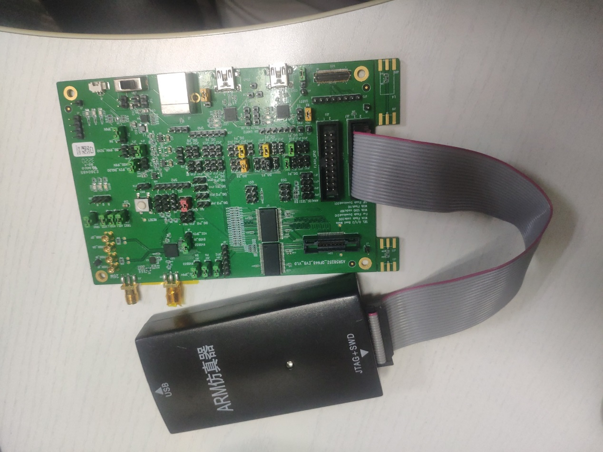
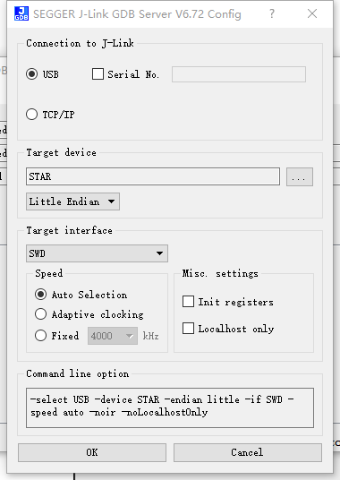
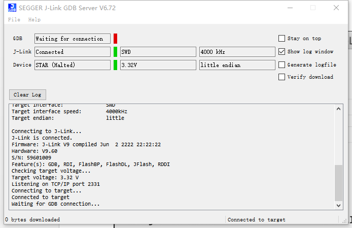

ASR5502X&ASR5822X 系列 J-Link + GDB 调试方法
==========================================

前言
----

**关于本文档**

本文档主要介绍 ASR5502X&ASR5822X 系列芯片在嵌入式开发中常用的 JLink + GDB 调试方法。

**读者对象**

本文档主要适用于以下工程师：
-  单板硬件开发工程师 
-  软件工程师
-  技术支持工程师

**产品型号**

本文档适用于 ASR5502X&ASR5822X 系列芯片。

**版权公告**

版权归 © 2023 翱捷科技股份有限公司所有。保留一切权利。未经翱捷科技股份有限公司的书面许可，不得以任何形式或手段复制、传播、转录、存储或翻译本文档的部分或所有内容。

**商标声明**

ASR、翱捷和其他翱捷商标均为翱捷科技股份有限公司的商标。

本文档提及的其他所有商标名称、商标和注册商标均属其各自所有人的财产，特此声明。

**免责声明**

翱捷科技股份有限公司对本文档内容不做任何形式的保证，并会对本文档内容或本文中介绍的产品进行不定期更新。

本文档仅作为使用指导，本文的所有内容不构成任何形式的担保。本文档中的信息如有变更，恕不另行通知。

本文档不负任何责任，包括使用本文档中的信息所产生的侵犯任何专有权行为的责任。

**防静电警告**

静电放电（ESD）可能会损坏本产品。使用本产品进行操作时，须小心进行静电防护，避免静电损坏产品。

**翱捷科技股份有限公司**

地址：上海市浦东新区科苑路399号张江创新园10号楼9楼 邮编：201203

官网： http://www.asrmicro.com/

**文档修订历史**

======= ====== ==========
日期    版本号 发布说明
======= ====== ==========
2023.09 V1.0.0 首次发布。
======= ====== ==========

1. 准备
-------

硬件需求：ARM V9仿真器

软件需求：J-Link V6.72

调试所需软件J-Link可以从\ `https://www.segger.com <https://www.segger.com/>`__\ 下载对应操作系统的软件包，然后安装。

注意：segger是仿真器的名字，相当常用的一款。仿真器的接口也是固定的，一般开发板上都会带有这个调试接口，如图：

|image1|

2. 运行
-------

1. 运行 J-Link GDB Server

|image2|

按照上图中的配置，配置 GDB Server，然后点击 OK，进入下一个界面

|image3|

.. attention::
    如果硬件连接没有问题，那么上图中的 J-Link 和 Device 栏中显示绿色，GDB 显示为红色，因为还没有运行 GDB 软件。另外，请注意图中的“Listening on TCP/IP port 2331”，这个端口在运行 GDB 时需要。

2. 运行 GDB，开始调试（例如：调试镜像为 helloworld）:

(a) 打开命令行，进入到镜像所在目录，执行命令 arm-none-eabi-gdb helloworld.elf

(b) 连接 GDB Server 的 2331 端口。在 GDB 命令行中执行命令 tar ext:2331

(c) 设置断点，如在 ResetHandler 处设置断点，执行命令 b ResetHandler

(d) 开始运行，执行命令 r

复位命令执行后，程序将停止在 ResetHandler 处。还可以设置其他断点，如 b main、b HardFault_Handler 等。其他 GDB 命令都支持，如图：

|imag4|

3. 使用
-------

watchpoint，顾名思义，其一般用来观察某个变量/内存地址的状态（也可以是表达式），如可以监控该变量/内存值是否被程序读/写。

在 gdb 中可通过下面的几种方法来设置 watchpoint：　

-  (gdb) watch 　

在指定变量/内存地址（表达式）expr 设置一个 watchpoint。一旦 expr 值有变化，将停住程序。

-  (gdb) rwatch

当 expr 被读时，停住程序。

-  (gdb) awatch

当 expr 被读或被写时，停住程序。

-  (gdb) info watchpoints

查看 watchpoint

(gdb)d n

删除 watchpoint，同删除 breakpoint 一样

举例：

-  想监控 0 地址处起始的 1K 字节是否被访问，若有 read 或者 write 访问，则程序停下

   awatch (char[1024])*0x0

-  想监控 0x1001dd08 处的一段结构体的内部数据是否被改写，若发生改写则程序停下，只读无影响

   watch ((k_mm_list_t \*)0x1001dd08)->mbinfo->free_ptr

用户若熟悉 Keil 环境，也可使用 keil 下载调试，调试方法可自行搜索。

.. |image4| image:: ../../img/550X_GDB调试方法/图2-3.png