ASR IoT 系列 Flash 加密及安全启动使用指南
=============================================

前言
----

**关于本文档**

本文档旨在介绍 ASR IoT 系列芯片启用 Flash 加密及 Secure Boot 功能的方法及步骤（两者同时启用时需先启用 Flash 加密功能再启用 Secure Boot 功能、烧录加签固件）。

**读者对象**

本文档主要适用于以下工程师：

-  单板硬件开发工程师
-  软件工程师
-  技术支持工程师

**产品型号**

本文档适用于 ASR IoT 芯片（Wi-Fi SoC，BLE SoC 和 Wi-Fi+BLE Combo SoC）。

**版权公告**

版权归 © 2023 翱捷科技股份有限公司所有。保留一切权利。未经翱捷科技股份有限公司的书面许可，不得以任何形式或手段复制、传播、转录、存储或翻译本文档的部分或所有内容。

**商标声明**

ASR、翱捷和其他翱捷商标均为翱捷科技股份有限公司的商标。

本文档提及的其他所有商标名称、商标和注册商标均属其各自所有人的财产，特此声明。

**免责声明**

翱捷科技股份有限公司对本文档内容不做任何形式的保证，并会对本文档内容或本文中介绍的产品进行不定期更新。

本文档仅作为使用指导，本文的所有内容不构成任何形式的担保。本文档中的信息如有变更，恕不另行通知。

本文档不负任何责任，包括使用本文档中的信息所产生的侵犯任何专有权行为的责任。

**防静电警告**

静电放电（ESD）可能会损坏本产品。使用本产品进行操作时，须小心进行静电防护，避免静电损坏产品。

**翱捷科技股份有限公司**

地址：上海市浦东新区科苑路399号张江创新园10号楼9楼 邮编：201203

官网： http://www.asrmicro.com/

**文档修订历史**

======= ====== ==========
日期    版本号 发布说明
======= ====== ==========
2023.09 V1.0.0 首次发布。
======= ====== ==========

1. Flash 加密
------------

1.1 Flash 加密指令介绍
~~~~~~~~~~~~~~~~~~~~~

1.1.1 获取 Flash 加密状态
^^^^^^^^^^^^^^^^^^^^^^^

|image1|

1.1.2 写入 Flash 加密密钥
^^^^^^^^^^^^^^^^^^^^^^^

|image2|

1.1.3 使能 Flash 加密功能
^^^^^^^^^^^^^^^^^^^^^^^

|image3|

1.2 Flash 加密验证流程
~~~~~~~~~~~~~~~~~~~~~

1.2.1 硬件环境准备
^^^^^^^^^^^^^^^^^^

(1) 芯片 UART1 接电脑

(2) 芯片 SeL 引脚接 3.3 V

(3) 系统上电

1.2.2 进入 download 模式
^^^^^^^^^^^^^^^^^^^^^^

|image4|

(1) 硬件接好后，打开 DOGO 工具。点击检测串口，选择对应串口号并打开串口，如图 1-3 步。

(2) ChipType 下拉选择对应芯片型号，勾选“only download”选项框，如图 4-5 步。

(3) 芯片上电，待显示窗口打印“1F2D3E00”字样，点击烧录按钮，如图 6-7 步。

(4) 显示窗口打印“welcome to download”字样表示已进入 download 模式。

1.2.3 写入 Flash 密钥
^^^^^^^^^^^^^^^^^^^

|image5|

(1) 发送窗口写入发送密令及加密密钥值，例“flashENC wrkey 0x12345678”。

(2) 写入密钥后显示窗口回显“OK”表示密钥写入成功。

1.2.4 使能 Flash 加密
^^^^^^^^^^^^^^^^^^^

|image6|

(1) 发送窗口写入使能 Flash 加密指令“flashENC enable”。

(2) 发送使能 Flash 加密指令后显示窗口回显“OK”表示使能成功。

(3) 此时可通过状态查询指令“flashENC status”查询状态。

2. Secure Boot
--------------

2.1 Secure Boot 指令介绍
~~~~~~~~~~~~~~~~~~~~~~~~

2.1.1 获取 Secure Boot 状态
^^^^^^^^^^^^^^^^^^^^^^^^^

|image7|

2.1.2 写入 Secure Boot 密钥
^^^^^^^^^^^^^^^^^^^^^^^^^

|image8|

2.1.3 读取 Secure Boot 密钥
^^^^^^^^^^^^^^^^^^^^^^^^^

|image9|

2.1.4 使能 Secure Boot 功能
^^^^^^^^^^^^^^^^^^^^^^^^^

|image10|

2.2 Secure Boot 固件准备
~~~~~~~~~~~~~~~~~~~~~~~~

2.2.1 环境准备
^^^^^^^^^^^^^^

|image11|

(1) 将ASR 提供的 Docker 镜像文件放入 Linux 共享文件夹。

(2) 使用 cat docker_ubuntu16.04_certification_20220106.tar \| docker import - ubuntu16.04:secureboot 命令，将镜像文件导入 Docker 环境。

-  docker_ubuntu16.04_certification_20220106.tar 是镜像文件名。
-  ubuntu16.04:secureboot 导入镜像文件创建镜像的名字，方便后续查找及操作。

(3) 基于已创建镜像使用 docker run -it -v /home/shibozhan/secure/:/secure_docker/ –name secureboot ubuntu16.04:secureboot /bin/bash 指令创建容器

-  /home/shibozhan/secure 本地磁盘中用于文件共享的共享文件夹目录
-  /secure_docker/ 创建容器中对应的共享文件夹目录
-  –name secureboot 创建容器定义的名字，方便后续查找及操作
-  ubuntu16.04:secureboot 镜像名
-  /bin/bash 表示启动容器后启动 bash 工具

(4) 首次执行 docker run 命令容器会自动启动并链接上容器。后续使用容器需要执行 docker start secureboot，启动名为 secureboot 的容器，容器启动后执行 docker attach secureboot 命令，链接名为 secureboot 的容器。

(5) 成功启动并链接上容器后，将 RSA 加签工具文件夹从 /home/guest/project/certification 复制到 secure_docker 目录下。

|image12|

2.2.2 cmd_gen.sh 脚本使用说明
^^^^^^^^^^^^^^^^^^^^^^^^^^^^

在 secureboot 容器中将当前目录切换到 /secure_docker/rsa/bin 文件夹下，调用 cmd_gen.sh 脚本生成相应加签文件及验签密钥。

|image13|

(1) ./cmd_gen.sh –h (help 命令)

|image14|

(2) ./cmd_gen.sh –c ALL（清除所有 RSA 密钥对及验签文件）

|image15|

(3) ./cmd_gen.sh –r（重新生成 RSA 密钥对）

|image16|

(4) ./cmd_gen.sh –k（生成密钥证书）

|image17|

(5) ./cmd_gen.sh –s（生成密钥证书中的公钥哈希值）

|image18|

2.2.3 RSA 验签固件生成
^^^^^^^^^^^^^^^^^^^^^

以 ASR582X SDK（版本为 1.8.0）为例：

(1) 首先需要准备适配加签功能的 BootLoader（ASR 提供，文件名有 SECUREBOOT 字样的版本)，生成适配加签的应用固件（需要手动更改链接文件配置适配加签固件生成的需求。Flash 起始地址从 0x10012000 修改为 0x10013000）。

.. attention::
    这里的应用固件是指未加入OTA升级文件头的bin文件。

(2) 将上述 app 和 boot 的 bin 文件拷贝到本地磁盘共享文件夹 RSA 加签工具目录中的 bin 目录下。

(3) 生成安全固件前需修改 image_table.tbl、bootload_table.tbl、ota_table.tbl 文件配置。

image_table.tbl 中参数对应修改为： ./image.bin 0xFFFFFFFF 0x10013000

bootload_table.tbl 中参数对应修改为： ./bootload.bin 0xFFFFFFFF 0x10001000

ota_table.tbl 中参数对应修改为： ./ota.bin 0xFFFFFFFF 0x10013000

(4) ./cmd_gen.sh –b 文件名 .bin（生成带安全证书的 BootLoader 固件）。命令执行成功后会在 out 目录下生成带安全证书的 BootLoader 固件 bootload_cert.bin。

|image19|

(5) ./cmd_gen.sh –a 文件名 .bin（生成带安全证书的应用固件，用于在线工具烧录应用固件）。命令执行成功后会在 out 目录下生成带有安全证书的应用固件 image_cert.bin。

|image20|

(6) ./cmd_gen.sh –o 文件名 .bin（生成带安全证书的 OTA 固件，生成的文件工具会自动添加上 OTA 信息头），命令执行成功后会在 out 目录下生成带安全证书的 OTA 固件ota_cert.ota.bin。

|image21|

.. attention::
    1. 当前工具生成的OTA固件只支持remapping一种升级方式。传入的bin固件必需是编译后未加OTA头的原始固件，否则升级将会失败。
    2. 2.2.2如果没有更新密钥对的需求，只需首次执行一次，不用每次都重新执行一遍，根据需求生成相应的安全固件即可。
    3. 对于2.2.3 (1)，针对一款芯片的开发只需设置一次。
    4. 生成新的密钥对后必须保证步骤2.2.2均执行一遍。

2.3 Secure Boot 验证流程
~~~~~~~~~~~~~~~~~~~~~~~

.. _硬件环境准备-1:

2.3.1 硬件环境准备
^^^^^^^^^^^^^^^^^^

(1) 芯片 UART1 接电脑

(2) 芯片 SeL 引脚接 3.3 V

(3) 系统上电

.. _进入 download 模式-1:

2.3.2 进入 download 模式
^^^^^^^^^^^^^^^^^^^^^^

|image22|

(1) 硬件接好后，打开 DOGO 工具。点击检测串口，选择对应串口号并打开串口，如图 1-3 步。

(2) ChipType 下拉选择对应芯片型号，勾选“only download”选项框，如图 4-5 步。

(3) 芯片上电，待显示窗口打印“1F2D3E00”字样，点击烧录按钮，如图 6-7 步。

(4) 显示窗口打印“welcome to download”字样表示已进入 download 模式。

.. _写入 secure-boot 密钥-1:

2.3.3 写入 Secure Boot 密钥
^^^^^^^^^^^^^^^^^^^^^^^^^

|image23|

(1) 发送窗口写入 secureboot 密钥，例“secureBoot wrkey db100d66632c25ab3a94be4af41e55b94d6c7606c1a59977376a3effd3cf6b83”。

(2) 写入密钥后显示窗口回显“OK”表示密钥写入成功。

.. note::
    写入前可以使用“secureBoot status”指令获取当前状态。

.. _使能 secure-boot 功能-1:

2.3.4 使能 Secure Boot 功能
^^^^^^^^^^^^^^^^^^^^^^^^^

|image24|

(1) 发送窗口写入使能 Flash 加密指令“secureBoot enable”。

(2) 发送使能 Flash 加密指令后显示窗口回显“OK”表示使能成功。

(3) 此时可通过状态查询指令“secureBoot status”查询状态。

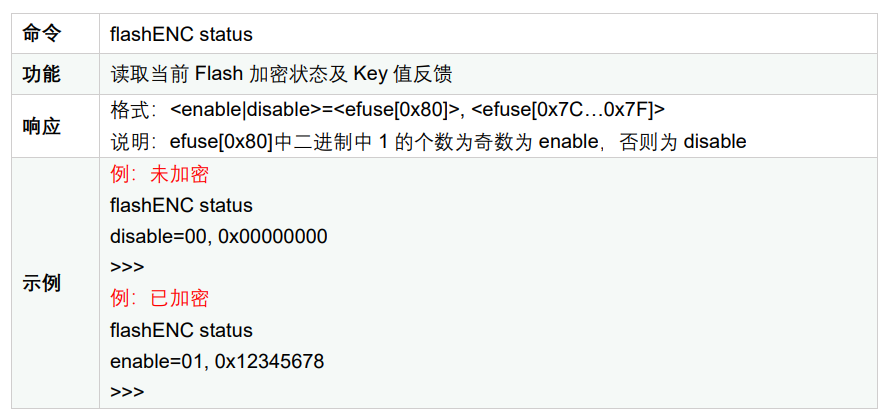
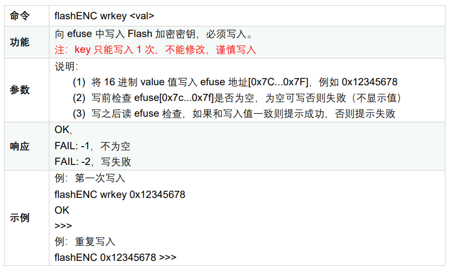
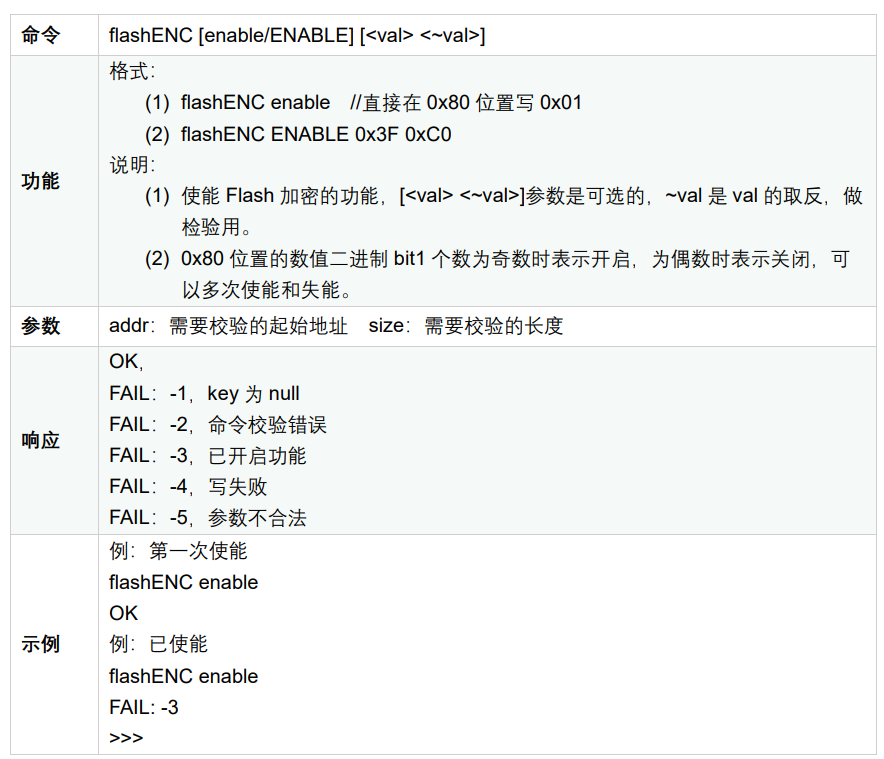
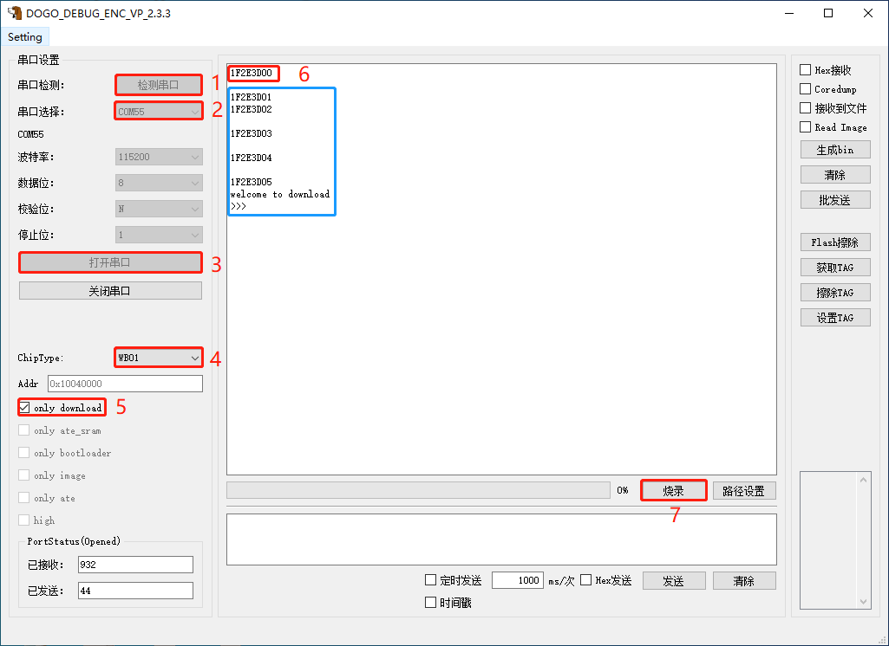
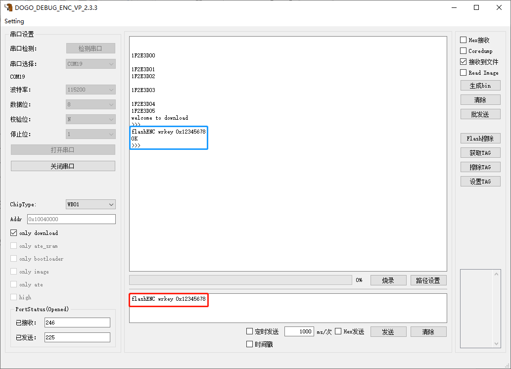
.. |image6| image:: ../../img/ASRIoT系列_Flash加密/图1-3.png
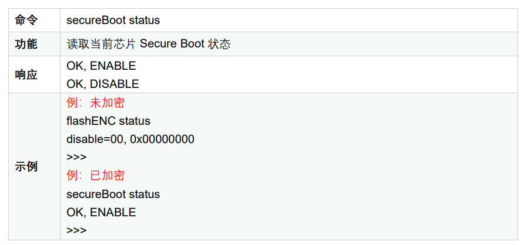
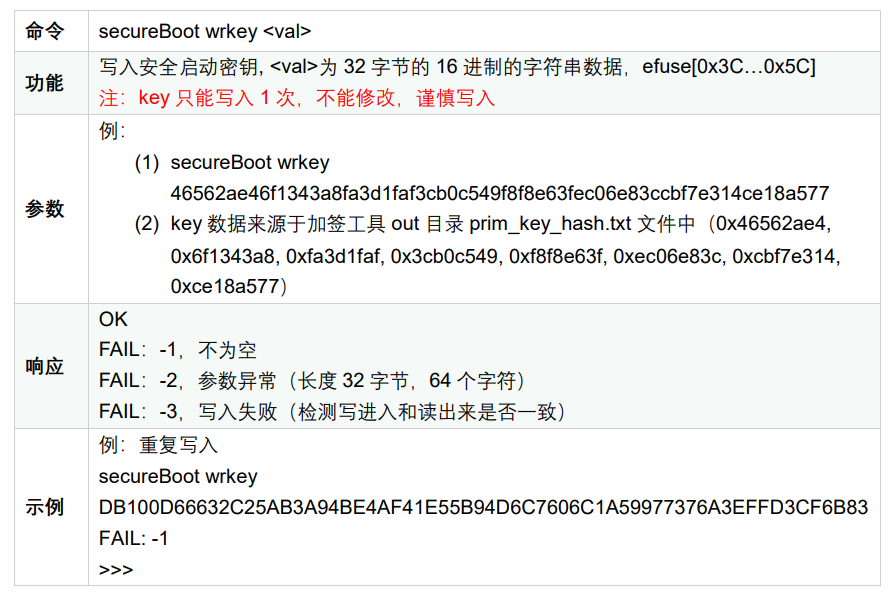
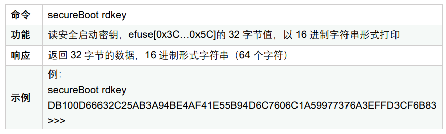
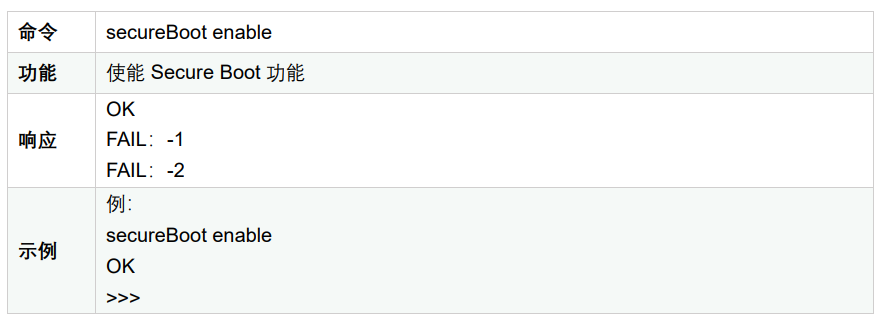
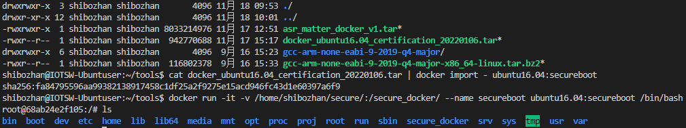
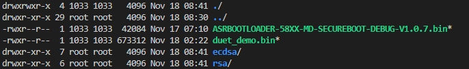
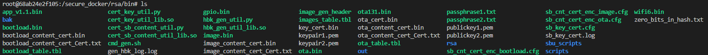
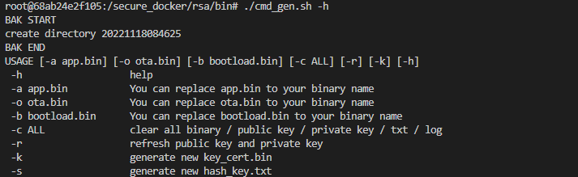
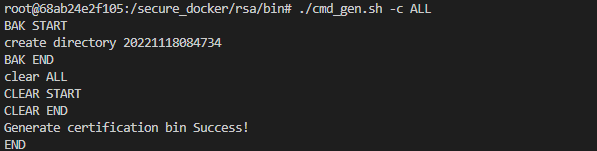
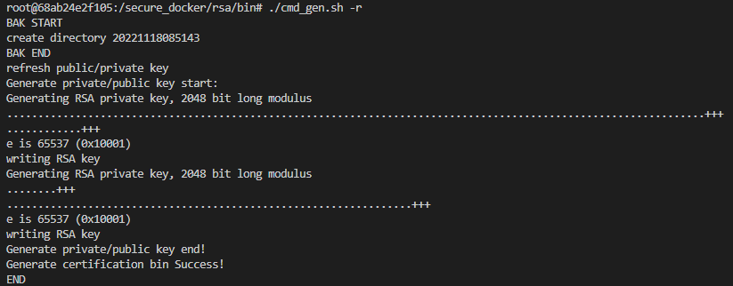
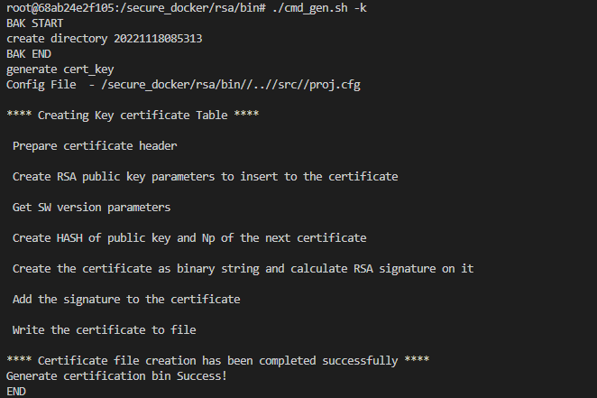
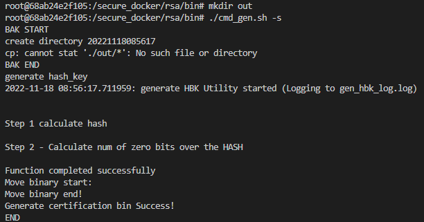
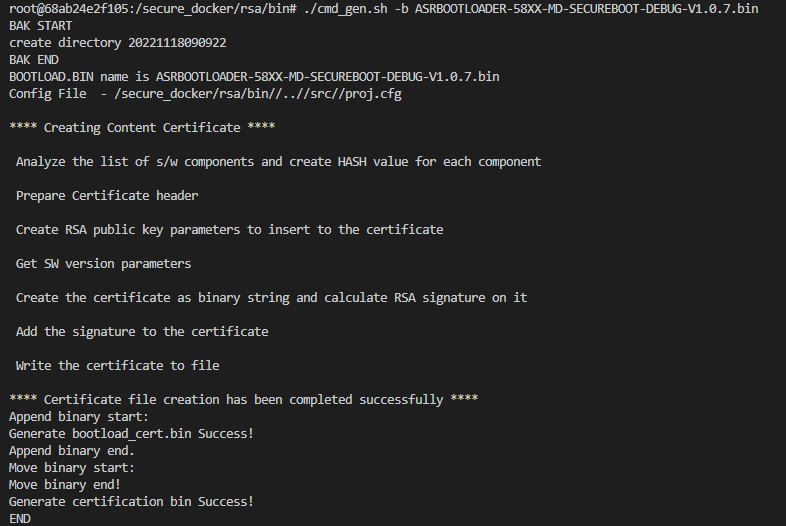
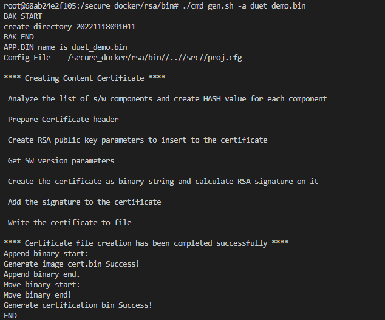
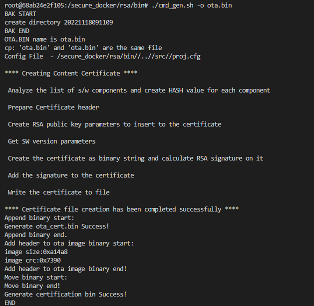
.. |image22| image:: ../../img/ASRIoT系列_Flash加密/图2-12.png
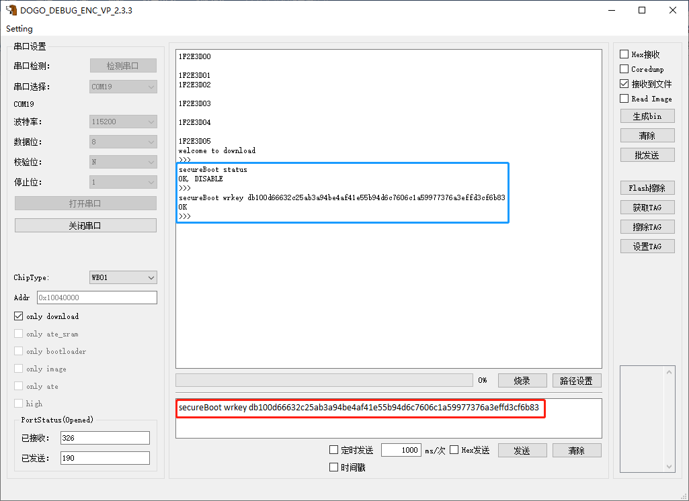
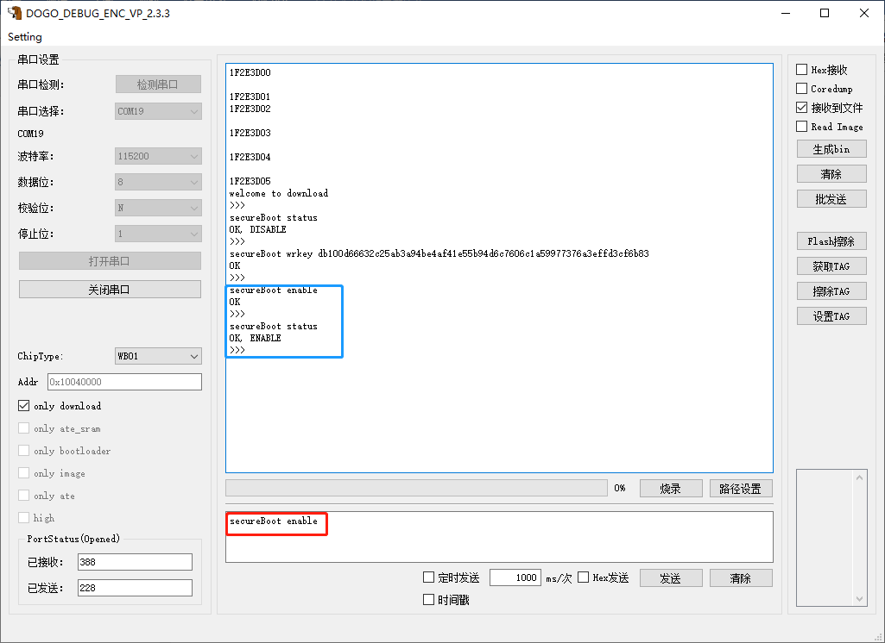