ASR IoT 系列 OTA 功能开发指导
=============================

前言
----

**关于本文档**

本文档主要介绍 ASR IoT 系列芯片进行 OTA 升级的实现方式以及涉及的主要结构体和 API 等。

**读者对象**

本文档主要适用于以下工程师：

-  软件工程师
-  技术支持工程师

**产品型号**

本文档适用于 ASR IoT 系列 Wi-Fi+BLE Combo SoC 和 Wi-Fi SoC 芯片。

**版权公告**

版权归 © 2023 翱捷科技股份有限公司所有。保留一切权利。未经翱捷科技股份有限公司的书面许可，不得以任何形式或手段复制、传播、转录、存储或翻译本文档的部分或所有内容。

**商标声明**

ASR、翱捷和其他翱捷商标均为翱捷科技股份有限公司的商标。

本文档提及的其他所有商标名称、商标和注册商标均属其各自所有人的财产，特此声明。

**免责声明**

翱捷科技股份有限公司对本文档内容不做任何形式的保证，并会对本文档内容或本文中介绍的产品进行不定期更新。

本文档仅作为使用指导，本文的所有内容不构成任何形式的担保。本文档中的信息如有变更，恕不另行通知。

本文档不负任何责任，包括使用本文档中的信息所产生的侵犯任何专有权行为的责任。

**防静电警告**

静电放电（ESD）可能会损坏本产品。使用本产品进行操作时，须小心进行静电防护，避免静电损坏产品。

**翱捷科技股份有限公司**

地址：上海市浦东新区科苑路399号张江创新园10号楼9楼 邮编：201203

官网： http://www.asrmicro.com/

**文档修订历史**

======= ====== =============================
日期    版本号 发布说明
======= ====== =============================
2023.08 V1.1.0 修改为 IoT 系列芯片通用版本。
======= ====== =============================

1. OTA 升级方式介绍
-------------------

1.1 ASR IoT 芯片升级方式
~~~~~~~~~~~~~~~~~~~~~~~

ASR 提供的 SDK 目前支持镜像拷贝（又称原地升级：IMAGE_COPY）和地址映射（又称乒乓升级：REMAPPING）两种方式，其中镜像拷贝还支持压缩 bin 文件功能（COMPRESS），详细升级方式介绍请参考第二章节。ASR IoT 系列芯片 OTA 升级方式如下：

|image1|

1.2 ASR OTA 编译脚本
~~~~~~~~~~~~~~~~~~~

根据不同的 OTA 升级策略, 可使用 SDK 内提供的两种方式来生成 OTA 固件，用户可按照下面两种方式修改 OTA 升级方式。

1. SDK 内已提供 OTA 编译脚本，用户在编译固件时会自动调用编译脚本生成 OTA 固件，SDK OTA 编译脚本存放的位置如下：

|image2|

|image3|

2. image_gen_header 工具生成满足不同升级策略的 OTA 固件，如镜像拷贝、地址映射、压缩拷贝等；工具使用说明：

   **image_gen_header.exe <app.bin 路径>**

   其中第二个参数可以是：image_copy、flash_remapping、image_compress（或者 COPY、REMAPPING、COMPRESS，请根据当前 SDK 内的设置来选择），分别表示：镜像拷贝、地址映射、压缩拷贝三种方式。

.. attention::
    SDK 只提供 OTA 升级底层相关的接口，ota.bin 如何获取（云端或者本地）以及是主动获取还是被动，需要开发者来实现上层应用。

2. OTA 升级原理介绍
-------------------

ASR IoT 芯片 flash layout 部分有差异，下面以 2M flash 为例，各芯片 APP 和 OTA 的起始地址如下：

==================== =============== ===============
**IoT** **芯片系列** **APP起始地址** **OTA起始地址**
==================== =============== ===============
ASR5822X             0x10012000      0x10100000
ASR5502X             0x10040000      0x10100000
ASR5952X             0x80012000      0x80100000
==================== =============== ===============

实际分区可能略有差异，具体可查看 SDK 相关文件的分区定义，如下：

==================== ========================================
**IoT** **芯片系列** **分区地址定义**
==================== ========================================
ASR5822X             /platform/duet/system/include/duet_cm4.h
ASR5502X             /platform/system/include/lega_cm4.h
ASR5952X             /platform/alto/system/include/asr_rv32.h
==================== ========================================

ASR IoT 系列芯片在 OTA 的处理逻辑和 API 上基本一致，下面以 ASR5822S 为例说明 OTA 升级逻辑。

2.1 镜像拷贝
~~~~~~~~~~~~

.. raw:: html

   

|image4|

镜像拷贝升级方式

.. raw:: html

   

.. raw:: html

   

|image5|

镜像拷贝升级流程图

.. raw:: html

   

镜像拷贝升级主要流程如上图所示：

1. 应用从云端获取 ota.bin 数据后，先将升级文件写到 OTA 区域：

在写入数据的过程中系统会做一些安全检查，例如版本检查（默认未开启此功能）、传输数据的校验等，当安全检查未通过时系统返回错误信息，升级失败。只有当安全检查通过系统才设置 boot 标志位，表明 OTA 分区中有效升级文件，且重启系统。

2. 系统重启，在 bootloader 阶段会对 boot 标志位进行检查：

当升级标志位已被置起，bootloader 则会将 OTA 中的数据拷贝到 APP 分区，拷贝完成后会对数据完整性检查，数据完整则清除 boot 中的标志位，以及跳转到 APP 区运行。当升级标志位未被置起，则直接跳转到 APP 区运行。

2.2 地址映射
~~~~~~~~~~~~

.. raw:: html

   

|image6|

地址映射升级方式

.. raw:: html

   

.. raw:: html

   

|image7|

地址映射升级流程图

.. raw:: html

   

地址映射升级的主要实现如上图，其依赖于系统对\ **逻辑地址和 flash 的物理地址空间进行映射，flash 地址以 SDK 实际定义为准**\ 。

1. 第 1 次升级时系统会将 OTA 数据存放到系统逻辑地址 **0x1010 0000**\ 位置（Bank1 区域）。系统重启，bootloader 会对 Flash 中 System Info 区的 OTA 信息进行检查，当前测到 OTA 标志位生效，则会对逻辑地址\ **0x1010 0000**\ （Bank1 区域）中的升级数据进行有效性校验，校验成功则跳转到 Bank1 运行，否则继续跳转到 Bank0。

2. 第 2 次升级时，将升级数据保存到逻辑地址\ **0x1001 2000 (Bank0)**\ 的地方。数据写完后设置 boot 信息后重启系统。bootloader 会根据映射关系跳转到逻辑地址\ **0x1001 2000 (Bank0)**\ 的地方开始运行。

3. 之后的升级可以根据上述步骤来依次类推，升级文件会在逻辑地址\ **0x1001 2000 (Bank0)**\ 与 **0x1010 0000 (Bank1)**\ 之间不断交替保存；bootloader 会根据映射关系，在这两个逻辑地址之间不断切换启动。

.. attention::
    从安全角度考虑，建议用户使用地址映射升级方式；如果采用原地升级方式，若因误操作，升级了不正确的固件，可能会导致设备异常从而无法正常启动系统。

3. OTA 相关文件及 API 说明
-----------------------

3.1 ASR OTA 声明文件
~~~~~~~~~~~~~~~~~~~

|image8|

.. attention::
    1. SDK OTA 升级接口仅以静态库的形式提供，用户不需要关心固件升级过程，只需要关心固件从服务端获取的流程。
    2. OTA 断点续传功能需要 HTTP 服务端支持。

3.2 主要结构体
~~~~~~~~~~~~~~

主要结构体如下图所示，在使用 OTA 接口时，目前只需关注如下红框的部分,

**off_bp**\ ：OTA 升级数据的偏移值，0 表示新的一次升级，非 0 表示恢复上次升级且重传的偏移值为\ **off_bp**\ 。

**res_type**\ ：OTA 升级状态，目前主要有两种状态：

-  **OTA_FINISH**\ ：表示传输数据完成，系统自动执行相关动作：版本检测、校验和验证、设置标志、重启。

-  **OTA_BREAKPOINT**\ ：表示传输中断，系统自动做相应处理，以备下次恢复升级。

|image9|

3.3 相关 API
~~~~~~~~~~~

3.3.1 int lega_ota_init(void *something)
^^^^^^^^^^^^^^^^^^^^^^^^^^^^^^^^^^^^^^^^^

+-----------+--------------------------------------------------------------------------------------------------------------------------------------------------------------+
| **Items** | **Description**                                                                                                                                              |
+===========+==============================================================================================================================================================+
| Function  | 初始化OTA功能，为本次升级做准备。 包括设置是否恢复上次中断的升级或新的一次升级，以及新的一次升级擦除OTA区域。                                                |
+-----------+--------------------------------------------------------------------------------------------------------------------------------------------------------------+
| Parameter | **something**\ ：实际传入lega_ota_boot_param_t结构体的指针，此结构体中off_bp需要被设置。off_bp：0表示新的一次升级；非0表示恢复上次升级且重传的地址为off_bp。 |
+-----------+--------------------------------------------------------------------------------------------------------------------------------------------------------------+
| Return    | Result：0表示成功；非0表示失败                                                                                                                               |
+-----------+--------------------------------------------------------------------------------------------------------------------------------------------------------------+
| Note      |                                                                                                                                                              |
+-----------+--------------------------------------------------------------------------------------------------------------------------------------------------------------+

3.3.2 int lega_ota_write(int *off_set, char *in_buf, int in_buf_len)
^^^^^^^^^^^^^^^^^^^^^^^^^^^^^^^^^^^^^^^^^^^^^^^^^^^^^^^^^^^^^^^^^^^^^

|image10| 

3.3.3 int lega_ota_read(int *off_set, char *out_buf, int out_buf_len)
^^^^^^^^^^^^^^^^^^^^^^^^^^^^^^^^^^^^^^^^^^^^^^^^^^^^^^^^^^^^^^^^^^^^^^

|image11| 

3.3.4 int lega_ota_set_boot(void *something)
^^^^^^^^^^^^^^^^^^^^^^^^^^^^^^^^^^^^^^^^^^^^^

|image12| 

3.3.5 const char *lega_ota_get_version(unsigned char dev_type)
^^^^^^^^^^^^^^^^^^^^^^^^^^^^^^^^^^^^^^^^^^^^^^^^^^^^^^^^^^^^^^^

========= ======================================
**Items** **Description**
========= ======================================
Function  获取正在运行的固件版本号
Parameter **dev_type**\ ：固定值0
Return    Result：NULL表示失败；非空指针：版本号
Note      
========= ======================================

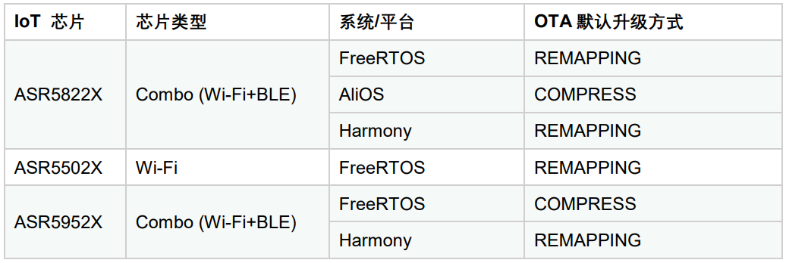
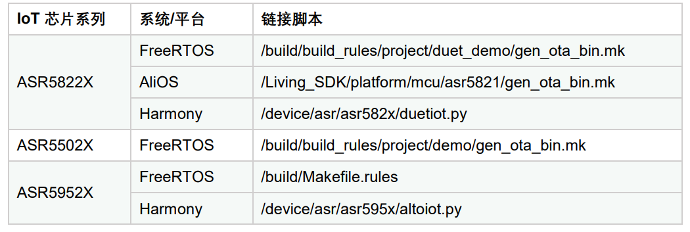
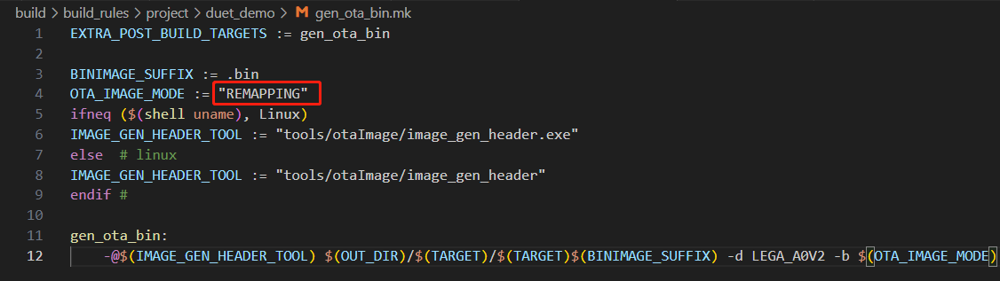
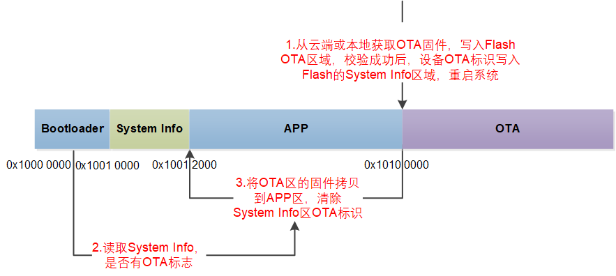
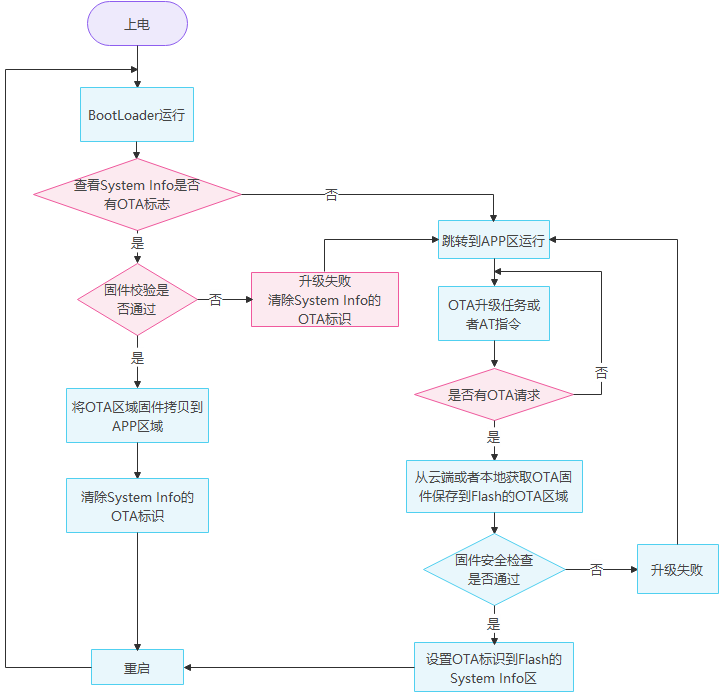
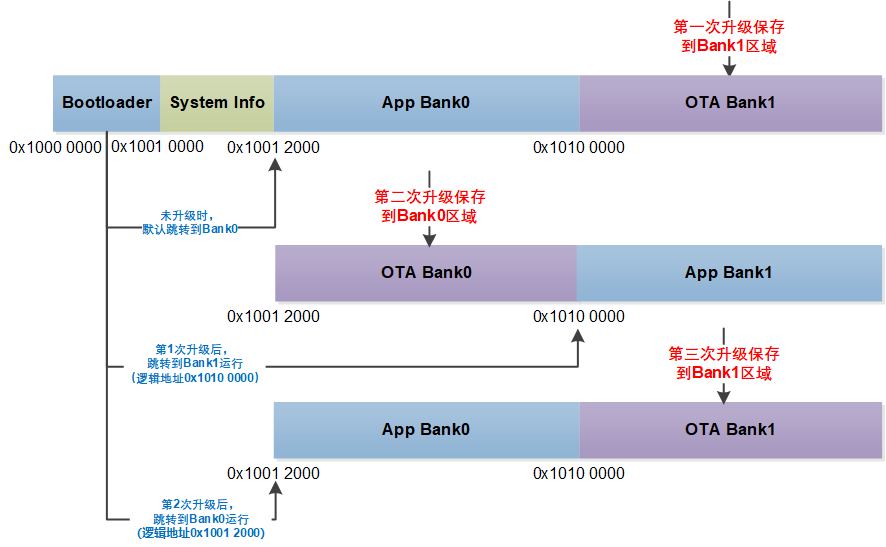
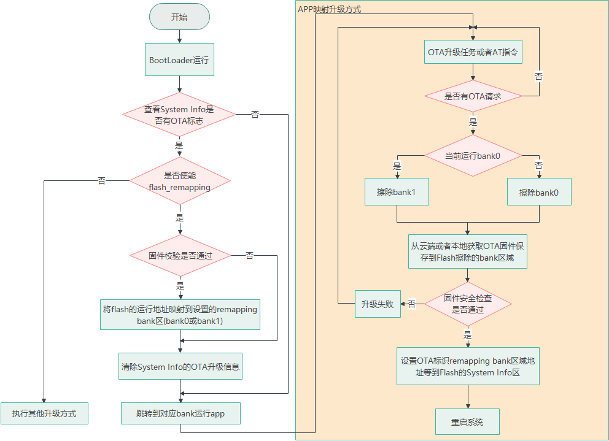
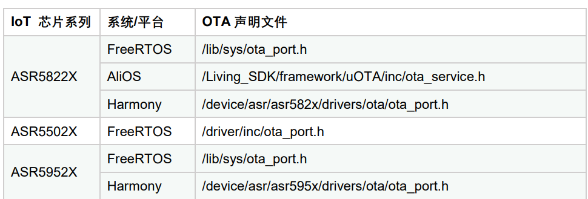
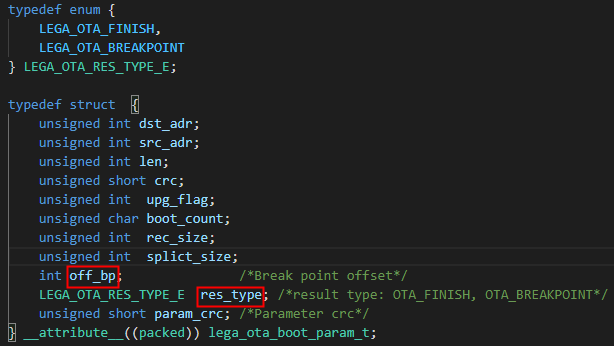
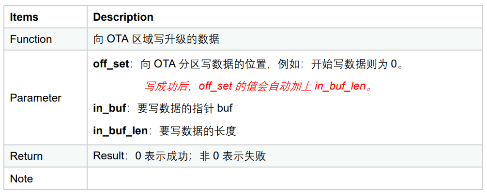
.. |image11| image:: ../../img/ASRIoT系列_OTA功能开发指导/表3-3.png
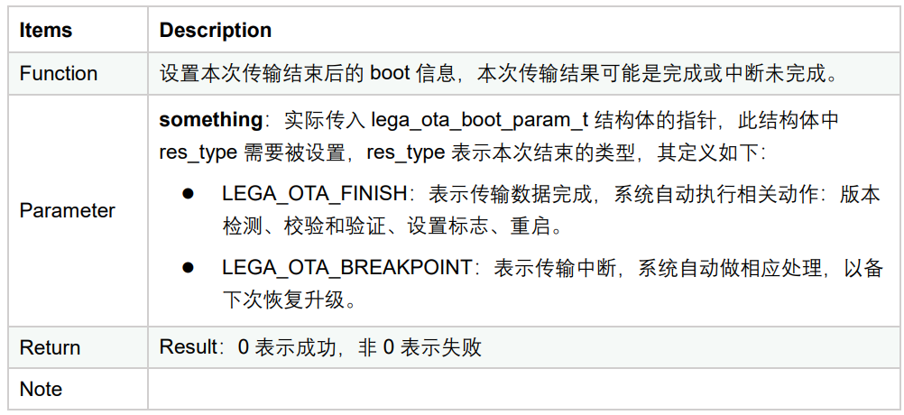