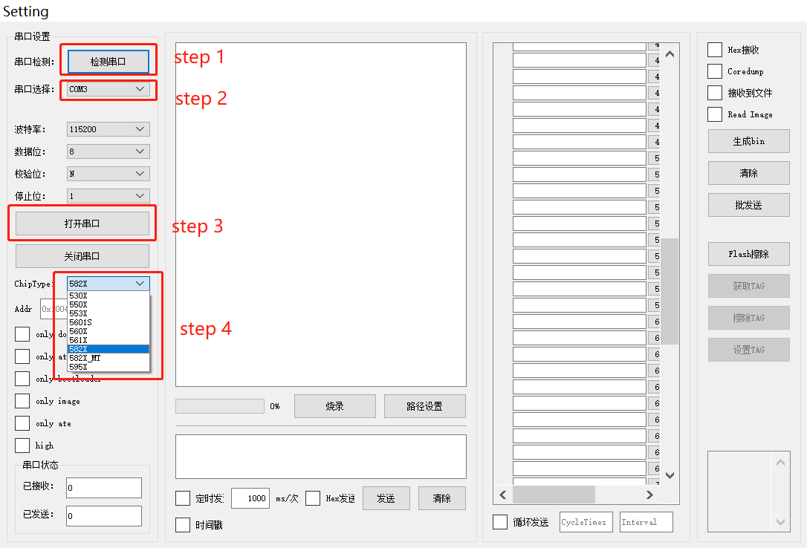
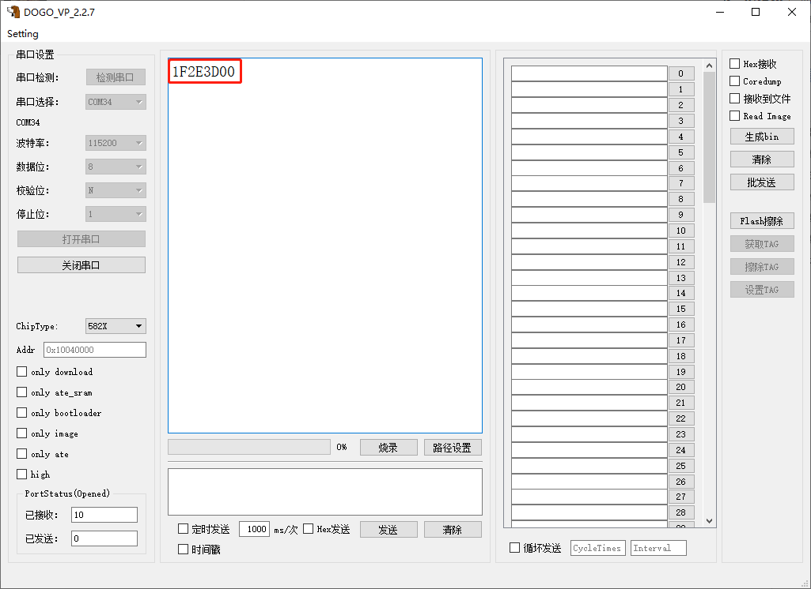
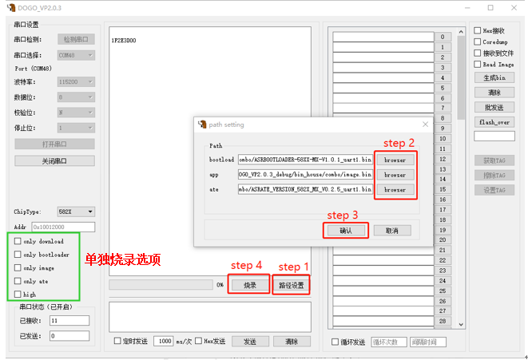
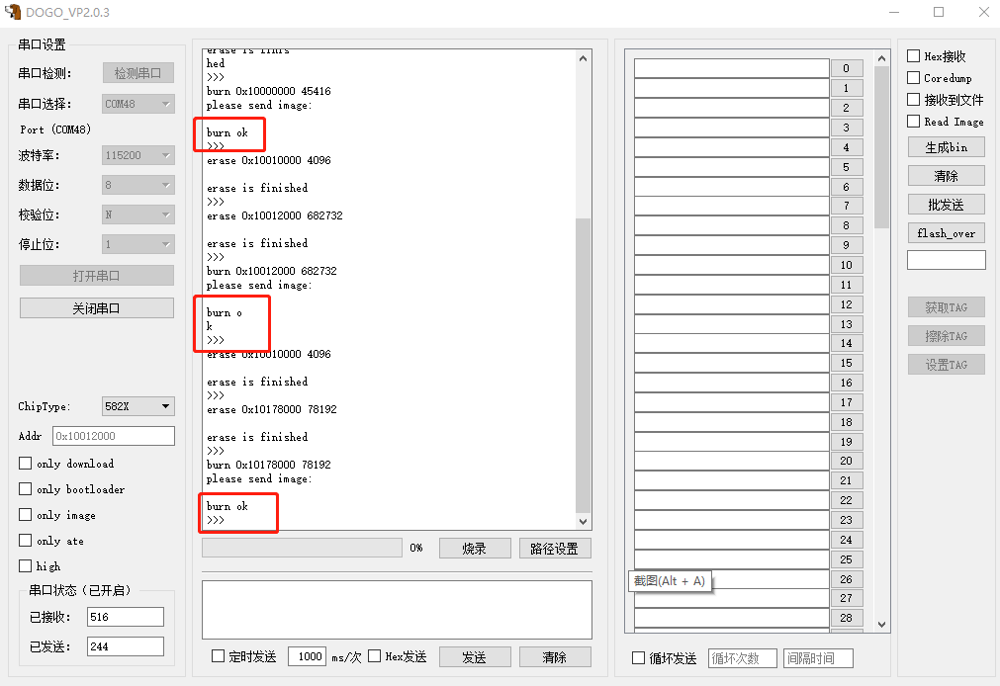
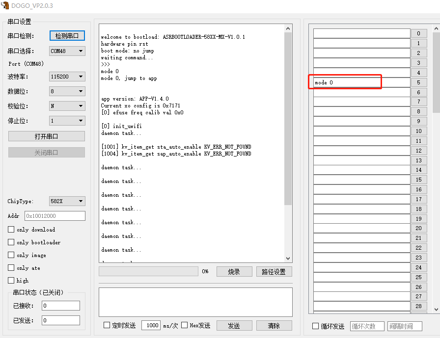
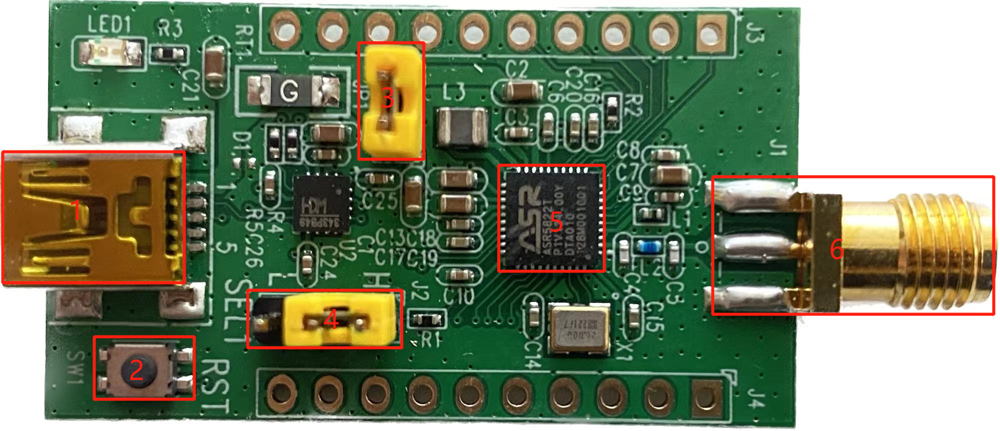
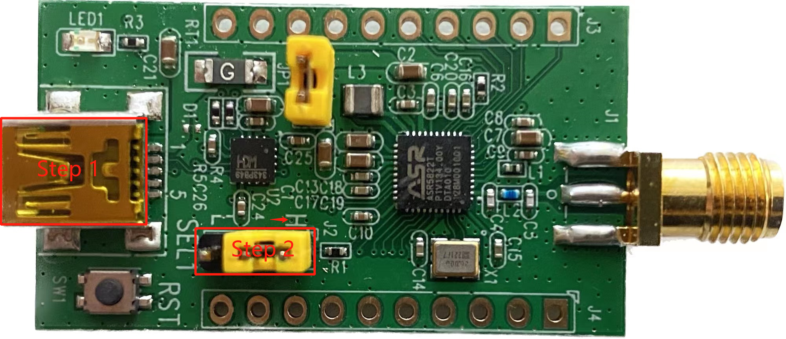
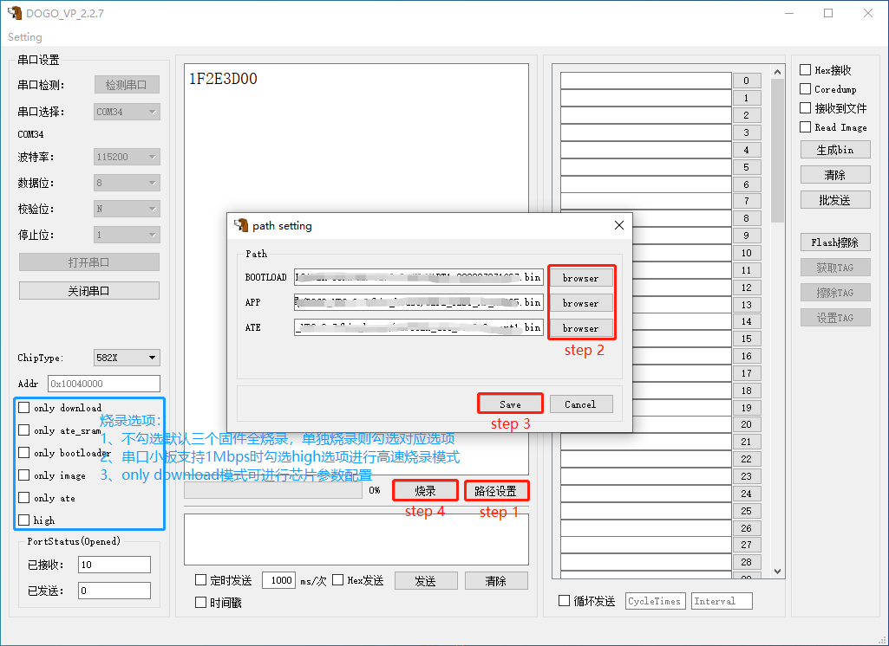
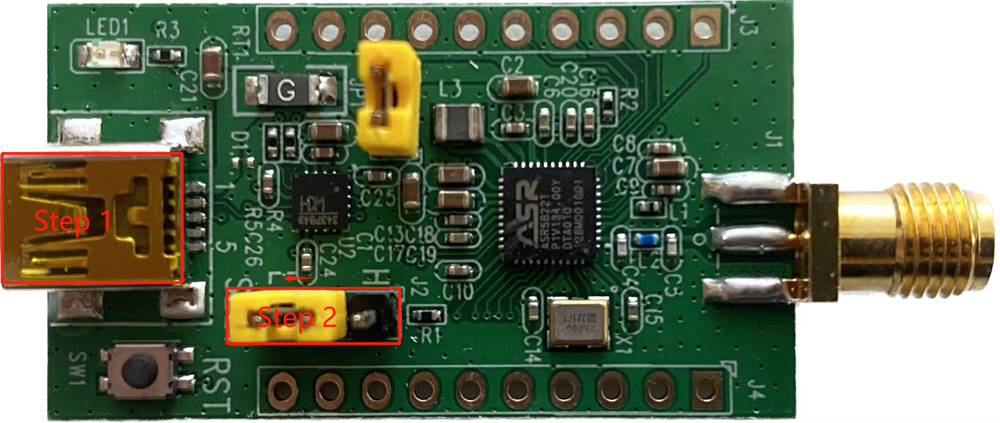

ASR IoT 系列开发板使用指南
==========================

前言
----

**关于本文档**

本文档旨在介绍 ASR IoT 芯片开发所用的标准开发板与 Lite 开发板的硬件配置、程序下载。

**读者对象**

本文档主要适用于以下工程师：

-  单板硬件开发工程师
-  软件工程师
-  技术支持工程师

**产品型号**

本文档适用于 ASR IoT 芯片（ASR5502X，ASR5822X 及 ASR5952X）。

**版权公告**

版权归 © 2023 翱捷科技股份有限公司所有。保留一切权利。未经翱捷科技股份有限公司的书面许可，不得以任何形式或手段复制、传播、转录、存储或翻译本文档的部分或所有内容。

**商标声明**

ASR、翱捷和其他翱捷商标均为翱捷科技股份有限公司的商标。

本文档提及的其他所有商标名称、商标和注册商标均属其各自所有人的财产，特此声明。

**免责声明**

翱捷科技股份有限公司对本文档内容不做任何形式的保证，并会对本文档内容或本文中介绍的产品进行不定期更新。

本文档仅作为使用指导，本文的所有内容不构成任何形式的担保。本文档中的信息如有变更，恕不另行通知。

本文档不负任何责任，包括使用本文档中的信息所产生的侵犯任何专有权行为的责任。

**防静电警告**

静电放电（ESD）可能会损坏本产品。使用本产品进行操作时，须小心进行静电防护，避免静电损坏产品。

**翱捷科技股份有限公司**

地址：上海市浦东新区科苑路399号张江创新园10号楼9楼 邮编：201203

官网： http://www.asrmicro.com/

**文档修订历史**

======= ====== =======================
日期    版本号 发布说明
======= ====== =======================
2023.08 V1.1.0 修改为 IOT 系列通用版本。
======= ====== =======================

1. 概述
-------

本文旨在介绍 Wi-Fi 标准开发板与 Lite 开发板的硬件功能及使用说明。标准开发板分为 Wi-Fi 模组与 EVB 底版，拆卸方便、使用灵活，便于不同系列及型号的芯片模组开发。Lite 开发板是综合客户需求、使用习惯而专门设计的一款小巧便携式开发板，极简的设计仍具备完整的功能开发。

 |image1|

ASR IoT 开发板使用 DOGO 工具进行烧录，烧录需要选择 ChipType，不同系列及型号选择如下表：

=============== ============ ==============
**IoT芯片系列** **ChipType** **image Addr**
=============== ============ ==============
ASR5822X        582X         0x10012000
ASR5502X        550X         0x10040000
ASR5952X        595X         0x80012000
=============== ============ ==============

2. 标准开发板
-------------

2.1 硬件介绍
~~~~~~~~~~~~

ASR 提供的标准开发板如下图所示，主要包括 Wi-Fi 模组以及底板（ASR550X_MB_V1.0），底板可以通用搭配 ASR IoT 系列芯片的 Wi-Fi 模组，不同系列及型号的开发板可通过更换对应芯片的 Wi-Fi 模组实现，使用方式一样。下面以 ASR5822S 开发板为例说明标准开发板的使用过程。

 |image2|

+----------+----------------------------------------------------------------------+
| **序号** | **功能**                                                             |
+==========+======================================================================+
| 1        | ASR5822S模组                                                         |
+----------+----------------------------------------------------------------------+
| 2        | UART0连接跳帽                                                        |
+----------+----------------------------------------------------------------------+
| 3        | UART1连接跳帽                                                        |
+----------+----------------------------------------------------------------------+
| 4        | UART1端口，程序烧录/AT Command/LOG输出                               |
+----------+----------------------------------------------------------------------+
| 5        | UART0端口（当前EVB板没有提供USB转换IC）                              |
+----------+----------------------------------------------------------------------+
| 6        | 模式选择跳帽，接上端（高电平）为烧录模式，接下端（低电平）为运行模式 |
+----------+----------------------------------------------------------------------+
| 7        | Reset按键                                                            |
+----------+----------------------------------------------------------------------+
| 8        | J-Link调试口                                                         |
+----------+----------------------------------------------------------------------+
| 9        | UART to USB转换IC，当前只在UART1端口提供一个                         |
+----------+----------------------------------------------------------------------+
| 10       | 电源开关键，左开右断                                                 |
+----------+----------------------------------------------------------------------+
| 11       | 天线，注意实际使用Wi-Fi功能要带上天线，否则射频功能会出现异常        |
+----------+----------------------------------------------------------------------+

2.2 程序下载
~~~~~~~~~~~~

2.2.1 硬件设置
^^^^^^^^^^^^^^

EVB 进入程序下载跳线如下图所示：

 |image3|

**硬件操作流程描述如下：**

Step1：将 UART1 连接至 PC 串口（烧录只能是 UART1，对应 PAD2 和 PAD3）

Step2：确认 UART1 连接跳帽接法正确

Step3：将模式选择跳帽接上端（高电平），选择为烧录模式

Step4：将电源开关键拨向左边上电

2.2.2 软件设置
^^^^^^^^^^^^^^

 |image4|

**软件操作流程描述如下：**

Step1：打开 DOGO 工具，点击“检测串口”

Step2：串口选择，在下拉选框中选择开发板对应串口

Step3：点击“打开串口”

Step4：ChipType 选择，在下拉选框中将芯片类型选择 582X

如果硬件连接和软件配置没问题，按下 SW1 复位按键，DOGO 烧录工具会显示“1F2E3D00”信息，如下图所示，表示 IC 正确配置为 download 模式，可以进行固件烧录。

 |image5|

2.2.3 固件准备
^^^^^^^^^^^^^^

开始烧录前还需要设置好待烧录固件的路径，ASR IoT 系列 IC 需要烧录的固件共有 3 个，其中 2个（Bootloader+ATE）由 ASR SDK 提供，而 APP 则需要用户根据应用自行编译。

 |image6|

**烧录操作流程描述如下：**

Step1：点击“路径设置”，弹出“烧录固件选择”窗口

Step2：从文件系统中选择各自固件，需要加载对应的三个固件

Step3：点击“确认”

Step4：点击“烧录”

.. note::
    若只需要烧录 Bootloader/APP/ATE 其中一个固件，则勾选 DOGO 工具对应的 only 选项。如只希望烧录 APP 固件则勾选 only image 再点击烧录即可。

2.2.4 烧录完成
^^^^^^^^^^^^^^

在选择固件时设置了三个固件的路径，因此看到打印三次“burn ok”表示完成烧录工作。

若勾选了 only 选项，单独烧录 Bootloader/APP/ATE 其中一个固件，则只会看到一次“burn ok”。

 |image7|

2.3 运行模式
~~~~~~~~~~~~

.. _硬件设置-1:

2.3.1 硬件设置
^^^^^^^^^^^^^^

如下图，将模式选择跳帽接下端（低电平），选择为正常启动模式，烧录后需复位或重上电才可运行。

 |image8|

2.3.2 调试运行
^^^^^^^^^^^^^^

-  配置运行模式后，按下“RESET”复位按钮，UART1 会输出 BootLoader 引导程序相关 LOG

-  输入“mode 0”指令或者等待 10s 后，进入 APP 模式

-  也可在 10s 内，输入“mode 1”指令，进入 ATE 模式

.. attention::
    如果需要进入 ATE，但复位后直接进入了 APP 模式，没有在命令行等待 10s，是因为 TAG 已置位，需要先将 TAG 擦除。先让模组进入 only download 状态，再点击 DOGO 工具右边擦除 TAG 按钮，详细操作指南请参考《ASR IoT 芯片_DOGO 烧录调试工具》中第 2.2 章节：TAG 设置功能。

 |image9|

3. Lite 开发板
-------------

.. _硬件介绍-1:

3.1 硬件介绍
~~~~~~~~~~~~

ASR 提供的 Lite 开发板如下图所示，不同系列及型号的 Lite 开发板只是芯片不同，下面以 ASR5822S 开发板为例，从左至右主要模块描述如下表。

 |image10|

======== ===============================================================
**序号** **功能**
======== ===============================================================
1        Mini B 接口（供电及烧录串口）
2        SW1 复位按键
3        JP1 跳线帽（电流测试，正常使用时必须跳线连接）
4        J2 跳线帽（sel1 pin 接 H 端为烧录模式，接 L 端为运行模式）
5        5822S 芯片
6        天线（注意实际使用 Wi-Fi 功能要带上天线，否则射频功能会出现异常）
======== ===============================================================

.. _程序下载-1:

3.2 程序下载
~~~~~~~~~~~~

.. _硬件设置-2:

3.2.1 硬件设置
^^^^^^^^^^^^^^

Lite开发板下载模式跳线如下图所示：

 |image11|

Step1：Mini B 接口通过连接线至 PC 端

Step2：SEL1 跳线帽接 H 端，选择烧录模式

.. _软件设置-1:

3.2.2 软件设置
^^^^^^^^^^^^^^

 |image12|

**软件操作流程描述如下：**

Step1: 打开 DOGO 工具，点击“检测串口”

Step2: 点击串口选择，并在下拉选框中选择开发板对应串口

Step3: 点击打开串口

Step4: 点击 ChipType，并在下拉选框中将芯片类型选择 582X

如果硬件连接和软件配置没问题，按下 SW1 复位按键，DOGO 烧录工具会显示“1F2E3D00”信息，如下图所示，表示 IC 正确配置为 download 模式，可以进行固件烧录。

 |image13|

.. _固件准备-1:

3.2.3 固件准备
^^^^^^^^^^^^^^

烧录前需要设置好待烧录固件的路径，ASR IoT 系列 IC 需要烧录的固件共有 3 个，其中 2 个（Bootloader+ATE）由 ASR SDK 提供，APP 则由用户根据实际开发应用自行编译。

 |image14|

**烧录操作流程描述如下：**

Step1：点击“路径设置”，弹出“固件路径选择”窗口

Step2：点击“browser”选择对应固件，加载到路径栏

Step3：点击“Save”，确认并保存路径选择

Step4：点击“烧录”即可开始固件烧录

.. note::
    若只需要烧录 Bootloader/APP/ATE 其中一个固件，则勾选 DOGO 工具对应的 only 选项。如只希望烧录 APP 固件则勾选 only image 再点击烧录即可。

.. _烧录完成-1:

3.2.4 烧录完成
^^^^^^^^^^^^^^

在选择固件时设置了三个固件的路径，因此看到打印三次“burn ok”表示完成烧录工作。

若勾选了 only 选项，单独烧录 Bootloader/APP/ATE 其中一个固件，则只能只会看到一次“burn ok”。

 |image15|

.. _运行模式-1:

3.3 运行模式
~~~~~~~~~~~~

.. _硬件设置-3:

3.3.1 硬件设置
^^^^^^^^^^^^^^

如下图将模式选择跳帽接L端，为正常启动模式，烧录后需按下复位按键或重上电才可运行。

 |image16|

.. _调试运行-1:

3.3.2 调试运行
^^^^^^^^^^^^^^

-  配置运行模式后，按下“RESET”复位按钮，UART1 会输出 BootLoader 引导程序相关 LOG

-  输入“mode 0”指令或者等待 10s 后，进入 APP 模式

-  也可在 10s 内，输入“mode 1”指令，进入ATE 模式

.. attention::
    如果需要进入 ATE，但复位后直接进入了 APP 模式，没有在命令行等待 10s，是因为 TAG 已置位，需要先将 TAG 擦除。先让模组进入 only download 状态，再点击 DOGO 工具右边擦除 TAG 按钮，详细操作指南请参考《ASR IoT 芯片_DOGO 烧录调试工具》中第 2.2 章节：TAG 设置功能。

 |image17|

.. |image1| image:: ../../img/ASRIoT系列_开发板使用指南/图1-1.png
.. |image2| image:: ../../img/ASRIoT系列_开发板使用指南/图2-1.png
.. |image3| image:: ../../img/ASRIoT系列_开发板使用指南/图2-2.png

.. |image8| image:: ../../img/ASRIoT系列_开发板使用指南/图2-7.png

.. |image12| image:: ../../img/ASRIoT系列_开发板使用指南/图3-3.png
.. |image13| image:: ../../img/ASRIoT系列_开发板使用指南/图3-4.png

.. |image15| image:: ../../img/ASRIoT系列_开发板使用指南/图3-6.png

