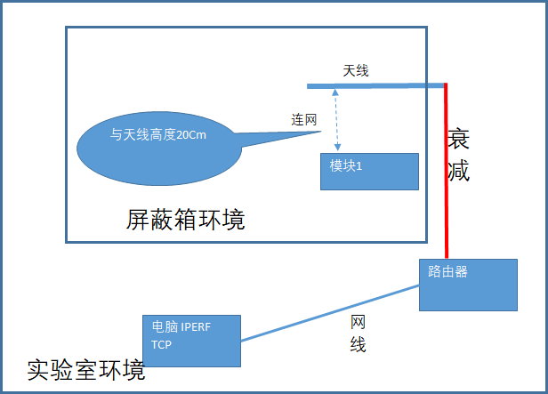

**ASR透传芯片RVR测试说明**
==========================

前言
----

**关于本文档**

本文档主要提供 RVR 测试拓扑逻辑、衰减距离折算公式和衰减-距离折算表。

**读者对象**

本文档主要适用于以下工程师：

-  单板硬件开发工程师
-  软件工程师
-  技术支持工程师

**产品型号**

本文档适用于 ASR Wi-Fi/Wi-Fi+BLE Combo 数传类芯片。

**版权公告**

版权归 © 2022 翱捷科技股份有限公司所有。保留一切权利。未经翱捷科技股份有限公司的书面许可，不得以任何形式或手段复制、传播、转录、存储或翻译本文档的部分或所有内容。

**商标声明**

ASR、翱捷和其他翱捷商标均为翱捷科技股份有限公司的商标。

本文档提及的其他所有商标名称、商标和注册商标均属其各自所有人的财产，特此声明。

**免责声明**

翱捷科技股份有限公司对本文档内容不做任何形式的保证，并会对本文档内容或本文中介绍的产品进行不定期更新。

本文档仅作为使用指导，本文的所有内容不构成任何形式的担保。本文档中的信息如有变更，恕不另行通知。

本文档不负任何责任，包括使用本文档中的信息所产生的侵犯任何专有权行为的责任。

**防静电警告**

静电放电（ESD）可能会损坏本产品。使用本产品进行操作时，须小心进行静电防护，避免静电损坏产品。

**翱捷科技股份有限公司**

地址：上海市浦东新区科苑路 399 号张江创新园 10 号楼 9 楼 邮编：201203

官网： http://www.asrmicro.com/

**文档修订历史**

======= ====== ==========
日期    版本号 发布说明
======= ====== ==========
2022.08 V1.0.0 首次发布。
======= ====== ==========

1. RVR测试拓扑逻辑
------------------

|image1| 

2. 衰减距离折算
---------------

衰减对应的距离，可以参考如下公式进行折算：

折算距离=1000*10^((衰减值 -32.44-20*LOG(2412))/20)

衰减与距离的折算查表，可以参考下表：

|image2| 

.. |image2| image:: ../../img/550X_RVR/图2-2.png
