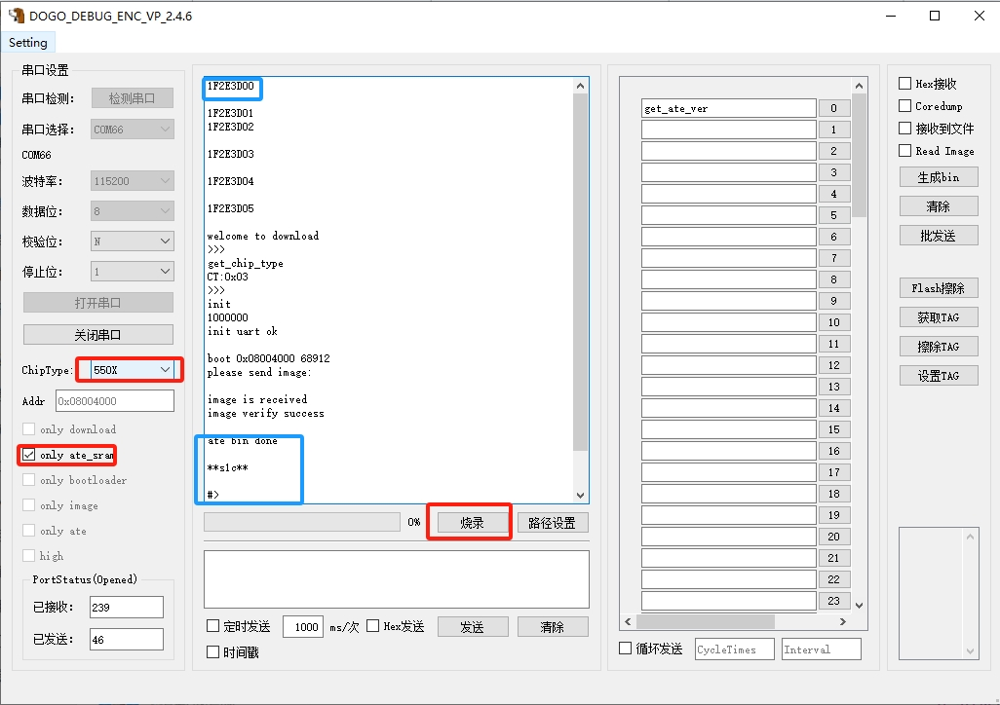

ASR 透传系列使用 DOGO 工具烧录 ate_sram 说明
=======================================

前言
----

**关于本文档**

本文档旨在介绍如何使用 DOGO 工具烧录 ate_sram。

**读者对象**

本文档主要适用于以下工程师：

-  单板硬件开发工程师
-  软件工程师
-  技术支持工程师

**产品型号**

本文档适用于 ASR 透传类芯片（ASR553X、ASR5505S、ASR5825S 和 ASR5955S）。

**版权公告**

版权归 © 2023 翱捷科技股份有限公司所有。保留一切权利。未经翱捷科技股份有限公司的书面许可，不得以任何形式或手段复制、传播、转录、存储或翻译本文档的部分或所有内容。

**商标声明**

ASR、翱捷和其他翱捷商标均为翱捷科技股份有限公司的商标。

本文档提及的其他所有商标名称、商标和注册商标均属其各自所有人的财产，特此声明。

**免责声明**

翱捷科技股份有限公司对本文档内容不做任何形式的保证，并会对本文档内容或本文中介绍的产品进行不定期更新。

本文档仅作为使用指导，本文的所有内容不构成任何形式的担保。本文档中的信息如有变更，恕不另行通知。

本文档不负任何责任，包括使用本文档中的信息所产生的侵犯任何专有权行为的责任。

**防静电警告**

静电放电（ESD）可能会损坏本产品。使用本产品进行操作时，须小心进行静电防护，避免静电损坏产品。

**翱捷科技股份有限公司**

地址：上海市浦东新区科苑路399号张江创新园10号楼9楼 邮编：201203

官网： http://www.asrmicro.com/

**文档修订历史**

======= ====== ==========
日期    版本号 发布说明
======= ====== ==========
2023.11 V1.0.0 首次发布。
======= ====== ==========

1. 烧录步骤
-----------

该功能支持ASR透传类芯片（ASR553X、ASR5505S、ASR5825S 和 ASR5955S）。其中 ASR5825S 需要 DOGO_VP2.0.6 及以上版本支持。

烧录步骤如下：

1. 将 ate_sram 的 bin 文件放置在 ate_bin_dir 目录下，如需更名，需要保留 ate 字样，如重命名为 ate_sram_v1.8.5.bin。

.. attention::
    ate_bin_dir 文件夹不可重命名，且一次只能存放一个 ate 文件。 

2. 打开工具，按照下列步骤进行：

(1) 勾选“only ate_sram”，选择 ChipType 芯片类型，支持“550X”、“582X”、“553X”和“595X”

(2) 板子复位（注意 SEL1 跳线，进入烧录模式），出现“1F2E3D00”后，点击“烧录”

(3) 出现“#>”后，表示烧录完成

(4) 发送“get_ate_ver”，出现“ASR_ATE_VERSION_V1.8.5”表示已处于 ATE 模式，可以继续进行测试。

.. attention::
    测试过程不要掉电。

|image1|

|image2|

|image3|

|image4|

.. |image2| image:: ../../img/550X_使用DOGO烧录ATE/表1-2..png
.. |image3| image:: ../../img/550X_使用DOGO烧录ATE/表1-3.png
.. |image4| image:: ../../img/550X_使用DOGO烧录ATE/表1-4.png