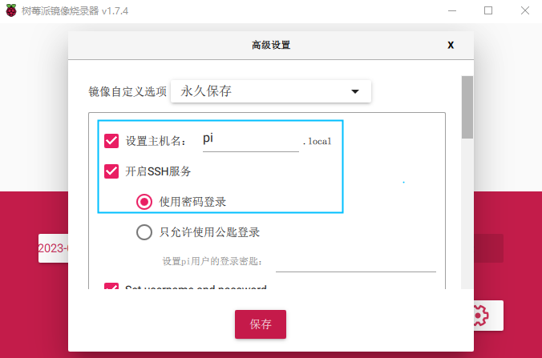
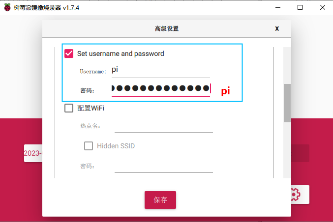
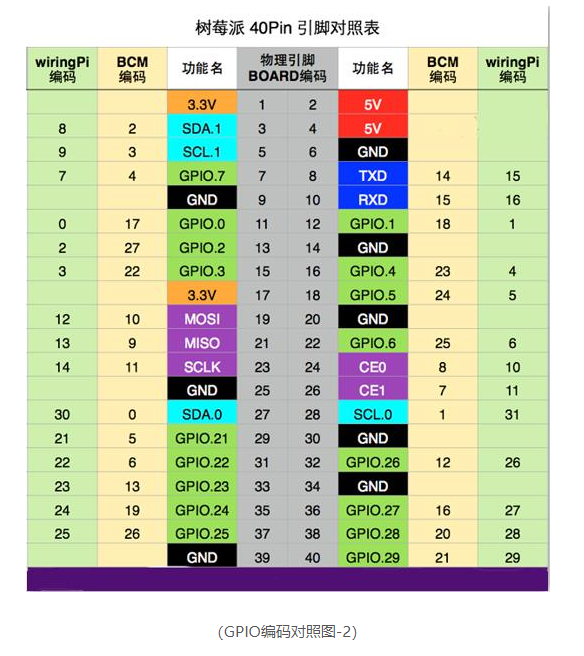
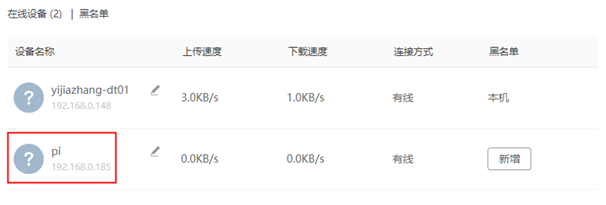
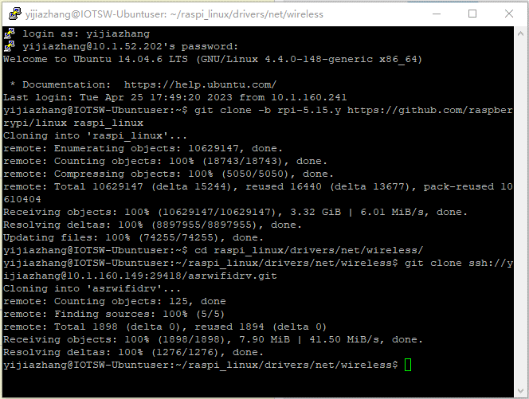
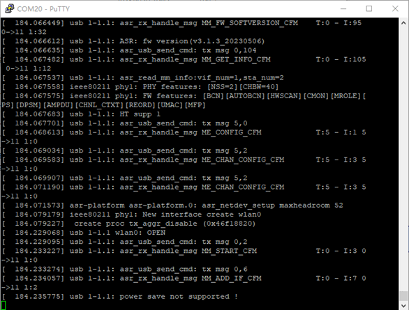
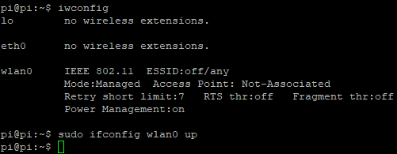
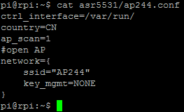
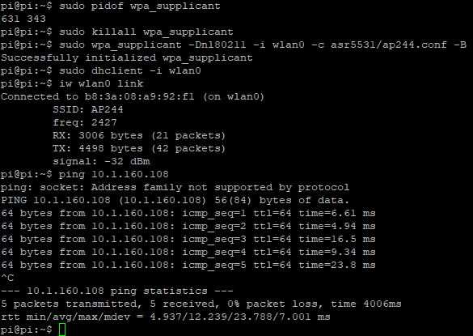

ASR 透传系列树莓派环境搭建指南
==============================

前言
----

**关于本文档**

本文档旨在提供适用于 ASR 透传类芯片的树莓派环境搭建指南。

**读者对象**

本文档主要适用于以下工程师：

-  单板硬件开发工程师
-  软件工程师
-  技术支持工程师

**产品型号**

本文档适用于 ASR 透传类芯片（ASR553X、ASR5505S、ASR5825S 和 ASR5955S）。

**版权公告**

版权归 © 2023 翱捷科技股份有限公司所有。保留一切权利。未经翱捷科技股份有限公司的书面许可，不得以任何形式或手段复制、传播、转录、存储或翻译本文档的部分或所有内容。

**商标声明**

ASR、翱捷和其他翱捷商标均为翱捷科技股份有限公司的商标。

本文档提及的其他所有商标名称、商标和注册商标均属其各自所有人的财产，特此声明。

**免责声明**

翱捷科技股份有限公司对本文档内容不做任何形式的保证，并会对本文档内容或本文中介绍的产品进行不定期更新。

本文档仅作为使用指导，本文的所有内容不构成任何形式的担保。本文档中的信息如有变更，恕不另行通知。

本文档不负任何责任，包括使用本文档中的信息所产生的侵犯任何专有权行为的责任。

**防静电警告**

静电放电（ESD）可能会损坏本产品。使用本产品进行操作时，须小心进行静电防护，避免静电损坏产品。

**翱捷科技股份有限公司**

地址：上海市浦东新区科苑路399号张江创新园10号楼9楼 邮编：201203

官网： http://www.asrmicro.com/

**文档修订历史**

======= ====== ==========
日期    版本号 发布说明
======= ====== ==========
2023.08 V1.0.0 首次发布。
======= ====== ==========

搭建步骤
-------

1.1 下载烧录器 Raspberry Pi Imager
~~~~~~~~~~~~~~~~~~~~~~~~~~~~~~~~~

下载连接：https://www.raspberrypi.com/software/

1.2 下载镜像 Raspberry Pi OS (64-bit)
~~~~~~~~~~~~~~~~~~~~~~~~~~~~~~~~~~~~

下载链接：https://www.raspberrypi.com/software/operating-systems/ 我们不需要桌面，选择轻量级的镜像 Raspberry Pi OS Lite 即可。

1.3 烧录镜像
~~~~~~~~~~~~

1. 把 SD卡（TF 卡）插入 PC（可以使用 USB 读卡器），打开烧录器 Raspberry Pi Imager

2. 选择下载的镜像，例如 2023-02-21-raspios-bullseye-arm64-lite.img.xz，并选择插入的 SD 卡盘符

3. 点击设置按钮，设置主机名称，开启 SSH 服务，并选择使用密码登录，设置登录用户名和密码，图中示例使用的是 username：pi，密码：pi，不启用树莓派自带的 Wi-Fi

|image1|

|image2|

4. 点击烧录，开始烧录镜像到 SD卡，等待烧录完成后，SD 会被分成两个逻辑分区，一个是 boot 分区，另一个是文件系统（此时如果 PC 提示是否格式化选择否，否则会格式化文件系统分区）

1.4 使用串口连接树莓派
~~~~~~~~~~~~~~~~~~~~~~

1. 在 PC 上进入 /boot/config.txt，找到 enable_uart=1 的配置语句，如果没有可以把这个配置语句添加到文件的最后，保存后退出配置文件

2. 使用 USB 转串口线把树莓派的串口连接到 PC上，根据下面的 Pin 对照表，USB 转串口的 TXD 连接树莓派的 Pin10 (RXD)，RXD连接树莓派的 Pin8 (TXD)，GND 连接树莓派的任意一个 GND Pin

|image3|

3. PC 上可以使用 PuTTY 等工具打开 USB 转串口的 COM 口，PuTTY 工具 Connection type 选择 Serial，Serial line 输入串口号，Speed 输入 115200，Flow control 选择 None，点击 Open

4. 把刚才烧录好镜像的 SD 卡插入树莓派，上电启动树莓派，启动成功后输入之前烧录镜像配置的 username 和 password，就可以进入串口终端

1.5 使用 SSH 连接树莓派
~~~~~~~~~~~~~~~~~~~~~

1. 使用网线连接树莓派和路由器

2. 打开路由器后台管理页面查看树莓派的 IP 地址

|image4|

3. 可以使用 PuTTY 等工具通过 SSH 登录树莓派，PuTTY 工具选择 SSH，Host Name 输入树莓派 IP 地址，点击 Open

4. 第一次会看到一个警告，点击 Accept，输入 username 和 password 即可登录

1.6 代码下载、配置和编译
~~~~~~~~~~~~~~~~~~~~~~~~

1.  用户登录自己的 Linux 服务器/台式机，准备下载代码；或者使用 FAE 提供的 Docker 镜像。

|image5|

2.  把树莓派 kernel 源码下载到 raspi_linux 目录下

    git clone -b rpi-5.15.y https://github.com/raspberrypi/linux raspi_linux

3.  从 ASR FAE 获取 asrwifidrv 源码，放置到 raspi_linux/drivers/net/wireless 目录下

4.  修改 wireless 目录下的 Kconfig（可以使用 vi/vim 进行编辑）

    vim Kconfig

    添加如下内容

    source “drivers/net/wireless/asrwifidrv/Kconfig”

5.  修改 wireless 目录下的 Makefile

    vim Makefile

    添加如下内容

    obj-$(CONFIG_WLAN_VENDOR_ASR) += asrwifidrv/

    （需要将 CONFIG_WLAN_VENDOR_ASR 配置在客户的 .config 文件中）

6.  可以通过编辑 asrwifidrv/Makefile 来配置编译不同的驱动，也可以通过 defconfig（推荐使用 menuconfig）

    Ø ASR5532U 需要在 asrwifidrv/Makefile 里设置如下

    CONFIG_NOT_USED_DTS = y

    CONFIG_ASR5531 ?= m

    CONFIG_ASR_USB ?= y

    CONFIG_ASR_SAE=y

    CONFIG_ASR_DBG=y

    CONFIG_ASR_KEY_DBG=y

    CONFIG_PLATFORM_RASPI_AARCH64 = y

    Ø ASR5532S 需要在 asrwifidrv/Makefile 里设置如下

    CONFIG_NOT_USED_DTS = y

    CONFIG_ASR5531 ?= m

    CONFIG_ASR_SDIO ?= y

    CONFIG_ASR_SAE=y

    CONFIG_ASR_DBG=y

    CONFIG_ASR_KEY_DBG=y

    CONFIG_PLATFORM_RASPI_AARCH64 = y

    Ø ASR5505S 需要在 asrwifidrv/Makefile 里设置如下

    CONFIG_NOT_USED_DTS=y

    CONFIG_ASR5505=m

    CONFIG_ASR_SDIO=y

    CONFIG_ASR_SAE=y

    CONFIG_ASR_DBG=y

    CONFIG_ASR_KEY_DBG=y

    CONFIG_PLATFORM_RASPI_AARCH64 = y

    Ø ASR5825S 需要在 asrwifidrv/Makefile 里设置如下

    CONFIG_NOT_USED_DTS=y

    CONFIG_ASR5825=m

    CONFIG_ASR_SDIO=y

    CONFIG_ASR_SAE=y

    CONFIG_ASR_DBG=y

    CONFIG_ASR_KEY_DBG=y

    CONFIG_PLATFORM_RASPI_AARCH64 = y

    Ø ASR5955S 需要在 asrwifidrv/Makefile 里设置如下

    CONFIG_NOT_USED_DTS = y

    CONFIG_ASR595X ?= m

    CONFIG_ASR_SDIO ?= y

    CONFIG_ASR_SAE=y

    CONFIG_ASR_DBG=y

    CONFIG_ASR_KEY_DBG=y

    CONFIG_PLATFORM_RASPI_AARCH64 = y

7.  运行 Docker

    docker run -itu0 –rm –name yijiazhang –privileged=true –net=host -v /home/yijiazhang/raspi_linux:/root/kernel kernel_raspi:v1 /bin/bash

8.  通过 menuconfig 配置需要编译的驱动，如果之前已经配置可以忽略此步骤。以编译 ASR5532U Wi-Fi 驱动为例：

    KERNEL=kernel8;make ARCH=arm64 CROSS_COMPILE=aarch64-linux-gnu- menuconfig

    进入 Device Drivers->Network device support->Wireless LAN->Asr Wireless Modules，选择 ASR 5531 USB SDIO Wi-Fi

9.  输入以下命令编译 kernel：

    KERNEL=kernel8;make ARCH=arm64 CROSS_COMPILE=aarch64-linux-gnu- bcm2711_defconfig

    KERNEL=kernel8;make ARCH=arm64 CROSS_COMPILE=aarch64-linux-gnu- -j$(nproc) Image modules dtbs

10. 编译完成后，需要使用的目标文件如下：

    arch/arm64/boot/Image

    net/wireless/cfg80211.ko

    net/rfkill/rfkill.ko

    drivers/net/wireless/asrwifidrv/asr5531.ko

    drivers/net/wireless/asrwifidrv/fw_bin/fmacfw_asr5531_usb.bin

1.7 上传目标文件至树莓派的文件系统
~~~~~~~~~~~~~~~~~~~~~~~~~~~~~~~~~~

1. 可以使用以下两种方式把目标文件上传到树莓派的文件系统中（以 ASR5532 为例）

-  **使用 SSH 把目标文件上传到树莓派 asr5532 目录（使用网线连接树莓派和路由器的情况下可以实现）**

   比如 PC 在 E 盘新建一个目录 asr5532，把目标文件复制到 asr5532 目录下，树莓派上电启动后，PC 按 Win+R 输入 cmd 打开命令控制窗口，输入：

   scp -r E::raw-latex:`\asr5532` pi@192.168.0.185:/home/pi/asr5532

   或者右击打开“Git Bash Here”，输入：

   scp -r /e/asr5532 pi@192.168.0.185:/home/pi/asr5532

   输入密码 pi 即可上传

-  **手动复制到树莓派 asr5532 目录**

把树莓派的 SD 卡插入到 PC，在 boot 分区新建一个目录 asr5532，把目标文件复制到 /boot/asr5532 目录下，然后把 SD 卡插入到树莓派中，树莓派上电启动进入串口终端把 /boot/asr5532 中的目标文件复制到 ~/asr5532 目录中：cp -r /boot/asr5532/ asr5532

2. 替换 kernel

   sudo cp asr5532/Image /boot/kernel8.img

3. 把固件复制到 /lib/firmware 目录下，供驱动检测到插入开发板之后烧录固件使用

   sudo cp asr5532/fmacfw_asr5532_usb.bin /lib/firmware/

4. 重启树莓派

   sudo reboot

5. 启动成功后 insmod 驱动

   sudo insmod asr5532/rfkill.ko

   sudo insmod asr5532/cfg80211.ko

   sudo insmod asr5532/asr5532.ko

1.8 插入 5532 开发板
~~~~~~~~~~~~~~~~~~

使用 dmesg -w 可以查看到如下日志，说明 ASR5532 的固件下载成功并且正常运行。

|image6|

SSH 和串口都有登录到树莓派，一个窗口用来实时查看日志，另一个窗口用来敲命令。

1.9 连接 AP
~~~~~~~~~~

1. 查看 wlan 设备名称，如下图所示，wlan 的名称是 wlan0

   Iwconfig

|image7|

2. 启动 wlan0

   sudo ifconfig wlan0 up

|image8|

3. 添加 open AP 信息的配置文件，文件内容如下图所示

   cat > asr5531/ap244.conf

4. 通过 wpa_supplicant 连接 AP

   在使用 wpa_supplicant 之前检查 wpa_supplicant 进程是否已经存在

   sudo pidof wpa_supplicant

   如果可以查找到 pid，kill 掉 wpa_supplicant 进程

   sudo killall wpa_supplicant

   连接 AP

   sudo wpa_supplicant -Dnl80211 -i wlan0 -c asr5531/ap244.conf –B

5. 使用 dhclient 获取 ip

   sudo dhclient -i wlan0

6. 查看连接状态

   iw wlan0 link

7. 使用 ping 命令确认连接

|image9|

