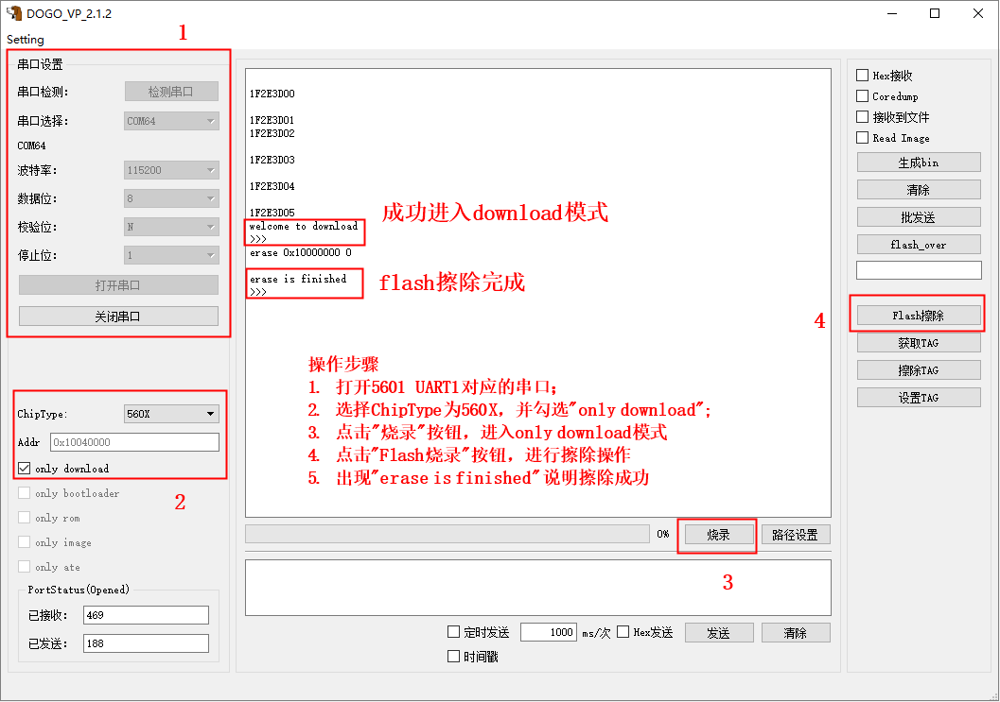

.. role:: raw-latex(raw)
   :format: latex
..

ASR560X 系列常见问题
====================

前言
----

**关于本文档**

本文介绍 ASR560X 系列蓝牙 SoC 芯片开发过程中的常见问题以及解答。

**产品型号**

本文档适用于 ASR IoT 蓝牙芯片（560X 系列）。

+---------+----------------------------------------------------------------------------------------+----------+--------------+---------------------------------------------------------------------------------+
| 型号    | 协议                                                                                   | 内核     | SiP Flash    | 功能                                                                            |
+=========+========================================================================================+==========+==============+=================================================================================+
| ASR560X | BLE 5.1 full feature (compatible with 5.2)/BLE SIG Mesh/IEEE 802.15.4/2.4G Proprietary | ARM CM0+ | 1 MB/ 512 KB | AOA/AOD/Voice/IRTxRx/Quadrature Decoder/Keypad/5V UART/5V GPIO/Wi-Fi concurrent |
+---------+----------------------------------------------------------------------------------------+----------+--------------+---------------------------------------------------------------------------------+

**版权公告**

版权归 © 2022 翱捷科技股份有限公司所有。保留一切权利。未经翱捷科技股份有限公司的书面许可，不得以任何形式或手段复制、传播、转录、存储或翻译本文档的部分或所有内容。

**商标声明**

ASR、翱捷和其他翱捷商标均为翱捷科技股份有限公司的商标。

本文档提及的其他所有商标名称、商标和注册商标均属其各自所有人的财产，特此声明。

**免责声明**

翱捷科技股份有限公司对本文档内容不做任何形式的保证，并会对本文档内容或本文中介绍的产品进行不定期更新。

本文档仅作为使用指导，本文的所有内容不构成任何形式的担保。本文档中的信息如有变更，恕不另行通知。

本文档不负任何责任，包括使用本文档中的信息所产生的侵犯任何专有权行为的责任。

**文档版本**

======== ========== =================
**日期** **版本号** **发布说明**
======== ========== =================
2022.06  V1.3.0     增加了第 8.9 节。
======== ========== =================

1. 工具
----------------------------

1.1 如何下载固件到开发板上？
~~~~~~~~~~~~~~~~~~~~~~~~~~~~~~~~~~~~~~~~~~~~~~~~~~~~~~~~~~~~~~~~~~~~~~~

请参考 `《ASR560X 系列_开发板用户指南》 <https://pan.baidu.com/s/1_moqlSVzUVOsJeCIJ6DBsw?pwd=1234>`_。 本文红色加粗的地方是为网络版设置的，实际无需加粗，且注意修改参考文档的最终名称。

1.2 下载时出现 “1F2E3D81” 是什么原因？
~~~~~~~~~~~~~~~~~~~~~~~~~~~~~~~~~~~~~~~~~~~~~~~~~~~~~~~~~~~~~~~~~~~~~~~

该字符串表示通讯异常。需要检查串口硬件连接以及上位机工具是否正常工作。

1.3 是否需要烧录 ATE 固件？
~~~~~~~~~~~~~~~~~~~~~~~~~~~~~~~~~~~~~~~~~~~~~~~~~~~~~~~~~~~~~~~~~~~~~~~

正常只需要烧录 BOOTLOAD/ROM/APP 固件即可，不需要烧录 ATE 固件。

1.4 如果只更新了 APP 固件，是否可以单独烧录 APP 固件？
~~~~~~~~~~~~~~~~~~~~~~~~~~~~~~~~~~~~~~~~~~~~~~~~~~~~~~~~~~~~~~~~~~~~~~~

可以的。此情况可以在 DOGO 工具上勾选 **only image** 单选框，然后执行烧录。这样可以单独烧录 APP 固件。

1.5 如何整片擦除芯片内部的 Flash？
~~~~~~~~~~~~~~~~~~~~~~~~~~~~~~~~~~~~~~~~~~~~~~~~~~~~~~~~~~~~~~~~~~~~~~~

可以使用 DOGO 工具擦除 Flash。参考下图中的操作步骤：

.. raw:: html

   

|image1|

.. raw:: html

   

2. 开发环境搭建
----------------------------

2.1 是否支持使用 Keil 环境进行开发、编译、调试？
~~~~~~~~~~~~~~~~~~~~~~~~~~~~~~~~~~~~~~~~~~~~~~~~~~~~~~~~~~~~~~~~~~~~~~~

支持。具体请参考文档 `《ASR560X 系列_开发环境搭建与编译指南》 <https://pan.baidu.com/s/10hRgoKiXazJsjiEDhGuOEQ?pwd=1234>`_。

2.2 是否支持 Linux 环境下开发编译？
~~~~~~~~~~~~~~~~~~~~~~~~~~~~~~~~~~~~~~~~~~~~~~~~~~~~~~~~~~~~~~~~~~~~~~~

支持 Linux 开发环境进行编译，具体环境配置请参考文档 `《ASR560X 系列_开发环境搭建与编译指南》 <https://pan.baidu.com/s/10hRgoKiXazJsjiEDhGuOEQ?pwd=1234>`_。

2.3 是否支持使用其他版本的交叉编译工具？
~~~~~~~~~~~~~~~~~~~~~~~~~~~~~~~~~~~~~~~~~~~~~~~~~~~~~~~~~~~~~~~~~~~~~~~

**不支持**\ ，\ **Windows** 环境下，\ **必须**\ 使用 SDK tools/toolchain 目录下的 **gcc-arm-none-eabi-5_4-2016q3-20160926** 版本。\ **Linux** 环境下的交叉编译工具请通过 https://launchpad.net/gcc-arm-embedded/5.0/5-2016-q3-update/+download/gcc-arm-none-eabi-5_4-2016q3-20160926-linux.tar.bz2 下载。

3. 平台
----------------------------

3.1 芯片内置的 Flash Layout 是怎样划分的？
~~~~~~~~~~~~~~~~~~~~~~~~~~~~~~~~~~~~~~~~~~~~~~~~~~~~~~~~~~~~~~~~~~~~~~~

\1. 参考《ASR560X 系列_开发入门指南》3.1 Flash 章节；

\2. 参考 SDK 中 sonata_board.c 文件中的定义。

3.2 芯片内置的 Flash 是否可以给用户使用？
~~~~~~~~~~~~~~~~~~~~~~~~~~~~~~~~~~~~~~~~~~~~~~~~~~~~~~~~~~~~~~~~~~~~~~~

在不开启 SYSTEM_COREDUMP 宏的情况下，可以使用 COREDUMP_START_ADDR 开始地址的 4KB 空间。

3.3 看门狗的使用方法?
~~~~~~~~~~~~~~~~~~~~~~~~~~~~~~~~~~~~~~~~~~~~~~~~~~~~~~~~~~~~~~~~~~~~~~~

\1. 低功耗状态下看门狗会被断电，所以无法使用。

\2. 驱动默认\ **会在 watchdog 中断里喂狗**\ 。如需关闭此功能，需在 watchdog 初始化之后，使用 NVIC_DisableIRQ() API 关闭看门狗中断。

\3. 建议在 main.c 的 while 循环中进行喂狗动作。

3.4 调用什么 API 可以让系统主动重启？
~~~~~~~~~~~~~~~~~~~~~~~~~~~~~~~~~~~~~~~~~~~~~~~~~~~~~~~~~~~~~~~~~~~~~~~

可以使用 NVIC_SystemReset()。

3.5 软件定时器（app_timer）跟硬件定时器的区别？
~~~~~~~~~~~~~~~~~~~~~~~~~~~~~~~~~~~~~~~~~~~~~~~~~~~~~~~~~~~~~~~~~~~~~~~

\1. 硬件定时器的时钟源是高频时钟，有单独的硬件控制器并支持中断触发，支持 μs 级定时；

\2. 软件定时器的时钟源是低频 32K 时钟，由协议栈提供，不支持中断只能使用协议栈调度的方式触发，支持 ms 级定时；

\3. 硬件定时器不支持低功耗状态下定时唤醒功能；

\4. 软件定时器支持低功耗状态下定时唤醒功能，适用于打开低功耗场景下的定时任务调度。

3.6 MAC 地址使用的规则以及对应的读写 API？
~~~~~~~~~~~~~~~~~~~~~~~~~~~~~~~~~~~~~~~~~~~~~~~~~~~~~~~~~~~~~~~~~~~~~~~

默认 MAC 地址的使用规则如下：

\1. 如果 EFUSE 中有写入 MAC 地址，则使用 EFUSE 中的 MAC 地址；

\2. 如果 EFUSE 中没有写入 MAC 地址，NVDS 中有写入，则使用 NVDS 中的 MAC 地址；

\3. 如果 EFUSE&NVDS 中都没有写入 MAC 地址，协议栈将产生一个静态随机地址，并将该地址只写入 NVDS 区域。后续协议栈也将使用此地址；

\4. 读写 API 分别是 sonata_get_bt_address() 和 sonata_set_bt_address()；

\5. sonata_set_bt_address() 用于将 MAC 地址写入至 NVDS 区域。

.. note:: EFUSE 和 NVDS 的读取优先级可以进行调整，具体请参考 sonata_hl_beacon_rel demo app.c 文件的 app_config()、ble_user_addr_callbacks() 中的处理。

3.7 外设工程如何配置时钟？
~~~~~~~~~~~~~~~~~~~~~~~~~~~~~~~~~~~~~~~~~~~~~~~~~~~~~~~~~~~~~~~~~~~~~~~

使用 sys_clk_cfg(DIG_SEL_DPLL_64M) API 将主频提升至 64M。

3.8 PWM 输入/输出模式注意事项？
~~~~~~~~~~~~~~~~~~~~~~~~~~~~~~~~~~~~~~~~~~~~~~~~~~~~~~~~~~~~~~~~~~~~~~~

CAPn、PWM2n 和 PWM2n+1 为同一个发生器，所以 CAPn、PWM2n 和 PWM2n+1 会相互影响：同一个发生器 CAP 和 PWM 功能只能二选一，PWM 同一组只能有一个输出频率。

3.9 SPI 和 PWM 最大输出频率是多少？
~~~~~~~~~~~~~~~~~~~~~~~~~~~~~~~~~~~~~~~~~~~~~~~~~~~~~~~~~~~~~~~~~~~~~~~

\1. SPI MASTER 最大输出是 CLK/2，建议不超过 16M。

\2. PWM 最大是 CLK/3，建议不超过 5M。

3.10 ADC 通道数量、量程、分辨率是多少？
~~~~~~~~~~~~~~~~~~~~~~~~~~~~~~~~~~~~~~~~~~~~~~~~~~~~~~~~~~~~~~~~~~~~~~~

\1. QFN32 封装有 5 个 ADC 通道，通道 0~4 分别对应 P06-P10。

\2. QFN48 封装有 8 个 ADC 通道，通道 0~7 分别对应 P06-P13。

\3. ADC 量程是 1.2V，所以待采样的电压必须小于 1.2V。

\4. ADC 分辨率为 12-bit。

4. 协议栈
----------------------------

4.1 API 使用问题
~~~~~~~~~~~~~~~~~~~~~~~~~~~~~~~~~~~~~~~~~~~~~~~~~~~~~~~~~~~~~~~~~~~~~~~

4.1.1 sonata_api_app_timer_set()/sonata_api_app_timer_clear() API 使用的注意事项？
^^^^^^^^^^^^^^^^^^^^^^^^^^^^^^^^^^^^^^^^^^^^^^^^^^^^^^^^^^^^^^^^^^^^^^^^^^^^^^^^^^^^^^^^^^

\1. 此 API 需要在 SONATA_GAP_CMP_BLE_ON 之后才能使用。

\2. 用户自定义的 timer_id 不能出现重复且需要大于 40。

.. note:: SDK 1.5.0 之后的版本，内部已做偏移处理，自定义 timer_id 不再强制要求大于 40。

\3. delay 参数的单位是 ms。

\4. 使用此 API 之前，需要先使用 sonata_api_register_app_timer_callback() API 注册 timeout 回调函数。

\5. timeout 回调函数中不能执行耗时任务，需要快进快出。

\6. 低功耗状态下可以使用该 API 实现定时唤醒并执行 task（需要配置唤醒源为 BLE_TIMER）。

\7. 从休眠唤醒后，如需调用此 API，须在 sleep init 的 app_after_ble_wkup_cb() 回调中调用。

4.1.2 sonata_fs_write() API 一次最多能写多少 Bytes 数据？写入的数据是放在 NVDS 区吗？
^^^^^^^^^^^^^^^^^^^^^^^^^^^^^^^^^^^^^^^^^^^^^^^^^^^^^^^^^^^^^^^^^^^^^^^^^^^^^^^^^^^^^^^^^^

\1. sonata_fs_write() API length 参数的类型是 uint8_t，所以最大长度是 255。

\2. 写入的数据放在 NVDS 区域。

\3. 使用此 API 时需要自己定义 tag，tag 必须大于等于 APP_DATA_SAVE_TAG_FIRST 并小于 APP_DATA_SAVE_TAG_LAST。

4.1.3 sonata_api_app_msg_register() API 可注册 msg 最大数量是多少？
^^^^^^^^^^^^^^^^^^^^^^^^^^^^^^^^^^^^^^^^^^^^^^^^^^^^^^^^^^^^^^^^^^^^^^^^^^^^^^^^^^^^^^^^^^

\1. msg 最大数量是 31 个，msg 参数是一个 ID 和一个函数指针。

\2. 使用 sonata_api_send_app_msg() API 触发并进入到 ID 对应的函数。

\3. 回调函数中不能执行耗时任务，需要快进快出。

4.1.4 sonata_ble_prevent_sleep_set()/ sonata_ble_prevent_sleep_clear() 的用法？
^^^^^^^^^^^^^^^^^^^^^^^^^^^^^^^^^^^^^^^^^^^^^^^^^^^^^^^^^^^^^^^^^^^^^^^^^^^^^^^^^^^^^^^^^^

\1. sonata_ble_prevent_sleep_set() 用于设置一个标识位，阻止系统进入休眠；

\2. sonata_ble_prevent_sleep_clear() 用于清除一个标识位；

\3. 当所有的标识位都被清除后，系统将允许进入休眠；

\4. 用户需要自定义对应的 prv_slp_bit，用于不同的应用逻辑/模块是否允许进入休眠。

4.1.5 sonata_get_sys_time() API 的用法？
^^^^^^^^^^^^^^^^^^^^^^^^^^^^^^^^^^^^^^^^^^^^^^^^^^^^^^^^^^^^^^^^^^^^^^^^^^^^^^^^^^^^^^^^^^

\1. 用于获取从系统启动到当前时刻的 ble tick;

\2. 时间单位是 0.3125ms;

\3. 进入到 DS4 后不会影响到这个 API 的计时；

\4. 返回的最大值是 0xFFF FFFF（28 位）。

4.1.6 sonata_ble_gap_set_white_list() API 只能设置一个吗？多次调用的时候，是否会将前一次设置的给替换掉？
^^^^^^^^^^^^^^^^^^^^^^^^^^^^^^^^^^^^^^^^^^^^^^^^^^^^^^^^^^^^^^^^^^^^^^^^^^^^^^^^^^^^^^^^^^

\1. 需要一次将所有地址都设置进来，多次调用只会使用最后一次设置的内容。

\2. 设置地址的个数根据 size 来决定。

4.1.7 协议栈默认的发射功率是多少？是否支持调整发射功率？
^^^^^^^^^^^^^^^^^^^^^^^^^^^^^^^^^^^^^^^^^^^^^^^^^^^^^^^^^^^^^^^^^^^^^^^^^^^^^^^^^^^^^^^^^^

\1. 默认发射功率为 0dBm。

\2. 可以使用 sonata_ll_set_txpwr() API 调整发射功率。

\3. sonata_ll_set_txpwr() API 需要在 SONATA_GAP_CMP_BLE_ON 之后调用。

4.1.8 GATT Indication 处理流程是怎样的？
^^^^^^^^^^^^^^^^^^^^^^^^^^^^^^^^^^^^^^^^^^^^^^^^^^^^^^^^^^^^^^^^^^^^^^^^^^^^^^^^^^^^^^^^^^

\1. **Central** 打开 Indication 处理流程：使用 sonata_ble_gatt_write() 往对应的 handle 写 0x02。

\2. **Peripheral** 处理流程：进入 ble_gatt_callback->gatt_write_req() 回调函数，在回调函数中需要使用 sonata_ble_gatt_send_write_confirm() 发出 confirm。如果 **Peripheral** 不发出 confirm，超时后 **Central** 端会收到 SONATA_GATT_CMP_WRITE 事件，并且 status=0x45(SONATA_GAP_ERR_TIMEOUT)。

\3. **Peripheral** 通过 Indication 发出数据流程：使用 sonata_ble_gatt_send_indicate_event() API，发送成功或者超时后收到 SONATA_GATT_CMP_INDICATE 事件。

\4. **Central** 接收 Indication 数据流程：进入 ble_gatt_callback->gatt_event_req() 回调函数，收到的数据在这里处理。\ **Central** 需要通过 sonata_ble_gatt_send_event_confirm() API 发回 confirm。如果 **Central** 收到 Indication 后不回复 confirm，\ **Peripheral** 会在一段时间后收到 SONATA_GATT_CMP_INDICATE 事件，并且 status=0x45(SONATA_GAP_ERR_TIMEOUT)。

4.1.9 GATT Notification 处理流程是怎样的？
^^^^^^^^^^^^^^^^^^^^^^^^^^^^^^^^^^^^^^^^^^^^^^^^^^^^^^^^^^^^^^^^^^^^^^^^^^^^^^^^^^^^^^^^^^

\1. **Central** 打开 Notification 处理流程：使用 sonata_ble_gatt_write() 往对应的 handle 写 0x01。

\2. **Peripheral** 处理流程：进入 ble_gatt_callback->gatt_write_req() 回调函数，在回调函数中需要使用 sonata_ble_gatt_send_write_confirm() 发出 confirm。如果  **Peripheral** 不发出 confirm，超时后 **Central** 端会收到 SONATA_GATT_CMP_WRITE 事件，并且 status=0x45(SONATA_GAP_ERR_TIMEOUT)。

\3. **Peripheral** 通过 Notification 发送数据流程：使用 sonata_ble_gatt_send_notify_event() API，发送完成后收到 SONATA_GATT_CMP_NOTIFY 事件。

\4. **Central** 接收 Notification 数据流程：进入 ble_gatt_callback->gatt_event() 回调，收到的数据在这里解析，**Central** 不需要回复 confirm。

4.1.10 Central 调用 sonata_ble_gatt_write()/sonata_ble_gatt_write_no_response() API，Peripheral 会进入到哪个回调函数中？
^^^^^^^^^^^^^^^^^^^^^^^^^^^^^^^^^^^^^^^^^^^^^^^^^^^^^^^^^^^^^^^^^^^^^^^^^^^^^^^^^^^^^^^^^^^^^^^^^^^^^^^^^^^^^^^^

\1. 如果 handle 的属性支持 write request(PWR_NA)：

 a) **Central** 调用 sonata_ble_gatt_write()，**Peripheral** 会进入到 ble_gatt_callback->gatt_write_req() 回调。

 b) **Central** 调用 sonata_ble_gatt_write_no_response()，**Peripheral** 不会有响应。

\2. 如果 handle 的属性支持 write command(PWC_NA)：

 a) **Central** 调用 sonata_ble_gatt_write()，**Peripheral** 会反馈错误。

 b) **Central** 调用 sonata_ble_gatt_write_no_response()，**Peripheral** 会进入到 ble_gatt_callback->gatt_write_req() 回调。

\3. 如果 handle 的属性同时支持 write request(PWR_NA)&write command(PWC_NA)：

 a) **Central** 调用 sonata_ble_gatt_write()，**Peripheral** 会进入到 ble_gatt_callback->gatt_write_req() 回调。

 b) **Central** 调用 sonata_ble_gatt_write_no_response，**Peripheral** 会进入到 ble_gatt_callback->gatt_write_req() 回调。

\4. 应用层需要使用 sonata_ble_gatt_send_write_confirm() API 给协议栈回复应用处理状态。

\5. 协议栈会根据处理状态以及 Attribute Opcode 区分是否需要发送 Response。

4.1.11 Central 如何使用 sonata_ble_gatt_write() 写入大于 ATT_MTU 长度的数据？
^^^^^^^^^^^^^^^^^^^^^^^^^^^^^^^^^^^^^^^^^^^^^^^^^^^^^^^^^^^^^^^^^^^^^^^^^^^^^^^^^^^^^^^^^^

\1. **Central** 调用 sonata_ble_gatt_write() API 写入大于 ATT_MTU 长度的数据，**Peripheral** 会进入到 ble_gatt_callback->gatt_att_info_req() 回调；

\2. gatt_att_info_req 回调中使用 sonata_ble_gatt_send_att_info_confirm() 发送 handle 对应 attribute 的长度；

\3. 接下来 **Central** 可以使用 sonata_ble_gatt_execute_write() 执行写入动作。

4.2 开发广播功能时可能会遇到的问题
~~~~~~~~~~~~~~~~~~~~~~~~~~~~~~~~~~~~~~~~~~~~~~~~~~~~~~~~~~~~~~~~~~~~~~~

4.2.1 sonata_ble_set_advertising_data() API 出现 SONATA_GAP_ERR_INVALID_PARAM 是什么原因？
^^^^^^^^^^^^^^^^^^^^^^^^^^^^^^^^^^^^^^^^^^^^^^^^^^^^^^^^^^^^^^^^^^^^^^^^^^^^^^^^^^^^^^^^^^

排查广播数据中是否包含 GAP_AD_TYPE_FLAGS。因为协议栈已自动加入了 Flags 数据，不需要额外再添加。

4.2.2 协议栈是否支持动态调整广播数据？
^^^^^^^^^^^^^^^^^^^^^^^^^^^^^^^^^^^^^^^^^^^^^^^^^^^^^^^^^^^^^^^^^^^^^^^^^^^^^^^^^^^^^^^^^^

支持的。在 start adv 后，可以使用 sonata_ble_set_advertising_data() 调整广播数据，设置后，数据马上生效。

4.2.3 协议栈是否支持同时（分时）发送多条广播？
^^^^^^^^^^^^^^^^^^^^^^^^^^^^^^^^^^^^^^^^^^^^^^^^^^^^^^^^^^^^^^^^^^^^^^^^^^^^^^^^^^^^^^^^^^

支持同时发送多条广播，但需要留意资源的使用情况，具体请参考 *SDK doc* 文件夹下的《ASR560X_内存布局配置应用示例》文档。使用流程如下：

\1. 配置广播参数：sonata_ble_config_legacy_advertising()；

\2. 获取对应的广播 id：app_ble_complete_event_handler()->SONATA_GAP_CMP_ADVERTISING_CONFIG->param；

\3. 根据广播 id(param)，设置广播数据：sonata_ble_set_advertising_data_byid()；

\4. 根据广播 id(param)，启动广播：sonata_ble_start_advertising_byid()；

\5. 收到 app_ble_complete_event_handler()->SONATA_GAP_CMP_ADVERTISING_START 之后执行第 1 步，启动新的广播。

4.2.4 扫描结果回调中 sonata_gap_ext_adv_report_ind_t 结构体的 info 内容是？
^^^^^^^^^^^^^^^^^^^^^^^^^^^^^^^^^^^^^^^^^^^^^^^^^^^^^^^^^^^^^^^^^^^^^^^^^^^^^^^^^^^^^^^^^^

\1. 3-6 bits 的值对应 sonata_gap_adv_report_info；

\2. 0-2 bits 的值对应 sonata_gap_adv_report_type。

4.3 Mesh demo 可以使用哪些 ROM？
~~~~~~~~~~~~~~~~~~~~~~~~~~~~~~~~~~~~~~~~~~~~~~~~~~~~~~~~~~~~~~~~~~~~~~~

\1. 每个 ROM 对应的 ACT、支持连接数、支持 profile 个数、可用内存等信息请参考 *SDK doc* 文件夹下的《ASR560X_内存布局配置应用示例》文档。

\2. Mesh demo 最少需要 4 个 ACT：1 个 scan、2 个 proxy adv、1 个不可连接的 adv。

4.4 定义服务时，max_len 参数协议栈是否有限制？
~~~~~~~~~~~~~~~~~~~~~~~~~~~~~~~~~~~~~~~~~~~~~~~~~~~~~~~~~~~~~~~~~~~~~~~

max_len 是 uint16_t 类型的数字，协议栈只是保存这个数字，并不分配空间，所以没有长度限制。

4.5 app_ble_complete_event_handler() 回调主要的功能？
~~~~~~~~~~~~~~~~~~~~~~~~~~~~~~~~~~~~~~~~~~~~~~~~~~~~~~~~~~~~~~~~~~~~~~~

\1. app_ble_complete_event_handler() 可以根据 opt_id 了解执行了什么指令，以及指令执行的状态（status）是什么。

\2. status 为 0 表示指令执行成功。

\3. 指令异常 status 的原因可以在 ble_api\\inc\\sonata_error_api.h 中获取。

4.6 SONATA_GATT_CMP_NOTIFY 的含义？
~~~~~~~~~~~~~~~~~~~~~~~~~~~~~~~~~~~~~~~~~~~~~~~~~~~~~~~~~~~~~~~~~~~~~~~

SONATA_GATT_CMP_NOTIFY 表示数据已在发送队列里并且 RF 确认可以发送这个数据。

4.7 主机发送 ATT_READ_BLOB_REQ，ASR560X 的处理行为是？
~~~~~~~~~~~~~~~~~~~~~~~~~~~~~~~~~~~~~~~~~~~~~~~~~~~~~~~~~~~~~~~~~~~~~~~

\1. ASR560X 协议栈会进到 gatt_read_req() 回调；

\2. 应用层只需要根据 handle 发送完整的值；

\3. 协议栈会自行处理 ATT_READ_BLOB_REQ 的 offset。

4.8 同时使用广播和扫描功能，应如何处理？
~~~~~~~~~~~~~~~~~~~~~~~~~~~~~~~~~~~~~~~~~~~~~~~~~~~~~~~~~~~~~~~~~~~~~~~

必须一个功能开启成功之后，再开启另一个功能。

以先开启广播，再开启扫描为例，流程如下：

\1. 在 app_ble_complete_event_handler()->SONATA_GAP_CMP_BLE_ON 中调用 sonata_ble_config_legacy_advertising() API 配置广播;

\2. sonata_ble_config_legacy_advertising() API 执行成功之后，会进入到 app_ble_complete_event_handler()-> SONATA_GAP_CMP_ADVERTISING_CONFIG，此时广播配置成功;

\3. 在 SONATA_GAP_CMP_ADVERTISING_CONFIG 流程中调用 sonata_ble_set_advertising_data() API 设置广播数据;

\4. sonata_ble_set_advertising_data() API 执行成功之后，会进入到 app_ble_complete_event_handler()->SONATA_GAP_CMP_SET_ADV_DATA，此时广播数据设置成功;

\5. 在 SONATA_GAP_CMP_SET_ADV_DATA 流程中调用 sonata_ble_start_advertising() 开启广播;

\6. sonata_ble_start_advertising() API 执行成功之后，会进入到 app_ble_complete_event_handler()->SONATA_GAP_CMP_ADVERTISING_START，此时广播开启成功;

\7. 在 SONATA_GAP_CMP_ADVERTISING_START 流程中调用 sonata_ble_config_scanning() 配置扫描;

\8. sonata_ble_config_scanning() API 执行成功之后，会进入到 app_ble_complete_event_handler()->SONATA_GAP_CMP_SCANNING_CONFIG，此时扫描配置成功;

\9. 在 SONATA_GAP_CMP_SCANNING_CONFIG 流程中调用 sonata_ble_start_scanning() 开启扫描；

\10. sonata_ble_start_scanning() API 执行成功之后，会进入到 app_ble_complete_event_handler()->SONATA_GAP_CMP_SCANNING_START，此时扫描开启成功。

5. 低功耗
----------------------------

5.1 进入和退出 DS4 模式的流程是怎样的？
~~~~~~~~~~~~~~~~~~~~~~~~~~~~~~~~~~~~~~~~~~~~~~~~~~~~~~~~~~~~~~~~~~~~~~~

\1. 当系统决定要休眠时，会先关闭 BLE 时钟；

\2. 然后进入到 app_before_ds_cb() 回调函数。因为进入到 DS 模式后，外设都会被断电，所以需要在 app_before_ds_cb() 回调中 **deinit 所有用到的外设并关闭中断**；

\3. app_before_ds_cb() 回调执行完后，系统会关闭外设电源以及外部高频晶振，进入休眠模式；

\4. 当系统被中断/timer 唤醒时，会先执行唤醒流程并初始化 BLE 协议栈，然后进入 app_after_wkup_cb() 回调；

\5. app_after_wkup_cb() 中会首先将主频提升到 64M；

\6. 主频提升后，需要\ **初始化在系统中用到的外设**\ ；

\7. 当 BLE 协议栈初始化完成后，会进入到 app_after_ble_wkup_cb() 回调中。

5.2 slp_duration_backoff 参数的用法？
~~~~~~~~~~~~~~~~~~~~~~~~~~~~~~~~~~~~~~~~~~~~~~~~~~~~~~~~~~~~~~~~~~~~~~~

\1. 该变量在使用低功耗功能时，需要根据实际应用场景配置使用。

\2. BLE 通讯的时刻是固定的，当进入到 low power 状态后，需要在下一个通讯时刻前 wkup，然后打开 RX/TX 进行通讯。
 
\3. 为了不错过下一个通讯时刻，需要考虑从唤醒到初始化完成的耗时，提前唤醒。

\4. slp_duration_backoff 用于配置提前唤醒的时间，单位是 0.3125ms。

\5. 当 slp_duration_backoff=0 时，默认将提前 6*0.3125ms 唤醒。

\6. 客户需要根据 app_cfg_after_wkup() 的耗时，调整 slp_duration_backoff 参数。

\7. slp_duration_backoff 如果设置的太大，将会增加工作时间的长度，从而影响功耗。

\8. slp_duration_backoff 如果设置的大小，可能会引起通讯异常，影响 BLE 通讯稳定性。

5.3 low_volt 应该如何配置？
~~~~~~~~~~~~~~~~~~~~~~~~~~~~~~~~~~~~~~~~~~~~~~~~~~~~~~~~~~~~~~~~~~~~~~~

\1. 对于供电范围在 1.7-3.6V 的低压芯片应用，low_volt 需要配置为 VBAT_VOLT_LOW。

\2. 对于供电范围超过 3.6V 的高压芯片应用，low_volt 需要配置为 VBAT_VOLT_HIGH。

\3. low_volt 默认为 VBAT_VOLT_DFT，SDK 会根据芯片型号以及内部寄存器状态决定是否开启低压模式。

\4. 该值也可通过 ADC 采集 VBATINCH 通道的电压并判断赋值。

5.4 从 Sleep 中唤醒时，为什么 GPIO 电平会出现毛刺？
~~~~~~~~~~~~~~~~~~~~~~~~~~~~~~~~~~~~~~~~~~~~~~~~~~~~~~~~~~~~~~~~~~~~~~~

app_cfg_after_wkup 中，需要先初始化外设，然后再调用 sonata_sleep_pad_unlatch()，否则 GPIO 电平会出现毛刺。

5.5 如何区分唤醒源？
~~~~~~~~~~~~~~~~~~~~~~~~~~~~~~~~~~~~~~~~~~~~~~~~~~~~~~~~~~~~~~~~~~~~~~~

可以在 app_cfg_after_wkup() 回调最后使用 WKUP_SRC_GET API 获取唤醒源。

5.6 如何避免 QFN32 IC P06 在低功耗状态下上拉/输出高电平功耗偏高？
~~~~~~~~~~~~~~~~~~~~~~~~~~~~~~~~~~~~~~~~~~~~~~~~~~~~~~~~~~~~~~~~~~~~~~~

需要将 P11 配置为内部上拉/浮空。

5.7 低功耗状态下 PWM 输出异常？
~~~~~~~~~~~~~~~~~~~~~~~~~~~~~~~~~~~~~~~~~~~~~~~~~~~~~~~~~~~~~~~~~~~~~~~

使用 PWM 外设时需要使能 PTC，除了在 peri_clk_en[0]/peri_soft_en[0] 中配置 PWM_PCLK_EN 和 PWM_SOFT_EN，还需要在 peri_clk_en[3]/peri_soft_en[3] 中配置 PTC_CLK_EN 和 PTC_SOFT_EN。

5.8 低功耗状态下是否支持在线仿真？
~~~~~~~~~~~~~~~~~~~~~~~~~~~~~~~~~~~~~~~~~~~~~~~~~~~~~~~~~~~~~~~~~~~~~~~

不支持。低功耗状态下，内核跟外设的时钟、供电都会被关闭，无法使用在线仿真功能。

5.9 休眠唤醒后是否还需重新初始化 BLE 协议栈？
~~~~~~~~~~~~~~~~~~~~~~~~~~~~~~~~~~~~~~~~~~~~~~~~~~~~~~~~~~~~~~~~~~~~~~~

\1. 从 DS4 模式唤醒后，不需要重新初始化 BLE 协议栈，只需要初始化用到的外设即可。

\2. 从 DS1-DS3 模式唤醒后，芯片会走重启流程，会根据启动流程重新初始化 BLE 协议栈以及外设。

5.10 进入低功耗后，XO16M 会被彻底断电吗？
~~~~~~~~~~~~~~~~~~~~~~~~~~~~~~~~~~~~~~~~~~~~~~~~~~~~~~~~~~~~~~~~~~~~~~~

是的。进入低功耗后，高频晶振会被断电。

5.11 低功耗串口注意事项？
~~~~~~~~~~~~~~~~~~~~~~~~~~~~~~~~~~~~~~~~~~~~~~~~~~~~~~~~~~~~~~~~~~~~~~~

\1. 在 sleep init 时，使用结构体中的 lpuart_pad 配置 LPUART RXD。LPUART RXD 脚可以使用 P02-P26 中的任意一个 pin。

\2. 在 sleep init 时，使用结构体中的 lpuart_init() 函数指针配置 LPUART 的初始化函数。

\3. LPUART TXD 脚根据 PIN MUX 选择有此复用功能的任意一个 pin 进行配置。

\4. LPUART baudrate 最高支持 9600 bps。

5.12 低功耗模式下，协议栈默认使用 RCO32K 还是 XO32K？如何切换 32K 时钟源？
~~~~~~~~~~~~~~~~~~~~~~~~~~~~~~~~~~~~~~~~~~~~~~~~~~~~~~~~~~~~~~~~~~~~~~~

\1. 协议栈默认使用 RCO32K。

\2. 在 sleep init 时，通过 sonata_sleep_cfg_t->clk_sel 成员变量配置 32K 时钟源。

6. Assert
----------------------------

6.1 ASSERT ERROR: id=180 是什么问题？
~~~~~~~~~~~~~~~~~~~~~~~~~~~~~~~~~~~~~~~~~~~~~~~~~~~~~~~~~~~~~~~~~~~~~~~

协议栈被阻塞，无法及时调度。

6.2 ASSERT ERROR: id= 387 是什么问题？
~~~~~~~~~~~~~~~~~~~~~~~~~~~~~~~~~~~~~~~~~~~~~~~~~~~~~~~~~~~~~~~~~~~~~~~

协议栈被阻塞，无法处理 BLE EVENT。

6.3 ASSERT ERROR: id= 3623 是什么问题？
~~~~~~~~~~~~~~~~~~~~~~~~~~~~~~~~~~~~~~~~~~~~~~~~~~~~~~~~~~~~~~~~~~~~~~~

消息发给了一个不存在的 task。

6.4 ASSERT ERROR: id= 3625 是什么问题？
~~~~~~~~~~~~~~~~~~~~~~~~~~~~~~~~~~~~~~~~~~~~~~~~~~~~~~~~~~~~~~~~~~~~~~~

Task message 的状态不对，超出了预定值，协议栈不能处理。可能是消息队列崩溃了。

7. OTA
----------------------------

7.1 如何实现自定义 GATT OTA 升级？
~~~~~~~~~~~~~~~~~~~~~~~~~~~~~~~~~~~~~~~~~~~~~~~~~~~~~~~~~~~~~~~~~~~~~~~

要使用自定义 GATT 服务实现 OTA 升级，需要按照如下步骤进行操作：

\1. 使用 tools\\ota_bin_gen\\image_gen_header 生成包含 OTA 升级头的固件；

\2. 进入 OTA 流程后，调用 sonata_ota_init() 进行初始化；

\3. 使用自定义协议将升级固件传输至设备端；

\4. 使用 sonata_ota_write() 将升级的固件顺序写入至 Flash（sonata_ota_write() 写入的数据包括：128 Bytes 的 OTA header + 实际的 APP 固件）；

\5. sonata_ota_write() 的 off 参数需要使用全局变量，记录的是写入固件（不包括 128 字节 OTA header）的偏移位置（用于上层根据该参数判断写入的进度）。off 参数的初始值需设置为 0，在 sonata_ota_write() 中 off 参数会根据写入的数据大小自增，无需外部处理；

\6. sonata_ota_write() 实际写入 Flash OTA 区的数据不包括 128 字节 OTA header，传入 off 的这个参数会根据实际传了多少 Byte 的固件（不包括 128 字节 OTA header）自增相应 Byte 大小（off 的初始值需设置为 0，会自动累加，不用再做处理）；

\7. 固件写入完成后，调用 sonata_ota_set_boot() 函数进行校验以及设置标识位；

\8. API 调用成功后，重启芯片，使其进入升级流程。

.. attention::
    - sonata_ota_write() API 调用不需要额外关闭中断，内部已进行处理。

    - 建议一次写入 Flash 的数据不要太大（不超过 256 Bytes），避免因为长时间关中断引起异常。

7.2 sonata_ota_init() 中的 version 和 break_point 参数有什么要求？
~~~~~~~~~~~~~~~~~~~~~~~~~~~~~~~~~~~~~~~~~~~~~~~~~~~~~~~~~~~~~~~~~~~~~~~

sonata_ota_init() 中的 version 和 break_point 两个参数主要是针对 ROLL_BACK 功能和 BREAKPOINT 功能，目前暂不支持。

8. 硬件
----------------------------

8.1 高压版本相比低压版本 IC，功耗有多大差异？
~~~~~~~~~~~~~~~~~~~~~~~~~~~~~~~~~~~~~~~~~~~~~~~~~~~~~~~~~~~~~~~~~~~~~~~

高压版本 IC 功耗会大 10 μA 左右。

8.2 P27/P28/P29 使用限制？
~~~~~~~~~~~~~~~~~~~~~~~~~~~~~~~~~~~~~~~~~~~~~~~~~~~~~~~~~~~~~~~~~~~~~~~

\1. P27 有测试模式复用判断功能，设计时尽量不用作 GPIO 且\ **需要外部 10K 下拉到 GND**\。

\2. P27/P28/P29 内部上拉需要配置强上拉才能正常工作。

\3. P27/P28/P29 配置为高阻态时表现为 10K 下拉到 GND。

\4. P27/P28/P29 在低功耗状态下配置为\ **内部强上拉输入**\ 时，会存在漏电的情况。

\5. P27/P28/P29 在低功耗状态下配置\ **输出高电平**\ 时，会存在漏电的情况。

8.3 系统使用 LDO 模式供电，是否能省掉 DCDC 电感和电容？
~~~~~~~~~~~~~~~~~~~~~~~~~~~~~~~~~~~~~~~~~~~~~~~~~~~~~~~~~~~~~~~~~~~~~~~

电感可以不贴，但电容不能省。

8.4 如何切换供电模式？
~~~~~~~~~~~~~~~~~~~~~~~~~~~~~~~~~~~~~~~~~~~~~~~~~~~~~~~~~~~~~~~~~~~~~~~

在 sleep init 时，可以通过调整 sonata_sleep_cfg_t-> pwr_supply_mode 成员变量，切换 DCDC/LDO 模式供电。

8.5 IC 启动时，GPIO 口电平是？
~~~~~~~~~~~~~~~~~~~~~~~~~~~~~~~~~~~~~~~~~~~~~~~~~~~~~~~~~~~~~~~~~~~~~~~

\1. IC 启动时，所有 IO 口默认内部下拉;

\2. 内部上下拉电阻的阻值典型值是 50K。

8.6 内部低频 32K RC 的精度是多少？
~~~~~~~~~~~~~~~~~~~~~~~~~~~~~~~~~~~~~~~~~~~~~~~~~~~~~~~~~~~~~~~~~~~~~~~

通过软件校准精度可以在 ±200 ppm 内。

8.7 是否支持 PA？如果支持，需要如何配置？
~~~~~~~~~~~~~~~~~~~~~~~~~~~~~~~~~~~~~~~~~~~~~~~~~~~~~~~~~~~~~~~~~~~~~~~

\1. QFN48 封装的芯片支持外置 PA。

\2. PA 的 TX/RX pin 必须使用 P17/P12 GPIO 控制。

\3. 软件需要进行如下配置：

 a) app_ble_on()->sonata_gap_set_dev_config_cmd->pa_en 成员变量在打开 PA 时需要设置为 true;

 b) 如果使能了低功耗功能，在唤醒回调 app_cfg_after_wkup() 中需要使用 sonata_ll_pa_enable() 重新 enable PA 功能。

8.8 中心频点偏差较大，应如何处理？
~~~~~~~~~~~~~~~~~~~~~~~~~~~~~~~~~~~~~~~~~~~~~~~~~~~~~~~~~~~~~~~~~~~~~~~

\1. 中心频点偏差较大，可能导致蓝牙断连或者无法连接。如果出现此情况，首先需要用频谱仪观察是否频偏较大，确认是否为硬件问题。

\2. 如果偏差较大需使用原厂提供的校准工具校准频偏，具体操作可以咨询原厂。另外建议选用精度更高的晶振，推荐 10 ppm。

