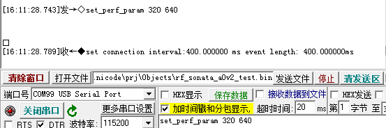
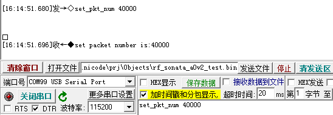
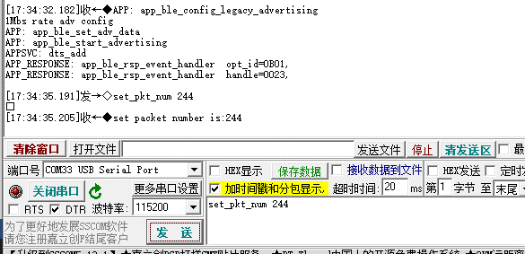
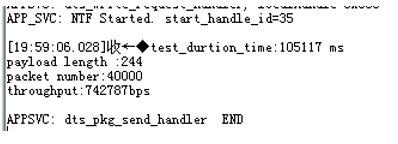
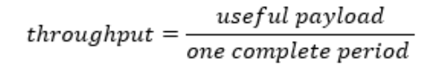
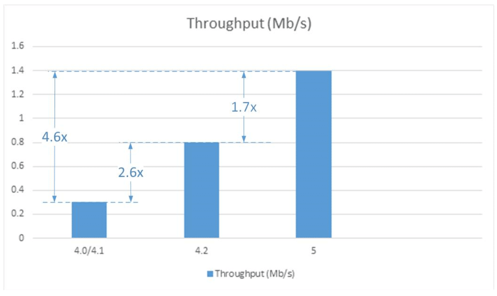

ASR560X 系列最大吞吐率测试报告
=============================

前言
----

**关于本文档**

本文档旨在提供 ASR5601X EVB 在不同的调制参数和配置下，进行蓝牙 SoC 芯片 ASR5601X 的最大吞吐率测试的方案、过程和结果。

**读者对象**

本文档主要适用于以下工程师：

-  单板硬件开发工程师
-  软件工程师
-  技术支持工程师

**产品型号**

本文档适用于 ASR5601X 系列蓝牙芯片。

+----------+-------------------------------------------------------------------------------------------+----------+--------------+------------------------------------------------------------------------------------+
| Model    | Protocol                                                                                  | Core     | SiP Flash    | Function                                                                           |
+==========+===========================================================================================+==========+==============+====================================================================================+
| ASR5601X | BLE 5.1 full feature (compatible with 5.2) SIG MESH V1.0.x IEEE 802.15.4 2.4G Proprietary | ARM CM0+ | 1 MB/ 512 KB | AOA/AOD/Voice/IRTxRx/ Quadrature Decoder/Keypad/ 5V UART/5V GPIO/ Wi-Fi concurrent |
+----------+-------------------------------------------------------------------------------------------+----------+--------------+------------------------------------------------------------------------------------+

**版权公告**

版权归 © 2021 翱捷科技股份有限公司所有。保留一切权利。未经翱捷科技股份有限公司的书面许可，不得以任何形式或手段复制、传播、转录、存储或翻译本文档的部分或所有内容。

**商标声明**

ASR、翱捷和其他翱捷商标均为翱捷科技股份有限公司的商标。

本文档提及的其他所有商标名称、商标和注册商标均属其各自所有人的财产，特此声明。

**免责声明**

翱捷科技股份有限公司对本文档内容不做任何形式的保证，并会对本文档内容或本文中介绍的产品进行不定期更新。

本文档仅作为使用指导，本文的所有内容不构成任何形式的担保。本文档中的信息如有变更，恕不另行通知。

本文档不负任何责任，包括使用本文档中的信息所产生的侵犯任何专有权行为的责任。

**防静电警告**

静电放电（ESD）可能会损坏本产品。使用本产品进行操作时，须小心进行静电防护，避免静电损坏产品。

**翱捷科技股份有限公司**

地址：上海市浦东新区科苑路 399 号张江创新园 10 号楼 9 楼 邮编：201203

官网： http://www.asrmicro.com/

**文档修订历史**

======= ====== ==========
日期    版本号 发布说明
======= ====== ==========
2021.03 V1.0.0 首次发布。
======= ====== ==========

1. 测试准备
-----------

1.1 测试环境
~~~~~~~~~~~~

测试地点为无干扰的屏蔽房。

1.2 硬件
~~~~~~~~

-  两块 ASR5601X EVB
-  若干根 USB 转 UART 串口线
-  一台 PC 操作机

1.3 软件
--------

-  使用串口调试助手 SCCOM 5.13.1

-  测试所用软件及其版本：

   -  **Centro Device：**

      Bootloader名称：bootloader.bin

      Rom名称: sonata_hl_ll_rom.bin

      Bin名称：sonata_hl_perf_test_central_rel.bin

   -  **Peripheral Device：**

      Bootloader名称：bootloader.bin

      Rom名称: sonata_hl_ll_rom.bin

      Bin名称：sonata_hl_perf_test_peripheral_rel.bin

-  版本日期当日构建，此版软件是 2021-03-19 日编译版本，版本号为 V1.1.4。

2. 测试方法
-----------

通过修改 MTU 调整连接间隔，并将操作属性设置为 Notification，来测试不同的调制速率下的蓝牙 SoC 芯片 ASR5601X 的最大吞吐率。

具体测试方法如下：

1. 准备两个 ASR5601X 平台：DUT1 烧录 peripheral 工程的 bin 文件作为 server；DUT2 烧录 central 工程的 bin 文件作为 client。

2. server 端下发命令说明：

   (1) set_perf_rate X：设置 PHY 速率，该命令下发后需要重启 EVB 板。 X 可取值 0、1、2、3，分别对应 1 Mbps、2 Mbps、125 Kbps、500 Kbps，如下图所示：

|image1|

(2) set_perf_param X Y：X、Y 分别为设置的连接间隔时间和事件时间。 X=connect interval/1.25，Y=event length/0.625，如下图所示：

|image2|

(3) set_pkt_num X：X 为发包数量，如下图所示：

|image3|

(4) set_pkt_size X：X 为发包大小，可设置范围 [20, 244]，如下图所示：

|image4|

3. 设置完步骤 2 中的参数后，上电 DUT2，开始跑流。

4. 一段时间后，DUT1 的串口会打印出 throughput 数据，记录数据。

|image5|

3. 测试步骤和结果
-----------------

测试 ASR5601X 的最大吞吐率的步骤如下：

1. 将准备好的固件烧进 EVB 测试板，连接好天线，并且保证 EVB 板的射频性能处于最佳工作状态。

2. 分别在两块 EVB 上烧入 Bin 文件。

3. 通过测试方法中介绍的命令，设置不同的配置参数，分别测试 PHY 在2 Mb/s和1 Mb/s调制速率下的最大吞吐率。

4. 记录 DUT1 串口的数据。

|image6|

+----------+--------------+------------------------------+----------------------------------+-------------------+-------------------+---------------------+---------------------+
| 联网模式 | **Protocol** | **Connection Interval (ms)** | **ATT Payload** **Size (Bytes)** | **Packet Number** | **Method**        | **LE 1M PHY (bps)** | **LE 2M PHY (bps)** |
+==========+==============+==============================+==================================+===================+===================+=====================+=====================+
| BLE      | GATT Server  | 120                          | 244                              | 40000             | Send Notification | 748,208             | 1,304,199           |
+----------+--------------+------------------------------+----------------------------------+-------------------+-------------------+---------------------+---------------------+

4. 理论吞吐率参数计算公式
-------------------------

BT 联盟提供的吞吐率测试计算方法的链接如下：

https://www.bluetooth.com/blog/exploring-bluetooth-5-how-fast-can-it-be/

|image7|

|image8|

.. |image1| image:: ../../img/560X_最大吞吐率报告/图2-1.png

