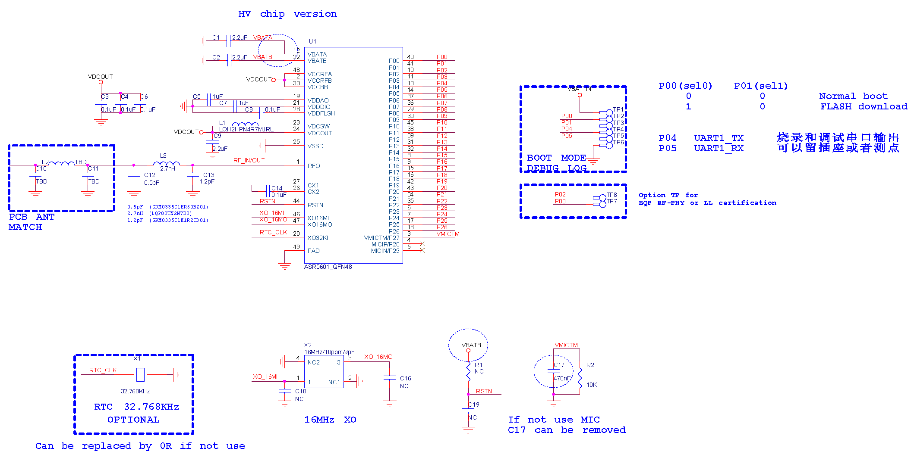
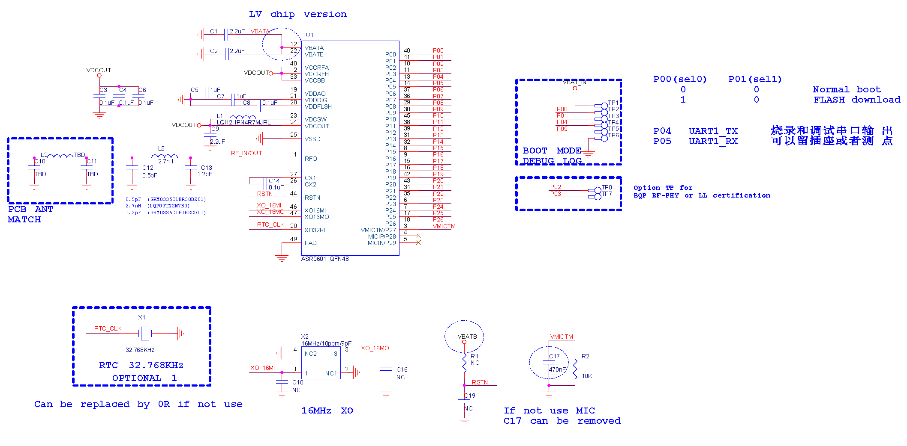
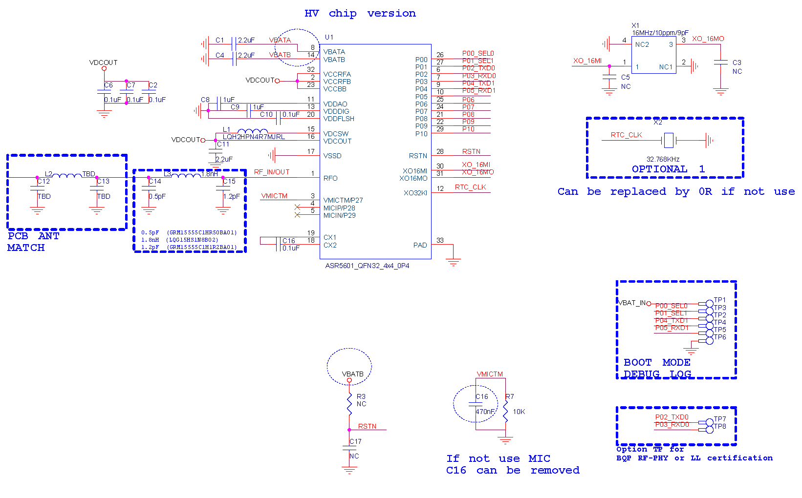
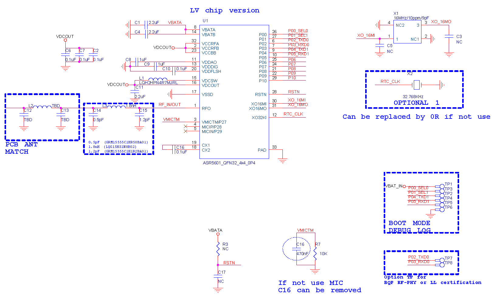

ASR560X 系列最简参考设计 
====================
`English <https://asriot.readthedocs.io/en/latest/ASR560X/Hardware-Reference/reference_design.html>`_

1. ASR560X QFN48 最简参考设计
--------------------------------------------------------

.. figure:: ../../img/560X_Reference/图1-1.png
    :align: center
    :scale: 30%
    :alt: ASR560X QFN48 HV 最简参考设计 (click to enlarge)

    ASR560X QFN48 HV 最简参考设计 (click to enlarge)

.. figure:: ../../img/560X_Reference/图1-2.png
    :align: center
    :scale: 30%
    :alt: ASR560X QFN48 LV 最简参考设计（点击放大）

    ASR560X QFN48 LV 最简参考设计（点击放大）

2. ASR560X QFN48 参考 BOM
--------------------------------------------------------

.. raw:: html

   

ASR560X QFN48 HV 参考 BOM

.. raw:: html

   

+------+------+---------------------+---------------------------+---------------------------+
| 序号 | 数量 | 器件编号            | 型号                      | 描述                      |
+======+======+=====================+===========================+===========================+
| 1    | 3    | C1, C2, C9          | 2.2uF                     | 滤波电容                  |
+------+------+---------------------+---------------------------+---------------------------+
| 2    | 5    | C3, C4, C6, C8, C14 | 0.1uF                     | 滤波电容                  |
+------+------+---------------------+---------------------------+---------------------------+
| 3    | 2    | C5, C7              | 1uF                       | 滤波电容                  |
+------+------+---------------------+---------------------------+---------------------------+
| 4    | 1    | C12                 | 0.5pF (GRM0335C1ER50BZ01) | RF 匹配电容               |
+------+------+---------------------+---------------------------+---------------------------+
| 5    | 1    | C13                 | 1.2pF (GRM0335C1E1R2CD01) | RF 匹配电容               |
+------+------+---------------------+---------------------------+---------------------------+
| 6    | 1    | C17                 | 470nF                     | 滤波电容                  |
+------+------+---------------------+---------------------------+---------------------------+
| 7    | 1    | L1                  | LQH2HPN4R7MJRL            | DCDC 电感，电流大于 100mA |
+------+------+---------------------+---------------------------+---------------------------+
| 8    | 1    | L3                  | 2.7nH (LQP03TN2N7B0)      | RF匹配电感                |
+------+------+---------------------+---------------------------+---------------------------+
| 9    | 1    | R2                  | 10K                       | 电阻                      |
+------+------+---------------------+---------------------------+---------------------------+
| 10   | 1    | U1                  | ASR5601_QFN48             | BLE 主芯片                |
+------+------+---------------------+---------------------------+---------------------------+
| 11   | 1    | X1                  | 32.768KHz                 | 晶体                      |
+------+------+---------------------+---------------------------+---------------------------+
| 12   | 1    | X2                  | 16MHz/10ppm/9pF           | 晶体                      |
+------+------+---------------------+---------------------------+---------------------------+

.. raw:: html

   

ASR560X QFN48 LV 参考 BOM

.. raw:: html

   

+------+------+---------------------+---------------------------+---------------------------+
| 序号 | 数量 | 器件编号            | 型号                      | 描述                      |
+======+======+=====================+===========================+===========================+
| 1    | 3    | C1, C2, C9          | 2.2uF                     | 滤波电容                  |
+------+------+---------------------+---------------------------+---------------------------+
| 2    | 5    | C3, C4, C6, C8, C14 | 0.1uF                     | 滤波电容                  |
+------+------+---------------------+---------------------------+---------------------------+
| 3    | 2    | C5,C7               | 1uF                       | 滤波电容                  |
+------+------+---------------------+---------------------------+---------------------------+
| 4    | 1    | C12                 | 0.5pF (GRM0335C1ER50BZ01) | RF 匹配电容               |
+------+------+---------------------+---------------------------+---------------------------+
| 5    | 1    | C13                 | 1.2pF (GRM0335C1E1R2CD01) | RF 匹配电容               |
+------+------+---------------------+---------------------------+---------------------------+
| 6    | 1    | C17                 | 470nF                     | 滤波电容                  |
+------+------+---------------------+---------------------------+---------------------------+
| 7    | 1    | L1                  | LQH2HPN4R7MJRL            | DCDC 电感，电流大于 100mA |
+------+------+---------------------+---------------------------+---------------------------+
| 8    | 1    | L3                  | 2.7nH (LQP03TN2N7B0)      | RF 匹配电感               |
+------+------+---------------------+---------------------------+---------------------------+
| 9    | 1    | R2                  | 10K                       | 电阻                      |
+------+------+---------------------+---------------------------+---------------------------+
| 10   | 1    | U1                  | ASR5601_QFN48             | BLE 主芯片                |
+------+------+---------------------+---------------------------+---------------------------+
| 11   | 1    | X1                  | 32.768KHz                 | 晶体                      |
+------+------+---------------------+---------------------------+---------------------------+
| 12   | 1    | X2                  | 16MHz/10ppm/9pF           | 晶体                      |
+------+------+---------------------+---------------------------+---------------------------+

3. ASR560X QFN32 最简参考设计
--------------------------------------------------------

.. figure:: ../../img/560X_Reference/图1-3.png
    :align: center
    :scale: 40%
    :alt: ASR560X QFN32 HV 最简参考设计（点击放大）

    ASR560X QFN32 HV 最简参考设计（点击放大）

.. figure:: ../../img/560X_Reference/图1-4.png
    :align: center
    :scale: 40%
    :alt: ASR560X QFN32 LV 最简参考设计（点击放大）

    ASR560X QFN32 LV 最简参考设计（点击放大）

4. ASR560X QFN32 参考 BOM
--------------------------------------------------------

.. raw:: html

   

ASR560X QFN32 HV 参考 BOM

.. raw:: html

   

+------+------+----------------------+----------------------------+---------------------------+
| 序号 | 数量 | 器件编号             | 型号                       | 描述                      |
+======+======+======================+============================+===========================+
| 1    | 3    | C1, C4, C11          | 2.2uF                      | 滤波电容                  |
+------+------+----------------------+----------------------------+---------------------------+
| 2    | 5    | C2, C6, C7, C10, C16 | 0.1uF                      | 滤波电容                  |
+------+------+----------------------+----------------------------+---------------------------+
| 3    | 2    | C8, C9               | 1uF                        | 滤波电容                  |
+------+------+----------------------+----------------------------+---------------------------+
| 4    | 1    | C14                  | 0.5pF (GRM15555C1HR50BA01) | RF 匹配电容               |
+------+------+----------------------+----------------------------+---------------------------+
| 5    | 1    | C15                  | 1.2pF (GRM15555C1H1R2BA01) | RF 匹配电容               |
+------+------+----------------------+----------------------------+---------------------------+
| 6    | 1    | C16                  | 470nF                      | 滤波电容                  |
+------+------+----------------------+----------------------------+---------------------------+
| 7    | 1    | L1                   | LQH2HPN4R7MJRL             | DCDC 电感，电流大于 100mA |
+------+------+----------------------+----------------------------+---------------------------+
| 8    | 1    | L3                   | 1.8nH (LQG15HS1N8B02)      | RF 匹配电感               |
+------+------+----------------------+----------------------------+---------------------------+
| 9    | 1    | R7                   | 10K                        | 电阻                      |
+------+------+----------------------+----------------------------+---------------------------+
| 10   | 1    | U1                   | ASR5601                    | BLE 主芯片                |
+------+------+----------------------+----------------------------+---------------------------+
| 11   | 1    | X1                   | 16MHz/10ppm/9pF            | 晶体                      |
+------+------+----------------------+----------------------------+---------------------------+
| 12   | 1    | X2                   | 32.768KHz                  | 晶体                      |
+------+------+----------------------+----------------------------+---------------------------+

.. raw:: html

   

ASR560X QFN32 LV 参考 BOM

.. raw:: html

   

+------+------+----------------------+----------------------------+---------------------------+
| 序号 | 数量 | 器件编号             | 型号                       | 描述                      |
+======+======+======================+============================+===========================+
| 1    | 3    | C1, C4, C11          | 2.2uF                      | 滤波电容                  |
+------+------+----------------------+----------------------------+---------------------------+
| 2    | 5    | C2, C6, C7, C10, C16 | 0.1uF                      | 滤波电容                  |
+------+------+----------------------+----------------------------+---------------------------+
| 3    | 2    | C8,C9                | 1uF                        | 滤波电容                  |
+------+------+----------------------+----------------------------+---------------------------+
| 4    | 1    | C14                  | 0.5pF (GRM15555C1HR50BA01) | RF 匹配电容               |
+------+------+----------------------+----------------------------+---------------------------+
| 5    | 1    | C15                  | 1.2pF (GRM15555C1H1R2BA01) | RF 匹配电容               |
+------+------+----------------------+----------------------------+---------------------------+
| 6    | 1    | C16                  | 470nF                      | 滤波电容                  |
+------+------+----------------------+----------------------------+---------------------------+
| 7    | 1    | L1                   | LQH2HPN4R7MJRL             | DCDC 电感，电流大于 100mA |
+------+------+----------------------+----------------------------+---------------------------+
| 8    | 1    | L3                   | 1.8nH (LQG15HS1N8B02)      | RF匹配电感                |
+------+------+----------------------+----------------------------+---------------------------+
| 9    | 1    | R7                   | 10K                        | 电阻                      |
+------+------+----------------------+----------------------------+---------------------------+
| 10   | 1    | U1                   | ASR5601                    | BLE 主芯片                |
+------+------+----------------------+----------------------------+---------------------------+
| 11   | 1    | X1                   | 16MHz/10ppm/9pF            | 晶体                      |
+------+------+----------------------+----------------------------+---------------------------+
| 12   | 1    | X2                   | 32.768KHz                  | 晶体                      |
+------+------+----------------------+----------------------------+---------------------------+

