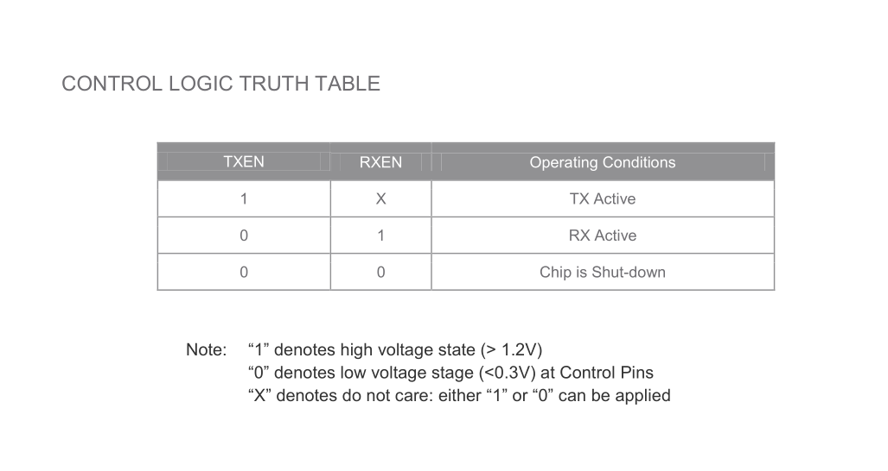
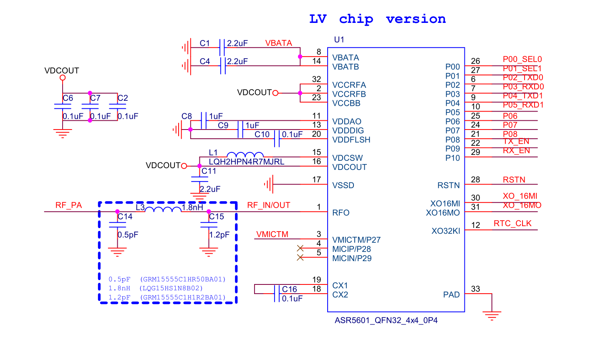
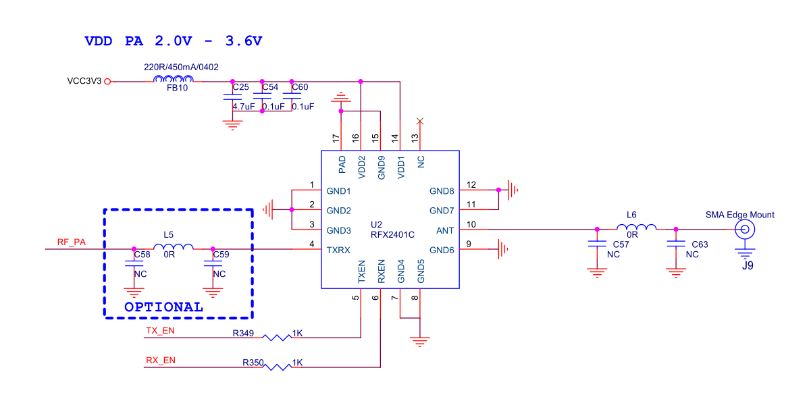
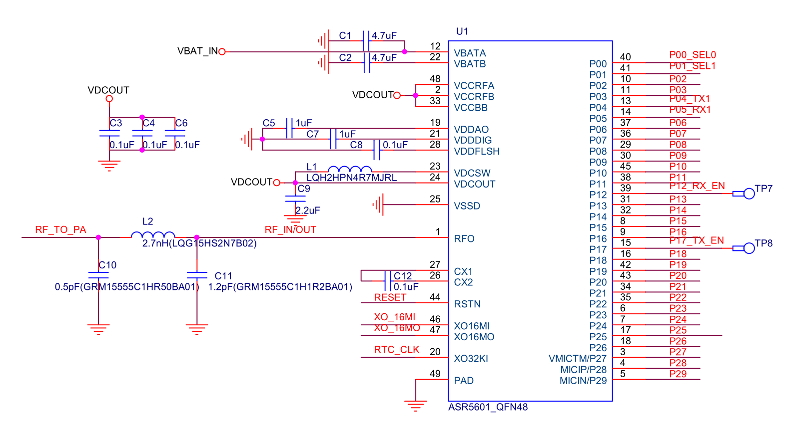
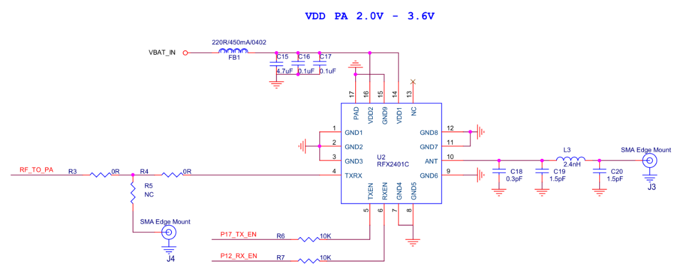
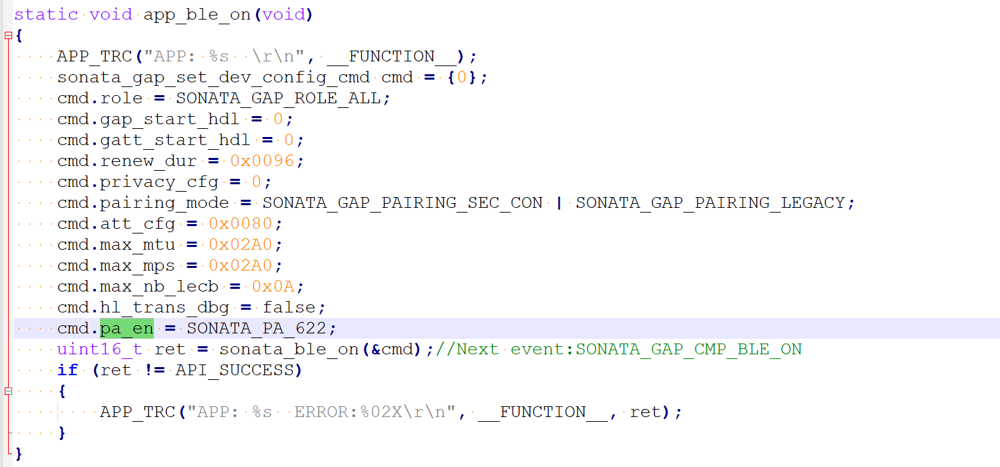
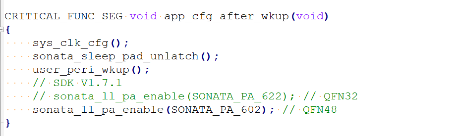
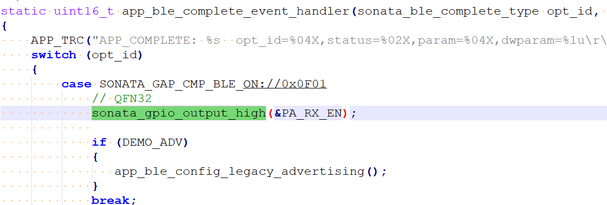
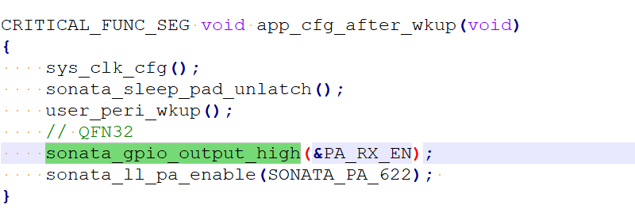

ASR560X 外加 PA 应用指南
======================

前言
----

**关于本文档**

本文档旨在介绍给 ASR560X 系列芯片增加外部 PA 设计时的注意事项。

**读者对象**

本文档主要适用于以下工程师：

-  单板硬件开发工程师
-  软件工程师
-  技术支持工程师

**产品型号**

本文档适用于 ASR560X 系列蓝牙芯片。

+---------+-------------------------------------------------------------------------------------------+----------+--------------+------------------------------------------------------------------------------------+
| Model   | Protocol                                                                                  | Core     | SiP Flash    | Function                                                                           |
+=========+===========================================================================================+==========+==============+====================================================================================+
| ASR560X | BLE 5.1 full feature (compatible with 5.2) SIG MESH V1.0.x IEEE 802.15.4 2.4G Proprietary | ARM CM0+ | 1 MB/ 512 KB | AOA/AOD/Voice/IRTxRx/ Quadrature Decoder/Keypad/ 5V UART/5V GPIO/ Wi-Fi concurrent |
+---------+-------------------------------------------------------------------------------------------+----------+--------------+------------------------------------------------------------------------------------+

**版权公告**

版权归 © 2023 翱捷科技股份有限公司所有。保留一切权利。未经翱捷科技股份有限公司的书面许可，不得以任何形式或手段复制、传播、转录、存储或翻译本文档的部分或所有内容。

**商标声明**

ASR、翱捷和其他翱捷商标均为翱捷科技股份有限公司的商标。

本文档提及的其他所有商标名称、商标和注册商标均属其各自所有人的财产，特此声明。

**免责声明**

翱捷科技股份有限公司对本文档内容不做任何形式的保证，并会对本文档内容或本文中介绍的产品进行不定期更新。

本文档仅作为使用指导，本文的所有内容不构成任何形式的担保。本文档中的信息如有变更，恕不另行通知。

本文档不负任何责任，包括使用本文档中的信息所产生的侵犯任何专有权行为的责任。

**防静电警告**

静电放电（ESD）可能会损坏本产品。使用本产品进行操作时，须小心进行静电防护，避免静电损坏产品。

**翱捷科技股份有限公司**

地址：上海市浦东新区科苑路 399 号张江创新园 10 号楼 9 楼 邮编：201203

官网： http://www.asrmicro.com/

**文档修订历史**

======= ====== =================================
日期    版本号 发布说明
======= ====== =================================
2023.01 V1.1.0 修改ASR560X QFN32封装的使用说明。
======= ====== =================================

1. 硬件参考设计
---------------

1.1 RFX2401C 控制逻辑真值表
~~~~~~~~~~~~~~~~~~~~~~~~~~

硬件参考设计将以 RFX2401C PA 举例说明。

RFX2401C TXEN/RXEN 的控制逻辑如下图所示。从图中可以知道，PA 的 TX/RX 分别由 TXEN/RXEN 管脚控制。在不考虑功耗的情况下，RXEN 可以一直拉高，只需要通过 TXEN 来切换 PA 的 TX 和 RX 模式。

|image1|

1.2 ASR560X QFN32 PA 设计
~~~~~~~~~~~~~~~~~~~~~~~~

参考下图，ASR560X QFN32 外加 PA 设计请注意如下事项：

-  PA芯片TX_EN 使能引脚必须使用 ASR560X P09 控制。

-  如无低功耗需求，可将 PA RX_EN 脚一直拉高，只需要通过 TX_EN 来切换 PA 的 TX 和 RX 模式。

-  如有低功耗需求，PA RX_EN 可以连接至 ASR560X P02-P10 任意引脚。

|image2|
|image3|

.. attention::
    如实际应用中所使用 PA 的控制逻辑真值表与 RFX24C01 不一样，请先咨询 ASR。

1.3 ASR560X QFN48 PA 设计
~~~~~~~~~~~~~~~~~~~~~~~~

参考下图，ASR560X QFN48 外加 PA 设计请注意如下事项：

-  PA芯片TX_EN 使能引脚必须使用 ASR560X P17 控制。

-  PA芯片RX_EN 使能引脚必须使用 ASR560X P12 控制。

|image4|

|image5|

2. 软件设计注意事项
-------------------

如果使用外部 PA，需留意如下注意事项：

1. 如下图，进入 SDK 工程 app.c 中 的 app_ble_on() 函数，配置 sonata_gap_set_dev_config_cmd 结构体 pa_en 成员变量，具体配置值参考下表。

|image6|

.. attention::
    不同的SDK配置值不一样。

.. raw:: html

   

SDK 1.7.1 版本前的配置

======== ==========
**封装** **配置值**
======== ==========
QFN32    不支持
QFN48    true
======== ==========

.. raw:: html

   

.. raw:: html

   

SDK 1.7.1 版本后的配置

======== =============
**封装** **配置值**
======== =============
QFN32    SONATA_PA_622
QFN48    SONATA_PA_602
======== =============

.. raw:: html

   

2. 如使用低功耗功能，需要在低功耗配置函数 (app_sleep_init()) 的 app_after_wkup_cb() 回调函数中使用 sonata_ll_pa_enable() API 重新使能 PA 功能。SDK V1.7.1 后的版本，需要根据上表将相应的参数传入 sonata_ll_pa_enable() API。

.. raw:: html

   

|image7|

低功耗下sonata_ll_pa_enable() API配置位置

.. raw:: html

   

3. 如使用 QFN32 封装，需要将 PA RX_EN 对应的 GPIO 输出高电平；如使用低功耗功能，需要在低功耗配置函数 (app_sleep_init()) 的 app_before_ds_cb 回调中将 RX_EN 对应的 GPIO 配置为输出低电平；在低功耗配置函数 (app_sleep_init()) 的 app_after_wkup_cb 回调中将 RX_EN 对应的 GPIO 配置为输出高电平。

.. raw:: html

   

|image8|

QFN32 RX_EN输出高电平参考位置

.. raw:: html

   

.. raw:: html

   

|image9|

QFN32进入低功耗前RX_EN输出低电平参考位置

.. raw:: html

   

.. raw:: html

   

|image10|

QFN32低功耗唤醒后RX_EN输出高电平参考位置

.. raw:: html

   

4. SDK 默认发射功率为 0 dBm。如需调整发射功率，可以在 app.c app_ble_complete_event_handler() 函数 SONATA_GAP_CMP_BLE_ON 状态中使用 sonata_ll_set_txpwr() API 调整。

.. |image9| image:: ../../img/560X_外加PA/图2-4.png
