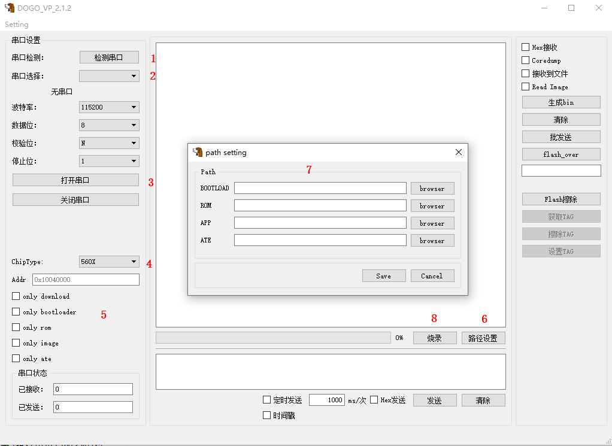
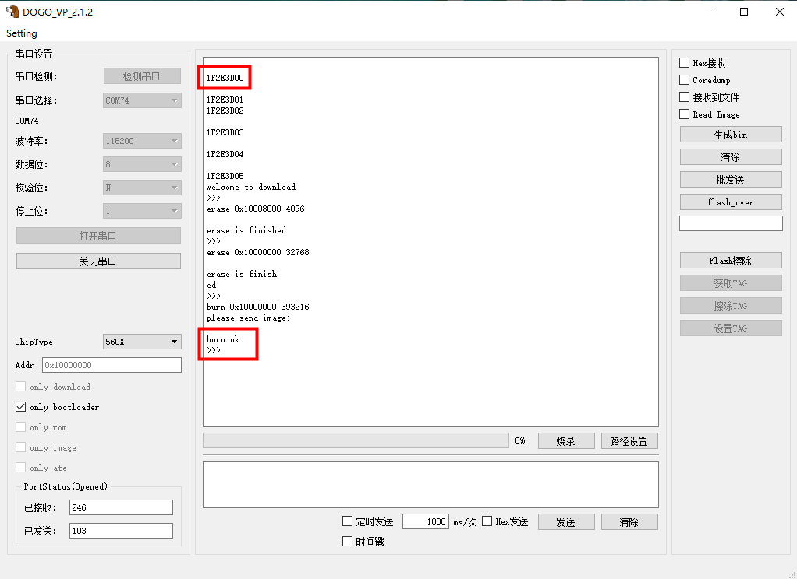
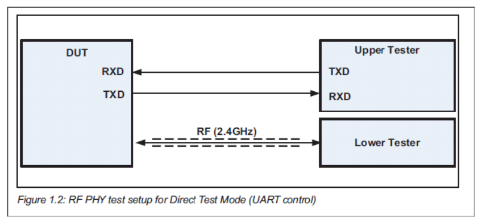
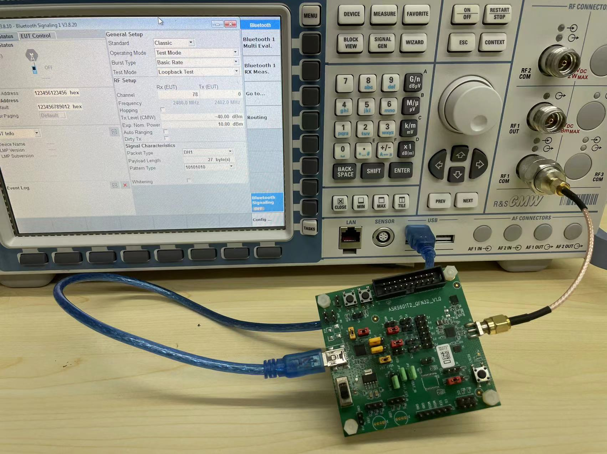
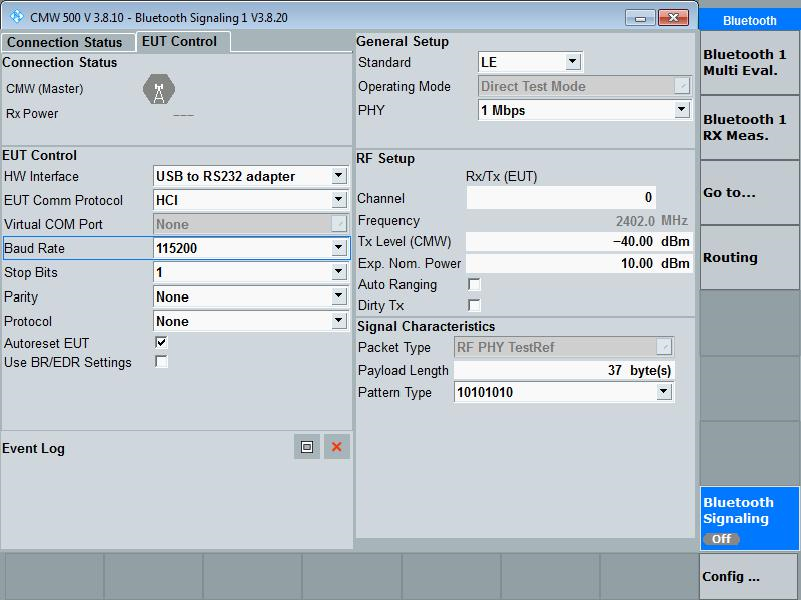
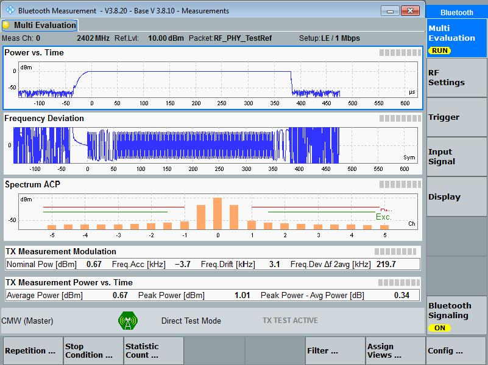
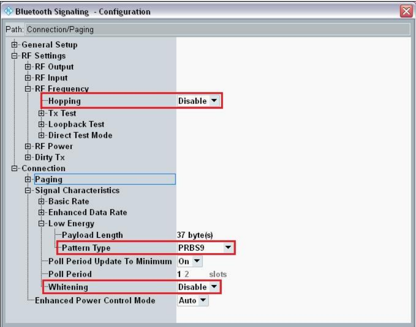
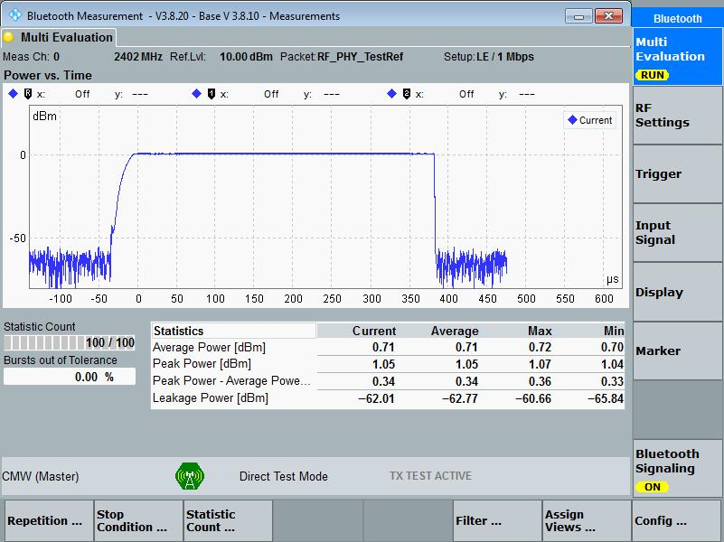
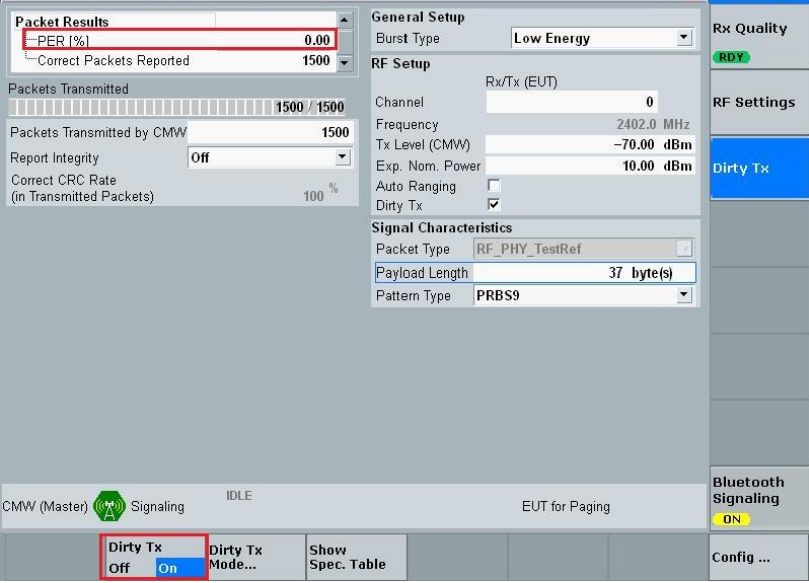
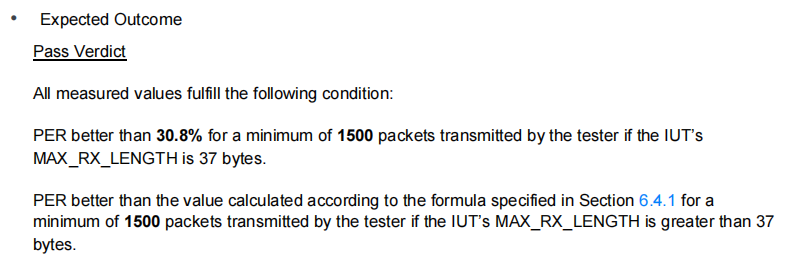

ASR560X 系列 BQB 认证测试指南
=============================

前言
----

**关于本文档**

本文档主要介绍 ASR560X 如何通过 CWM500 蓝牙综测仪进行信令测试，进而完成 BQB 相关测试项目。BQB 认证测试项目分为射频部分和协议部分，本文主要介绍射频部分的测试。

**读者对象**

本文档主要适用于以下工程师：

-  单板硬件开发工程师
-  软件工程师
-  技术支持工程师

**产品型号**

本文档适用于ASR560X系列蓝牙芯片。

+---------+-------------------------------------------------------------------------------------------+----------+--------------+------------------------------------------------------------------------------------+
| Model   | Protocol                                                                                  | Core     | SiP Flash    | Function                                                                           |
+=========+===========================================================================================+==========+==============+====================================================================================+
| ASR560X | BLE 5.1 full feature (compatible with 5.2) SIG MESH V1.0.x IEEE 802.15.4 2.4G Proprietary | ARM CM0+ | 1 MB/ 512 KB | AOA/AOD/Voice/IRTxRx/ Quadrature Decoder/Keypad/ 5V UART/5V GPIO/ Wi-Fi concurrent |
+---------+-------------------------------------------------------------------------------------------+----------+--------------+------------------------------------------------------------------------------------+

**版权公告**

版权归 © 2022 翱捷科技股份有限公司所有。保留一切权利。未经翱捷科技股份有限公司的书面许可，不得以任何形式或手段复制、传播、转录、存储或翻译本文档的部分或所有内容。

**商标声明**

ASR、翱捷和其他翱捷商标均为翱捷科技股份有限公司的商标。

本文档提及的其他所有商标名称、商标和注册商标均属其各自所有人的财产，特此声明。

**免责声明**

翱捷科技股份有限公司对本文档内容不做任何形式的保证，并会对本文档内容或本文中介绍的产品进行不定期更新。

本文档仅作为使用指导，本文的所有内容不构成任何形式的担保。本文档中的信息如有变更，恕不另行通知。

本文档不负任何责任，包括使用本文档中的信息所产生的侵犯任何专有权行为的责任。

**防静电警告**

静电放电（ESD）可能会损坏本产品。使用本产品进行操作时，须小心进行静电防护，避免静电损坏产品。

**翱捷科技股份有限公司**

地址：上海市浦东新区科苑路 399 号张江创新园 10 号楼 9 楼 邮编：201203

官网： http://www.asrmicro.com/

**文档修订历史**

======= ====== ==========
日期    版本号 发布说明
======= ====== ==========
2022.07 V1.0.0 首次发布。
======= ====== ==========

1. 概述
-------

如果您的产品具有蓝牙功能，必须通过 BQB 认证后才能在产品外观上标明蓝牙标志。

BQB 认证测试项目分为射频部分和协议部分，本文主要介绍 ASR560X 如何通过 CWM500 综测仪进行射频部分信令测试。由于射频部分的测试项目众多，本文会先说明建立信令连接的方法，针对发射机和接收机测试项目，分别以其中一项为例进行介绍，并结合 BLE 射频文档 \*RF-PHY.TS**.5.1.0*进行说明。相关文档URL：https://www.bluetooth.com/specifications/specs/，SIG 官网会不定时更新 BQB 测试项目标准，具体规范请以官方文档为准。

1.1 软硬件准备
~~~~~~~~~~~~~~

-  USB 转TTL 串口板（供电稳定，最大输出电流需在 150 mA 以上）
-  PC 端上位机软件：DOGO（用于在线烧录固件）
-  跳线帽、射频线等
-  待测板（DUT）
-  CMW500 综测仪

1.2 开发板说明
~~~~~~~~~~~~~~

|image1|

**标号1**\ ：USB 转 TTL 电路（可通过跳线帽选择与 ASR560X 的 UART0 或者 UART1 连接）

**标号2**\ ：电源开关

**标号3**\ ：SEL0 高低电平选择，旁边是复位按键

**标号4**\ ：射频转接头

2. 测试固件说明
---------------

测试需要使用专用的 BLE-DTM 固件（5601X_DTM_RF&PHY_x.x.x.bin），该固件可能不定时更新，最新固件请联系原厂获取。

2.1 固件信息
~~~~~~~~~~~~

本次演示用的 bin 档信息如下：

-  名称：5601X_DTM_RF&PHY_1.0.0.bin（关闭 CTS & RTS 功能）
-  固件烧录地址: 0x10000000（BOOTLOAD 位置）
-  HCI-UART 端口 UART0

   -  PAD2 UART0_TXD
   -  PAD3 UART0_RXD
   -  波特率：115200
   -  检验位：None
   -  停止位：1bit

-  使用串口工具发送 hex 数据 “01 03 0C 00”，如果反馈 “04 0E 04 05 03 0C 00”，说明固件成功运行。
-  发射功率默认为 0 dBm。
-  请用原厂 SDK 中提供的 DOGO 工具烧录固件。

2.2 烧录工具说明
~~~~~~~~~~~~~~~~

|image2|

1. **检测串口**\ ：点击 **检测串口** 按钮，上位机会刷新并列出识别到的串口（如果未识别到待测板串口，请检查电脑串口驱动是否已安装）。

2. **串口选择**\ ：选择对应的待测板串口号。

3. **打开串口**\ ：打开待测板串口。

4. **ChipType**\ ：选择 560X 型号。

5. **烧录选项**\ ：烧录选项请勾选 only bootloader。

6. **路径设置**\ ：点击 **路径设置** 按钮，弹出\ **path setting**\ 窗口，然后点击 BOOTLOAD 旁边的\ **browser**\ 按钮，选择对应的射频测试固件。

7. **烧录**\ ：点击 **烧录** 按钮，开始烧录。

2.3 烧录操作步骤
~~~~~~~~~~~~~~~~

|image3|

1. 使用跳线帽拉高 DUT 的 SEL0，使 DUT 进入 UART 烧录模式。

2. 将 DUT UART1 通过 TTL 转 USB 串口板连接到电脑上，打开串口。

3. 按下板子上的 \*\ **复位\*** 按键，待串口打印 “1F2E3D00”，说明 DUT 已进入烧录模式。

4. 参考第\ `2.2 <#_烧录工具说明>`__\ 节的说明，选择对应的烧录文件。点击 **烧录** 按钮开始烧录，烧录完成后，串口打印 “burn ok”。

3. BLE 信令测试说明
------------------

3.1 Direct Test Mode
~~~~~~~~~~~~~~~~~~~~

Direct test mode（DTM）为蓝牙低功耗协议规范专门定义的一种 Low Energy 信令测试模式。测试设备与待测设备通过 USB 口通信，并进行信令测试。

ASR560X 通过 USB 转串口跟 CMW500 交互数据的示意图如下。

|image4|

下图显示了 DUT 与 CMW500 的连线方式：将 ASR560X 通过 TTL USB 转换器跟 CMW500 连接，然后将射频转接头通过射频线以传导的方式跟 CMW500 连接。

|image5|

3.2 建立信令连接
~~~~~~~~~~~~~~~~

CMW500 不同的软件版本可能界面有所不同，但操作流程都一样，流程大致如下：

1. 按下\ **SIGNAL GEN**\ 键，进入到选择信令测试类别的界面。此时选择\ **Bluetooth Signaling**\ ，并点击下面出现的相应选项，就可以进入到Bluetooth信令设置界面。

2. 按照下图所示，配置仪器和 DUT 之间通信的串口参数（\ **Standard**\ 选择\ **LE**\ ），然后按下\ **ON/OFF** 键打开 **Bluetooth Signaling**\ ，此时界面上的\ **Bluetooth Signaling**\ 显示 “**ON**” 字样。

|image6|

3. 点击屏幕下方的 \*\ **Refresh Devices**\ 按钮，仪器会检查可用的虚拟串口号，Event Log 里也会有提示。在找到 DUT 对应的串口号后，点击\ **Connection Check**\ 按钮，仪器会发送 **Reset**\ 指令给 DUT 并等待其响应。如果有响应，界面会出现 “**OK**” 提示，表示连接已经建立，如下图。

|image7|

4. 按下\ **MEASURE**\ 键，进入到选择测试项的界面。此时选择 **Bluetooth TX Measurement** 或者 **RX Measurement**\ ，并点击下面出现的相应选项，就可以进入到 Bluetooth 发射机或者接收机测试界面，然后按下仪器上的 **ON/OFF** 键开始测量。

3.3 发射机测量
~~~~~~~~~~~~~~

下图是发射机的测量界面，\ **Config** 菜单包含所有测量相关的参数设置，用户需要根据BQB认证的具体测试项目设置对应的参数。

|image8|

接下来以 BQB 认证中关于发射机的其中一项测试为例进行说明，完整的测试流程和其他测试项目请参考官网的标准文档。

**RF-PHY/TRM/BV-01-C [Output power]** **测试项**

检测正常工作条件下发射机的峰值功率和平均功率。

**规范定义的测试条件：**

1. DUT 处于 direct test mode（关闭白噪声），PRBS9 比特类型，非跳频。

2. 分别在低、中、高三频点上测量（Channel 0，Channel 19，Channel 39）。

**测试步骤：**

1. 在信令连接界面上选择不跳频，并选择关闭白噪声。

2. 选择 Pattern Type 的类型为 PRBS9。

|image9|

3. 分别在低、中、高三频点（Channel 0，Channel 19，Channel 39）上测量平均功率 PAVG 和峰值功率 PPK。

|image10|

**该测试项规范指标（摘自 SIG 官方文档 RF-PHY.TS.5.1.0）：**

|image11|

3.4 接收机测量
~~~~~~~~~~~~~~

以 BQB 认证中关于接收机的其中一项测试为例进行介绍，完整的测试流程和其它测试项目请参考官网的标准文档。

**RF-PHY/RCV/BV-01-C[Receiver sensitivity,uncoded data at 1Ms/s] 测试项**

该测试验证在正常工作条件下接收 1Ms/s 信号时，对于非理想信号，接收机灵敏度是否在限制范围内。

**规范定义的测试条件：**

1. DUT 处于 direct test mode（关闭白噪声），PRBS9 比特类型，非跳频 ，打开 dirty TX。

2. CMW 发送的测试信号功率为 -70 dBm。

3. 分别在低、中、高三频点上测量（Channel 0，Channel 19，Channel 39）。

**测试步骤：**

1. 在信令连接界面上选择不跳频，并选择关闭白噪声。

2. 选择 Pattern Type 的类型为 PRBS9，将 CMW 的发射功率设为 -70dBm。

3. 在 PER 测量界面，打开 Dirty TX，分别在低、中、高三频点上测量（Channel 0，Channel 19，Channel 39）进行 PER 测试。

|image12|

**该测试项规范指标（摘抄自 SIG 官方文档 RF-PHY.TS.5.1.0）：**

|image13|

.. |image1| image:: ../../img/560X_BQB认证/图1-1.png

.. |image7| image:: ../../img/560X_BQB认证/图3-4.png

.. |image11| image:: ../../img/560X_BQB认证/图3-77.png

