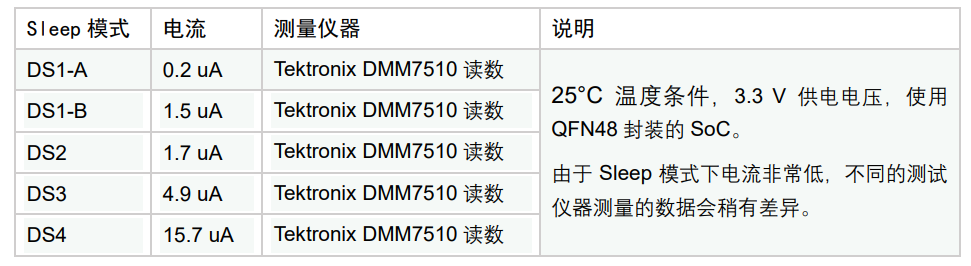

ASR560X 系列 BLE 低功耗应用指南
==============================
`English <https://asriot.readthedocs.io/en/latest/ASR560X/Low_Power_Application_Guide.html>`_

前言
----

**关于本文档**

本文档主要介绍 ASR560X 蓝牙 SoC 芯片支持的 4 种低功耗模式，这4种模式按功耗由低到高分别是 DS1（细分为 DS1-A 和 DS1-B）、DS2、DS3 和 DS4。

**读者对象**

本文档主要适用于以下工程师：

-  单板硬件开发工程师
-  软件工程师
-  技术支持工程师

**产品型号**

本文旨在介绍用于 ASR560X 系列 BLE 芯片开发的 DOGO 工具的配置与使用。

+---------+----------------------------------------------------------------------------------------+----------+--------------+------------------------------------------------------------------------------------+
| 型号    | 协议                                                                                   | 内核     | SiP Flash    | 功能                                                                               |
+=========+========================================================================================+==========+==============+====================================================================================+
| ASR560X | BLE 5.1 full feature (compatible with 5.2) BLE SIG Mesh IEEE 802.15.4 2.4G Proprietary | ARM CM0+ | 1 MB/ 512 KB | AOA/AOD/Voice/IRTxRx/ Quadrature Decoder/Keypad/ 5V UART/5V GPIO/ Wi-Fi concurrent |
+---------+----------------------------------------------------------------------------------------+----------+--------------+------------------------------------------------------------------------------------+

**版权公告**

版权归 © 2023 翱捷科技股份有限公司所有。保留一切权利。未经翱捷科技股份有限公司的书面许可，不得以任何形式或手段复制、传播、转录、存储或翻译本文档的部分或所有内容。

**商标声明**

ASR、翱捷和其他翱捷商标均为翱捷科技股份有限公司的商标。

本文档提及的其他所有商标名称、商标和注册商标均属其各自所有人的财产，特此声明。

**免责声明**

翱捷科技股份有限公司对本文档内容不做任何形式的保证，并会对本文档内容或本文中介绍的产品进行不定期更新。

本文档仅作为使用指导，本文的所有内容不构成任何形式的担保。本文档中的信息如有变更，恕不另行通知。

本文档不负任何责任，包括使用本文档中的信息所产生的侵犯任何专有权行为的责任。

**防静电警告**

静电放电（ESD）可能会损坏本产品。使用本产品进行操作时，须小心进行静电防护，避免静电损坏产品。

**翱捷科技股份有限公司**

地址：上海市浦东新区科苑路 399 号张江创新园 10 号楼 9 楼 邮编：201203

官网： http://www.asrmicro.com/

**文档修订历史**

+---------+--------+---------------------------------------------------------------------------------------------+
| 日期    | 版本号 | 发布说明                                                                                    |
+=========+========+=============================================================================================+
| 2023.09 | V1.1.2 | 增加了节\ `3.2 <#节32>`__\ 、\ `3.3 <#节33>`__\ 和\ `3.4 <#节34>`__\ 中温度条件设置的描述。 |
+---------+--------+---------------------------------------------------------------------------------------------+

1. Low Power 概述
----------------

ASR560X BLE SoC 支持 4 种低功耗模式，按功耗由低到高分别是 DS1、DS2、DS3 和 DS4。

1.1 DS1
~~~~~~~

DS1 分为 A 和 B 两种模式：

**DS1-A**\ 模式功耗最低，只支持 GPIO 高电平和低电平唤醒，该模式无法保持 BLE connection，并且仅用于单按键场景。

**DS1-B**\ 模式只支持 4 个特定的 GPIO 唤醒，分别是 GPIO2，GPIO3，GPIO9 和 GPIO10，支持上升沿和下降沿唤醒，该模式无法保持 BLE connection。

1.2 DS2
~~~~~~~

DS2 模式支持 GPIO、Sleep timer 和 LPUART 唤醒，可同时支持 8 组 GPIO 唤醒，支持上升沿、下降沿、高电平和低电平唤醒，且每组 GPIO index 可任意配置。该模式无法保持 BLE connection。

1.3 DS3
~~~~~~~

DS3 模式支持 GPIO、Sleep timer、LPUART 和 BLE timer 唤醒，可同时支持 8 组 GPIO 唤醒，支持上升沿，下降沿，高电平和低电平唤醒，且每组 GPIO index 可任意配置。该模式无法保持 BLE connection，但可以支持 beacon 应用。

1.4 DS4
~~~~~~~

DS4 模式支持 GPIO、Sleep timer、LPUART 和 BLE timer 唤醒，可同时支持 8 组 GPIO 唤醒，支持上升沿、下降沿、高电平和低电平唤醒，且每组 GPIO index 可任意配置。该模式可以支持 BLE connection。

下表给出了各 Sleep 模式和唤醒源情况：

+-----------+--------------------------------------------------+----------------------+
| Sleep模式 | 唤醒源                                           | 说明                 |
+===========+==================================================+======================+
| DS1-A     | GPIO (GPIO2-GPIO29)                              | 不支持BLE connection |
+-----------+--------------------------------------------------+----------------------+
| DS1-B     | Specified GPIO (GPIO2/GPIO3/GPIO9/GPIO10)        | 不支持BLE connection |
+-----------+--------------------------------------------------+----------------------+
| DS2       | GPIO (GPIO2-GPIO29)/Sleep timer/LPUART           | 不支持BLE connection |
+-----------+--------------------------------------------------+----------------------+
| DS3       | GPIO (GPIO2-GPIO29)/Sleep timer/LPUART/BLE timer | 支持Beacon           |
+-----------+--------------------------------------------------+----------------------+
| DS4       | GPIO (GPIO2-GPIO29)/Sleep timer/LPUART/BLE timer | 支持BLE connection   |
+-----------+--------------------------------------------------+----------------------+

2. 程序配置说明
---------------

2.1 Sleep Mode Configure 数据结构
~~~~~~~~~~~~~~~~~~~~~~~~~~~~~~~~

Sleep mode configure 数据结构 **sonata_sleep_cfg_t** 如下所示，其各成员的情况在下文中作了详细说明。

|image1|

(1) **slp_mode**\ ：用于配置 deep sleep 模式（DS1-4），包括 MODE_DS1_A、MODE_DS1_B、MODE_DS2、MODE_DS3 和 MODE_DS4。

|image2|

(2)  **pre_slp_mode**\ ：用于记录前一次 sleep mode。

(3)  **low_volt**\ ：用于检测芯片电压处于高电压模式（>=3.6 V）或低电压模式（<3.6 V）。

(4)  **clk_sel**\ ：用于选择睡眠时钟，可配置为 RCO32K 或 XO32K。

(5)  **pwr_supply_mode**\ ：用于选择供电模式，可配置为 DC_DC 或 SYS_LDO 模式。

(6)  **slp_duration_backoff**\ ：用于配置 sleep duration，默认值为 0（应用在带有 BLE 业务的场景，提前唤醒 SoC 执行相关代码，为 BLE TX/RX 活动做准备）。

(7)  **ds1_wkup_sel**\ ：用于配置 DS1 的唤醒源（其中 MODE_DS1_A 模式为 DS1 的特殊模式，此处不需要配置），MODE_DS1_B 模式下，唤醒源只允许配置为特定的 4 组GPIO：GPIO_GROUP_0、GPIO_GROUP_1、GPIO_GROUP_2 和 GPIO_GROUP_3。这 4 组 GPIO index 分别对应 P02、P03、P09 和 P10。

(8)  **ds2_wkup_sel**\ ：用于配置 DS2 的唤醒源，可以配置为 SLP_TIMER、LP_UART 和 8 组GPIO：GPIO_GROUP_0，GPIO_GROUP_1，GPIO_GROUP_2，GPIO_GROUP_3，GPIO_GROUP_4，GPIO_GROUP_5，GPIO_GROUP_6 和 GPIO\_ GROUP_7。这 8 组 GPIO，每一组都可以独立选择任意的 GPIO index（P02~P29）。

(9)  **ds3_wkup_sel**\ ：用于配置 DS3 的唤醒源，可以配置为 SLP_TIMER、LP_UART、BLE_TIMER 和 8 组 GPIO：GPIO_GROUP_0，GPIO_GROUP_1，GPIO_GROUP_2，GPIO_GROUP_3，GPIO_GROUP_4，GPIO_GROUP_5，GPIO_GROUP_6和 GPIO\_ GROUP_7。这 8 组 GPIO，每一组都可以独立选择任意的 GPIO index（P02~P29）。

(10) **ds4_wkup_sel**\ ：用于配置 DS4 的唤醒源，可以配置为 SLP_TIMER，LP_UART，BLE_TIMER 和 8 组GPIO：GPIO_GROUP_0，GPIO_GROUP_1，GPIO_GROUP_2，GPIO_GROUP_3，GPIO_GROUP_4，GPIO_GROUP_5，GPIO_GROUP_6 和 GPIO\_ GROUP_7。这 8 组 GPIO，每一组都可以独立选择任意的 GPIO index（P02~P29）。

|image3|

(11) **gpio**\ ：包括两个参数（pad_mapping 和 wkup_method），pad_mapping 用于配置各组 GPIO 具体 index（P02~P29）；wkup_method 用于配置唤醒方式：上升沿（RISING\_ WKUP）、下降沿（FALLING_WKUP）、高电平（HIGH_LEVEL_WKUP）和低电平（LOW_LEVEL_WKUP）。

例如：在 MODE_DS4下，ds4_wkup_sel 使用了两组 GPIO 唤醒源（GPIO_GROUP_0 和 GPIO_GROUP_1），其中第一组 GPIO_GROUP_0 配置为 P10 上升沿唤醒，第二组GPIO_GROUP_1 配置为 P12 上升沿唤醒，示例代码如下。

.. attention::
    此处配置要一一对应，最多支持 8 组 GPIO 同步唤醒。

|image4|

.. note::
    其中 DS1_A 模式下的唤醒源配置代码比较特殊，与其他模式唤醒源不共用。详见下页示例代码。

|image5|

(12) **lpuart_pad**\ ：用于配置 lpuart 唤醒所用到的 Pad（P02~P29）。

(13) **sleep_timer_val**\ ：用于配置 sleep timer timeout count，计时单位是 1s/32768。

(14) **pull_type_p00_p15**\ ：用于配置 P00-P15 的初始状态为 PULLTYPE_PULLUP、PULLTYPE_PULLDOWN 或 PULLTYPE_FLOAT，未配置时默认状态为 PULLDOWN。

(15) **pull_type_p16_p30**\ ：用于配置 P16-P30 的初始状态为 PULLTYPE_PULLUP、PULLTYPE_PULLDOWN 或 PULLTYPE_FLOAT，未配置时默认状态为 PULLDOWN。

(16) **peri_clk_en**\ ：用于使能所用到的外设时钟，其中 CACHE_HCLK_EN、RFCTRL_PCLK_EN 和 QSPI_TOP_HCLK_EN 默认为使能状态，无需再配置。其余外设时钟默认为clock gating 状态以节省功耗，如需被使用，则使能对应的 peri_clk。

|image6|

(17) **peri_soft_en**\ ：用于使能所用到的 peri_soft，其中 APB_PERI_SOFT_EN、APB_PERI0_SYNC_SOFT_EN、APB_PERI1_ASYNC_SOFT_EN、APB_PERI2_ASYNC_SOFT_EN、CACHE_SOFT_EN、RFCTRL_SOFT_EN 和QSPI_TOP_SOFT_EN 默认为使能状态，无需再配置，其余外设默认 soft reset 住以节省功耗，如需被使用，则使能相应的 peri_soft。

|image7|

(18) **app_before_ds_cb 回调函数**\ ：用于在 SoC deep sleep 之前调用用户程序。

(19) **app_before_ds_set_gpio_output_cb**\ ：用于在 SoC 睡眠之前设置一些 gpio 输出状态。

(20) **app_after_wkup_cb 回调函数**\ ：用于在 SoC wakeup 之后调用用户程序。

(21) **app_after_ble_wkup_cb 回调函数**\ ：用于在 BLE 协议栈唤醒（ble timing correction）之后调用用户程序。

(22) **lpuart_init回调函数**\ ：若配置 lpuart 唤醒需要执行 lpuart 初始化，示例代码如下：

|image8|

2.2 Sleep Mode 初始化函数
~~~~~~~~~~~~~~~~~~~~~~~~

Sleep mode 初始化函数 app_sleep_init 用于配置 SoC 的 deep sleep mode，下文分别介绍了 DS1-DS4 模式下的代码示例和串口调试结果。

2.2.1 DS1 模式初始化代码示例
^^^^^^^^^^^^^^^^^^^^^^^^^^^

DS1 分为 A、B 两种模式，软件中默认使用的是 B 模式，通过如下宏来控制 A、B 模式的切换，其中，0 对应 MODE_DS1_B；1 对应 MODE_DS1_A。

|image9|

打开此宏，进入 MODE_DS1_A 模式，若使用 P10（DS1_A_P10）作为唤醒源，设置高电平（DS1_A_P10_HIGH_LEVEL_WKUP）下唤醒，则唤醒配置代码如下所示：

|image10|

关闭此宏，进入 MODE_DS1_B 模式。

.. attention::
    MODE_DS1_B 比较特殊，不能任意配置 8 组 GPIO 资源，只能配置特定的四组，即：
    GPIO_GROUP_0 固定等效于 P02
    GPIO_GROUP_1 固定等效于 P03
    GPIO_GROUP_2 固定等效于 P09
    GPIO_GROUP_3 固定等效于 P10

若使用 GPIO_GROUP_3（即P10）作为唤醒源，设置上升沿（RISING_WKUP）下唤醒，则唤醒配置代码如下所示：

|image11|

2.2.2 DS2 模式初始化代码示例
^^^^^^^^^^^^^^^^^^^^^^^^^^^

DS2 模式下，使用 LP_UART 作为唤醒源。

.. attention::
    若唤醒源配置为 LP_UART，则只需要配置具体哪个 Pad 口作为唤醒串口，不需要配置 Pad 口唤醒触发方式。并且所用到的 Pad 口，应配置为 PULLTYPE_PULLUP。例如，使用 P20 作为 LPUART RX 唤醒串口的配置代码如下所示：

|image12|

2.2.3 DS3 模式初始化代码示例
^^^^^^^^^^^^^^^^^^^^^^^^^^^

DS3 模式下，使用 SLP_TIMER 作为唤醒源的配置代码如下所示：

|image13|

2.2.4 DS4 模式初始化代码示例
^^^^^^^^^^^^^^^^^^^^^^^^^^^

DS4 模式下，同时使用多组 GPIO 作为唤醒源的配置代码如下所示：

|image14|

2.2.5 Sleep 模式唤醒 Log 打印
^^^^^^^^^^^^^^^^^^^^^^^^^^

各睡眠模式下可通过查看串口 log 来判断是否唤醒，例如下图所示：

|image15|

2.3 Sleep Mode 回调函数
~~~~~~~~~~~~~~~~~~~~~~

注册的回调函数用于在低功耗不同阶段处理用户程序，应根据实际需求调用，如下简要举例说明。

1. **app_before_ds_cb回调函数**\ ：用于在 SoC enter sleep 之前调用用户程序，可用于关闭相关外设和中断，示例代码如下：

|image16|

2. **app_after_wkup_cb回调函数**\ ：用于在 SoC wakeup 之后调用用户程序，可用于 wakeup 后重新初始化相关外设和 CPU 主频调节，示例代码如下：

|image17|

3. Sleep 模式功耗测量
--------------------

3.1 电路连接图
~~~~~~~~~~~~~~

下图是 ASR5601X QFN48 开发板。在图中红框处串接电流仪测量电流数据：

|image18|

下图是 ASR5601X QFN32 开发板测量电流时的连接图：

|image19|

3.2 Sleep Mode 功耗
~~~~~~~~~~~~~~~~~~

下表给出了 DS1-DS4 下 ASR560X QFN48 SoC 在 3.3 V 供电电压及 25°C 温度下的功耗数据。

|image20|

3.3 DS3-mini-beacon 功耗
~~~~~~~~~~~~~~~~~~~~~~~

下图是 DS3_mini_beacon 的功耗测量波形图。从图中可知，睡眠电流约为 3 uA，平均功耗约为 10 uA（该广播不可连接）。

测试条件：3.3 V power，25°C temp, adv_nonconn_ind，2s interval，24-Byte advdata，3 dBm tx pwr。

|image21|

3.4 DS4 with BLE Activity 功耗
~~~~~~~~~~~~~~~~~~~~~~~~~~~~~

下图是 DS4 模式下的功耗测量波形图：平均功耗约为 29 uA（该广播可连接）。

测试条件：3.3 V power，25°C temp，adv_conn_ind，2s interval，31-Byte advdata，0 dBm tx pwr。

|image22|

4. 注意事项
-----------

1. 用户开发低功耗应用时，尽量\ **不要**\ 使用 log 打印以减少 active time，进而降低平均功耗。

2. 确认所有 Pad 期望的高低电平状态，并正确配置上拉、下拉或浮空，以免 Pad 漏电。

3. 量测电流时需要将外围电子设备如 J-Link、uart 等移除，以免对电流产生干扰。

4. 平均功耗受 interval、TX power 和收发数据的长度等参数的影响，测量功耗时需要预先设定各参数值。

.. |image1| image:: ../../img/560X_低功耗应用指南/图2-1.png
.. |image2| image:: ../../img/560X_低功耗应用指南/图2-2.png
.. |image3| image:: ../../img/560X_低功耗应用指南/图2-3.png
.. |image4| image:: ../../img/560X_低功耗应用指南/图2-4.png
.. |image5| image:: ../../img/560X_低功耗应用指南/图2-5.png
.. |image6| image:: ../../img/560X_低功耗应用指南/图2-6.png
.. |image7| image:: ../../img/560X_低功耗应用指南/图2-7.png
.. |image8| image:: ../../img/560X_低功耗应用指南/图2-8.png
.. |image9| image:: ../../img/560X_低功耗应用指南/图2-9.png
.. |image10| image:: ../../img/560X_低功耗应用指南/图2-10.png
.. |image11| image:: ../../img/560X_低功耗应用指南/图2-11.png
.. |image12| image:: ../../img/560X_低功耗应用指南/图2-12.png
.. |image13| image:: ../../img/560X_低功耗应用指南/图2-13.png
.. |image14| image:: ../../img/560X_低功耗应用指南/图2-14.png
.. |image15| image:: ../../img/560X_低功耗应用指南/图2-15.png
.. |image16| image:: ../../img/560X_低功耗应用指南/图2-16.png
.. |image17| image:: ../../img/560X_低功耗应用指南/图2-17.png
.. |image18| image:: ../../img/560X_低功耗应用指南/图3-1.png
.. |image19| image:: ../../img/560X_低功耗应用指南/图3-2.png

.. |image21| image:: ../../img/560X_低功耗应用指南/图3-3.png
.. |image22| image:: ../../img/560X_低功耗应用指南/图3-4.png