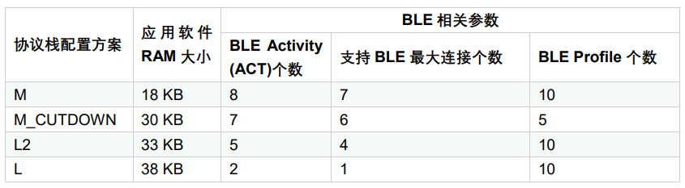
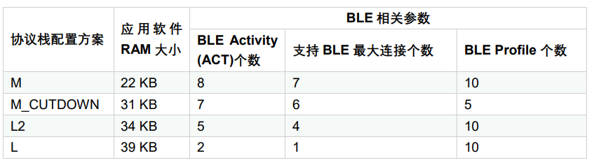
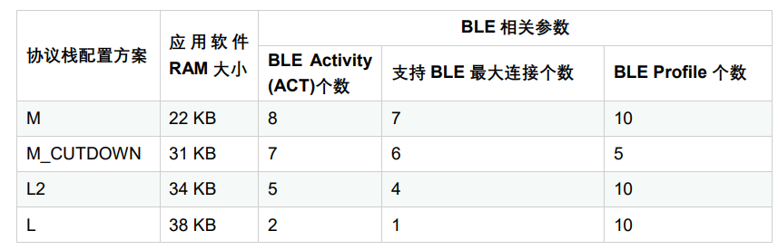
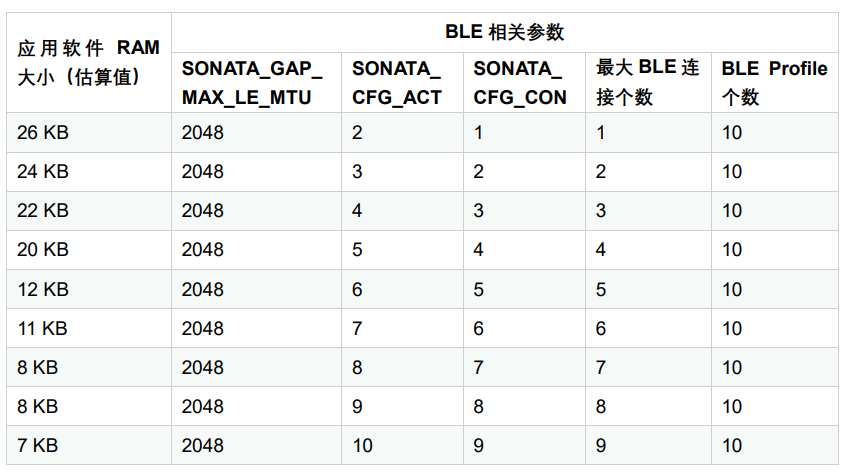

.. role:: raw-latex(raw)
   :format: latex
..

ASR560X 系列内存布局配置应用手册
===============================
`English <https://asriot.readthedocs.io/en/latest/ASR560X/Quick-Start/Memory_Layout_Configuration.html>`_

前言
----

**关于本文档**

本文档主要介绍如何根据实际应用需求，调整 ASR560X 的 BLE 协议栈 RAM 消耗，从而最大化利用芯片协议栈和 RAM 资源。

**读者对象**

本文档主要适用于以下工程师：

-  单板硬件开发工程师
-  软件工程师
-  技术支持工程师

**产品型号**

本文档适用于 ASR560X 系列蓝牙芯片。

+---------+----------------------------------------------------------------------------------------+----------+--------------+----------------------------------------------------------------------------------+
| Model   | Protocol                                                                               | Core     | SiP Flash    | Function                                                                         |
+=========+========================================================================================+==========+==============+==================================================================================+
| ASR560X | BLE 5.1 full feature (compatible with 5.2) BLE SIG Mesh IEEE 802.15.4 2.4G Proprietary | ARM CM0+ | 1 MB/ 512 KB | AOA/AOD/Voice/IRTxRx/ Quadrature Decoder/Keypad/5V UART/5V GPIO/Wi-Fi concurrent |
+---------+----------------------------------------------------------------------------------------+----------+--------------+----------------------------------------------------------------------------------+

**版权公告**

版权归 © 2023 翱捷科技股份有限公司所有。保留一切权利。未经翱捷科技股份有限公司的书面许可，不得以任何形式或手段复制、传播、转录、存储或翻译本文档的部分或所有内容。

**商标声明**

ASR、翱捷和其他翱捷商标均为翱捷科技股份有限公司的商标。

本文档提及的其他所有商标名称、商标和注册商标均属其各自所有人的财产，特此声明。

**免责声明**

翱捷科技股份有限公司对本文档内容不做任何形式的保证，并会对本文档内容或本文中介绍的产品进行不定期更新。

本文档仅作为使用指导，本文的所有内容不构成任何形式的担保。本文档中的信息如有变更，恕不另行通知。

本文档不负任何责任，包括使用本文档中的信息所产生的侵犯任何专有权行为的责任。

**防静电警告**

静电放电（ESD）可能会损坏本产品。使用本产品进行操作时，须小心进行静电防护，避免静电损坏产品。

**翱捷科技股份有限公司**

地址：上海市浦东新区科苑路 399 号张江创新园 10 号楼 9 楼 邮编：201203

官网： http://www.asrmicro.com/

**文档修订历史**

======= ====== ========================
日期    版本号 发布说明
======= ====== ========================
2023.06 V1.3.0 基于SDK V1.8.0进行调整。
======= ====== ========================

1. 概述
-------

ASR560X 共计 96 KB RAM 空间，BLE 协议栈会根据不同的 BLE Activity (ACT) 和 Profile 数量，消耗不同的 RAM。协议栈消耗 RAM 多，用户 APP 可用的 RAM 空间相应地会减少。

本文将介绍如何根据实际应用需求，调整 BLE 协议栈 RAM 消耗，最大化利用芯片协议栈和 RAM 资源。

2. 资源配置方案
---------------

SDK 提供了\ **基础RAM配置方案**\ 、\ **多连接动态RAM配置方案**\ 和\ **BLE外围设备（大RAM空间）配置方案**\ 。

用户需要基于应用需求（需要支持的最大 BLE 连接个数和 Profile 个数以及应用软件 RAM 消耗情况），选择相应的协议栈配置方案。

关于\ **BLE ACT数量**\ ，请注意：

1. 可连接的广播在未连接状态会占用 2 个 ACT，连接成功后占用 1 个 ACT；

2. 若打开 BLE 扫描操作（SCAN），系统会配置为始终容纳 scan 活动，因此会固定预留一个 ACT（不释放）直到系统重启。

以下将分别针对上述配置方案进行介绍。

2.1 基础配置方案
~~~~~~~~~~~~~~~~

基础配置方案包括如下 4 种：M、M_CUTDOWN、L2、L。

不同的 demo 使用不同的协议栈配置方案，具体可查看《ASR560X 系列_SDK 固件类型和烧录说明》文档。不同的配置方案对应的资源不一样，请参考下表。

.. attention::
    不同的 SDK 版本相应的配置有差异。

.. raw:: html

   

**表 2‑1 SDK 1.6.0 版本前的资源情况**

.. raw:: html

   

|image1|

.. raw:: html

   

**表 2-2 SDK 1.6.0 – 1.7.1 版本的资源情况**

.. raw:: html

   

|image2|

.. raw:: html

   

**表 2‑3 SDK 1.8.0 版本后的资源情况**

.. raw:: html

   

|image3|

.. raw:: html

   

**表 2-4 协议栈配置信息 1**

.. raw:: html

   

+--------------------+-----------------------------+-------------------------------------+--------------------------------+
| **协议栈配置方案** | **宏定义**                  | **符号表配置方案**                  | **BLE协议栈固件**              |
+====================+=============================+=====================================+================================+
| M                  | CFG_BLE_HL_LL_ROM_M         | sonata_hl_ll_rom_m_symbol.txt       | sonata_hl_ll_rom.bin           |
+--------------------+-----------------------------+-------------------------------------+--------------------------------+
| M_CUTDOWN          | CFG_BLE_HL_LL_ROM_M_CUTDOWN | sonata_hl_ll_rom_cutdown_symbol.txt | sonata_hl_ll_rom_m_cutdown.bin |
+--------------------+-----------------------------+-------------------------------------+--------------------------------+
| L2                 | CFG_BLE_HL_LL_ROM_L2        | sonata_hl_ll_rom_l2_symbol.txt      | sonata_hl_ll_rom_l2.bin        |
+--------------------+-----------------------------+-------------------------------------+--------------------------------+
| L                  | CFG_BLE_HL_LL_ROM_L         | sonata_hl_ll_rom_l_symbol.txt       | sonata_hl_ll_rom_l.bin         |
+--------------------+-----------------------------+-------------------------------------+--------------------------------+

.. raw:: html

   

**表 2‑5 协议栈配置信息 2**

.. raw:: html

   

================== ===============================
**协议栈配置方案** **Core Lib**
================== ===============================
M                  lib_sonata_ble_core.a
M_CUTDOWN          lib_sonata_ble_core_m_cutdown.a
L2                 lib_sonata_ble_core_l2.a
L                  lib_sonata_ble_core_l.a
================== ===============================

.. raw:: html

   

**表 2-6 SDK 1.6.0 版本前的内存配置信息**

.. raw:: html

   

================== ============ ================== ==================
**协议栈配置方案** **栈顶地址** **RAM Layout配置** **应用RAM Length**
================== ============ ================== ==================
M                  0x20005000   RAM_104K_EM_24K    18 KB
M_CUTDOWN          0x20008000   RAM_104K_EM_24K    30 KB
L2                 0x20008C00   RAM_112K_EM_16K    33 KB
L                  0x2000A000   RAM_112K_EM_16K    38 KB
================== ============ ================== ==================

.. raw:: html

   

**表 2-7 SDK 1.6.0 – 1.7.1 版本的内存配置信息**

.. raw:: html

   

================== ============ ================== ==================
**协议栈配置方案** **栈顶地址** **RAM Layout配置** **应用RAM Length**
================== ============ ================== ==================
M                  0x20006000   RAM_104K_EM_24K    22 KB
M_CUTDOWN          0x20008400   RAM_104K_EM_24K    31 KB
L2                 0x20009000   RAM_112K_EM_16K    34 KB
L                  0x2000A400   RAM_112K_EM_16K    39 KB
================== ============ ================== ==================

.. raw:: html

   

**表 2-8 SDK 1.8.0 版本后的内存配置信息**

.. raw:: html

   

================== ============ ================== ==================
**协议栈配置方案** **栈顶地址** **RAM Layout配置** **应用RAM Length**
================== ============ ================== ==================
M                  0x20006000   RAM_104K_EM_24K    22 KB
M_CUTDOWN          0x20008400   RAM_104K_EM_24K    31 KB
L2                 0x20009000   RAM_112K_EM_16K    34 KB
L                  0x2000A000   RAM_112K_EM_16K    38 KB
================== ============ ================== ==================

2.2 多连接动态 RAM 配置方案
~~~~~~~~~~~~~~~~~~~~~~~~~

SDK 提供了一种多连接动态 RAM 协议栈配置方案：sonata_dyna_hl_ll_rom。SDK 默认只有 sonata_dyna_hl_ll_app_rel demo 使用此配置方案，以下将使用此 demo 举例说明。

.. attention::
    sonata_dyna_hl_ll_app_rel demo 已包含基本的多连接功能，会占用一部分 RAM 空间。

用户可以在 sonata_dyna_hl_ll_app_rel 工程目录下的 sonata_stack_user_config.h 文件调整协议栈支持的连接个数，主要调整SONATA_CFG_ACT、SONATA_CFG_CON 这 2 个宏定义，需要满足 SONATA_CFG_ACT>=( SONATA_CFG_CON+1)。SONATA_GAP_MAX_LE_MTU 默认为 2048，如项目没有使用 Pin/OOB 配对功能，可以调小 SONATA_GAP_MAX_LE_MTU 宏的值（不建议低于 512）释放更多可用 RAM 给到应用层。配置位置可以参考下图：

|image4|

.. raw:: html

   

**表 2-9 多连接动态 RAM 配置方案资源情况**

.. raw:: html

   

|image5|

.. raw:: html

   

**表2-10 多连接动态 RAM 协议栈配置信息**

.. raw:: html

   

+-----------------+----------------------------------+---------------------------+------------------------------+
| **宏定义**      | **符号表配置方案**               | **BLE协议栈固件**         | **Core Lib**                 |
+=================+==================================+===========================+==============================+
| **APP_COMPILE** | sonata_dyna_hl_ll_rom_symbol.txt | sonata_dyna_hl_ll_rom.bin | lib_sonata_dyna_hl_ll_core.a |
+-----------------+----------------------------------+---------------------------+------------------------------+

.. raw:: html

   

**表2-11 多连接动态 RAM 内存配置信息**

.. raw:: html

   

+--------------------+--------------------+--------------+--------------------+-------------------------+
| **SONATA_CFG_ACT** | **SONATA_CFG_CON** | **栈顶地址** | **RAM Layout配置** | **应用** **RAM Length** |
+====================+====================+==============+====================+=========================+
| 2                  | 1                  | 0x2001C000   | RAM_112K_EM_16K    | 67 KB                   |
+--------------------+--------------------+--------------+--------------------+-------------------------+
| 3                  | 2                  | 0x2001C000   | RAM_112K_EM_16K    | 67 KB                   |
+--------------------+--------------------+--------------+--------------------+-------------------------+
| 4                  | 3                  | 0x2001C000   | RAM_112K_EM_16K    | 67 KB                   |
+--------------------+--------------------+--------------+--------------------+-------------------------+
| 5                  | 4                  | 0x2001C000   | RAM_112K_EM_16K    | 67 KB                   |
+--------------------+--------------------+--------------+--------------------+-------------------------+
| 6                  | 5                  | 0x2001A000   | RAM_104K_EM_24K    | 59 KB                   |
+--------------------+--------------------+--------------+--------------------+-------------------------+
| 7                  | 6                  | 0x2001A000   | RAM_104K_EM_24K    | 59 KB                   |
+--------------------+--------------------+--------------+--------------------+-------------------------+
| 8                  | 7                  | 0x2001A000   | RAM_104K_EM_24K    | 59 KB                   |
+--------------------+--------------------+--------------+--------------------+-------------------------+
| 9                  | 8                  | 0x2001A000   | RAM_104K_EM_24K    | 59 KB                   |
+--------------------+--------------------+--------------+--------------------+-------------------------+
| 10                 | 9                  | 0x2001A000   | RAM_104K_EM_24K    | 59 KB                   |
+--------------------+--------------------+--------------+--------------------+-------------------------+

2.3 BLE 外围设备（大 RAM 空间）配置方案
~~~~~~~~~~~~~~~~~~~~~~~~~~~~~~~~~~~~

SDK 提供一种 BLE 外围设备（大 RAM 空间）配置方案：sonata_dyna_hl_ll_peripheral_only_rom。\ **此配置方案可以提供大 RAM 空间给到 APP 使用，但有如下限制：设备只能用作 BLE 外围设备，即支持广播以及被扫描和连接功能，不支持主机相关功能，即不支持主动扫描或者发起连接功能。**

SDK 默认只有 sonata_dyna_hl_ll_peripheral_only_app_rel demo 使用此配置方案，以下将使用此 demo 举例说明。

.. attention::
    sonata_dyna_hl_ll_peripheral_only_app_rel demo 已包含基本的多连接功能，会占用一部分 RAM 空间。

SONATA_GAP_MAX_LE_MTU 默认为 2048，如果项目没有使用 Pin/OOB 配对功能，可以调小 SONATA_GAP_MAX_LE_MTU 宏的值（不建议低于 512）释放更新可用 RAM 给到应用层。

.. raw:: html

   

**表2-12 BLE 外围设备（大 RAM 空间）配置方案资源情况**

.. raw:: html

   

|image6|

.. raw:: html

   

**表2-13 BLE 外围设备（大 RAM 空间）配置信息**

.. raw:: html

   

+---------------------------------------------------+--------------------------------------------------+-------------------------------------------+----------------------------------------------+
| **宏定义**                                        | **符号表配置方案**                               | **BLE协议栈固件**                         | **Core Lib**                                 |
+===================================================+==================================================+===========================================+==============================================+
| **APP_COMPILE**\ 、CFG_DYNA_HL_LL_PERIPHERAL_ONLY | sonata_dyna_hl_ll_peripheral_only_rom_symbol.txt | sonata_dyna_hl_ll_peripheral_only_rom.bin | lib_sonata_dyna_hl_ll_peripheral_only_core.a |
+---------------------------------------------------+--------------------------------------------------+-------------------------------------------+----------------------------------------------+

.. raw:: html

   

**表2-14 BLE 外围设备（大 RAM 空间）内存配置信息**

.. raw:: html

   

+--------------------+--------------------+--------------+--------------------+---------------------+
| **SONATA_CFG_ACT** | **SONATA_CFG_CON** | **栈顶地址** | **RAM Layout配置** | **应用** RAM Length |
+====================+====================+==============+====================+=====================+
| 2                  | 1                  | 0x2001E000   | RAM_120K_EM_8K     | 93 KB               |
+--------------------+--------------------+--------------+--------------------+---------------------+

3. 切换协议栈配置方案步骤
-------------------------

切换协议栈配置方案主要涉及到工程中的如下几个文件：

-  gcc.ld：位于工程 cfg 目录下。例如：projects:raw-latex:`\sonata`:raw-latex:`\sonata`\_hl_peripheral_rel:raw-latex:`\cfg`:raw-latex:`\gcc`.ld
-  config.mk：位于工程编译脚本目录下。例如：build:raw-latex:`\build`\_rules:raw-latex:`\project`:raw-latex:`\sonata`\_hl_peripheral_demo:raw-latex:`\config`.mk
-  startup_cm0p.S：位于工程 src 目录下。例如：projects:raw-latex:`\sonata`:raw-latex:`\sonata`\_hl_peripheral_rel:raw-latex:`\src`:raw-latex:`\startup`\_cm0p.S

以下将以 sonata_hl_peripheral_demo 为例说明如何将协议栈配置方案由 M 切换到 L。

3.1 修改 Core Lib
~~~~~~~~~~~~~~~~

参考表 2-5，将 config.mk $(NAME)_PRE_LIB 项中的 lib_sonata_ble_core.a 替换为 lib_sonata_ble_core_l.a，如下图所示：

|image7|

3.2 修改宏定义
~~~~~~~~~~~~~~

参考表 2-4，将 config.mk $(NAME)_CFLAGS 项中 -DCFG_BLE_HL_LL_ROM_M 修改为 -DCFG_BLE_HL_LL_ROM_L。

.. attention::
    如果-DCFG_BLE_HL_LL_ROM_M不存在，则增加-DCFG_BLE_HL_LL_ROM_L 即可。

|image8|

3.3 修改符号表
~~~~~~~~~~~~~~

参考表 2-4，将 config.mk LINKER_MISC_ROM_ELF_PATH 项中 sonata_hl_ll_rom_symbol.txt 修改为 sonata_hl_ll_rom_l_symbol.txt。如下图所示：

|image9|

3.4 修改启动代码
~~~~~~~~~~~~~~~~

参考表 2-6/表 2-7/表 2-8，将 startup_cm0p.S 中的 movs r1, #RAM_104K_EM_24K 修改为 movs r1, #RAM_112K_EM_16K：

|image10|

3.5 修改栈顶地址和 RAM 大小
~~~~~~~~~~~~~~~~~~~~~~~~~

参考表 2-6/表 2-7/表 2-8（请留意不同的 SDK 会有差异），修改栈顶地址（_estack）和用户可用RAM 的大小。如下所示：

|image11|

3.6 烧录对应配置的协议栈文件
~~~~~~~~~~~~~~~~~~~~~~~~~~~~

参考表 2-4，烧录固件时，烧录工具需选择对应的 BLE 协议栈固件。

4.使用工具切换协议栈配置方案
----------------------------

从 SDK V1.6.3 开始，SDK tools 目录下提供了可用于一键调整协议栈配置方案的 ChangeRom 工具。如下图：

|image12|

用户可以在工具中选择需要调整的协议栈配置方案工程文件以及需要切换的 ROM，然后点击修改即可。

.. attention::
    基础配置方案的切换需要使用通用 ROM 页面的设置，多连接动态 RAM 配置方案的切换需要使用 Dynamic ROM 页面的设置。工具调整后请检查对应的值是否被正确修改。

.. |image4| image:: ../../img/560X_内存布局配置/图2-1.png

.. |image6| image:: ../../img/560X_内存布局配置/表2-12.png
.. |image7| image:: ../../img/560X_内存布局配置/图3-1.png
.. |image8| image:: ../../img/560X_内存布局配置/图3-2.png
.. |image9| image:: ../../img/560X_内存布局配置/图3-3.png
.. |image10| image:: ../../img/560X_内存布局配置/图3-4.png
.. |image11| image:: ../../img/560X_内存布局配置/图3-5.png
.. |image12| image:: ../../img/560X_内存布局配置/图4-1.png
