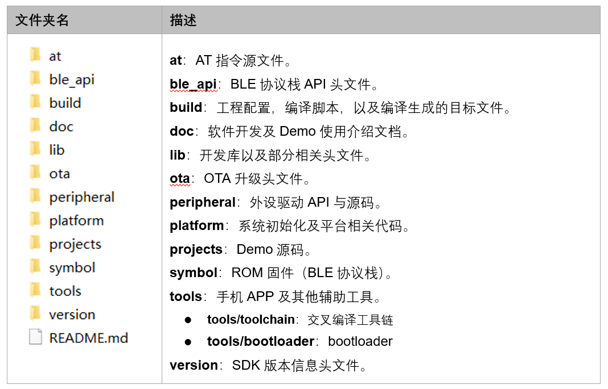
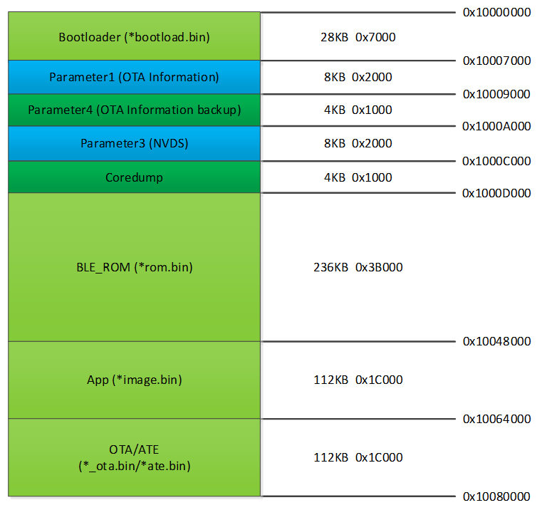
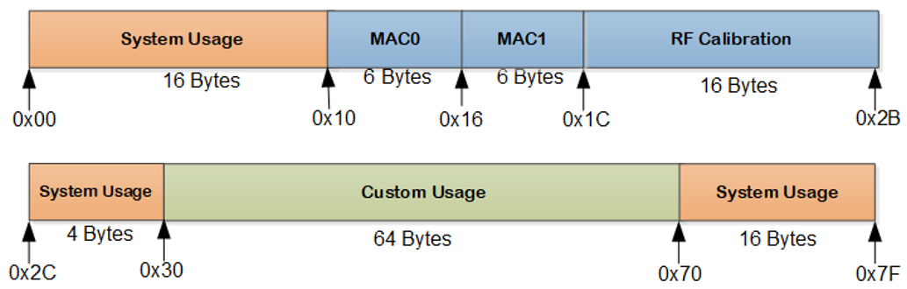
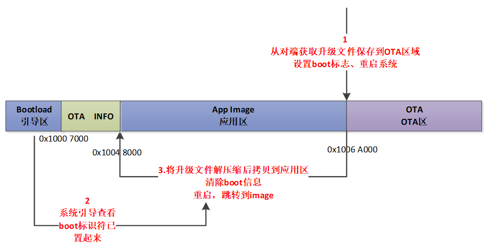
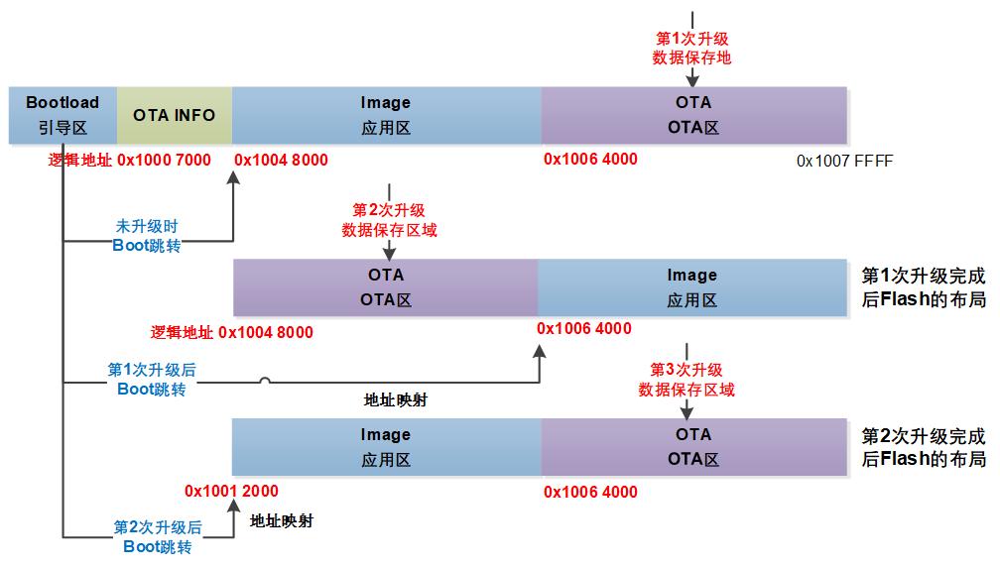

.. role:: raw-latex(raw)
   :format: latex
..

**ASR560X系列** 开发入门指南
============================
`English <https://asriot.readthedocs.io/en/latest/ASR560X/Quick-Start/Developer_Guide.html>`_

前言
----

**关于本文档**

本文档为用户提供 ASR560X 系列 BLE 蓝牙芯片的开发指南。阅读本文档前，请先阅读芯片的技术规格书\ *ASR560X Series_Datasheet*\ ，以便对 ASR560X 系列芯片形成一定的了解。

**读者对象**

本文档主要适用于以下工程师：

-  单板硬件开发工程师
-  软件工程师
-  技术支持工程师

**产品型号**

本文档适用于 ASR560X 系列蓝牙芯片。

+---------+----------------------------------------------------------------------------------------+----------+--------------+------------------------------------------------------------------------------------+
| Model   | Protocol                                                                               | Core     | SiP Flash    | Function                                                                           |
+=========+========================================================================================+==========+==============+====================================================================================+
| ASR560X | BLE 5.1 full feature (compatible with 5.2) BLE SIG Mesh IEEE 802.15.4 2.4G Proprietary | ARM CM0+ | 1 MB/ 512 KB | AOA/AOD/Voice/IRTxRx/ Quadrature Decoder/Keypad/ 5V UART/5V GPIO/ Wi-Fi concurrent |
+---------+----------------------------------------------------------------------------------------+----------+--------------+------------------------------------------------------------------------------------+

**版权公告**

版权归 © 2023 翱捷科技股份有限公司所有。保留一切权利。未经翱捷科技股份有限公司的书面许可，不得以任何形式或手段复制、传播、转录、存储或翻译本文档的部分或所有内容。

**商标声明**

ASR、翱捷和其他翱捷商标均为翱捷科技股份有限公司的商标。

本文档提及的其他所有商标名称、商标和注册商标均属其各自所有人的财产，特此声明。

**免责声明**

翱捷科技股份有限公司对本文档内容不做任何形式的保证，并会对本文档内容或本文中介绍的产品进行不定期更新。

本文档仅作为使用指导，本文的所有内容不构成任何形式的担保。本文档中的信息如有变更，恕不另行通知。

本文档不负任何责任，包括使用本文档中的信息所产生的侵犯任何专有权行为的责任。

**防静电警告**

静电放电（ESD）可能会损坏本产品。使用本产品进行操作时，须小心进行静电防护，避免静电损坏产品。

**翱捷科技股份有限公司**

地址：上海市浦东新区科苑路399号张江创新园10号楼9楼 邮编：201203

官网： http://www.asrmicro.com/

**文档修订历史**

======== ========== ================
**日期** **版本号** **发布说明**
======== ========== ================
2022.07  V1.3.0     更新了部分描述。
======== ========== ================

1. 平台相关
-----------

1.1 简介
~~~~~~~~

ASRBLE_NONOS_SDK 是基于 ASR560X BLE 芯片硬件平台的软件开发包，为开发者提供了一系列丰富的模块和示例工程。包括 bootloader、BLE 功能应用、Mesh 功能应用以及外设驱动程序等。

SDK 提供的 BLE 和外设相关 API 接口统一以 sonata 关键字做前缀，目前 SDK 不支持操作系统。

1.2 软件开发平台
~~~~~~~~~~~~~~~~

SDK 软件包中的内容如下所示：

|image1|

关于开发环境搭建的详细内容，请参考文档《ASR560X 系列_开发环境搭建与编译指南》。

1.3 开发板
~~~~~~~~~~

ASR 提供的 QFN32 开发板如下图所示：

|image2|

图中标记的 9 部分为：

①ASR560X 及外围电路

②运行模式选择和复位电路

③供电选择电路

④UART0/UART1 复用选择电路

⑤ASR560X GPIO 引出接口

⑥上拉电阻接口

⑦SWD 调试接口

⑧按键接口

⑨电源输入和控制接口

用户执行固件烧录动作和程序运行的步骤如下：

1. 使用 MiniUSB 通过 FT232 USB 转串口芯片与 ASR560X 的 UART1 连接，跳线帽配置如上图红框 3、4 所示。

2. 打开 PC 上的 DOGO 工具，选择开发板对应的串口号，设置波特率为 115200 bps，选择芯片类型为 560X，红框 2 中 J6-1 和 J6-2 用跳线帽连接。

3. 按下红框 2 中的 Reset 按键，若 DOGO 工具界面显示 “1F2E3D00”，说明开发板进入下载模式。

4. 当用户烧写完程序，将 J6-2 和 J6-3 用跳线帽短接，按下 Reset 按键，开发板进入程序运行模式，SDK 大部分 demo 默认使用 UART1 作为 log 打印输出口。

目前 ASR 提供了 QFN32 和 QFN48 两款开发板，不同的开发板使用的跳线也有所不同。关于开发板使用的详细说明，请参考文档《ASR560X 系列_开发板用户指南》。

2.固件和烧录
------------

2.1 固件
~~~~~~~~

ASR560X 的固件及其功能说明如下：

-  **ASRBOOTLOADER-560XXXXX.bin**\ ：引导程序，由原厂提供，默认放在 SDK tools/ bootloader 目录下。该固件使用 UART1 (P04, P05) 作为通讯口。
-  **app_image.bin**\ ：开发者基于 SDK 平台开发生成的应用程序bin档。
-  **sonata_hl_ll_rom_XXX.bin**\ ：BLE 协议栈固件，由原厂提供，默认放在 SDK symbol/ sonata 目录下。用户可根据应用资源的消耗情况选择不同的协议栈固件，具体请参考《ASR560X 系列_内存布局配置应用手册》。
-  **ASR_560X_ATE_XXXX.bin**\ ：RF 产测校准固件（需要配合相关仪器使用），由原厂提供，使用 UART1 作为通讯口。用户根据实际需求评估使用。
-  **app_image_ota.bin**\ ：OTA 升级固件。通过 *image_gen_header* 命令配置生成，具体请参考第\ *3.7节：OTA 升级*\ 。

​.. note:: 
    若在对应目录下未找到固件，或需要获取最新固件，均可与代理商或 ASR 原厂联系。

2.2 烧录
~~~~~~~~

1. ASR560X 系列芯片可以通过 UART1 串口（P04, P05）将固件烧录到 flash 中。

2. 系统正常运行只需将 bootload.bin & image.bin 烧入到 flash 中即可。如果烧录的是 BLE demo 固件，则需要额外烧录对应的 ROM 固件，具体请参考《ASR560X 系列_固件类型和烧录介绍》。

3. ASR 原厂提供 PC 端 DOGO 工具，用于烧录以及串口调试。关于 DOGO 工具使用，请参考文档《ASR560X_BLE 编程工具用户手册》。

3.软件资源
----------

3.1 Flash
~~~~~~~~~

ASR560X SoC 内置512 KB/1 MB Flash，Flash 每个 block 大小为 4 KB。ASR560X 的 Flash 分区如下图所示（以512 KB Flash 为例），实际分区可能略有差异，请以SDK \*\ **sonata_board.c\*** 中的分区定义为准。

|image3|

1. **Bootloader 引导区（28 KB，起始地址0x1000 0000）**\ ：ASRBOOTLOADER-560XXXXX.bin 烧录到此分区。

2. **Parameter1 (OTA information) 信息区（8 KB，起始地址0x1000 7000）**\ ：存储\ **OTA**\ 信息和标志。

3. **Parameter4 (OTA information backup) 信息区（4 KB，起始地址0x1000 9000）**\ ：备份\ **OTA**\ 信息和标志。

4. **NVDS 信息区（8 KB，起始地址0x1000 A000）**\ ：默认用于以 NVDS 格式存储系统和用户数据。MAC 地址可选择存储在此区域。

5. **Coredump信息区（4 KB，起始地址0x1000 C000）**\ ：Coredump 信息保存区域，如果使用 SDK 开发时不开启 SYSTEM_COREDUMP 宏，用户可以使用此 4 KB 分区用于存储自定义信息。

6. **BLE 协议栈区（236 KB，起始地址0x1000 D000）**\ ：BLE 协议栈固件存储区，需要将 sonata_hl_ll_rom_XXX.bin 烧录到此分区。

7. **App image 区（112 KB，起始地址0x1004 8000）**\ ：应用程序存储区，应用程序烧录到此分区。

8. **OTA/ATE 区（112 KB，起始地址0x1006 4000）**\ ：OTA/ATE 程序存储区，OTA 升级固件和射频校准的 ATE 固件（如果需要的话）烧录到此分区。

.. attention::
    1. 第一次 OTA 升级时会将产测中所用的 ATE.bin 覆盖掉。
    2. 在地址映射 OTA 升级时，app_image 分区和 OTA 分区是不断交换的，具体可参见 3.7 OTA 升级章节。
    3. 建议不要轻易更改分区 layout 定义，否则系统会有无法启动或数据丢失的风险。如果开发者需要修改分区大小或增加新的分区，注意 Bootloader/NVDS/App image/OTA 这几个分区的起始地址不能改变。

3.2 RAM
~~~~~~~

ASR560X 系列产品内置 96 KB RAM。

RAM 划分为 data、Function Seg、bss、stack 和 heap 这几个段，其布局如下图所示：

|image4|

用户可用的 RAM 大小与使用的 BLE 协议栈关系密切；BLE 协议栈支持的可连接数量越多，profile 数量越多，那么用户可使用的 RAM 资源就越少。

SDK 提供的 BLE demo 已经配置了协议栈使用方案，用户可通过查看 build:raw-latex:`\build`\_rules:raw-latex:`\project`:raw-latex:`\XXXXXXX`:raw-latex:`\config`.mk 文件来确定对应工程使用协议栈的方案，具体请参考《ASR560X_固件类型和烧录介绍》。

如果需要修改用户 RAM 的大小，调整 RAM 资源分配，请参考《ASR560X 系列_内存布局配置应用手册》。

3.3 EFuse
~~~~~~~~~

ASR560X 系列内置 1 Kbits 的 eFuse 存储空间。EFuse 区域的值仅能写一次，可多次读。对 eFuse 进行写操作时，必须先打开 LDO。EFuse 的功能分区如下图所示：

|image5|

.. attention::
    EFuse 区域的特点是只能从 ‘0’ 变成 ‘1’（这也是仅能写一次的原因），系统提供操作 eFuse 的最小单位为 Byte。如果用户强制重写 eFuse 区域，则会得到与预期不一样的值。例如第一次写值 0x15 后, 再次写值 0x43，最终 eFuse 中存储的值为 0x57 (0x15|0x43).

3.4 BLE API
~~~~~~~~~~~

BLE API 的说明请参考 SDK doc 目录下《ASR560X_BLE_API》。

3.5 低功耗模式
~~~~~~~~~~~~~~

低功耗配置使用请参考 SDK doc 目录下《ASR5601X_BLE 低功耗应用指南》。

3.6 MAC 地址
~~~~~~~~~~~

实际产品中 MAC 地址由用户在量产烧录或者 RF 产测时，通过烧录、测试工具写入到 efuse 存储器中。最多支持烧录 2 次 MAC 地址到 efuse 区域（实际上是牺牲 efuse 的空间换取 2 次烧录机会）。

SDK 提供如下接口，用于读/写 MAC 地址信息

-  sonata_get_bt_address()

   功能：

   如果 efuse 中有写入 MAC 地址，则返回 efuse 中的 MAC 地址；

   如果 efuse 未写入 MAC 地址，NVDS 有写入，则返回 NVDS 中的 MAC 地址；

   如果 efuse&NVDS 都未写入过 MAC 地址，系统将产生一个静态随机地址，并将该地址存储至 NVDS 区域。

-  sonata_set_bt_address()

功能：将地址保存到 Flash 的 NVDS 区中，目前存储格式为小端模式。

3.7 OTA 升级
~~~~~~~~~~~

3.7.1 概述
^^^^^^^^^^

app.bin 升级目前支持 REMAPPING 和 COMPRESS 两种方式，编译工程生成的 OTA bin 文件默认为地址映射方式。若需要压缩拷贝的方式则可借助使用 tools/ota_bin_gen 目录下的 image_gen_header 工具去生成相应的 OTA bin 文件。

ota.bin 在原始固件的头部添加了长度为 128 Bytes 的 OTA 控制信息，控制信息包含版本号、升级方式、CRC 校验等信息。其中版本号可以用于版本升级检测，此功能默认关闭（无版本检查功能）。

ROM 固件对应的 OTA bin 文件可使用 tools/ota_bin_gen 目录下的 image_gen_header 工具生成（ROM 不存在 REMAPPING 和 COMPRESS 方式之分）。

**image_gen_header 工具使用说明：**

**Image_gen_header.exe 参数 1 -d 参数 2 -b 参数 3 -t 参数 4**\ （有大小写区分）

参数1：应用程序 bin 文件名

参数2：-d (必须使用 SONATA)，设置芯片类型，用于生成 OTA 固件的 image_token。

参数3：-b (根据应用选择 COMPRESS 或 REMAPPING 方式)，用于设置 OTA 固件升级的实现方式。

参数4：-t (可缺省，参数 4：APP, ROM)，用于设置 image 是 APP 升级固件或是 ROM 升级固件，缺省时默认是生成 APP 升级固件。

OTA 固件的配置脚本在 build/rules/project/***demo/gen_ota_bin.mk 路径中。在编译生成 bin 文件的时候，SDK 会根据此脚本在工程 out 目录下自动生成 OTA 的 bin 文件。

为了生成不同升级策略的 app_image_ota.bin, 用户需要在 tools/ota_bin_gen 目录下找到 image_gen_header 可执行文件，并根据需求按如下说明进行配置且生成 app_image_ota.bin。

示例：\ **./image_gen_header.exe** sonata_hl_data_trans_demo.bin -d SONATA -b REMAPPING -t APP

1. 首先将需要生成 OTA bin 文件的原 bin 文件拷贝在该工具的目录下。

2. 运行此命令后，在该工具的文件夹下会生成 sonata_hl_data_trans_demo_ota.bin。

3.7.2 压缩拷贝（COMPRESS）
^^^^^^^^^^^^^^^^^^^^^^^^^^

以 512 KB 内置 Flash 举例说明如下：

|image6|

压缩拷贝升级主要流程如上图所示：

1. 应用从对端获取到升级数据后，会先将数据写入至 OTA 分区对应的 Flash 地址。在写入数据的过程中系统会做一些安全检查，例如版本检查（默认未开启此功能）、传输数据的校验等，当安全检查未通过时系统返回错误信息，升级失败。只有当安全检查通过系统才设置 boot 标志位，表明 OTA 分区中升级 bin 文件有效，且系统重启。

2. 系统重启，在 bootloader 阶段会对 boot 标志位进行检查。

3. 当检查到升级标志位生效，bootloader 首先会校验 OTA 分区中压缩数据的有效性，校验通过后会将 OTA 区域中的数据解压缩，并拷贝到 app_image 分区。如果有效性检查未通过则清除 OTA INFO 区中的 OTA 标志位，然后跳转到 app_image 区运行。

4. 拷贝完成后会对数据完整性进行检查。

5. 数据完整则清除 OTA INFO 区中 boot 的标志位。

6. 因为升级标志位被清除，后续 bootloader 将直接跳转至 app_image 区域运行。

3.7.3 地址映射（REMAPPING）
^^^^^^^^^^^^^^^^^^^^^^^^^^^

以512 KB 内置 Flash 举例说明如下：

|image7|

地址映射升级的主要实现如上图，其依赖于系统对逻辑地址和 Flash 物理地址的映射功能。

1. 第一次升级时，会先将 OTA 数据写入至逻辑地址 0x1006 4000 的位置。在写入数据的过程中系统会做一些安全检查，例如版本检查（默认未开启此功能）、传输数据的校验等，当安全检查未通过时系统返回错误信息，升级失败。只有当安全检查通过系统才设置 boot 标志位，表明 OTA 分区中升级 bin 文件有效，且系统重启。

2. 系统重启，在 bootloader 阶段会对 boot 标志位进行检查。

3. 当检查到升级标志位生效，bootloader 首先会校验升级数据的有效性。

   a) 如果有效性检查未通过，则清除 OTA INFO 区中的 OTA 标志位，维持原有跳转信息不变，跳转到原有应用区运行。

   b) 有效性检验通过，则将 app_image 区和 OTA 区的地址空间（逻辑地址）进行映射交换: app_image 区开始的逻辑地址映射为 0x1006 4000，OTA 区开始的逻辑地址映射为 0x1004 8000，然后 bootloader 会跳转到逻辑地址 0x1006 4000 处开始运行。

4. 第 2 次升级时，将升级数据 app_image_ota.bin 文件保存到逻辑地址 0x1004 8000 的区域，bootloader 会根据映射关系跳转到逻辑地址 0x1004 8000 的地方运行。

5. 后面第 3 次升级可以依次类推，升级文件会在逻辑地址 0x1004 8000和0x1006 4000 的区域上不停交替。程序运行时，bootloader 跳转到 0x1004 8000 的位置，然后根据映射关系，不断在逻辑地址 0x1004 8000 和 0x1006 4000 间切换。

.. note:: 
    从安全角度考虑，建议用户使用地址映射升级方式，并且后续 ASR 也会支持版本回滚功能。如果用户因误操作，升级了不正确的固件，导致设备异常，用户需要自己承担责任。
    

3.7.4 OTA 接口
^^^^^^^^^^^^^

SDK 关于 OTA 功能的接口声明在 ota:raw-latex:`\ota`\_download.h 中，下面对主要 API 进行描述：

-  **int sonata_ota_init (const char \*version, uint32_t \*break_point)**

+-----------+--------------------------------------------------------------------------------------------------------------------------------------------------------------------------+
| **Items** | **Description**                                                                                                                                                          |
+===========+==========================================================================================================================================================================+
| Function  | 初始化OTA功能，擦除Flash中OTA information区域的数据，为本次升级做准备。                                                                                                  |
+-----------+--------------------------------------------------------------------------------------------------------------------------------------------------------------------------+
| Param     | **const char \*version:**\ 实际传入当前应用软件的版本，定义在SYS_APP_VERSION_SEG const char app_version[]数组中。 **uint32_t \*break_point**\ ：断点续传参数，暂未使用。 |
+-----------+--------------------------------------------------------------------------------------------------------------------------------------------------------------------------+
| Return    | Result: 0：成功，非0：失败                                                                                                                                               |
+-----------+--------------------------------------------------------------------------------------------------------------------------------------------------------------------------+
| Note      |                                                                                                                                                                          |
+-----------+--------------------------------------------------------------------------------------------------------------------------------------------------------------------------+

-  **int sonata_ota_write (unsigned int \*off, char \*in_buf, int in_buf_len);**

+-----------+----------------------------------------------------------------------------------------------------------------------------------------------------------------------------+
| **Items** | **Description**                                                                                                                                                            |
+===========+============================================================================================================================================================================+
| Function  | 向OTA区域写升级的数据。                                                                                                                                                    |
+-----------+----------------------------------------------------------------------------------------------------------------------------------------------------------------------------+
| Param     | **off**\ ：向OTA分区写数据的位置，例如：开始写数据则为0。 note：写成功后，off表示真实写入数据的长度。 **in_buf**\ ：要写数据的指针buf。 **in_buf_len**\ ：要写数据的长度。 |
+-----------+----------------------------------------------------------------------------------------------------------------------------------------------------------------------------+
| Return    | Result: 0：成功，非0：失败                                                                                                                                                 |
+-----------+----------------------------------------------------------------------------------------------------------------------------------------------------------------------------+
| Note      |                                                                                                                                                                            |
+-----------+----------------------------------------------------------------------------------------------------------------------------------------------------------------------------+

-  **int sonata_ota_read (unsigned int \*off, char \*out_buf, int out_buf_len);**

+-----------+-------------------------------------------------------------------------------------------------------------------------------------------------------------+
| **Items** | **Description**                                                                                                                                             |
+===========+=============================================================================================================================================================+
| Function  | 从OTA区域读数据。                                                                                                                                           |
+-----------+-------------------------------------------------------------------------------------------------------------------------------------------------------------+
| Param     | **off**\ ：从OTA区域读数据的位置。 note：读取成功后，off表示真实读取数据的长度。 **out_buf**\ ：读取数据存放的buf指针。 **out_buf_len**\ ：读取数据的长度。 |
+-----------+-------------------------------------------------------------------------------------------------------------------------------------------------------------+
| Return    | Result: 0：成功，非0：失败                                                                                                                                  |
+-----------+-------------------------------------------------------------------------------------------------------------------------------------------------------------+
| Note      |                                                                                                                                                             |
+-----------+-------------------------------------------------------------------------------------------------------------------------------------------------------------+

-  **int sonata_ota_set_boot (void);**

+-----------+--------------------------------------------------------------------------------------------------------+
| **Items** | **Description**                                                                                        |
+===========+========================================================================================================+
| Function  | 根据bin文件的头信息，校验接收bin文件的完整性，并设置OTA完成的状态和标志，并写入OTA information TAG区。 |
+-----------+--------------------------------------------------------------------------------------------------------+
| Param     | 无                                                                                                     |
+-----------+--------------------------------------------------------------------------------------------------------+
| Return    | Result: 0：成功，非0：失败                                                                             |
+-----------+--------------------------------------------------------------------------------------------------------+
| Note      |                                                                                                        |
+-----------+--------------------------------------------------------------------------------------------------------+

3.8 PIN MUX
~~~~~~~~~~~

 raw:: html

   

**通用IO口Pin Mux-1**

.. raw:: html

   

==== ======== ====== ========= ========= ======== ======
Num. Pin Name Func=0 Func=1    Func=2    Func=3   Func=4
==== ======== ====== ========= ========= ======== ======
1    P00      NA     UART2_TXD I2C0_SCL  I2C1_SCL PWM10
2    P01      NA     UART2_RXD I2C0_SDA  I2C1_SDA PWM11
3    P02      GPIO2  UART0_TXD SPI0_CS   I2C0_SCL PWM0
4    P03      GPIO3  UART0_RXD SPI0_CLK  I2C0_SDA PWM1
5    P04      GPIO4  UART1_TXD SPI0_TXD  I2C1_SCL PWM2
6    P05      GPIO5  UART1_RXD SPI0_RXD  I2C1_SDA PWM3
7    P06      SWC    UART3_TXD SPI1_CS   I2S_SCLK PWM4
8    P07      SWD    UART3_RXD SPI1_CLK  I2S_LRCK PWM5
9    P08      GPIO8  UART2_TXD SPI1_TXD  I2S_DI   PWM6
10   P09      GPIO9  UART2_RXD SPI1_RXD  I2S_MCLK PWM7
11   P10      GPIO10 UART3_TXD IR1       I2S_DO   PWM8
12   P11      GPIO11 UART1_TXD SPI0_CS   I2C1_SCL PWM9
13   P12      GPIO12 UART1_RXD SPI0_CLK  I2C1_SDA PWM10
14   P13      GPIO13 UART3_TXD SPI0_TXD  I2C0_SCL PWM11
15   P14      GPIO14 UART3_RXD SPI0_RXD  I2C0_SDA PWM0
16   P15      GPIO15 UART0_TXD SPI1_CS   I2S_SCLK PWM1
17   P16      GPIO16 UART0_RXD SPI1_CLK  I2S_LRCK PWM2
18   P17      GPIO17 UART0_CTS SPI1_TXD  I2S_DI   PWM3
19   P18      GPIO18 UART0_RTS SPI1_RXD  I2S_MCLK PWM4
20   P19      GPIO19 UART2_TXD SPI0_CS   I2C0_SCL PWM5
21   P20      GPIO20 UART2_RXD SPI0_CLK  I2C0_SDA PWM6
22   P21      GPIO21 UART0_TXD SPI0_TXD  I2C1_SCL PWM7
23   P22      GPIO22 UART0_RXD SPI0_RXD  I2C1_SDA PWM8
24   P23      GPIO23 UART1_TXD SPI1_CS   I2C0_SCL PWM9
25   P24      GPIO24 UART1_RXD SPI1_CLK  I2C0_SDA PWM10
26   P25      GPIO25 UART3_TXD SPI1_TXD  I2C1_SCL PWM11
27   P26      GPIO26 UART3_RXD SPI1_RXD  I2C1_SDA PWM0
28   P27      GPIO27 UART1_TXD UART2_RXD I2C0_SCL PWM1
29   P28      GPIO28 UART1_RXD KEY_ROW4  I2C0_SDA PWM2
30   P29      GPIO29 UART2_TXD KEY_ROW5  I2S_DO   PWM3
==== ======== ====== ========= ========= ======== ======

. raw:: html

   

**通用IO口Pin Mux-2**

.. raw:: html

   

==== ======== ========= ========= ======================= ========
Num. Pin Name Func=5    Func=6    Func=7                  Func=8
==== ======== ========= ========= ======================= ========
1    P00      GPIO0     KEY_COL4  AXIS_2_P                NA
2    P01      GPIO1     KEY_COL5  AXIS_2_N                NA
3    P02      AXIS_0_P  KEY_ROW0  I2S_DI                  SWC
4    P03      AXIS_0_N  KEY_ROW1  I2S_MCLK                SWD
5    P04      UART0_CTS KEY_ROW2  LPUART_TXD\ `a <#bb>`__ I2C0_SCL
6    P05      UART0_RTS KEY_ROW3  LPUART_TXD\ `a <#bb>`__ I2C0_SDA
7    P06      AXIS_1_P  KEY_COL0  LPUART_TXD\ `a <#bb>`__ GPIO6
8    P07      AXIS_1_N  KEY_COL1  LPUART_TXD\ `a <#bb>`__ GPIO7
9    P08      AXIS_2_P  KEY_COL2  USB_DP                  NA
10   P09      AXIS_2_N  KEY_COL3  USB_DM                  NA
11   P10      UART0_CTS KEY_ROW4  NA                      NA
12   P11      AXIS_1_N  KEY_ROW4  SWC                     NA
13   P12      I2S_DO    KEY_ROW5  SWD                     NA
14   P13      AXIS_0_P  KEY_COL4  LPUART_TXD              NA
15   P14      AXIS_0_N  KEY_COL5  LPUART_TXD              NA
16   P15      AXIS_1_P  KEY_ROW6  USB_DP                  NA
17   P16      IR0       KEY_ROW7  USB_DM                  NA
18   P17      AXIS_2_P  KEY_COL6  SWC                     NA
19   P18      AXIS_2_N  KEY_COL7  SWD                     NA
20   P19      AXIS_0_P  KEY_ROW8  LPUART_TXD              NA
21   P20      AXIS_0_N  KEY_ROW9  LPUART_TXD              NA
22   P21      AXIS_1_P  KEY_ROW10 NA                      NA
23   P22      AXIS_1_N  KEY_ROW11 NA                      NA
24   P23      AXIS_2_P  KEY_ROW12 LPUART_TXD              NA
25   P24      AXIS_2_N  KEY_ROW13 LPUART_TXD              NA
26   P25      NA        KEY_ROW2  NA                      NA
27   P26      I2S_DO    KEY_ROW3  NA                      NA
28   P27      KEY_COL0  KEY_ROW0  NA                      NA
29   P28      KEY_COL1  KEY_ROW1  NA                      NA
30   P29      KEY_COL2  KEY_ROW4  NA                      NA
==== ======== ========= ========= ======================= ========

-  QFN32 封装有 P00~P10，P27~P29 共 14 个 IO 口。QFN48 封装有 P00~P29 共 30 个 IO 口。其中P27~P29 可配置为 GPIO 或 analog IO。
-  引脚默认配置为 Func=0，如果 pinmux 配置成其它外设功能，需要使用 sonata_pinmux_config API 进行相应的配置。

3.9 外设及注意事项
~~~~~~~~~~~~~~~~~~

外设 API 接口请参考 SDK doc 目录下的《ASR560X 系列_外设用户指南》。

3.9.1 GPIO
^^^^^^^^^^

-  **开机默认驱动模式**

1. 开机默认芯片下拉输入。其中 P00&P01&P27 有特殊处理，不建议复用，具体请参考《ASR560X 系列_硬件设计指南》。

2. 驱动模式中的上拉/下拉都为芯片内部硬件驱动。

-  **支持的驱动模式**

1. 输入上拉：内置上拉电阻大约 50 KΩ

2. 输入下拉：内置下拉电阻大约 50 KΩ

3. 高阻输入

4. 推挽输出

5. 中断模式

6. 支持高电平、低电平、上升沿、下降沿四种触发方式，不支持双沿触发

-  **最大驱动电流**\ ：P02、P03、P04 和 P05 的最大驱动电流为 10 mA，其它最大驱动电流为 20 mA。
-  P27 有测试模式复用判断功能，设计时强烈建议不要用作 GPIO。如确实要使用，禁止作为输入使用，且需确保此 IO 外部没有上拉电路，以免芯片上电时检测到这个口有高电平，导致进入错误的启动模式。
-  P28/P29 配置为上拉输入时，上拉电阻较小，导致外部接到低电平后功耗会比较大，对于功耗要求较高的场景而言，可能存在限制，建议尽量避免将这两个引脚作为输入使用；P28/P29 推挽输出高电平时，在低功耗场景下芯片内部有 10 K 下拉电阻到地，功耗会比较大，对于功耗要求较高的场景而言，可能存在限制，建议尽量避免将这两个引脚作为输出使用。
-  VMICTM/MICP/MICN（P27/P28/P29）不能配置为高阻输入。

3.9.2 ADC
^^^^^^^^^

-  ASR560x 系列有 1 个 ADC 控制器，包括 8 路通用的 ADC、1 路温度采集 ADC、1 路供电电压采集 ADC。48PIN 的芯片从 P06 到 P13 依次对应 ADC CH0 ~ CH7，32PIN 的芯片从 P06 到 P10 依次对应 ADC CH0 ~ CH4，ADC 的应用请参考\ **ASR560X Aux Adc Application Notes**\ 。
-  普通 ADC 检测电压的范围为 0~1.2 V，基准源为 1.2 V。
-  音频通道 ADC 的引脚只能使用 P27、P28、P29，使用方法请参考《ASR560X 系列_硬件设计指南》。

.. _flash-1:

3.9.3 Flash
^^^^^^^^^^^

对 Flash 进行擦除和写动作，需先关闭系统中断。

.. attention::
    对 Flash 写数据不宜过度频繁并且单次写数据量不要过大，因为 BLE 协议栈接收发送数据需中断，长时间关闭中断会对 BLE 数据传输产生影响。

3.9.4 NVDS
^^^^^^^^^^

NVDS 实际是对 Flash 用 key-value 方式的一种封装，方便用户层使用、写、读。NVDS 区的 API 接口分别为：

uint8_t sonata_fs_write(sonata_fs_tag_t tag, sonata_fs_len_t length, uint8_t \*buf)；

uint8_t sonata_fs_read(sonata_fs_tag_t tag, sonata_fs_len_t \* lengthPtr, uint8_t \*buf)。

NVDS 会根据 tag 值来保存和获取数据。例如：

保存 user1 的名字：sonata_fs_write (user1, “ASR”, sizeof(“ASR”), 1)；

获取 user1 的名字：sonata_fs_read (user1, pName, pNameLen)。

.. attention::
    应用层操作 NVDS 区域时，对应的 tag 值必须大于或等于 90。小于 90 的值已经被协议栈使用，应用层禁止使用。

3.10 测试
~~~~~~~~~

RF 测试时需要烧录相应的固件，具体测试固件以及使用方法请联系 ASR。

4.量产
------

项目进入量产阶段后，可以使用 MP_FG、MP_IFP_Pro/MP_Pro 工具进行批量生产，下面分别介绍这些工具的使用。

4.1 MP_FG 工具
~~~~~~~~~~~~~

MP_FG 工具可以将烧录到 Flash 中的 ASRBOOTLOADER-560XXXX.bin/app_image.bin/ sonata_hl_ll_rom_XXX.bin 等多个 bin 整合成一个 bin 档，以供 MP_IFP_Pro 烧录。下图为 MP_FG 工具的界面，如红色部分主要导入 3 个 bin 档，然后单击“Merge”按键合成 bin 档，产生的 bin 档在 output 目录下，具体请参考《MP_FG_Pro 多合一工具操作手册》。

|image8|

4.2 量产烧录工具
~~~~~~~~~~~~~~~~

ASR 提供了 MP_IFP_Pro 量产烧录工具，此工具可以一次将多合一 bin 档中的固件烧录到 Flash 中对应的分区。

MP_IFP_Pro 的特点：

-  支持 20 个设备拼板烧录

-  串口传输速率高达 921600 bps，设备烧录时间短

-  支持烧录 MAC 地址

-  支持频偏校准功能

-  支持写 Flash 区相同数据功能

5. 硬件资源
-----------

5.1 开发板原理图
~~~~~~~~~~~~~~~~

开发板的使用参考文档《ASR560X 系列_开发板用户指南》，ASR 提供开发板原理图、PCB 源文件。

5.2 用户硬件设计手册
~~~~~~~~~~~~~~~~~~~~

请参考《ASR560X 系列_硬件设计指南》\ *。*

5.3 硬件参考设计
~~~~~~~~~~~~~~~~

请参考《ASR560X 系列_最简参考电路》\ *。*

.. |image2| image:: ../../img/560X_开发入门指南/图1-1.png

.. |image4| image:: ../../img/560X_开发入门指南/图3-2.png

.. |image8| image:: ../../img/560X_开发入门指南/图4-1.png
