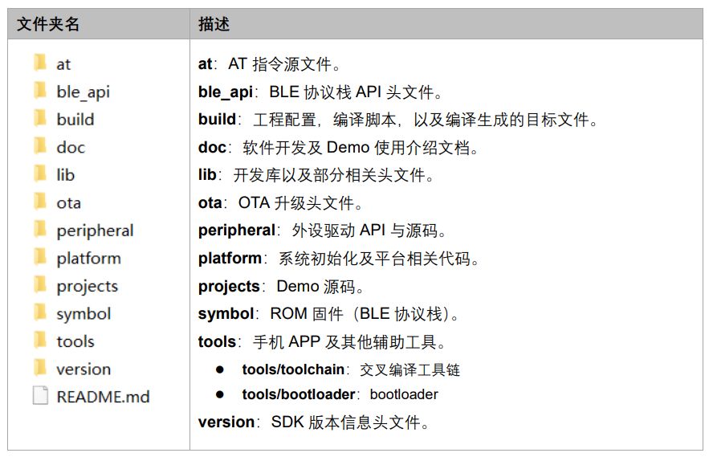
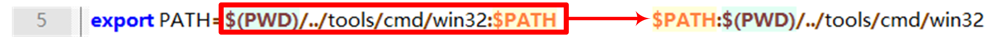

.. role:: raw-latex(raw)
   :format: latex
..

ASR560X 系列开发环境搭建与编译指南
=================================
`English <https://asriot.readthedocs.io/en/latest/ASR560X/Development_Environment.html>`_

前言
----

**关于本文档**

本文档旨在介绍 ASR560X SDK 开发环境的搭建步骤以及工程编译的方法。

**读者对象**

本文档主要适用于以下工程师：

-  单板硬件开发工程师
-  软件工程师
-  技术支持工程师

**产品型号**

本文档适用于 ASR560X 系列蓝牙芯片。

+---------+----------------------------------------------------------------------------------------+----------+--------------+-----------------------------------------------------------------------------------+
| 型号    | 协议                                                                                   | 内核     | SiP Flash    | 功能                                                                              |
+=========+========================================================================================+==========+==============+===================================================================================+
| ASR560X | BLE 5.1 full feature (compatible with 5.2) BLE SIG Mesh IEEE 802.15.4 2.4G Proprietary | ARM CM0+ | 1 MB/ 512 KB | AOA/AOD/Voice/IRTxRx/ Quadrature Decoder/Keypad/ 5V UART/5V GPIO/Wi-Fi concurrent |
+---------+----------------------------------------------------------------------------------------+----------+--------------+-----------------------------------------------------------------------------------+

**版权公告**

版权归 © 2023 翱捷科技股份有限公司所有。保留一切权利。未经翱捷科技股份有限公司的书面许可，不得以任何形式或手段复制、传播、转录、存储或翻译本文档的部分或所有内容。

**商标声明**

ASR、翱捷和其他翱捷商标均为翱捷科技股份有限公司的商标。

本文档提及的其他所有商标名称、商标和注册商标均属其各自所有人的财产，特此声明。

**免责声明**

翱捷科技股份有限公司对本文档内容不做任何形式的保证，并会对本文档内容或本文中介绍的产品进行不定期更新。

本文档仅作为使用指导，本文的所有内容不构成任何形式的担保。本文档中的信息如有变更，恕不另行通知。

本文档不负任何责任，包括使用本文档中的信息所产生的侵犯任何专有权行为的责任。

**防静电警告**

静电放电（ESD）可能会损坏本产品。使用本产品进行操作时，须小心进行静电防护，避免静电损坏产品。

**翱捷科技股份有限公司**

地址：上海市浦东新区科苑路399号张江创新园10号楼9楼 邮编：201203

官网： http://www.asrmicro.com/

**文档修订历史**

======= ====== ======================
日期    版本号 发布说明
======= ====== ======================
2023.03 V1.2.0 更新Keil工程生成方法。
======= ====== ======================

1. SDK 目录介绍
--------------

ASR560X SDK 软件包中的内容如下所示：

|image1|

开发环境搭建以及 demo 编译主要用到\ **build**\ 和\ **tools/toolchain**\ 目录中的文件。其中\ **build**\ 目录下包含用于编译的工具和脚本，\ **tools/toolchain**\ 目录中提供了Windows操作系统下的GCC交叉编译工具链。

关于固件烧录，请参考文档《ASR560X 系列_开发板用户指南》和《ASR560X_BLE 编程工具用户手册》。

2. 搭建命令行编译环境
---------------------

ASR560X SDK Demo 工程需使用 GCC 交叉工具链进行编译，支持 Windows 和 Linux 操作系统下的命令行编译。如在 Windows 系统下，需要借助 Git Bash 或 Cygwin 环境进行编译，而在 Linux 系统下，则不需要额外的步骤，在终端中输入编译指令即可执行编译。

下文对 Windows 和 Linux 系统下搭建编译环境的步骤进行详细说明。

2.1 编译环境安装
~~~~~~~~~~~~~~~~

2.1.1 Windows
^^^^^^^^^^^^^

1. 从 https://git-scm.com/download 网站获取安装包，按需求安装 Git Bash 环境。

2. GCC 交叉编译工具链已在 SDK tools/toolchain 目录下。

.. attention::
    Windows 操作系统下，交叉编译工具链只能使用 SDK 提供的版本，不能更换版本。

2.1.2 Linux
^^^^^^^^^^^

1. Linux 环境下的 GCC 交叉编译工具链需要用户自行下载。下载地址如下：

https://launchpad.net/gcc-arm-embedded/5.0/5-2016-q3-update/+download/gcc-arm-none-eabi-5_4-2016q3-20160926-linux.tar.bz2

.. attention::
    Linux 操作系统下，交叉编译工具链只能使用链接中的版本，不能更换版本。

2. 下载完成后，将压缩包拷贝到 SDK tools/toolchain 目录下。

2.2 编译环境配置
~~~~~~~~~~~~~~~~

2.2.1 Windows 编译环境配置
^^^^^^^^^^^^^^^^^^^^^^^^^

1. 进入 SDK build 目录，在目录空白处点击鼠标右键打开右键菜单，选择 Git Bash 来创建命令行终端：

|image2|

2. 在 Git Bash 终端中输入命令\*\ **source setBuildEnv.sh\***\ ，然后回车，系统执行配置编译环境步骤：

|image3|

2.2.2 Linux 编译环境配置
^^^^^^^^^^^^^^^^^^^^^^^

SDK 默认没有提供 Linux 平台的环境配置脚本，用户可以手动添加 TOOLCHAIN_PATH 环境变量，并将此环境变量配置为第 2.1.2 节指定 GCC 交叉工具链版本中的 bin 文件夹路径。如下图：

|image4|

2.3 工程编译
~~~~~~~~~~~~

1. 在 SDK build/build_rules/project 目录下找到工程编译脚本（config.mk）。

2. 使用命令 **make TARGET=\*\ \***\ \* 编译指定工程，其中 \**\* 对应 build/build_rules/project 目录下的工程名，例如：sonata_hl_data_trans_demo。

3. 使用命令 **make TARGET=\*\ \***\ \* 编译 Peripheral 工程，其中 \**\* 对应 build/build_rules/project 目录下的工程名，例如：peripheral/gpio。

4. 使用命令 **make clean** 可以删除已编译的工程文件。

.. attention::
    如果使用的头文件有调整，需要先使用命令 make clean 删除工程文件，再重新执行编译命令。

5. 以 sonata_hl_data_trans_demo 为例，在命令行中输入下方命令以执行编译：

**make TARGET=sonata_hl_data_trans_demo**

|image5|

6. 出现 “**build complete**” 字符串说明工程编译完成，如下图：

|image6|

7. 编译成功后，在 SDK build/out/sonata_hl_data_trans_demo 目录下生成 APP 固件：

|image7|

.. note::
    外设工程编译后，最终生成的 bin 文件目录会有差异。例如：gpio 工程（TARGET=peripheral/gpio）编译后生成的固件在 build/out/peripheral/gpio 目录下。

3. 搭建 Keil 编译环境
-------------------

ASR560X SDK 默认没有提供 Keil 工程，用户需要使用脚本自行生成 Keil 工程。

3.1 Keil 工程生成
~~~~~~~~~~~~~~~~

用户在 SDK project/sonata 对应的工程目录下执行 GenkeilPrj.bat 脚本，即可在当前目录下生成对应的 Keil 工程。

.. attention::
    如果 SDK 对应的工程目录下没有 GenkeilPrj.bat 脚本，请联系原厂。

3.2 Keil 环境下的 GCC 交叉编译工具链配置
~~~~~~~~~~~~~~~~~~~~~~~~~~~~~~~~~~~~~

1. 解压缩 SDK tools/toolchain 目录下的 GCC 压缩包。

2. 参考 https://www.keil.com/support/man/docs/uv4/uv4_gnucomp.htm 来配置 GCC 工具链，如下图：

|image8|

3.3 Flash 编程算法配置
~~~~~~~~~~~~~~~~~~~~~

1. 拷贝 SDK tools/ASR560X_2W2D.FLM 到 Keil 的 Flash 目录，例如 C::raw-latex:`\Keil`\_v5:raw-latex:`\ARM`:raw-latex:`\Flash`。

2. 参考 https://www.keil.com/support/man/docs/uv4/uv4_fl_dlconfiguration.htm 来配置Flash编程算法。主要需配置如下内容：

   (1) **Download Function**\ ：勾选Erase Sectors、Program和Verify。

   (2) **RAM for Algorithm**\ ：设置Start为0x20000000，Size为0x1000。

   (3) **Programming Algorithm**: 添加ASR560X Flash编程算法文件。

|image9|

4. 常见问题
-----------

4.1 STACK_INIT_PATTERN 未定义导致编译失败，应如何处理？
~~~~~~~~~~~~~~~~~~~~~~~~~~~~~~~~~~~~~~~~~~~~~~~~~~~~~~

需要在 Keil 项目配置界面中的 CC 标签页 Preprocessor Symbols->Define 中增加 “**STACK_INIT_PATTERN=0xF3F3F3F3,**” 定义。

4.2 32 位系统或 32 位 Git Bash mkdir 命令失败导致编译失败，应如何处理？
~~~~~~~~~~~~~~~~~~~~~~~~~~~~~~~~~~~~~~~~~~~~~~~~~~~~~~~~~~~~~~~~~~

需要按如下图修改 SDK tools/setBuildEnv.sh 文件。修改完成后，重启 Git Bash 终端并使用命令 **source setBuildEnv.sh** 重新加载环境变量。

|image10|

.. |image2| image:: ../../img/560X_开发环境搭建/图2-1.png
.. |image3| image:: ../../img/560X_开发环境搭建/图2-2.png
.. |image4| image:: ../../img/560X_开发环境搭建/图2-3.png
.. |image5| image:: ../../img/560X_开发环境搭建/图2-4.png
.. |image6| image:: ../../img/560X_开发环境搭建/图2-5.png
.. |image7| image:: ../../img/560X_开发环境搭建/图2-6.png
.. |image8| image:: ../../img/560X_开发环境搭建/图3-1.png
.. |image9| image:: ../../img/560X_开发环境搭建/图3-2.png
