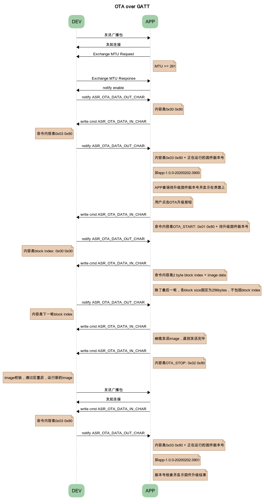
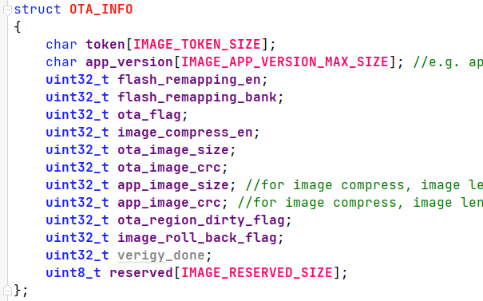

ASR560X 系列 BLE OTA over GATT 设计规范
====================================

前言
----

**关于本文档**

本文档主要描述了 OTA 升级中，手机 APP 与设备（ASR560X 开发板）之间通过 GATT 服务进行数据传输的交互流程。

**读者对象**

本文档主要适用于以下工程师：

-  单板硬件开发工程师
-  软件工程师
-  技术支持工程师

**产品型号**

本文档适用于 ASR560X 系列蓝牙芯片。

+---------+-------------------------------------------------------------------------------------------+----------+--------------+------------------------------------------------------------------------------------+
| Model   | Protocol                                                                                  | Core     | SiP Flash    | Function                                                                           |
+=========+===========================================================================================+==========+==============+====================================================================================+
| ASR560X | BLE 5.1 full feature (compatible with 5.2) SIG MESH V1.0.x IEEE 802.15.4 2.4G Proprietary | ARM CM0+ | 1 MB/ 512 KB | AOA/AOD/Voice/IRTxRx/ Quadrature Decoder/Keypad/ 5V UART/5V GPIO/ Wi-Fi concurrent |
+---------+-------------------------------------------------------------------------------------------+----------+--------------+------------------------------------------------------------------------------------+

**版权公告**

版权归 © 2023 翱捷科技股份有限公司所有。保留一切权利。未经翱捷科技股份有限公司的书面许可，不得以任何形式或手段复制、传播、转录、存储或翻译本文档的部分或所有内容。

**商标声明**

ASR、翱捷和其他翱捷商标均为翱捷科技股份有限公司的商标。

本文档提及的其他所有商标名称、商标和注册商标均属其各自所有人的财产，特此声明。

**免责声明**

翱捷科技股份有限公司对本文档内容不做任何形式的保证，并会对本文档内容或本文中介绍的产品进行不定期更新。

本文档仅作为使用指导，本文的所有内容不构成任何形式的担保。本文档中的信息如有变更，恕不另行通知。

本文档不负任何责任，包括使用本文档中的信息所产生的侵犯任何专有权行为的责任。

**防静电警告**

静电放电（ESD）可能会损坏本产品。使用本产品进行操作时，须小心进行静电防护，避免静电损坏产品。

**翱捷科技股份有限公司**

地址：上海市浦东新区科苑路 399 号张江创新园 10 号楼 9 楼 邮编：201203

官网： http://www.asrmicro.com/

**文档修订历史**

======= ====== ==========
日期    版本号 发布说明
======= ====== ==========
2023.06 V1.0.1 更新UUID。
======= ====== ==========

1. APP和DEVICE交互流程说明
--------------------------

|image1|

1.  dev 发送广播包，app 扫描并和 dev 建立连接。

2.  app 发起 MTU exchange，MTU≥261。

3.  app 发起 notify enable，dev 回复状态 0x8000。

4.  app 发起 version read 命令（0x8003），dev 返回正在运行的固件版本号（0x03 0x80 + version），version 实例：“app-1.0.0-20200120.0900”。

5.  app 查询待升级的固件版本号，并显示出来，由用户决定是否进行 OTA 升级（待升级固件提前放到手机指定路径中）。

6.  用户点击 OTA 升级按钮后，app 发送 ASR OTA DATA IN CHAR 命令，内容是 0x01 0x80+ 待升级固件版本号。

7.  dev 接收到 OTA_START 命令后，向 ASR OTA DATA OUT CHAR 发起 notify，内容是 0x00 0x00（block index）。

8.  app 接收到 notify 后，发送 ASR OTA DATA IN CHAR 命令，内容是 0x00 0x00 0x0xx … （2-Byte block index + 256-Byte image），除了最后一包数据，各 block size 固定为 256 Bytes，不包括 block index。

9.  dev 接收到 APP 发送的命令后，继续发起 notify，内容是下一笔 block index，app 接收到 notify 后，继续发送 write 命令，直到 image 发送完毕。

10. Image 发送完毕后，app 发送 ASR OTA DATA IN CHAR 命令，内容是 0x02 0x80（OTA\_ STOP）。

11. dev 接收到 APP 发送的命令后，做 image 校验，校验通过后，DEV 重启，运行新的 image。

12. app 扫描并和 dev 建立连接，app 发起读版本命令，dev 返回正在运行的固件版本号，app 做版本号检测。

2. 配置说明
-----------

2.1 ASR OTA SERVICE & OTA CHAR
~~~~~~~~~~~~~~~~~~~~~~~~~~~~~~

**ASR OTA SERVICE**

SERVICE_UUID: {0xFB, 0x34, 0x9B, 0x5F, 0x80, 0x00, 0x00, 0x80, 0x6D, 0x81, 0x37, 0x5D, 0x11, 0xFE, 0x17, 0x09}

**ASR OTA CHAR**

-  ASR OTA DATA IN CHAR:

   UUID: {0xFB, 0x34, 0x9B, 0x5F, 0x80, 0x00, 0x00, 0x80, 0x6D, 0x81, 0x37, 0x5D, 0x01, 0x00, 0x17, 0x09}

   permission write without response

-  ASR OTA DATA OUT CHAR:

   UUID: {0xFB, 0x34, 0x9B, 0x5F, 0x80, 0x00, 0x00, 0x80, 0x6D, 0x81, 0x37, 0x5D, 0x02, 0x00, 0x17, 0x09}

   permission read & notify

2.2 待升级固件 Header 格式说明
~~~~~~~~~~~~~~~~~~~~~~~~~~~~

|image2|

app 读 image 起始位置，读取结果应为：\ *ASR BLE 560X*

app 读 image offset 32 Bytes 位置，读取结果应为：\ *app_version*

2.3 数据格式说明
~~~~~~~~~~~~~~~~

帧格式：Header (2 Bytes) + Payload (1-256 Bytes)

Header bit15 为 0 时，表示数据帧；为 1 时，表示控制或状态帧。

**APP->DEV (ASR OTA DATA IN)**

(1) DATA（Header bit15 为 0）

block index (2 Bytes) + payload (1-256 Bytes)

(2) CTRL（Header bit15 为 1）

OTA_START: 0x8001 (2 Bytes) + version (24 Bytes)

OTA_STOP: 0x8002 (2 Bytes)

OTA_VERSION: 0x8003 (2 Bytes)

**DEV->APP (ASR OTA DATA OUT)**

(1) DATA（Header bit15 为 0）

block index (2 Bytes)

(2) STATUS（Header bit15 为 1）

NO_ERROR: 0x8000 (2 Bytes)

VERSION: 0x8003 (2 Bytes) + version (24 Bytes)

ERROR: 0x8080 (2 Bytes)

