ASR560X 系列 HardFault 问题分析参考指南
====================================

前言
----

**关于本文档**

本文旨在介绍 ASR560X 系列芯片平台开发过程中遇到 HardFault 问题后的分析方法。

**读者对象**

本文档主要适用于以下工程师：

-  单板硬件开发工程师
-  软件工程师
-  技术支持工程师

**产品型号**

本文档适用于 ASR560X 系列蓝牙芯片。

+---------+-------------------------------------------------------------------------------------------+----------+--------------+------------------------------------------------------------------------------------+
| Model   | Protocol                                                                                  | Core     | SiP Flash    | Function                                                                           |
+=========+===========================================================================================+==========+==============+====================================================================================+
| ASR560X | BLE 5.1 full feature (compatible with 5.2) SIG MESH V1.0.x IEEE 802.15.4 2.4G Proprietary | ARM CM0+ | 1 MB/ 512 KB | AOA/AOD/Voice/IRTxRx/ Quadrature Decoder/Keypad/ 5V UART/5V GPIO/ Wi-Fi concurrent |
+---------+-------------------------------------------------------------------------------------------+----------+--------------+------------------------------------------------------------------------------------+

**版权公告**

版权归 © 2023 翱捷科技股份有限公司所有。保留一切权利。未经翱捷科技股份有限公司的书面许可，不得以任何形式或手段复制、传播、转录、存储或翻译本文档的部分或所有内容。

**商标声明**

ASR、翱捷和其他翱捷商标均为翱捷科技股份有限公司的商标。

本文档提及的其他所有商标名称、商标和注册商标均属其各自所有人的财产，特此声明。

**免责声明**

翱捷科技股份有限公司对本文档内容不做任何形式的保证，并会对本文档内容或本文中介绍的产品进行不定期更新。

本文档仅作为使用指导，本文的所有内容不构成任何形式的担保。本文档中的信息如有变更，恕不另行通知。

本文档不负任何责任，包括使用本文档中的信息所产生的侵犯任何专有权行为的责任。

**防静电警告**

静电放电（ESD）可能会损坏本产品。使用本产品进行操作时，须小心进行静电防护，避免静电损坏产品。

**翱捷科技股份有限公司**

地址：上海市浦东新区科苑路399号张江创新园10号楼9楼 邮编：201203

官网： http://www.asrmicro.com/

**文档修订历史**

======= ====== ==========
日期    版本号 发布说明
======= ====== ==========
2023.05 V1.0.0 首次发布。
======= ====== ==========

1. 内核寄存器
-------------

ASR560X 系列芯片平台使用的是 ARM Cortex-M0+ 内核，对应的核心寄存器如下图。

 |image1| 

其中，

-  R0~R12：通用寄存器。
-  SP (R13)：堆栈指针，指向当前堆栈的栈底。借助此寄存器可以查看堆栈的内容以及回溯函数调用。
-  LR (R14)：链接寄存器，当进行子函数调用时将用于保存子程序的返回地址。当 PC 值为 0 时，可以参考此寄存器值进行定位。
-  PC (R15)：程序计数寄存器，对应 CPU 正在执行指令的地址。
-  PSR：执行状态寄存器。

.. note:: 如遇到 HardFault 问题需要借助上述寄存器信息来进行分析，后续章节将详细介绍分析方法。

2.参考分析流程一
----------------

2.1 问题举例（PC地址非零）
~~~~~~~~~~~~~~~~~~~~~~~~~~

-  问题描述：客户在使用 ASR5601 开发应用时出现 HardFault 问题，在 makefile 中调整 lib 的 linker 顺序后，问题消失。

-  客户诉求：分析出现该问题的原因以及给出对应的解决方案

-  开发平台：ASR5601

-  版本信息：BLE NONOS SDK v1.4.1

-  测试环境：ASR5601 QFN32 EVB + 用户应用固件

-  复现概率：100%

-  Log 信息：

   In HardFault Handler

   r0 = 0x1005b844

   r1 = 0x1005b802

   r2 = 0x1005b7f7

   r3 = 0x 1

   r12 = 0x2000957d

   lr = 0x10054917

   **pc = 0x10054918**

   psr = 0x21000000

2.2 问题分析
~~~~~~~~~~~~

步骤1：从 Log 信息中的 PC 地址可以知道 HardFault 的位置；

步骤2：为了查找问题线索，需要通过反汇编将 PC 地址对应的函数以及汇编指令定位出来。反

汇编指令参考如下：\ **arm-none-eabi-objdump.exe -D** **–s demo.elf >demo.asm;**

步骤3：查看反汇编文件中 PC 地址对应的信息，如下图：

 |image2| 

步骤4：从步骤 3 可以知道，是“LDR”汇编指令引起了 HardFault；

步骤5: 因为 5601 使用 cortex-M0+ 内核，需要参考\ *ARMv6-M Architecture Reference Manual*\ ，查询哪些异常行为会触发“LDR”汇编指令异常；

步骤6：从步骤 5 的文档可以知道，ARMv6-M 架构（Cortex-M0, Cortex-M0+, Cortex-M1）强制要求”LDR”指令按 word 对齐的方式访问；

 |image3| 

步骤7：按照步骤 6 查到的要求，跟踪反汇编代码。如下图：

 |image4| 

步骤8：结合客户反馈，调用 sdk_init 函数后才会出现 HardFault，最终跟踪到 ms_ble_sdk_init 函数会调用 ms_ble_sdk_state_flag_set。如下图：

 |image5| 

步骤9：根据步骤 8 跟踪到的调用关系可以知道，ms_ble_sdk_state_flag_set 函数传递的第一个参数的地址是 0x20003d45。可以在客户提供的 map 文件中查到对应的变量是 g_ble_dev_state。如下图：

 |image6| 

步骤10：参考步骤 9 的分析。目前定位到是 g_ble_dev_state 变量未按 word 对齐，导致了“LDR”汇编指令出现了 alignment fault。而交换了 lib linker 顺序后可以正常运行的固件，对应的 map 文件中 g_ble_dev_state 变量地址是按 word 对齐的。如下图：

 |image7| 

2.3 问题模拟测试
~~~~~~~~~~~~~~~~

对齐客户的测试环境，在 5601 BLE NONOS SDK V1.4.1 中进行模拟测试。测试代码如下图：传递一个非 word 对齐地址给到 test 函数，test 函数里进行 word 访问会出现“LDR“汇编指令 HardFault。

 |image8| 

2.4 问题解决方案
~~~~~~~~~~~~~~~~

1. 调整非法访问代码，例如按 Byte 去访问对应的变量；

2. 对于g_ble_dev_state结构体变量，使用编译属性强制要求变量 word 对齐。

   例如：

   typedef struct **attribute**\ ((aligned(4)))

   {

   … …

   }

2.5 问题影响范围分析
~~~~~~~~~~~~~~~~~~~~

1. 调整非法访问代码影响：软件上按单个 Byte 操作对应的内容即可，功能上不会有影响；

2. 变量 word 对齐修改影响：只是调整单个变量对应 RAM 地址，不会影响其它逻辑。

2.6 问题拓展
~~~~~~~~~~~~

1. ARMv7-M架构（Cortex-M3, Cortex-M4, Cortex-M7）的对齐要求，如下图：

 |image9| 

2. ARMv7-M 架构（Cortex-M3, Cortex-M4, Cortex-M7）可以通过 ARMv7-M Architecture Reference Manual -> B1.5.14 Fault behavior->List of ARMv7-M faults 中的描述了解到 faults 产生的原因。ARMv6-M 架构没有这个功能。

3. 如果要求变量按指定的边界对齐，只能在定义变量时使用 __attribute__((aligned(n))) 属性进行要求。

2.7 问题总结
~~~~~~~~~~~~

产生 HardFault 的原因较多，需要结合内核架构参考手册、faults 时 dump 出来的寄存器值以及反汇编代码等信息跟踪问题。

3.参考分析流程二
----------------

3.1 问题举例（PC 地址为零）
~~~~~~~~~~~~~~~~~~~~~~~~~~

-  问题描述：客户使用 5601 开发应用时出现 HardFault 问题，在注释掉 app_add_profiles() 函数后问题消失

-  客户诉求： 分析出现该问题的原因以及给出对应的解决方案

-  开发平台： 5601

-  版本信息： BLE NONOS SDK v1.7.1

-  测试环境： 5601 QFN32 EVB + 用户应用固件

-  复现概率： 100%

-  Log 信息：

   In HardFault Handler

   r0 = 0x14

   r1 = 0x2000a376

   r2 = 0x1

   r3 = 0x0

   r12 = 0x2000a905

   lr = 0x10054295

   **pc = 0x0**

   psr = 0x60000000

.. _问题分析-1:

3.2 问题分析
~~~~~~~~~~~~

步骤 1：在 PC 为 0 的情况下，可以借助 LR(R13) 寄存器值 0x10054295 进行定位。

步骤 2：为了查找问题线索，需要通过反汇编将 PC 地址对应的函数以及汇编指令定位出来。反汇编令参考如下：\ **arm-none-eabi-objdump.exe -D** **–s demo.elf >demo.asm**\ 。

步骤 3：查看反汇编文件中 LR 寄存器值对应的函数信息，如下图：

 |image10| 

步骤 4：因“b.n”指令是 Thumb 指令且 bit [0]必须为 1，所以 lr = 0x10054295 实际对应 0x10054294 指令，那么导致 HardFault 的指令确认为 0x10054292 地址对应的 BLX 汇编指令。

步骤 5：因为 5601 使用 cortex-M0+ 内核，需要参考\ *ARMv6-M Architecture Reference Manual*\ ，查询 BLX 异常行是否会触发 HardFault。

步骤 6：从步骤 5 的文档可以知道， ARMv6-M 架构（Cortex-M0, Cortex-M0+, Cortex-M1）描述到：如果 Rm 的 [0] 位为 0，BLX 指令将导致 HardFault 异常。

 |image11| 

步骤 7: 参考步骤 6 的分析，结合 0x10054292 地址对应汇编指令内容以及 R3 寄存器的值，确认是 R3 寄存器值为 0 引起的 HardFault。BLX 汇编指令主要用于子函数的跳转执行，而此时跳转的地址为 0，说明应用中有空指针的情况。

步骤 8：根据 R0 寄存器（0x14）的值，跟踪 prf_itf_get() 函数反汇编流程，分析结果如下图：

 |image12| 

步骤 9：参考步骤 8 的分析，根据 R3 寄存器的值（0x20004c14）确认异常是由于pf_diss_prf_itf_get变量的值为0导致。

 |image13| 

步骤 10：参考步骤 9 的分析，确认跟 diss 服务相关。继续排查代码中 diss 服务添加流程，发现 sonata_prf_diss_init() 未被正常调用。

 |image14| 

步骤 11: 根据步骤 10 分析情况，在增加 sonata_prf_diss_init() 函数调用流程，并进行重编译烧录后，app 可以正常运行，未出现 HardFault 的情况。

.. _问题模拟测试-1:

3.3 问题模拟测试
~~~~~~~~~~~~~~~~

1. 对齐客户的测试环境，在 5601 BLE NONOS SDK V1.7.1 中进行模拟测试。

2. 使用 sonata_hl_beacon_rel 例程，在屏蔽 sonata_prf_diss_init() 函数调用，进行重编译烧录后，HardFault 问题必现。

.. _问题解决方案-1:

3.4 问题解决方案
~~~~~~~~~~~~~~~~

增加 sonata_prf_diss_init() 函数调用步骤，确保后续添加 profile 流程正常执行。

 |image15| 

.. _问题总结-1:

3.5 问题总结
~~~~~~~~~~~~

如果 PC 地址为零时，可以结合 LR 地址、内核架构参考手册、faults 时 dump 出来的寄存器值以及反汇编代码等信息进行跟踪问题。

4.参考资料
----------

ARM Cortex-M 架构相关的资料汇总链接如下：

`Arm Cortex-M resources - all in one place - Architectures and Processors blog - Arm Community blogs - Arm Community <https://community.arm.com/arm-community-blogs/b/architectures-and-processors-blog/posts/cortex-m-resources>`__

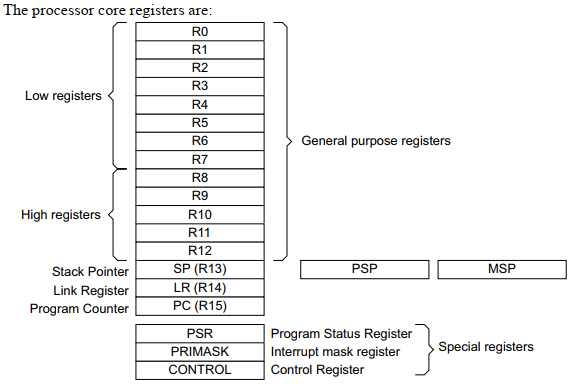
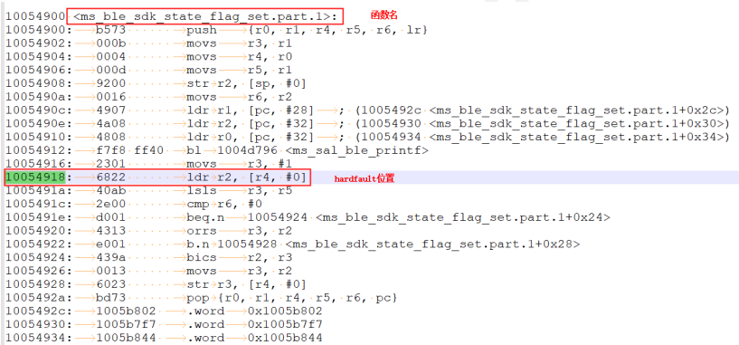
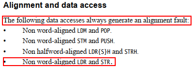
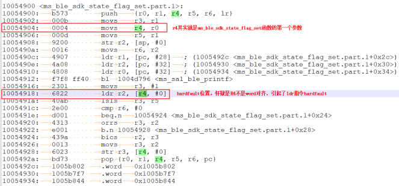
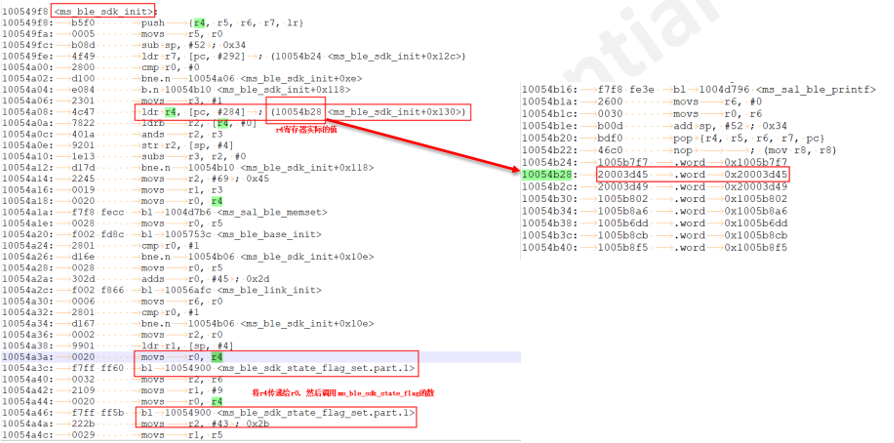
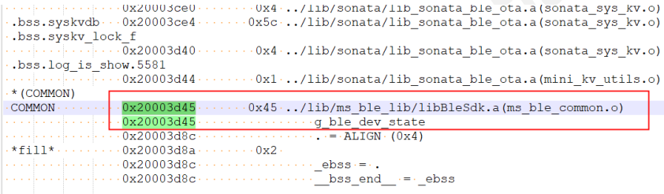
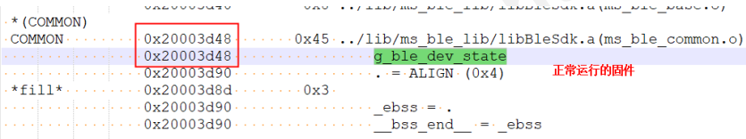
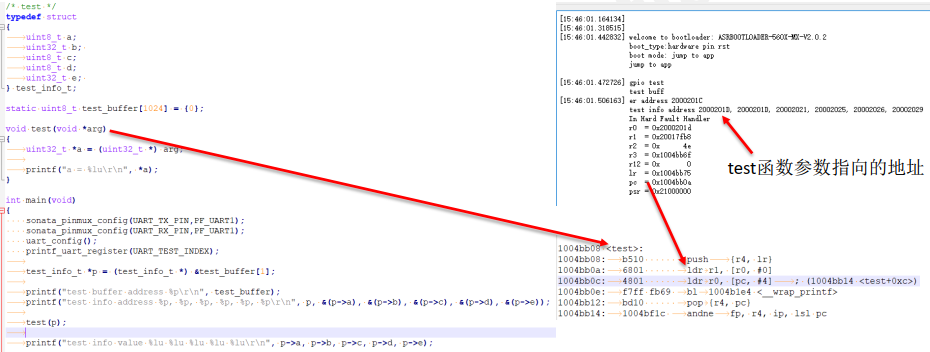
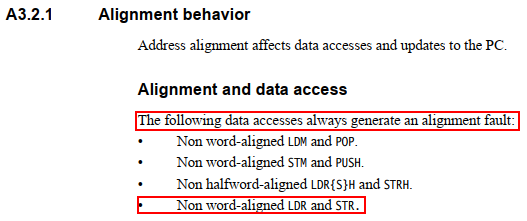
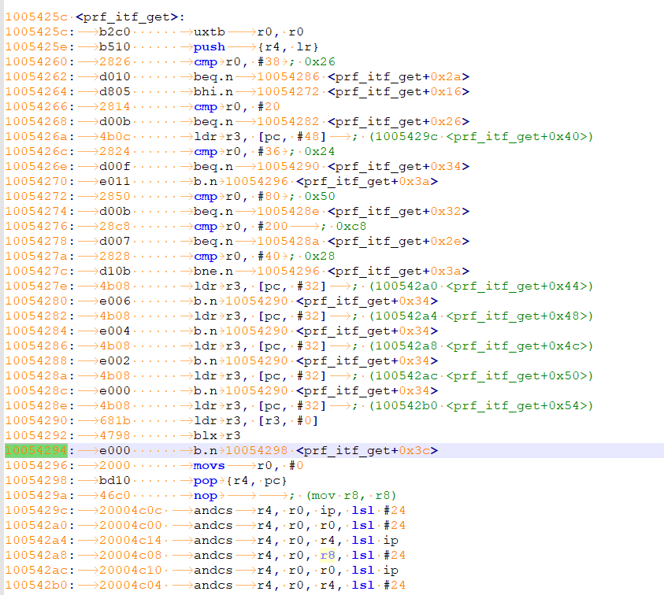
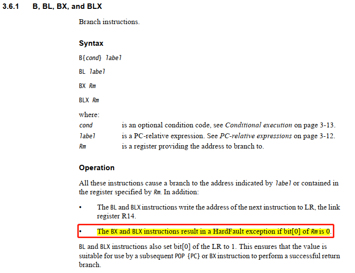
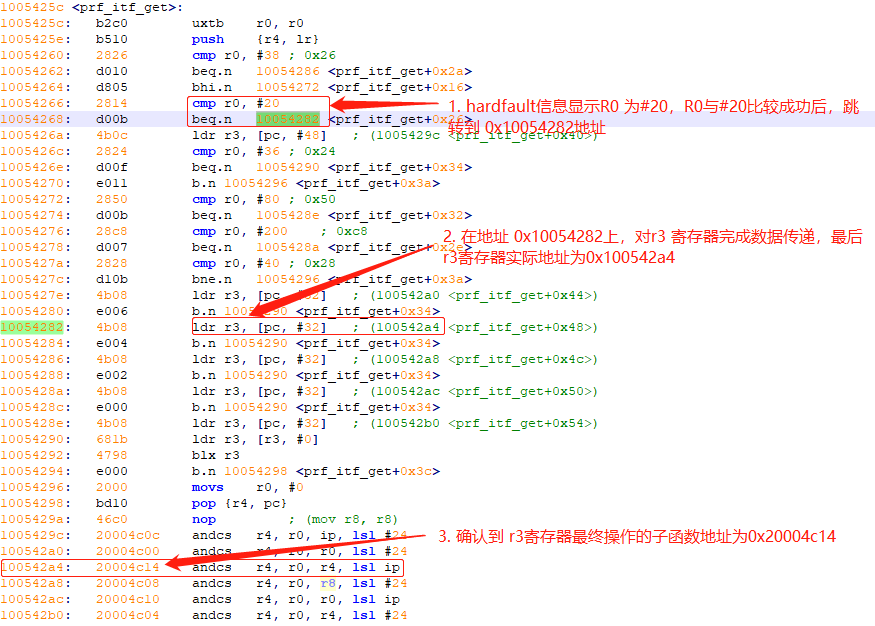
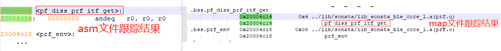
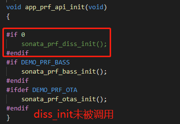
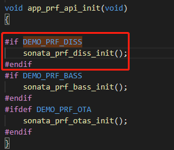