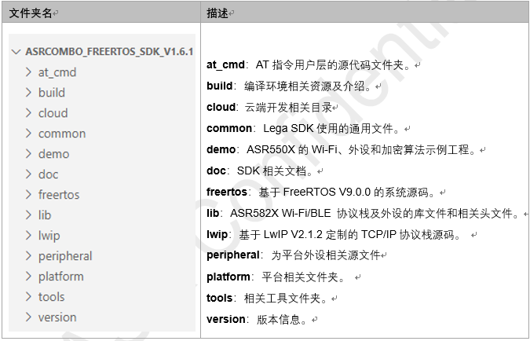
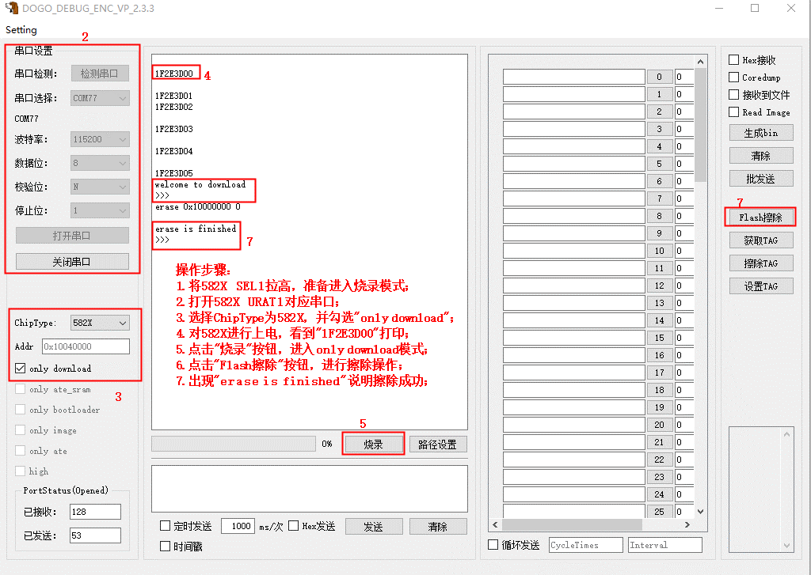
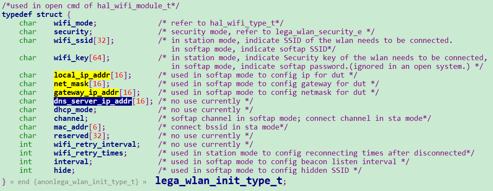
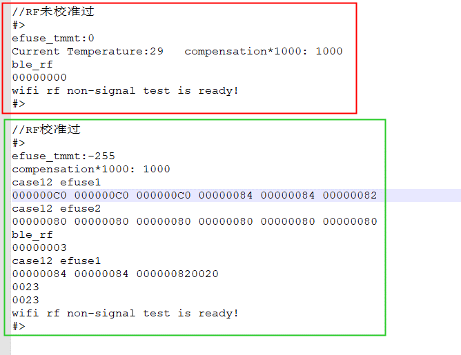

ASR582X 系列开发常见问题
========================

前言
----

**关于本文档**

本文档旨在介绍 ASR582X 系列 Wi-Fi+BLE Combo SoC 芯片在开发中可能碰到的问题以及对应解答。

**读者对象**

本文档主要适用于以下工程师：

-  单板硬件开发工程师
-  软件工程师
-  技术支持工程师

**产品型号**

本文档适用于 ASR582X 系列 Wi-Fi+BLE Combo SoC 芯片。

**版权公告**

版权归 © 2024 翱捷科技股份有限公司所有。保留一切权利。未经翱捷科技股份有限公司的书面许可，不得以任何形式或手段复制、传播、转录、存储或翻译本文档的部分或所有内容。

**商标声明**

ASR、翱捷和其他翱捷商标均为翱捷科技股份有限公司的商标。

本文档提及的其他所有商标名称、商标和注册商标均属其各自所有人的财产，特此声明。

**免责声明**

翱捷科技股份有限公司对本文档内容不做任何形式的保证，并会对本文档内容或本文中介绍的产品进行不定期更新。

本文档仅作为使用指导，本文的所有内容不构成任何形式的担保。本文档中的信息如有变更，恕不另行通知。

本文档不负任何责任，包括使用本文档中的信息所产生的侵犯任何专有权行为的责任。

**防静电警告**

静电放电（ESD）可能会损坏本产品。使用本产品进行操作时，须小心进行静电防护，避免静电损坏产品。

**翱捷科技股份有限公司**

地址：上海市浦东新区科苑路 399 号张江创新园 10 号楼 9 楼 邮编：201203

官网： http://www.asrmicro.com/

**文档修订历史**

======== ========== ============
**日期** **版本号** **发布说明**
======== ========== ============
2024.01  V1.0.1     增加常见项。
======== ========== ============

1. SDK
------

1.1 SDK 支持哪些嵌入式系统？
~~~~~~~~~~~~~~~~~~~~~~~~~~~

支持：FreeRTOS、AliOS、HarmonyOS 等 RTOS。

1.2 SDK 包含哪些内容？
~~~~~~~~~~~~~~~~~~~~~

详细的介绍，请参见文档《ASR582X 系列_开发环境搭建指南》1.1/2.1/3.1 章节。

以 FreeRTOS 举例（以实际 OS 为准）：

1. 开发相关文档，一般在 doc 目录下。

2. DEMO 示例工程，包含 Wi-Fi/部分外设/安全等示例工程，放在 demo 目录下。

3. 头文件以及 Wi-Fi 库，放在 lib 目录。

4. 部分开源代码，包括但不限于 freertos/peripheral/lwip 等。

5. 部分开发&生产工具，放在 tools 目录下，包括 bootloader 和 ate 固件。

6. 调试使用的烧录工具，放在 tools/ASR_IOT_Programmer 目录下。

|image1|

2. 开发环境
-----------

2.1 开发支持哪些集成开发环境？
~~~~~~~~~~~~~~~~~~~~~~~~~~~~~~

2.1.1 FreeRTOS 版本 SDK
^^^^^^^^^^^^^^^^^^^^^

FreeRTOS 支持在 Linux 和 Windows 环境下开发，支持 Docker 开发编译，也支持 Keil 集成开发环境。

详细的开发环境搭建，请参见文档《ASR582X 系列_开发环境搭建》第一章节。

2.1.2 AliOS-Things版本SDK
^^^^^^^^^^^^^^^^^^^^^^^^^

AliOS-Things 支持在 Linux 和 Windows 环境下开发，支持 Docker 开发编译。

详细的开发环境搭建，请参见文档《ASR582X 系列_开发环境搭建》第二章节。

2.1.3 HarmonyOS 版本 SDK
^^^^^^^^^^^^^^^^^^^^^^

HarmonyOS 支持在 Linux 和 Windows 环境下开发，支持 Docker 开发编译。

详细的开发环境搭建，请参见文档《ASR582X 系列_开发环境搭建》第三章节。

2.2 交叉工具链用哪版？
~~~~~~~~~~~~~~~~~~~~~~

使用 GCC 编译器：

-  Windows 下交叉工具链使用 gcc-arm-none-eabi-5_4-2016q3-20160926-win32。

-  Linux 下交叉工具链使用 gcc-arm-none-eabi-5_4-2016q3-20160926-linux。

ASR 基于此工具链深度定制 SDK，建议使用如上两个指定版本。

3. 工具
-------

3.1 如何下载镜像到开发板？
~~~~~~~~~~~~~~~~~~~~~~~~~~

1. 使用开发板时：请参考《ASR582X_开发板使用指南》。

2. 研发开发时：使用 DOGO 工具，请参见文档《ASR IoT 芯片_DOGO 烧录调试工具》。

3. 工厂生产时：使用 MP_Pro 工具，请参见文档《ASR IoT 芯片_MP_Pro 量产烧录工具使用说明》。

MP_Pro 和 DOGO 的区别在于，MP 支持一拖多同时烧录且单次烧录时间短，而 DOGO 工具仅支持单个芯片烧录，此外 DOGO 工具还支持一些调试功能。

3.2 下载时出现“1F2E3D81”是什么原因？
~~~~~~~~~~~~~~~~~~~~~~~~~~~~~~~~~~~~

该字符串表示通讯异常，需要检查串口硬件连接，确认串口电压是否正常，uart1 RX 是否一直有信号输入。

3.3 是否需要烧录 ATE 固件？
~~~~~~~~~~~~~~~~~~~~~~~~~

正常只需要烧录 BOOTLOAD/ROM/APP 固件即可，不需要烧录 ATE 固件。ATE 固件是用于非信令测试及 RF 测试校准。

3.4 如果只更新了 APP 固件，是否可以单独更新烧录 APP 固件？
~~~~~~~~~~~~~~~~~~~~~~~~~~~~~~~~~~~~~~~~~~~~~~~~~~~~~~

可以的。此情况可以在 DOGO 工具上勾选 only image 单选框，然后执行烧录。这样可以单独更新烧录 APP 固件。

3.5 waiting command… 打印，需等 10s 后才 jump to app，是否可以跳过？
~~~~~~~~~~~~~~~~~~~~~~~~~~~~~~~~~~~~~~~~~~~~~~~~~~~~~~~~~~~~~~~~

这是因为 TAG 未置位，需要先将 TAG 置位，则可以直接进入 app，操作指南请参考《ASR IoT 芯片_DOGO 烧录调试工具》中第 2.2 章节：TAG 设置功能。

这也意味着该模组未做 RF 校准，不建议拿来做射频相关测试。

3.6 上电后直接进入到 app，如果想进入 ate 怎么操作？
~~~~~~~~~~~~~~~~~~~~~~~~~~~~~~~~~~~~~~~~~~~~~~~~

需先将 TAG 擦除，则上电后会看到 waiting command… 打印，10s 内输入 mode1 则可以进入 ate，TAG 擦除操作指南请参考《ASR IoT 芯片_DOGO 烧录调试工具》中第 2.2 章节：TAG 设置功能。

3.7 如何整片擦除芯片内部的 Flash？
~~~~~~~~~~~~~~~~~~~~~~~~~~~~~~~~~

可以使用 DOGO 工具进行 Flash 擦除，步骤参考下图说明：

|image2|

4. 平台
-------

4.1 ASR582X 内存、Flash 等资源大小如何？
~~~~~~~~~~~~~~~~~~~~~~~~~~~~~~~~~~~~~~

============ ======= ========= =========
**芯片型号** **RAM** **FLASH** **OTP**
============ ======= ========= =========
ASR5822N     256 KB  2 MB      512 Bytes
ASR5822C     256 KB  2 MB      512 Bytes
ASR5822S     352 KB  2 MB      512 Bytes
ASR5822T     352 KB  4 MB      512 Bytes
============ ======= ========= =========

4.2 芯片内置的 Flash Layout 是怎样划分的？可以修改吗？
~~~~~~~~~~~~~~~~~~~~~~~~~~~~~~~~~~~~~~~~~~~~~~~~~~~~

Flash Layout 相关的说明请参考《ASR582X 系列_开发入门指南》3.2 章节。实际的分区请参考 SDK 中< duet_board.c >文件中的定义。

分区修改原则：

1. Bootloader/Info/APP/OTA/ATE 这几个分区的开始位置不能变：

   BOOTLOADER_FLASH_START_ADDR

   INFO_FLASH_START_ADDR

   APP_FLASH_START_ADDR 0x10012000

   OTA_FLASH_START_ADDR

   ATE_FLASH_START_ADDR 0x10178000

2. APP 和 OTA 分区的大小应该保持一致。

3. 改动或新增分区时，需要保证各分区之间没有重叠（特殊：2 M Flash 时，OTA 和 ATE 可能共用）。

4. 改动或新增分区时，需要保证不能超过 Flash 总大小。

5. 改动或新增分区时，分区地址和分区大小都需要以 4 KB 对齐。

6. 特殊：当使用 4 M Flash 时，ATE 开始位置 0x10178000，APP 起始位置 为0x10012000，也就意味着 APP 分区上限为 1432 KB。

4.3 2 M Flash 芯片，曾烧录过 ATE，为何一段时间后无法再进入 ATE？
~~~~~~~~~~~~~~~~~~~~~~~~~~~~~~~~~~~~~~~~~~~~~~~~~~~~~~~~~~~~~

如 4.2 章节描述，ATE 的分区起始位置是 0x10178000，当使用 2 M Flash 时，此区域可能也会是 OTA区域，存在 ATE 与 OTA 复用情况。

ATE 一般使用在生产时，生产时不会用到 OTA 功能，所以 ate.bin 文件暂会烧录到此区。

OTA 一般使用在生产后，OTA 后若需要使用 ATE，则需要重新烧录 ate.bin。

4.4 系统预留给用户使用的 RAM 有多少字节？
~~~~~~~~~~~~~~~~~~~~~~~~~~~~~~~~~~~~~~~

Free RAM 的大小即为用户可使用的 RAM 大小，其值与系统及集成的功能相关。

**实际情况下，用户可以根据系统提供 API 或串口命令来获取其值：**

-  FreeRTOS：

   -  命令：vtasklist
   -  接口：xPortGetFreeHeapSize()

-  AliOS：

   -  命令：dumpsys mm_info
   -  接口：dumpsys_mm_info_func()

开启宏 LINKKITAPP_CONFIG_PRINT_HEAP 可周期性打印剩余内存

-  HarmonyOS：

   -  接口： LOS_PoolHeadFreeSize() //总内存的 free size

      ​ LOS_MemPoolList() //系统每个内存 pool 的信息

4.5 是否可更改固件的烧录口？
~~~~~~~~~~~~~~~~~~~~~~~~~~~~

不可以，只能是 PAD2 和 PAD3 对应的 uart1。

4.6 系统的 log 输出口是哪个？
~~~~~~~~~~~~~~~~~~~~~~~~~~~

系统 log 输出包括几个部分的 log，bootload/image/ate 通常情况下默认都是 uart1，但都可以通过软件来修改。

​
.. attention::
    bootload/ATE 由 ASR 提供，用户不可修改。

4.7 系统的 log 是否可以动态关闭和打开？
~~~~~~~~~~~~~~~~~~~~~~~~~~~~~~~~~~~~~

系统 log 可以通过 duet_log_disable 关闭，通过 duet_log_enable 打开。

4.8 软件有哪些调试手段？
~~~~~~~~~~~~~~~~~~~~~~~~

1. 依靠 UART 打印，加 log，加断言等。

2. 连接 JLINK 调试。

3. 使用 OS 自带的一些调试手段。

4. 使用 ASR 提供的内嵌 coredump 功能，可借助工具抓取芯片及内存信息，详细操作如下：

   (1) 在DOGO 工具根目录中进入 recev_data 文件夹，在文件夹中创建 coredump 文件夹；

   (2) 模组 uart1 日志口接好 PC 串口，打开 DOGO 工具，打开对应串口；

   (3) 勾选上<Coredump>和<接收到文件>;

   (4) 输入 <coredump flash all>，等待完成；

   (5) 将<recev_data>文件夹下的日志，和<coredump>文件夹所有 bin 文件提供给我们。

|image3|

4.9 系统重启了，如何简单分析重启原因？
~~~~~~~~~~~~~~~~~~~~~~~~~~~~~~~~~~~~~~

1. 可以通过 bootloader 打印查看上次重启原因：

   welcome to bootload: ASRBOOTLOADER-MX-VX.X.X

   hardware pin rst

2. 或者通过 API 获取：duet_get_boot_type()

3. 获取前两步获取的重启类型做简单分析

+------------------+--------------------------------------------------------------------------------------------+
| **重启类型**     | **可能原因**                                                                               |
+==================+============================================================================================+
| PWR_ON_RST       | 跟电源相关的重启，若反复刷此打印，应检查供电是否不足。                                     |
+------------------+--------------------------------------------------------------------------------------------+
| HARDWARE_PIN_RST | 硬件重启，reset pin重启，若反复刷此打印，可以检查reset pin的电压，也需要检查供电是否不足。 |
+------------------+--------------------------------------------------------------------------------------------+
| SOFTWARE_RST     | 软件重启，调用系统reboot，watchdog重启等。                                                 |
+------------------+--------------------------------------------------------------------------------------------+
| DEEP_SLEEP_RST   | Deep sleep唤起使用。                                                                       |
+------------------+--------------------------------------------------------------------------------------------+

4.10 KV 设置时返回错误码，错误码哪里可以查定义？
~~~~~~~~~~~~~~~~~~~~~~~~~~~~~~~~~~~~~~~~~~~~~~~

/\* Key-value function return code description \*/

#define KV_OK 0 /\* Success \*/

#define KV_LOOP_CONTINUE 10000 /\* Loop Continue \*/

#define KV_ERR_NO_SPACE -10001 /\* The space is out of range \*/

#define KV_ERR_INVALID_PARAM -10002 /\* The parameter is invalid \*/

#define KV_ERR_MALLOC_FAILED -10003 /\* The OS memory malloc error \*/

#define KV_ERR_NOT_FOUND -2 /\* Could not found the item \*/

#define KV_ERR_FLASH_READ -10005 /\* The flash read operation error \*/

#define KV_ERR_FLASH_WRITE -10006 /\* The flash write operation error \*/

#define KV_ERR_FLASH_ERASE -10007 /\* The flash erase operation error \*/

#define KV_ERR_OS_LOCK -10008 /\* The error related to OS lock \*/

#define KV_ERR_OS_SEM -10009 /\* The error related to OS semaphore \*/

#define KV_ERR_ENCRYPT -10010 /\* Data encryption error \*/

#define KV_ERR_DECRYPT -10011 /\* Data decryption error \*/

#define KV_ERR_NOT_SUPPORT -10012 /\* The function is not support yet \*/

4.11 如何进行CPU使用占有率统计？
~~~~~~~~~~~~~~~~~~~~~~~~~~~~~~~~

SDK 编译添加选项 cpu_usage=1，例：make TARGET=duet_demo ic_type=5822t cpu_usage=1，上电后可通过 AT 指令 vtasktime 查看，该功能在 SDK 版本 V1.9.0 以上支持。

|image4|

5. Wi-Fi
--------

5.1 按照 demo 调用，为什么还是连接不上路由器?
~~~~~~~~~~~~~~~~~~~~~~~~~~~~~~~~~~~~~~~~~~~

SDK 连接路由器支持动态获取 IP 地址以及静态配置 IP 地址，连接配置的参数也不一样，如下：

-  动态获取 IP 地址，入参 lega_wlan_init_type_t.dhcp_mode 必须要配置成 WLAN_DHCP_CLIENT。

-  静态配置 IP 地址，入参 lega_wlan_init_type_t.dhcp_mode 必须要配置成 WLAN_DHCP_DISABLE，并且传入需要配置的静态 IP/NET MASK/GW/DNS 地址所。

所以没有配置 lega_wlan_init_type_t.dhcp_mode 而且没有传入 IP/NET MASK/GW/DNS 地址是无法连接路由器的。

​

|image5|

5.2 支持的模式有哪几种？
~~~~~~~~~~~~~~~~~~~~~~~~

支持11 b/g/n，单天线。

5.3 传输的最大速率多少，以及最大吞吐量？
~~~~~~~~~~~~~~~~~~~~~~~~~~~~~~~~~~~~~~~~

理论最大传输速率 72.2 Mbps @ 20 MHz，TCP 吞吐量 8 Mbps（bit per second）左右。

5.4 支持的模式有哪些？是否支持多模式同时工作？
~~~~~~~~~~~~~~~~~~~~~~~~~~~~~~~~~~~~~~~~~~~~~~

Wi-Fi 协议栈现支持 3 种工作模式：STATION 模式、SOFTAP 模式、SNIFFER 模式，但暂不支持多模式共存，即在关闭一种模式前，无法开启另一种工作模式。

5.5 TCP/UDP 单包的最大数据长度是多少？
~~~~~~~~~~~~~~~~~~~~~~~~~~~~~~~~~~~~~

TCP 1460 字节，UDP 1472 字节。

5.6 SoftAP 状态下的 beacon 是间隔多久？
~~~~~~~~~~~~~~~~~~~~~~~~~~~~~~~~~~~~

默认 beacon 间隔 100 ms，开启 SoftAP 模式时，可以通过配置 interval 参数改变其 beacon 发送间隔，单位为 ms。一般的路由器默认 interval 也是 100 ms，无特殊需求不建议改动。

int lega_wlan_open(lega_wlan_init_type_t\* init_info);

Int interval; /\* used in softap mode to config beacon listen interval \*/

5.7 当前 SDK 支持哪些国家码？
~~~~~~~~~~~~~~~~~~~~~~~~~~~

配置国家码，Wi-Fi 协议栈会根据配置的国家码在规定信道工作。

当前 SDK 中支持：“CN” “EU” “JP” “US”可选，可以通过 int lega_wlan_set_country_code(char *country); 设置，可以通过 char*\ lega_wlan_get_country_code(void); 获取当前国家码。

如果没有配置国家码，默认工作国家码为“CN”，信道为 1-13 信道。

5.8 SoftAP 支持最多几个 STA 设备同时连接？
~~~~~~~~~~~~~~~~~~~~~~~~~~~~~~~~~~~~~~~

默认最多支持 4 个设备同时连接，可通过软件配置。

5.9 怎么修改 socket 连接上限数量？
~~~~~~~~~~~~~~~~~~~~~~~~~~~~~~~~

可以修改 lwipopts.h 中宏 MEMP_NUM_NETCONN 对应的值。

5.10 如何查看 Iperf 测试示例？
~~~~~~~~~~~~~~~~~~~~~~~~~~~~

Iperf 是一款网络性能测试工具，它可以用来测量网络带宽和网络质量。详细的测试示例，请参见文档《ASR Wi-Fi 吞吐量测试的说明》。

5.11 Wi-Fi 速率低，log 出现 txu retrymax 的解决方案是什么？
~~~~~~~~~~~~~~~~~~~~~~~~~~~~~~~~~~~~~~~~~~~~~~~~~~~~~~~

该 log 来自 Wi-Fi 库，TX 重传多次后会打印 txu retrymax，可按照如下顺序进行排查。

1、 检查板子的射频电路设计或是否进行过 RF 校准，参见第 7.2 节。RF 校准需要用到综测仪，具体可咨询 FAE。

2、 环境干扰较大导致，检查连接上 Wi-Fi 后打印的 diagno1，如 diagno1:-31 -86，其中 -31 表示 RSSI，-86 表示噪声，可通过判断信噪比确认环境干扰或者换个环境进行对比测试。

3、 部分路由性能较差，可尝试更换路由或抓空口包来分析具体原因。

5.12 如何查看 HTTP (S) 及 MQTT (S) 使用参考示例？
~~~~~~~~~~~~~~~~~~~~~~~~~~~~~~~~~~~~~~~~~~~~~~~

SDK 默认支持部分公有云及私有云的配置，详见文档《ASR582X 系列_FreeRTOS 平台_公有云用户手册》《ASR582X 系列_FreeRTOS 平台_私有云用户手册》， 使用 MQTT (S) 或 HTTP (S) 的方式与云端通信、云端下发控制、芯片端上报状态及相关 HTTP 及 MQTT 的 code 可以参考 cloud 目录下面的 src，例：HTTP 使用可参考 cloud.c，MQTT 使用可参考 jd_mqtt_func.c。

6. BLE
------

6.1 怎么确认 BLE 广播开启成功？
~~~~~~~~~~~~~~~~~~~~~~~~~~~~~

详细的介绍，请参见文档《ASR582X 系列_BLE 示例》的第 2.3 章节。

6.2 BLE 配置广播、扫描等动作失败时的错误码是什么意思？
~~~~~~~~~~~~~~~~~~~~~~~~~~~~~~~~~~~~~~~~~~~~~~~~~~~~~

BLE 相关错误码可以通过 sonata_error_api.h 文件查看相关定义。

7. 其他
-------

7.1 RF 性能指标多少?
~~~~~~~~~~~~~~~~~~~

TX 及 RX 性能指标请参见\ *ASR582X Datasheet*\ 。

7.2 如何确认模组已经经过 RF 校准?
~~~~~~~~~~~~~~~~~~~~~~~~~~~~~~~

先进入 ATE 模式（进入 ATE 步骤请参考 3.6 章节问题），再输入 wifi_rftest。

如下图红框部分，则为未校准过，此时射频能力可能不好；如下图绿框部分，则为校准过。

​

|image6|

7.3 低功耗有哪几种，其值多少？
~~~~~~~~~~~~~~~~~~~~~~~~~~~~~~

目前支持 active mode/modem sleep/deep sleep 三种功耗模式。

============ ========
**功耗模式** **功耗**
============ ========
Active mode  12 mA
Modem sleep  6 mA
Deep sleep   40 uA
============ ========

7.4 MAC 是什么？
~~~~~~~~~~~~~~~

MAC 地址也叫物理地址、硬件地址，由制造商生产时烧录，理论上来说 MAC 地址在世界是唯一的，形象地说，MAC 地址就如同身份证上的身份证号码，具有唯一性。

7.5 为什么要设置 MAC，不设置会怎样？
~~~~~~~~~~~~~~~~~~~~~~~~~~~~~~~~~~~

MAC 能让设备获得唯一性，通常情况下，在出厂时已将 MAC 地址固化到 efuse 中。但如果手上的模组并未经过固化 MAC，模组又使用到 Wi-Fi 功能，则 Wi-Fi 协议栈会随机生成一个 MAC，并存储在 Flash 中使用（因存储在 Flash 中，可能会被烧录等行为擦除，被擦除后，会再生成一个新的随机 Wi-Fi MAC）。

​

7.6 怎么设置固定 Wi-Fi MAC 或 BLE MAC？
~~~~~~~~~~~~~~~~~~~~~~~~~~~~~~~~~~~~

若用户需要设置固定的 Wi-Fi MAC，可以使用接口 lega_wlan_set_mac_address()。此接口会更新 Flash 中存储的 Wi-Fi MAC 地址。BLE MAC 不会单独设置，会采用 Wi-Fi MAC+1 的方式使用。

7.7 获取的 MAC 地址和设置的不是同一个，是什么原因？
~~~~~~~~~~~~~~~~~~~~~~~~~~~~~~~~~~~~~~~~~~~~~~~~~

set mac 接口只会写到 flash 中保存。get mac 原理是先从 efuse 中读取 MAC 地址，若 efuse 中没有，则再从 flash 中读取 MAC 地址。这种情况是由于 MAC 地址在 efuse 中已存在，通常情况下，出厂时已将 MAC 地址固化到 efuse 中，请检查 efuse 中是否已存在 MAC 地址。

7.8 如何确认当前使用到第几块 MAC 地址？
~~~~~~~~~~~~~~~~~~~~~~~~~~~~~~~~~~~~~

ASR582X 芯片一共 3 块 MAC 地址区域，分布如下：

=========== =============
**MAC区域** **Efuse位置**
=========== =============
MAC 0       0x90~0x95
MAC 1       0xC0~0xC5
MAC 2       0xC6~0xCB
=========== =============

可以通过 API 分别读出 3 块 MAC 地址区域：uint8_t duet_efuse_byte_read(uint16_t addr)；

使用 MAC 原理是：先使用 MAC2，MAC2 没有值用 MAC1，MAC1 没有值用 MAC0，MAC0 没有值用 Flash 中存储的 MAC 值。

7.9 SPI 的使用速率是多少？
~~~~~~~~~~~~~~~~~~~~~~~~~

SPI master mode 最大 clock 为 10 MHZ，建议使用 8.3 MHZ；slave mode 最大 clock 为 6.6 MHZ。

7.10 SPI DMA 的注意事项有哪些？
~~~~~~~~~~~~~~~~~~~~~~~~~~~~~~

​ 使用 SPI DMA 用作 master 时，出现数据中断或 RX 接收不完整情况，可参考如下：

1. 当需要使用 BLE 功能时，建议先开启 BLE 后再初始化 DMA，或者直接关闭宏 SONATA_CFG_BLE_TRANSPORT，在文件 sonata_stack_user_config.h 中。SONATA_CFG_BLE_TRANSPORT 使用了 DMA mode 用作 BLE 信令测试，用户打开 BLE 会中断 SPI DMA 的数据传输。BLE 信令测试可使用专有固件，具体咨询 FAE。

2. SPI 初始化设置 duet_spi.priv 为 NULL，以避免 SPI RX DMA 在被 block 住的情况下进入 SPI RX 中断处理，导致 DMA 接收不完整的情况，具体 demo 请参考 SDK 中:raw-latex:`\demo`:raw-latex:`\duet`\_demo:raw-latex:`\peripheral`:raw-latex:`\dma`:raw-latex:`\code`:raw-latex:`\main`.c。

3. 在第 2 点基础上设置 dma rx 的 R_pow 为 2，dma tx 的 R_pow 为 0，即提高 RX 的优先级，降低 TX 的优先级，使 RX 比 TX 优先获得 DMA 使用权，具体的 patch 可咨询 FAE。

.. |image3| image:: ../../img/582X_开发常见问题/图4-1.png
.. |image4| image:: ../../img/582X_开发常见问题/图4-2.png

