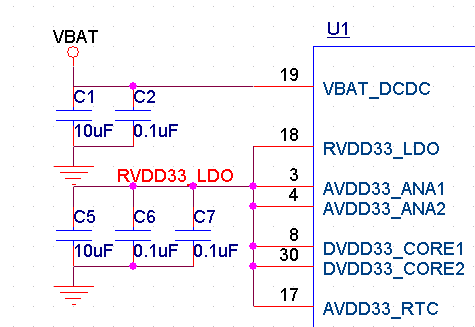
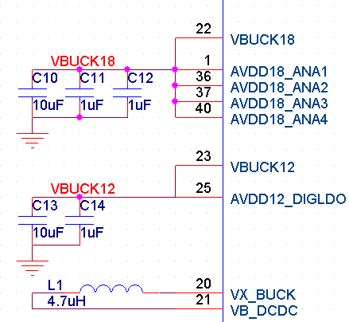
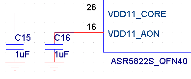
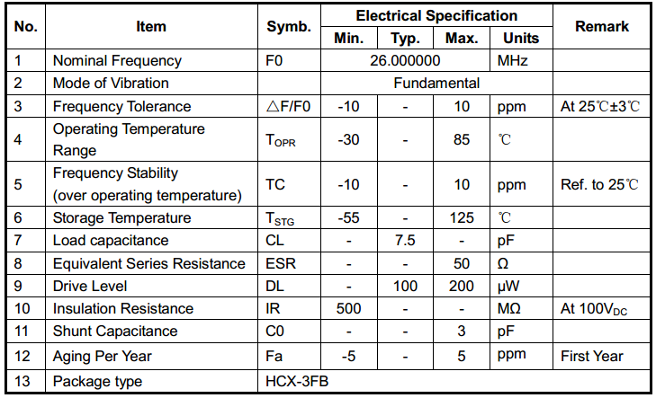
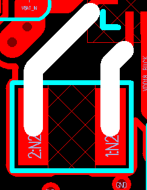
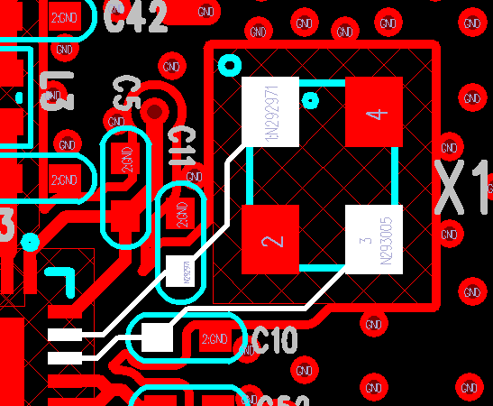

ASR582X 系列硬件设计指南
=======================

前言
----

**关于本文档**

本文档旨在为用户提供 ASR582X 系列 Wi-Fi+BLE Combo SoC 芯片的硬件设计指南，包括进行电路设计和 PCB 布局时需注意的事项以及对量产测试点的引出建议等。

**读者对象**

本文档主要适用于以下工程师：

-  单板硬件开发工程师
-  软件工程师
-  技术支持工程师

**产品型号**

本文档适用于 ASR582X 系列 Wi-Fi+BLE Combo SoC 芯片。

**版权公告**

版权归 © 2024 翱捷科技股份有限公司所有。保留一切权利。未经翱捷科技股份有限公司的书面许可，不得以任何形式或手段复制、传播、转录、存储或翻译本文档的部分或所有内容。

**商标声明**

ASR、翱捷和其他翱捷商标均为翱捷科技股份有限公司的商标。

本文档提及的其他所有商标名称、商标和注册商标均属其各自所有人的财产，特此声明。

**免责声明**

翱捷科技股份有限公司对本文档内容不做任何形式的保证，并会对本文档内容或本文中介绍的产品进行不定期更新。

本文档仅作为使用指导，本文的所有内容不构成任何形式的担保。本文档中的信息如有变更，恕不另行通知。

本文档不负任何责任，包括使用本文档中的信息所产生的侵犯任何专有权行为的责任。

**防静电警告**

静电放电（ESD）可能会损坏本产品。使用本产品进行操作时，须小心进行静电防护，避免静电损坏产品。

**翱捷科技股份有限公司**

地址：上海市浦东新区科苑路 399 号张江创新园 10 号楼 9 楼 邮编：201203

官网： http://www.asrmicro.com/

**文档修订历史**

======== ========== =============
**日期** **版本号** **发布说明**
======== ========== =============
2024.09  V1.5.2     增加了4.7节。
======== ========== =============

1. 原理图设计
-------------

.. attention::
    建议客户在 Layout 完成后，将相关文件提交给 ASR 进行评审，待 ASR 确认无问题后再行发板，以避免中途出现不必要的 Layout 问题，从而为客户节省时间和人力成本。

1.1 电源和晶体部分设计
~~~~~~~~~~~~~~~~~~~~~~

ASR582X 芯片单路电源供电设计，电源输入兼容 5 V 和 3.3 V 设计。

当使用 5 V 供电时，PAD0 ~ PAD3 共 4 个 IO 口电平为 5 V，其他 IO 口电平为 3.3 V。

当使用 3.3 V 供电时，PAD0 ~ PAD15 共 16 个 IO 口电平为 3.3 V。

1.1.1 外部电源输入为 3.3 V 或 5 V 时
^^^^^^^^^^^^^^^^^^^^^^^^^^^^^^^^

电源连线如下图，利用芯片内部 3.3 V LDO 输出给芯片内部各模块使用。

电容 C5 和 C6 就近 PIN3 和 PIN4 摆放，C7 就近 PIN8 或 PIN30 摆放。

|image1|
    

.. note::
    当模块使用场景只需要 3.3 V 供电而不需要支持宽压时，可以不用内部RVDD33_LDO（PIN18）给其他3.3 V引脚供电，直接使用外部3.3 V输入给这些引脚（AVDD33_ANA1，AVDD33_ANA2，DVDD33_CORE0，DVDD33_CORE1，AVDD33_RTC）供电。

1.1.2 内部 DC-DC 电源
^^^^^^^^^^^^^^^^^^^

ASR582X 芯片内置双电压 DC-DC 芯片，VBUCK18 为内部 DC-DC 1.8 V 输出，VBUCK12 为内部 DC-DC 1.2 V 输出，L1 为 4.7 uH DC-DC 电感，电感选型需要选用电源专用电感，持续电流大于 600 mA，DC 电阻小于 200 mΩ，如下图所示。

电容 C10 和 C11 就近 PIN36、 PIN37 和 PIN40 摆放，C12 就近 PIN1 摆放。

电容 C13 和 C14 就近 PIN25 摆放。

|image2|

1.1.3 内部数字电源外接旁路电容
^^^^^^^^^^^^^^^^^^^^^^^^^^^^^^

PIN26 和 PIN16为内部数字电源 1.1 V 外部旁路电容接口，只需要接电容即可，如下图所示：

|image3|

1.1.4 晶体部分
^^^^^^^^^^^^^^

芯片使用外置 26 MHz 晶体，具体参数要求以及 ASR 验证过的型号请参考下表：

|image4|

=============== ===================== ========
**品牌**        **料号**              **封装**
=============== ===================== ========
Hosonic（鸿星） E3FB26E007900E        3225
HARMONY（加高） X3S026000B71HZ        3225
TXC             7V26000044            3225
JWT（晶威特）   CF4026M00075T2868001  3225
雅晶            26.000MHz/7.2Pf/10ppm 3225
=============== ===================== ========

.. note::
    1. 如果想缩小 PCB 布局空间，可以省去晶体两边的负载电容，芯片内部有一定的调节矩阵可以调整, 但要求晶体的负载在 7-7.7 Pf 之间。
    2. 建议客户选用 26 MHz 频率。40 MHz 频率也支持，用 40 MHz 晶体时，GPIO13 需要下拉 10 K 电阻接地。
    3. 建议客户量产时至少引入两家晶体供应商。

1.1.5 部分 IO 上拉设计
^^^^^^^^^^^^^^^^^^^^

关于部分 IO 上拉设计，需注意以下两点：

(1) 当使用 UART1和UART2时，建议芯片外部在RX引脚上各加上10 K上拉电阻。

(2) 当IO用作I2C功能时，外部需要上拉4.7 K电阻。

2. 射频前端设计
---------------

ASR582X芯片RF前端预留两组π型匹配电路，其中靠芯片侧的一组π型预留用于谐波抑制，靠天线侧的一组π型预留用于天线匹配。中间预留的0欧姆电阻R1用于断开前后匹配电路，便于焊接pig tail做传导或天线调试，如果用户需要外接IPEX类连接器，可以替换掉R1位置。

第一级π型网络靠芯片放置，如果有屏蔽罩则在屏蔽罩内侧；

第二级π型网络靠天线馈点放置，如果有屏蔽罩则在屏蔽罩外侧。

R1电阻可放置于靠天线匹配网络，附近铜皮阻焊层可以裸露一部分，便于焊pig tail做测试。

|image5|    

.. attention::
    实际模组产品中，R1可替换成IPEX座或者顶针测点，以方便产线测试。
    两组π型匹配电路容值和感值需根据PCB进行调整，以实际调试为准。

3. LAYOUT版图设计
-----------------

3.1 电源部分
~~~~~~~~~~~~

3.1.1 VBAT_IN（PIN 19）
^^^^^^^^^^^^^^^^^^^^^^^

芯片电源输入，Peak 400 mA，走线宽度不小于 0.5 mm 直至接近芯片引脚。

|image6|

VBAT_IN 信号为芯片内部 LDO 及 DC-DC 电源输入信号，布局布线过程中要求此信号负载电容 GND 和芯片 E_PAD GND 环路尽可能小，保证负载电容 GND 和芯片 E_PAD 之间尽可能有相对完整的地平面。

3.1.2 RVDD33_LDO（PIN 18）
^^^^^^^^^^^^^^^^^^^^^^^^^^

芯片内部3.3 V LDO 输出，主要输出给芯片 PA/IO/RTC 电源引脚，Peak 300 mA，出线宽度不小于 0.5 mm，到 PA 引脚（PIN3/4）分支线宽不小于 0.4 mm，尽量少换层以减小过孔，到 DVDD_IO（PIN9/25）和 RTC（PIN34）分支线宽 0.2 mm。

|image7|

.. note::
    1. VDD12_BUCK 电源最小线宽 0.3 mm；VDD18_BUCK 电源最小线宽 0.2 mm。
    2. RVDD33_LDO，VDD12_BUCK 和 VDD18_BUCK 三组电源线间注意隔离。

3.1.3 AVSS_DC-DC（PIN24）
^^^^^^^^^^^^^^^^^^^^^^^^^

这个 PIN 脚单独打过孔到第二层接地，不要直接和芯片下方的 GND E_PAD 相连。

|image8|

3.1.4 DC-DC 电感
^^^^^^^^^^^^^^^

DC-DC 电感器件下净空，线宽尽量宽些。

|image9|

3.1.5 DC-DC 电源
^^^^^^^^^^^^^^^

ASR582X 芯片包含两路 DC-DC 电源，其中一路为 VBUCK18 电源，为片内包括 PLL 在内的单元电路和射频单元电路供电，VBUCK12 电路为片内数字相关 LDO 供电。芯片工作时，DC-DC 输入、输出电容和芯片内部 DC-DC 及地形成电流环路会产生开关噪声和地弹。DC-DC 电源的布局布线将直接影响芯片的射频性能。为减小开关噪声和地弹效应，需要控制 DC-DC 输入输出环路面积，VBUCK18、VBUCK12 电源参考地和芯片 GND EPAD 相邻层 GND 或信号层（两层板）应保持完整，避免信号线对 VBUCK18、VBUCK12 回流地平面进行分割，保证开关电源输入输出地和芯片 E_PAD 地环路面积尽可能小。

DC-DC 电源设计和后期产品射频性能直接相关，此部分 Layout 及走线设计完成后建议由 ASR 工程师进行重点确认。

3.2 晶体
~~~~~~~~

晶体 XO 器件下净空，时钟线走线需使用伴随地进行保护并打过孔到主地, 防止干扰射频信号, 晶体两个 NC 焊盘可以单点连线接地。

|image10|

3.3 RF 走线
~~~~~~~~~~

RF 走线越短越好，采用微带线走线并避免换层，走线下方的地平面应保持完整。

RF 走线线宽尽可能保持一致，拐弯处建议使用圆弧走线，走线两侧使用密集地过孔和主地平面互联，对信号进行屏蔽以减少其它干扰。

RF 走线需按照单端50欧阻抗进行控制，要求 PCB 板厂控制 50 欧阻抗，按一般四层板叠层结构，线宽不应低于 0.3 mm（12 mil）。

|image11|

.. attention::
    一般模块建议使用 4 层 PCB 板设计，第二层有完整的地平面。
    如果出于成本考量，使用 2 层 PCB 板设计，则应该使芯片下方 BOT 面的地平面区域尽量完整并靠近模块的 GND pin 脚。

4. IO 使用说明
-------------

芯片 PAD0~PAD15 总共 16 个 GPIO MUX，如下表所示：

==== ========= =========== =========== =========== ===========
Num. Pin Name  GPIO Func=0 GPIO Func=1 GPIO Func=2 GPIO Func=3
==== ========= =========== =========== =========== ===========
1    DIG_PAD0  GPIO0       UART0_TXD   SWC         SPI1_CSN
2    DIG_PAD1  GPIO1       UART0_RXD   SWD         SPI1_SCK
3    DIG_PAD2  GPIO2       UART1_TXD   UART1_TXD   SPI1_DI
4    DIG_PAD3  GPIO3       UART1_RXD   UART1_RXD   SPI1_DO
5    DIG_PAD4  SWC         GPIO4       SDIO_CMD    UART0_TXD
6    DIG_PAD5  SWD         GPIO5       SDIO_CLK    UART0_RXD
7    DIG_PAD6  GPIO6       SPI0_CSN    SDIO_DATA0  UART0_CTS
8    DIG_PAD7  GPIO7       SPI0_SCK    SDIO_DATA1  UART0_RTS
9    DIG_PAD8  GPIO8       SPI0_TX     SDIO_DATA2  I2C1_SCL
10   DIG_PAD9  GPIO9       SPI0_RX     SDIO_DATA3  I2C1_SDA
11   DIG_PAD10 MODE_SEL3   PWM1        GPIO10      UART2_CTS
12   DIG_PAD11 GPIO11      PWM3        SDIO_INT    UART2_RTS
13   DIG_PAD12 GPIO12      GPIO12      SPI2_CSN    UART2_TXD
14   DIG_PAD13 GPIO13      GPIO13      SPI2_DO     UART2_RXD
15   DIG_PAD14 STRAP/SEL1  PWM0        SPI2_SCK    UART1_CTS
16   DIG_PAD15 STRAP/SEL2  PWM2        SPI2_DI     UART1_RTS
==== ========= =========== =========== =========== ===========

==== ========= =========== =========== =========== =========== =======
Num. Pin Name  GPIO Func=4 GPIO Func=5 GPIO Func=6 GPIO Func=7 ADC Mux
==== ========= =========== =========== =========== =========== =======
1    DIG_PAD0  PWM5        N/A                                 
2    DIG_PAD1  PWM7        N/A                                 
3    DIG_PAD2  I2C0_SCL    N/A                                 
4    DIG_PAD3  I2C0_SDA    N/A                                 
5    DIG_PAD4  PWM0        N/A                     PSRAM_SIO3  ADC0
6    DIG_PAD5  PWM2        N/A                     PSRAM_SIO2  ADC1
7    DIG_PAD6  PWM4        N/A                     PSRAM_SCK   ADC2
8    DIG_PAD7  PWM6        N/A         I2S_MCLK    PSRAM_SIO1  ADC3
9    DIG_PAD8  UART1_TXD   N/A         I2S_SCLK    PSRAM_SIO0  ADC4
10   DIG_PAD9  UART1_RXD   N/A         I2S_LRCLK   PSRAM_CSN   ADC5
11   DIG_PAD10 SPI2_SCK    N/A         I2S_DO                  ADC6
12   DIG_PAD11 SPI2_DI     N/A         I2S_DI                  ADC7
13   DIG_PAD12 GPIO12      N/A         I2S_DO                  
14   DIG_PAD13 GPIO13      N/A                                 
15   DIG_PAD14 GPIO14      N/A                                 
16   DIG_PAD15 GPIO15      N/A                                 
==== ========= =========== =========== =========== =========== =======

4.1 RESET 引脚
~~~~~~~~~~~~~

PIN14 reset 引脚芯片内部自带上拉，芯片正常上电后内部自动拉高，也可以由外部上位机控制，如果不需要由外部控制，建议设计时保留测点。如需使用 reset 信号，防止外接干扰或电源波动引起芯片重启，建议在 reset 管脚处预留 RC 电路，其中 R 预留 10 K 电阻，C 预留 100 nF 电容，后期可视调试情况调整电阻电容值。

4.2 SEL 引脚模式说明
~~~~~~~~~~~~~~~~~~~

芯片有 1 个\ **烧录专用引脚SEL1**\ （IC PIN31，也即 PAD14），另外有 2 个 IO 复用脚（SEL2/3）和 1 个特殊引脚（SEL0）用于在上电时配置一些特殊的启动模式，具体见下表。需要注意的是，若要进入 IC 烧录模式，推荐用户优先使用 SEL1 引脚进行烧录，其他引脚（SEL0，SEL2，SEL3）保持悬空。另外，SEL1 信号电源域为 3.3 V，为避免损坏芯片，禁止外接到 5 V 电源域。

+-----------------+---------------------+---------------------+---------------------+-------------------+
| Mode Name       | MODE_SEL3 DIG_PAD10 | MODE_SEL2 DIG_PAD15 | MODE_SEL1 DIG_PAD14 | MODE_SEL0 PAD_SEL |
+=================+=====================+=====================+=====================+===================+
| Boot with Flash | 0                   | 0                   | 0                   | 0                 |
+-----------------+---------------------+---------------------+---------------------+-------------------+
| Boot with UART  | 0                   | 0                   | 1                   | 0                 |
+-----------------+---------------------+---------------------+---------------------+-------------------+

对启动模式的详细说明如下：

**Boot with Flash**\ ：内部 flash 启动模式，这是正常的芯片使用启动模式，上电后芯片会读取内部 flash 内的系统代码并运行。

**Boot with UART**\ ：串口启动模式，上电后芯片从默认串口 1 打印 log，进入串口烧录模式，可以从串口 1 将固件烧录到芯片内部 flash 中，这也是客户的模组产品量产的主要烧录方法。

.. attention::
    1. 所有 IO 口内部有下拉电阻配置，如果需要置 0 只要悬空即可，如果不需要该配置引脚或不用这个 IO 口功能，也可以悬空。
    2. 芯片上电复位后自动检测这四个引脚上的高低电平状态，从而进入相应的模式并一直保持在该模式下，当外部配置引脚状态发生改变时，必须对芯片重新上电或者外部复位以生效。
    3. 如无特殊需求，只需要预留 PAD14（SEL1）测点即可，UART 下载方式是最常用的量产烧录模式，PAD_SEL 默认内部下拉，悬空即可。
    4. 因 PAD10，PAD14 和 PAD15 的特殊性，为了不影响上电后的模式判断，这几个引脚不建议使用，如果确实要使用，则须确保外部不能有长上拉电路。

4.3 DEBUG 串口
~~~~~~~~~~~~~

目前芯片 BootLoader 默认使用 UART1（DIG_PAD2/3）作为 DEBUG log 输入输出和程序下载接口，建议测点引出。

.. attention::
    UART1_RX 接口如果用户不使用，仅作为程序下载接口时，建议加一个上拉电阻，以防止正常启动时，该引脚悬空，导致 RX 进入异常状态。

4.4 外接 Flash 接口
~~~~~~~~~~~~~~~~~

如果需要外接 flash 用于额外数据存储，建议使用 SPI0 接口（DIG_PAD6/7/8/9）。

4.5 时钟选择 GPIO 信号
~~~~~~~~~~~~~~~~~~~~

芯片 GPIO13 信号用于外供 26 MHz 或 40 MHz 晶体选择，其中高电平时使用 26 MHz 晶体作为时钟源，低电平时使用 40 MHz 晶体作为时钟源。上电后 GPIO 在外部未使用此信号的情况下，默认为高电平，选择 26 MHz 晶体作为时钟源。

4.6 低功耗中断唤醒信号
~~~~~~~~~~~~~~~~~~~~~~

若芯片进入低功耗状态，可考虑使用 GPIO12 或 GPIO13 作为中断信号唤醒芯片。若使用 GPIO13 信号作为中断信号，因该信号上电时同时作为外部晶体选择信号，若使用 GPIO13 信号且外部使用 26 MHz 晶体时，建议在外部增加一个 10 K 上拉电阻以确保 GPIO13 上电时状态为高电平。

4.7 ADC
~~~~~~~

ADC 可测量电压范围：0 ~ 1.6 V（1.2 V附近准确度最佳)，如量程无法满足需求，则有必要使用外部分压电路确保电压处于测量范围内。

5. 关于量产测试点的引出建议
---------------------------

1. Reset 信号可以引出到夹具，用复位按键手动控制；也可以接到外部可编程 IO 资源，由上位机进行控制。

2. UART1（DIG_PAD2/3），用于固件串口烧录和 DEBUG LOG 信息输入输出，建议引出至外部串口，转 USB 器件连接到上位机。

3. 其他功能 IO 口，用户可视实际使用情况决定是否需要引出测试。

4. 建议在模块背面增加 RF 测试点，用于模块功率及频偏校准测试。

.. attention::
    因为夹具测试时是用探针顶住测点，所以可能出现探针顶到各个测点的时刻会有差异，进而影响芯片上电时对 SEL 引脚电平高低的判断，比如 SEL 引脚顶针还没接触到测点，而此时电源和地的测点已经接触上，就会导致芯片上电后判断 SEL 引脚为悬空拉低，从而没有进入烧录模式。建议 SEL 引脚探针设计上可以使用略长于其他探针的型号（比如长 1-2 mm），以确保模块上电前 SEL 引脚测点已经处于确定的高低电平状态。

.. |image5| image:: ../../img/582X_硬件设计/图2-1.png
.. |image6| image:: ../../img/582X_硬件设计/图3-1.png
.. |image7| image:: ../../img/582X_硬件设计/图3-2.png
.. |image8| image:: ../../img/582X_硬件设计/图3-3.png

.. |image11| image:: ../../img/582X_硬件设计/图3-6.png
