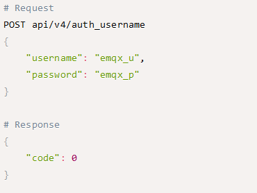
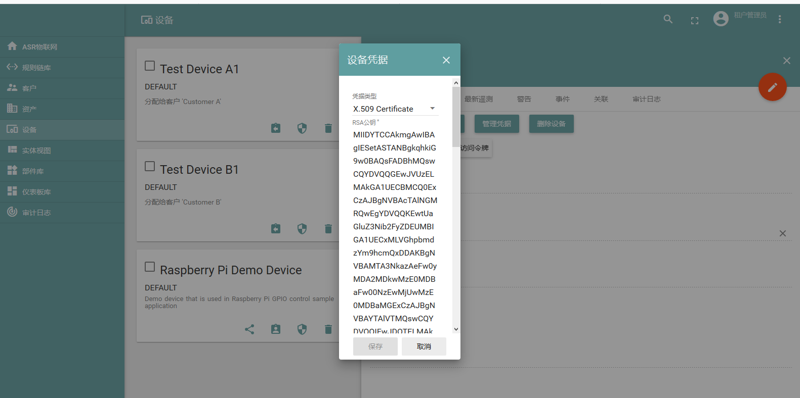
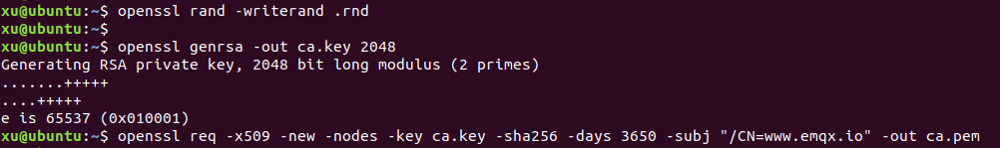
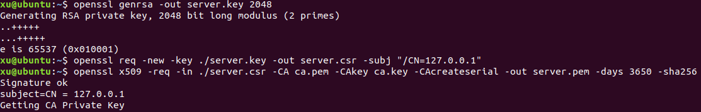
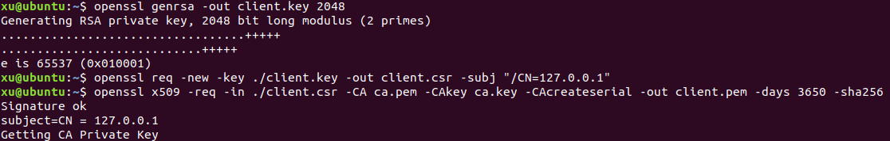
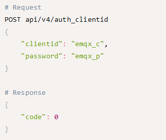

ASR550X和ASR582X系列私有云认证说明
==================================

前言
----

**关于本文档**

本文档旨在介绍如何搭建 ASR IoT 550X 系列 Wi-Fi 芯片和 582X 系列 Wi-Fi+BLE Combo 芯片支持的两个认证平台，以及如何通过支持的认证方式来生成和使用证书。

**读者对象**

本文档主要适用于以下工程师：

-  软件工程师
-  技术支持工程师

**产品型号**

本文档适用于 ASR IoT 550X 系列 Wi-Fi 芯片和 582X 系列 Wi-Fi+BLE Combo 芯片。

**版权公告**

版权归 © 2022 翱捷科技股份有限公司所有。保留一切权利。未经翱捷科技股份有限公司的书面许可，不得以任何形式或手段复制、传播、转录、存储或翻译本文档的部分或所有内容。

**商标声明**

ASR、翱捷和其他翱捷商标均为翱捷科技股份有限公司的商标。

本文档提及的其他所有商标名称、商标和注册商标均属其各自所有人的财产，特此声明。

**免责声明**

翱捷科技股份有限公司对本文档内容不做任何形式的保证，并会对本文档内容或本文中介绍的产品进行不定期更新。

本文档仅作为使用指导，本文的所有内容不构成任何形式的担保。本文档中的信息如有变更，恕不另行通知。

本文档不负任何责任，包括使用本文档中的信息所产生的侵犯任何专有权行为的责任。

**防静电警告**

静电放电（ESD）可能会损坏本产品。使用本产品进行操作时，须小心进行静电防护，避免静电损坏产品。

**翱捷科技股份有限公司**

地址：上海市浦东新区科苑路 399 号张江创新园 10 号楼 9 楼 邮编：201203

官网： http://www.asrmicro.com/

**文档修订历史**

======== ========== ==================
**日期** **版本号** **发布说明**
======== ========== ==================
2020.06  V1.0.0     首次发布。
2022.12  V1.0.1     调整文档部分格式。
======== ========== ==================

1. 概述
-------

ASR 私有云目前部署了两种方案：ThingsBoard 平台和 EMQ 平台，并支持多种认证方式。

-  ThingsBoard 平台支持 Access Token 认证和 TLS/SSL 双向认证。
-  EMQ 平台支持 Username 认证、Client ID 认证以及 TLS/SSL 双向认证。

2. Username 认证
---------------

Username 认证的方式最为简单便捷，适用于资源有限的芯片方案，但是如果不配合使用 TLS/ SSL，其建立的 MQTT 连接不具备安全性，建议在安全性能要求较低的场景中使用。

2.1 ThingsBoard 平台 Access Token 认证
~~~~~~~~~~~~~~~~~~~~~~~~~~~~~~~~~~~

ThingsBoard 平台的 Access Token 认证同 EMQ 平台的 Username 认证，都是在 MQTT 登录时，填入 username。

ThingsBoard 平台默认无需 password，另可配合加上 one-way SSL 认证。可通过界面直接管理 token 值：

|image1|

2.2 EMQ 平台 Username 认证
~~~~~~~~~~~~~~~~~~~~~~~

EMQ 平台需加上 password，可通过 HTTP 接口对 EMQ 平台的 Username 进行管理：

|image2|

使用 POST 请求添加 username 为 emqx_u，password 为 emqx_p 的认证信息，返回信息中 code = 0 即为成功。

3.TLS/SSL 双向认证
-----------------

TLS/SSL 双向认证即服务器端和设备端需要相互校验，服务器需要校验每个设备，设备也需要校验服务器，这样对上下行链路的合法性都有保障。ThingsBoard 平台以及 EMQ 平台均支持此方案。

TLS/SSL 双向认证是一种高规格的加密手段，因此使用此认证方案所建立的 MQTT 连接最为可靠，但不适用于资源有限的芯片方案。\ **ASR550X 系列 Wi-Fi 芯片和 ASR582X 系列 Wi-Fi+BLE Combo 芯片的资源丰富，支持此功能，建议选用此认证方案。**

TLS/SSL 双向认证需要云端、设备端持有不同的证书和私钥：

-  服务器端需有 CA 证书、服务器证书和服务器私钥
-  设备端需有 CA 证书、客户端证书和客户端私钥

本方案选用的证书标准是 X.509，这是最为常用的数字证书格式标准。

3.1 ThingsBoard 平台下证书的使用方式
~~~~~~~~~~~~~~~~~~~~~~~~~~~~~~~~~~~

在搭建 ThingsBoard 平台的时候有脚本可以生成对应证书，这里不做赘述，可参考：

https://thingsboard.io/docs/user-guide/certificates/。

设备证书生成后，将证书填入设备的管理界面：

|image3|

3.2 EMQ 平台下证书的使用方式
~~~~~~~~~~~~~~~~~~~~~~~~~~~

在 EMQ 平台下证书的生成和使用方式，以 ASR550X 芯片和 ubuntu 18.04 为例，说明如下：

1. Linux 环境下，需先安装 openssl：

   *sudo apt-get install openssl*

   *sudo apt-get install libssl-dev*

2. 生成自签名的 CA key 和证书（若已有 CA 证书，可跳过）：

   (1) 生成 CA 的私钥，无加密：

   *openssl genrsa -out ca.key 2048*

   (2) 给 CA 自身创建一个证书，有效期十年，这里的申请信息为 */CN=www.emqx.io* ，客户可自行修改：

   *openssl req -x509 -new -nodes -key ca.key -sha256 -days 3650 -subj “/CN=www.emqx.io” -out ca.pem*

|image4|

3. 生成服务器端的 key 和证书：

   (1) 生成服务器的私钥，无加密：

   *openssl genrsa -out server.key 2048*

   (2) 通过服务器私钥生成服务器 CSR 签名请求：

   *openssl req -new -key ./server.key -out server.csr -subj “/CN=127.0.0.1”*

   (3) 使用 CA 证书及 CA 私钥对请求签发证书进行签发，生成服务器的 X.509 证书：

   *openssl x509 -req -in ./server.csr -CA ca.pem -CAkey ca.key -CAcreateserial -out server.pem -days 3650 -sha256*

|image5|

4. 生成客户端 key 和证书：

   (1) 生成客户端的私钥，无加密：

   *openssl genrsa -out client.key 2048*

   (2) 通过客户端私钥生成客户端 CSR 签名请求：

   *openssl req -new -key ./client.key -out client.csr -subj “/CN=127.0.0.1”*

   (3) 使用 CA 证书及 CA 私钥对请求签发证书进行签发，生成客户端的 X.509 证书：

   *openssl x509 -req -in ./client.csr -CA ca.pem -CAkey ca.key -CAcreateserial -out client.pem -days 3650 -sha256*

|image6|

5. 将服务器端证书 server.key，server.pem 和 CA 证书 ca.pem 放入 */etc/emqttd/certs* 目录下。

6. 修改 emq.conf 配置文件：

   ## SSL Options

   *listener.ssl.external.handshake_timeout = 15*

   *listener.ssl.external.keyfile = /etc/certs/server.key*

   *listener.ssl.external.certfile = /etc/certs/server.pem*

   ## 开启双向认证

   *listener.ssl.external.cacertfile = /etc/certs/ca.pem*

   *listener.ssl.external.verify = verify_peer*

   *listener.ssl.external.fail_if_no_peer_cert = true*

7. 重启 EMQ：

   *sudo service emqx restart*

8. 在 ASR550X SDK /cloud/src/private_cloud_ca.c 文件中，将：

   *mqtt_broker_ca_crt 替换为步骤 2 生成的 ca.pem 文件中的内容；*

   *mqtt_broker_client_cert 替换为步骤 4 生成的 client.pem 文件中的内容；mqtt_broker_client_private_key替换为步骤 4 生成的 client.key 文件中的内容。*

9. 步骤 4 可重复执行以生成不同的 key 以及证书。

4.Client ID 认证
---------------

EMQ 平台支持此认证方式，在 MQTT 登录时，限定 Client ID 以及登录密码，只有匹配上才能登录。可通过 HTTP 接口进行管理：

|image7|

使用 POST 请求添加 clientid 为 emqx_c，password 为 emqx_p 的认证信息，返回信息中 code = 0 即为成功。

Client ID 认证的方式与 Username 认证一样，如果不配合使用 TLS/SSL，其建立的 MQTT 连接不具备安全性。但是每台设备的 Client ID 需提前录入系统，再配合 HTTP 接口、数据库存储以及平台的注册功能使用。

5.ClientID+TLS/SSL 双向认证
--------------------------

ASR 云端部署的 EMQ 平台也可提供双层认证功能，接入方式是 MQTTS，证书的使用方式请参见 3.2 EMQ 平台下证书的使用方式中的说明，同时加上 ClientID+password 的认证，此种方案做到了对每个独立设备的管控，也可保证连接的可靠信，建议对安全性能要求较高的客户选用。

.. |image1| image:: ../../img/550X_私有云认证说明/图2-1.png

