ASR 透传系列 P2P 功能使用指南
==========================

前言
----

**关于本文档**

本文档旨在提供 ASR 透传类芯片的 P2P 功能使用指南。

**读者对象**

本文档主要适用于以下工程师：

-  软件工程师
-  技术支持工程师

**产品型号**

本文档适用于 ASR 透传类芯片（ASR553X、ASR5505S、ASR5825S 和 ASR5955S）。

**版权公告**

版权归 © 2024 翱捷科技股份有限公司所有。保留一切权利。未经翱捷科技股份有限公司的书面许可，不得以任何形式或手段复制、传播、转录、存储或翻译本文档的部分或所有内容。

**商标声明**

ASR、翱捷和其他翱捷商标均为翱捷科技股份有限公司的商标。

本文档提及的其他所有商标名称、商标和注册商标均属其各自所有人的财产，特此声明。

**免责声明**

翱捷科技股份有限公司对本文档内容不做任何形式的保证，并会对本文档内容或本文中介绍的产品进行不定期更新。

本文档仅作为使用指导，本文的所有内容不构成任何形式的担保。本文档中的信息如有变更，恕不另行通知。

本文档不负任何责任，包括使用本文档中的信息所产生的侵犯任何专有权行为的责任。

**防静电警告**

静电放电（ESD）可能会损坏本产品。使用本产品进行操作时，须小心进行静电防护，避免静电损坏产品。

**翱捷科技股份有限公司**

地址：上海市浦东新区科苑路 399 号张江创新园 10 号楼 9 楼 邮编：201203

官网： http://www.asrmicro.com/

**文档修订历史**

======== ========== ============
**日期** **版本号** **发布说明**
======== ========== ============
2024.02  V1.0.0     首次发布。
======== ========== ============

1. 概述
-------

本文主要介绍在 Linux 平台上如何加载 ASR 透传芯片驱动以及使用 P2P 功能的方法：在 Linux 系统中，采用 wpa_supplicant 工具启用 P2P 功能，并提供了不同角色下 wpa_supplicant 的使用示例。

P2P 功能全称为 Wi-Fi Peer-to-Peer，也称为 Wi-Fi 直连（Wi-Fi Direct）功能。它使得多个 Wi-Fi 设备可以在没有 AP（Access Point）的情况下组成一个网络。在 P2P 功能中，这个网络被称为 P2P Group。在 P2P Group 中，采用 1：n 的拓扑结构连接，即在这个网络中有且只有一个设备充当类似 AP 的角色，被称为 GO（Group Owner），而其他 1 个或多个设备可以连接到 GO，称为 GC（Group Client）。想要了解更详细的基础知识，可以查阅官方的 P2P 协议文档。

2. P2P 使用示例
--------------

使用 wpa_supplicant 进行 P2P 功能连接时，请确保在编译 wpa_supplicant 工具时开启了与 P2P 和 WPS 相关的宏。

2.1 加载驱动
~~~~~~~~~~~~

2.1.1 P2P 功能开启
^^^^^^^^^^^^^^^^^

在加载驱动时需要加上 p2p_debug=1 参数，手机才能够正常搜索到模组的设备名称：

``insmod asr595x.ko p2p_debug=1``

2.1.2 P2P+STA 共存功能开启
^^^^^^^^^^^^^^^^^^^^^^^^^

在加载驱动时需要加上 mrole_enable=1 p2p_debug=1 参数，开启 P2P+STA 共存功能：

``insmod asr595x.ko mrole_enable=1 p2p_debug=1``

2.2 P2P 配置文件
~~~~~~~~~~~~~~~

在使用 P2P 功能之前，需要在 wpa_supplicant 的配置文件中设置相关参数。以下是 ASR 提供的一个参考文件 asr_wpa_p2p.conf 配置：

``ctrl_interface=/var/run/wpa_supplicant  //创建和 wpa_supplicant 交互的 netlink 接口``

``device_name=asr_p2p  //设备广播的名称``

``device_type=1-0050F204-1  //主设备类型``

``config_methods=push_button  //使用 PBC 方式连接，ASR 不支持 PIN 连接``

2.3 P2P 功能示例
~~~~~~~~~~~~~~~

2.3.1 模组作为 GO
^^^^^^^^^^^^^^^^

在 P2P 设备连接过程中，通过 GO 协商来确定哪个设备将担任 GO 角色。协商的关键在于 intent 值的大小，其范围是 0 到 15。intent 值越大的设备将成为 GO 角色。如果需要强制模组作为 GO，可以在连接指令中将 intent 值设置为 15。

**1.** **运行wpa_supplicant**

使用如下指令，参考配置文件 asr_wpa_p2p.conf，开启 wpa_supplicant：

``wpa_supplicant -iwlan0 -Dnl80211 -t -dd -B -c asr_wpa_p2p.conf``

|image1|

**2.** **设置网卡 IP 启动**

由于 P2P GO 类似于 AP 的角色，因此需要为网卡设置一个 IP，并配置 DHCP 服务器。所设置的 IP 地址需要与 DHCP 服务器配置文件中的一致。在本例中，P2P 的 IP 地址被配置为 192.168.0.1：

``ifconfig wlan0 192.168.0.1/24``

|image2|

**3.** **开启DHCP服务器**

P2P GO 需要给其他 P2P GC 设备分配 IP 地址，所以需要配置 DHCP 服务器，这里选择使用 dhcpd 工具作为 DHCP 服务器，通过配置文件来设置 IP 字段等信息。参考指令如下：

``dhcpd -cf asr_dhcpd.conf wlan0 &``

asr_dhcpd.conf 配置文件参考如下：

``subnet 192.168.0.0 netmask  255.255.255.0 {``

​ ``range 192.168.0.2 192.168.0.250;``

​ ``option routers 192.168.0.1;``

​ ``option broadcast-address  192.168.0.255;``

``}``

|image3|

**4.** **进入wpa_supplicant交互界面**

使用 wpa_cli 命令来执行 P2P 相关操作：

``wpa_cli -i wlan0``

|image4|

**5.** **模组开启监听**

模组设置监听信道，这里设置 6 信道监听：

``p2p_set listen_channel 6``

开启监听，这里设置监听时间 100s：

``p2p_listen 100``

|image5|

此时打开手机 P2P 界面会显示模组 P2P 名称，本例为 asr_p2p。

安卓手机 P2P 界面一般在设置–>WLAN(无线网络)–>高级设置–>WLAN直连（无线直连）。

|image6|

**6.** **连接设备**

**6.1** **模组以GO模式主动连接手机**

(a) 模组主动搜索设备，本例搜索 5 秒，可通过 p2p_stop_find 手动停止扫描：

``p2p_find 5``

|image7|

搜索到设备会以 P2P-DEVICE-FOUND 字段打印详细信息。

(b) 模组主动连接搜索到的设备：

``p2p_connect 92:f0:52:f5:1b:12 pbc go_intent=15 freq=2437``

``92:f0:52:f5:1b:12``\ 表示搜索到的设备的 MAC 地址

``pbc``\ 表示使用 PBC 方式连接，不输入 PIN 码

``go_intent=15``\ 表示强制模组作为 GO 角色

``freq=2437``\ 表示指定 channel

|image8|

(c) 等待手机端接收邀请

按照步骤 (b) 发送连接指令后，手机端会弹出邀请确认，如下图：

|image9|

手机点击接收邀请后，开始连接，待打印 AP-STA-CONNECTED，表示设备连接成功。

|image10|

|image11|

**6.2** **手机主动连接，模组以强制GO模式连接**

(a) 按照步骤 5 模组开启监听模式，打开手机无线直连界面，可以搜索到当前模组的设备名称。

(b) 在手机上点击搜索到的设备发起连接，模组设备打印如下信息：

|image12|

(c) 模组设备发送以下指令来强制作为 GO，以响应手机发起的连接请求：

``p2p_connect 92:f0:52:f5:1b:12 pbc go_intent=15 freq=2437``

|image13|

.. attention::
手机请求连接后需要尽快在模组端发起连接命令，超过一定时间后再发起命令会执行失败。

**7.** **查看模组状态**

``status``

|image14|

**8.** **查看连接设备状态**

``all_sta``

|image15|

**9.** **断开连接**

``disconnect``

|image16|

2.3.2 模组作为GC
^^^^^^^^^^^^^^^^

P2P 设备在连接过程中通过 GO 协商确定哪个设备充当 GO 角色，哪个设备充当 GC 角色。协商的关键在于 intent 值的大小，其范围是 0~15。intent 值较小的设备将作为 GC 角色。模组在连接过程中可以将 intent 设置为 0，以确保其始终作为 GC 角色。

**1.** **运行wpa_supplicant**

使用如下指令，参考配置文件 asr_wpa_p2p.conf，开启 wpa_supplicant：

``wpa_supplicant -iwlan0 -Dnl80211 -t -dd -B -c asr_wpa_p2p.conf``

|image17|

**2.** **进入wpa_supplicant交互界面**

使用 wpa_cli 命令来执行 P2P 相关操作：

``wpa_cli -i wlan0``

|image18|

**3.** **设备开始监听**

模组设置监听信道，这里设置 6 信道监听：

``p2p_set listen_channel 6``

开启监听，这里设置监听时间 100s：

``p2p_listen 100``

|image19|

此时打开手机 P2P 界面会显示模组 P2P 名称，本例为 asr_p2p。

安卓手机 P2P 界面一般在设置–>WLAN (无线网络)–>高级设置–>WLAN 直连（无线直连）。

|image20|

**4.** **连接设备**

4.1 模组以 GC 模式主动连接

(a) 模组主动搜索设备，本例搜索 5 秒，可通过 p2p_stop_find 手动停止扫描：

``p2p_find 5``

|image21|

搜索到设备会以 P2P-DEVICE-FOUND 字段打印详细信息。

(b) 模组主动连接搜索到的设备

``p2p_connect 92:f0:52:f5:1b:12 pbc go_intent=0``

``92:f0:52:f5:1b:12``\ 表示搜索到的设备的 MAC 地址

``pbc``\ 表示使用 PBC 方式连接，不输入 PIN 码

``go_intent=0``\ 表示强制模组作为 GC 角色

|image22|

(c) 等待手机端接收邀请

按照步骤 (b) 发送连接指令后，手机端会弹出邀请确认，如下图：

|image23|

手机点击接收邀请后，待打印 CTRL-EVENT-CONNECTED，说明连接成功，如下图所示：

|image24|

(d) 获取 IP 地址

使用 ctrl-c 退出 wpa_supplicant 交互界面后，执行 udhcpc 应用 DHCP 服务端（手机）获取 IP 地址：

``udhcpc -i wlan0``

|image25|

(e) 查看连接状态

再次进入 wpa_supplicant 交互界面查看连接状态：

``status``

|image26|

4.2 手机发起连接，模组以 GC 模式主动应答连接

(a) 按照步骤 3，模组开启监听模式，打开手机无线直连界面，可以搜索到当前模组的设备名称。

在手机上点击搜索到的设备发起连接，模组设备打印如下信息：

|image27|

(b) 模组设备发送以下指令来强制作为 GO，以响应手机发起的连接请求：

``p2p_connect 92:f0:52:f5:1b:12 pbc go_intent=0``

|image28|

(c) 获取 IP 地址

使用 ctrl-c 退出 wpa_supplicant 交互界面后，执行 udhcpc 应用，从 DHCP 服务端（手机）获取 IP 地址：

``udhcpc -i wlan0``

|image29|

(d) 查看连接状态

再次进入 wpa_supplicant 交互界面查看连接状态：

``status``

|image30|

2.3.3 模组P2P+STA共存
^^^^^^^^^^^^^^^^^^^^^

按照 2.1.2 小节指令加载驱动，开启 P2P+STA 共存功能，驱动加载成功后使用 ifconfig -a 可以看到 2 个无线网口，其中 asrcfgwlan 为 P2P 使用网口，wlan0 为 STA 使用网口：

|image31|

**1.** **创建wpa_supplicant软连接**

因为 P2P 功能和 STA 功能都需要用到 wpa_supplicant 工具，所以可以创建一个软连接来区分用于 P2P 和 STA 的 wpa_supplicant：

|image32|

**2.** **开启P2P功能**

按照 2.3.1 和 2.3.2 小节步骤开启 P2P 功能，需要注意的是开启 wpa_supplicant、dhcpd 以及使用 wpa_cli 命令时，网络端口要选择 asrcfgwlan，如下所示：

``p2p_wpa_supplicant -i asrcfgwlan -Dnl80211 -t -dd -B -c asr_wpa_p2p.conf``

``dhcpd -cf asr_dhcpd.conf asrcfgwlan &``

``wpa_cli -i asrcfgwlan``

|image33|

|image34|

|image35|

**3.** **开启STA功能**

用户可以通过修改配置文件来设置想要连接 AP 的 ssid 和 password，开启 wap_supplicant 后会自动连接配置文件中指定的 AP，使用如下指令开启，网络端口选择 wlan0：

``wpa_supplicant -i wlan0 -Dnl80211 -t -dd -B -c wpa_supplicant.conf``

其中 wpa_supplicant.con f即为配置文件，配置文件参考如下:

``ctrl_interface=/var/run/wpa_supplicant``

``ap_scan=1``

``network={``

​ ``ssid="test_ap"``

​ ``psk="asr123456"``

​ ``scan_ssid=1``

``}``

.. attention::
    1. 为了确保在共存模式下的吞吐率数据，P2P 功能和 STA 连接的远端 AP 最好配置在相同信道。 
    2. 如果无法确保两个功能在共存模式下保持在同一信道上，那么最好让模组充当 P2P GO 角色。

.. |image1| image:: ../../img/透传系列_P2P功能使用指南/图2-1.png
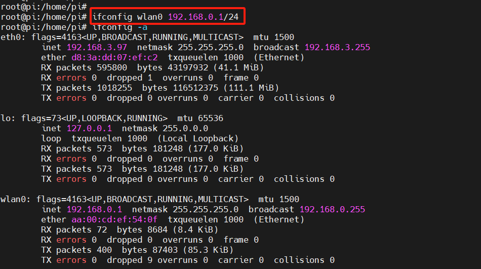
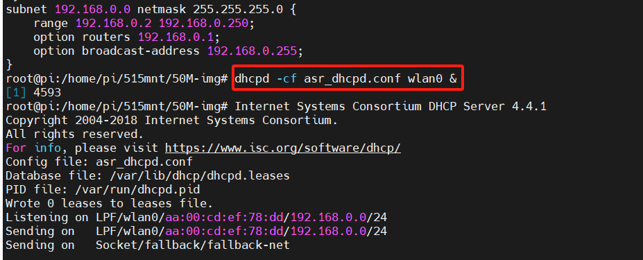
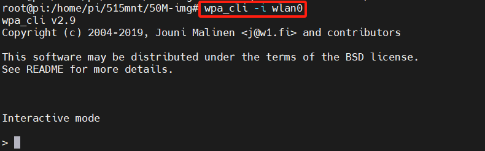
.. |image5| image:: ../../img/透传系列_P2P功能使用指南/图2-5.png
.. |image6| image:: ../../img/透传系列_P2P功能使用指南/图2-6.png
.. |image7| image:: ../../img/透传系列_P2P功能使用指南/图2-7.png

.. |image9| image:: ../../img/透传系列_P2P功能使用指南/图2-9.png
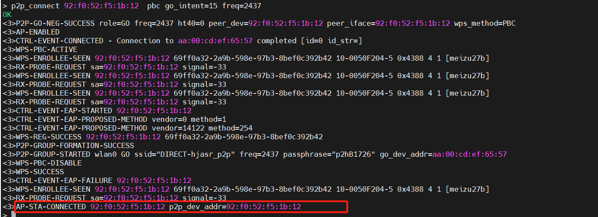

.. |image12| image:: ../../img/透传系列_P2P功能使用指南/图2-11.png
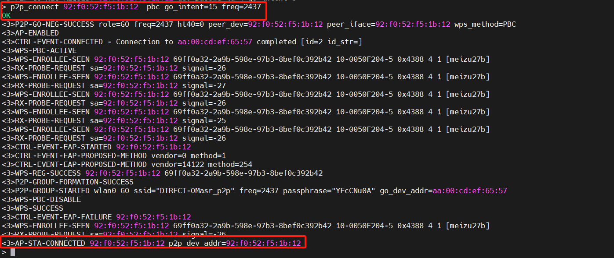
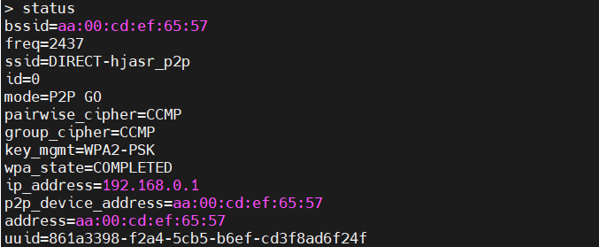
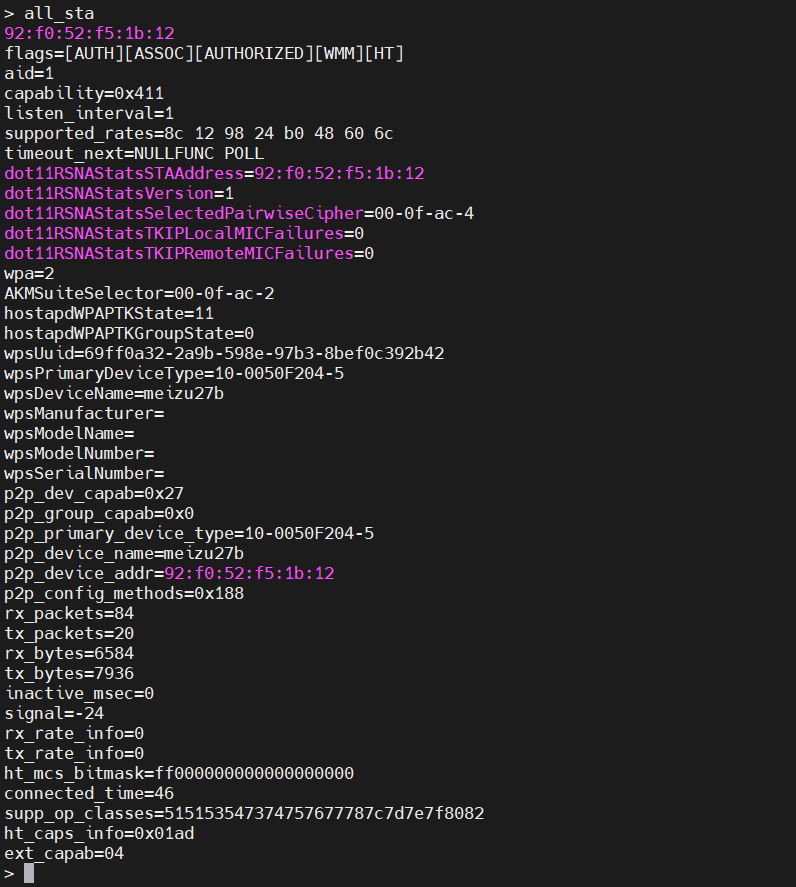

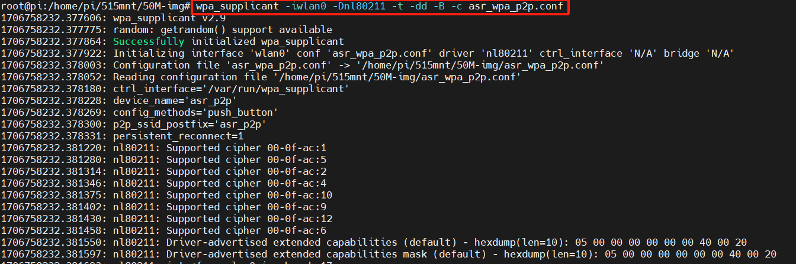
.. |image18| image:: ../../img/透传系列_P2P功能使用指南/图2-17.png
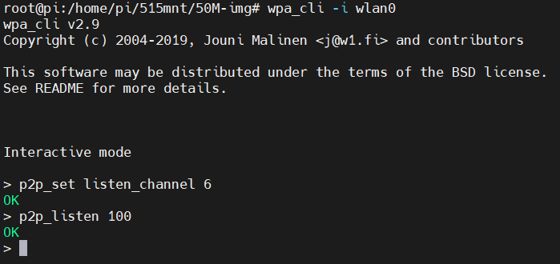
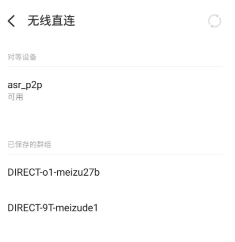
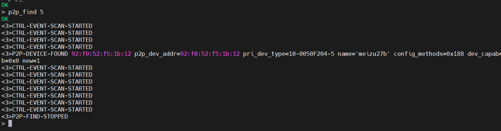

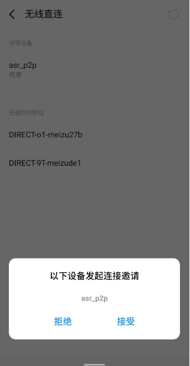
.. |image24| image:: ../../img/透传系列_P2P功能使用指南/图2-23.png
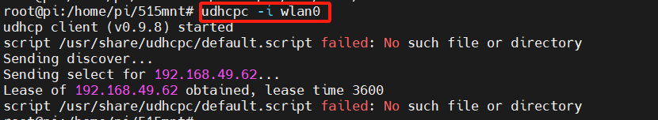
.. |image26| image:: ../../img/透传系列_P2P功能使用指南/图2-25.png
.. |image27| image:: ../../img/透传系列_P2P功能使用指南/图2-26.png
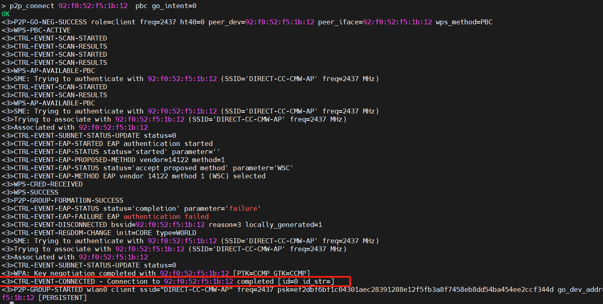
.. |image29| image:: ../../img/透传系列_P2P功能使用指南/图2-28.png
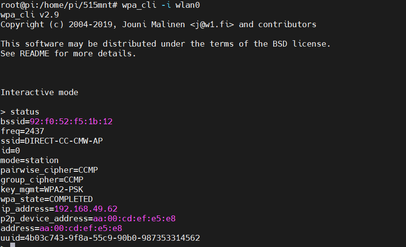
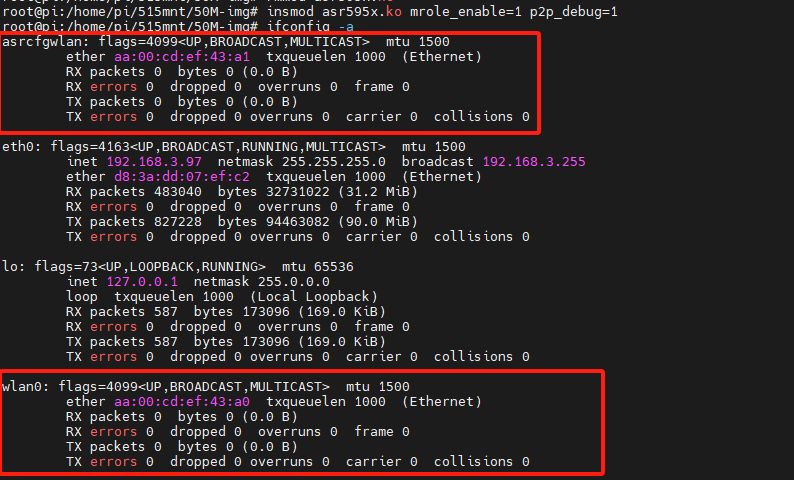

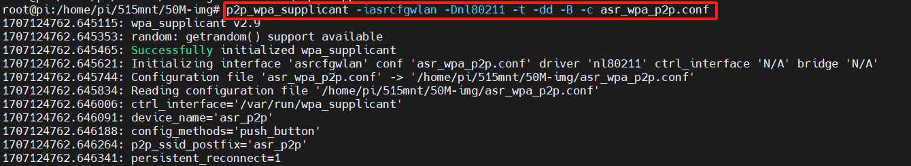
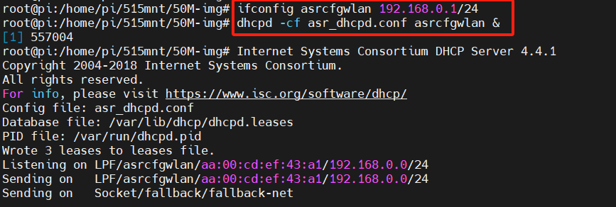
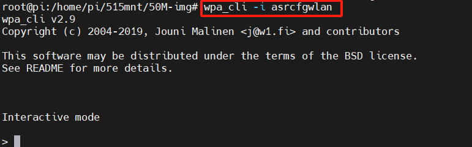

