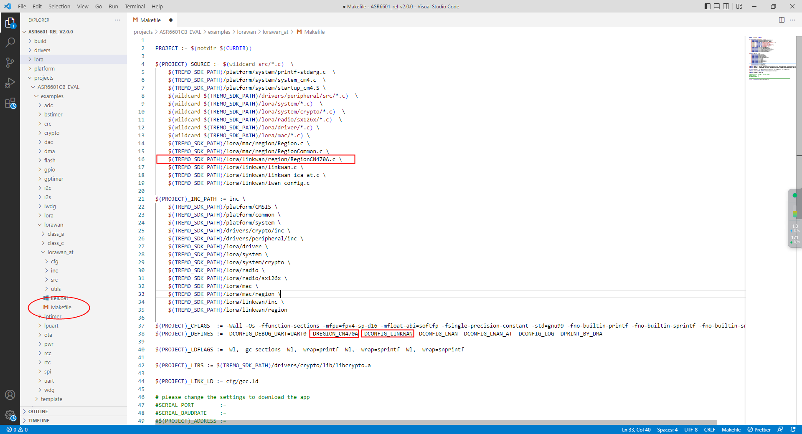
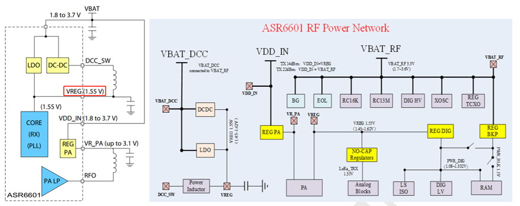
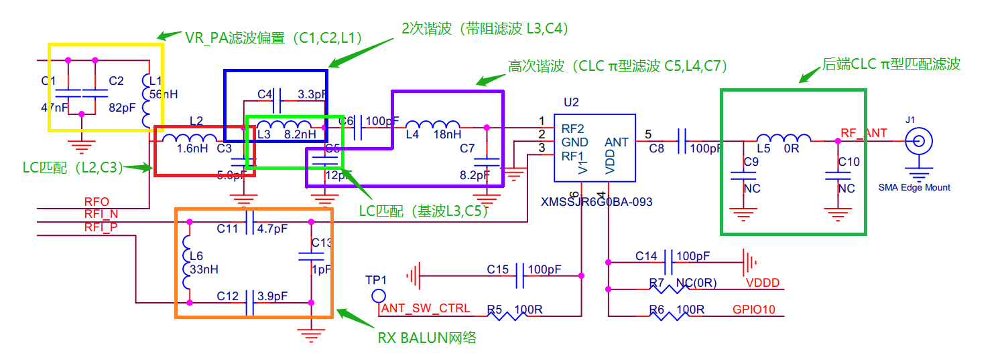

.. role:: raw-latex(raw)
   :format: latex
..

ASR6601 常见问题
================
`English <https://asriot.readthedocs.io/en/latest/ASR6601/FAQs/FAQs.html>`_

前言
----

**关于本文档**

本文档介绍了 ASR6601 的常见问题以及解答。

**读者对象**

本文档主要适用于以下工程师：

-  软件工程师
-  技术支持工程师

**产品型号**

与本文档相对应的产品型号如下：

+------------+-----------+----------+--------------------------------------------+---------------+---------------+
| **型号**   | **Flash** | **SRAM** | **内核**                                   | **封装**      | **频率**      |
+============+===========+==========+============================================+===============+===============+
| ASR6601SE  | 256 KB    | 64 KB    | 32-bit 48 MHz Arm China STAR-MC1 Processor | QFN68, 8*8 mm | 150 ~ 960 MHz |
+------------+-----------+----------+--------------------------------------------+---------------+---------------+
| ASR6601CB  | 128 KB    | 16 KB    | 32-bit 48 MHz Arm China STAR-MC1 Processor | QFN48, 6*6 mm | 150 ~ 960 MHz |
+------------+-----------+----------+--------------------------------------------+---------------+---------------+
| ASR6601SER | 256 KB    | 64 KB    | 32-bit 48 MHz Arm China STAR-MC1 Processor | QFN68, 8*8 mm | 150 ~ 960 MHz |
+------------+-----------+----------+--------------------------------------------+---------------+---------------+
| ASR6601CBR | 128 KB    | 16 KB    | 32-bit 48 MHz Arm China STAR-MC1 Processor | QFN48, 6*6 mm | 150 ~ 960 MHz |
+------------+-----------+----------+--------------------------------------------+---------------+---------------+

**版权公告**

版权归 © 2023 翱捷科技股份有限公司所有。保留一切权利。未经翱捷科技股份有限公司的书面许可，不得以任何形式或手段复制、传播、转录、存储或翻译本文档的部分或所有内容。

**商标声明**

ASR、翱捷和其他翱捷商标均为翱捷科技股份有限公司的商标。

本文档提及的其他所有商标名称、商标和注册商标均属其各自所有人的财产，特此声明。

**免责声明**

翱捷科技股份有限公司对本文档内容不做任何形式的保证，并会对本文档内容或本文中介绍的产品进行不定期更新。

本文档仅作为使用指导，本文的所有内容不构成任何形式的担保。本文档中的信息如有变更，恕不另行通知。

本文档不负任何责任，包括使用本文档中的信息所产生的侵犯任何专有权行为的责任。

**防静电警告**

静电放电（ESD）可能会损坏本产品。使用本产品进行操作时，须小心进行静电防护，避免静电损坏产品。

**翱捷科技股份有限公司**

地址：上海市浦东新区科苑路 399 号张江创新园 10 号楼 9 楼 邮编：201203

官网： http://www.asrmicro.com/

**文档修订历史**

======= ====== ==========
日期    版本号 发布说明
======= ====== ==========
2023.07 V1.0.0 首次发布。
======= ====== ==========

1. 软件相关
-----------

1.1 量产烧录工具是否支持地址码步进？
~~~~~~~~~~~~~~~~~~~~~~~~~~~~~~~~~~~~

量产烧录工具主界面中的\ **Keys Folder**\ 选项可用于递进烧录文件，用户可以把地址码按每模组一文件放到递进的文件夹里烧录。

1.2 Main、AON、AONR 电源域的定义是什么？
~~~~~~~~~~~~~~~~~~~~~~~~~~~~~~~~~~~~~~~

Main 是通用的电源域，AON (always on) 是给 RTC 用的电源域，AONR (always on retention) 是给 SRAM 用的电源域。

1.3 TX 没有信号发出，是什么原因？
~~~~~~~~~~~~~~~~~~~~~~~~~~~~~~~~

请依次检查以下各项：

(1) 发送频率和测量频率是否一致。

(2) 匹配电路是否正常。

(3) XO32M 晶体是否起振。检查方法：烧录 XO32M.bin 后，接上串口（串口的 pin 分别为 GPIO16 和 GPIO17），如果串口打印 “XO32M OK”，则说明 XO32M 起振。

1.4 如何判别 XO32K 是否起振？
~~~~~~~~~~~~~~~~~~~~~~~~~~~

烧录 XO32K.bin 后，接上串口（串口的 pin 分别为 GPIO16 和 GPIO17），如果串口打印 “XO32K OK”，则说明 XO32K 起振。

1.5 如何避免 RTC 使用 XO32K 时钟时不工作？
~~~~~~~~~~~~~~~~~~~~~~~~~~~~~~~~~~~~~~

在使能 RTC 时钟之前需要先通过调用接口 rcc_enable_oscillator (RCC_OSC_XO32K, true) 来使能 XO32K 时钟。

1.6 RTC_TAMPER/RTC_WAKEUPx 这种 IO 口有什么作用？
~~~~~~~~~~~~~~~~~~~~~~~~~~~~~~~~~~~~~~~~~~~~~~

在休眠模式下，通过 RTC 模块检测 GPIO 电平来唤醒 CPU，参考 SDK 中的 rtc:raw-latex:`\wakeup例程`。

1.7 Stop3 模式下，配置 GPIO 唤醒后却不起作用，是什么原因？
~~~~~~~~~~~~~~~~~~~~~~~~~~~~~~~~~~~~~~~~~~~~~~~~~~~~~~~

Stop3 模式下，每 4 个 GPIO 为一组，一组可以产生一个唤醒信号，各组的唤醒电平和唤醒信号都是统一配置的。具体请参考《ASR6601_参考手册》GPIO 章节中的 gpiox_stop3_wu_cr 寄存器的描述，以及参考 SDK 中的 gpio_config_stop3_wakeup 接口信息。

1.8 UART 的 RX_DONE 和 RX_TIMEOUT 中断有什么差别？
~~~~~~~~~~~~~~~~~~~~~~~~~~~~~~~~~~~~~~~~~~~~~

UART FIFO 模式，当 RX FIFO 中的数据达到预设的水位值就会触发 RX_DONE 中断。如果 RX FIFO 不为空，且没有达到 FIFO 预设水位，在接收完前一个字符后的32bit时间内没有收到数据，就会触发 RX_TIMEOUT 中断。

1.9 如何通过 LoRa 唤醒 MCU？
~~~~~~~~~~~~~~~~~~~~~~~~~

Stop3 模式下，通过代码 PWR->CR1 \|= (1<<7) 配置 LoRa 唤醒 MCU。

Stop0~Stop2 模式下，通过代码 PWR->CR0 \|= (1<<6) 配置 LoRa 唤醒 MCU。

1.10 芯片复位时，各 GPIO 是什么状态？
~~~~~~~~~~~~~~~~~~~~~~~~~~~~~~~~~~~

芯片复位时，GPIO06/07 默认被用作 SWD 功能。如果一直按着开发板上的\ **Reset**\ 按钮，那么 GPIO02 与 GPIO03 就一直处于输入下拉状态；释放\ **Reset**\ 按钮，GPIO02 和 GPIO03 就会切换到高阻态。

1.11 为什么 ADC 使用 6K 采样率时，采样值偏差大？
~~~~~~~~~~~~~~~~~~~~~~~~~~~~~~~~~~~~~~~~~~~~

ADC 需要使用 10K 或以上采样率，不支持 10K 以下的采样率。

1.12 为什么 ADC 使用 1M 采样率时，采样值偏差大？
~~~~~~~~~~~~~~~~~~~~~~~~~~~~~~~~~~~~~~~~~~~~

当 ADC 使用的采样率大于或等于 500K 时，需要使用 DMA 方式，如果使用轮询方式，会出现因程序的执行速度慢而导致采样数据有溢出，采样值不准的情况。

1.13 ADC 采样值误差超过 10 mV，应如何处理？
~~~~~~~~~~~~~~~~~~~~~~~~~~~~~~~~~~~~~~~~~

ADC 采样时，每个通道最好采样 20 至 30 次，然后把采样结果做平均，将平均值作为最后的采样值。

1.14 为什么 ADC 的 VBAT31 通道读到的电压不准？
~~~~~~~~~~~~~~~~~~~~~~~~~~~~~~~~~~~~~~~~~~

ADC 内部的 VBAT31 分压默认是关闭的，得在 adc_init 前调用 adc_enable_vbat31 接口使能内部 VBAT31 分压。

1.15 如何配置 ADC 参考电压为外部参考？
~~~~~~~~~~~~~~~~~~~~~~~~~~~~~~~~~~~~

ADC 使用参考电压需要通过模拟部分RST寄存器的 D_ADC_SEL_VREF 位来配置，清 0 配置为外部参考电压，置 1 配置为内部参考电压，默认为 1。

TREMO_ANALOG_WR(0X12, ((TREMO_ANALOG_RD(0x12) & (~(1<<6)))));

1.16 LPTIMER 使用外部时钟时初始化失败，是什么原因？
~~~~~~~~~~~~~~~~~~~~~~~~~~~~~~~~~~~~~~~~~~~~~~~~~~

当 LPTIMER 使用外部时钟时，ETR pin 脚需要先输入时钟，LPTIMER 才能初始化成功。

1.17 为什么 48-pin Demo 板的 GPIO62 功能无效？
~~~~~~~~~~~~~~~~~~~~~~~~~~~~~~~~~~~~~~~~~~

早期 48-pin Demo 板使用的是 ASR6601DB，ASR6601DB 的 PIN24 引脚封装出来的是 GPIO61，而 ASR6601CB 的 PIN24 引脚封装出来的是 GPIO62。ASR6601DB 是工程芯片，ASR6601CB 是量产芯片。

1.18 如何从 MCO 输出晶振时钟？
~~~~~~~~~~~~~~~~~~~~~~~~~~~~

gpio_set_iomux(GPIOA, GPIO_PIN_5, 5);

rcc_set_mco_clk_source(RCC_MCO_CLK_SOURCE_XO32K);

rcc_set_mco_clk_div(RCC_MCO_CLK_DIV_1);

rcc_enable_mco_clk_output(true);

1.19 如何配置 LinkWAN 协议？
~~~~~~~~~~~~~~~~~~~~~~~~~~

ASR6601 支持 LinkWAN 协议，通过修改 SDK 中的 lorawan_at 工程的\ **Makefile**\ 来配置。

|image1|

2. 硬件相关
-----------

2.1 如何避免RST复位异常？
~~~~~~~~~~~~~~~~~~~~~~~~~

ASR6601 的上电复位电路和上电时序都集成到了芯片内部，直接在 VBAT 上正常加载电压即可。

|image2|

VBAT 电源要在 10 毫秒内上升到 0.7 Vcc 以上，内部 Power RST 电路才能正常 reset。芯片内部有低电压检测模块，当 VBAT 低于 0.3 Vcc 时，芯片内部就会一直处于 reset 状态。

芯片内部已进行优化，RST 外部上拉电阻推荐 4.7K，复位电容推荐 330 pf，尽可能较少延迟复位时间，如外部外挂大电容的话，VBAT 上升比较缓慢，系统会存在不必要的风险（比如 Flash 可能会被擦除）。

2.2 电源部分注意事项有哪些？
~~~~~~~~~~~~~~~~~~~~~~~~~~~~

ASR6601 射频电路内部集成 DC-DC 和 LDO，输入为 VBAT_DCC（VBAT）；输出为 VREG，其电压是 1.55 V。VDCC_RF 需要接 VREG，NC 或者接 VCC，会导致芯片 RF 部分不能正常工作，甚至烧掉。

|image3|

VDD_IN 电压输入到 Regulator（REG PA）输出为 VR_PA，VR_PA 的值随输出功率变化，VR_PA 通过外部的上拉电感给 PA 的输出极 RFO 提供偏置。

VDD_IN 正常接 VCC 即可，TX 功率需求小于 14 dBm 时，可由 VREG 直接给 VDD_IN 供电，提高效能。

ASR6601 的电源分成四个部分：\ *VBAT_ESDx (x=0-3)*\ ，\ *VBAT_ANA*\ ，\ *VBAT_RF*\ 和\ *VBAT_RTC*\ 。\ *VBAT_ESDx*\ 给 MCU 的数字部分供电，\ *VBAT_ANA*\ 给 MCU 的模拟部分（ADC）供电，\ *VBAT_RF* 给射频部分供电，\ *VBAT_RTC* 给 RTC 时钟供电。

|image4|

VBAT_ESD0~3 某一个供电管脚未接，会导致 GPIO 被设置为推挽输出，引脚无法输出稳定高电平。表现现象为 GPIO 外部添加上拉电阻的引脚逻辑都正常，无外部上拉的引脚无法输出高电平。

2.3 如何分析 RF 性能结果较差的问题？
~~~~~~~~~~~~~~~~~~~~~~~~~~~~~~~~~~

1. **TX** **无功率输出**

   (1) 确认模块 VDDD、VDDA 以及 VDD_RF 这三部分电压是否正常。

   (2) 确认模块 32M 晶振是否起振，输出频率是否正确，注意区分 TCXO 跟 XO 的差异，需修改程序设置。

   (3) 确认模块 32.768K 晶振是否起振，输出频率是否正确，需要特别注意是 ASR6601 外部 32.768K 外接的负载电容 CL 为 6 pf，模组上负载电容可直接 NC。

2. **TX输出功率峰值较低**

   (1) 参考设计中，Buck 电路中的 15uH 电感必须用功率电感。

   (2) VR_PA 处的 56nH 偏置电感强烈建议选用 0402 高 Q 系数电感，ESR 越小，越利于提升 TX 功率。

   (3) 匹配拓扑由 L2 和 C15 组成，输出功率同步较低，可尝试将 C15 增大至 15 pf，再看输出功率是否满足要求，注意 C15 不能改太大，否则会影响高次谐波，输出功率优化在 20~21 dB 之间即可。

   (4) 如果更换 C15 后，输出功率依旧满足 20 dB 的话，建议更换射频开关测试验证，因为部分射频开关在设计之初是用于 2G 模块，验证频率是从 700M 开始，如用在 LoRa 模块 510M 以下，输出功率会略差。

3. **TX 输出高次谐波偏大**

高阶谐波滤波器主要由 C5、L4 和 C7 组成，高次谐波测试偏高，一般建议优化 C7，可将 C7 改为 5.6 pf 或 8.2 pf 再进行验证。增大 C5 的话，可提高发射功率，但会恶化 2 次谐波。电感 L4 的大小对高次谐波抑制的作用不明显。

4. **RX 接收灵敏度偏低**

如果 RX 与芯片的参考值相差 2~3 dBm，可通过优化\ *Balun*\ 网络来解决；

如果 RX 与芯片的参考值相差超过 20 dBm，确认\ *Balun*\ 网络元器件无问题之后，可排除\ *Balun*\ 网络的适配问题，应该是控制逻辑出问题，注意单双端开关控制的差异以及不同厂家之间存在的差异：

-  PE4259 VDD 可以由 RF_3V3（或者普通 GPIO 口直接控制），作为 VDD 控制。

-  PE4259 CTRL 由 ANT_SW_CTRL（主要为控制 TX 和 RX 输出），作 IO 口控制。

|image5|

2.4 VR_PA 偏置和滤波选型建议？
~~~~~~~~~~~~~~~~~~~~~~~~~~~~~

直流偏置电感 L1 选型建议：

-  工作频率在 800 MHz 以上，建议选 47 nH；
-  工作频率在 300 MHz 和 500 MHz 之间，建议选 56~68 nH；
-  工作频率在 150 MHz 和 300 MHz之间，建议选 130~160 nH。

2.5 量产烧录 FAIL 是什么原因造成的？
~~~~~~~~~~~~~~~~~~~~~~~~~~~~~~~~~~

出现模组没能正常烧录完成的情况时，需排查下列原因：

1. 检查串口连接是否正常。

2. 尝试交叉验证，排查模组本身是否异常。

3. 检查模组是否进入下载模式，可尝试重新拉高 GPIO02，然后按 Reset 按钮复位模组。

.. |image2| image:: ../../img/6601_常见问题/图2-1.png

.. |image4| image:: ../../img/6601_常见问题/图2-3.png

