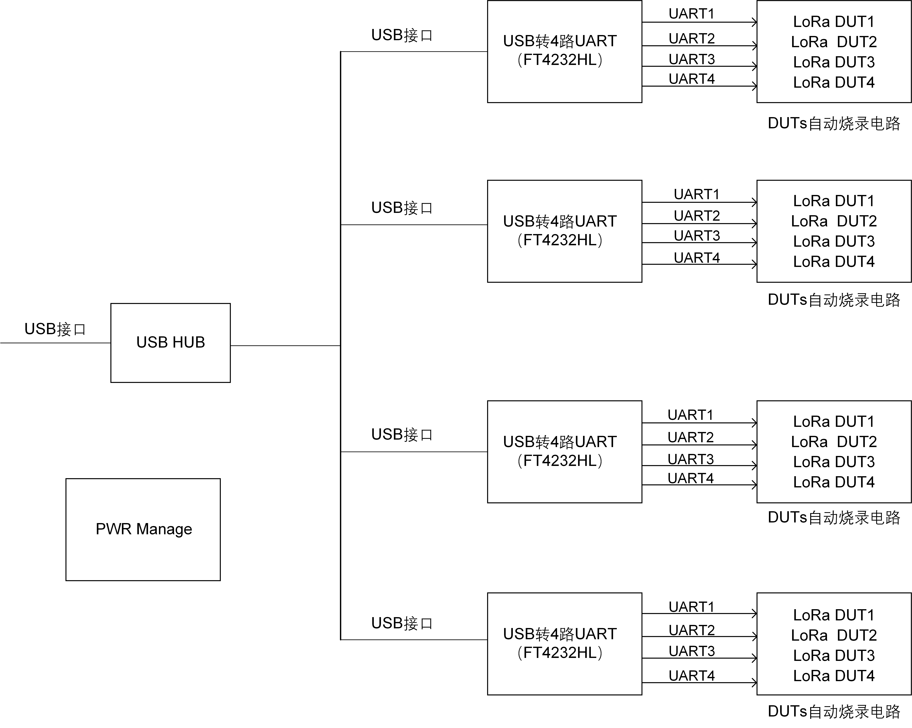
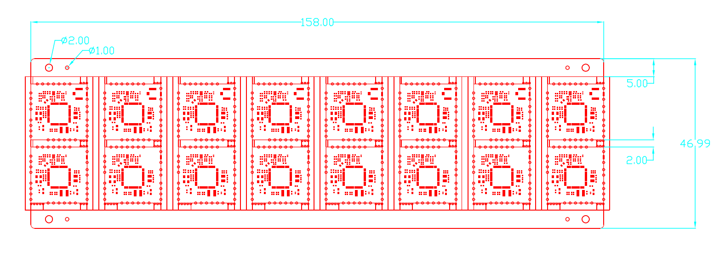
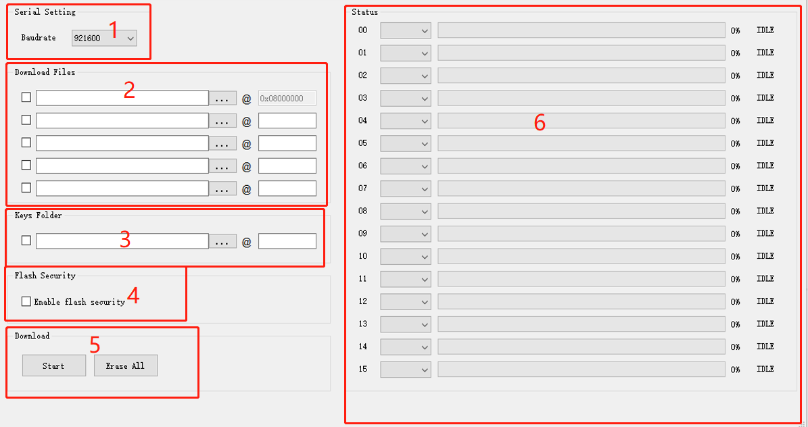
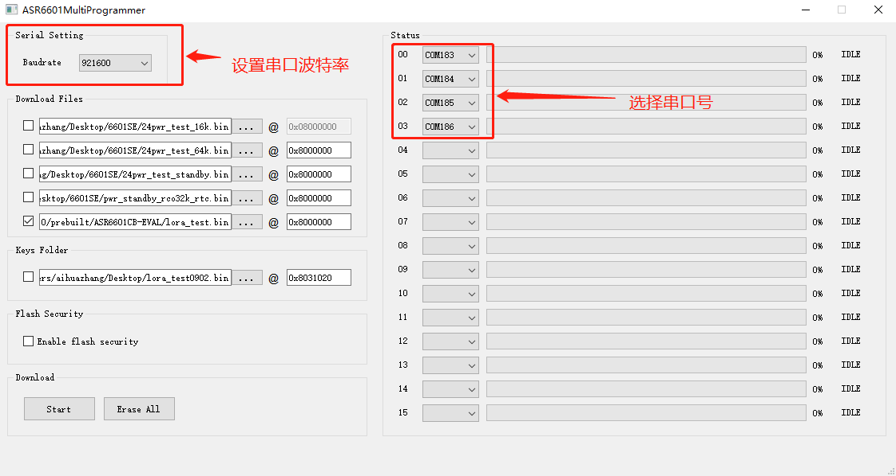
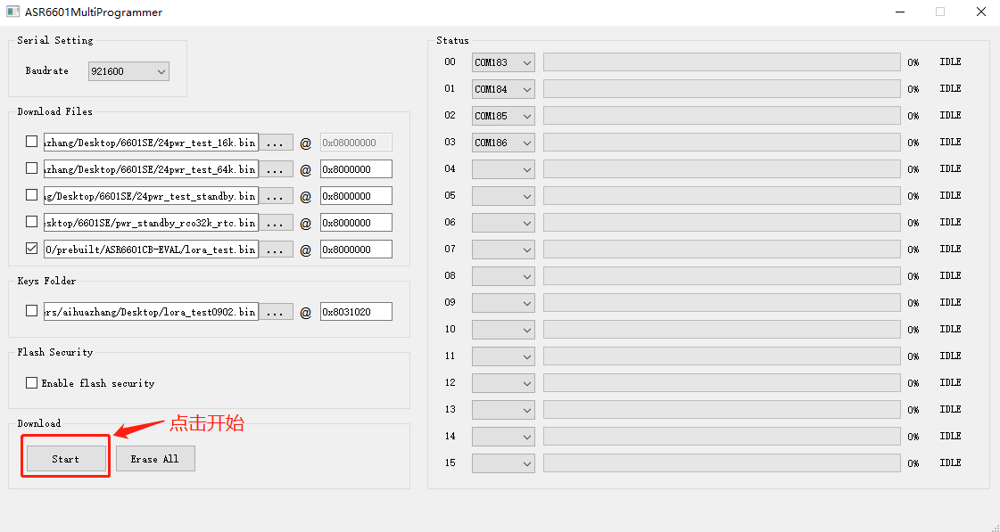
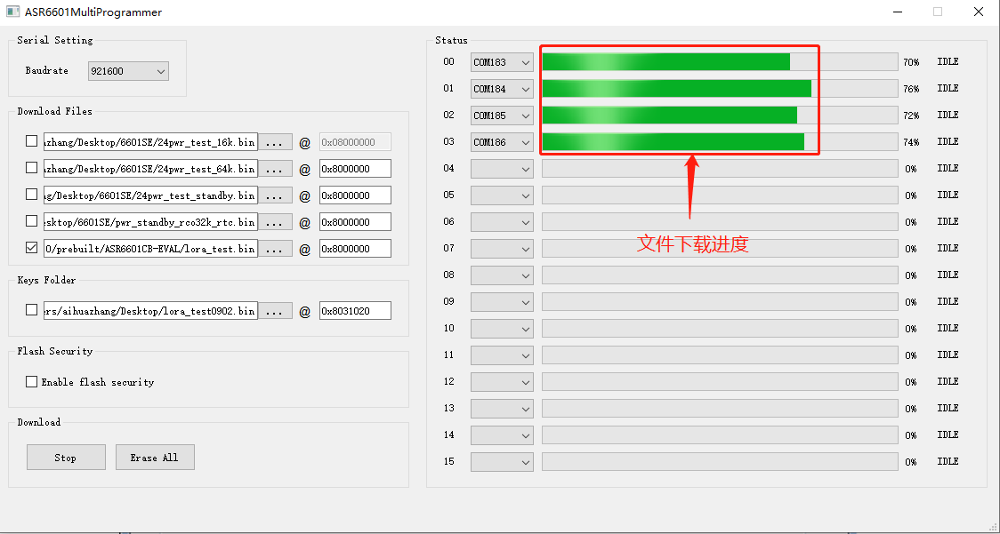
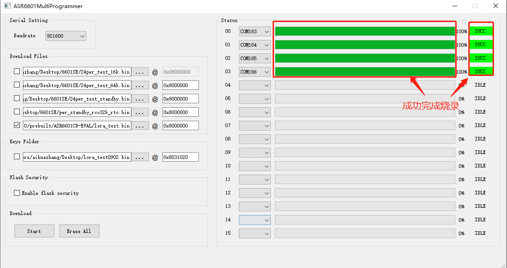

ASR6601量产烧录方案介绍
=======================

前言
----

**关于本文档**

本文档主要介绍了ASR6601CB和ASR6601SE芯片量产烧录方案，方案主要包括量产烧录治具的设计和使用，以及ASR6601量产烧录软件ASR6601MultiProgrammer的使用说明，方便客户量产时对ASR6601的Flash进行批量烧录。

**产品型号**

与本文档相对应的产品型号如下：

+-----------+--------+-------+--------------------------------------------+---------------+---------------+
| 型号      | Flash  | SRAM  | 内核                                       | 封装          | 频率          |
+===========+========+=======+============================================+===============+===============+
| ASR6601SE | 256 KB | 64 KB | 32-bit 48 MHz Arm China STAR-MC1 Processor | QFN68, 8*8 mm | 150 ~ 960 MHz |
+-----------+--------+-------+--------------------------------------------+---------------+---------------+
| ASR6601CB | 128 KB | 16 KB | 32-bit 48 MHz Arm China STAR-MC1 Processor | QFN48, 6*6 mm | 150 ~ 960 MHz |
+-----------+--------+-------+--------------------------------------------+---------------+---------------+

**版权公告**

版权归 © 2023 翱捷科技股份有限公司所有。保留一切权利。未经翱捷科技股份有限公司的书面许可，不得以任何形式或手段复制、传播、转录、存储或翻译本文档的部分或所有内容。

**商标声明**

ASR、翱捷和其他翱捷商标均为翱捷科技股份有限公司的商标。

本文档提及的其他所有商标名称、商标和注册商标均属其各自所有人的财产，特此声明。

**免责声明**

翱捷科技股份有限公司对本文档内容不做任何形式的保证，并会对本文档内容或本文中介绍的产品进行不定期更新。

本文档仅作为使用指导，本文的所有内容不构成任何形式的担保。本文档中的信息如有变更，恕不另行通知。

本文档不负任何责任，包括使用本文档中的信息所产生的侵犯任何专有权行为的责任。

**翱捷科技股份有限公司**

地址：上海市浦东新区科苑路399号张江创新园10号楼9楼 邮编：201203

官网： http://www.asrmicro.com/

**文档修订历史**

======= ====== ==========
日期    版本号 发布说明
======= ====== ==========
2023.08 V1.0.0 首次发布。
======= ====== ==========

1. 常见烧录方案概述
-------------------

芯片量产烧录和量产测试是量产面临的两个主要问题，由于客户的LoRa产品千差万别，而且要求也不一样，因此LoRa量产烧录方案也不同。常用的量产烧录方案如下：

+----------+--------------------+----------------------------------------------------------------------------------+----------------------------------------------------+----------------------------------------+
| **序号** | **方案**           | **描述**                                                                         | **优缺点**                                         | **备注**                               |
+==========+====================+==================================================================================+====================================================+========================================+
| 1        | FT测试机台烧录     | ASR原厂进行FT测试时，协助客户烧录bin或者hex文件。                                | 请ASR原厂帮忙烧录，省事但是烧录成本比较高。        | 烧录芯片，在线烧录，适合大批量烧录     |
+----------+--------------------+----------------------------------------------------------------------------------+----------------------------------------------------+----------------------------------------+
| 2        | 自动烧录机台烧录   | 开发专门的测试主板，支持多个DUT烧录，机械臂自动取放芯片。                        | 开发自动烧录机台，需要开发专门的主板，投入较大。   | 烧录芯片，在线烧录，适合大批量烧录     |
+----------+--------------------+----------------------------------------------------------------------------------+----------------------------------------------------+----------------------------------------+
| 3        | 多通道量产烧录治具 | 开发专门的测试主板和子板，开发测试治具。                                         | 技术开发能力、投入适中，手动烧录，规模适中。       | 烧录芯片或者模组，在线烧录，规模适中   |
+----------+--------------------+----------------------------------------------------------------------------------+----------------------------------------------------+----------------------------------------+
| 4        | 单通道量产烧录治具 | 烧录单个模组或者芯片，类似ASR的socket板。串口板+测试模组通过杜邦线连接起来即可。 | 不需要太多技术能力，投入低，手动烧录，小批量烧录。 | 烧录芯片或者模组，在线烧录，小批量烧录 |
+----------+--------------------+----------------------------------------------------------------------------------+----------------------------------------------------+----------------------------------------+

.. note::
    1. 方案1和方案2可以将量产烧录和测试合二为一，ASR原厂FT测试本身就包括烧录。

    2. 方案3和方案4也可以做成离线下载的方式，ASR量产烧录主板有离线下载的版本。

    3. 烧录芯片需要定制socket子板和socket，芯片放到socket里面进行烧录。
\

2. ASR量产烧录方案
------------------

为了方便客户进行量产烧录，ASR针对ASR6601CB和ASR6601SE芯片专门开发了一套量产烧录治具，以及配套的烧录软件ASR6601MultiProgrammer，最多实现16个芯片或者模组同时烧录。本文档主要针对ASR6601模组或者ASR6601芯片的量产烧录，提供一种可行的解决方案，供客户参考。ASR6601烧录方案包括如下两个部分：

(1) 量产烧录治具

(2) 量产烧录软件

2.1 量产烧录治具
~~~~~~~~~~~~~~~~

2.1.1 量产烧录治具结构
^^^^^^^^^^^^^^^^^^^^^^

ASR量产烧录治具结构如下图：

|image1|

|image2|

|image3|

2.1.2 量产烧录治具硬件
^^^^^^^^^^^^^^^^^^^^^^

ASR6601 量产烧录治具硬件包括如下几部分：

(1) ASR6601烧录主板

(2) ASR6601CB和ASR6601SE烧录子板

(3) ASR6601CB和ASR6601SE 模组拼板

.. note:: 所有硬件均可以提供原理图和layout。
\

2.1.2.1 烧录主板
^^^^^^^^^^^^^^^^

ASR6601在线烧录主板的设计思路：

(1) 一个USB口连到电脑上，避免外加USB HUB；

(2) 可以进行多路烧录，且确保烧录的时序满足要求。

ASR6601在线烧录主板的方框图如下：

|image4|

.. note::
    1. ASR6601在线烧录主板的原理图详情，请参考：asr6601_prog_evb_v10_221213.pdf。

    2. ASR6601离线烧录主板的原理图和在线烧录的主板一样，就增加了一个树莓派的接口。
\

2.1.2.2 烧录子板
^^^^^^^^^^^^^^^^

ASR6601烧录子板的设计思路：

(1) 烧录子板和模组拼板之间通过探针板相连。

(2) 烧录子板的设计和模组拼板的设计要对应。

ASR6601CB烧录子板Layout图如下：

|image5|

ASR6601SE烧录子板Layout图如下：

|image6|

.. note::
    1. ASR6601CB烧录子板原理图详情，请参考：asr6601cb_prog_db_v10_230404.pdf。

    2. ASR6601SE烧录子板原理图详情，请参考：asr6601se_prog_db_v10_230404.pdf。

    3. ASR6601烧录子板PCB板厚要增加，且和插针接触的焊盘沉金厚度要增加。
    
    4. ASR6601烧录子板要增加定位孔和螺丝孔，以便锁定上面的探针板。
\

2.1.2.3 模组拼板
^^^^^^^^^^^^^^^^

ASR6601CB模组的layout基于ASR6601CB Demo Module，模组拼板结构尺寸图如下：

|image7|

ASR6601SE模组的layout基于ASR6601SE Demo Module，模组拼板结构尺寸图如下：

|image8|

.. note::
    1. 客户自行打样的ASR6601CB和ASR6601SE的模组与ASR的demo module可能有会差异，客户按照自己的模组来拼板。无论模组的尺寸如何，如何拼板，模组背面必须引出的测试点有：VDD，GND，RESET，GPIO02，GPIO16，GPIO17。

    2. 烧录子板和模组拼板一一对应， 模组拼板背面的测试点通过探针板和烧录子板连接，如果测试焊盘有偏差，会导致信号无法连接，烧录失败。

    3. 如果客户采用ASR提供的demo module来打样，可以按照上面的模组拼板来打样。
\

2.1.2.4 优化和建议
^^^^^^^^^^^^^^^^^^

ASR6601量产测试治具做了第一版，子板的设计和模组拼板存在瑕疵，对量产测试结果造成一些影响，具体归纳如下：

**1.** **6号DUT烧录fail的概率几乎是100%，4号DUT烧录fail的概率也很大，约为50%。**

|image9|

**可能原因：**\ ASR打样的第一版白色的探针板和绿色的测试子板，中间的DUT贴合不是很好，两边缝隙小，中间缝隙大。因为白色的针板只是在两头锁了螺丝，中间翘起来了，4和6号DUT正好就在中间偏左的位置，因此6号DUT和4号DUT大概率烧录fail。

**修改意见：**\ 烧录子板改版，绿色子板中间预留一些定位孔或者螺丝孔。本文档中烧录子板的layout图已经优化过。

**2.** **个别DUT每次压合概率性烧录fail，fail DUT不确定。**

|image10|

**可能原因：**

(1) 黑色泡木板（固定模组的）压合时行程太远，导致模组和探针板接触的时候有偏移，每次压下来状态都不一样；

(2) 模组定位柱精度不够，偏移过大，有可能扎到焊盘以外，导致信号没有连接好，烧录失败；

(3) 探针板上的针位精度不够，偏移过大，有可能扎到焊盘以外，导致信号没有连接，烧录失败。

**改进意见：**

(1) 优化黑色的泡木板，压合时缩短行程，减小模组的晃动；

(2) 提高模组拼板限位孔的精度。

**3.** **模组板上功率电感多压几次，功率电感塑料外壳部分破碎。**

**可能原因：**\ 上面的盖板挖空部分不合适，会碰着功率电感，导致电感被压碎。

**改进意见：**

(1) 优化盖板挖空部分的尺寸；

(2) 加屏蔽罩时盖板直接压到屏蔽罩上。

**4.** **上下表面黑色的泡沫板转角是直角，容易划手。**

**改进意见：**\ 尖角都打磨成圆角。

2.2 量产烧录软件
~~~~~~~~~~~~~~~~

该部分主要对ASR6601的烧录工具（适用于V0.3及以上版本的烧录工具）进行说明，方便客户使用该工具进行ASR6601的Flash烧录等。注意，ASR6601MultiProgrammer烧录工具仅适用于64位系统。

2.2.1 界面说明
^^^^^^^^^^^^^^

|image11|

ASR6601MultiProgrammer程序界面主要包含\ **6**\ 个区域：

**1. 串口配置区域**\ 

主要用来设置通信串口波特率。

**2. 下载文件配置区域**\ 

主要用来配置下载文件的位置和下载地址，至少要有1个文件下载到0x08000000，以确保程序可以执行。

**3. 下载密钥配置区域**\ 

下载序列号配置信息。

**4. Flash保护区域**\ 

开启Flash保护，不需要点击擦除按钮。

**5. 下载操作区域**\ 

有下载开始和擦除按钮，当需要全部擦除Flash时才需要点擦除按钮，其余单纯下载文件，不需要点击擦除按钮。

**6. 状态显示区域**\ 

显示下载成功或失败的状态等信息。

2.2.2 操作说明
^^^^^^^^^^^^^^

2.2.2.1 进入下载模式
''''''''''''''''''''

进入烧录下载前，使板子GPIO02拉高（GPIO02接VCC3.3），然后再上电，使板子进入下载模式。

|image12|

2.2.2.2 Flash烧录
'''''''''''''''''

使用ASR6601MultiProgrammer工具进行ASR6601 Flash烧录的步骤如下：

**1. 选择串口**\ 

|image13|

**2. 配置下载文件**\ 

|image14|

|image15|

**3. 点击**Start**按钮进行烧录**\ 

|image16|

|image17|

**4. 下载完成**\ 

|image18|

2.2.3 烧录FAIL的原因
^^^^^^^^^^^^^^^^^^^^

出现模组/板子没能正常烧录完成的情况时，需排查下列原因：

(1) 检查串口连接是否正常。

(2) 尝试交叉验证，排查模组/板子本身是否异常。

(3) 检查模组/板子是否进入下载模式，可尝试重新拉高GPIO02，同步Reset复位重启。

|image19|

.. |image1| image:: ../../img/6601_量产烧录/图2-1.png
.. |image2| image:: ../../img/6601_量产烧录/图2-2.png
.. |image3| image:: ../../img/6601_量产烧录/图2-3.png

.. |image5| image:: ../../img/6601_量产烧录/图2-5.png
.. |image6| image:: ../../img/6601_量产烧录/图2-6.png

.. |image8| image:: ../../img/6601_量产烧录/图2-8.png
.. |image9| image:: ../../img/6601_量产烧录/图2-9.png
.. |image10| image:: ../../img/6601_量产烧录/图2-10.png

.. |image12| image:: ../../img/6601_量产烧录/图2-12.png

.. |image14| image:: ../../img/6601_量产烧录/图2-14.png
.. |image15| image:: ../../img/6601_量产烧录/图2-15.png

.. |image19| image:: ../../img/6601_量产烧录/图2-19.png