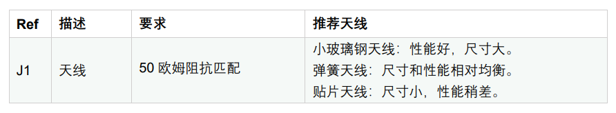

ASR6601 硬件设计指南
====================
`English <https://asriot.readthedocs.io/en/latest/ASR6601/Hardware-Reference/hardware_design.html>`_

前言
----

**关于本文档**

本文档旨在指导客户进行 LPWAN SoC 芯片 ASR6601 的硬件设计，包括原理图参考设计，layout 注意事项，以及重要物料选型和替换。

**产品型号**

与本文档相对应的产品型号如下：

+------------+--------+-------+----------------------------------+---------------+---------------+
| 型号       | Flash  | SRAM  | 内核                             | 封装          | 频率          |
+============+========+=======+==================================+===============+===============+
| ASR6601SE  | 256 KB | 64 KB | 32-bit 48 MHz Arm China STAR-MC1 | QFN68, 8*8 mm | 150 ~ 960 MHz |
+------------+--------+-------+----------------------------------+---------------+---------------+
| ASR6601CB  | 128 KB | 16 KB | 32-bit 48 MHz Arm China STAR-MC1 | QFN48, 6*6 mm | 150 ~ 960 MHz |
+------------+--------+-------+----------------------------------+---------------+---------------+
| ASR6601SER | 256 KB | 64 KB | 32-bit 48 MHz Arm China STAR-MC1 | QFN68, 8*8 mm | 150 ~ 960 MHz |
+------------+--------+-------+----------------------------------+---------------+---------------+
| ASR6601CBR | 128 KB | 16 KB | 32-bit 48 MHz Arm China STAR-MC1 | QFN48, 6*6 mm | 150 ~ 960 MHz |
+------------+--------+-------+----------------------------------+---------------+---------------+

**版权公告**

版权归 © 2023 翱捷科技股份有限公司所有。保留一切权利。未经翱捷科技股份有限公司的书面许可，不得以任何形式或手段复制、传播、转录、存储或翻译本文档的部分或所有内容。

**商标声明**

ASR、翱捷和其他翱捷商标均为翱捷科技股份有限公司的商标。

本文档提及的其他所有商标名称、商标和注册商标均属其各自所有人的财产，特此声明。

**免责声明**

翱捷科技股份有限公司对本文档内容不做任何形式的保证，并会对本文档内容或本文中介绍的产品进行不定期更新。

本文档仅作为使用指导，本文的所有内容不构成任何形式的担保。本文档中的信息如有变更，恕不另行通知。

本文档不负任何责任，包括使用本文档中的信息所产生的侵犯任何专有权行为的责任。

**文档版本**

=================== ==================== ===============================================================
**日期**              **版本号**              **发布说明**
=================== ==================== ===============================================================
2023.10             V1.4.0               新增了 ASR6601SER 和 ASR6601CBR 型号相关描述；新增 BOOT 电路和 RSTN 电路相关描述。
=================== ==================== ===============================================================

\1. 概述
--------------

ASR6601 是一款通用的 Sub-GHz 无线通讯 SoC 芯片, 该芯片集成了 Sub-GHz 射频收发器和 32 位的 ARM MCU。Sub-GHz 射频收发器不仅支持 LoRa 调制，还支持 (G)FSK和G(MSK) 等调制方式。MCU 为 Arm China STAR-MC1 Processor，工作频率最大支持 48 MHz。此外，该芯片支持 3 x I2C，1 x I2S，4 x UART，1 x LPUART，1 x SWD，3 x SPI，1 x 12-bit SAR ADC 和 1 x 12-bit DAC 等丰富的外设和接口。

ASR6601 的频率覆盖 150 MHz-960 MHz 的连续频段，可以支持世界上主要的 Sub-GHz 的 ISM 频段。芯片中集成的高效 PA 使其最大发射功率为 +22 dBm，接收电流为 4.6 mA，最大的灵敏达到 -148 dBm，Deep Sleep 模式下的休眠电流低至 1.6 μA，可以大大延长电池寿命。该芯片有 QFN48 和 QFN68 两种封装，两种封装大小分别为 6*6 mm 和 8*8 mm。ASR6601 上述特性使其适合超远距离、超低功耗和高性价比的 LPWAN 应用。

本文档旨在指导客户进行 ASR6601 的硬件设计，包括原理图参考设计，layout 注意事项，以及重要物料选型和替换。

2. ASR6601 硬件设计
------------------------------

2.1 ASR6601 方框图
~~~~~~~~~~~~~~~~~~~~~~~~~~

|image1|

2.2 ASR6601 主要特色
~~~~~~~~~~~~~~~~~~~~~~~~~~~

-  Up to 42 configurable GPIOs: 3 x I2C, 1 x I2S, 4 x UART, 1 x LPUART, 1 x SWD, 3 x SPI, 1 x QSPI and 2 x WDG

-  4 x GPTimer, 2 x Basic Timer, 2 x LP timer and 1 x Sys Ticker

-  48 MHz Arm China STAR-MC1 Processor

-  4-channel DMA engine x 2

-  Embedded 12-bit 1 Msps SAR ADC

-  Embedded 12-bit DAC

-  Embedded 3 x OPA

-  Embedded 2 x Low Power Comparator

-  Embedded LCD driver

-  Embedded LD, TD, VD and FD

-  Supports AES, DES, RSA, ECC, SHA and SM2/3/4

2.3 ASR6601 模组参考设计
~~~~~~~~~~~~~~~~~~~~~~~~~~~~~

2.3.1 ASR6601CB QFN48 模组参考设计
^^^^^^^^^^^^^^^^^^^^^^^^^^^^^^^^^^

|image2|

2.3.2 ASR6601SE QFN68 模组参考设计
^^^^^^^^^^^^^^^^^^^^^^^^^^^^^^^^^^

|image3|

关于 ASR6601 模组参考设计，注意事项如下：

\1. ASR6601 匹配网络请参考 ASR6601 模组参考设计，其提供了 490 MHz（覆盖 470-510 MHz 频率范围）和 915 MHz（覆盖 864-928 MHz 频率范围）这两组常用的匹配网络，具体请参考 ASR6601官方 FTP：1_ASR6601_Hardware /13_ASR6601_Demo_Module。

\2. 特别注意 DC-DC 的上拉电感 L7（15 uH）必须用功率电感，VR_PA 处的电感L1（56 nH）建议选用 0402 封装，额定电流更大，对提升 TX 的发射功率有帮助。

\3. 在客户进行模组设计时，可以根据实际情况处理参考设计图中的 R1，R2，R3，R4 和 R7。上述参考设计图中加上这部分，只是为了方便测试。

\4. 32M 的晶体电路兼容了 XO 和 TCXO，客户可根据应用实际情况，选择用 XO 电路或者 TCXO 电路，从而可以简化电路。

\5. TVS 管 D1 和 D2 建议预留，主要是做 ESD 保护。如应用场景对 ESD 要求比较高，则需要加 D2。D2 对射频性能有影响，请务必选择电容小的 TVS 管。

\6. 一般情况下 VDD_IN 由 VDD_RF（3.3 V）供电，TX的最大发射功率可以达到 22 dBm。如果客户需要降低功耗，且 TX 的最大发射功率不超过 14 dBm，那么 VDD_IN 可以用 VREG 供电。

\7. 模组参考设计原理图和 Layout 文件已经上传到 ASR6601 官方 FTP 服务器，FTP 登录信息参考附录。

2.4 ASR6601 电路解析
~~~~~~~~~~~~~~~~~~~~~~~~~~~

2.4.1 电源电路
^^^^^^^^^^^^^^

ASR6601 的电源分成四个部分：*VBAT_ESDx (x=0-3)，VBAT_ANA，VBAT_RF 和 VBAT_RTC*。*VBAT_ESDx* 给 MCU 的数字部分供电，*VBAT_ANA* 给 MCU 的模拟部分（ADC）供电，*VBAT_RF* 给射频部分供电，*VBAT_RTC* 给 RTC 时钟供电。

ASR6601 射频电路内部集成 DC-DC 和 LDO，输入为 VBAT_DCC，接到 VBAT_RF；输出为 VREG，其电压范围为 1.45-1.62 V。Regulator（REG PA）输入为 VDD_IN，电压范围为 1.7-3.7 V，**推荐使用 3.3 V**；输出为 VR_PA，VR_PA 的值随输出功率变化，VR_PA 通过外部的上拉电感给 PA 的输出级 RFO 提供偏置。

ASR6601 MCU 和射频部分电源网络参考下图：

.. raw:: html

   

|image4|

ASR6601 供电示意图

.. raw:: html

   

2.4.2 复位电路
^^^^^^^^^^^^^^

ASR6601CB 和 ASR6601SE 的 RSTN 管脚在芯片内部连接的 reset 信号，可以复位整个芯片。RSTN 的参考电路如下：

.. raw:: html

   

|image5|

ASR6601CB/ASR6601SE 复位电路

.. raw:: html

   

.. attention::
    1.	ASR6601CB 和 ASR6601SE 的 RSTN 只能作为输入，不能作为输出。
    2.	RSTN 处推荐加 RC 电路，其中上拉电阻取值范围推荐 4.7K~10K, 电容的取值范围为 300 pF~10 nF，推荐使用 330 pF。
    3.	RSTN 处的电容 C 的值不宜过大，如果增大到 uF 量级，RSTN 的波形过缓会触发芯片内部的保护机制，从而导致芯片位于 flash info 区的 bootloader 擦除。
    4.	确保上拉电阻的电源和芯片同时上电，如果芯片先上电，上拉电阻后上电，RSTN信号处于中间电平会触发芯片内部的保护机制，从而导致芯片位于flash info区的bootloader擦除
    5.	强烈建议新的 VDDD，VDDA，VDD_RF 接到同一个电源，避免优化不同电源时序不同，使 RSTN 的电平处于中间电平，从而触发芯片内部的保护机制，导致芯片 flash bootloader 部分擦除。
    6.	关于 ASR6601 烧录方法以及 flash bootloader 擦除问题，详情请参考 ASR6601 官方 FTP: 5_ASR6601_CTM_Q&A/51_ASR6601_ 烧录问题汇总。

ASR6601CBR 和 ASR6601SER 的 RSTN 管脚在芯片内部连接的 reset 信号，只能复位 Main 域，不能复位 AON，AONR 上电复位电路，RSTN 的复位电路参考设计如下：

.. raw:: html

   

|image6|

ASR6601CBR/ASR6601SER 复位电路

.. raw:: html

   

.. attention::
    1.	ASR6601CBR/SER 的 RSTN 既可以作输入，也可以作输出。作输出时一般接到外部芯片的 nRST，控制其他芯片同步复位。RSTN 作输出时，图 2-6 的RSTN 电路中的串行电阻必须为 0 欧姆。
    2.	RSTN 处推荐加 RC 电路，其中上拉电阻取值范围推荐 47K, 电容的取值范围为 300 pf~10 nF，推荐使用 330 pF。上拉电阻推荐使用 47K 的原因如下：GPIO 配置为 push-pull 模式时，GPIO 的低为强低，相对于 GPIO 通过一个很小的电阻接到 GND，RSTN 的电压值就是 VBAT 通过上拉电阻，串行电阻分压后得到的电压值；如果 RSTN 处的上拉电阻太小，那么 RSTN 电压值就变成了一个中间电压，会影响 ASR6601CBR/SER 芯片的复位。因此上拉电阻值要远远大于串行电阻值，串行电阻用 4.7K，上拉电阻用 47K。
    3.	RSTN 外接按键开关或者外部 MCU 的 GPIO，如果 GPIO 配置为开漏或者 push-pull 输出模式，RSTN 处必须串一个 4.7K 的电阻，原因如下：如果GPIO 配置为开漏模式（低为强低，高为弱高，通过上拉电阻拉高），这个串行的电阻是可以去掉的。但是当 GPIO 配置为 push-pull 模式（低为强低，高为强高），当 GPIO 为高电平时，这个高为强高，相当于 GPIO 通过一个很小的电阻拉到高，如果没有这个串行电阻，RSTN 就会拉到强高，而 RSTN 可以用作输入和输出，内部软件如果要复位时，软件拉低复位信号就低不下去，被这个强高拉住了，这样就影响了内部软件复位。在 RSTN 处串一个 4.7K 的电阻，就相当于在加了一个上拉电阻，这样就不会影响软件内部的复位信号。

2.4.3 BOOT电路
^^^^^^^^^^^^^^

ASR6601 系列芯片的 GPIO02 默认 function 就是 BOOT，GPIO02 虽然可以复用为其他 function，但是要求 GPIO02 不要复用为其他功能，以免复用时和 BOOT功能相冲突。
GPIO02 作为专用的 BOOT 引脚，硬件设计中要求必须引出，以便和 RSTN 配合进入烧录模式，或者在应用程序进入深睡模式时 GPIO02 拉高退出深睡模式。

2.4.4 晶振电路
^^^^^^^^^^^^^^

ASR6601 Demo 模组用到两种晶振：

1. **32 MHz TCXO/XO for RF**\ ：

 a. 要求 32M 晶体的负载电容为10 pf，TCXO 频偏公差要求 2 ppm 以内，XO 的频偏公差要求 20 ppm 以内。

 b. 对于带宽低于 62.5 kHz 的窄带应用，或者极限温度条件下（高于 70 度或者低于 -20 摄氏度），强烈推荐使用 TCXO；对于带宽不低于 62.5 kHz 的宽带应用，使用 XO 即可。

 c. ASR6601 内部集成负载电容矩阵，0x0911 和 0x0912 默认值为 0x05，此时该矩阵采用默认负载电容为（13.6 pF），一般不建议改动，因为改变默认值会有如下影响：1）会导致外面负载电容一个方向的可调范围变窄；2）软件中需要改动寄存器的值，这种改动只是针对特定的晶体和模组，换一种晶体或者模组可能频偏就合适，通用性变差；特殊情况下，可以通过软件配置对应寄存器来改变晶体两端的负载电容来校正频偏。

.. raw:: html

   

|image7|

.. raw:: html

   

 d. 若 32M XO 晶体频偏超出允许的公差范围（20 ppm），如果频偏偏正，建议适当增加外接负载电容抵消频偏；如果频偏偏负，建议替换其他常见满足要求的 32 MHz 晶振。

2. **32.768 KHz XO for MCU**\ ：

 a. 要求 32.768K 晶振负载电容为 7 pF，频偏公差要求 20 ppm 以内；强烈建议客户不要用负载电容为 12.5 pF 的晶体，可能会引起频偏过大计时不准，甚至晶体不起振。

 b. 由于 ASR6601 内部 32.768K 晶体振荡电路中已经加了 6 pF 的负载电容，因此 32.768K 晶体的外接负载电容推荐 NC，最大不要超过 5.6 pF。

 c. 若 32.768 KHz 晶体外接负载电容 NC 时频偏超出允许的公差范围（20 ppm），可以调整外接的负载电容，频率偏正建议适当增加外接负载电容以抵消频偏；如果频率偏负，建议客户替换其他满足要求的 32.768 kHz 的晶体。

 d. ASR6601 内部没有集成负载电容矩阵，无法通过软件配置改变寄存器的值来改变晶体两端的负载电容，如有客户对 32.768K 晶体精度要求很高，建议采用 TCXO。
	
 e. ASR6601 内部专门针对 XO32K 设计了极低功耗振荡电路（DeepSleep 时电流可减小 500 nA），当 XO32K 小电流模式使能时，对 32.768K 晶体两端负载平衡要求很高，若 32.768K 晶体走线不等长，可能会导致晶体不起振，XO32K 小电流模式失效。此外负载电容偏大也有一定的风险导致晶体不起振，建议外加负载电容不要超过 5.6 pF。

.. raw:: html

   

|image8|

.. raw:: html

   

.. attention::
    - 如果客户需要用到 LoRaWAN ClassB，或者带宽低于 62.5K，则必须采用 32M TCXO（有源晶体），否则采用 XO（无源晶体）即可。
    - 32M 晶体在布局时尽可能靠近芯片管脚，且 32M 表层净空，避免铜皮导热导致晶体频偏增加。
    - 32.768K 晶体在布局时尽可能靠近芯片管脚，且走线须对称，从而使晶体两端负载平衡。在 XO32K 小电流模式下，32.768K 晶体两端负载不平衡可能会导致晶体停振。
 

2.4.5 射频电路
^^^^^^^^^^^^^^

|image9|

关于 ASR6601 芯片的射频电路，有如下 4 点需要注意：

\1. 因为客户模组的 PCB 板布局和布线不同，所以要将模组射频匹配网络参数在默认参数的基础上进行微调，以优化射频性能。

\2. ASR 官方提供了 490 MHz（覆盖470-510 MHz频率范围）和 915 MHz（覆盖 864-928 MHz 频率范围）两组射频匹配网络参数，详情参考 ASR6601 Demo Module 参考设计，ASR6601 官方FTP：1_ASR6601_Hardware /13_ASR6601_Demo_Module，如需其他频率的射频匹配网络参数，请联系 ASR 技术支持工程师。

\3. 建议采用单端控制的 RFSW（射频开关），ASR6601 模组参考设计中的 RFSW 型号为：XMSSJR6G0BA-093。ASR6601 的 ANT_SW_CTRL（GPIO59）接到 RFSW 的 CTRL（pin6），用于控制 TX 和 RX 的切换；GPIO10 接到 RFSW 的 VDD（pin4），目的是在 Deepsleep 模式下关掉 RFSW 防止其漏电（XMSSJR6G0BA-093 大概有 5 uA 的漏电）。RFSW 的控制逻辑如下：

.. raw:: html

   

========= ========== ===========
Mode      VDD (pin4) CTRL (pin6)
========= ========== ===========
TX        HIGH       HIGH
RX        HIGH       LOW
Deepsleep LOW        LOW
========= ========== ===========

.. raw:: html

   

\4. RFSW 推荐使用 XMSSJR6G0BA-093，可以用替换料取代，替换后射频匹配网络的参数需要微调，具体可参考本文档 *第 3 章物料选型指南*\ 。

\5. RFSW也可以用双端控制开关，但是软件也需要做相应改动，不及单端控制开关使用方便，ASR不做推荐。如客户确实需要使用，具体用法请参考《ASR6601_单双端 RFSW 使用指南》文档，ASR6601 官方 FTP：*1_ASR6601_Hardware/ 11_ASR6601硬件设计指南*。

2.5 ASR6601 芯片封装
~~~~~~~~~~~~~~~~~~~~~~~~~~~

具体的PIN定义，请参考\ *《ASR6601 Datasheet》*\ 。

.. raw:: html

   

|image10|

ASR6601 QFN68 管脚分布图

.. raw:: html

   

.. raw:: html

   

|image11|

ASR6601 QFN48 管脚分布图

.. raw:: html

   

3. 物料选型指南
---------------

3.1 晶振
~~~~~~~~

|image12|

.. note:: 关于推荐供应商，可参见 *《LoRa 重点物料推荐表》*。ASR6601官方FTP：*1_ASR6601_Hardware /14_ASR6601重点物料推荐*。

3.2 射频开关
~~~~~~~~~~~~

|image13|

.. note:: 关于推荐供应商，可参见 *《LoRa 重点物料推荐表》*。ASR6601官方FTP：*1_ASR6601_Hardware /14_ASR6601重点物料推荐*。

3.3 功率电感
~~~~~~~~~~~~

如果采用 DC-DC 给 Regulator（REG PA）供电，则功率电感 L6 必不可少; 如果采用 LDO 供电，那么功率电感可以省掉，LDO 的效率比 DCDC 的效率低，电流要大一点。功率电感要求如下表所示。

|image14|

.. note:: 关于推荐供应商，可参见 *《LoRa 重点物料推荐表》*。ASR6601 官方 FTP：*1_ASR6601_Hardware /14_ASR6601 重点物料推荐*。

3.4 外置天线
~~~~~~~~~~~~

在拉距测试中，天线的阻抗特性对测试结果影响较大，请根据实际应用选择合适的天线。

|image15|

4. Layout 指导
--------------

4.1 电源走线
~~~~~~~~~~~~

关于 PCB 中的电源走线，需要注意下列事项：

\1. 电源最好加 2.2 uF 和 0.1 uF 滤波电容，来滤除电源噪声。

\2. 电源线走线尽可能地宽，电源走线线宽不低于 0.15 mm，为了减少线间串扰，间距须符合 3W 规则。

\3. 电源线不要跨其他电源线和高频走线，避免对电源造成干扰。

\4. VDD_IN 的最大电流为 120 mA，建议VDD_IN线宽为 0.2 mm。

4.2 RF 走线
~~~~~~~~~~~

PCB 中的射频走线如下图所示，需要注意下列事项：

\1. 射频线尽量避免 90° 直角和锐角走线，尽量使用 135° 角走线或圆弧走线。

\2. 射频线两旁的屏蔽地要尽量完整，且参考地平面保持完整，射频线周围尽量多打过孔。

\3. 射频线避免走高频信号线，例如晶体、UART、PWM、SDIO等，避免交叉干扰。 

\4. 射频线附近避免走电源线，尤其是 VDDA 和 VDD_RF，避免电源被 RF 信号干扰。

\5. VR_PA，RFO和RFI_N/P 相连的元件尽量靠近芯片管脚，避免长走线影响射频性能。

\6. 射频走线避免线宽突变，尤其是在焊盘处，采用和焊盘宽带相同的线宽，或者采用渐增线以降低阻抗突变（参见下图）。

\7. 射频线优先走top层，避免跨层走线，参考地平面完整，射频走线按要求做阻抗匹配。
(a)	RFO 射频走线按照单端 50 欧姆做阻抗匹配（下图紫色走线）。
(b)	RFI_N 和 RFI_P 射频走线按照差分 100 欧姆做阻抗匹配（下图绿色走线）。

.. raw:: html

   

|image16|

.. raw:: html

   

4.3 晶体走线
~~~~~~~~~~~~

关于 PCB 中的晶体走线，需要注意下列事项：

\1. 晶体的时钟要在 top 层走线，不可以穿层和交叉，并且周围要用 GND 屏蔽。

\2. 晶体的下面不可以走高速信号线，第 2 层要求有完整的 GND。

\3. 晶体尽量靠近对应的管脚，负载电容尽量放置到时钟线末端。

\4. 晶体的周围不要放置磁性元件，如电感、磁珠等。

\5. 晶体表层的铜皮要挖空，防止周边器件的热量传导到晶体产生温漂。

\6. 32.768K 的晶体对称走线，保证晶体两端负载平衡，参见下图。

.. raw:: html

   

|image17|

.. raw:: html

   

A. 附录-相关资料
---------------

本文档中提到的参考信息总结如下：

\1. ASR6601 FTP信息如下：
Serv：iot.asrmicro.com:8090
User：ASR6601_delivery
Pass：U6H3bfAs

\2. ASR6601技术支持联系邮箱：
pengwu@asrmicro.com

.. |image1| image:: ../../img/6601_硬件设计/图2-1.png
.. |image2| image:: ../../img/6601_硬件设计/图2-2.png
.. |image3| image:: ../../img/6601_硬件设计/图2-3.png
.. |image4| image:: ../../img/6601_硬件设计/图2-4.png
.. |image5| image:: ../../img/6601_硬件设计/图2-5.png
.. |image6| image:: ../../img/6601_硬件设计/图2-6.png
.. |image7| image:: ../../img/6601_硬件设计/图2-7.png
.. |image8| image:: ../../img/6601_硬件设计/图2-8.png
.. |image9| image:: ../../img/6601_硬件设计/图2-9.png
.. |image10| image:: ../../img/6601_硬件设计/图2-10.png
.. |image11| image:: ../../img/6601_硬件设计/图2-11.png
.. |image12| image:: ../../img/6601_硬件设计/图3-1.png
.. |image13| image:: ../../img/6601_硬件设计/图3-2.png
.. |image14| image:: ../../img/6601_硬件设计/图3-3.png

.. |image16| image:: ../../img/6601_硬件设计/图4-1.png
.. |image17| image:: ../../img/6601_硬件设计/图4-2.png