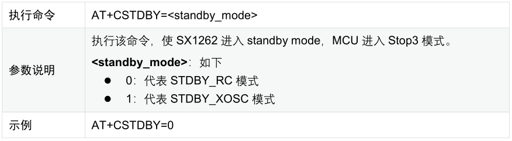
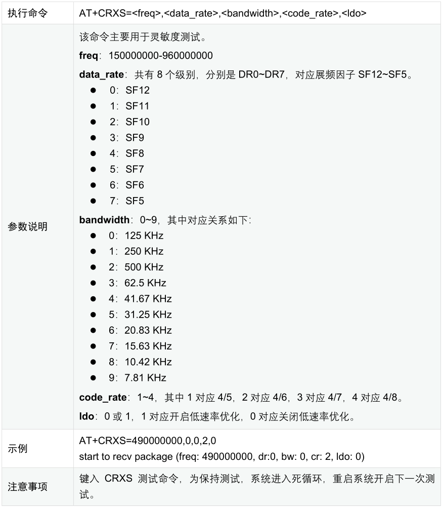
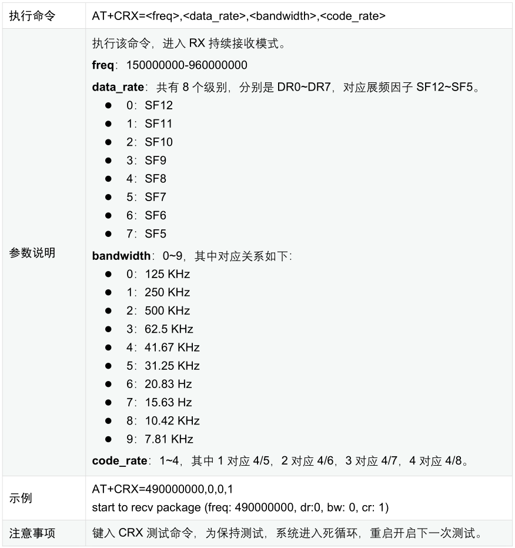
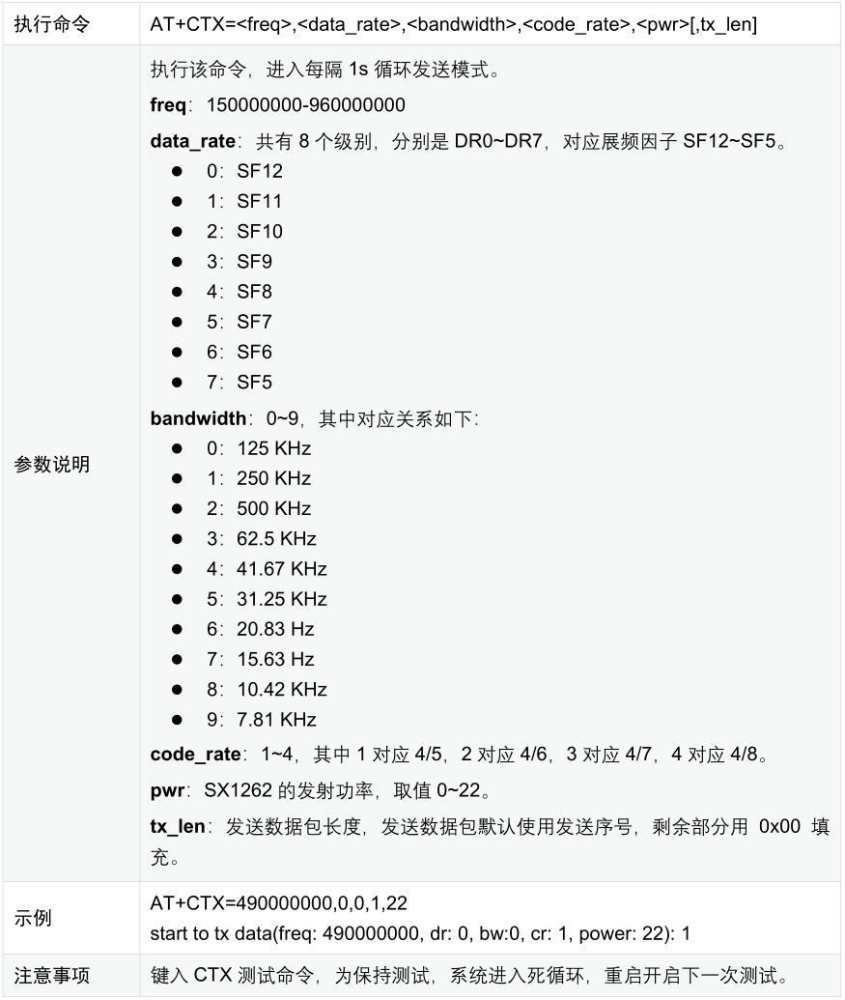
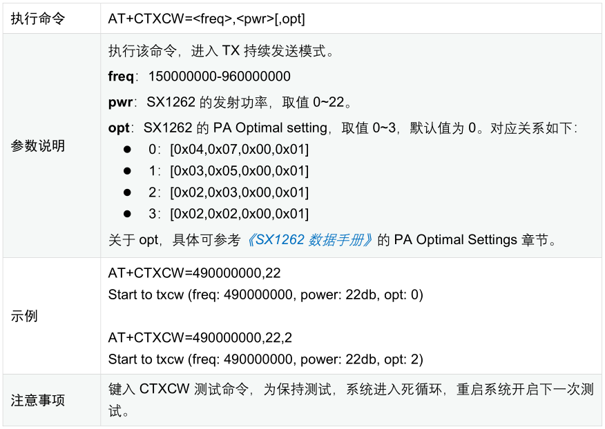

.. role:: raw-latex(raw)
   :format: latex
..

ASR6601 参考板测试指南
======================

前言
----

**关于本文档**

本文档主要介绍如何在 LPWAN SoC 芯片 ASR6601 的参考板上进行测试，以方便 ASR6601 的开发人员快速了解该芯片的各项性能指标。

**产品型号**

与本文档相对应的产品型号如下：

+-----------+-----------+----------+-----------------------------+---------------+---------------+
| **型号**  | **Flash** | **SRAM** | **内核**                    | **封装**      | **频率**      |
+===========+===========+==========+=============================+===============+===============+
| ASR6601SE | 256 KB    | 64 KB    | 32-bit 48 MHz ARM STAR      | QFN68, 8*8 mm | 150 ~ 960 MHz |
+-----------+-----------+----------+-----------------------------+---------------+---------------+
| ASR6601CB | 128 KB    | 16 KB    | 32-bit 48 MHz ARM STAR      | QFN48, 6*6 mm | 150 ~ 960 MHz |
+-----------+-----------+----------+-----------------------------+---------------+---------------+

**版权公告**

版权归 © 2021 翱捷科技股份有限公司所有。保留一切权利。未经翱捷科技股份有限公司的书面许可，不得以任何形式或手段复制、传播、转录、存储或翻译本文档的部分或所有内容。

**商标声明**

ASR、翱捷和其他翱捷商标均为翱捷科技股份有限公司的商标。

本文档提及的其他所有商标名称、商标和注册商标均属其各自所有人的财产，特此声明。

**免责声明**

翱捷科技股份有限公司对本文档内容不做任何形式的保证，并会对本文档内容或本文中介绍的产品进行不定期更新。

本文档仅作为使用指导，本文的所有内容不构成任何形式的担保。本文档中的信息如有变更，恕不另行通知。

本文档不负任何责任，包括使用本文档中的信息所产生的侵犯任何专有权行为的责任。

**翱捷科技股份有限公司**

地址：上海市浦东新区科苑路 399 号张江创新园 10 号楼 9 楼 邮编：201203

官网：http://www.asrmicro.com/asrweb/

**文档修订历史**

+----------+------------+-----------------------------------------------------------+
| **日期** | **版本号** | **发布说明**                                              |
+==========+============+===========================================================+
| 2020.08  | V0.1.0     | 首次发布。                                                |
+----------+------------+-----------------------------------------------------------+
| 2020.09  | V0.2.0     | 更新图片。                                                |
+----------+------------+-----------------------------------------------------------+
| 2020.10  | V0.3.0     | 更新为 ASR6601SE-EVAL v2.0 的配图。                       |
+----------+------------+-----------------------------------------------------------+
| 2021.01  | V1.1.0     | 删除第 1 章的概述，将其内容合并到前言 “关于本文档” 部分。 |
+----------+------------+-----------------------------------------------------------+
| 2021.03  | V1.2.0     | 更新第 1.3 节的内容。                                     |
+----------+------------+-----------------------------------------------------------+

1. 准备
-------

1.1 硬件
~~~~~~~~

LoRa 节点必需硬件列表如下：

-  ASR6601 开发板 1 个

-  天线 1 根

-  USB 线 1 根

-  PC 机 1 台

1.1.1 ASR6601 开发板说明
^^^^^^^^^^^^^^^^^^^^^^^^

开发板 ASR6601SE-EVAL v2.0 的正反面如下图所示：

|image1|

.. raw:: html

   

ASR6601SE-EVAL v2.0 正面

.. raw:: html

   

|image2|

.. raw:: html

   

ASR6601SE-EVAL v2.0 反面

.. raw:: html

   

+-------------------------------+--------------------------------------------------------+
| **接口**                      | **描述**                                               |
+===============================+========================================================+
| USB-UART                      | USB 转串口                                             |
+-------------------------------+--------------------------------------------------------+
| Power Switch                  | 电源开关                                               |
+-------------------------------+--------------------------------------------------------+
| Reset                         | Reset 按钮                                             |
+-------------------------------+--------------------------------------------------------+
| SW3                           | Download 按钮，按下后，GPIO02 拉高                     |
+-------------------------------+--------------------------------------------------------+
| SW1                           | User 按钮，按下后，GPIO11 拉低                         |
+-------------------------------+--------------------------------------------------------+
| JP1                           | 电源跳线                                               |
+-------------------------------+--------------------------------------------------------+
| JP2                           | 电源跳线                                               |
+-------------------------------+--------------------------------------------------------+
| JP3                           | 电源跳线                                               |
+-------------------------------+--------------------------------------------------------+
| JP4                           | 电源跳线，可测试板子总功耗                             |
+-------------------------------+--------------------------------------------------------+
| JP5                           | UART_TX 跳线，跳线连通选择 UART0_TX，具体请参考原理图  |
+-------------------------------+--------------------------------------------------------+
| JP6（仅存在于ASR6601CB-EVAL） | UART_TX 跳线，跳线连通选择 LPUART_TX，具体请参考原理图 |
+-------------------------------+--------------------------------------------------------+
| JP7                           | UART_RX 跳线，跳线连通选择 UART0_RX，具体请参考原理图  |
+-------------------------------+--------------------------------------------------------+
| JP8                           | UART_RX 跳线，跳线连通选择 LPUART_RX，具体请参考原理图 |
+-------------------------------+--------------------------------------------------------+

1.1.2 跳线连接
^^^^^^^^^^^^^^

在进行 ASR6601 开发板测试过程中，请保证下面跳线的状态正确。

.. raw:: html

   

============================== ============
**跳线**                       **连接状态**
============================== ============
JP1                            连通
JP2                            连通
JP3                            连通
JP4                            连通
JP5                            连通
JP6（仅存在于 ASR6601CB-EVAL） 断开
JP7                            连通
JP8                            断开
============================== ============

.. raw:: html

   

1.2 软件
~~~~~~~~

1.2.1 开发环境
^^^^^^^^^^^^^^

ASR6601 可以使用 Keil 开发，也可以使用 Makefile 的方式进行编译烧录等，具体可参考文档\ *《ASR6601_程序开发快速入门指南》*\ 。

1.2.2 测试代码
^^^^^^^^^^^^^^

测试代码位于 SDK 的 *projects\\${DEMO_BOARD}\\examples\\lora\\lora\_test* 目录下。

其中 *${DEMO_BOARD}* 为对应的板子名称，如 ASR6601SE-EVAL 对应为 ASR6601SE 开发板，ASR6601CB-EVAL 对应为 ASR6601CB 开发板。

1.3 烧录测试代码
~~~~~~~~~~~~~~~~

程序编译烧录相关操作请参考文档\ *《ASR6601_程序开发快速入门指南》*\ 。

2. 测试
-------

测试代码中内置了几个 AT 命令，可以用来进行部分功能的测试。

2.1 功率测试
~~~~~~~~~~~~

**测试命令**\ ：使用串口工具，执行 *AT+CTXCW=490000000,22* 命令进行功率的测试，具体命令参数可参见 *3.2.6* 节的参数说明部分。

**参考结果**\ ：21 dbm

2.2 灵敏度测试
~~~~~~~~~~~~~~

**测试命令**\ ：使用串口工具，执行 *AT+CRXS=490000000,0,0,2,0* 命令进行灵敏度的测试，具体命令参数可参见 *3.2.3* 节的参数说明部分。

**参考结果**\ ：-138 dbm

2.3 功耗测试
~~~~~~~~~~~~

功耗测试时，可以将底板上的 JP4 跳线去掉，两端连接万用表，即可进行功耗的测试。具体硬件连接情况如下图所示：

.. raw:: html

   

|image3|

.. raw:: html

   

2.3.1 TX 功耗测试
^^^^^^^^^^^^^^^^^

**测试命令**\ ：AT+CTXCW=490000000,22

**参考结果**\ ：110 mA

2.3.2 RX 功耗测试
^^^^^^^^^^^^^^^^^

**测试命令**\ ：AT+CRX=490000000,0,0,1

**参考结果**\ ：8.9 mA

2.3.3 DeepSleep 测试
^^^^^^^^^^^^^^^^^^^^

**测试命令**\ ：AT+CSLEEP=0

**参考结果**\ ：1.5 uA

3. 测试命令说明
---------------

3.1 AT 命令一览
~~~~~~~~~~~~~~~

测试代码中支持的 AT 命令主要有：

.. raw:: html

   

========= ===========================
**命令**  **说明**
========= ===========================
AT+CTXCW  发送一个持续波
AT+CTX    隔 1s 发送一个 LoRa 包
AT+CRXS   接收指令，可用于灵敏度测试
AT+CRX    接收指令，可用于距离测试
AT+CSLEEP 低功耗测试指令
AT+CSTDBY Sx1262 Standby 模式测试指令
========= ===========================

.. raw:: html

   

3.2 AT命令参数说明
~~~~~~~~~~~~~~~~~~

3.2.1 低功耗测试命令 +CSLEEP
^^^^^^^^^^^^^^^^^^^^^^^^^^^^

|image4|

3.2.2 低功耗测试命令 +CSTDBY
^^^^^^^^^^^^^^^^^^^^^^^^^^^^

|image5|

3.2.3 测试命令 +CRXS
^^^^^^^^^^^^^^^^^^^^

|image6|

3.2.4 测试命令 +CRX
^^^^^^^^^^^^^^^^^^^

|image7|

3.2.5 测试命令 +CTX
^^^^^^^^^^^^^^^^^^^

|image8|

3.2.6 测试命令 +CTXCW
^^^^^^^^^^^^^^^^^^^^^

|image9|

.. |image1| image:: img/6601_参考板/图1-1.png
.. |image2| image:: img/6601_参考板/图1-2.png
.. |image3| image:: img/6601_参考板/图2-1.png
.. |image4| image:: img/6601_参考板/图3-1.png

