ASR6601 射频开关使用指南
========================

前言
----

**关于本文档**

本文档主要介绍单端和双端控制的射频开关（RFSW）的软硬件的差异，以便客户进行 LPWAN SoC 芯片 ASR6601 的射频开关的软硬件设计。

**产品型号**

与本文档相对应的产品型号如下：

+-----------+-----------+----------+------------------------+---------------+---------------+
| **型号**  | **Flash** | **SRAM** | **内核**               | **封装**      | **频率**      |
+===========+===========+==========+========================+===============+===============+
| ASR6601SE | 256 KB    | 64 KB    | 32-bit 48 MHz ARM STAR | QFN68, 8*8 mm | 150 ~ 960 MHz |
+-----------+-----------+----------+------------------------+---------------+---------------+
| ASR6601CB | 128 KB    | 16 KB    | 32-bit 48 MHz ARM STAR | QFN48, 6*6 mm | 150 ~ 960 MHz |
+-----------+-----------+----------+------------------------+---------------+---------------+

**版权公告**

版权归 © 2021 翱捷科技股份有限公司所有。保留一切权利。未经翱捷科技股份有限公司的书面许可，不得以任何形式或手段复制、传播、转录、存储或翻译本文档的部分或所有内容。

**商标声明**

ASR、翱捷和其他翱捷商标均为翱捷科技股份有限公司的商标。

本文档提及的其他所有商标名称、商标和注册商标均属其各自所有人的财产，特此声明。

**免责声明**

翱捷科技股份有限公司对本文档内容不做任何形式的保证，并会对本文档内容或本文中介绍的产品进行不定期更新。

本文档仅作为使用指导，本文的所有内容不构成任何形式的担保。本文档中的信息如有变更，恕不另行通知。

本文档不负任何责任，包括使用本文档中的信息所产生的侵犯任何专有权行为的责任。

**翱捷科技股份有限公司**

地址：上海市浦东新区科苑路399号张江创新园10号楼9楼 邮编：201203

官网：http://www.asrmicro.com/

**文档修订历史**

=================== ==================== ===============================================================
**日期**              **版本号**              **发布说明**
=================== ==================== ===============================================================
2021.11             V1.0.0               首次发布。
=================== ==================== ===============================================================

1. LPWAN RFSW 简介
------------------

ASR650X 和 ASR6601 系列产品均基于 SX1262，其 TX 和 RX 切换通过 RFSW（射频开关）来实现。对于 RFSW 而言，根据控制信号的不同，可以分为单端控制、双端控制和单双端控制三大类，前两类比较常见，单双端控制的 RFSW 比较少。一般来说，SX1262 内部状态机自动产生一个中断信号 DIO2 作为 TX 和 RX 切换的控制信号，因此若搭配单端控制的 RFSW，硬件电路和软件最为简单。实际应用中，由于某些原因，客户可能采用双端 RFSW，双端控制的 RFSW 的硬件电路及其对应的软件与单端控制的有明显差异。下文详细阐述了单端和双端控制的 RFSW 软硬件的差异。

1.1 单端控制开关
~~~~~~~~~~~~~~~~

LPWAN 常用的单端控制开关如下：

|image1|

以村田的 XMSSJR6G0BA-093 为例：

|image2|

**说明：**

 *1. 不同的单端 RFSW，RF1（Port1）和 RF2（Port2）管脚顺序不同。*

 *2. 不同的 RFSW，封装也是不同的，在替换不同 RFSW 时要注意这点。*

1.2 双端控制开关
~~~~~~~~~~~~~~~~

LPWAN 常用的双端控制开关如下：

|image3|

以 CKRF2179MM26 为例：

|image4|
​

1.3 单双端控制开关
~~~~~~~~~~~~~~~~~~

LPWAN 常用的单双端控制开关如下：

|image5|

以 PE4259 为例，PE4259 既可以做单端 RFSW，又可以做双端 RFSF，示意图如下：

|image6|

2. 单端 RFSW 软硬件设计
-----------------------

ASR 官方模组参考设计都是采用单端控制的 RFSW，我们推荐客户采用单端控制开关，ASR650X 和 ASR6601 系列芯片软件 SDK 全部基于单端控制的 RFSW。

下面以 ASR6601SE 单端 RFSW **硬件设计**\ 为例来做详细说明，单端 RFSW 采用的是村田的 XMSSJR6G0BA-093，此时 ASR6601 的 ANT_SW_CTRL（即 SX1262 的 DIO2 信号）接到 RFSW 的 CTRL（pin6），用于控制 TX 和 RX 的切换；GPIO10 接到 RFSW 的 VDD（pin4），可在Deepsleep 模式下关掉 RFSW 防止其漏电（XMSSJR6G0BA 大概有 5 uA 的漏电）；RFSW 的控制逻辑如下：

|image7|

|image8|
​

**软件设计**\ 请参考默认的 SDK。

3. 双端 RFSW 软硬件设计
-----------------------

3.1 双端 RFSW 设计方案一
~~~~~~~~~~~~~~~~~~~~~~~~

**硬件设计：**\ ANT_SW_CTRL（即 SX1262 的 DIO2 信号）通过反相器产生一个互补的控制信号，ANT_SW_CTRL 及其互补信号控制双端 RFSW 的 VC1 和 VC2，实现 TX 和 RX 的切换。

|image9|

**软件设计：**\ 采用默认的 SDK 即可，软件不需要改动。

3.2 双端 RFSW 软硬件设计方案二
~~~~~~~~~~~~~~~~~~~~~~~~~~~~~~

**硬件设计：**\ 用 ANT_SW_CTRL（即 SX1262 的 DIO2 信号）和一个 GPIO 来控制双端 RFSW 的 VC1 和 VC2，实现 TX 和 RX 的切换。

|image10|

**软件设计：**\ 在 ASR6601 官方默认的 SDK 基础上，软件需要按照以下控制逻辑进行修改：

|image11|

需要修改 sx126x.c 文件的 *SX126xCheckDeviceReady* 函数，代码修改如下，蓝色部分为新增：

|image12|

**说明：** *其中 ANT_SW_CTRL（DIO2）是 SX1262 内部状态机控制，软件无法自动控制。GPIO10 可以由软件控制。*

3.3 双端 RFSW 软硬件设计方案三
~~~~~~~~~~~~~~~~~~~~~~~~~~~~~~

**硬件设计：**\ 用两个 GPIO 来控制双端 RFSW 的 VC1 和 VC2，实现 TX 和 RX 的切换。

|image13|

**软件设计：**\ ASR6601 官方默认的 SDK 基础上，软件需要按照以下控制逻辑进行修改：

|image14|

需要修改 sx126x.c 文件的 *SX126xCheckDeviceReady* 函数，代码修改如下，蓝色部分为新增：

|image15|

另外还要修改文件 sx1262-board.c 文件的函数 *SX126xAntSwOn* 和 *SX126xAntSwOff*\ ，把函数 SX126xAntSwOn 中的代码删除，修改函数 SX126xAntSwOff 的代码来设置 GPIO10 和 GPIO42 输出低电平，修改后代码如下：

.. raw:: html

   

|image16|

.. raw:: html

   

**说明：** *ANT_SW_CTRL（DIO2）舍弃不用，直接用两个 GPIO 来控制 RFSW 的 VC1 和 VC2，GPIO10 和 GPIO42（客户也可以选用其他的 GPIO，软件作相应修改即可）都可以由软件控制。*

3.4 双端 RFSW 设计方案比较
~~~~~~~~~~~~~~~~~~~~~~~~~~

|image17|

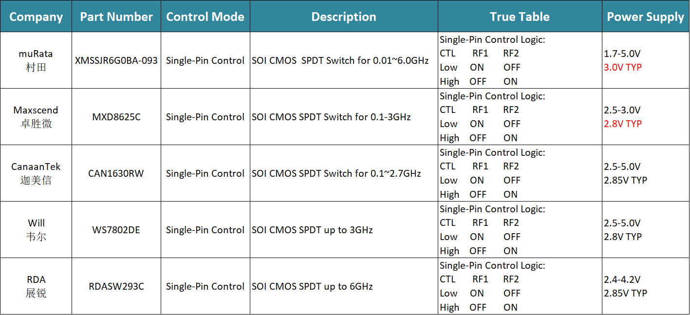
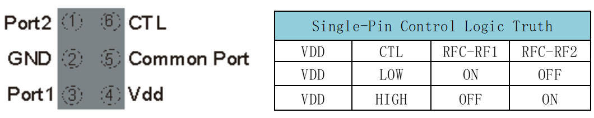
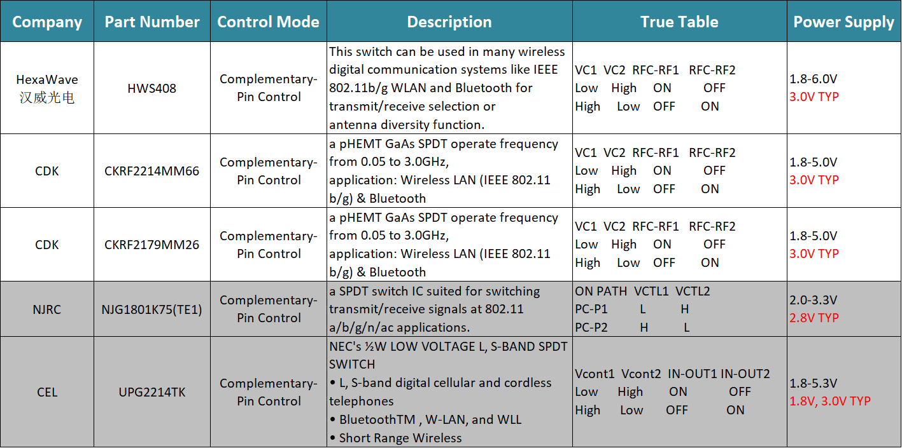
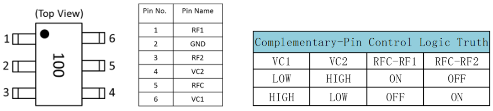
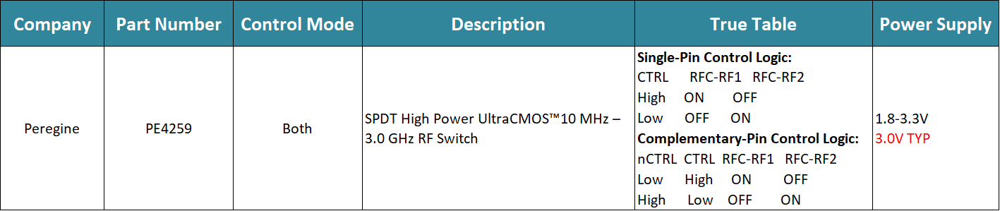
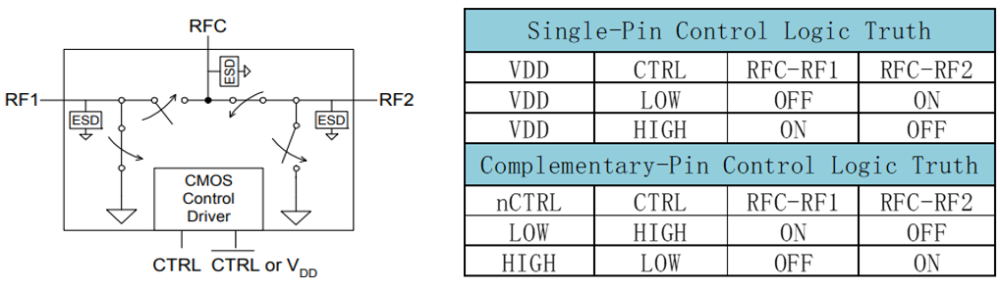
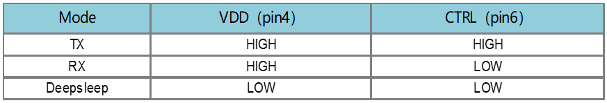
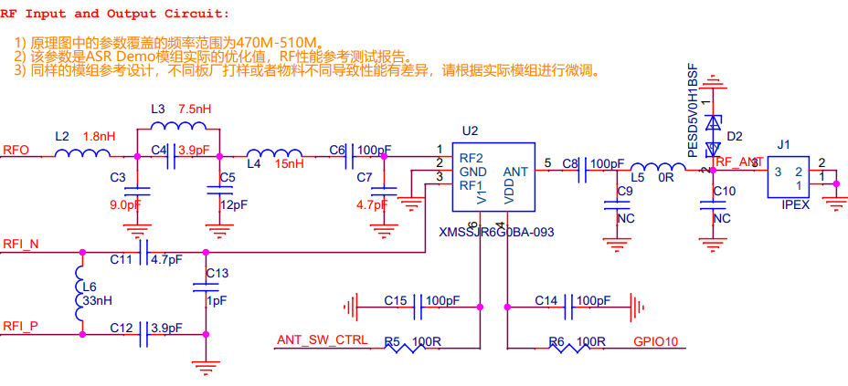
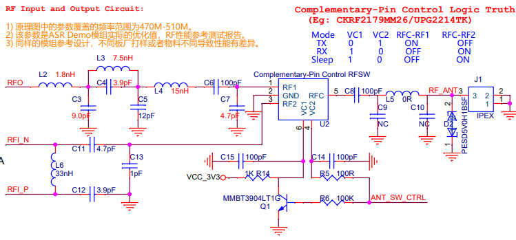
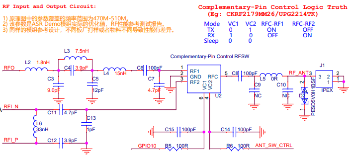
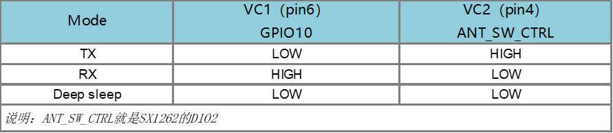
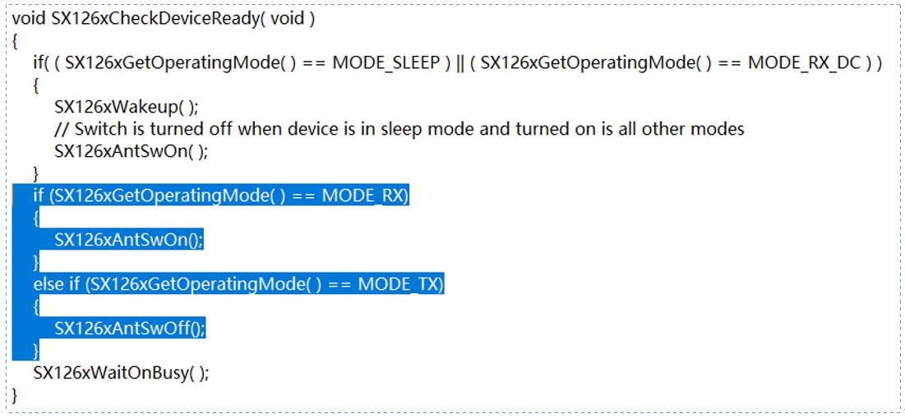
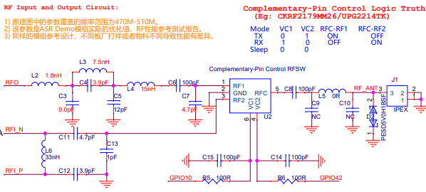
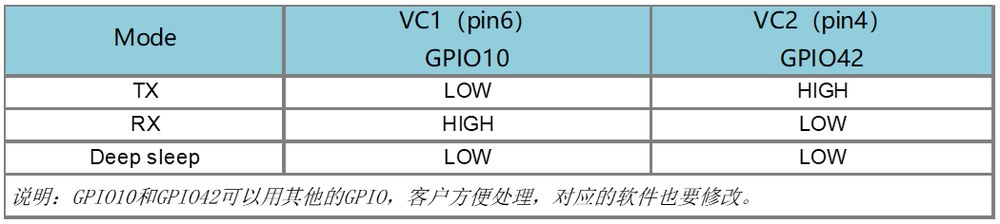
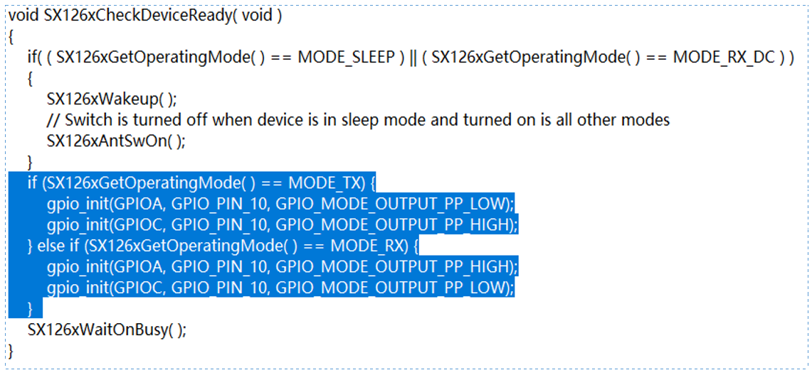
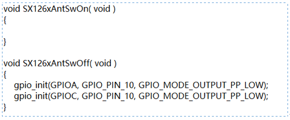
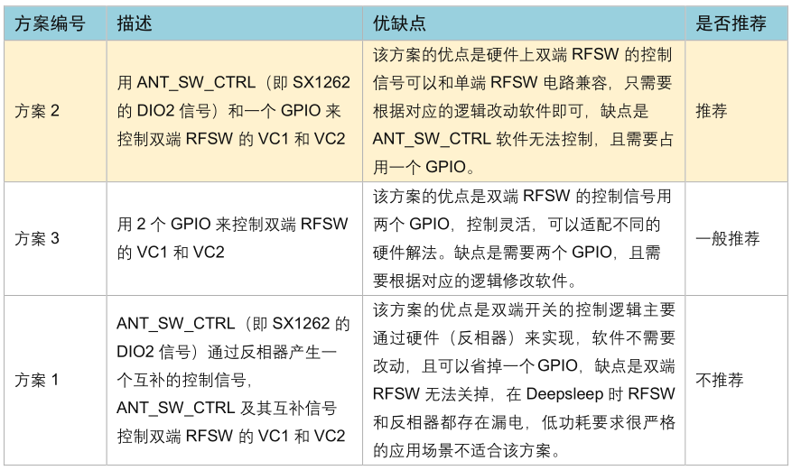
