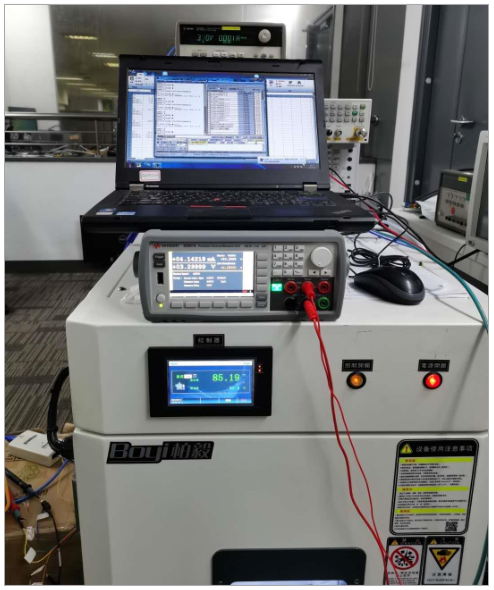

ASR6601 测试报告
======================

前言
----

**关于本文档**

本文档主要提供 IoT LPWAN SoC 芯片 ASR6601 的测试报告。

**产品型号**

与本文档相对应的产品型号如下：

+-----------+-----------+----------+-----------------------------+---------------+---------------+
| **型号**  | **Flash** | **SRAM** | **内核**                    | **封装**      | **频率**      |
+===========+===========+==========+=============================+===============+===============+
| ASR6601SE | 256 KB    | 64 KB    | 32-bit 48 MHz ARM STAR      | QFN68, 8*8 mm | 150 ~ 960 MHz |
+-----------+-----------+----------+-----------------------------+---------------+---------------+
| ASR6601CB | 128 KB    | 16 KB    | 32-bit 48 MHz ARM STAR      | QFN48, 6*6 mm | 150 ~ 960 MHz |
+-----------+-----------+----------+-----------------------------+---------------+---------------+

**版权公告**

版权归 © 2021 翱捷科技股份有限公司所有。保留一切权利。未经翱捷科技股份有限公司的书面许可，不得以任何形式或手段复制、传播、转录、存储或翻译本文档的部分或所有内容。

**商标声明**

ASR、翱捷和其他翱捷商标均为翱捷科技股份有限公司的商标。

本文档提及的其他所有商标名称、商标和注册商标均属其各自所有人的财产，特此声明。

**免责声明**

翱捷科技股份有限公司对本文档内容不做任何形式的保证，并会对本文档内容或本文中介绍的产品进行不定期更新。

本文档仅作为使用指导，本文的所有内容不构成任何形式的担保。本文档中的信息如有变更，恕不另行通知。

本文档不负任何责任，包括使用本文档中的信息所产生的侵犯任何专有权行为的责任。

**翱捷科技股份有限公司**

地址：上海市浦东新区科苑路 399 号张江创新园 10 号楼 9 楼 邮编：201203

官网：http://www.asrmicro.com/asrweb/

**文档修订历史**

.. raw:: html

   

======== ========== ============
**日期** **版本号** **发布说明**
======== ========== ============
2020.08  V1.0.0     首次发布。
======== ========== ============

.. raw:: html

   

1. 测试简介
-----------

1.1 测试硬件
~~~~~~~~~~~~

68-Pin ASR6601-SE V1.0 开发板

1.2 测试软件
~~~~~~~~~~~~

ASR6601 V1.0 SDK

1.3 测试仪器
~~~~~~~~~~~~

Agilent N5182B 和 Agilent N9020A

1.4 测试项目
~~~~~~~~~~~~

|image1|

2. 测试实现
-----------

2.1 TX 测试
~~~~~~~~~~~~~~~~~

2.1.1 TX 测试环境搭建
^^^^^^^^^^^^^^^^^^^^^^^^^^^^^^

.. raw:: html

   

|image2|

.. raw:: html

   

2.1.2 频率偏移测试
^^^^^^^^^^^^^^^^^^

1. **测试方法**

a. 射频设置：

-  Set to LoRa CW mode with 470.0 MHz frequency

-  Set the power to 22.0 dBm

b. 频谱仪设置：

-  Center frequency at 470.0 MHz, Span is 2 MHz, Ref amp is 25.0 dBm

-  Measure the CW frequency with the marker of the spectrum analyzer

2. **测试图表**

.. raw:: html

   

|image3|

.. raw:: html

   

\
3. **测试结果**

.. raw:: html

   

====== ============= ============== =======
**SN** **Set (MHz)** **Test (MHz)** **PPM**
====== ============= ============== =======
1#     470.000       469.9980       4.25
====== ============= ============== =======

.. raw:: html

   

\

2.1.3 发射功率测试
^^^^^^^^^^^^^^^^^^

1. **测试方法**

a. 射频设置：

-  Set to LoRa CW mode with 470.0 MHz frequency

-  Set the power to 22 dBm

b. 频谱仪设置：

-  Set frequency point at 1st, 2nd, 3rd, 4th and 5th of the basic frequency
-  Span is 2 MHz (or 5 MHz), Ref amp is 25 dBm
-  Max Hold mode

2. **测试图表**

|image4|

3. **测试结果**

.. raw:: html

   

====== =================== ============= ===============
**SN** **Frequency (MHz)** **Set (dBm)** **Basic (dBm)**
====== =================== ============= ===============
1#     470                 22            21.06
2#     470                 22            20.97
====== =================== ============= ===============

.. raw:: html

   

2.1.4 谐波功率测试
^^^^^^^^^^^^^^^^^^

1. **测试方法**

a. 射频设置：

-  Set to LoRa CW mode with 470.0 MHz frequency

-  Set the power to 22 dBm

b. 频谱仪设置：

-  Set frequency point at 1st, 2nd, 3rd, 4th and 5th of the basic frequency
-  Span is 2 MHz (or 5 MHz), Ref amp is 25 dBm
-  Max Hold mode

2. **测试图表**

|image5|

.. raw:: html

   

2/3/4/5 次谐波测试示例图

.. raw:: html

   

3. **测试结果**

+--------+---------------------+---------------+-----------------+---------------+---------------+---------------+---------------+
| **SN** | **Frequency (MHz)** | **Set (dBm)** | **Basic (dBm)** | **2nd (dBm)** | **3rd (dBm)** | **4th (dBm)** | **5th (dBm)** |
+========+=====================+===============+=================+===============+===============+===============+===============+
| 1#     | 470                 | 22            | 21.06           | -46.94        | -50.74        | -55.80        | -60.41        |
+--------+---------------------+---------------+-----------------+---------------+---------------+---------------+---------------+
| 2#     | 470                 | 22            | 20.97           | -45.42        | -49.57        | -56.22        | -59.28        |
+--------+---------------------+---------------+-----------------+---------------+---------------+---------------+---------------+

2.1.5 相位噪声测试
^^^^^^^^^^^^^^^^^^

1. **测试方法**

a. 射频设置：

-  Set to LoRa CW mode with 470.0 MHz frequency

-  Set the power to 22 dBm

b. 频谱仪设置：

-  Maker -> Delta; Function -> maker noise

-  Span is 2 MHz (or 5 MHz), Ref amp is 25 dBm

-  Max Hold mode

2. **测试图表**

|image6|

3. **测试结果**

.. raw:: html

   

====== =================== ============= =======================
**SN** **Frequency (MHz)** **ACT (MHz)** **Phase Noise (dB/Hz)**
====== =================== ============= =======================
1#     470                 469.999       -98.653
2#     470                 469.999       -99.965
====== =================== ============= =======================

.. raw:: html

   

\

2.2 RX 测试
~~~~~~~~~~~

2.2.1 RX 测试环境搭建
^^^^^^^^^^^^^^^^^^^^^^^^^^^

.. raw:: html

   

|image7|

.. raw:: html

   

2.2.2 RX 灵敏度测试
^^^^^^^^^^^^^^^^^^^^^^^^^^^

1. **测试方法**

a. 射频设置：

 Set to LoRa RX test mode with 470.0 MHz frequency

b. 信号发生器设置：

-  Load related waveform for different SF

-  Measure the SNR threshold as below

.. raw:: html

   

RX 接收灵敏度测试的参考标准

.. raw:: html

   

====== ============ ====================== ==================
**SF** **BW (KHz)** **Package RSSI (dBm)** **SNR Limit (dB)**
====== ============ ====================== ==================
SF7    125          <123                   -7.5
SF8    125                                 -10
SF9    125                                 -12.5
SF10   125          <130                   -15
SF11   125                                 -17.5
SF12   125          <135                   -20
====== ============ ====================== ==================

2. **测试结果**

|image8|

2.3 功耗测试
~~~~~~~~~~~~

1. **测试方法**

a. 射频设置：

 Set to 470 MHz frequency under TX, RX, Standby and Sleep mode

b. 万用表设置：

 Set the multimeter to current test mode

c. AT命令：

-  TX: AT+CTXCW=470000000,22

-  RX: AT+CRX=470000000,0

-  Deep sleep: AT+CSLEEP=1

2. **测试图表**

|image9|

3. **测试结果**

|image10|

4. **备注**

   功耗测试是测 *ASR6601 开发板* 的功耗，包括 *ASR6601* 以及 *RF 前端*\ 。

.. |image1| image:: img/6601_测试报告/图1-1.png

.. |image3| image:: img/6601_测试报告/图2-2.png
.. |image4| image:: img/6601_测试报告/图2-3.png
.. |image5| image:: img/6601_测试报告/图2-4.png
.. |image6| image:: img/6601_测试报告/图2-5.png
.. |image7| image:: img/6601_测试报告/图2-6.png
.. |image8| image:: img/6601_测试报告/图2-7.png
.. |image9| image:: img/6601_测试报告/图2-8.png
.. |image10| image:: img/6601_测试报告/图2-9.png

