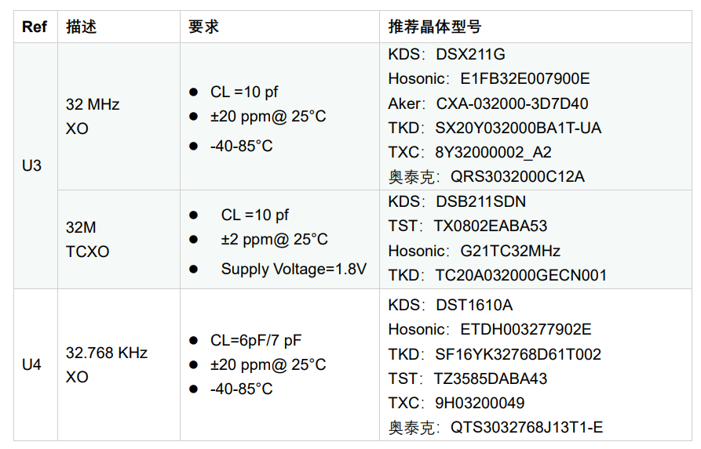
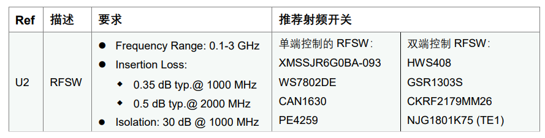
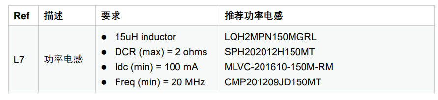

ASR6601 硬件设计指南
====================

前言
----

**关于本文档**

本文档旨在指导客户进行 IoT LPWAN SoC 芯片 ASR6601 的硬件设计，包括原理图参考设计，layout 注意事项，以及重要物料选型和替换。

**产品型号**

与本文档相对应的产品型号如下：

+-----------+-----------+----------+-----------------------------+---------------+---------------+
| **型号**  | **Flash** | **SRAM** | **内核**                    | **封装**      | **频率**      |
+===========+===========+==========+=============================+===============+===============+
| ASR6601SE | 256 KB    | 64 KB    | 32-bit 48 MHz ARM STAR      | QFN68, 8*8 mm | 150 ~ 960 MHz |
+-----------+-----------+----------+-----------------------------+---------------+---------------+
| ASR6601CB | 128 KB    | 16 KB    | 32-bit 48 MHz ARM STAR      | QFN48, 6*6 mm | 150 ~ 960 MHz |
+-----------+-----------+----------+-----------------------------+---------------+---------------+

**版权公告**

版权归 © 2021 翱捷科技股份有限公司所有。保留一切权利。未经翱捷科技股份有限公司的书面许可，不得以任何形式或手段复制、传播、转录、存储或翻译本文档的部分或所有内容。

**商标声明**

ASR、翱捷和其他翱捷商标均为翱捷科技股份有限公司的商标。

本文档提及的其他所有商标名称、商标和注册商标均属其各自所有人的财产，特此声明。

**免责声明**

翱捷科技股份有限公司对本文档内容不做任何形式的保证，并会对本文档内容或本文中介绍的产品进行不定期更新。

本文档仅作为使用指导，本文的所有内容不构成任何形式的担保。本文档中的信息如有变更，恕不另行通知。

本文档不负任何责任，包括使用本文档中的信息所产生的侵犯任何专有权行为的责任。

**翱捷科技股份有限公司**

地址：上海市浦东新区科苑路 399 号张江创新园 10 号楼 9 楼 邮编：201203

官网：http://www.asrmicro.com/asrweb/

**文档修订历史**

+----------+------------+-----------------------------------------------------------------------------------------------------------------------+
| **日期** | **版本号** | **发布说明**                                                                                                          |
+==========+============+=======================================================================================================================+
| 2020.09  | V1.0.0     | 首次发布。                                                                                                            |
+----------+------------+-----------------------------------------------------------------------------------------------------------------------+
| 2020.11  | V1.0.1     | 更新图片。                                                                                                            |
+----------+------------+-----------------------------------------------------------------------------------------------------------------------+
| 2020.12  | V1.0.2     | 更新 ASR6601 模组接口的相关描述。更正原理图中 I2C_CLK 和 I2C_DAT 的标号。更新 ASR6601 QFN48 和 QFN68 封装的相关内容。 |
+----------+------------+-----------------------------------------------------------------------------------------------------------------------+
| 2021.05  | V1.1.0     | 更新第 1 章概述部分的内容，以避免歧义。更新表 3-1 晶振推荐选型。                                                      |
+----------+------------+-----------------------------------------------------------------------------------------------------------------------+

\1. 概述
--------------

ASR6601 是一款通用的 Sub-GHz 无线通讯 SoC 芯片, 该芯片集成了 Sub-GHz 射频收发器和 32 位的 RISC MCU。该芯片 Sub-GHz 射频收发器不仅支持 LoRa 调制，还支持 (G)FSK 和 G(MSK) 等调制方式。CPU 为 ARM STAR，工作频率最大支持 48 MHz，支持 3 x I2C，1 x I2S，4 x UART，1 x LPUART，1 x SWD，3 x SPI，1 x 12-bit SAR ADC 和 1 x 12-bit DAC 等丰富的外设和接口。

ASR6601 的频率覆盖 150 MHz-960 MHz 的连续频段，可以支持世界上主要的 Sub-GHz 的 ISM 频段。芯片中集成的高效 PA 使其最大发射功率搞到 22 dBm，接收电流为 4.6 mA，最大的灵敏达到 -148 dBm，Deep Sleep 模式下的休眠电流低至 1.6 uA，可以大大延长电池寿命，该芯片有 QFN48 和 QFN68 两种封装，两种封装大小分别为 6x6 mm 和 8x8 mm。ASR6601 上述特性使其适合超远距离、超低功耗和高性价比的 LPWAN 应用。

本文档旨在指导客户进行 ASR6601 的硬件设计，包括原理图参考设计，layout 注意事项，以及重要物料选型和替换。

2. ASR6601 硬件设计
------------------

2.1 ASR6601 方框图
~~~~~~~~~~~~~~~~~~

|image1|

2.2 ASR6601 主要特色
~~~~~~~~~~~~~~~~~~~

-  Up to 42 configurable GPIOs: 3 x I2C, 1 x I2S, 4 x UART, 1 x LPUART, 1 x SWD, 3 x SPI, 1 x QSPI and 2 x WDG

-  4 x GPtimer, 2 x Basic Timer, 2 x LP timer and 1 x Sys Ticker

-  48 MHz ARM STAR CPU

-  4-channel DMA engine x 2

-  Embedded 12-bit 1 Msps SAR ADC

-  Embedded 12-bit DAC

-  Embedded 3 x OPA

-  Embedded 2 x Low Power Comparator

-  Embedded LCD driver

-  Embedded LD, TD, VD and FD

-  Supports AES, DES, RSA, ECC, SHA and SM2/3/4

2.3 ASR6601 模组参考设计
~~~~~~~~~~~~~~~~~~~~~~~

2.3.1 ASR6601CB QFN48 模组参考设计
^^^^^^^^^^^^^^^^^^^^^^^^^^^^^^^^^^

|image2|

2.3.2 ASR6601SE QFN68 模组参考设计
^^^^^^^^^^^^^^^^^^^^^^^^^^^^^^^^^^

|image3|

关于 ASR6601 模组参考设计，注意事项如下：

\1. 请注意 ASR6601 客户模组参考电路默认的匹配网络为 470 MHz，如需其他频率的匹配网络，请参考文档：*《ASR6601_Matching（匹配网络）_V1.0》*。

\2. 特别注意 DC-DC 的上拉电感 L7（15 uH）必须用功率电感（2016封装），功率电感的具体要求，可参考本文档 *第 3 章物料选型指南*\ 。VR_PA 处的电感 L1（56 nH）建议选用 0402 封装，额定电流更大，对提升 TX 的发射功率有帮助。

\3. 在客户进行模组设计时，可以根据实际情况处理参考设计图中的 R1，R2，R3，R4和R7。上述参考设计图中加上这部分，只是为了方便测试。

\4. 32M 的晶体电路兼容了 XO 和 TCXO，客户可根据应用实际情况，选择用 XO 电路或者 TCXO 电路，从而可以简化电路。

\5. TVS 管 D1 和 D2 建议预留，主要是做 ESD 保护。如应用场景对 ESD 要求比较高，则需要加 D2。D2 对射频性能有影响，请务必选择电容小的 TVS 管。

\6. 如果 VDD_IN 用 VREG 供电， TX 的最大发射功率不超过 14 dBm；如果 VDD_IN 用 VDD_RF（3.3V）供电，TX 的最大发射功率可以达到 22 dBm。

\7. 模组参考设计原理图的 DSN 文件可以咨询 ASR 原厂。

2.4 ASR6601 电路解析
~~~~~~~~~~~~~~~~~~~

2.4.1 电源电路
^^^^^^^^^^^^^^

ASR6601 的电源分成三个部分：VDDD，VDDA 和 VDD_RF。\ *VDDD* 给 MCU 的数字部分供电，\ *VDDA* 给 MCU 的模拟部分（ADC）供电，\ *VDD_RF* 给射频部分供电。

ASR6601 内部 Regulator（REG PA）通过外部的上拉电感 L1 给 PA 的输出级 RFO 提供偏置。内部Regulator（REG PA）由芯片内部集成的 *DC-DC* 或 *LDO* 供电，DC-DC 和 LDO 由 *VDD_IN* 供电，VDD_IN 正常工作范围为 1.8-3.7 V，推荐电压为 *3.3 V*\ 。

.. raw:: html

   

|image4|

ASR6601 DC-DC 供电示意图

.. raw:: html

   

2.4.2 晶振电路
^^^^^^^^^^^^^^

ASR6601 Demo 模组用到两种晶振：

1. **32 MHz TCXO/XO for LoRa**\ ：

 a. 晶振负载电容为 10 pf。

 b. 如果带宽低于 62.5 KHz，强烈推荐使用 TCXO。

 c. SX1262 内部集成负载电容矩阵，内部负载电容矩阵采用默认参数，一般不建议改动。

 d. 如果频偏偏正，建议适当增加外接负载电容抵消频偏；如果频偏偏负，建议替换不同厂家 32 MHz 的晶振。

2. **32.768 KHz XO for MCU**\ ：

 a. 晶振的负载电容为 6 pf。

 b. ASR 参考模组 32.768K 晶体出的负载电容 NC。

 c. 外挂的负载电容根据晶体和 PCB 板的具体情况而做相应的调整。

.. raw:: html

   

|image5|

.. raw:: html

   

 

2.4.3 射频电路
^^^^^^^^^^^^^^

|image6|

关于 ASR6601 芯片的射频电路，有如下 5 点需要注意：

\1. 因为客户模组的PCB板布局和布线不同，所以要将模组射频匹配网络参数在默认参数的基础上进行微调，以优化射频性能。

\2. ASR6601客户模组参考设计原理图默认的匹配网络为470 MHz，如需其他频率的匹配网络，请参考文档：*《ASR6601\_ Matching（匹配网络）_V1.0》*。

\3. XMSSJR6G0BA 采用单端控制模式，pin6 为 TRSW 的 CTRL 信号接到 SX1262的DIO2，DIO2 的控制逻辑如下。注意不同的 RFSW 控制逻辑和管脚不一样，原理图设计时一定要参考对应 RFSW 的 Datasheet。

 a. DIO2 为高，RF2 -> TX

 b. DIO2 为低，RF1 -> RX

\4. GPIO10 接 TRSW 的 VDD pin，LoRa 芯片正常工作时，GPIO 为高。LoRa 芯片为 Sleep mode 时，GPIO 拉低关掉 TRSW，防止 TRSW 漏电（XMSSJR6G0BA 大概有 5 uA 的漏电），如果对功耗不敏感，GPIO 可以用作其他用途，VDD_RF 连到 RFSW 的 VDD 即可。

\5. RFSW 推荐使用 XMSSJR6G0BA，可以用替换料取代，替换后射频匹配网络的参数需要微调，具体可参考本文档 *第 3 章物料选型指南*\ 。

2.5 ASR6601 芯片封装
~~~~~~~~~~~~~~~~~~~

具体的PIN定义，请参考\ *《ASR6601 Datasheet》*\ 。

.. raw:: html

   

|image7|

ASR6601SE QFN68 管脚分布图

.. raw:: html

   

.. raw:: html

   

|image8|

ASR6601CB QFN48 管脚分布图

.. raw:: html

   

3. 物料选型指南
---------------

3.1 晶振
~~~~~~~~

|image9|

关于推荐供应商，可参见\ *《重点物料推荐表》*\ 。

3.2 射频开关
~~~~~~~~~~~~

|image10|

关于推荐供应商，可参见\ *《重点物料推荐表》*\ 。

3.3 功率电感
~~~~~~~~~~~~

若采用 DC-DC 给 Regulator（REG PA）供电，则功率电感 L6 必不可少，功率电感要求如下表所示。

|image11|

关于推荐供应商，可参见\ *《重点物料推荐表》*\ 。

3.4 外置天线
~~~~~~~~~~~~

在拉距测试中，天线的阻抗特性对测试结果影响较大，请根据实际应用选择合适的天线。

4. Layout 指导
--------------

4.1 电源走线
~~~~~~~~~~~~

关于 PCB 中的电源走线，需要注意下列事项：

\1. 电源最好加 2.2 uF 和 0.1 uF 电容滤波，来滤除低频和高频电源噪声。

\2. 电源线走线尽可能地宽，不应低于 18 mil，为了减少线间串扰，间距须符合 3W 规则。

\3. 电源线不要跨其他电源线和高频走线，避免对电源造成干扰。

\4. VDD_IN 的最大电流为 120 mA，需要使 VDD_IN 的走线可以承受 300 mA 的电流。

4.2 RF 走线
~~~~~~~~~~~

PCB 中的射频走线如下图所示，需要注意下列事项：

.. raw:: html

   

|image12|

.. raw:: html

   

\1. 射频匹配网络器件尽量靠近芯片放置。

\2. 射频线走在 top 层，不可穿层走线，传输线要求做 50 欧姆特征阻抗处理。

\3. 射频线不可以有 90° 直角和锐角走线，尽量使用 135° 角走线或圆弧走线。

\4. 射频线两旁的屏蔽地要尽量完整，第 2 层的 GND 要完整，天线和射频线周围尽量多打过孔。

\5. 射频线附近不能有高频信号线。射频上的天线必须远离所有传输高频信号的器件，比如晶体、UART、PWM、SDIO 等。

\6. RF 传输线特征阻抗为 50 欧姆，推荐 18 mil 线宽，14 mil 间距，具体根据 PCB 板层数和叠构调整（但宽度不应小于 12 mil）。走线和 SMA 天线连接处最好采用渐增线以降低阻抗突变。

4.3 晶体走线
~~~~~~~~~~~~

关于 PCB 中的晶体走线，需要注意下列事项：

\1. 晶体的时钟要在 top 层走线，不可以穿层和交叉，并且周围要用 GND 屏蔽。

\2. 晶体的下面不可以走高速信号线，第2层要求有完整的 GND。

\3. 晶体的负载电容尽量放置到时钟线末端。

\4. 晶体的周围不要放置磁性元件，如电感、磁珠等。

\5. 晶体表层的铜皮要挖空，防止周边器件的热量传导到晶体产生温漂。

.. |image1| image:: img/6601_硬件设计/图2-1.png
.. |image2| image:: img/6601_硬件设计/图2-2.png
.. |image3| image:: img/6601_硬件设计/图2-3.png
.. |image4| image:: img/6601_硬件设计/图2-4.png
.. |image5| image:: img/6601_硬件设计/图2-5.png
.. |image6| image:: img/6601_硬件设计/图2-6.png
.. |image7| image:: img/6601_硬件设计/图2-7.png
.. |image8| image:: img/6601_硬件设计/图2-8.png

.. |image12| image:: img/6601_硬件设计/图4-1.png
