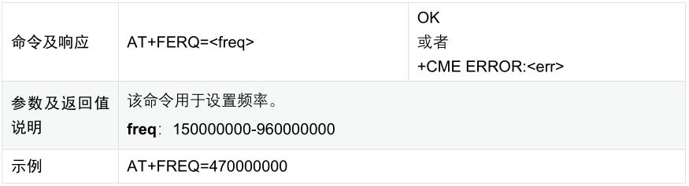
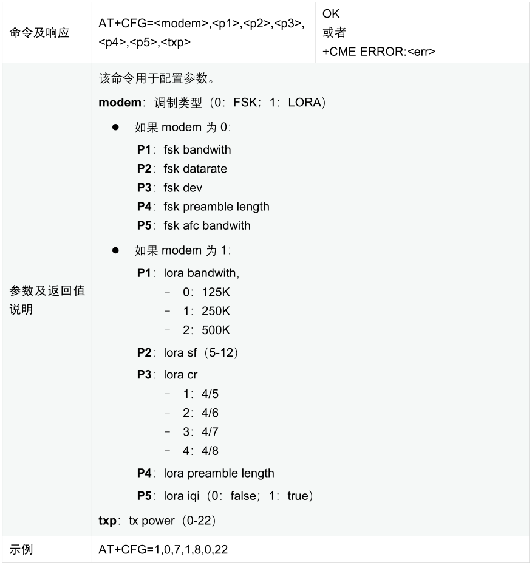
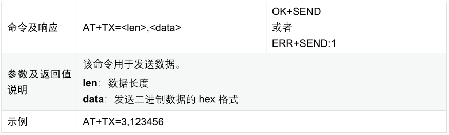
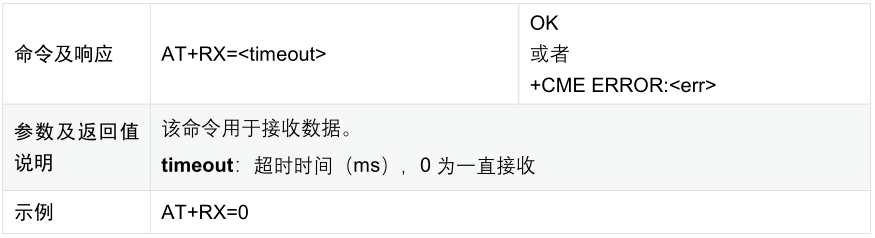
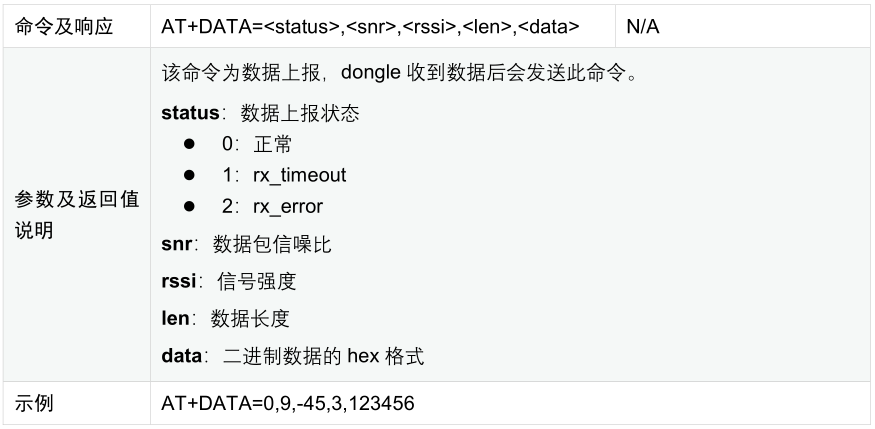
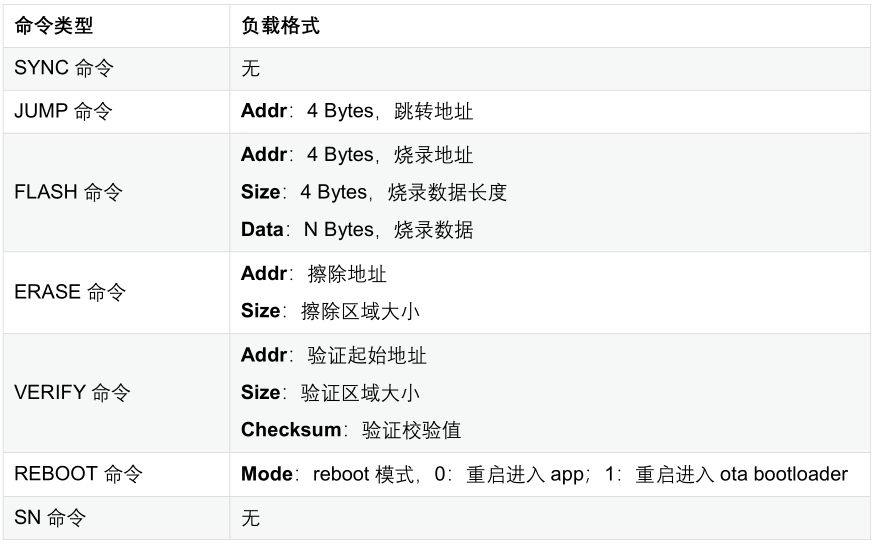

.. role:: raw-latex(raw)
   :format: latex
..

ASR6601 OTA 升级说明
====================

前言
----

**关于本文档**

本文档主要对 IoT LPWAN SoC 芯片 ASR6601 SDK 中的 OTA 升级 Demo 程序进行说明。

**产品型号**

与本文档相对应的产品型号如下：

+-----------+-----------+----------+-----------------------------+---------------+---------------+
| **型号**  | **Flash** | **SRAM** | **内核**                    | **封装**      | **频率**      |
+===========+===========+==========+=============================+===============+===============+
| ASR6601SE | 256 KB    | 64 KB    | 32-bit 48 MHz ARM STAR      | QFN68, 8*8 mm | 150 ~ 960 MHz |
+-----------+-----------+----------+-----------------------------+---------------+---------------+
| ASR6601CB | 128 KB    | 16 KB    | 32-bit 48 MHz ARM STAR      | QFN48, 6*6 mm | 150 ~ 960 MHz |
+-----------+-----------+----------+-----------------------------+---------------+---------------+

**版权公告**

版权归 © 2021 翱捷科技股份有限公司所有。保留一切权利。未经翱捷科技股份有限公司的书面许可，不得以任何形式或手段复制、传播、转录、存储或翻译本文档的部分或所有内容。

**商标声明**

ASR、翱捷和其他翱捷商标均为翱捷科技股份有限公司的商标。

本文档提及的其他所有商标名称、商标和注册商标均属其各自所有人的财产，特此声明。

**免责声明**

翱捷科技股份有限公司对本文档内容不做任何形式的保证，并会对本文档内容或本文中介绍的产品进行不定期更新。

本文档仅作为使用指导，本文的所有内容不构成任何形式的担保。本文档中的信息如有变更，恕不另行通知。

本文档不负任何责任，包括使用本文档中的信息所产生的侵犯任何专有权行为的责任。

**翱捷科技股份有限公司**

地址：上海市浦东新区科苑路 399 号张江创新园 10 号楼 9 楼 邮编：201203

官网：http://www.asrmicro.com/asrweb/

**文档修订历史**

+----------+------------+-----------------------------------------------------------+
| **日期** | **版本号** | **发布说明**                                              |
+==========+============+===========================================================+
| 2020.06  | V0.1.0     | 首次发布。                                                |
+----------+------------+-----------------------------------------------------------+
| 2020.10  | V0.2.0     | 更新 1.1 节的硬件连接示例图。                             |
+----------+------------+-----------------------------------------------------------+
| 2021.01  | V1.1.0     | 删除第 1 章的概述，将其内容合并到前言 “关于本文档” 部分。 |
+----------+------------+-----------------------------------------------------------+
| 2021.06  | V1.2.0     | 在 1.1 节中增加已验证过的 Android 手机型号。              |
+----------+------------+-----------------------------------------------------------+

1. 准备
-------

1.1 硬件准备
~~~~~~~~~~~~

必需硬件列表如下：\

-  ASR6601 demo 板 2 个
-  天线 2 根
-  USB 线 2 根
-  USB 转接头 1 个
-  Android 手机 1 台，已验证通过的 Android 手机型号如下：\

   -  华为 Mate 20 Pro，Android 版本 10，EMUI 版本 11.0.0
   -  华为 nova，Android 版本 10，EMUI 版本 11.0.0
   -  华为 麦芒 6，Android 版本 8，EMUI 版本 8.0.0
   -  小米 MIX 2S，Android 版本 9，MIUI 版本 11.0.3

-  PC 机 1 台

.. raw:: html

   

|image1|

手机端连接图

.. raw:: html

   

.. raw:: html

   

|image2|

目标板连接图

.. raw:: html

   

1.2 软件准备
~~~~~~~~~~~~

1.2.1 OTA Dongle 软件准备
^^^^^^^^^^^^^^^^^^^^^^^^^

OTA dongle 代码在 *projects\\${DEMO_BOARD}\\examples\\ota\\dongle* 目录下，其中 *${DEMO_BOARD}* 为 OTA dongle 的板子名称，如 ASR6601SE-EVAL 对应为 ASR6601SE 开发板，ASR6601CB-EVAL 对应为 ASR6601CB 开发板。

将对应代码编译并烧录到 OTA dongle 板。

1.2.2 目标板软件准备
^^^^^^^^^^^^^^^^^^^^

目标板软件分为两部分：OTA bootloader 和 app 代码。

(1) **OTA bootloader**

    OTA bootloader 代码在 *projects\\${DEMO_BOARD}\\examples\\ota\\bootloader* 目录下，其中 *${DEMO_BOARD}* 为目标板的板子名称，如 ASR6601SE-EVAL 对应为 ASR6601SE 开发板，ASR6601CB-EVAL 对应为 ASR6601CB 开发板。将对应代码编译并烧录到目标板的 *0x08000000* 地址。

(2) **APP**

    App 代码就是最终要升级的代码，使用任意代码均可，在本文档中，使用 **uart_printf** 工程作为示例。

    修改 *uart_printf* 工程的 *gcc.ld* 文件，将 *FLASH* 起始地址修改为 *0x0800D000*\ ，并编译修改后的工程，编译完成后，将生成的工程文件，复制到手机上。

.. raw:: html

   

|image3|

链接描述文件

.. raw:: html

   

1.2.3 手机端准备
^^^^^^^^^^^^^^^^

LoRa OTA APP 对应代码在 *projects\\ASR6601SE-EVAL\\examples\\ota\\android\_app* 目录下（APP 没有板子区分，ASR6601SE-EVAL 和 ASR6601CB-EVAL 目录下的代码相同）。

把 **apk 包** 拷贝到手机上，然后进行安装。

2. 升级过程
-----------

2.1 使目标板进入 OTA bootloader
~~~~~~~~~~~~~~~~~~~~~~~~~~~~~~~

按住目标板的 SW1 按钮，然后重启，使目标板进入 OTA bootloader。

|image4|

 

2.2 打开 APP
~~~~~~~~~~~~

使用 USB 转接头连接手机和 OTA dongle 后，打开 APP，界面显示如下图：

.. raw:: html

   

|image5|

.. raw:: html

   

**注**\ ：连接 OTA dongle 时，如果出现下图中的 USB 设备访问提示，请点 “确认”：

.. raw:: html

   

|image6|

.. raw:: html

   

关于上图中的红色标注，说明如下：

-  标注为 **1** 的区域为显示 OTA 升级过程中的信息。
-  标注为 **2** 的按钮为选择升级文件的按钮。
-  标注为 **3** 的地方为进度条，表示 OTA 的进度。
-  标注为 **4** 的按钮为开始进行 OTA 升级的按钮。

2.3 选择升级文件
~~~~~~~~~~~~~~~~

(1) 点击主界面中的 “SELECT FILE” 按钮，出现如下文件浏览界面：

.. raw:: html

   

|image7|

.. raw:: html

   

(2) 进入到 bin 所在的目录，选择 bin 文件。如下图所示：

.. raw:: html

   

|image8|

.. raw:: html

   

(3) 选择 bin 文件之后，返回主界面，界面会有已选中升级文件的提示：

.. raw:: html

   

|image9|

.. raw:: html

   

2.4 开始升级
~~~~~~~~~~~~

(1) 点击 “START” 按钮开始升级：

.. raw:: html

   

|image10|

.. raw:: html

   

(2) 升级成功后，APP 提示 “OTA: done”，同时，目标板端打印：\ ``hello world``

.. raw:: html

   

|image11|

.. raw:: html

   

3. OTA dongle AT命令说明
------------------------

3.1 AT命令一览
~~~~~~~~~~~~~~

.. raw:: html

   

======== ====================
**命令** **说明**
======== ====================
AT+FREQ  设置频率
AT+CFG   配置参数
AT+TX    发送数据
AT+RX    进入接收模式
AT+DATA  收到数据后，上报数据
======== ====================

.. raw:: html

   

3.2 AT命令描述
~~~~~~~~~~~~~~

3.2.1 AT+FREQ
^^^^^^^^^^^^^

|image12|

3.2.2 AT+CFG
^^^^^^^^^^^^

|image13|

3.2.3 AT+TX
^^^^^^^^^^^

|image14|

3.2.4 AT+RX
^^^^^^^^^^^

|image15|

3.2.5 AT+DATA
^^^^^^^^^^^^^

|image16|

4. OTA bootloader命令说明
-------------------------

4.1 命令一览
~~~~~~~~~~~~

.. raw:: html

   

======== ============ ==========================
**命令** **命令编号** **说明**
======== ============ ==========================
SYNC     1            SYNC命令，判断是否连接正常
JUMP     2            跳转命令
FLASH    3            烧录命令
ERASE    4            擦除命令
VERIFY   5            验证命令
REBOOT   12           重启命令
SN       13           读序列号命令
======== ============ ==========================

.. raw:: html

   

4.2 命令格式
~~~~~~~~~~~~

4.2.1 请求
^^^^^^^^^^

|image17|

其中，Command为命令编号，Checksum算法为CRC32。

4.2.2 应答
^^^^^^^^^^

|image18|

4.3 命令负载格式
~~~~~~~~~~~~~~~~

|image19|

.. |image1| image:: img/6601_空中升级/图1-1.png
.. |image2| image:: img/6601_空中升级/图1-2.png
.. |image3| image:: img/6601_空中升级/图1-3.png
.. |image4| image:: img/6601_空中升级/图2-1.png
.. |image5| image:: img/6601_空中升级/图2-2.png
.. |image6| image:: img/6601_空中升级/图2-3.png
.. |image7| image:: img/6601_空中升级/图2-4.png
.. |image8| image:: img/6601_空中升级/图2-5.png
.. |image9| image:: img/6601_空中升级/图2-6.png
.. |image10| image:: img/6601_空中升级/图2-7.png
.. |image11| image:: img/6601_空中升级/图2-8.png

.. |image17| image:: img/6601_空中升级/图4-1.png
.. |image18| image:: img/6601_空中升级/图4-2.png

