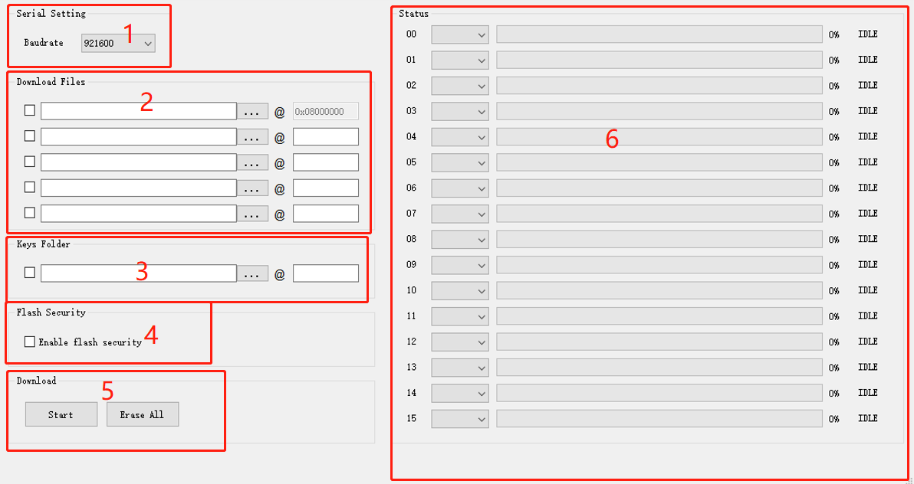
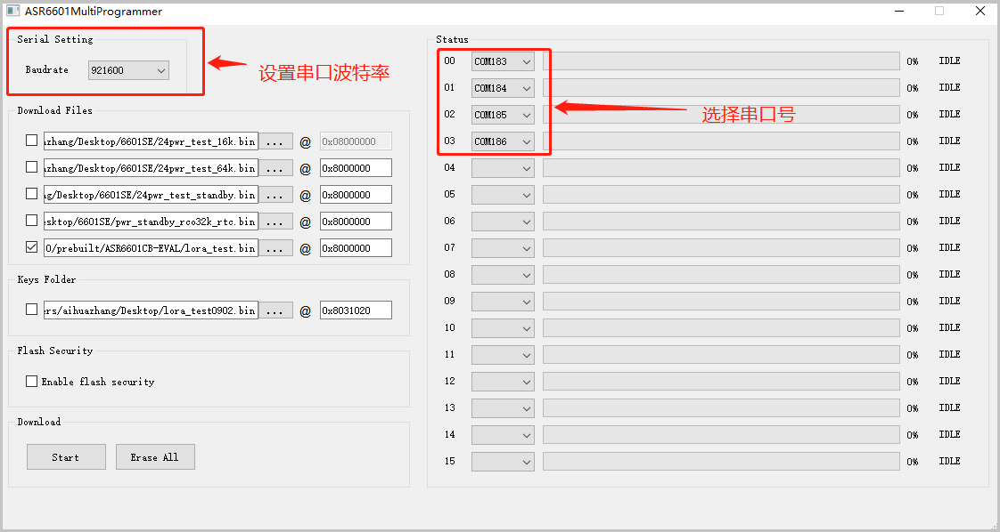
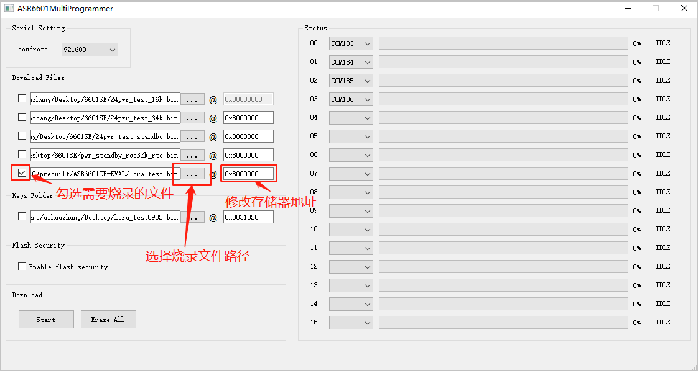
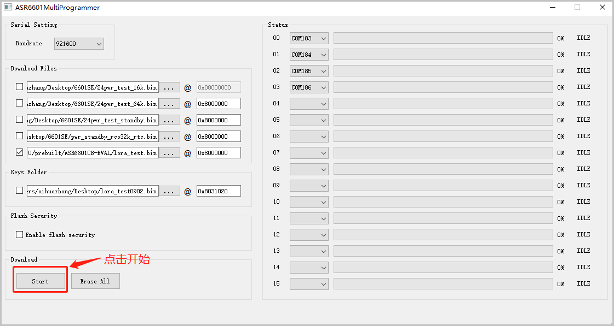
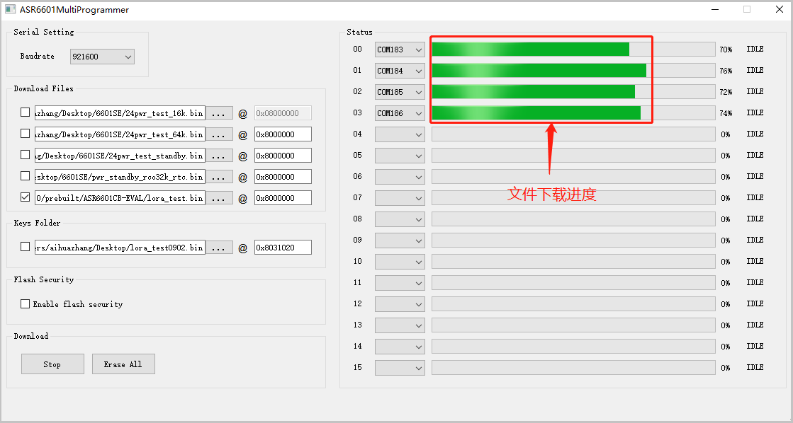
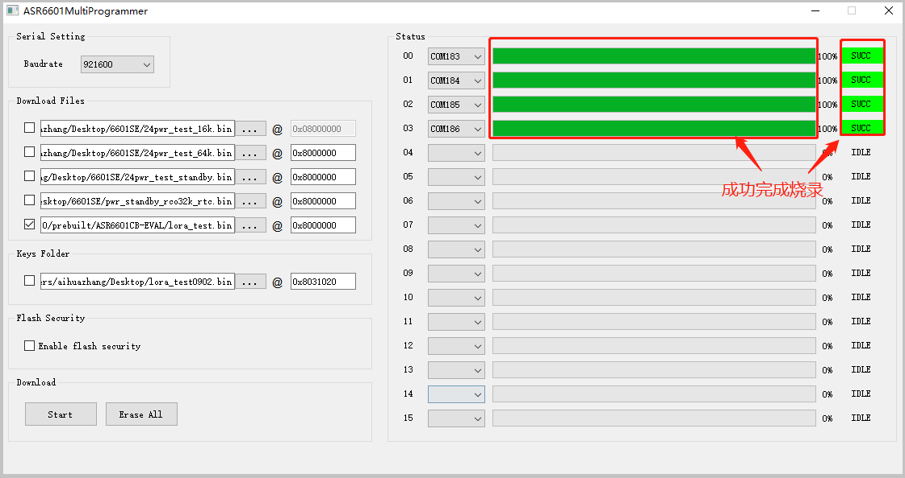
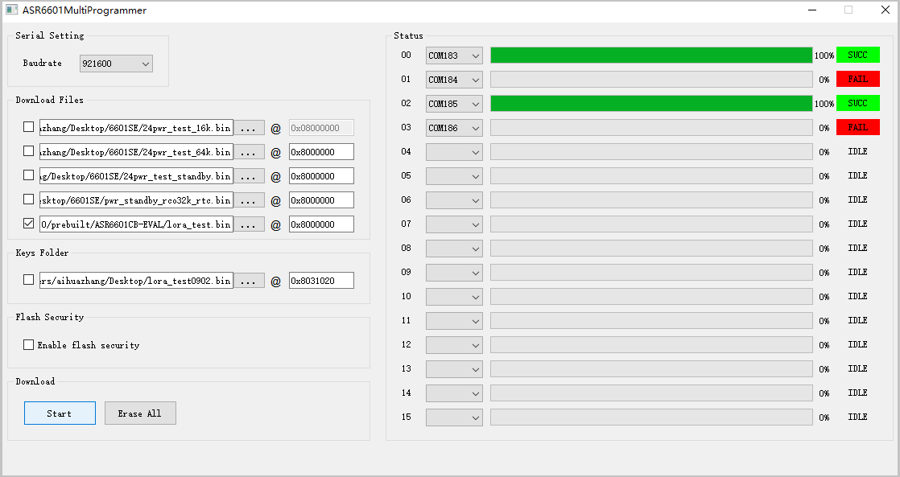

ASR6601 量产烧录工具使用说明
============================

前言
----

**关于本文档**

本文档主要对 ASR6601 的烧录工具（适用于 V0.3 及以上版本的烧录工具）进行说明，方便客户使用该工具进行 ASR6601 的 Flash 烧录等。注意，ASR6601MultiProgrammer 烧录工具仅适用于 64 位系统。

**产品型号**

与本文档相对应的产品型号如下：

+-----------+-----------+----------+------------------------+---------------+---------------+
| **型号**  | **Flash** | **SRAM** | **内核**               | **封装**      | **频率**      |
+===========+===========+==========+========================+===============+===============+
| ASR6601SE | 256 KB    | 64 KB    | 32-bit 48 MHz ARM STAR | QFN68, 8*8 mm | 150 ~ 960 MHz |
+-----------+-----------+----------+------------------------+---------------+---------------+
| ASR6601CB | 128 KB    | 16 KB    | 32-bit 48 MHz ARM STAR | QFN48, 6*6 mm | 150 ~ 960 MHz |
+-----------+-----------+----------+------------------------+---------------+---------------+

**版权公告**

版权归 © 2021 翱捷科技股份有限公司所有。保留一切权利。未经翱捷科技股份有限公司的书面许可，不得以任何形式或手段复制、传播、转录、存储或翻译本文档的部分或所有内容。

**商标声明**

ASR、翱捷和其他翱捷商标均为翱捷科技股份有限公司的商标。

本文档提及的其他所有商标名称、商标和注册商标均属其各自所有人的财产，特此声明。

**免责声明**

翱捷科技股份有限公司对本文档内容不做任何形式的保证，并会对本文档内容或本文中介绍的产品进行不定期更新。

本文档仅作为使用指导，本文的所有内容不构成任何形式的担保。本文档中的信息如有变更，恕不另行通知。

本文档不负任何责任，包括使用本文档中的信息所产生的侵犯任何专有权行为的责任。

**翱捷科技股份有限公司**

地址：上海市浦东新区科苑路399号张江创新园10号楼9楼 邮编：201203

官网：http://www.asrmicro.com/

**文档修订历史**

=================== ==================== ===============================================================
**日期**              **版本号**              **发布说明**
=================== ==================== ===============================================================
2021.11             V1.0.0               首次发布。
=================== ==================== ===============================================================

1. 软件说明
-----------

ASR6601MultiProgrammer 程序主界面如下：

.. raw:: html

   

|image1|

.. raw:: html

   

ASR6601MultiProgrammer 程序界面主要包含 **6** 个区域：

**1. 串口配置区域**\ ：主要用来设置通信串口波特率。

**2. 下载文件配置区域**\ ：主要用来配置下载文件的位置和下载地址，至少要有 1 个文件下载到 0x08000000，以确保程序可以执行。

**3. 下载密钥配置区域**\ ：下载序列号配置信息。

**4. Flash 保护区域**\ ：开启 Flash 保护，不需要点击擦除按钮。

**5. 下载操作区域**\ ：有下载开始和擦除按钮，当需要全部擦除 Flash 时才需要点擦除按钮，其余单纯下载文件，不需要点击擦除按钮。

**6. 状态显示区域**\ ：显示下载成功或失败的状态等信息。

2. 操作说明
-----------

2.1 进入下载模式
~~~~~~~~~~~~~~~~

进入烧录下载前，使板子 GPIO02 拉高（GPIO02 接 VCC3.3），然后再上电，使板子进入下载模式。

.. raw:: html

   

|image2|

.. raw:: html

   

2.2 Flash 烧录
~~~~~~~~~~~~~~

使用 ASR6601MultiProgrammer 工具进行 ASR6601 Flash 烧录的步骤如下：

(1) 选择串口：

.. raw:: html

   

|image3|

.. raw:: html

   

(2) 配置下载文件：

.. raw:: html

   

|image4|

|image5|

.. raw:: html

   

(3) 点击 *Start* 按钮进行烧录：

.. raw:: html

   

|image6|

|image7|

.. raw:: html

   

(4) 烧录完成：

.. raw:: html

   

|image8|

.. raw:: html

   

3. Q&A
------

3.1 烧录FAIL是什么原因造成的？
~~~~~~~~~~~~~~~~~~~~~~~~~~~~~~

出现模组/板子没能正常烧录完成的情况时，需排查下列原因：

(1) 检查串口连接是否正常。

(2) 尝试交叉验证，排查模组/板子本身是否异常。

(3) 检查模组/板子是否进入下载模式，可尝试重新拉高 GPIO02，同步 Reset 复位重启。

.. raw:: html

   

|image9|

.. raw:: html

   

.. |image2| image:: img/6601_量产烧录工具/图2-1.png

.. |image5| image:: img/6601_量产烧录工具/图2-4.png

